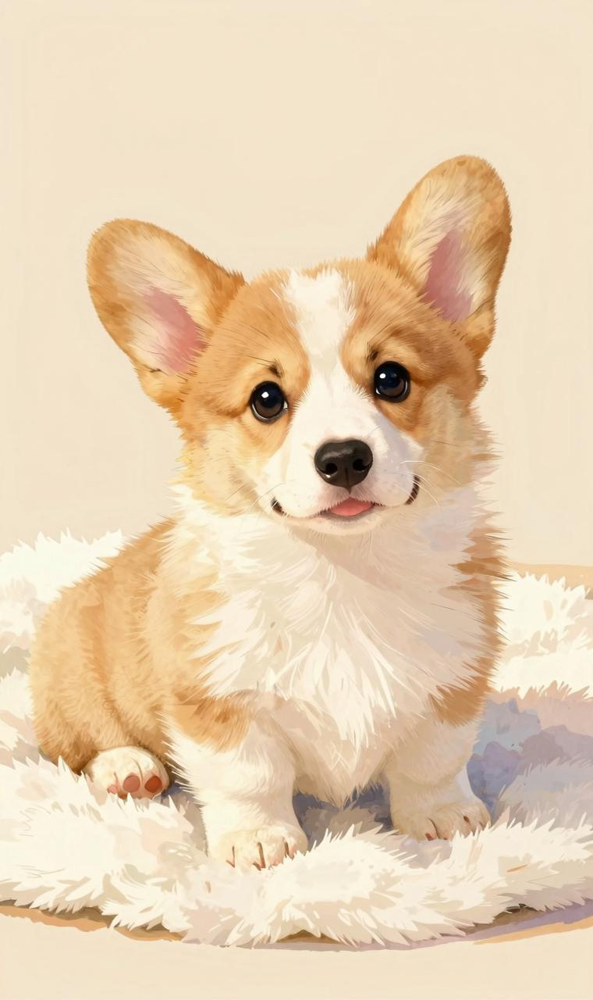
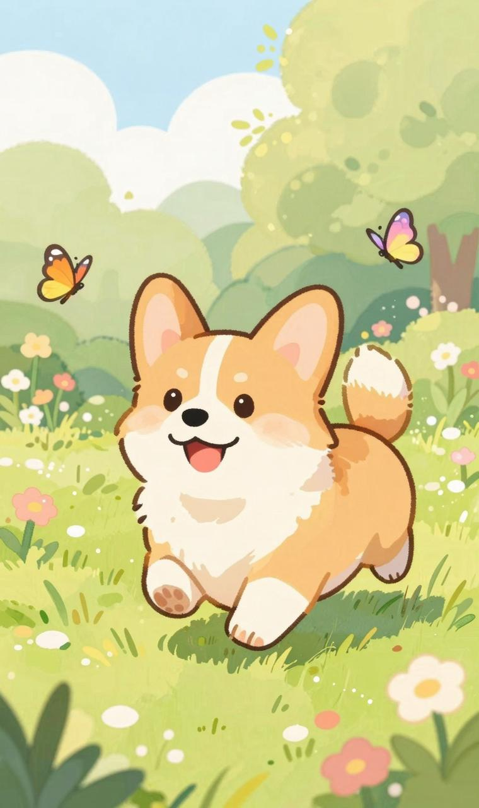

我的多乐宝贝今年6岁啦！

很开心把你从三个月大养到现在这么大，一想到你从毛茸茸的样子长到现在的小霸王样子，时间过得可真快呀。

你小时候脾气就不怎么好，一关笼子就叫，不给吃的也叫，但是很聪明，学本领也快，定点上厕所，学习坐下握手趴下躺都很快。你在我独自工作的时候就陪伴我了，每天给你弄饭，带你遛弯，让我觉得很快乐充实。

后来把你带到了北京，你收获了更多人的宠爱，养你就像养一个孩子，你的脾气不好，总是跟小狗打架，也很独，在外面不允许妈妈摸别的小狗，甚至是别的小孩，性格也像猫一样，下班回家也不会天天出来迎接，想接就接，不想接就摆烂，全凭自己心意。

我嘴巴上说着你的很多缺点，但其实我知道，这样子的你最自在，想干什么就干什么，不需要规矩约束，你不出来迎接妈妈，我也不会生气，我知道你很有安全感。吃不到东西，喝不到酸奶你就呜呜呜让家里人给你拿，妈妈很高兴，你可以表达自己的需求。

妈妈对你也没有多余的要求，你贪吃没关系，咬狗也没关系，脾气不好也没关系，胆小也没关系，妈妈会保护你，只希望你能平安健康就好，能陪我们久一点，再久一点。

生日快乐，我的大宝贝！
