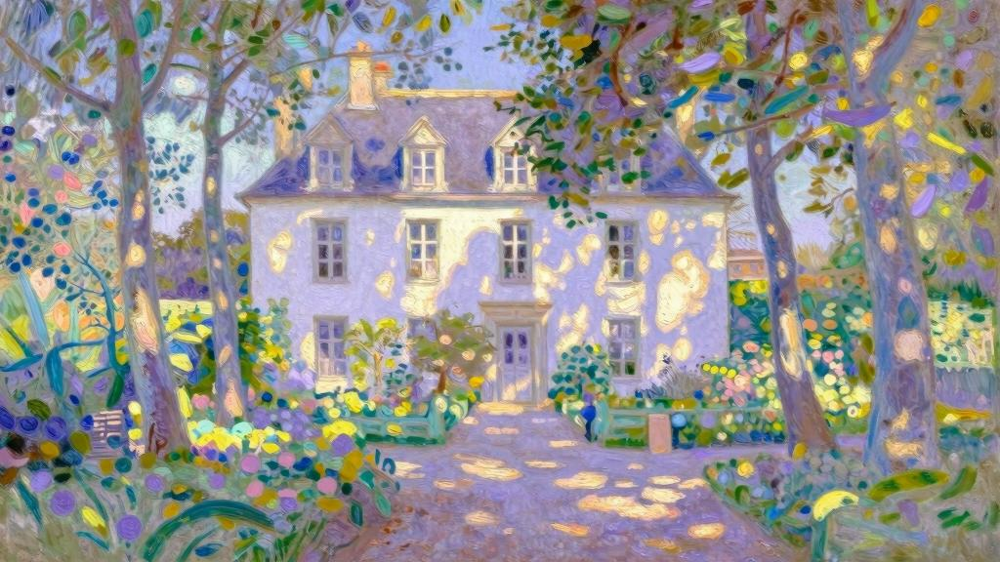
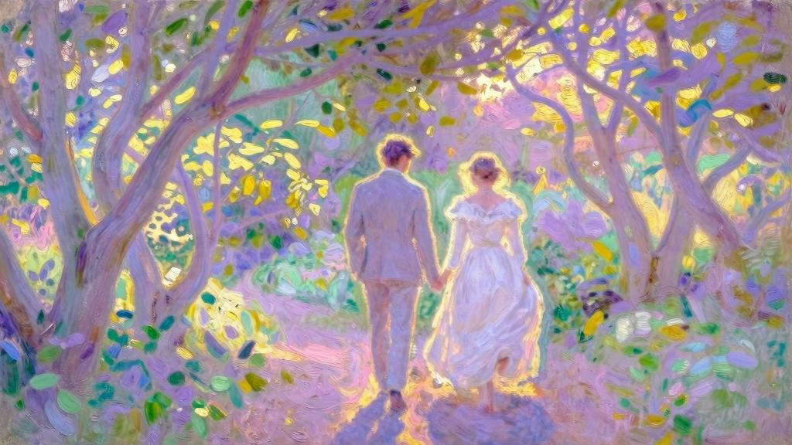
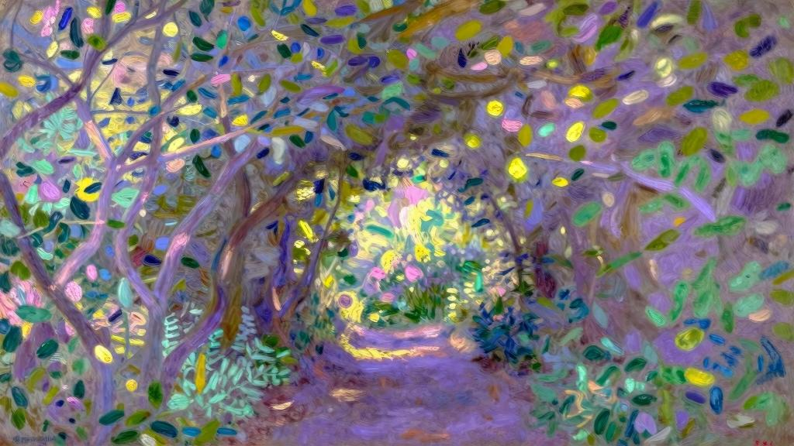

我在这里讲的故事，换作别人可以写成一本书。然而，我在这“故事”里不遗余力地活过，倾尽了所有德行，所以仅仅将回忆记录下来。往事断断续续，支离破碎，但我不打算靠虚构事实连通补缀，这种修饰铺陈，会浇灭讲述的热忱，最后一丝意趣也化为乌有。

父亲过世那年我还不到十二岁。母亲不愿留在父亲生前行医的勒阿弗尔，决定移居巴黎，以便我能更好地完成学业，她在卢森堡公园附近租下一套小公寓。弗洛拉·阿斯布尔顿小姐搬来与我们同住，她的家人早已不在，早些年她当过母亲的家庭教师，之后她们一直相互陪伴，很快成为挚友。这两位女性一样沉静，一样忧郁。生活在她们身边，记忆所及，只有穿着丧服的模样。一天早上，想来距离父亲去世已经很久，母亲把一根藕荷饰带系在帽檐上，替换之前黑色的那根。

“啊，妈妈！”我大喊道，“你戴这个颜色太难看了！”第二天，她又换上了黑色饰带。

我身体孱弱。母亲和阿斯布尔顿小姐为此操碎了心，百般呵护，生怕我累着。幸好我热爱学习，才不至于变成懒汉。一到日暖风和的季节，她们便觉得我脸色苍白，没有血色，于是串通一气，劝我离开城市。所以六月中旬，我们会一起前往勒阿弗尔附近的芬格斯玛尔农庄，舅舅布科兰住在那里，每年夏天都接待我们。

布科兰家的白色三层小楼，与大多数乡村农舍并无二致。它坐落于一个不怎么大，也不太漂亮的花园里，相比起诺曼底地区的其他花园，并无特色。房子朝东，正对花园，前后各开二十多扇大窗，左右两侧只有墙壁。前后的窗户上镶着小块方格玻璃，有几块是新换的，在灰绿色旧玻璃的衬托下，显得格外明亮。有些玻璃还有瑕疵，就是长辈们所说的“气孔”，透过这些玻璃向外看，树木是变形的，经过的邮差看上去也像突然驼背了一样。

花园呈长方形，四周砌着围墙。布科兰家的小楼前面，有一块相当大的草坪，绿荫如盖，一圈砾石铺就的小径围绕四周。正对小楼那侧的花园围墙矮了一截，露出环绕四周的农场院子。一条山毛榉林荫道界定了农庄范围，这是当地常见的分界方式。

小楼朝西的背面更加自在惬意。南墙边的果树架前，有一条开满鲜花的小径，浓密的葡萄牙桂樱和几株小树为它遮挡海风；沿北墙也有一条小径——隐没在苍翠茂林之中，我的表姐妹管它叫“黑暗小道”，黄昏之后，没人敢去冒险。顺着两条小径走下几个台阶，紧挨着花园，能看到低处的菜圃。菜圃尽头的围墙上开有一扇小暗门，墙外是一片矮树林，左右两边的山毛榉大道在这里交会。站在西面的台阶上，目光越过矮树林，看到一片高地，可以欣赏庄稼丰收的景致。地平线不远处，能看到小村庄里的一座教堂，清幽的傍晚，几缕炊烟从村舍屋顶袅袅升起。

宜人的夏日黄昏，我们饭后便去“花园低处”游玩。从小暗门出去，来到林荫道，舅舅、母亲和阿斯布尔顿小姐在一条长椅上坐下，那里靠近废弃泥灰岩矿场的茅草屋顶，能够俯瞰田野景色。眼前的小山谷薄雾缭绕，夕阳的余晖把远处树林的上空染成金黄。不久，暮色渐浓，我们仍在花园深处舍不得离开。舅妈几乎从不和我们一起出去，每次我们从花园回来，她都在客厅里……对我们这群孩子来说，夜晚的活动到此结束。不过，回到卧室后往往还会看会儿书，再过会儿就能听到长辈们上楼的声音。

除了花园，一天里剩下的时光我们都在“学习室”里度过。那原本是舅舅的书房，里面摆了几张小学生课桌。我和表弟罗贝尔并排学习，后面坐着朱莉叶特和阿莉莎。阿莉莎比我大两岁，朱莉叶特比我小一岁。我们四人之中，罗贝尔年纪最小。

我在这里想写的，并非最初的往事，只是一些与我要说的故事有关的记忆。可以说，故事正是从父亲去世那年开始的。也许是丧事或哀伤所致，至少是受母亲的伤恸感染——敏感的神经受到刺激，使我过早成熟了。那一年，我们再次来到芬格斯玛尔农庄，看到朱莉叶特和罗贝尔时，我觉得他们越发显得稚气，而看到阿莉莎时，才猛然意识到，我们两个都不再是孩子了。

没错，正是父亲去世那年。我们刚到农庄，母亲和阿斯布尔顿小姐的一番谈话证实了这一点。我无意闯入房间，听到她们在议论舅妈。母亲很生气，埋怨舅妈没有戴孝或者过早脱下丧服（老实说，露希尔·布科兰舅妈穿丧服，和我母亲穿亮色衣裙一样，于我而言难以想象）。记得是我们到达山庄那天，舅妈穿了一袭轻薄的裙装。

阿斯布尔顿小姐一向与人为善，她极力劝解母亲，小心翼翼地说道：“不管怎么说，白色也算丧服吧。”“她肩上的红色披肩呢，这也叫‘丧服’吗？弗洛拉，你别气我了！”母亲大嚷道。

只有在假期时我才会看到舅妈。酷暑的缘故，她总穿着单薄的衬衣，领口开得很低。比起搭在光溜溜肩上的红披肩，母亲更反感这种袒胸露肩的装扮。

露希尔·布科兰很漂亮。我留有一张她的小像，可以窥见她当年的美貌。画像里的她看起来特别年轻，像是女儿们的姐姐：她习惯性地侧身坐着，左手托着微倾的脑袋，纤纤小指贴在唇边俏皮地弯曲着；一副粗眼发网兜住半泻在颈背的浓密卷发；衬衫的领口处，露出宽松的黑丝绒颈圈，上面挂着纹有意大利镶嵌画的椭圆颈饰；黑丝绒腰带上绾了个飘逸的大花结；一顶宽边软草帽用帽绳系在她的椅背上，为她平添几分稚气；她垂下的右手里，还拿着一本合拢的书。

露希尔·布科兰是克里奥尔人。她从没见过父母，又或者很早失去了双亲。母亲后来告诉我，她是个孤儿，抑或弃儿，沃蒂埃牧师夫妇那时还没有孩子，就收养了她。后来他们离开马提尼克岛，一起来到勒阿弗尔，布科兰一家也住在这里，两家人交往密切。舅舅当时在国外的一家银行工作，三年后回到家乡，第一次见到小露希尔便爱上了她，立刻向她求婚。为此，他的父母和我母亲都很难过。那年露希尔十六岁，其实收养她之后，沃蒂埃太太又生下两个孩子，养女的性格越来越古怪，她担心会带坏自己的孩子，再加上他们家庭收入微薄……这些都是母亲告诉我的，她想让我明白这就是沃蒂埃一家愉快地答应这桩婚事的原因。此外我推测，年轻的露希尔也让沃蒂埃夫妇非常忧虑。我十分了解勒阿弗尔的民风，不难想象当地人会用什么态度来面对这个撩人绮思的姑娘。

后来我结识了沃蒂埃牧师，他为人随和，既谨慎又天真，不擅长阴谋诡计，面对邪恶更是束手无策。这个老好人当时一定是山穷水尽了。至于沃蒂埃太太，我就全然不知了，她在生第四胎时难产去世。但她生下的这个孩子与我年龄相仿，后来成了我的朋友。

露希尔·布科兰极少参与我们的生活，午饭过后，她才会从卧室下来，很快又躺在沙发或吊床上，一直到傍晚时分才会无精打采地站起来。她有时在额头上搭一块手帕，似乎是拭汗用的，然而额头上一点汗渍也没有。手帕做工精细，散发的味道不似花香，倒像果子的香气，让我惊叹不已。露希尔腰间的表链上挂着很多小物件，她经常从中挑出一面银质滑盖的小镜子，瞧着镜中的自己，用手指在嘴唇上沾点唾液，润湿眼角。她还时常拿着一本书，但书页几乎是合上的，里面夹着一枚玳瑁书签，就算有人靠近，她也不会从冥想中转移目光。从她疲倦或不经意的手里，从沙发的扶手或裙摆的褶皱里，常常会掉落一方手帕、一本书、几朵花或一张书签。有一次——我说的是儿时的记忆——我拾起书，发现是本诗集，不禁脸红了。

晚饭过后，露希尔·布科兰从不和家人围坐在桌边，而是坐在钢琴前，似乎是好意地为大家弹奏肖邦的慢板《玛祖卡舞曲》。有时她的手会停在某个和弦上，音乐戛然而止。

面对舅妈时，我特别不自在，总是乱了分寸，既爱慕又恐惧。也许是这种模糊的本能提醒我去防备她。我能感觉到她对母亲和弗洛拉·阿斯布尔顿的蔑视，阿斯布尔顿小姐害怕她，母亲则不喜欢她。

露希尔·布科兰，我不愿再责备您，暂且忘掉您给我带来的诸多伤害……至少，试着心平气和地谈论您。

就在这个夏日的某天，或是第二年夏天，因为环境大体相同，我的记忆重叠，有时难免混淆。那天，我进客厅找书，舅妈在里面，我赶紧退出来。她没有像平时一样对我视而不见，而是叫住了我。

“为什么走这么快，杰罗姆，你怕我吗？”我向她走去，心怦怦直跳，努力冲她笑，还伸出了手。她握住我的手，另一只手抚摸我的脸颊。

“你母亲给你穿得真不像样，可怜的孩子……”她开始揉扯我身上的大翻领水手服。

“水手服的领口要再敞开一些。”她边说边扯掉我衣服上的一个纽扣。

“瞧，这样是不是漂亮多了。”她拿出小镜子，还把我的脸贴向她的脸，赤裸的手臂圈住我的脖子，手从我半敞的衬衣领口伸了进去。她笑着问我怕不怕痒，手还在继续往下探……我猛地挣脱开来，还扯坏了上衣，顿时满面通红。她却嚷道：“呸！你个大蠢货！”我逃走了，一直跑到花园深处才停下，然后把手帕放到菜圃的小水池里浸湿，敷在额头上，接着又擦洗了脸颊和脖子——所有被这个女人触碰过的地方我都清洗了一遍。

露希尔·布科兰有时会“发病”。这病来得毫无预兆，闹得全家都不安宁。阿斯布尔顿小姐赶紧带着孩子们离开，让他们干点别的事。然而，从卧室或客厅传来的可怕叫声根本压不住，孩子们还是能听到。舅舅慌作一团，我们听到他在走廊里来回奔跑的声音，他一会儿找毛巾，一会儿拿花露水，一会儿又要取乙醚。吃晚饭时，舅妈仍然没有露面，舅舅愁容满面，看上去苍老了许多。

等“病”差不多过去了，露希尔·布科兰会把孩子们叫到身旁，至少会叫罗贝尔和朱莉叶特，但从没叫过阿莉莎。每逢这种忧郁的日子，阿莉莎便把自己关在房里，舅舅有时会进去看她，父女俩时常谈心。

舅妈的“病”把仆人们也吓坏了。一天晚上，她发作得极其严重，当时我和母亲一起待在房里，几乎听不见客厅的动静，只听到厨娘在走廊里边跑边叫喊：“先生快下来看看呀！可怜的太太就要死了！”舅舅当时还在阿莉莎房间，我母亲出去找他。一刻钟后，他们从我房间敞开的窗前经过，并未留意我还在房里。母亲的声音传入我耳中，“亲爱的，还用我告诉你吗？她都是在做戏！”她一字一顿，重复了好几遍，“做——戏”！

这件事发生在假期快结束的时候，我父亲过世已经两年。后来有很长一段时间我都没见过舅妈。有件可悲的事将这个家搅得天翻地覆，这件事之前还发生了一个小插曲——我对露希尔·布科兰复杂而模糊的感情，因为这件事转变成纯粹的仇恨。在讲述之前，先说说我的表姐吧。

阿莉莎·布科兰长得很美，但我当时并未察觉。我被她吸引，并不单纯因为她的美貌，她有一种魅力，让人想去靠近。当然，她的外貌遗传自她的母亲，但她们的眼神却完全不同，也因为这一点，直到很久以后，我才意识到她们两个长得很像。我无法描绘出阿莉莎的脸，连她的五官轮廓，甚至眼睛颜色都记不清了。只记得她微笑时总带着忧郁的神色，两道眉毛挑得极高，它们在眼睛上方形成两道圆弧。这样的眉形，我从未见过……不，我见过，在一尊文艺复兴时期的小雕像上见过，雕像来自佛罗伦萨。我自然而然地猜想，童年时期的贝阿特丽齐[1]也有这样弧度很大的弯眉。这样的眉毛使阿莉莎的目光甚至整个人都带有探问的神色，这种神色饱含忧虑又充满信赖，是一种热情的探问。她身上的一切都化为疑问和等待……我将告诉你们，这种探问如何征服我，又如何左右我的生活。

从外表来看，朱莉叶特也许更漂亮，她身上焕发着健康快乐的神采。但与姐姐的风韵相比，她的美显得过于表面，让人一览无余，没有回味的余地。至于我的表弟罗贝尔，他并没有任何独特的地方，只是与我年龄相仿的少年。我同朱莉叶特和罗贝尔一起玩耍，但同阿莉莎一起时只会聊天。阿莉莎极少参与我们的游戏，无论我如何追忆，记忆中的她都是一脸正经，她也会浅浅地笑，或是露出若有所思的神色。我和她聊些什么呢？两个孩子能有什么话题可说？很快我会告诉你们。在此之前，我还是先把舅妈的事情讲完，免得以后再提起她。

那时父亲去世已有两年，我和母亲去勒阿弗尔过复活节。由于布科兰家在城里的房子不大，我们没有住在他们家，而是住进母亲一个姐姐的家里，她家更为宽敞。普朗提埃姨妈孀居多年，我很少见到她，对她的子女也不太熟悉，他们比我年长，性格与我大相径庭。勒阿弗尔人所说的“普朗提埃公馆”其实并不在市区，而是坐落于半山腰上。我们把这个山丘称为“斜坡”，在这里可以俯瞰全城。布科兰家则更靠近商业区，有一条坡道可以迅速从他们家通往姨妈家，我每天都要上坡下坡跑个好几回。

那一天，我在舅舅家吃午饭。饭后不久舅舅就出门了，我陪他一直走到办公室，然后上山去姨妈家找母亲。到了那里我才听说，母亲和姨妈都出门了，晚饭时才会回来。我难得有机会闲逛，于是立即下山来到港口。这里海雾缭绕，天灰蒙蒙的。我在码头徘徊了一两个小时，心里突然萌生出一个念头——出其不意地出现在刚刚分开的阿莉莎面前……我跑步穿过市区，来到布科兰家按响门铃，门一打开就要往楼上冲。开门的女仆拦住了我。

“别上去，杰罗姆少爷！不要上去，太太又发病了。”我没理会她的话：“我又不是来看舅妈的。”阿莉莎的房间在四楼，二楼是客厅和餐厅，三楼是舅妈的房间，里面传来说话声。我必须从门前走过，但房门敞开着，从房里投射出的光线将楼道分割成明暗两个部分。我怕被人发现，犹豫片刻，便在暗处躲了起来。房里的景象让我目瞪口呆：窗帘紧闭，两盏枝形大烛灯的蜡烛投射出欢愉的光，舅妈躺在房间中间的长椅上，罗贝尔和朱莉叶特站在她脚边，一个穿着中尉制服的青年站在她身后。今天想来，这两个孩子在场实在太诡异。但对于当时年少无知的我来说，有他们在场，反而安心不少。

两个孩子愉快地看着这个陌生人，只听他用尖锐刺耳的声音反复说道：“布科兰！布科兰！……我要是有只羊，一定给它起名叫布科兰。”舅妈大笑起来。我看见她递给青年一支烟，青年帮她点着了，舅妈接过来吸几口，然后烟掉在地上。青年俯身冲过去捡，还假装被一条披巾绊倒，跪倒在舅妈面前。这场面着实可笑，却正好给我一个悄悄溜走的机会。

我来到阿莉莎门前，等了片刻，听见楼下传来阵阵说笑声。我敲了门，但没人回应，许是楼下的说笑声掩盖了我的敲门声。我推了推门——门无声地打开。房内昏暗，一时间我没看清阿莉莎在哪里。接着，我又发现她跪在床头，背对着窗。最后一缕夕阳的余晖落在窗户上。我走近时，她转过头来，但没有站起身，喃喃地说道：“啊！杰罗姆……你怎么回来了？”她的脸上满是泪水，我俯下身吻了她……

这一刹那决定了我的一生。如今回想起来，依然忐忑不安。当时的我，自然不能完全理解阿莉莎痛苦的缘由，但已经深切地感受到：这颗颤动的幼小心灵，这副抽噎的单薄身躯，根本无法承受如此巨大的痛苦。

阿莉莎跪坐着。我站在她身边，一时无法表达这种全然陌生的激情，只能把她的头紧紧搂在怀里，嘴唇贴上她的额头，想以此将我的心传达给她。狂热的爱怜充斥着我的心，热情、牺牲和美德——这些模糊的念头交织在一起。我竭力祈求上帝，让我奉献自己。今生今世，只求庇护这个女孩免受恐惧之苦、邪恶侵袭和生活的伤害。

最后，我跪下来祷告，将阿莉莎护在我怀里，隐隐约约地听她说道：“杰罗姆！他们还没发现你吧？啊！你快走吧，别让他们看见你。”接着，她的声音压得更低：“杰罗姆，不要告诉别人……可怜的爸爸还什么都不知道……”因此，我对母亲只字未提。但是普朗提埃姨妈总是和我母亲窃窃私语，一说起来就没完没了。她们看起来神神秘秘的，既慌乱又苦恼。两人在密谈时，我一靠近就会被支开：“孩子，到一边玩去！”这一切都告诉我，她们对布科兰家的秘密并非一无所知。

我们回到巴黎不久，母亲就接到一封让她返回勒阿弗尔的电报，说是舅妈离家出走了。

“是和谁一起私奔了吗？”我问留在巴黎照看我的阿斯布尔顿小姐。

“孩子，这事儿以后问你母亲吧，我没法回答你。”这位亲爱的老友这样说道。对于这件事，她也深感诧异。

两天以后，我和阿斯布尔顿小姐动身前往勒阿弗尔同母亲会合。那是一个星期六。我脑海里只有一个念头，第二天就能在教堂再见到我的表姐和表妹了。对还是孩童的我来说，能在神圣的地方与她们重逢实在是一件大事。说到底，我一点也不担心舅妈，出于名誉的考虑，我也没有问母亲。

那天早晨，小礼拜堂里人不多。在布道时，沃蒂埃牧师显然有意引用了基督的这句话：“你们要努力进窄门。”我的座位在阿莉莎后面，与她隔着几个位子，只看到她的侧脸。我目不转睛地望着她，甚至到了忘我的境地。那些狂热的话语，仿佛并非我自己听到的，而是由她传递给我的。舅舅坐在我母亲身旁哭泣。

牧师先将一整节念一遍：“你们要努力进窄门，因为宽门和阔路引向沉沦，进去的人很多；然而窄门和狭道却通向永生，只有少数人能找到。”接着，他分段阐明主题，首先谈到阔路……我恍恍惚惚，仿佛处于梦中，又看到舅妈的卧室，她躺在那里笑，那个俊俏的军官也在笑着……嬉笑和欢乐的情绪化为伤害和侮辱，变成罪恶而可憎的炫耀……

“进去的人很多。” 沃蒂埃牧师接着说，然后做阐述。我看到一大群盛装打扮的人，他们嬉笑打闹着向前走去，排成长长的队列。我不能也无法跻身其间，若与他们同行，每一步都会让我与阿莉莎渐行渐远。

牧师重新回到这一节的开头，于是我看到那扇应该努力进入的窄门。我深陷幻梦之中，在梦里，那门仿佛成了一台轧机，我竭尽全力才能进入。虽然进入的过程异常痛苦，但这苦痛中也带有天福将近的滋味。继而，这扇门又化为阿莉莎的房门，为了进去，我极力缩小身形，将一切私心杂念都排出体外……

沃蒂埃牧师继续说道：“窄门和狭道却通向永生。”在我的想象中，一切苦行和悲痛的尽头，还有另一种欢乐，我的灵魂对它渴求已久，它更纯粹，更神秘，也更纯洁高尚，犹如一首尖锐又柔情的小提琴曲；犹如一团冲天的烈焰，将我和阿莉莎的心燃烧殆尽。我们两人身穿《启示录》中所描绘的白衣[2]，手牵着手朝着同一个目标前行……

童年的这些幻想让人忍俊不禁，但有什么关系呢？我把它们原封不动地叙述出来。只是措辞不当和影像描绘得不完整，造成有些地方含混不清，未能确切表达情感。

“只有少数人能找到。” 沃蒂埃牧师最后说道，并解释找到窄门的途径。

“只有少数人”——但愿我是其中之一。

布道快结束时，我的精神极度紧张，礼拜甫毕我便逃走了。不去找表姐，是出于自负，想考验自己的决心——决心我已经下了。我想唯有立刻离去，才更能配得上她。

[1]贝阿特丽齐（Béatrix）：但丁在《神曲》中歌颂的佛罗伦萨少女。

[2]见《启示录》：灵魂没有污点的人才能穿上圣洁的白衣。
