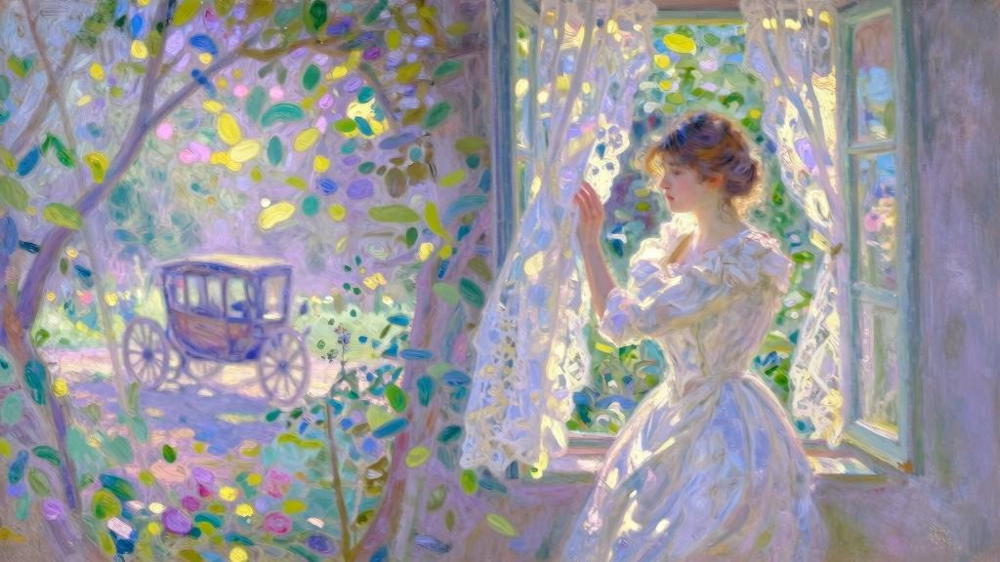

这番严苛的训导，与我的灵魂产生共鸣。我有一种与生俱来的责任感，又有父母作为表率，他们以清教徒的戒律约束我最初萌动的激情。这一切最终引导我崇尚人们所说的“德行”。在我看来，克己自律同别人恣意放纵一样，是天经地义的。我并不厌恶遵循严格的戒律，反而以此为荣。我对未来的追求，与其说是幸福，不如说是获得幸福所付出的无限努力。在追求的过程中，幸福与德行已经不分彼此。当然，我还只是个十四岁的孩子，尚未定型，未来的发展还有很多可能性。不久以后，对阿莉莎的爱慕，让我毅然决然地走向这个方向。这场内心的顿悟，让我认清自己：我性格内向，不太开朗，虽然期待被人关怀，却对他人漠不关心；我没什么进取心，除了想在克己方面获得胜利之外，没有其余的梦想；我喜欢学习，至于玩耍，却只喜欢需要动脑筋或付出努力的游戏；我很少和年龄相仿的同学交往，偶尔同他们玩耍也只是为了维持友谊或是出于礼貌。然而，我同阿贝尔·沃蒂埃却成了朋友。第二年他转学到巴黎，进了我们班，成为我的同学。他是个可爱的小伙子，有点懒散。我对他的喜爱多于钦佩。同他在一起，至少可以聊聊勒阿弗尔和芬格斯玛尔，这两个地方正是我魂牵梦萦之地。

我的表弟罗贝尔·布科兰也在我们高中读书，是寄宿生，比我们低两个年级，只有在星期天我才会和他见面。他与我的表姐妹完全不同，如果不是她们的弟弟，我根本没兴趣见他。

爱占满我的心。只因爱情之光的照耀，与罗贝尔和阿贝尔的友谊才有些意义。阿莉莎如同福音书中所描绘的无价珍珠，而我就是那个为了得到它，不惜变卖一切家当的人。因为还是孩子，我就不能谈论爱情吗？我把对表姐的这种感情称为爱情，难道错了吗？可在我的余生中，没有其他感情能够以“爱”命名了。而且随着年龄增长，尽管我的肉体有了躁动的欲念，但对阿莉莎的感情却始终没有发生质的变化。我在幼年时只想配得上她，后来也不苛求更直接地占有她。无论是努力学习还是与人为善，我做的一切冥冥之中都是为了她，我甚至还发明一种更高尚的美德：常常瞒着她，把为她所做的一切当成是不经意的行为。我陶醉在自得其乐的谦逊中。唉！还很少考虑自己是否开心，最后养成习惯——若不费劲就无法使我感到满足。

这种好胜心莫非只激励了我？阿莉莎对此似乎无动于衷，她没有因为我或为了我而做任何事，可我付出的一切努力却只为了她。她有一颗纤尘不染的心，身上的一切都保持着最自然的美。她的德行如此优雅充盈，让她看起来自在从容。在她稚气笑容的衬托下，严肃的眼神也显得可爱迷人起来。我看见她又抬起那双疑惑的眼眸，似水一般温柔，难怪舅舅在六神无主时，总会去他长女那里寻求支持、忠告和宽慰。第二年夏天，我经常看到他们父女俩在谈心。舅舅伤心极了，看上去老了许多。他很少在用餐时开口，有时又毫无预兆地强颜欢笑，这比沉默更让人痛心。他总在书房里抽烟，一直待到傍晚时分阿莉莎来找他——再三恳求下才肯出门。阿莉莎像带孩子一样把他领到花园里，两人沿着花径走下去，来到菜圃台阶前面的圆形路口，那里摆有椅子。

某天傍晚，我躺在一棵绛红色的大山毛榉树下，在草坪的树荫下看书，忘记了时间。我与那条花径之间只隔着一片月桂篱笆，它虽然阻挡视线，却无法阻隔声音。舅舅和阿莉莎的说话声就这样传入我耳中，显然他们刚谈过罗贝尔。我还从阿莉莎口中听到我的名字，当我能够完全听清对话的时候，舅舅正好高声说道：“啊！没错，他特别喜欢学习。”我无意中成了窃听者，很想溜走，至少该发出一点动静，让他们意识到我的存在。但该做什么呢？咳嗽？还是大喊一声：“我在这里，听见你们说话了！”……我到底没有出声，但不是因为好奇心驱使想多听会儿，而是出于尴尬和羞涩。更何况他们只是路过这里，我听到的不过是只言片语……但他们走得很慢。

阿莉莎必定像往常一样，臂弯里挎一只轻巧的篮子，她边走边摘下衰败的花朵，捡拾果树下被海雾催落的青果。我听见她清亮的声音：“爸爸，帕利西埃姑父是个出色的人吗？”舅舅的声音低沉喑哑，听不清他回答了什么。阿莉莎追问道：“非常出色，对吗？”舅舅的回答依旧含混不清。阿莉莎又问道：“杰罗姆挺聪明的，对不对？”我怎么没有竖起耳朵听呢？……可是没用，什么也听不清。阿莉莎接着说道：“你认为他能成为一个出色的人吗？”这回，舅舅在回答时嗓门提高许多：“可是孩子，我先要弄明白你所说的‘出色’是什么意思，有的人很出色，却不露声色，至少世人看不出来……但在上帝眼里却非常出色。”“我也是这么想的。”阿莉莎说。

“再说……谁说得准呢？他还那么小……当然，他很有前途，但光凭这一点还不足以获得成功……”“那还需要什么？”“孩子，我该怎么跟你说呢？还需要信任、支持和爱情……”“你所说的支持是指什么？”阿莉莎打断他。

“感情和尊重，也就是我这辈子缺少的东西。”舅舅怆然地回答。接着，他们的说话声便彻底消失了。

冒昧的窃听让我感到内疚，所以在晚祷的时候，我下定决心要向表姐认错。也许是好奇心使然，这回我想多了解一点情况。

次日，我刚开口，阿莉莎便说道：“杰罗姆，这样听别人说话很不好。你应该提醒我们，要不就直接走开。”“我向你保证我不是存心偷听的……就算听到也不是有意的。再说，你们只是从那里经过罢了。”“我们走得很慢。”“没错。但我没有听清，况且很快就听不见你们说的话了……告诉我，你问舅舅如何才能成功，他是怎么回答你的？”“杰罗姆，”她笑着说道，“你听得清清楚楚，是想逗我才让我再说一遍吧。”“我保证只听见开头……听到他说需要信任和爱情。”“后来他说还需要很多其他的东西。”“你呢，你是怎么回答的？”阿莉莎的神情突然变得异常严肃：“他谈到生活中的支持时，我回答你有你母亲的支持。”“啊！阿莉莎，你明白的，她不可能永远守着我……这也不是一回事儿……”她低下头：“他也是这么回答我的。”我颤抖着拉起她的手：“无论将来我成为什么人，全都是为了你。”“可是杰罗姆，我也可能离开你。”我不由自主地说出心里话：“但我永远不会离开你。”她微微耸耸肩：“你难道不能坚强点，独自前进吗？我们每个人都应独自到上帝那里去。”“但你是为我指路的人。”“有基督在，你为什么还要另寻向导呢？只有当我们祈求上帝忘却彼此时，才有可能更进一步接近，你难道不这样认为吗？”“对，让我们相聚，”我打断她，“这是我每天早晚都要向上帝祈求的。”“你难道不明白在上帝那里交融的含义吗？”“我完全明白。这指的是我们在共同崇拜的对象那里激动热烈地重逢。正是为了与你重逢，我才去崇拜你所崇拜的对象。”“你崇拜的动机不纯。”“不要对我太苛求，如果你不在天国，这个天国我不去也罢。”她伸出一根手指贴在唇边，神情颇为庄严地说：“先去寻找天国和天理吧。”在记录这些对话的时候，我就清楚地知道，有些人会觉得它们不太像孩子说的话，但有些孩子就喜欢使用严肃的话语。我该怎么办呢？设法辩解吗？不会的。我也不想为了显得自然而粉饰言辞。

我们弄到了拉丁语版的福音书，大段背诵其中的章节。阿莉莎以辅导弟弟作为借口，经常和我一起学习拉丁文。但我猜测，她是想继续听我朗读罢了。我自知她不会陪我一起学习，所以不敢轻易对某个学科产生兴趣。有时这点的确对我有所妨碍，但并不像人们想象的那样会阻碍我思想的飞腾。正好相反，我觉得她无比自由地走在我前面，我是跟随她来选择思想道路的。当时，萦绕在我们心头、被称为“思想”的东西，往往只是某种“交融”的借口，这种“交融”比规避情感和掩饰爱意还要深奥。

起初，母亲因无法衡量这种感情有多深而感到担心。后来她渐感体力衰竭，喜欢用母爱将我们一同拥在怀里。

长期以来，母亲都患有心脏病，后来发作得越发频繁。有一回，她发作得尤为厉害，把我叫到跟前。“我可怜的孩子，你瞧，我已经老得不行了，”她对我这么说道，“终有一天会突然离开你。”她住了声，艰难地喘息着。我再也忍不住，大声喊叫起来，这似乎也是她期待已久的话：“妈妈……你知道的，我想娶阿莉莎！”我的话无疑戳中她最隐秘的心事，她立即接口道：“是啊，杰罗姆，我正想跟你说这件事呢。”“妈妈！”我哽咽着说，“你认为她爱我，对吗？”“是啊，我的孩子。”她温柔地重复了好几遍，“是啊，我的孩子。”她又吃力地补充道：“主自有安排。”我靠她更近一些，她把手放在我头上，又说道：“孩子们，愿上帝保佑你们！愿上帝保佑你们二人！”说罢，她又昏睡过去，我没有试图将她唤醒。

第二天，母亲的病情好转，这段谈话也就无疾而终了。我又去上学，知心话说到一半便没了下文。再说，我又能多了解些什么呢？阿莉莎爱我，对此我从未怀疑。即便真有过疑虑，随着不久后一件悲痛事情的发生，这份疑虑也就永远消散了。

一天傍晚，母亲平静地离开人世，临终前只有我和阿斯布尔顿小姐陪伴左右。最后一次发病夺去了母亲的生命，但起初看来并不比之前几次严重，然而却突然恶化，亲戚们都来不及赶来。第一晚，只有我和母亲的这位老友为她守灵。我深爱着母亲，可让我惊奇的是，我落泪并非因为悲痛，而是因为阿斯布尔顿小姐。我同情她眼睁睁看着比自己年轻许多的朋友先去见了上帝。事实上，我揣度表姐就要来奔丧了，这种想法完全取代了我的忧愁。

第二天，舅舅来了，还给我带来一封阿莉莎的信，说她和普朗提埃姨妈会晚一天到。信中这样写道：……我的朋友、弟弟杰罗姆。在她临终前，我没能说出她期待已久的话，实在太遗憾了，那本来能给她带去莫大的安慰。如今，但求她能宽恕我！从此以后，只有上帝能指引我们俩了……你的、比以往任何时候都要温柔的阿莉莎。

这封信意味着什么？她遗憾未能说出的话又是什么呢？莫非是与我许下终身吗？可那时我还太年轻，不敢立刻向她求婚。况且，我还需要她的承诺吗？我们不是早就同未婚夫妻一样了吗？我们相爱这件事在亲友中不再是秘密。舅舅和我母亲一样，并未阻挠，不仅如此，他早就把我当作儿子看待了。

几天之后便是复活节假期，我去了勒阿弗尔，住在普朗提埃姨妈家里，其间几乎每一顿饭都是在布科兰舅舅家吃的。

费莉西·普朗提埃姨妈是世上最和气的女人，但我和表姐妹们都跟她不太亲近。她总是忙得上气不接下气，动作一点儿也不温柔，声音也丝毫不动听，爱抚我们的时候也是笨手笨脚的。无论在什么时候，只要心中填满对我们的喜爱，她都要抒发一番。布科兰舅舅非常喜欢她，但是，从他对姨妈说话的语气中，我们不难察觉出他更喜欢我母亲。

“可怜的孩子，”一天傍晚她对我说，“不知道今年夏天你打算做什么？我想先了解你的计划，再决定我自己要做什么。如果我能帮你什么的话……”“我还没有考虑过，”我回答道，“也许会去旅行。”她又说道：“要知道，我这里和芬格斯玛尔一样，随时欢迎你，你舅舅和朱莉叶特都很高兴你去那边……”“您是想说阿莉莎吧。”“没错！很抱歉……说了你可能不信，我原先以为你喜欢的是朱莉叶特，直到你舅舅告诉了我……还不到一个月呢……你懂的，我非常爱你们，但与你们见面的机会太少，所以不太了解……再说，我也不擅长察言观色，没时间停下来观察那些与我不相干的事。

我看到你和朱莉叶特总玩在一起……我觉得吧……她人长得漂亮，看起来又高高兴兴的。”“是的，我现在也愿意和朱莉叶特一起玩儿，但是我喜欢的人是阿莉莎……”“很好！很好！由你做主……你也知道，因为她比妹妹话少，我呢，可以说完全不了解她。你选择她，自然有充分的理由。”“可是姨妈，我从来没有经过选择而喜欢她，从没想过有什么理由……”“别生气，杰罗姆，我和你说这些没有恶意……我刚要说什么来着，被你给搅忘了……

啊，想起来了！我想你们最后肯定是要结婚的，但因为你在服丧，按理来说不能订婚……而且，你还年轻，母亲又不在了，独自去芬格斯玛尔，恐怕要惹人闲话……”“是呀，姨妈，正因为这样，我才说要去旅行。”“没错呀。孩子，我想过了，如果我也一起去那儿，肯定会方便不少。我已经安排好了，今年夏天空出来一部分时间。”“只要我开口，阿斯布尔顿小姐肯定愿意来。”“我当然相信她一定会来，但这还不够，我也要去……啊！我并不奢望取代你可怜的母亲，”她突然抽泣起来，补充道，“但我可以料理家务……反正不会让你、你舅舅，还有阿莉莎感到拘束的。”费莉西姨妈估错了自己的影响力。说实在的，大家都因为她的存在而感到不自在。

如她所言，七月份她住进芬格斯玛尔。没过多久，我与阿斯布尔顿小姐也住了过去。姨妈以帮助阿莉莎料理家务为借口，让这个原本清静的家喧闹不断。她为了讨我们欢心非常热情，用她的话来说，就是“方便行事”。可是她热心过了头，以致我和阿莉莎在她面前非常拘谨，几乎默不吭声。她一定觉得我们之间很冷淡……可即便我和阿莉莎开口说话，她就能理解我们之间爱情的性质吗？相反，朱莉叶特的性格对这种奔放的热情就适应多了。我见姨妈特别偏爱小侄女，不免有所怨恨，也许就是这个原因影响了我对姨妈的感情。

某天早上，姨妈收到一封信后，便把我叫到跟前：“可怜的杰罗姆，万分抱歉。我女儿生病了，要我回去。我不得不离开你们了……”我心中怀着多余的顾虑，不知道姨妈走后自己该不该留在芬格斯玛尔，于是跑去问舅舅。可是我刚一开口，就被舅舅打断了：“我可怜的姐姐又想出什么新花样了，多自然的事情被她搞那么复杂！杰罗姆，你为什么要离开我们呢？”他嚷道：“你差不多就是我的孩子了吧？”姨妈在芬格斯玛尔就待了半个月，她一走，这里就恢复了清静。这座房子又笼罩在平和安谧之中，像极了幸福该有的模样。丧母之痛并未让我和阿莉莎的爱情黯然失色，却仿佛给它增添了几分严肃色彩。一种单调乏味的生活开始了，我们恍若置身于音效超好的环境中，连心脏最微茫的跳动都听得到。

姨妈走后几天，有一天晚上，我们在用餐时谈到她。我记得我们是这样说的：“多闹腾呀！生活还有起起伏伏呢，怎么她的心就不能消停会儿呢？爱情美丽的外壳，在她心上映射成了什么样子……”这么说，是因为我们想起歌德的一句话——他在谈论施泰因夫人时写道：“看见这颗心灵上映射出的世界，一定很美妙。”我们当下确立一套我也不大懂的等级，并将“喜好冥思默想”的品质划为最高等。

一直沉默不语的舅舅，苦笑着责备我们。

“孩子们，”他说道，“即使形象破碎，上帝依然能认出来。我们不能凭借生活中的一个小片段来评价别人。我可怜的姐姐身上不讨喜的部分，全都事出有因，我再清楚不过，因此无法像你们这样尖刻地批评她。年轻时讨人喜欢的特质，老了以后哪有不变质的。

你们说费莉西‘闹腾’，可在当初，这还是一种可爱的激情，是一时忘乎所以、随兴所至罢了……我可以肯定地说，我们当年和你们现在的模样，没什么区别。杰罗姆，我当初就和你现在挺像的，也许比我想象的还要相似。费莉西就特别像现在的朱莉叶特……是的，长得也像。”他转身对着女儿，继续道：“你说话时的某种声调，会让我突然想起她，她也会像你这样微笑。有时候动作都和你很像：她也会无所事事地坐着，两肘放在身前，交叉的手指撑在额头上。当然，现在这种动作早就消失了。”阿斯布尔顿小姐朝我转过身来，声音低不可闻：“阿莉莎像你母亲。”这年夏天，阳光明媚灿烂，万物都沐浴在碧蓝之中。我们的虔诚打败了病痛和死亡，阴影在我们身前退去。每天早晨一到拂晓时分，我就满心欢喜地起床，跑出去迎接新一天的到来……每当午夜梦回，这段浸透朝露的时光，总浮现在我眼前。朱莉叶特起得比熬夜的姐姐早，会和我一起下楼去花园，她还成了我和阿莉莎的信使。我没完没了地向她倾诉和阿莉莎的爱情，她好像总也听不厌。我跟她说了很多不敢当面跟阿莉莎说的话。

面对阿莉莎时，因为爱慕过深，我总是战战兢兢，放不开来。阿莉莎似乎也赞同这样的消遣，很开心我和朱莉叶特聊得这么投机。总之，我们谈论的话题都是她，但她没有在意，或者假装不在意。

啊，狂热的爱情！你精妙伪装起来，到底通过哪条秘径，竟将我们从欢笑引向哭泣，从天真的欢乐引向对美德的渴望！

夏天的流逝，如此纯净温润。那些悄悄溜走的时光，我现在几乎没有任何印象，唯一记得的只有读书和谈心……

“我做了个伤心的梦。”假期接近尾声，一天早上阿莉莎这么对我说。

“梦见我活着，你却死了。不，我没有看见你死去，只知道‘你死了’这回事儿。太可怕了，根本不可能，所以我觉得你只是不在我身边罢了。虽然我们分开了，我觉得还是有办法重逢的。为了再见到你，我绞尽脑汁，在拼尽全力的时候一下醒过来了。

“今天早上，我仍受到这个梦的影响，仿佛在继续做梦。我还是觉得跟你分开了，而且会跟你分开很久很久……”她压低声音继续道，“我会和你分开一辈子，必须倾尽一生，付出极大的努力……”“为什么？”“为了重聚，每个人都要付出极大的努力。”我并没有把她的话当真，也许是害怕当真吧。我的心怦怦直跳，似乎是为了抗议，我鼓起勇气说道：“好吧，我今天早上也做了一个梦，梦见我要娶你的心是那么强烈，除了死亡，什么都无法让我们分开。”“你认为死亡就能将人分开吗？”她又说道。

“我是想说……”“我认为死亡反而能让人靠近……没错，能让生前分开的人拉近距离。”这些话深深扎进我们心里，当时说话的语调至今犹然在耳。但要到后来我才真正明白这番话有多严肃。

夏天过去了，大部分田地都光秃秃的，视野非常开阔。我离开的前一晚，不，是离开前两天的傍晚时分，我和朱莉叶特来到花园低处的小树林。

“你昨天给阿莉莎背诵的是什么？”她问我。

“什么时候的事儿？”“在泥灰岩矿场的长椅上，我们走了以后，你们还留在那里……”“啊……应该是波德莱尔的几首诗吧。”“哪几首？你不愿意告诉我吗？”“不久，我们将沉入森冷的黑暗……”我不大情愿地背诵起来。但她立即打断我，用颤抖而异样的声音说道：“别了，太短促的夏日骄阳！”“怎么！你也知道？”我十分惊讶，大声说道，“我还以为你不喜欢诗呢……”“怎么会呢？就因为你不背给我听吗？”她笑着说，但有些窘迫，“有时候，我觉得你把我当成十足的傻瓜。”“聪明的人不见得喜欢诗歌。我从没听你念过诗，你也没有要求我给你背诵过。”“因为都被阿莉莎一人独占了……”她沉默片刻，又突然说道，“你后天就要走了吗？”“是得走了。”“你今年冬天打算做什么？”“在巴黎高师读一年级。”“你打算什么时候和阿莉莎结婚？”“等服完兵役吧，甚至还要等到我对将来要做的事有点头绪之后。”“所以你对将来要做的事还没有头绪吗？”“我还不想知道，因为感兴趣的事实在太多，一旦做出选择，就只能做一件事了，所以尽量推迟选择的时间。”“你不订婚，也是怕不能再有所选择吗？”我耸耸肩，未予回应。

她坚持说道：“你们还在等什么呢？为什么不马上订婚呢？”“我们为什么要订婚呢？知道拥有彼此，而且永远不变，难道还不够吗？何必昭告天下呢？我若愿意为她奉献一生，你真觉得需要用诺言来维系这份爱情，才更美好吗？不，誓言对我而说是对爱情的侮辱……只有在不信任她的时候，我才渴望和她缔结婚约。”“但我不信任的对象并不是她……”我们慢慢走着，来到花园一角。之前正是在这里，我无意间听到阿莉莎和她父亲的谈话。我脑海中突然闪现一个念头，我刚看到阿莉莎到花园来了，她可能就坐在圆形路口，同样能听见我们的谈话，何不让她听听我不敢当面跟她说的话呢？

这一招让我很兴奋，这种可能立刻蛊惑了我，于是我提高嗓门道：“啊！”我大声地说，怀着一种与年龄稍稍不符的浮夸激情。由于太专注于自己要说的话，我对朱莉叶特未尽的话语并未在意……

“啊！如果我们能靠近心爱之人的灵魂，从她身上看自己，就如同看镜像一样，会看到怎样一副形象呢？从别人身上看自己，就好像自我审视一样，甚至比自己看还要清楚，这柔情多么让人心安呀！这样的爱情多纯洁呀！”我洋洋自得，以为这番不太高明的抒情起了作用，才让朱莉叶特慌乱起来。她突然把脑袋埋在我肩头。

“杰罗姆！杰罗姆！你要向我保证会让她幸福！如果她也因你而感到痛苦，我会恨你的。”“唉，朱莉叶特，”我抱了抱她，捧起她的脸，大声说道，“那样我也会憎恨自己，但愿你懂我！……我迟迟没有决定自己的事业，只是为了更好地同她一起生活。我的未来悬而未决，都取决于她了。如果没有她，无论将来成为什么人，我都不愿意……”“你和她说这些的时候，她怎么说呢？”“我从没和她说过！从来没有。这也是为什么我们还没订婚的原因，我们从没谈起过婚姻，也没有提过将来要做的事。唉，朱莉叶特，对我来说，和她在一起的日子实在太美，所以我不敢……你懂吗？我不敢和她说这些。”“你是想给她来个幸福的惊喜吗？”“不，并不是这样。我是害怕……怕吓着她，你明白吗？……怕我隐约预见的巨大幸福，会吓着她。有一天我问她是否想去旅行，她对我说什么也不想，只要知道有这些美丽的地方存在，知道有人能前往，就已足够。”“你呢，杰罗姆，你渴望旅行吗？”“哪里都想去！对我来说，人生就像漫长的旅行，可以和她一起徜徉在书籍中，行走在人群中，在各地游历……你思考过‘起锚’这个词的意思吗？”“我经常思考这个词……”她低声咕哝。可我几乎没听见，她的话如同受伤的可怜小鸟一样坠落在地。

我继续说道：“夜晚起航，在拂晓时分醒来，已是漫天霞光。在这变幻莫测的波涛之上，只有我们两个人……”“接着，你们来到一座港口，虽然小时候在地图上见过，一切却那么陌生。在我的想象中：你在舷梯上，和阿莉莎手挽着手走下船去。”“我们赶紧来到邮局，”我笑着补充道，“取出朱莉叶特写给我们的信。”“信是从芬格斯玛尔寄出来的，她一直留在那里。在你们看来，芬格斯玛尔是那么渺小、悲伤又遥远的地方……”她确实是这么讲的吗？我也无法确定。原因我也跟你们说了，爱占满我的心，除了爱的表达，我几乎听不见别的声音。

我们来到圆形路口附近。正要往回走的时候，阿莉莎突然从暗处走了出来，她面色异常苍白，让朱莉叶特惊叫起来。

“我不太舒服，”阿莉莎结结巴巴地赶紧说道，“天气凉了，我还是回去的好。”她立刻离开我们，一刻不停地回家去了。

“她听到我们刚才说的话了！”等阿莉莎稍稍走远，朱莉叶特便大声说道。

“可我们并没说什么让她难受的话吧？恰恰相反……”“别管我。”朱莉叶特说着，便奔去追赶姐姐了。

这天晚上，我未能入睡。阿莉莎在晚饭时露了一面，喊着头疼，很快回房去了。从我们的对话中，她到底听到了什么呢？我忐忑不安，回想之前说过的话。继而我又想到，也许散步时不该和朱莉叶特靠那么近，不该肆无忌惮地把她搂在臂弯里，这是孩提时代养成的习惯。阿莉莎已经不止一次看到我们这么散步了。

啊，我这个可悲的瞎子！总纠结于找寻自己的过错，丝毫没有考虑过朱莉叶特说的话。

由于我当时根本没仔细听，自然记不太清，也许阿莉莎听得更清楚。无论什么原因吧！

我惴惴不安，不知该如何是好，一想到阿莉莎可能在怀疑我，就惊慌失措。我顾不上之前对朱莉叶特说的话，也许正是她的话影响了我，让我下定决心克服顾虑和担忧，明天就向阿莉莎求婚，也想象不出这会产生什么别的危害。

这是我离开的前一天。阿莉莎很忧郁，我想还是因为这件事吧，看得出来她在躲我。一整个白天，我都没机会和她单独说上话。我害怕什么都没说就得走了，于是在晚饭前直接去了她房间。她背对着房门，透过她的肩膀上方，我看到两支明烛中间有面镜子。她抬着手臂，低头往脖子上扣一条珊瑚项链。她先在镜子里发现了我，注视半晌，却没有回头。

“噢！我的房门没有关吗？”她说。

“我敲门了，但你没有回应。阿莉莎，你知道我明天就要走了吗？”她没有回答，只是把没能扣上的项链放在壁炉上。“订婚”这个词在我看来太露骨、太唐突，我就采用了一些迂回婉转的说法来代替。

当阿莉莎明白我的意图后，似乎踉跄了一下，靠在壁炉上……我自己也惊慌失措，根本不敢看她。我站在她身边，拉住她的手，却不敢抬起眼睛。

她没有挣脱，而是稍稍低下头，略微抬高我的手吻了一下，半倚着我，低语道：“不，杰罗姆，我们别订婚，求你了。”我的心怦怦狂跳，她一定也感觉到了，用更温柔的声音说道：“不，现在还不要……”“为什么？”我追问她。

“我才要问你为什么，为什么改主意了？”我不敢跟她说起昨天的谈话，但她肯定知道我正在想这件事。她直直地盯着我，仿佛解答我心思一般，回答道：“朋友，你误会了。我不需要那么多幸福，我们现在这样不也很开心吗？”她努力想笑，却笑不出来。

“不开心，因为我就要离开你了。”“听着，杰罗姆。今晚我不能再和你说什么了……我们最后相聚的时光，别扫兴了……

不，不是的。我还像往常一样爱你。放心吧，我会给你写信解释的。我保证给你写信，明天就写……你一离开就写。现在你走吧！瞧，我都哭了……让我静一静吧。”她轻推着我，把我推离了身旁。这就是我们的告别。当天晚上，我再没能和她说上话，次日我离开时，她把自己关在房里。我看见她站在窗口跟我挥手告别，目送我乘坐的车渐渐远去。
