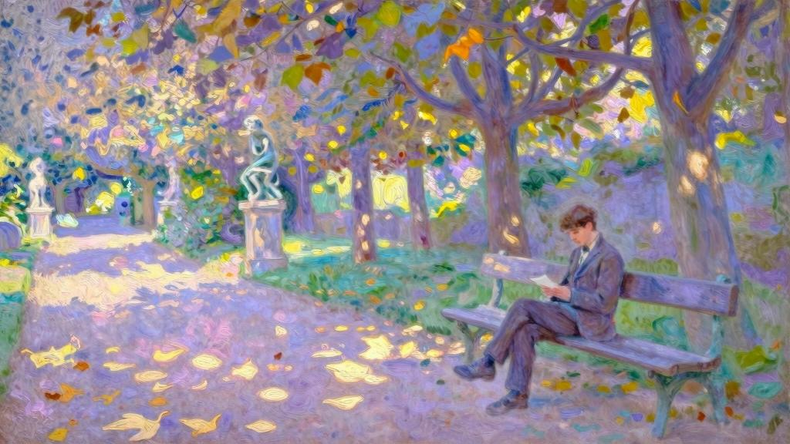

这一年，我和阿贝尔·沃蒂埃几乎没见过面。他不等征兵就提前入伍去服兵役了，而我则重读了修辞学，准备拿个证书。今年，我们俩都进了巴黎高师，我比他小两岁，可以在毕业之后再服兵役。

我们因这次重逢而喜悦。他离开部队后，又去旅行了一个多月，我真担心他变了。但他昔日的魅力并未减少，只是显得更加自信。开学前一天下午，我们在卢森堡公园度过。

我藏不住心事，与他谈了很久，况且，他对我的恋情早已知情。这一年中，他交往了好几个女人，难免自以为是，有些优越感，但我并不生气。他取笑我不够坚决，用他的话来说：对付女人的原则是——绝不能让她恢复镇定。由他说吧，但我心中认为这番高论既不适用于我，也不适用于阿莉莎，这番话只证明他对我们并不了解。

我们到校的第二天，我收到这样一封信：亲爱的杰罗姆：对于你的提议我考虑了很久（我也建议称此为“订婚”），我比你年长太多，这一点让我担忧。你还没有机会见到其他女人，可能还没意识到这一点。可我却想到了，将来委身于你后，你若不再喜欢我，我会多痛苦啊。毫无疑问，你读到这封信会很气愤，我仿佛听见了你的申辩。不过，我还是请你再等等，等你增长一点阅历再说。

要明白，我说这番话只为了你。至于我，相信永远不会停止爱你。

阿莉莎我们停止相爱！怎么可能有这种事！我感到伤心，但更多的是震惊。心乱如麻之下，我跑去找阿贝尔，把信拿给他看。

“好吧，你打算怎么办呢？”他看完信，抿着嘴摇头。我举起双臂，既悲伤又没主意。

“我希望你至少别回信，一旦开始和女人争吵，就输定了……听着，我们周六去勒阿弗尔过夜，周日一早就能到芬格斯玛尔，周一还能赶回来上第一堂课。自从服兵役以后，我再没见过你的亲戚——用这个借口足够了，也很体面。如果阿莉莎觉得这只是借口，那再好不过了！你和她说话的时候，我来搞定朱莉叶特。你尽量别孩子气……说实话，在你们的故事里还有很多我也解释不清的东西，你肯定没全告诉我……没关系！我会弄明白的……千万别泄露我们要去的事。一定要让你表姐大吃一惊，让她来不及防备。”我推开花园栅栏时，心跳得厉害极了。朱莉叶特立刻跑来迎接我们，阿莉莎正在收拾衣物，没急着下楼。我们在客厅里，同舅舅和阿斯布尔顿小姐聊天，最后阿莉莎也走了进来。或许我们的突袭真让她乱了方寸，可她起码没表露出来。我想起阿贝尔和我说过的话，觉得阿莉莎迟迟不肯露面，就是为了准备好对付我。朱莉叶特充满热情和活力，相形之下，阿莉莎的矜持则显得更加冷漠。我能感觉到，她并不赞成我去而复返，至少试图表现出反对。在这种反对之下，我不敢展现潜藏的强烈情绪。阿莉莎坐在靠窗的角落里，与我们隔得很远。她似乎专心于手头的刺绣活，双唇翕动着，在默念针脚。阿贝尔讲着话，幸好有他在！因为我实在没勇气开口。他讲述自己一年服兵役的情况和旅行的见闻，要是没有他，开头几分钟会十分乏味。我舅舅显得格外担忧。

午饭一结束，朱莉叶特就把我叫到身旁，拉我去花园。

“你想得到吗？有人向我求婚了！”我们刚独处，她就大声说道，“费莉西姑妈昨天给我爸爸来信，说有个尼姆的葡萄园主想结亲。据姑妈说，对方人很不错，自从在今年春天的社交场合见过我几次后，就对我念念不忘。”“你有留意到这位男士吗？”我问道，语气中对这位求婚者不由自主地抱有敌意。

“有，我知道是谁。他是个堂吉诃德式的人物，性格随和，没文化，长得很丑，非常平庸，而且滑稽可笑，连姑妈见到他都憋不住笑。”“那么，他有……希望吗？”我用调侃的口吻说道。

“喂，杰罗姆！开什么玩笑！他是个经商的！……你要是见过他，就不会这样问了。”“那么……舅舅是怎么答复人家的呢？”“和我的答复一样：说我还太小，谈结婚还早……可惜呀，”她笑着说道，“姑妈早料到我们会反对，在信末的附言里写道：爱德华·泰西埃尔先生（这是他的名字）同意等我，他这么早来求婚只是为了早点‘排队’……这太荒唐了。但我还能怎么办呢？又不能让人转告，说他太丑了！”“是不能，只能说你不想嫁给葡萄园主。”她耸了耸肩：“在姑妈心里，这种理由是行不通的……算了吧。话说阿莉莎给你写信了？”她滔滔不绝地说着，看起来十分不安。我把阿莉莎的信递给她看，看信时她满脸通红，质问我道：“那你打算怎么办呢？”我从她的声音里听出了愠怒。

“不知道。但我后悔来了这里，在这儿还不如写信容易些。你明白她想说什么吗？”“我的理解是她想给你自由。”“可我看重这个吗？自由？你知道她为什么写这封信给我吗？”“不知道。”她答了一声，语气十分生硬。虽然我不知道真相，但这一刻至少让我明白朱莉叶特对此有所隐瞒。

我们走到小径的拐角处，她突然转过身。

“现在，让我自己待会儿。你来这里又不是为了和我聊天，我们待在一起的时间太长了。”她逃走了，向屋里跑去。没过多久，我就听到她弹钢琴的声音。

我回到客厅时，她和刚找过来的阿贝尔聊着天，手上的弹奏却没停下，只是看起来无精打采，仿佛是即兴演奏。我离开了，在花园里徘徊了好一阵，寻找阿莉莎的身影。

阿莉莎在果园深处的墙角下，正采摘今年初放的菊花。花香与山毛榉枯叶的味道融为一体。空气中漫溢着浓浓的秋意，阳光下的果树架被晒得暖烘烘的，东方的天空却格外明净。她戴着一顶泽兰产的大女帽，脸几乎全掩在帽子里。这是阿贝尔在旅途中买来送给她的，刚拿到手她就戴了上去。我走过去，起初她并没转过身来，但身体禁不住微微战栗起来，这表明她听出了我的脚步声。我已经做好坚持住的准备，鼓起勇气面对她的责备，承受住她即将投向我的严厉目光。然而，当我快到她跟前时，却仿佛胆怯一般，放慢了步伐。她一开始没有回头，耷拉着脑袋，像个赌气的孩子，只把放满鲜花的手朝后面伸出来，似乎在邀我靠近。见到这个姿势，似乎是为了玩闹，我反而站住了。她终于转过身来，朝我走了几步，抬起头，满面笑颜映在我眼里。她的目光照亮所有，转瞬间，我觉得一切都那么自在简单，于是用毫不费劲的声音说道：“你的信把我招了回来。”她说，“我早料到了”，然后转了个声调，以求削弱过度的斥责之意，“正是这一点让我生气，你为什么看不懂我说的话呢？很容易理解的吧……”果然，忧郁和困境不过是我的假象，只存在于脑海中。“我和你说得很清楚，我们一直以来都很幸福，你却还建议我改变，我拒绝了，这有什么可惊讶的呢？”在她身边我的确是幸福的，那么幸福，以至于期望我们的想法可以完全契合。只要她微笑，只要我们也能像今天这样，手牵着手在这条温暖的花径上走着，我便别无所求。

“如果你希望这样，”我认真地说道，完全沉浸于眼前的幸福之中，其他的期盼全被抛诸脑后，“如果你希望这样，咱们就不订婚了。我收到你的信时，就明白自己一直是幸福的，但又快要失去这份幸福。把往日的幸福还给我吧！我不能没有它。我那么爱你，可以等你一辈子。可是阿莉莎，一想到你不再爱我，或者怀疑我的爱，我就受不了。”“唉！杰罗姆，我不怀疑你爱我。”她的声音平静又忧伤，但笑容又照亮了她，显得无比和煦静美，让我不禁为自己的恐惧和抗争感到羞愧。我甚至觉得，在她话语深处听出的忧郁回响，正是我的担忧和抗议引发的。我直接谈起自己的计划、学业，以及让我受益匪浅的全新生活方式：那时的巴黎高师不似近来的样子，纪律相当严明，它鼓励大家勤奋学习，只有怠惰不前的学生，才会有压力；这种近乎修道院式的生活让我远离外界，这一点让我高兴，因为社交圈对我并没有吸引力，只要是阿莉莎害怕的东西，我很快也会憎恶；在巴黎，阿斯布尔顿小姐还留在往日和母亲同住的公寓里，每到星期天，我和阿贝尔总会花几个小时去看望她，我还会在这一天给阿莉莎写信，好让她完全知悉我的生活。

我和阿莉莎坐在敞开的窗框上，巨大的藤蔓恣意地攀爬上来，最后几条黄瓜已经摘完。

阿莉莎听我说着，也会问我一些问题。我从未见她如此专注柔情，也从未见过她表现出如此深切的爱恋。恐惧、担忧，甚至是最轻微的不安都消融在她的微笑中，融化在这令人愉悦的亲近中，犹如薄雾消散在清澈湛蓝的天空中一样。

我们坐在山毛榉树林的长椅上，阿贝尔和朱莉叶特寻了过来。这一天余下的光阴，我们重读了斯温伯恩的诗歌《时间的胜利》，每个人轮流读上一节，直到夜幕降临。

“好了。”我们动身离去前，阿莉莎拥抱了我。也许是我冒失的行动所致，又或许她就想要这样，阿莉莎摆出一副大姐姐的神气，半开着玩笑说道：“现在答应我，以后别胡思乱想……”等到只有我们两人的时候，阿贝尔立刻问我道：“怎么样？你们订婚了吗？”“亲爱的，这已经不重要了，”紧接着，我用毋庸置疑的语调说道，“这样更好，我从未像今晚这么幸福过。”“我也是！”他高声说道，突然扑过来抱住我的脖子，“我要告诉你一件新奇又美好的事！杰罗姆，我疯狂地爱上了朱莉叶特！去年我已经有所察觉，但之后经历了很多。在重新见到你的表姐妹之前，我本来没打算告诉你。但现在，这是实打实的了，我的一生已经定好。

“我喜欢，岂止是喜欢，我疯狂爱上了朱莉叶特。

“我早就觉得，咱俩就跟连襟一般相亲相爱……”接着，他又笑又闹，环抱着我的胳膊。在回巴黎的火车车厢里，他像个孩子似的在坐垫上滚来滚去。这番表白让我目瞪口呆，我认为里面有文学渲染的成分，这也让我有些尴尬。但面对这样的激情与欢乐，我又如何保持镇静呢？

“所以呢？你表白了？”在他抒发情感的间隙，我终于插上嘴问道。

“没有！没有呢，”他大喊道，“我不想太快越过故事里最迷人的章节。

“爱情最美好的时刻，并不是在说‘我爱你’[1] ……

“嘿！你不会因此怪我吧，只怪你太拖泥带水。”“可是，”我有些不高兴，“你觉得她呢，她的态度是……”“这次再见面，你没注意到她有多慌乱吗？我们做客期间，她总是激动又害羞，而且话特别多……当然，你什么也不会注意到的，你的整颗心都扑在阿莉莎身上……她还问了我很多问题，如饥似渴地吸收我说的话。这一年来，她在智力方面突飞猛进。我不知道你是从哪里得知她不爱读书，你总觉得阅读是阿莉莎的专利……但亲爱的，她的见识之广令人震惊。你知道晚饭前我们在玩什么吗？我们回忆了但丁的一首坎佐尼，每人背一句，我背错她还替我纠正。这一句你肯定知道：‘爱在我脑中徘徊，令我思绪万千。’[2]“你从没告诉我她学过意大利语呀。”“我自己都不知道。”我相当吃惊地说道。

“什么？但开始背诗的时候，她跟我说是你教会她这首坎佐尼的。”“一定是哪天我读给她姐姐听的时候，被她听去了。她常常在我们身边缝衣服或做刺绣活。我们能看出她听得懂才奇怪。”“没错！你和阿莉莎自私到令人咋舌，你们完全沉浸在自己的爱情里。朱莉叶特在智慧和心灵上的成长令人赞叹，你们却视若无睹。我不是恭维自己，但我的确来得正是时候……不，不！我不是怨你，你懂的。”说着，他又抱住我，“只是，你要答应我，这件事一个字也别跟阿莉莎提。我想自己处理。朱莉叶特一定是爱我的，我足够放心，甚至敢把她搁一搁，等下次假期再说，也不打算从这儿给她写信。不过，到了新年放假，我们就可以去勒阿弗尔，然后就……”“然后就？”“好吧，阿莉莎会突然得知我和朱莉叶特订婚的消息，我打算干净利落地办成这事儿。

你猜接下来会发生什么？阿莉莎的允诺你久拿不下，我会以我们为榜样给她压力，为你争取到！说服她相信，我们总不能赶在你们之前结婚吧……”他滔滔不绝地说着，这些话像滚滚而来的浪潮一样吞没我，甚至火车抵达巴黎，我们回到高师，他依然没有说完。尽管从火车站步行至学校时已是深夜，但阿贝尔仍陪我到房间，在那里一直聊到天明。

兴奋的阿贝尔把现在和未来都安排好了，他已经展望到两对新人的婚礼，甚至通过想象，描绘出每个人脸上的惊讶和欣喜。他对我们美好的故事、友谊，以及自己在我和阿莉莎的爱情中充当的角色满怀憧憬。对于这种理想主义的热忱，我实在难以抵制，被他空想出来的建议所吸引，甚至摇摆不定，逐渐相信了。在爱情的作用下，我的抱负和勇气也逐渐膨胀，打算毕业后，就让沃蒂埃牧师为我们两对新人主持婚礼。我们四人一同去旅行，一同干一番大事，妻子们也心甘情愿成为我们的搭档。阿贝尔对教书没什么兴趣，他觉得自己是为写作而生的，写几个成功的剧本，就能很快挣到他缺少的那笔钱；而我，对于研究本身比借此获益更感兴趣，打算潜心研究，写一本关于宗教哲学的历史书……然而，怀有这么多期待，如今回忆起来却毫无用处。

第二天，我们又投入学习之中。

[1]这句话引用自普吕多姆的诗歌 《爱情最美好的时刻》。

[2]原文是意大利文：Amor che nella mente mi ragiona。
