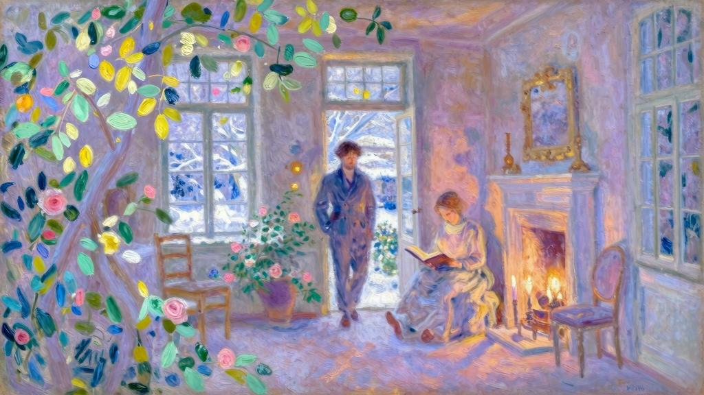
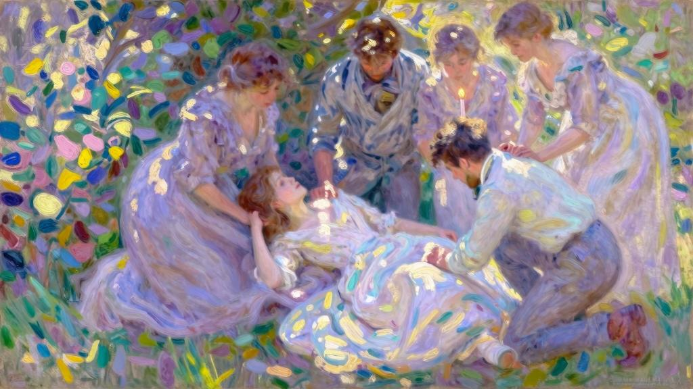

时光飞逝，很快到了新年假期。我和阿莉莎最后的那次谈话一直激励着我，让我的信念未有丝毫消退。按照之前决定的那样，我每周日都给她写信，内容十分详尽。其余的时光，我也从不与同学交往，除了阿贝尔，几乎不见其他人。我活在对阿莉莎的想念里：看喜欢的书时，如果觉得对阿莉莎有用，会在书上做标记；也会根据她的兴趣，来决定自己该对什么感兴趣。她经常回信，频率和我差不多，却仍使我感到不安。看得出来，她热情地附和我，是因为担心我的学业而给出的鼓励，而不是受精神的驱动。我觉得评价、争辩和批判，都只是表达思想的方式，可她却与我恰恰相反，借助于这一切来掩饰自己的内心。有时候，我甚至怀疑，她是不是把这些当作一场游戏……不管了！我下定决心不再抱怨，所以在我的信里并没有流露出丝毫担忧。

临近十二月末时，我和阿贝尔动身前往勒阿弗尔。

我借宿在普朗提埃姨妈家，抵达时，她并不在家中。我刚把房间安顿好，一个佣人就来通知我说，姨妈在客厅等我。

她稍稍问了我的健康、居住和学习情况，随后就在深切好奇心的驱使下，直言不讳起来：“孩子，你还没告诉我呢？你对在芬格斯玛尔的那段日子还满意吗？你的个人问题有什么进展吗？”我必须忍受姨妈那稚拙的敦厚。即便是用最单纯柔情的话语来描述这份情感，我仍觉得粗鲁，更何况是如此简单的概括呢？这让我难以忍受。可她的语气又那么单纯而真挚，若是生气，未免显得太愚蠢。不过，我最初仍有些抗拒。

“春天的时候，您不是还跟我说，订婚太早了点吗？”“没错，是呀！起初我们都会这么说。”她抓起我的一只手，怅触地按在自己的手上，又说道，“况且，你还要读书，要服兵役，几年之内恐怕结不了婚，这一点我很清楚。此外，就我个人而言，也反对漫长的婚约。毕竟对年轻的女孩来说，这太烦人了……当然有时候也很感人……再说，订婚没必要搞那么正式……私下里知道就好，大家心知肚明，也就没必要给姑娘们另找婆家了。这样的话，你们要通信，要保持联系，都不碍事。最后，若有人前来求婚——这是很可能发生的。”她露出恰如其分的微笑，暗示道：“那就可以委婉地回答说‘不，不用了’。之前刚有人来向朱莉叶特求婚，你知道吗？

今年冬天，她太引人注目了，但还是小了些，这也是她回绝人家的说辞。不过，那个年轻人提出要等她——确切地说，他也不算年轻人……总之是个不错的对象，为人老实。明天他要来看我的圣诞树，你就能看到他了，到时候跟我说说你对他的印象。”“姨妈，只怕他是白费心思，朱莉叶特另有意中人。”我努力克制自己，才没把阿贝尔的名字立刻泄露出去。

“嗯？”姨妈怀疑地撇了撇嘴，脑袋歪向一边，询问道，“你这话可吓到我了，为什么她什么都没跟我讲呢？”我咬住嘴唇，免得透露信息。

“唉！我们到时候就知道了……这阵子朱莉叶特身体不太舒服……再说，我们现在谈的也不是她的事……阿莉莎也很可爱啊……话说，你向她表白了吗？”“表白”这个词太不合适了，异常粗俗，我心里非常反感。但是问题迎面而来，我又不擅长撒谎，只好含糊地答道：“表白了。”我的脸颊发红，像着了火似的。

“那她怎么说？”我低下头，并不想回答，含糊着勉强说道：“她拒绝和我订婚。”“这个好孩子！她做得对！”她大声说道，“你们来日方长，当然啦……”“噢！姨妈，别谈这个了。”我试图阻止她说下去，却是徒劳。

“而且，她会这么做我并不诧异。我一直觉得她比你懂事多了，你表姐……”我不知道是怎么了，这种盘问无疑让我精神紧张，心似乎一瞬间化为碎片。我把脑袋伏在好心的姨妈膝上，像个孩子一样痛哭起来。

“姨妈，不，您不明白，”我高声说着，“她并没有要我等她……”“那是怎样？她拒绝你了？”她异常轻柔地说道，语调中满含怜悯，用手扶起我的脑袋。

“不，也不是……不完全是。”“你是担心她不爱你了？”“啊！不，我担心的并不是这个。”“可怜的孩子，你若想要我明白，应该解释得更清楚一些。”我既羞愧又懊恼，刚刚不该放任自己的软弱，姨妈自然不可能了解我含糊其词的原因。

不过阿莉莎拒绝我的背后，如果真藏有什么具体动机，姨妈慢条斯理地询问，说不定真能查个水落石出，她也自告奋勇地提了出来。

“听着，”她又说道，“阿莉莎明天早上会来和我一起布置圣诞树，很快我就会弄明白这是怎么回事，吃午饭的时候就可以告诉你。我保证，你明天就会明白没什么值得惊慌的。”晚饭时，我去了布科兰家。朱莉叶特确实病了很久，看起来不大一样。她的眼神略带孤僻，近乎冷酷，与姐姐有了更显著的差异。这天晚上，我没有同她们任何一个单独交谈，也并不想谈。况且，舅舅看起来有些疲态，饭后不久我就回去了。

普朗提埃姨妈准备的圣诞树，每年都会招来很多孩子和亲友。它被放在楼梯间的玄关处，这里紧连着前厅、客厅和一个带玻璃门的冬季花园，里面摆放着冷餐台。圣诞树还没有装饰好。正如姨妈所说，宴会当天早上，也就是我抵达的次日，阿莉莎很早就来帮忙了。她往树上挂上饰物、灯串、水果、糖果和玩具，我很乐意与她一起做这些，但必须让姨妈跟她聊聊，所以还没看到她，我便离开了，整个早上都在试图抚平心中的不安。

起初，我去了布科兰家，期望再见到朱莉叶特，但听说阿贝尔先我一步来找她，我担心打扰他们决定性的谈话，很快就离开了。接着，我在码头和街道之间游荡，直到午餐时分才回去。

“大傻瓜！”我一回来，姨妈就大声说道，“怎么能这样糟蹋生活呀！你今天早上跟我说的，没有一个字在理的……我也没拐弯抹角，先把费力帮忙的阿斯布尔顿小姐支开。只剩下我和阿莉莎时，我开门见山地问她今年夏天怎么不订婚，你可能以为她会尴尬，但是她丝毫不为难，平心静气地回答我说，她不想比妹妹先结婚。如果你也这么直接问，她也会像回答我一样答复你的。有什么好纠结的呢？你看，孩子，什么也比不上实话实说……可怜的阿莉莎，她还跟我说离不开父亲……噢！我们聊了很久，这孩子太懂事了。她还跟我说，怀疑你们是不是适合，她觉得对你来说自己年龄太大，希望你找个像朱莉叶特那个年纪的……”姨妈还在说着，但我已听不进去。对我来说，唯一重要的只有阿莉莎拒绝比妹妹先结婚这件事。这不还有阿贝尔吗！这个自命不凡的人，但他是对的，就像他说的一样，他将一石二鸟，同时解决两桩婚事。

如此简单的新发现，让我沉浸在激动的情绪之中，但在姨妈面前，我尽量掩饰自己的心情，好让她觉得，我的欢乐是人之常情。更让她高兴的是，这场欢乐似乎归功于她。刚吃过午饭，我也不记得找了什么借口就离开了，赶着去找阿贝尔。

“是吧！我怎么跟你说来着！”阿贝尔刚听到这件喜事，就抱着我，高声说道，“亲爱的，我也可以告诉你，今天早上我和朱莉叶特的谈话几乎是决定性的，尽管我们差不多只谈了你。她看起来疲惫又不安……我担心说太多会让她心神不宁，也担心耽搁太久她会过于激动。但有了你刚跟我说的情况，这事就板上钉钉了！亲爱的，我这就过去拿手杖和帽子，你陪我一起到布科兰家门口，免得我半路上轻飘飘飞起来，我感觉自己比欧佛里翁[1]还要轻盈……朱莉叶特一旦得知是因为她，姐姐才拒绝了你，我就会马上向她求婚……啊！朋友呀！我已经预见到今晚的圣诞树前，我父亲一面赞美天主一面喜极而泣，他的手满怀祝福地伸向两对跪拜的未婚夫妇头上；阿斯布尔顿小姐将在叹息中消失不见；普朗提埃姨妈也将无影无踪，空留一件上衣；灯火辉煌的圣诞树将像《圣经》中的诸山一样，拍着手欢唱主的荣耀。”只有日落时分才能打开圣诞树的灯火，孩子和亲友们将会绕着圣诞树，欢聚一堂。和阿贝尔分开之后，我无所事事，不安又焦虑，为了消磨等待的时间，远走至圣阿雷斯悬崖，还迷了路。因此，当我回到普朗提埃姨妈家时，宴会已经开始一段时间。

我刚走进玄关，就看到了阿莉莎，她像是在等我，立刻迎上来。她浅色上衣领口处的脖子里，挂着一条老式紫晶小十字架，这是我母亲的遗物，我送给她做纪念的，但之前从未见她戴过。她面容疲惫，一副忧伤的神情，让我感到难受。

“你怎么来这么晚？”她的声音压抑而急促，“我本想跟你谈谈。”“我在悬崖那边迷路了，你看上去不大舒服呀……阿莉莎，你是怎么了？”她站在我面前，嘴唇震颤不定，半晌说不出话来。一种强烈的不安笼罩着我，让我什么也问不出口。她把手放在我的脖子上，似乎想要拉近距离，我觉得她是想跟我谈心，但在这时进来几个客人，她又泄气般地垂下了手……

“来不及了。”她喃喃地说，见我双眼含泪，为了安抚我，便回应了我探询的目光，但却是如此可笑的解释，“不，别担心。我只是头疼，这些孩子太闹腾，我只能躲到这里来……现在该回去找他们了。”有人进来将我们隔开，她便匆匆离去了。我想去客厅找她，却瞧见她在房间的另一头，正在一群孩子中间带他们做游戏。我和她之间有好几个熟人，从他们身边经过毫无疑问会被叫住，而我根本无心寒暄交际，也许可以沿着墙边走过去……

试试看吧。

经过花园的大玻璃门时，我感觉手臂被人抓住了。原来是朱莉叶特，她半掩在门洞里，帘子遮挡了她。

“去冬季花园吧，”她急促地说道，“我必须跟你谈谈，你自己过去，我马上会去找你。”她把门稍微拉开一下，便溜进了花园。

出什么事儿了？我很想见见阿贝尔。他到底说了什么？做了什么呢？……我朝玄关走去，来到暖房，朱莉叶特正在等我。

她满脸通红，双眉紧蹙，连目光都透着痛苦和忧愁。眼睛却闪闪发光，像是发烧了似的，说话的声音显得生涩而僵硬。尽管我心事重重，但她的美丽依然让我惊讶，也让我窘迫。这里只有我们两个人，一种近乎迷狂的情绪发酵起来。

“阿莉莎跟你谈过了吗？”她立刻问我。

“没说上几句，我回来太晚了。”“你知道她想要我先结婚吗？”“知道。”她定睛望向我。

“那你知道她希望我嫁给谁吗？”我一言不发。

“嫁给你！”她喊了出来。

“这是什么蠢话！”“很蠢吧！”她的声音既绝望又满足，直了直身子，确切地说，是整个身体向后仰了仰。

“现在我知道往后该怎么办了。”她含糊其词地补充一句，打开花园的门，离开后又狠狠甩上了门。

我心神不宁，一切都摇晃起来，血液击打着太阳穴，慌乱中只有一个想法——去找阿贝尔。也许他可以向我解释这两姐妹的奇怪言谈。但我不敢回客厅，怕每个人都察觉到我的不安。我离开了，在花园待了一会儿，冷冰的空气让我镇定下来。夜幕降临，城市笼罩在海雾中，木叶凋零，天地一片荒凉……乐声响起，一定是孩子们围绕圣诞树在合唱。

我回去时从玄关经过，发现客厅和前厅的门都敞开着；客厅里空空荡荡，姨妈半掩在钢琴后面，正和朱莉叶特说着话；客人们全挤在前厅的圣诞树周围，孩子们已经唱完圣歌；一片肃静之下，沃蒂埃牧师站在圣诞树前，开始布道，用他的话来说，就是不放过任何一次“播撒良种”的机会。

灯光与热气让我难受，我又想出去，却恰好见到靠门站着的阿贝尔。他肯定在那里好一会儿了，正充满敌意地瞧着我，当我们目光相遇时，他耸了耸肩，我向他走去。

“傻瓜！”他低声咕哝，接着又突然道，“唉！喂！我们出去吧。这些好话我都听腻了！”我们一走到室外，他又说道：“傻瓜！”我沉默不语，只是焦虑地望着他，他继续道：“她爱的是你，笨蛋！你怎么不告诉我呢？”我惊呆了，难以置信。

“不可能，是不是？你自己根本没发现吧！”他抓住我的手臂，狠狠地摇晃，气得咬牙切齿，声音中带着颤抖的嘶嘶声。

“阿贝尔，求你了！”片刻的沉默之后，我颤动着双唇，说道，“别生气了，告诉我到底发生了什么？我一头雾水。”他拖着我大步向前，漫无目的地走着。

在一盏路灯下，他突然停住脚步，凝视着我。随后，又猛地把我拉向他，脑袋放在我的肩头，哽咽着咕哝道：“对不起！我和你一样，也是个蠢货。没看出来，可怜的兄弟呀！”眼泪让他平静了些。他抬起头，向前走去，又说道：“之前发生了什么，现在再提有什么意义呢？今天早上我和朱莉叶特聊天，她看起来特别漂亮，又生机勃勃的。我本以为是我引起的，其实只因为谈论了你。”“可你当时并没有意识到？”“不，并不确定。但现在，连最微小的迹象都一清二楚了……”“你确定没搞错吗？”“搞错？亲爱的，只有瞎子才看不出来她爱你。”“那阿莉莎……”“阿莉莎牺牲了自己。她无意间发现了妹妹的秘密，就想给她让位。瞧，老弟！这并不难理解，但……当时，我还想和朱莉叶特再谈谈。我刚开口，或者说她一明白我的意图，就从我们坐着的沙发上站了起来，一连说了好几遍‘早料到了’，但听她的语气，却像是根本没料到的样子……”“啊！别开玩笑了！”“为什么？可我觉得这事很可笑……朱莉叶特冲向姐姐的房间，我恰好听到激烈的吵闹声，这让我慌了神。我希望再见见朱莉叶特，没想到过了会儿，出来的却是阿莉莎。她戴着帽子，见到我很尴尬，匆匆打了声招呼就走开了……就是这些。”“你没有再见到朱莉叶特？”阿贝尔有些犹豫：“见到了，阿莉莎离开之后，我推开房门。朱莉叶特木然地待在壁炉前，双肘撑着大理石炉板，双手托着下巴，目不转睛地盯着镜子。她听见了我的动静，但没有转过身来，只是跺着脚大喊道：‘喂！让我静一静吧！’她的声音那么冷酷，我甚至没敢问一句就离开了。这就是全部。”“那现在呢？”“噢！和你聊一聊让我好受不少……现在吗？你要努力治好朱莉叶特的情伤。因为，在这之前阿莉莎是不会回到你身边的，否则就算我不了解她。”我们静静地走了许久。

“回去吧！”他终于说道，“现在客人都走了，父亲怕是在等我了。”我们回到客厅，里面早已空无一人；圣诞树光秃秃的，树上的灯差不多都熄灭了；前厅里的只剩下姨妈、她的两个孩子、布科兰舅舅、阿斯布尔顿小姐、牧师、我的表姐妹，还有个挺滑稽的人，我曾看见他和姨妈长谈，但直到这一刻才意识到，他就是朱莉叶特和我说过的求婚者。他比其他人都高大威猛，脸色也更红润，但头顶几乎寸草不生。他属于另一个等级，另一个阶层，另一个种族。身处我们之间，他似乎格格不入，紧张地捋捏着自己大片髭胡下一撮花白的帝须。玄关的门都敞开着，光线昏暗，我和阿贝尔悄悄走进去，谁也没有发现我们。有一种可怕的预感笼住了我。

“站住！”阿贝尔抓着我的手臂说道。

我们眼见着这个“陌生人”向朱莉叶特走去——拉起她的手。朱莉叶特虽然没有扭头看他，手却任由他握住了。我的心沉入黑夜。

“阿贝尔，发生了什么？”我喃喃道，好像还没弄明白，或许希望自己理解错了。

“那是当然呀！小姑娘要自抬身价了。” 他拖着长长的音，尖声说道，“她不甘心居于姐姐之下。天使们肯定在上头鼓掌庆贺呢！”舅舅过去拥住朱莉叶特，阿斯布尔顿小姐和姨妈也围了过去，沃蒂埃牧师凑上前去……

我向前跨了一步，阿莉莎发现了我，跑过来，身体微微发抖。

“杰罗姆，这事不能这么办，她不喜欢他呀！今天早上她才跟我说呢。杰罗姆，想办法阻止她呀！啊！将来她该怎么办呀……”她倚在我肩膀上哀求，心如死灰一般。如果可以减轻她的恐慌，我愿意付出生命的代价。

圣诞树边传来一声惊叫，大伙儿手足无措……我们跑过去，发现朱莉叶特倒在姨妈怀里，已经不省人事。大家赶紧向她围过去，我几乎看不到她，只看到她散乱的头发向后拉扯着惨白的脸，她的身体还在抽搐，显然不是一般的昏厥。

“不会的！不会的！”姨妈高喊道，试图安抚惊惶失措的舅舅，但沃蒂埃牧师早已过去安慰他了——食指伸向天空。姨妈说道：“不！会没事的！她情绪太激动，只是歇斯底里罢了。泰西埃尔先生，你力气大，帮帮我呀！我们把她搬到房里去，放我床上……放我床上……”接着，她凑在大儿子耳边，说了句悄悄话，只见他马上走了出去，肯定去找医生了。

姨妈和那个求婚者把朱莉叶特托在肩膀上，她半倒在他们怀里；阿莉莎微微抬起妹妹的脚，轻柔地搂住；阿贝尔托着朱莉叶特向后垂落的脑袋，只见他一面奔跑着拢起她的头发，一面俯身亲吻她散落的发丝。

我在房间门口停下脚步，他们把朱莉叶特平放在床上，阿莉莎对泰西埃尔先生和阿贝尔说了什么，但我没听见。她把他们送到门口，请求我们离开，让她妹妹能好好休息，她只想和普朗提埃姨妈留下来照顾她。

阿贝尔抓着我的手臂，把我拖出门去。我们头脑空白，心灰意冷，在黑夜中漫无目的地走了许久。

[1]欧佛里翁（Euphorion）：希腊神话中阿喀琉斯之子，长有双翼。
