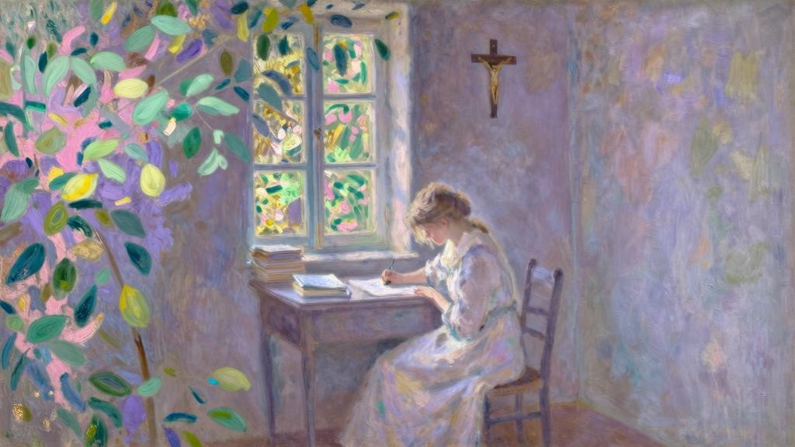
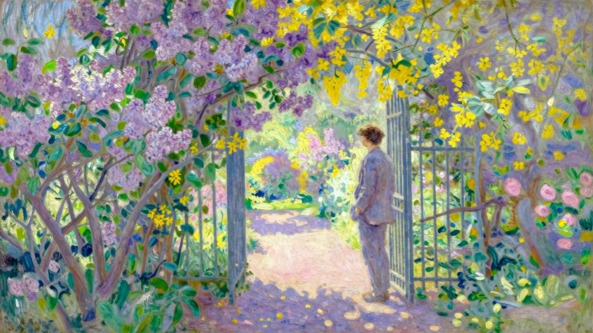

在我的生命里，除了爱情找不到别的意义，于是紧紧抓着它。除了期待我的爱人到来之外，我什么也不等待，也不愿等待。

次日，我正准备去看看，姨妈却叫住了我，递给我这封刚收到的信。

……医生给朱莉叶特开了药剂，她激动的情绪才缓和下来。我希望杰罗姆这几天都不要来这里。朱莉叶特能听出他的声音和脚步声，现在她需要绝对静养……

朱莉叶特这种情况，我怕是分身乏术了。假如在杰罗姆离开前，我还是不能见见他，亲爱的姑妈，烦请您转告他，我会给他写信的……

这道禁令只针对我，其他任何人都可以去布科兰家登门造访。姨妈也来去自如，今天早上还打算去一趟。我还能搞出什么动静呢？多么糟糕的借口都无所谓！

“好吧，我不去了。”一方面，不能立刻见到阿莉莎让我很难受；但另一方面，我也害怕再见到她，怕她把妹妹的病归咎于我。对我来说，与其见到她生气，还不如不见她来得容易些。

无论如何，我还想再见见阿贝尔。在他家门口，有个女仆交给我一张字条。

我给你留言是为了避免你担心。我无法忍受留在勒阿弗尔，离朱莉叶特那么近，所以昨晚和你分手后，我就立刻乘船去南安普顿了，打算去伦敦S君那里度过剩下的假期，我们回学校见吧。

世间所有的援助一道消失了。这里留给我的只有痛苦，所以我没待多久，在开学之前就回到了巴黎。我把目光转向上帝，转向施与所有恩泽、真实慰藉和理想馈赠的上帝，把痛苦呈献在他面前。一想到阿莉莎在寻求上帝的庇护，想到她也在祷告，我的祈祷也便受到鼓舞和激励。

时光在沉思和学习中飞逝而去。这一长段时间里，除了我和阿莉莎往来通信外，没有任何事发生。我留着所有信件，此后惝恍迷离之时，就是靠这些重拾记忆的。

起初是姨妈告知我勒阿弗尔的消息的，也只有姨妈而已。她说，最初几天朱莉叶特病情堪忧，让人操碎了心。在离开十二天之后，我终于收到阿莉莎的字条。

亲爱的杰罗姆，原谅我没有早日给你写信。可怜的朱莉叶特病成这样，我实在抽不出时间。自从你走后，我在她身边几乎寸步不离。但我让姨妈给你捎信了，她应该也跟你说过，这三天来朱莉叶特的病情有所好转。感谢上帝，但还不敢高兴得太早。

到现在为止，我还没怎么跟你们提过罗贝尔，他在我走后没几天也回到巴黎，还给我带来他姐姐们的消息。我照顾他，也是因为她们，而不是性格上自然的偏好使然。他就读的农业学校每回放假，我就负责照看他，尽可能让他散散心。

从他那里，我打听到一件不敢向阿莉莎和姨妈问起的事：爱德华·泰西埃尔常来询问朱莉叶特的消息，但在罗贝尔离开勒阿弗尔之前，朱莉叶特并未再见这位男士。我还了解到，自我走后，朱莉叶特在姐姐面前始终缄默不语，让人束手无策。

没过多久，我从姨妈那里得知朱莉叶特订婚的消息，听说她还要求尽早公布婚讯。但我猜阿莉莎是反对这场婚事的，她好说歹说，试图破坏和阻止这个决定。朱莉叶特却眉头紧锁，对此视而不见，选择沉默以对。

时间一天天过去，阿莉莎的信里却只有令人沮丧的消息，我不知道该回些什么才好，冬日的浓雾包围着我，唉！所有赤诚的爱意、信仰和不舍昼夜的学习，都无法驱散我心中的黑夜和冰冷。时间如白驹过隙。

后来，在一个春日的早晨，我毫无预兆地从姨妈那里得到一封信，是阿莉莎写给她的，姨妈跟我说自己当时并不在勒阿弗尔。为了说明事情的来龙去脉，我引用了信中的内容：……钦佩我的屈服吧！在你的鼓励下，我见了泰西埃尔先生，和他聊了很久。我承认他表现得很好，让我几乎可以相信和承认，这桩婚事可能并不像最初担心的那样糟糕。当然，朱莉叶特不爱他，但随着日子一周一周过去，我越来越觉得他是值得被爱的。他能清醒地洞察自己的处境，也没有误解我妹妹的品性。但他深信自己爱情的效力，觉得持之以恒就能战胜一切。这意味着他爱得很深。

事实上，杰罗姆照顾我弟弟，令我深受感动。我想他这么做只是出于责任，或是讨我欢心，毕竟罗贝尔的性格与他几乎完全不同。他肯定已经意识到，承担的责任越艰巨，灵魂越能得到训练和升华。这种想法多高尚呀！别笑话你的大侄女，因为正是这样的想法支撑着我，让我努力把朱莉叶特的婚事想成一件好事。

亲爱的姑妈，你热心的关怀让我心里很暖。不过，你也不要只觉得我不幸，可以说，恰恰相反，朱莉叶特刚经受的考验在我身上也产生了影响。“信任别人必招来不幸。”《圣经》上的这几句话我曾反复念诵，并没有彻底理解，现在却恍然大悟。这段话最初并不是在《圣经》里找到的，而是在杰罗姆给我寄来的圣诞卡片上看到的，那年他还不到十二岁，我才刚满十四岁。卡片上画有一束花，我们都觉得非常好看，上面还有高乃依的一首诗：是何等战胜尘世的魔力，引我来见上帝？

依赖他人之人，必将遭遇不幸！

不过，我承认自己更喜欢耶利米简练的诗句。杰罗姆选择卡片的时候，肯定没大注意卡片上的这句诗。但从他后来的信中可以断定，他如今的爱好倒是和我颇为相似。我每日都感谢上帝，将我们二人一起拉向了他。

我记得我们的那次谈话，此后我不再像过去那样给他写长信了，以免打扰他学习。你一定觉得我谈论他是为了获得补偿，我怕再说下去就没完没了了，就此搁笔吧。这一次，别太埋怨我。

这封信真让我百感交集！我责备多管闲事又守不住秘密的姨妈。该有多没心没肺，才会把信拿给我看呀！阿莉莎在信中暗示的那次谈话又是怎么回事？竟招来她的沉默？我千方百计无视她不跟我说话这件事，她竟然还写信告诉别人！这封信里的一切都让我恼火！我们之间的小秘密，她就那样轻易地说给姨妈听，语气还那么自然，那么平静，那么认真，那么愉快……

阿贝尔对我说：“不，可怜的朋友！你生气，只因为这封信不是寄给你的。”阿贝尔成了我每天的伙伴，也是我唯一能谈心的对象。当我陷入孤独，被软弱侵袭的时候；当我发牢骚求同情，甚至自我怀疑的时候，总是不断向他倾诉。尽管我们性格迥异，或者正是因为我们的不同吧，每当我处于困境中时，总是很信任他给的建议。

“研究一下这封信吧。”他说着，把信摊在书桌上。

这封信在我身边已经留了四天三夜，我在气愤中度过了这些日子。终于，我还是去寻求朋友的意见，这几乎是必然发生的。

“朱莉叶特和泰西埃尔这一对，我们就交给爱情之火了，对吗？我们也知道这爱火值多少钱。当然，在我看来泰西埃尔也不过是扑火的飞蛾……”“别说这个了，”我说，他的玩笑让我不舒服，“说说其他的吧。”“其他的？”他说，“其他的话都是说给你听的。你就抱怨吧！字里行间都装满了对你的思念。这封信完全就是写给你的，费莉西姨妈把这封信交给你，倒算是物归原主。因为不能寄给你，阿莉莎才寄给这位善良的女士，这是不得已而求其次。你姨妈哪懂什么高乃依的诗！顺便提一句，这是拉辛的诗。我告诉你，她这是在和你谈心呀，这一切都是说给你听的。半个月之内，要是你表姐没给你写封一样轻松愉快的长信，就说明你不过是个笨蛋。”“她不大可能这样做的！”“她怎么做全看你了！想听听我的建议吗？从现在起，对你们的爱情和婚姻，你要绝口不提！难道你还看不出来吗？自从她妹妹出事以来，她抱怨的正是你们的爱情和婚姻。

你应该打亲情牌，既然你有耐心照顾罗贝尔这个傻子，就应该锲而不舍地跟阿莉莎说说他。只要让她精神一直愉悦，其余的事自然水到渠成。唉！若是我给她写信的话呀……”“你还没资格爱她。”但我还是听从了阿贝尔的建议。不久，阿莉莎的信果然又恢复了生气。但我并不指望她由衷地感到快乐，也不觉得她能毫不迟疑地放下心来，除非朱莉叶特的处境，或者说她的幸福能得以保障。

阿莉莎告诉我，她妹妹的病情大有起色，婚礼将在七月举行。她还来信表示，那一天我和阿贝尔很可能因为学业缠身而去不了……我明白她是觉得我们不出席婚礼更好一些。

因此，我们以考试为托词，仅仅送去了祝福。

婚礼过后大概半个月，阿莉莎给我写了封信。

亲爱的杰罗姆：昨天晚上，我惊讶极了！偶然翻开你送我的书——那部精彩的拉辛《圣咏集》，在里面恰好看到你以前给我的圣诞小卡片上印的四句诗，这卡片在我的《圣经》

里夹了差不多十年。

是何等战胜尘世的魔力，引我来见上帝？

依赖他人之人，必将遭遇不幸！

我原以为这是高乃依诗歌中的片段，当时也并未发觉其中的妙处。我接着读《圣咏集》第四卷时却对此入了迷，其间的几段诗太美了，我忍不住摘抄下来送给你。毫无疑问，你已经读过了，因为在书的页边上冒冒失失地写了姓名的首字母。（我的确有这个习惯，若是看到喜欢的段落，总会在我们两人的书上，标注上阿莉莎名字的首字母，以引起她的注意。）没关系！我也乐意抄写。起初我确实有些生气，本以为是自己的新发现，你却早就献给我了。但一想到你也喜欢这些诗句，坏情绪就烟消云散了。在誊抄的时候，我仿佛在和你一起重读。

雷鸣般的声音响起，它用永恒的智慧告诉我们：人类，我的孩子啊！

光靠自身会有什么成就呢？

虚妄的灵魂，你从血管里出卖最纯洁的鲜血，多大的谬误啊！

这换取的并非果腹的圣饼，而是食髓知味的幻影。

我提及的圣饼，是天使的食粮。

它出自上帝之手，汲取小麦的精粹。

它令人满口生香，尘世的餐桌怎能得见？

我将它赐予我的信徒。

你们想活着吗？

来吧！

拿着它，吃下去便能生存。

……

被俘虏的灵魂啊，你那么愉悦，在桎梏中寻到了平和，永不干涸的长生之泉将浸润周身。

这甘泉欢迎所有人，每个人都可以饮用。

但我们却疯狂奔向泥泞之所，那里的水池虚幻无实，每时每刻都在漏水。

杰罗姆，这太美了，实在太美了！你是否真和我一样觉得它很美呢？在我的书上还有一条小注释，说曼特侬夫人[1]听德·欧玛尔小姐咏唱这首赞歌时，落了几滴眼泪，并让她再唱了一段。我不知疲倦地来回诵读，对此刻骨铭心。现在唯一让我伤感的是，没听到过你在这里诵读。

我们那对旅行中的夫妇，继续传来佳音。朱莉叶特在巴约纳和比亚里茨有多开心，你早就知道啦，尽管那里酷热难耐。后来，他们又游览了封塔拉比亚，在布尔戈斯做了逗留，还两次翻越比利牛斯山脉……朱莉叶特在蒙塞拉给我写了封热情洋溢的信。他们在返回尼姆之前，打算在巴塞罗那再待个十天。九月份爱德华就得回去安排葡萄收成的事了。

我和父亲回到芬格斯玛尔已有一周，明天阿斯布尔顿小姐也会过来，罗贝尔则要四天后才回来。这可怜的孩子没通过考试，倒不是因为试题太难，而是主考官的题目太刁钻，他一时发了慌。你来信说罗贝尔很用功，所以我不觉得他是准备不足，看来还是主考官喜欢刁难学生的缘故。

至于你的品学兼优，亲爱的朋友，我说不出什么祝贺的话，总觉得是理所当然。

杰罗姆，我对你深信不疑！一想到你，我心中就充满希望。你现在要着手开始上次跟我说过的工作了吗？……

……这里的花园依然如故，房子却显得空落落的。今年我为何求你别来，你应该懂的，对吗？我觉得这样更好些，但必须每天这么跟自己说一遍。因为要那么久不见你，实在是难挨……有时候，我看着书会突然停下来，猛然转过头，不由自主去找你……总觉得你在身边！

我继续写信。夜已深，所有人都睡了，我却还在敞开的窗前给你写信。窗外天气宜人，花园里香气四溢。你还记得吗？我们小时候，一旦看到或听到美好的事物，就会感谢造物主。今晚，我的整颗心也沉浸在对上帝的感恩中，感谢他创造出这么美的夜！蓦然间，我期盼你也在这里，感觉到你就在我身旁，这种感觉如此强烈，也许你也有所察觉。

你在信中说得没错。“在高尚的灵魂中，钦慕同感激融为一体。”我还有那么多事想要写给你！我想起朱莉叶特跟我说过的那个绚丽国度，想起其他一些辽阔、荒凉，又光辉灿烂的国度，心中升腾起某种陌生的信念：终有一天，我们将以我不知道的方式，在未知的神秘大国中相见……

你们很容易想象，这封信给我带来多大的欣喜！因爱之故，我含着泪读完了它。阿莉莎的信一封接一封地来。诚然，她感激我没去芬格斯玛尔，恳求我今年别去见她，但又因我不在而感到遗憾，渴望我能在她身边，每一页纸都回响着对我的召唤。我哪来的力量抗拒这份召唤呢？无疑是听从了阿贝尔的忠告，加上担心欢乐稍纵即逝，不懂灵活变通，才抵抗着内心的躁动。

阿莉莎后来的信中，凡是有利于阐明这个故事的内容，我全部摘录在下面了。

亲爱的杰罗姆：非常开心能读到你的信。我正要答复你从奥尔维耶托寄来的信，正好又收到你从佩罗贾和阿西西寄来的信。我的思想也四处遨游起来，只有身体被留了下来。我随你一起行走在翁布里亚的白色大道上；我们拂晓出发，用崭新的目光看着晨曦……你的确在科尔多纳的露台上呼唤过我吧？我听到了你的声音……在阿西西城北面的山上，我们口渴难耐！方济各会修士[2]递来的那杯水竟如此可口！朋友啊！我能透过你看到世间万物。你写给我的那段圣方济各的话，我太喜欢了！没错！我们应该寻求的不是思想的解放，而是颂扬。思想的解放只能带来可憎的傲慢！我们的志向不该是反抗，而应是侍奉……

尼姆传来的消息极好，上帝似乎允准了我享受快乐。今年夏天唯一的阴影，是我父亲的状况，尽管我悉心照料，他依旧愁容满面，或者说我一让他独处，他就悲伤起来。于我们而言，大自然的欢乐萦绕四周，对他来说却是陌生的，他甚至不愿意聆听大自然的声音。阿斯布尔顿小姐倒还算健康。我给他们念了你的信，每一封信我们都能聊上三天，然后下一封就来了……

……罗贝尔前天离开了我们。他准备去朋友R君家度过余下的假期，R君的父亲管理着一家新型农场。在这边生活，罗贝尔确实快乐不起来，所以当他提出要走的时候，我只能支持他的计划……

……我有那么多话想跟你讲！真希望能无止境地跟你说下去！有时候我又一个字都想不出来，思路也不清晰。今晚给你写信，就彷徨似梦，只有一种沉重的感觉，仿佛有无穷的财富要赠予和获取。

在那么漫长的几个月中，我们是如何保持沉默的呢？我们肯定是在冬眠。啊！这个可怕又沉默的冬天，但愿它永远结束了！自从我重新找回你，对我来说，生活、思想、我们的灵魂都是美妙、可爱而充实的，永不枯涸。

9月12日我收到了你从比萨寄来的信。我们这里也是阳光灿烂，诺曼底从未显得如此美丽过。前天，我独自散步，漫无目的地走了一大圈，穿越大片田野。回到家时，不但不觉得累，反而兴奋不已，整个人沉醉在阳光和欢乐里。烈日下的草垛多美啊！我不需要假装在意大利，就感到一切那么迷人。

没错，我的朋友。正如你所说，我从大自然“模糊的赞歌”中听到和懂得的，正是对欢乐的激励：我在鸟儿的每声鸣唱中听到了它，我在每朵花儿的芳香里嗅到了它。终于，我认定“热爱”是唯一的祈祷形式。我同圣方各济一起说道：“上帝啊！

上帝啊！‘而非他者’[3]，你的心中充满难以言喻的爱。”但你不用担心我会变成盲目无知的人！最近这段时间，因为下雨的缘故，我读了很多书，把“热爱”收进书里……刚看完马勒伯朗士，我就立刻拿起莱布尼茨的《致克拉克的信》。接着，为了调节放松，我又看了雪莱的《钦契》，感觉没意思，而后又看了他的《含羞草》……这么说也许会让你生气，我觉得把所有雪莱、拜伦的作品加起来，都比不上去年夏天我们一起读的四首济慈的颂歌；同样，雨果的所有作品加在一起，也比不上波德莱尔的几首十四行诗。“伟大”这个字眼对于诗人来说，没有任何意义，诗人重要的是“纯粹”……朋友啊！谢谢你让我认识、理解和热爱这一切。

……不，别为了相聚几日而缩短你的旅程。说正经的，现在我们最好还是别见面。相信我，你若在我身边，我就不能进一步思念你了。我不想让你难过，但我现在已不再希望你过来。坦白说，如果知道你今晚要来……我会躲起来的。

唉！别让我解释这种……心情，求你！我只知道无法停止思念你（这一点足以让你感到幸福了），而我也很幸福……

收到这封信后不久，我刚从意大利回来，就应召去南锡服兵役了。我在这里举目无亲，独自一人倒也自得其乐，因为无论是对阿莉莎还是对我这个骄傲的情人来说，情况都更加清楚：她的来信是我唯一的避风港，而对她的思念，用龙沙的话来说，是我“唯一的隐德来希”[4]。

说实话，我很容易经受住严酷的训练，顶住一切困难，在写给阿莉莎的信中，也只抱怨她不在我身边。我们甚至觉得，这样漫长的分离，才是勇气的高尚证明。“你从不抱怨，”阿莉莎在信中这样写道，“我无法想象你软弱的样子……”为了证明这话，我还有什么不能忍受的呢？

从我们最后一次见面到现在，已过了将近一年。她似乎从没想过这一点，现在才开始等我回来，为此我责怪了她。

她却回信说：忘恩负义！我不是和你一起去了意大利吗？一天都没有离开过你。但现在你要明白，在一段时间内，我无法再追随你了，只有这段时间才能被称为“分离”。我的确努力设想你穿军装的模样，但想不出来。最多想到夜晚的时候，你在甘必大大街狭小的卧室里，写信或读信……事实上，我甚至能想到，一年之后在芬格斯玛尔或勒阿弗尔见到你的样子，不是吗？

还有一年！已经走过的日子就不算在内了。我希望将来的这一天，慢一点，再慢一点到来。你还记得花园尽头的那堵矮墙吧，我们在墙角栽种了菊花，也曾冒险爬上去过。你和朱莉叶特大胆地在墙头走着，就像直奔天堂的穆斯林，而我刚走没两步就头晕目眩，你在下面朝我喊道：“别盯着你的脚！要看前方！朝着目标一直向前走！”最后，你爬上墙，在另一头等着我，这比你说的话管用多了。我不再战栗，也不觉得眩晕，只注视着你，朝着你敞开的怀抱奔去。

杰罗姆，若不信赖你，我将成为怎样的人呢？我需要你坚强，需要依靠你。你可不要软弱。

出于挑战的心理，我们故意延长等待的时间。这也是出于恐惧的心理——我们害怕不圆满的重逢，所以商定好了，临近新年的那几天假期，我会去巴黎度过，待在阿斯布尔顿小姐身边。

我和你们说过，我并没有把阿莉莎的信全部抄写下来，下面的内容是我二月中旬收到的信。

前天，我经过巴黎街时异常激动，在M店的橱窗里赫然看到了阿贝尔的书。你虽然跟我提过，我却不大相信。我情不自禁地走了进去，但又觉得书名很可笑，不知怎么开口跟店员说，一度想随便抓起一本，离开了事。幸好柜台边有一摞《如胶似漆》放在那里，唾手可得。我不用开口，只要拿走一本，扔下一百苏就行了。

真感谢阿贝尔没给我寄书！我每翻一页都觉得丢脸！虽然书里蠢话比下流话多，但我并不是因为书本身而感到丢脸，而是因为阿贝尔而感到羞耻。因为这是阿贝尔·沃蒂埃——你的朋友所写的。我在书中一页页找寻《时代》杂志评论家所发现的“伟大天才”的痕迹，却是徒劳。在勒阿弗尔的小圈子里，人们也经常谈起阿贝尔，我听说这本书取得了巨大成功，人们把这种无可救药的轻佻称为“轻盈”和“雅致”。当然，我谨慎地保留意见，只是和你谈谈读后感。可怜的沃蒂埃牧师，起初也觉得失望，后来，由于身边的人对此赞不绝口，让他开始怀疑是否该引以为豪。昨天，在普朗提埃姑妈家，V女士突然对他说：“牧师先生，您儿子取得了这样可喜的成就，您应当高兴才是啊！”他有些尴尬地回答道：“上帝啊，我还没有这种感觉……”姑妈连连说道：“您会有的！会有的！”她一点没有开玩笑的意思，这种鼓励的语气却把所有人，甚至牧师都逗笑了。

我还听说，阿贝尔正准备为某个通俗剧院创作剧本《新阿坝亚尔》，报纸上早已议论纷纷，但是搬上舞台后会成什么样子呢？可怜的阿贝尔，这真的是他渴望的成功吗？他会为此感到满足吗？

昨天，我读了《永远的安慰》[5]，里面写道：“凡是真正渴望真实荣耀的人，必会放弃世俗的荣耀；但凡无法鄙视现世荣耀的人，显然并不会真正爱上天主的荣耀。”由此我想：“感谢上帝，选择杰罗姆来接受这份天主的荣耀，与之相比，另一种荣耀根本不值一提。”时间在单调的事务中流逝，一个个星期、一个个月就这么溜走了。我的思想只陷在回忆或者希望之中，倒不觉得时光漫漫、岁月冗长。

六月，朱莉叶特的孩子差不多要出生了，舅舅和阿莉莎本该那时去尼姆市郊找她。但因为那边传来不太好的消息，他们就提前动身了。阿莉莎也给我捎来了信。

你最近一封寄到勒阿弗尔的信，是我们离开之后才寄达的。不知道怎么回事，这封信八天之后才转到我手里。整整一周，我都魂不守舍、心乱如麻又疑神疑鬼，整个人都病恹恹的。兄弟呀！和你在一起的时候，我才是真正的我，才能超越自己。

朱莉叶特的身体又好转了，指不定哪天就会分娩，我们并不太担心。她知道我今早给你写了信。我们到达埃格维弗的第二天，她就问过我：“杰罗姆呢，他怎么样……还一直给你写信吗？”我无法对她撒谎，于是她说道：“下次你给他写信的时候，告诉他……”她略微迟疑，又无比温柔地笑着说道：“我已经恢复了。”她之前的来信都显得那么愉快，我其实有些担心她在假装幸福，为了骗我，也骗她自己。她今日的幸福，同她过去梦想的幸福及幸福所依之人大相径庭……

唉！幸福与灵魂休戚相关，构成幸福的外部因素则无关紧要！我独自在加里哥灌木丛散步时的诸多思考，就不多说了。散步时最让我吃惊的是，朱莉叶特的幸福本应让我满心欢喜，但让人难以理解的是我心里并未感到开心，为什么反而涌起一阵摆脱不掉的忧郁呢？连当地的美景，都进一步加深了这份难以名状的忧愁……

你在意大利给我写信时，通过你，我看到世间万物；如今少了你，我看到的世间万物，都觉着是从你那里窃取来的。在芬格斯玛尔和勒阿弗尔，我习惯了雨天，培养出了耐受力；但在这里，这种能力毫无用处，因为它不再有用武之地，我总感到不安。当地的景致和人们的笑声令我不快，我所说的“忧郁”，也许仅仅只是不像他们那般喧闹罢了。我过去的欢乐中肯定包含某些骄傲的成分，如今置身于这陌生的欢快氛围中时，才会感觉到一种近乎屈辱的情绪。

来到这里之后，我就不大祈祷了，而且有一种幼稚的感觉——觉得上帝不在原来的地方了。再见，就此搁笔吧。我为这句亵渎神明的话而羞愧，也为自己的软弱和忧郁而羞赧。我竟然承认并写下了这一切，如果这封信今晚不发出去，明天会被我撕掉的……

阿莉莎的下一封信只谈了刚出生的外甥女，说会当她的教母；也谈到了朱莉叶特和舅舅有多么高兴；她自己的心情，却只字未提。

继而，又是从芬格斯玛尔寄来的信，说七月份时，朱莉叶特曾来看她。

今天早上，朱莉叶特和爱德华离开了我们。我最舍不得的还是我那小教女，她到现在为止的动作，无一不是在我的眼皮底下做出来的。而半年之后我再见到她，恐怕就认不出她的万般姿态了。成长这件事，总是那么神秘莫测又出人意料。只因为我们不大留意，才没有时常感到惊讶。我俯身，充满希望地望着小摇篮，时间流逝过去。是何等的自私、自满和不思进取，才让人类的这种发展戛然而止啊，离上帝还那么遥远，就定型了吗？唉！如果我们能够，并且想要再靠上帝近一些，这将是何等美好的竞赛啊！

朱莉叶特看起来很幸福。起初，我见她放弃钢琴和阅读，还觉得伤心，但爱德华·泰西埃尔不喜欢音乐，对阅读也不大感兴趣。既然是不能相互分享的乐趣，朱莉叶特放弃，也算明智之举。反之，她对丈夫的事业倒有了兴趣，爱德华也向她传授了所有生意经。今年，他的生意大有发展，他开玩笑说，是这门亲事促使他在勒阿弗尔赢得了大量客户。他最近一次洽谈生意时，让罗贝尔也跟着去了，并对他关怀备至，还声称了解他的个性，他相信罗贝尔对这类事情会产生实实在在的兴趣。

父亲看到女儿获得幸福，恢复了活力，身体也好转多了。他又开始关心农场和花园，有时还会让我继续高声朗读德·于布内男爵的游记。这本书我也非常喜欢，阿斯布尔顿小姐也在的时候，我给他们念过，但因为泰西埃尔一家的到访而搁置了。现在，我有更多的时间来读书，还等着你指点一二。今早，我翻了好几本书，对哪一本都提不起兴致来！

从这时起，阿莉莎的信显得越发不安和迫切。时至夏末，她给我寄来一封信。

我怕你担心，所以没告诉你我有多盼望见到你。与你重逢前的每一天都压得我喘不过气来。还有两个月！在我看来，却比离开你的所有日子加起来都要漫长！我试图做些其他的事来消磨等待的时光，这些事在我看来却成了微不足道的临时消遣，我无法逼迫自己做任何事。在我眼里，书籍失却了价值和魅力，散步也没了吸引力，整片大自然都丧失了魔力，花园黯然失色，也没了芳香。我羡慕你的兵役，羡慕那些由不得你选择的强制训练，它让你身心俱疲，无暇沉浸于内心世界。白天匆匆而过，到了夜晚，疲惫不堪的你立刻沉入梦乡。你描绘的操练那么动人，让我难以忘怀。最近几天晚上，我睡得不大好，好几次听到起床号角便倏然醒来，实实在在地听见了。你所说的那种微醺状态，那种清晨的喜悦，以及蒙眬惺忪的感觉，在我想象中是那么真切。在令人目眩的清冷黎明，马尔泽维尔高原该有多美啊！

我近来身体欠佳。唉！也没什么要紧的，大概只因为我等你等得太苦了些。

六周后，我又收到她的来信。

朋友，这是我最后一封信了。你的归期虽然尚未确定，大概也不会太远，所以我不能再给你写信了。我本期盼能在芬格斯玛尔与你重逢，但现在的季节糟糕起来，天很冷，父亲常把回城挂在嘴边。朱莉叶特和罗贝尔目前都不在身边，你可以安心住下来。不过，你最好还是住在费莉西姑妈家，她也会很高兴接待你的。

我们重逢的日子越来越近，我却等得越发焦急起来，简直是担惊受怕。我曾那么期盼你归来，如今却仿佛惧怕起来。我努力不去想这件事，但脑海里还是会浮现你按门铃的样子、走上楼梯的样子，我的心停止了跳动，很难受……千万别期待我会对你讲什么话……我感到过去终结于此，也看不见任何未来，生命停在了这一刻……

四天之后，也就是退伍前一周，我又收到一封短信。

朋友，我完全同意你的想法——不要在勒阿弗尔逗留太久，也不要将我们初次重逢的时间拉得过长。我们要说的话，不是都写在信中了吗？如果从28号起，你就要回巴黎注册，就别犹犹豫豫的，甚至别因为只见两天而感到可惜，我们不还有整整一生的时间吗？

[1]曼特侬夫人（Madame de Maintenon）：法国十七世纪名媛，曾与路易十四秘密结婚。

[2]方济各会修士（Franciscain）：圣方济各是耶稣会的创始人之一，意大利的阿西西是圣方济各的安葬之地。方济各会是一个跟随圣方济各教导及灵修方式的修会。方济各会修士会将所有财物捐给穷人，靠布施行乞过生活，他们着灰色会服，故又称灰衣修士。

[3]原文是意大利语：E non altro。

[4]唯一的隐德来希：唯一的圆满。“隐德来希”为古希腊亚里士多德的话，意为“圆满”。

[5]《永远的安慰》（Internelle Consolacion ）：中世纪法国的宗教书籍。
