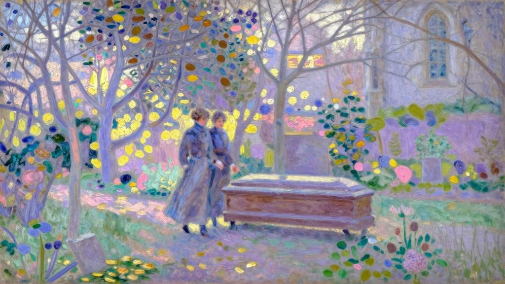

我们第一次见面是在姨妈家。服完兵役后，我感到自己变得笨拙而迟钝……事后，我才想到她一定觉得我变了。但于我们而言，这种初见的错觉有何紧要？从我的角度来说，因为生怕不能完全认出她来，起初还不大敢抬头看她……不，让我们不知所措的，不如说是被强迫扮演未婚夫妻的荒唐角色，以及每个人都避开我俩，好让我们单独相处的殷勤态度。

“姑妈，但你完全没妨碍我们呀，我们并没有任何秘密要说。”阿莉莎忍不住大声说道，姨妈躲避的意图太明显。

“有的！有的，孩子们！我太了解你们了，如果长时间没见面，总有一箩筐的事儿要说……”“求你了，姑妈，你要是走开，我们会生气的。”阿莉莎的语调近乎恼火，让我很难认出她的声音。

“姨妈，我向你保证，你若是走了，我们就一个字都不说了！”我笑着补充道，一想到我们要独处，我心里也充满惶恐。我们三人接着聊天，伪装成开心的模样，却说着无聊的事，装作激动兴奋，以掩饰内心的慌乱。我们第二天还要见面，因为舅舅邀请我去吃午饭，所以第一天晚上，我们轻而易举地分别了，也很高兴这出闹剧终于收了场。

离午饭时间还有好一会儿，我就已经来到舅舅家。但阿莉莎正好在同一位女性朋友聊天，没法打发她走；对方也不太识趣，赖着不走。最后她总算让我们单独相处，我还假意吃惊，因为阿莉莎没留她吃午饭。我们俩都焦躁不安，因一夜未眠而筋疲力尽。舅舅过来了，我觉得他越发老迈，阿莉莎一定察觉到了。他的耳朵变得不太灵光，也听不清我说什么。为了让他听清，我必须大声嚷嚷，这让我的话变得很蠢。

午饭过后，按照原先说好的，普朗提埃姨妈开车来接我和阿莉莎去奥尔谢，好让我们在回来的时候能单独走走，那段路的风景最宜人。

这个季节天气炎热，我们散步的这段海岸暴晒在阳光下，毫无魅力可言。树枝光秃秃的，没有任何遮阴的地方。姨妈的车停在前面，我们担心她等久了，急着赶路，十分别扭地加快脚步。我头疼得厉害，什么话题都想不出来，为了显得自然一些，或是为了代替言语，我在散步时牵起阿莉莎的手，她也任凭我牵着。心情激动，加上走路走得气喘吁吁，在尴尬的沉默下，血气涌上了我们的脸颊：我听到太阳穴跳得厉害，而阿莉莎的脸色也红得不自然。才过了一会儿，我们就觉得潮乎乎的手握在一起太难受，于是松开了——两只手凄凉地垂落下去。

我们走得太急，比姨妈的车还早到路口许久。姨妈走了另一条路，为了给我们留足聊天的时间，开得很慢。我们坐在路堤上，浑身是汗，忽然一阵凉风吹来，我们打了个寒战，赶紧又站起来，去迎姨妈的车子……最糟糕的还是可怜的姨妈，她操心过了头，确信我们一定说了很多话，想询问订婚的事。阿莉莎再也忍不住了——眼中满含泪水，推说是头痛欲裂。回程的一路就在沉默中结束了。

第二天，我醒来时腰酸背疼，还感冒了，浑身难受，所以直到下午才决定去布科兰家。

不巧，阿莉莎家有客人，是费莉西姨妈的某个孙女——玛德莱娜·普朗提埃，我知道阿莉莎喜欢经常和她聊天。玛德莱娜这几天都住在祖母家里，所以一见我进门，就嚷道：“如果你从这里出发去‘斜坡’的话，我们可以一起走。”我机械地点了点头，这样一来，我就无法和阿莉莎单独聊了。但有这个可爱的孩子在，无疑也帮了我们大忙，我不再像昨天那样尴尬。我们三人谈得很自在，比我起初担心的有意思得多。我向阿莉莎道别时，她古怪地微笑着，好像此前并没意识到我次日就要离开。想到此次别后，我们很快会再见，告别时也就没有出现悲伤的场面。

但是晚饭过后，我隐约感到不安，便又下了山。在城里晃了将近一个小时，才下定决心再按一次布科兰家的门铃。应门的是舅舅，阿莉莎身体不适，早就回房去了，肯定已入睡。我和舅舅稍微聊了聊，便离开了。

这些意外太令人不快了，但责怪又有什么用呢？就算事事称心，我们也会生出尴尬来。

阿莉莎也察觉到了这一点，没有什么比这更令我痛心了。我刚回到巴黎，就收到了她的信。

我的朋友，这次重逢太可悲了！你似乎在怪罪别人，这一点恐怕你自己都无法信服吧。现在，我想这状况永远不会改变了。唉！求求你，我们别再见面了！

我们明明有那么多话要说，为什么还会这么尴尬，这么做作，这么无力，这么沉默呢？你回来的第一天，面对这种沉默，我还觉得挺开心。因为我总觉得它会烟消云散，在离开之前你总会对我说些美妙的事。

但是，奥尔谢的散步在凄凉中落幕了，尤其是我们的手，各自松开，又无望地垂落下来。这让我悲痛欲绝。最令我伤心的不是你松开了握着我的手，而是我感觉到自己的手在你手中并不舒服，即便你不松开，我也会松开。

次日，也就是昨天，我发疯似的等了你一早上，太烦躁了，根本无法待在家中，所以给你留了张字条，让你来堤岸找我。我久久望着波涛汹涌的海浪，但你不在我身边，让我异常痛苦。于是我回家了，猛然想到说不定你就在房里等我。我知道那天下午没空，因为本打算早上见你，所以前一天玛德莱娜说下午会造访时，我也就同意了。不过，也许正因为有她在场，我们才获得了这次重逢中唯一美好的时光。有些瞬间，我还产生一种奇特的幻觉——这次谈话会持续很久很久……

当你凑近我和她坐着的沙发，俯身向我告别时，我什么也答不上来，觉得一切都结束了，这时才恍然大悟，你是要走了。

你和玛德莱娜刚出门，我就觉得这是不可能的，难以忍受。你知道吗？我又出了门！想再和你谈谈，把没有说出口的话全说出来。我跑到普朗提埃姑妈家，这时天色已晚，我不敢，也没有时间说什么了……于是绝望地回到家，动笔给你写信……想写一封诀别信，告诉你，我再也不给你写信了……因为我深深感到，我们所有的通信不过是一场海市蜃楼。唉！我们两人的信都是写给自己看的……噢！

杰罗姆！杰罗姆！我们还是永远分开吧！

我确实把这封信撕掉了，但现在又重写一封，几乎和上一封完全一样。朋友啊！

我对你的爱丝毫未减，非但如此，你一靠近，我就慌乱局促，从未像现在这么强烈地感受到：我爱你那么深，却那么绝望。我必须承认，你也看到了：离你越远，我就越爱你。唉，这一点我也曾预料到！这次期盼已久的重逢让我彻底了解了，所以我的朋友，你也一样，相信这一点非常重要。别了，我挚爱的兄弟，愿上帝保佑和指引你，只有在他面前重聚，我们才不必受罚。

仿佛这封信还不够让我痛苦似的，她在第二天又给我寄来一段附言。

在给你写完这封信后，我必须跟你提个要求：在关于我们两人的事上，你还是多谨慎些。你曾不止一次将我们的事告诉了朱莉叶特和阿贝尔，这伤害了我。正因为如此，在你自察之前很久，我就已觉得：你的爱理性居多，是一种美好的执拗——坚持着理智的温柔和忠诚。

毫无疑问，她是担心我给阿贝尔看这封信，才加上最后几句话。她是察觉到什么才起了疑心呢？进而发出这样的提醒？是恰好从我最近的话语中察觉到些许朋友建议的影子吗？

其实，我早觉得和阿贝尔相距甚远，我们走上了两条完全不同的路。我学会了独自承受痛心彻骨的悲伤和重负，这种嘱咐于我而言完全是多余的。

随后三天，我心中填满不平。我想给阿莉莎回信，又怕讨论太较真，申辩太激烈，还怕用词的不妥帖，从而加深创伤，难以愈合。为了爱情，我奋力抗争，反反复复地提笔写信。如今重读这封被泪水浸透的信时，我依然泪流满面。这就是最终寄出的那封信的副本。

阿莉莎！可怜可怜我，也可怜可怜我们吧！你的信让我难过。对于你的恐惧，我真希望能一笑了之！没错，你写的我都感受到了，只是害怕承认。你把本是臆想的东西变作可怕的现实，竟还加固了它，横亘在我们之间！

如果你没那么爱我……啊！这种残酷的设定我根本没想过，同你整封信的意思也背道而驰！阿莉莎呀，你这一时的惊惧有何紧要？一讲道理，我便词穷，只听见心在呻吟。我太爱你，所以显得笨拙，我越爱你，越不懂怎么跟你沟通。所谓的“理性之爱”——你想让我怎么回答呢？我用整个灵魂在爱你，你叫我如何区分心与理智？既然我们的通信被你指责，让你那么难受；既然这些信抬高我们，又那么无情地将我们抛到现实中去，害我们差点丧命；既然你现在认为，你的信只是写给自己看的；既然我没有勇气再看一封和之前一样残忍的信，那求你了，我们暂时不要通信了。

在这封信接下来的部分中，我否定了她的“判决”，并提出“抗诉”，恳求她把希望放在下一次会面。我们上一次会面，事事不顺：环境、季节、身边的人，就连那些热情的信件，都没为我们准备周到。所以，下一次会面之前，我们要保持沉默。我期待它发生在春天的芬格斯玛尔，在那里，过去的时光会为我辩护，舅舅也很乐意在复活节假期时接待我。至于多住还是少住几日，我会根据阿莉莎的意思来办。

既然主意已定，信一发出，我便专心投入学习了。

不过，年底之前我就再次见到了阿莉莎。只因近几个月来，阿斯布尔顿小姐的身体每况愈下，在圣诞节前四天去世了。我退役以后，又和她住在一起，几乎寸步不离她身边，陪她走过最后的时光。阿莉莎给我寄来明信片，这证明她遵守了我们保持沉默的誓言，甚至把它看得比我的哀恸更重。她坐火车来，只为了参加葬礼——因为舅舅来不了，下一班火车她就要赶回去。

葬礼上几乎只有我和她。我们陪送灵柩，并肩走着，几乎没有说话。但在教堂里，她坐在我身边，有好几次我感觉到她温柔地注视着我。

“说好了，”临别时，她对我说道，“复活节前什么都别谈。”“好的，可复活节……”“我等你。”我们来到墓园门口。我提议送她去车站，她却招手叫了一辆车，连句道别的话都没讲就离开了。
