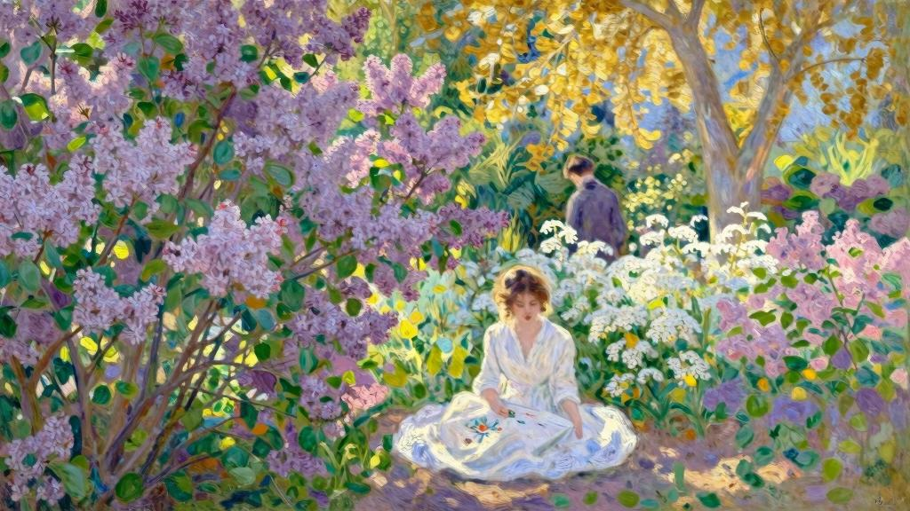
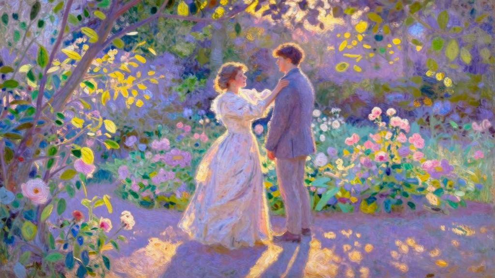

四月底，我来到芬格斯玛尔。

“阿莉莎在花园等你。”舅舅像父亲一样拥抱我，这样说道。起初，见阿莉莎没来迎接，我的确有所失望，但很快又心生感激，因为她免去了我们重逢时俗套的寒暄。

她在花园尽头。我朝着圆形路口走去，四周花团锦簇，开满丁香、花楸、金雀花、锦带花……为了避免大老远就看到她，或者说为了不让她看见我走来，我走了花园另一边的“黑暗小道”。浓荫下空气清洁，我慢慢踱步：天那么暖，那么亮，那么精致纯净，仿若我的欢愉。她必定盼着我从另一条路过去，我悄无声息地来到她身边，走到她身后，停下脚步，时间也随我一道停下来……我心想，就是这一刻，也许这是最美好的时刻——它先于幸福而来，甚至胜于幸福本身。

我走了一步，想跪在她身前。她却听到了，猛地站起来，手中的刺绣也落在地上。她伸出双臂，把手搭在我肩上。我们就这样待了片刻。她一直伸着手臂，倾着头微笑，温柔地看我，一言不发。她穿了一身白衣，在那张过于严肃的脸庞上，我又看到孩子般的笑容……

“听着，阿莉莎，”我突然高声说道，“我有十二天的假期，你若不高兴，我一天也不会多待。我们约定个暗号吧，看到它，表明我第二天就必须离开芬格斯玛尔。而且次日说走就走，不非难，也不抱怨，你同意吗？”这番话我事先并无准备，却说得极其自然。她想了想，回答道：“我下楼吃晚饭时，脖子上若没有戴你喜爱的紫晶十字架……你就明白了吧？”“那会是我在这里的最后一晚。”“你真能就那么走吗？”她继续道，“不流泪，不叹息……”“也不告别，我会像前一天那样与你分别，看起来漫不经心。你起初还会纳闷——他真的明白吗？但第二天早上，当你想找我时就会发现，我已经不在了。”“第二天，我也不会去找你。”我接过她伸出的手，放在唇边吻了吻，继续说道：“从现在起，直至那最后一夜，不要给我任何能产生预感的暗示。”“你也一样，不要给我任何即将离开的暗示。”这场一本正经的会面很可能引起我们之间的尴尬，现在是时候打破它了。于是我说道：“我非常希望在你身边的这几天，能像过去一样……我是说，我们都别把这些日子想得太特殊，也先别急于找话题聊……”她笑了起来。我补充道：“难道我们就没有可以一起干的事吗？”我们一直对园艺感兴趣。不久之前，一个没经验的新园丁取代了老园丁。花园荒废了两个月，能打理的地方有不少：玫瑰没有修剪，有些长得密密麻麻，枯枝缠绕；另有一些攀着墙壁，但缺乏支撑，塌落下来；还有些疯长的树枝，吸走了其他枝叶的营养。大部分花木都是我们从前嫁接的，我们认得出来，但照料起来很费时间。所以头三天，我们虽然说得挺多，但都无关紧要，而且不说话的时候，也不觉得冷场。

我们就这样又习惯了彼此。我对于这种习惯的倚重，高于任何解释说明。就连之前分离的事，都被我们淡忘了。同样，我本来常常能感到她的恐惧——那种对我内心畏怯的深深不安，如今也减弱了。阿莉莎看起来更年轻，比我上次秋日之行时强多了，她从未显得如此美丽过，但我还没吻过她。每天晚上，看见她上衣的小金链子上，还吊着那闪亮亮的紫晶小十字架，我就充满信心，重燃起希望。我说了“希望”吗？其实我已经深信不疑，脑海中觉得，阿莉莎也和我一样。因为我不再怀疑自己，对她也不再疑心重重。

我们的谈话逐渐大胆起来。

一天早上，天气可爱迷人，我们的心情也如同盛放的鲜花。我说道：“阿莉莎，现在朱莉叶特已经得到幸福，我们也别落下，我们也……”我看着她，缓缓道来。她的脸色突然一片煞白，所以我没能说完。

“我的朋友！”她说道，但没有转过头来看我，“和你在一起，我很幸福，比我认为的还要幸福……但相信我，我们并不是为了幸福而生的。”“除了幸福，灵魂还能追求什么呢？”我冲动地嚷道。

她却低声细语：“神圣……”声音那么小。与其说是我听到的，倒不如说是猜到的。

所有的幸福都张开翅膀，离开我，冲向云霄。

“没有你，我达不到。”我说道，脑袋抵着她的膝头，哭得像个孩子，但并不是因为伤心，而是因为爱情。我继续道：“不能没有你，不能没有你！”这天像往常一样过去了。但到了晚上，阿莉莎没戴那条紫晶小首饰。为了信守承诺，次日，天刚拂晓，我便离开了。

第三天，我收到下面这封古怪的信，信件开头引用了莎士比亚的几句诗作为题词。

又奏起这个调子来了！它有一种渐渐消沉下去的节奏。

啊！它经过我的耳畔，就像微风吹拂一丛紫罗兰，一面把花香偷走，一面又把花香分送。

够了！别再奏下去了！

它现在已经不像原来那样甜蜜。[1]没错，我的兄弟，我还是情不自禁地找了你一早上，无法相信你已走了，还恨你信守承诺。我总想，这是闹着玩儿的，所以走过每片灌木丛时，总盼着你会从后面出现。但是没有，你真的走了。谢谢。

在当天剩下的时间里，我的脑海中萦绕着几个坚定的想法，我想告诉你。我有种奇怪而清晰的恐惧，总觉得若不告诉你，不久以后，会对你产生亏欠，你的指责也变得理所当然。

你来到芬格斯玛尔的头几个小时，我感到惊奇，之后很快又不安起来，因为在你身边，我整个身心有一种奇异的满足。你跟我说过：“那么满足，所以别无所求！”唉！连这句话都让我不安……

朋友啊，我担心你误解我，尤其担心你把我灵魂中最强烈的情感表达，当作是为了钻牛角尖而说理。啊！那就大错特错了。

“如果幸福不能让人满足，就不是幸福。”你这么跟我说过，还记得吗？我当时不知如何应答。但不是的，杰罗姆。我们无法满足，也不该满足。这种满足充满乐趣，但我们不该当真。今年秋天时，我们不是早就明白这满足中隐藏了多少不幸吗？

千真万确！上帝保佑它并不存在！因为我们是为了另一种幸福而生的……

早前的书信破坏了我们秋天的重逢，同样，昨日与你见面的回忆，也破坏了我今天写信的意趣。从前给你写信时的陶醉，如今都去哪儿了？这些书信和会面，耗尽了我们在爱情中所追求的纯粹欢乐。现在，我忍不住像《第十二夜》中的奥西诺那样大喊：“够了！别再奏下去了！它现在已经不像原来那样甜蜜。”再见，我的朋友。现在起去爱上帝吧。[2]唉！你可知道我有多爱你吗？……我永远都是你的阿莉莎。

我对于美德的圈套无能为力。所有英雄主义都吸引着我，令我着迷。因为我把美德和爱情混为一谈，所以阿莉莎的信让我陷入最轻率的热忱之中。上帝明鉴，我努力追求更高的美德，只是为了她。只要攀登，任何小径都能带我上去同她会合。啊！地面再怎么快速收缩都嫌不够，愿到最后这片土地只能装下我们两个！唉！对她精妙的伪装，我并未起疑心，也没能想到，她借助“山顶”再一次逃离了我。

我给她回了封长信，只记得有这样一段还算有远见的话，我对她说：我常常觉得，爱情是我拥有过最美妙的东西，我的所有美德都依附于它。它让我腾空超越自己，但若没有你，我会再次跌至平庸之地，回到极寻常的秉性中去。

因为抱着与你重逢的期待，在我眼里最险峻的小道也总是最好的。

我到底还写了些什么？促使她给我回了以下内容：我的朋友，可“神圣”并非一种选择，而是无法逃避的“责任”。如果我没有看错你，你也无法逃避这份“责任”。

在她的信中，“责任”下方画了三道线，以示强调。

一切都结束了。我明白，更确切地说是我预感到了，我们的通信就此结束。无论多狡猾的建议，多执着的意念，都无济于事。

但我仍给她写柔情万种的长信。在寄出第三封信后，我收到了这张字条。

亲爱的朋友：别以为我下定决心不给你写信了，我只是没了兴致。你的信还是能带给我愉悦，但我自责起来，真不该在你心中占据这么大的位置。

夏天不远了。这段时间我们就不要写信了。九月的下半月，你可以来芬格斯玛尔，在我身边度过。你同意吗？如果同意，就不必回信了。我会把你的沉默视作默许，希望你别回信了。

我没有回信。毫无疑问，“沉默”是她对我最后的考验。经历了几个月的学习和数周的旅行后，我怀着无比平静和镇定的心情，回到芬格斯玛尔。

当初我就没弄明白的事，如何能三言两语陈述出来，让人立刻理解呢？从那时起，我整个人就陷入悲痛之中，除了缘由，现在的我还能描摹出什么来呢？若我无法透过最虚伪的外表，感受到爱情的颤动，直到今日也不会原谅自己。但最初，我只看到这个外表，还因为女友与从前大不相同，而责怪她……不，阿莉莎！其实当时我并不怪你，只是因为再也认不出你来而绝望地悲鸣。如今，我从你沉默的诡计和残忍的谋略中，明白了你的爱有多么强烈。所以，你伤我越深，我不是越该爱你吗？

鄙视？冷漠？不，这里没有任何可以克服的东西，甚至没有可以让我为之斗争的东西。

有时，我也犹疑——我的不幸会不会是凭空臆造？因为它的起因难以捉摸，也因为阿莉莎精于装聋作哑。我能抱怨什么呢？那次阿莉莎迎接我时，比以往任何时候都笑意盈盈，更殷勤，也更关切。第一天，我几乎上了她的当……尽管她换了一种新发型：头发平平地向后梳起，面部线条很突出，仿佛是为了扭曲表情似的；尽管她穿了一件颜色暗沉的胸衣：摸起来质地很差，不太得体，也破坏了她身体的曼妙风韵……但这些有什么关系呢？只要她愿意都可以纠正。我还曾盲目地想，第二天起她就会主动纠正，或者在我的请求之下做出改变。我更担心的是那种关切和殷勤，这在我们之间并不常见。我担心她这么做是出自决心而非激情，冒昧说一句：是出自礼貌而非爱情。

晚上我走进客厅时，惊讶地发现钢琴不在原来的位置。失望之下，我惊呼起来。

“我的朋友，钢琴送去修理了。”阿莉莎异常平静地说道。

“孩子，我跟你说了多少次，”舅舅用一种近乎严厉的语气责怪道，“既然你用到现在都没事，等杰罗姆走后再送修也不迟呀，何必这么着急，剥夺了我们的一大乐趣……”“可是爸爸，”阿莉莎脸颊发红，别开脸去，“我敢肯定，它最近的声音变得特别粗沉，就算杰罗姆也弹不出什么调子来。”“你弹的时候，”舅舅接口道，“听着没那么糟呀。”有片刻光景，阿莉莎俯身待在阴影中，似乎在专心测定沙发套的尺寸。然后她突然离开房间，过了好一会儿才回来，手里端着的托盘上，放着舅舅每晚服用的药茶。

第二天她依然如故，上衣和发型都没变。她和父亲坐在屋前的长椅上，她又赶起昨晚的针线活，确切地说是缝补活：她从一个大篮子里，掏出很多破旧的短袜和长袜，摊放在旁边的长椅或桌子上。几天之后，她又开始缝补毛巾和床单之类的东西……这项工作彻底耗尽她的心力，让她的双唇失去一切表达之力，眼睛也失去神采。

“阿莉莎！”头天晚上我就惊讶地嚷起来。这张面孔失去了诗意，我几乎认不出来，盯着她看了好一会儿，但她似乎并未察觉我的目光。

“怎么了？”她抬起头问道。

“我想看看你能不能听见我说话。你的心思好像离我特别远。”“不，我就在这里。只是这些缝补活太花心思了。”“你做针线活的时候，需要我给你读些什么吗？”“恐怕我没法注意听。”“你为什么要挑这么费神的事来做呢？”“总得有人来做。”“有那么多可怜的女人，得靠这个挣钱。你也非来干这吃力不讨好的活计，总不至于是为了省钱吧？”她立刻肯定地说自己最喜欢这个活。好长时间以来，她都没有干过其他的活了，无疑都生疏了……她边说边笑，声音那么温柔，我却从未这样沮丧过。

“我说的都是再自然不过的事，你怎么哭丧着脸呢？”她的表情分明这样说着。我的心拼命抗争，嘴里却一个字也吐不出来。这种感觉快要让我窒息。

第三天，阿莉莎让我把我们摘完的玫瑰送去她卧室，今年我还未曾踏入过那里，心中立刻升腾起多大的希望啊！她只消用一个字，就能治愈我因伤感而自责的心。

每当走进她的卧室时，我总是很激动。房间布置给人一种雅致的平和感，那是阿莉莎特有的味道。床边和窗帘上投下几道蓝色的暗影；桃花心木的家具明光锃亮。一切都干干净净、整整齐齐，在这份安静恬淡中，我感受到她的纯洁和饱含沉思的优雅。

我从意大利带回来的两幅马萨乔作品的大照片，本来挂在房间床边的墙上，但今天早上，我惊讶地发现，它们不翼而飞了。我正想问问是怎么回事，视线却恰好落到她床头放书的搁架上——这小书库是慢慢积累起来的，这里的书一半是我送的，另一半是我们一起读过的。我才发现这些书全被拿走了，取而代之放上的是我本以为她会嗤之以鼻的东西：一些毫无价值、庸俗不堪的宗教宣传小册子。我猛地抬起双眼，正好看到她在笑。没错，她一边观察着我，一边在笑。

“不好意思，”她随即说道，“是你的表情引我发笑。看到我的藏书，你的表情变化实在太生硬了……”我却一点也没有开玩笑的心情：“不，说真的，阿莉莎，你现在就读这些书吗？”“没错，有什么好奇怪的吗？”“我原认为习惯了营养丰富的食粮，聪明人就绝不会品尝这种索然无味的东西了。”“我不懂你的意思，”她说，“这些书里的思想很朴实，表达也很清晰，我就喜欢和它们沟通，和它们谈心很简单。我早就知道——我和它们谁都不会让步。它们绝不会中了优美语言的圈套，我在读它们时，也不会产生任何世俗的钦佩。”“所以你现在只读这些吗？”“差不多吧。这几个月来都是如此。况且，我也没多少读书的时间。实话跟你说，最近我曾想重读某个伟大作家的作品，就是你之前跟我说过值得敬佩的作家中的一位。我觉得他就像《圣经》里描述的那种人，费尽心力把自己拔高了五十厘米。”“是哪一位‘伟大作家’，竟让你产生如此奇怪的想法？”“并不是他给了我这种想法，是读他的作品让我产生了这种想法……是帕斯卡尔。也许是我看的那段不太好……”她说话的声音清脆而单调，仿佛在背诵课文。手里不停摆弄着鲜花，视线也未曾从花上移开过。

我做了个不耐烦的姿势，为此她停顿片刻，继而用同样的声调说道：“书里用词之浮夸令人咋舌，费尽心机只为证明微不足道的东西。有时我想，他那抑扬顿挫的声调可能并非出自信仰，而是出自怀疑。完美的信仰不会引来那么多眼泪，声音也不会带有丝毫颤抖。”“正是颤抖和眼泪，才展现了这声音的奇美。”我试图反驳，却苍白无力。因为从这番话中，我完全看不到阿莉莎身上曾有的特质——也是我钟爱的特质。

我凭着回忆如实记录这些话，之后也未加任何修饰和逻辑上的整理。

“如果他不先把快乐从目前的生活中清除出去，”她继续道，“那在天平上，目前的生活就会重于……”“重于什么？”我说，她这种古怪的言论令人瞠目结舌。

“重于他所说的不确定的极乐。”“所以你也不信这不确定的极乐吧？”我嚷道。

“这不重要！”她接着说道，“我倒想这极乐是虚虚实实，那就能摒除所有交易买卖的可能了。热爱上帝的灵魂投身于德行之中，是人性高尚使然，而非出于对回报的期许。”“帕斯卡尔的高尚正在于这种秘而不宣的怀疑主义。”“不是怀疑主义，而是冉森派教义，”她笑着说，“我当初为何要和这些打交道呢？”她又把目光转向书，“这些可悲的人……他们自己也说不清是属于冉森派还是寂静派，或者其他什么教派。他们屈服于上帝，就像被风压倒的小草，无能为力，内心无波无澜，也毫无美感可言。他们知道自己的存在感微乎其微，也明白只有在上帝面前消失，兴许才有些许价值。”“阿莉莎！”我大喊道，“为什么要这样悲观。”她的声音那么平静而自然，与之相比，我的呼喊显得更加可笑而浮夸。

她摇着头又笑了起来：“最近这次重读帕斯卡尔，吸引我的只有……”“只有什么？”我提问是因为她顿住了。

“只有基督的这句话：想拯救生命的人，必会失去生命。至于其他内容，”她直直地瞧着我，笑得更灿烂，“其实我几乎没看懂。和一群小人物相处久了，很奇怪，面对崇高的伟人，我竟那么快喘不过气来。”我心乱如麻，莫非已找不出任何话来回答她了吗？

“如果今天，让我同你一起读这些训诫和默祷……”“可是，”她打断我，“若看见你读这些，我也会痛心的！事实上，我觉得你看的书应该比这强百倍。”她说得轻松平常，似乎根本没想过这些话会将我们二人隔绝开来，进而撕碎我的心。我头脑发热，本想再说些什么，然后大哭一场，说不定眼泪会让她缴械投降。但我手肘靠在壁炉上，额头撑在手心里，依旧无言以对。她却继续静静地摆弄鲜花，全然无视我的痛苦，或者假装没看见……

这时，午餐的第一次铃声响了起来。

“午饭前我不可能弄好的，”她说，“你快去吧。”就像刚才发生的一切不过是消遣，她继续道：“我们以后接着聊。”这次谈话并没有下文。阿莉莎一直在避开我，然而表面上并不像故意躲我。但无论遇到什么事，都成了她必须即刻处理的紧迫事务。我得排队，等她料理完层见叠出的家务，监督完必要的谷仓工事，探望完佃农，慰问完她日益关心的穷人，才会轮到我。留给我的时间少得可怜，她总是忙忙碌碌。但也许正是由于这些日常琐事，让我停止了追逐，我才没感到自己失去那么多东西。微小的谈话，能引起我更多的注意。阿莉莎给我一小会儿时间，也不过展开一场无比矫揉造作的对话罢了，在她看来这就像孩子在做游戏。

她心不在焉地匆匆走过我身旁，脸上带着笑意，这让我觉得她那么遥不可及，仿佛素昧平生。有时，我甚至觉得她的笑容中包含某种挑衅的意味，至少也有讥讽之意，她以逃避我的期待为乐……很快我把责任归咎于自己，因为不想怪罪他人。我不知道对她还能抱有什么期待，也不知道能怪她什么。

本来以为会无比幸福的日子，就这样一天天溜走。我惊讶地看着它流逝，既不想加快它的消逝，也无意拖延时间，因为无论哪样都会加深我的痛苦。然而，离我动身还有两天时，阿莉莎陪我在废弃泥灰岩矿场的长椅上坐了会儿。那是个秋日的黄昏，天气晴朗，云消雾散，万物染上了清澈的蓝，连最缥缈不定的往事都清晰可见。于是，我忍不住抱怨：“过去太幸福，如今却都失去了，我才会感到如此不幸。”“朋友，我能怎么办呢？”她立刻说道，“你爱上了一个影子。”“不，阿莉莎，绝不是影子。”“你爱上的是一个臆想出来的形象。”“唉！我没有凭空捏造。她是存在的，我要把她唤回来。阿莉莎！阿莉莎呀！你便是我一直爱着的那个人，你到底在对自己做什么？到底想把自己变成什么样子？”她一言不发地低着头，缓缓摘去一朵花的花瓣。终于，她说道：“杰罗姆，为什么不直接承认你没那么爱我了呢？”“因为不是这样的！不是这样的！”我声嘶力竭地喊着，“因为我从未这样爱你。”“你爱我……又为我感到惋惜。”说着，她微微耸肩，努力挤出笑容。

“我不能让爱情就这么走了。”我脚下的土地消失无踪，我拼命去抓住一切……

“它和其他事物一样，必然会消失的。”“除非我不在了，这份感情才会消失。”“它会慢慢淡下来的。你声称还爱的这个阿莉莎，已不是你回忆里的她了。终有一天，你只会记得曾经爱过这个人罢了。”“你这么说，好像认为有其他东西能取代她在我心中的位置似的，好像觉得我必定会不再爱她。你以折磨我为乐，难道忘了自己也曾爱过我吗？”我看到她苍白的嘴唇颤抖起来，喃喃自语着，声音含糊不清。

“不，不会的。在这一点上阿莉莎是不会改变的。”“那么，一切都是可以不变的。”我抓着她的手臂说道。

这一回，她坚定地说道：“有句话就可以解释一切。你为什么不敢说出来？”“哪句话？”“我老了。”“不要说了……”我随即辩驳说：我同她一样老了，我们的年龄差距没有改变。但这会儿她已恢复镇定，我错过了千载难逢的机会。光顾着争辩，让我手足无措，失去了所有优势。

两天后，我怀着对自己和阿莉莎的失望，离开了芬格斯玛尔。我对自己所说的“美德”抱有隐约的怨恨，也埋怨萦绕心头的伧俗之事。这最后一次会面，好像过分夸大了我的爱情，也耗尽了我的热情。阿莉莎的每句话，起初总让我愤愤不平，但在抗议频频失利之后，又得意扬扬地在我心上活跃起来。唉！她必定是对的。我钟爱的不过是个影子。我爱过的那个阿莉莎已不复存在……唉！我们肯定是老了！诗意就这样消失在眼前，让我恐惧和寒心，但这终究是回归自然罢了，没什么大不了的。我将阿莉莎一点点抬高，把她塑造成偶像，用所有喜欢的东西装点着她。而如今，除却疲乏之外，这番经营还剩下什么呢？一放任自流，阿莉莎就会降回平庸的层次；而我也一样，若处于那个层次，就不会再爱她。为了与她在同一个高度相见，我单凭自身努力抬高了她。这番令人疲惫的美德努力到底有多么荒唐和虚幻啊！如果我们当初都少一些自大，这份爱情本来很简单……然而，从今往后，坚守一份没有对象的爱情，到底有何意义呢？这是顽固，而不是忠诚。忠于什么？一个误会吗？承认自己弄错了，难道不是最明智之举吗？

这时，我获得了雅典学院的推荐。我并不想去，也没有兴趣，但还是同意立刻前往。一想到可以离开这里，我就像越狱一样高兴。

[1]这里原文是英文。节选自莎士比亚《第十二夜》中的《假如音乐是爱情的食粮》。

[2]原文是拉丁文：Hic incipit amor Dei。
