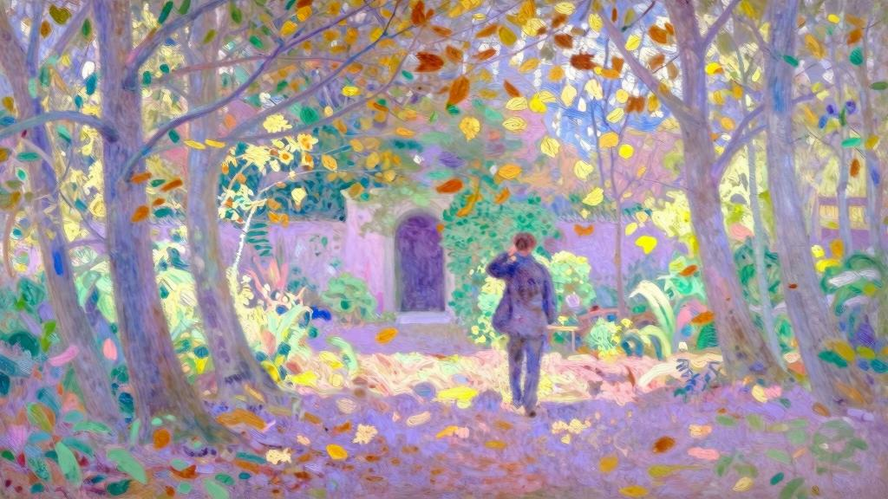
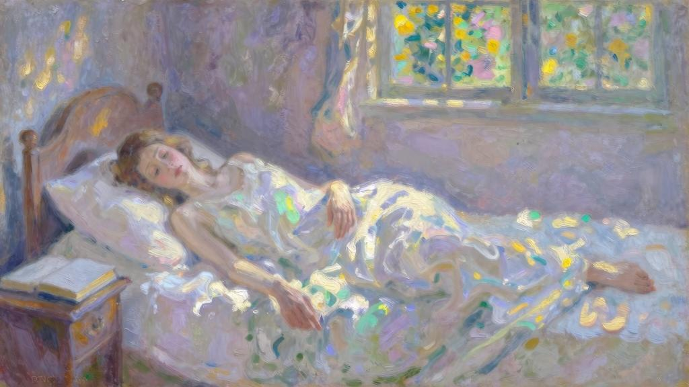
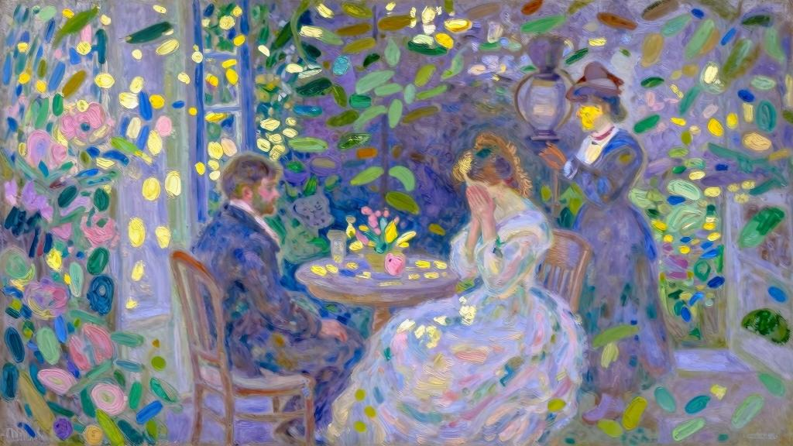

但我还是再次见到了阿莉莎……这是三年后的事，彼时正值夏末。十个月之前，她来信告知我舅舅去世的消息。那时我正在巴勒斯坦旅行，立即给她回了一封相当长的信，但依旧石沉大海……

那时，我恰好在勒阿弗尔，忘了是以何种借口，我在本能的驱使下来到芬格斯玛尔。我知道在那里能看到阿莉莎，但又担心她不是一个人。我没有事先知会，也讨厌同普通客人一样登门造访。我犹犹豫豫地向前走着，要进去吗？还是不要见直接离开更好一些？

不设法见一面吗？……我只在林荫道上散散步，在长椅上坐一会儿，说不定她还刚坐过。这样当然最好，这样就够了。我已经在考虑该留下什么标记，好让她知道我来过，然后就离开……我一边慢慢踱步，一边思考着，最后还是决定不去见她。压在我心上的苦涩愁闷化为淡淡的忧愁。我来到林荫道，怕撞见她，所以走在一侧道路边缘，沿着农场四周的路堤走。我知道路堤上有一处可以俯瞰花园，就去了那里：一个我不认识的园丁正在花园小径上拔草，很快又离开我的视线；庭院里新装了一排栅栏；狗听出了我的声音，狂吠起来。在远处的道路尽头，我转向右边，来到花园墙外，想走去山毛榉林——它正好和我刚才偏离的林荫道平行。

我经过菜圃的小暗门，突然冒出走进花园的念头。门关着，但里面的锁并不牢固，只要肩膀轻轻一撞就能打开……正在这时，我听到一阵脚步声，忙躲进墙边的凹陷处。

我看不到是谁走出了花园，但听得到，也感觉得到是阿莉莎。她向前走了三步，轻声说道：“是你吗？杰罗姆……”我那颗狂跳不止的心，一瞬间僵住了，喉咙里却发不出任何声音。她提高音量，重复问道：“杰罗姆！是你吗？”听到她的呼唤，我激动万分，不自觉跪倒在地。因为我一直默不作声，阿莉莎又向前走了几步，绕过墙。似乎是因为害怕猝然见面，我用胳膊遮住脸。刹那间，我感到她靠了过来。有好一会儿，她俯身靠在我身边，而我则吻遍了她那双纤弱的手。

“你为什么躲起来？”她问得那么随便，好像这久别的三年不过是指缝间的事。

“你怎么知道是我？”“我一直在等你。”“你在等我？”我惊讶万分，只能用她的话来反问。

她看到我还跪着，又说道：“去长椅那儿吧……没错，我知道还得再见你一面。三天来，我每天黄昏都会来这里，像今天一样呼唤你……那你呢？你怎么不应声呢？”“如果你没撞见我，我就直接离开了。”我极力控制初见时让我浑身乏力的那种激情，说道，“我只是路过勒阿弗尔，去林荫道上散了散步，在花园周围转了转，去你可能刚坐过的长椅上休息了会儿，然后就……”“瞧，这三天我在这里就读了这些。”她打断我，递给我一盒子信。我认出是我在意大利给她写的那些。这一刻，我才抬眼看向她。她已经大不相同，消瘦而苍白，让我异常难受。她紧紧压靠在我的臂弯里，似乎在害怕，又或是觉得冷。她还在戴重孝，所以只戴了黑色蕾丝作为发饰。蕾丝包裹着她的脸，让她看上去更苍白。她笑了，看上去却那么衰弱。

我很关心这段时间在芬格斯玛尔，她是否孤独一人。但不是的，罗贝尔和她在一起；八月时，朱莉叶特、爱德华，以及他们的三个孩子都来过这里……我们来到长椅处，坐下聊天。无聊冗长的信息交换持续了一段时间。她还打听了我的工作。我不情不愿地回答，想让她以为我对工作意兴阑珊。我就是想辜负她的期待，就同她过去让我失望一样。我不知道是否达成了目的，因为她看上去依然不动声色。我心中则是满腔的爱恨交织在一起，试图用最冷淡的方式和她交谈。但有时候，我的声音被激动的情绪所出卖，忍不住颤抖，令我懊恼不已。

日头落了下去，它在云霭中逗留片刻，又在地平线露出脸来，几乎正对着我们。它让空旷的田野沉浸在颤动的光华中，让我们脚下的狭小山谷浸浴在万丈金光里。然后，它又消失不见了。我再次中计，目眩神迷，无语凝噎。在这恍惚的金光下，我的怨恨烟消云散，只能听到爱情的声音。本来斜斜靠着我的阿莉莎，此时也直起身子。她从上衣里掏出一个小盒，小盒外面用精美的纸张包裹着。她神色凝重地递给我，又犹犹豫豫地停住。我惊讶地看着她。

“听好了，杰罗姆。这里面是我的紫晶十字架。这三天来我一直随身携带，因为早就想给你了。”“你给我这个有什么用？”我问得相当直接。

“给你女儿戴吧，算作你对我的纪念。”“什么女儿？”我一头雾水，看着她高声嚷道。

“你静一静，求你，好好听我说……不，别这样看着我，不要看着我。我本来就难以启齿，但只有这一点非说不可。听着，杰罗姆，终有一天，你会结婚吧？……不，不要回答我，也别打断我，求你了！我只想要你记得我曾那么爱你。这个想法在我心里盘旋已久，有三年了：就是这条你钟爱的小十字架，我是想，将来有一天你女儿能戴上它，作为对我的纪念。噢！但她不知道纪念的是谁……或许你可以告诉她……我的名字……”她的声音局促而哽咽，再也说不下去了。我像见了仇敌似的，嘶吼道:“你为什么不自己给她呢？”她还想再说些什么，嘴唇抖个不停，如同抽泣的孩童，但毕竟没有哭出来。她的目光中充满奇异的光辉，让整张脸洋溢着非凡的气质，如同天使一般美好。

“阿莉莎！我还会娶谁呢？你明知道我只会爱你一个……”我疯狂地、毫无预兆地搂住她，近乎粗鲁地将她狠狠按在怀里，辗转啃咬她的唇瓣。有一瞬间，她似乎放弃了抵抗，半倒在我怀里。我见她目光黯淡下来，闭上眼睛，用一种无与伦比的声音开了口。

这声音既精准又悦耳。

“可怜可怜我们吧，我的朋友啊！别让这份爱万劫不复。”她或许还说了：不要软弱！又或许是我自己说的，这已无从知晓。我遽然跪倒在她身前，虔诚地拥住她。

“如果你也爱着我，为何总拒我于千里之外？你瞧，起初我还等着朱莉叶特结婚，因为我明白你也想等她获得幸福。现在她幸福了，还是你告诉我的。长时间以来，我一直以为你是想待在父亲身边。但如今，也只剩下我们俩了。”“唉！别悔恨当初，”她低声细语道，“现在，我已经翻过这一页。”“我们还有时间，阿莉莎。”“不，我的朋友。来不及了。还记得那天吧——因为爱着彼此，我们期待对方能获得高于爱情的东西。从那一天起，就已来不及。是你，我的朋友……你让我的梦缥缈高举，所有尘世的幸福都会让它破灭。我也经常思考我们在一起生活的模样……可一旦这爱有了裂痕，我是万万无法忍受的……”“那你可曾想过，我们若失去彼此，生活又是什么样的呢？”“不！从没想过。”“现在你就看到了。没有你的三年，我痛苦地漂泊着……”夜幕落了下来。

“我冷。”说着她站了起来，把自己紧紧裹在披肩里，使我无法挽起她的胳膊。她继续说道：“你记得《圣经》里的这句话吗？——‘他们没有得到曾应许的东西，因为上帝给他们保留了更美好的……’我们总担心理解得不够透彻，一直心神不宁。”“你依然相信这些话吗？”“不得不信。”我们并肩走了几步，谁也没有说话。过了一会儿，她才说道：“杰罗姆，你想象一下吧，最美好的东西！”刹那间，她的眼泪夺眶而出，但还是重复说道：“那最美好的东西！”我们再次来到菜圃的小门，之前我就是在这里见她出来的。她转向我，说道：“再见了！不，别再走近了。再见，我的爱人。现在，最美好的东西……就要开始了。”她盯着我看了会儿，眼中充满难以言喻的爱意。她的手臂搭在我肩上，既想挽留又想远离……

门重新关上。她在里面插上门闩，我立即靠着门跌落下去。极度绝望之下，我在黑夜中长久地哭泣起来。

但是去挽留她，撞开门，或者不顾一切地闯入这座不会把我拒之门外的屋子……不，即便像今天这样回首过去，重来一遍，我还是觉得不可能做到。那些现在理解不了我的人，可以说始终不曾理解过我。

没过几天，不安难耐之下，我给朱莉叶特写了封信。我跟她说了芬格斯玛尔的这次造访，也提到阿莉莎的苍白消瘦令我多么不安。我求她多加留意，若有消息就给我捎来，因为阿莉莎是不可能给我写信了。

此后不到一个月，我就收到了下面的回信。

亲爱的杰罗姆：我要告诉你一个极其悲痛的消息：可怜的阿莉莎已经不在人世了……唉！你上封信中的忧虑一点没错。这几个月来，她日渐衰弱，却没什么确切病症。在我的恳求下，她去勒阿弗尔的A医生那里看了病，但医生给我来信说她没有什么大碍。

不过，在你造访后的第三天，她突然离开了芬格斯玛尔。这件事还是罗贝尔写信告诉我的。阿莉莎几乎不给我写信。如果没有罗贝尔，我根本不会知道她离家出走，就算她杳无音信我也不会觉得惊慌。我严厉指责罗贝尔不该让她独自离开，他应该同她一起去巴黎。你相信吗？从那时起，她就下落不明了。

你可以想象我的焦虑——既看不到她，也无处给她写信。之后，罗贝尔也在巴黎待了几天，但并没发现她的踪迹。罗贝尔一向漫不经心，我们怀疑他是否真的用心。这种生死未卜的状况太令人痛苦了，我们不得不报警。爱德华也去找了，最后发现一家小疗养院，阿莉莎正栖身于此。唉！太迟了！我收到疗养院院长寄来的一封信，信中透露她去世的消息。与此同时，爱德华也给我发来电报，说甚至没赶上见她最后一面。

我们能收到通知，是因为临终那天，她在信封上写了我们的地址。她还写了另一封遗嘱，寄给勒阿弗尔的公证员。这封信中有一段似乎与你有关，下回我会告诉你。爱德华和罗贝尔参加了她前天的葬礼。除了他们之外，跟随灵柩的还有疗养院的几位病友，他们一同参加了葬礼，并护送遗体至墓地。可惜我不能赶过去，因为我的第五个孩子这两天就要出生。

亲爱的杰罗姆，我明白你听到这个噩耗会多么沉痛，给你写信时我也是心如刀绞。这两日，我卧病在床，写这封信也很费劲。但还是不想让他人代笔，就算爱德华和罗贝尔也不能同你谈她——阿莉莎无疑是我们两人才会懂的。如今的我也不过是个老主妇，层层积灰湮没了滚烫的过去，我期待再见见你。事务或是消遣都好，你若要在尼姆待几日，就顺道来埃格维弗吧。爱德华会很高兴认识你的。

我们俩可以谈谈阿莉莎。别了，亲爱的杰罗姆，我怀着沉痛之情拥抱你。

几日后，我听说阿莉莎把芬格斯玛尔留给了她兄弟，但要求把卧室里所有的物件和一些指定的家具寄给朱莉叶特。不久后，我将会收到一封写有我名字的密封信函，里面放了一叠文稿。我还听说阿莉莎要求给她戴上紫晶小十字架——就是上回造访时我拒绝的那条。爱德华告诉我，她如愿以偿了。

公证员给我寄来了那封密封信函，里面装了阿莉莎的日记。我在这里抄录几篇，但并不予置评。你们完全可以想象我读到这些的反应，以及内心的震动，这份心情不可名状。

阿莉莎的日记埃格维弗前天，从勒阿弗尔动身，昨天到了尼姆。这是我的第一次旅行！不用操心家务和做饭，随之而来的是轻微的怠惰。188×年5月23日，今天是我二十五岁的生日，我开始写日记——说不上能带来多大乐趣，不过聊以解闷罢了。这或许也是我人生第一次感到孤独：这片异乡的土地，于我而言几乎全然陌生，它要跟我讲述的东西，必定跟诺曼底告诉我的一样，同我在芬格斯玛尔百听不厌的东西也一样，因为上帝无论在哪里都是一样的。但这片南国的叙述语言我还未领会，所以听起来不免惊奇。

5月24日朱莉叶特在我身旁的躺椅上睡着了。露天长廊给这座意式住宅带来魅力，从这里能直接看到连接花园的院子——院子里铺着沙。朱莉叶特不用离开躺椅，就能顺着起伏的草坪看到远处的水塘：那里有一大群花花绿绿的鸭子在嬉戏，还有两只游弋的天鹅。听人说，这里的水来自一条溪流，是夏季也不枯竭的活水。涓涓细流穿过花园里越发荒凉的小树林，流经干涸的灌木丛和葡萄园，变得越来越窄，很快就彻底窒塞了。

……昨天，我陪着朱莉叶特时，爱德华·泰西埃尔带我父亲参观了花园、农场、储藏室和葡萄园。因此，今日一早，我独自一人在公园里游逛探险。这里有很多我不认识的植被和树木，我很想知道它们的名字，所以从每棵植物上折下一根细枝，准备午餐时打听它们的名字。我认出了青橡树，这是杰罗姆在意大利的博尔盖塞别墅或者多利亚潘菲利别墅欣赏过的树。它是我们北部橡树的远亲，外表上却截然不同。这种树偏安于公园尽头，它覆满了一片狭小而神秘的空地，树下的草坪踩上去松松软软，引来仙女的歌唱。我感到震惊，几乎可以说愤怒。因为在芬格斯玛尔，我对大自然的感受总带有强烈的基督教色彩，而在这里，这种感受却无意识地染上了神话色彩。但压迫着我的恐惧，仍是基督教式的。我嘀咕着“这是树林”[1]——这里的空气清新透彻，有一种奇异的安宁，让我想到俄尔普斯和阿尔米达。就在这时，我突然听到一阵鸟鸣声——这无与伦比的声音响起来，如此切近，如此悲怆，如此纯粹，仿佛整个大自然就在等待这声鸣叫。我的心狂跳不止，靠着树站了好一会儿。然后，在所有人起床前回去了。

5月26日一直没有杰罗姆的消息。就算他把信寄去勒阿弗尔，也该转过来了……我的不安，只能倾诉给这本笔记。三天来，无论是昨天的博镇之行，还是祷告，没有一刻能令我愉快的。今天，我没心思写别的了。自从来到埃格维弗，我总被一种古怪的伤感包围着，也许并没有别的缘故。这种忧愁如此深沉，让我觉得它深植于我心中已久，只是从前被我引以为傲的“快乐”掩盖住罢了。

5月27日为何要欺骗自己呢？我是通过理性推导，才对朱莉叶特的幸福感到欣慰的。我曾如此期盼她获得幸福，为了她的幸福，我甚至愿意牺牲自己的幸福。可如今见她轻而易举地获得了，见这份幸福同我们当初的想象如此不同，我竟感到难受。实在太复杂了！是的……我清醒认识到一种可怕的自私心理回到了我身上。让我生气的是：除了牺牲我的幸福外，她还能在别处找到获得幸福之路。也就是说，不用我做出牺牲，她也能幸福。

现在，杰罗姆没有音信竟让我如此不安，我不得不扪心自问：当初，我内心的真实想法真的是自我牺牲吗？现在，上帝不再需要我做出牺牲，我反而觉得受辱，莫非当初我就不能做出牺牲吗？

5月28日这样分析自己的忧愁，该多危险啊！我对这本笔记产生了依赖，本以为早已克服装模作样，又要在这里重新染上恶习吗？不，这本日记不是一面纵容迎合我灵魂的镜子；也不是起初我以为的那样——闲来无事随便写写，而是因为忧愁写下的日记。忧愁是一种“罪恶的心态”，我早就没了这种心态，也憎恶它，想消除它以“简化”我的灵魂。这本笔记能助我重拾幸福。

忧愁会引来并发症。过去，我从不分析我的幸福。

在芬格斯玛尔时，我也是一个人，甚至比现在还要孤独……为什么当初就没感到忧愁呢？杰罗姆在意大利给我写信时，我能忍受他独自去看世界，也能忍受他没有我独自生活，因为我的思想跟随他，他的快乐便是我的快乐。而现在我却忍不住去呼唤他，若没有他，无论看到什么新鲜事物都令我厌烦……

6月10日日记写了没几天就中断许久，因为小莉丝出生了，我晚上都长时间守着朱莉叶特。能写给杰罗姆的那些东西，我也没心思写在这里。我想避免很多女人烦人的通病：写得太多。而是把这本笔记当作自我完善的工具。

接下来好几页都是她的读书笔记和摘抄段落。接着，是写于芬格斯玛尔的内容。

7月16日朱莉叶特幸福了。她是这么说的，看上去也的确如此。我没有权利，也没有理由怀疑这一点……可是，在她身边时，我总有种不满意、不舒服的感觉，这又是从何而来呢？也许是觉得这种幸福太实际，也来得太容易，过于完美的量身定制，把她的灵魂包得紧紧实实，让她喘不过气来……

现在，我思忖自己想要的究竟是这种幸福，还是说我想要的是追逐幸福的过程？

主啊！别让我拥有很快就能实现的幸福！教会我延迟幸福吧，一直延迟至来到您面前。

接下去好几页都被撕掉了。她必定写了勒阿弗尔的那次糟糕的重逢。日记到第二年才重新开始。她没标注日期，但肯定写于我住在芬格斯玛尔的那段时间。

有时听他说话，就仿佛面对着自己的思想。他向我解释着，也让我认识我自己。

没有他，我还能存在吗？只有和他一起，我才能存在……

有时我也迟疑，我对他的感情是不是人们所谓的爱情？因为通常的爱情画卷同我描绘出的画卷并不相同。我希望不用任何言语说明，希望不自知地爱着他，尤其希望我爱他——他却并不知情。

若没有他，无论怎么活都是苟延残喘，我不会有丝毫快乐。我所有的德行都是为了取悦他，然而靠近他时，又觉得德行不堪一击。

我喜欢弹钢琴练习曲，是因为觉得每天都能有所进步。这或许也是我喜欢读外文书的原因所在。我当然不是因为喜欢外文多过本国语言，也并非觉得我欣赏的本国作家比不上外国作家。而是因为在理解外文的意义和情感时，会有轻微的难度。一旦攻克了它，一旦理解得越来越好，也许会产生一种无意识的自豪感。在精神愉悦的同时，增添某种道不明的心灵满足。我似乎少不得这种满足。

如果没有进步空间，无论多幸福，也不是我想要的状态。我想象的天堂之乐，并非附丽于上帝的混沌状态，而是无限接近再接近的状态，永无止境……如果我不怕玩弄字眼的话，可以说一切没有上升性的欢乐，我都不屑一顾。

今天早上，我们两人又坐在林荫道的长椅上。我们什么也没说，也不觉得需要任何语言……他突然问我是否相信来世。

“杰罗姆，”我立刻喊道，“于我而言，这不仅是愿望，更是坚信……”突然之间，我的所有信仰似乎都被这一声呼喊掏空了。

“我想知道！”他顿了一会儿，继续补充道，“如果没有信仰，你采取的行动会不会有所不同？”“我怎么会知道？”我这么回答他，并补充道，“你也一样，我的朋友。在最强烈信仰的驱动下，无论如何你的行动都不会变成其他样子。你若不再是这样，我也不会爱你。”不，杰罗姆，不是的。我们的美德，为的并不是来世的回报，我们的爱情追求的也不是报偿。苦尽甘来的想法是对高尚灵魂的伤害。德行不是灵魂的装点，它就是灵魂之美的形式。

爸爸身体又不大好了。我希望没有大碍，但这三天来都靠牛奶维持着。

昨天傍晚，杰罗姆回卧室去了，爸爸接着和我叙谈很久，后来他也出门独处了片刻。我坐在沙发上，确切地说，是用一种从未有过的姿势躺在沙发上，我自己都莫名其妙。灯罩遮住光，我的眼睛和上半身笼在阴影里。我木然地盯着裙摆下露出的一点点脚尖——它正好照到一点灯光。爸爸回来时，在门口站了会儿，用一种奇怪的眼神打量我，眼里既有欣慰又有悲伤。隐约觉着不安，我站了起来。他招呼我过去。

“坐我身边来。”他说。虽然天色已晚，他却开始说起我母亲——在他们分开后，他从未说起过她。他谈起他们是如何结婚的，谈起他有多么爱她，谈起最初她在他心中的分量。

“爸爸，”我终于对他说道，“求你告诉我，为什么今晚要跟我说这些，为什么恰恰是今晚……”“因为刚才我回到客厅，看到你躺在沙发上，有一瞬间我以为又看到了你母亲。”我着重强调这一点，是因为恰好也是在这天傍晚……杰罗姆靠沙发站着，在我肩膀上方看书，俯身对着我。我看不见他，却能感觉到他的气息、温度和身体的轻颤。我假装继续看书，但再也看不进去，一行行文字在眼前模糊分散开来，一种古怪的窘迫侵袭着我。趁还能做到，我赶紧从椅子上站起来，出门待了一阵，幸好他没有发觉。可不久后，我独自待在客厅里，躺在沙发上，爸爸说这一刻我很像母亲，但那一刻，我心中所想也恰好是我母亲。

那晚我翻来覆去睡不着，内心充满不安、气闷和可耻的情绪。往事向我涌来，悔恨攫住了我。主啊，教会我憎恶那些丑陋的表象吧。

可怜的杰罗姆！要知道有时他只稍做一个手势，也能恰好迎合我的期待。

我小时候，也是为了他，才想要漂亮起来。现在想来，我“追求完美”的举动，也全是为了他，但这份“完美”只有在他不在时，才能获得。上帝啊！在您的教导中，还数这一条最让我煎熬。

德行若能与爱情结合，该有多幸福啊！有时我怀疑，除了喜爱、竭尽全力的爱、越来越深的爱之外，是否还有其他德行；也有时候，我觉得德行不过是对爱的抵抗。什么！我竟敢把内心最质朴的爱慕称作德行！多迷人的诡辩啊！多理直气壮的劝诱啊！这是幸福埋下的蜃景！

今天早上，我读到拉布吕耶尔的这段文字：“有时在生活中，无比珍贵的欢乐和柔情似水的承诺都会遭遇抵制，想要破除抵制也是人之常情。这种欢乐和承诺的魅力，唯有美德才能超越，唯有美德才能让人甘心放弃。”我为何要构想出这种“抵制”呢？是否还有什么比爱情更美妙的魅力吸引着我呢？

啊！若借助于爱情，能指引我们两人的灵魂超越爱情之上，该有多好！

唉！我现在还不是完全理解“在上帝和他之间，我是唯一的障碍”这句话。也许如他所说：最初，他对我的爱的确让他靠近了上帝。现在，这份爱却阻碍了他前进。他恋慕我，为我驻足停留。我成了他的偶像，也阻碍他在美德之路上的前行。我们之中必须有一个人到达目的地。既然我内心懦弱，对于反抗已不抱希望，上帝啊，就请答应赐予我力量——好让他别再爱我了。我会把他美好而无穷的功德带给您，用以偿还我的罪孽。今日，我的灵魂因为失去他而饮泣，也不过是为了此去经年，能在您身旁与他重逢罢了……

上帝啊！告诉我，还有谁的灵魂比他更配得上您？除了爱我之外，他的人生难道不该有更好的追求吗？如果他像我一样停下脚步，我还会这么爱他吗？若是局限于幸福之中，一切本该英勇壮烈的东西，会变得多狭隘啊！

……

星期日“上帝给他们保留了更美好的东西。”5月3日 星期一幸福近在咫尺，只要他想……便触手可及……

早上和他聊天，我做出了牺牲。

星期一晚上他明天就要走了……

亲爱的杰罗姆，我怀着无限柔情，永远爱你，但我的这份感情永远不会向你道出了。我紧紧压迫我的眼睛、嘴唇和灵魂，你的离去释放了我，让我产生一种苦涩的满足。

我努力按理智行动，但展开行动之时，促使我行动的理由全都消失无踪，或者让我觉得荒唐起来。我再也不相信理智了……

那些让我逃避他的理由呢？我也不再相信……但我还是悲伤地逃避着他，尽管不明白为什么要逃。

主啊！我们朝你走去。杰罗姆和我肩并着肩，相依为命，像两个沿着生命长河前进的朝圣者。有时，一个人对另一个说道：“如果你累了，就靠着我吧，兄弟。”另一个答道：“只要清楚你在我身边就够了……”然而，并不是这样！主啊，你指引我们走的路，是一条窄路——窄到容不下两人并行。

7月4日我已经六个星期没打开这本日记。上个月，我重读几页，突然发觉一种荒谬有罪的心思：为了他……要好好写。

我动笔写这日记是为了摆脱他，现在它仿佛成了我们通信的延续。

我把所有看起来写得不好的内容都撕毁了。（我知道自己这么做的用意）理应撕碎所有关于他的内容，应该全部撕碎……但我做不到。

撕掉那么几页，已经让我有些得意……如果我的心病得没那么厉害，必会为这份得意的心情而感到可笑。

我确实觉得自己干了件大事，撕掉的都是重要的东西。

7月6日必须清理藏书了……

我在一本本书中逃避他，却仍能见到他。就连我独自发现的篇章，依然能听见他为我诵读的声音。只有他感兴趣的书，我才会去欣赏。我的思想就是照着他的思想塑造而成的，我不知道如何将两者割绝开来。就像从前，我会因为两者交融而欢喜一样。

有时候，为了从他的行文节奏中跳脱出来，我会试图写得差些。但与他对抗本身，也说明我还想着他。最后我决定，在一段时间里除了《圣经》之外（《效法基督》或许也可以除外），不读别的；在每天的日记里，除了记录阅读中印象深刻的句子外，也不写别的。

接下去的日记便是对她“今日食粮”的记录，还标记了日期。从7月1日开始，她每天都记录一句话。除了她作评论的那些之外，我在这里就不抄录其他了。

7月20日“变卖你所有的家当，献给穷人吧。”——我是这样理解的：我应当把交给杰罗姆的心，也分给穷人。这也是教导他去做和我一样的事。主啊，给我这份勇气吧。

7月24日我不读《永远的安慰》了。这古语让我深深着迷，却也令我分心。我从中体会到近乎异教徒般的欢乐，然而其间并没有看到任何我想追寻的启示。

我重读了《效法基督》。拉丁文的版本太难理解，所以我没看这个版本。我喜欢读的译本甚至没有署名，当然这是新教出的，书名上还写着“适用于所有基督教团体”。

“啊！你若知道在朝美德行进时，自己会获得多大的平静，又能给他人带来多大的欢乐，我确信你会更用心投入的。”8月10日上帝啊，我朝您呼喊时，怀着孩童般的激动信仰，是用圣灵般的非凡声音……

我知道，这所有的一切，并非来自杰罗姆，而是来自您。可为何，您要在我们之间，填满杰罗姆的形象呢？

8月14日为了完成这个活儿，我花了两个多月……主啊，帮帮我吧！

8月20日我清醒地感受到了牺牲，在忧愁里感受到它。我感到内心深处，牺牲并未完成。

上帝啊，点醒我吧——那种唯有他能带给我的快乐，其实是您赋予的。

8月28日我拥有的是多么平庸、悲哀的德行！我对自己过于苛求了吗？别再痛苦了。

我的意志该有多薄弱，才一直乞求上帝赐予力量啊！如今，我的祷告里都是愁云惨雾。

8月29日“看看田野里的百合吧……”这话如此简单，却让我整个早上陷入忧愁中，无论如何也排解不开。我来到田野，心里和眼里都盈满泪水，情不自禁地反反复复说着这句话。我凝神望着辽阔的平原空地——农民弯着腰，忙忙碌碌地犁地……“田野里的百合……”主啊，它们在哪里呢？

9月16日 晚上十点我再次见到他了。他就在这里，在这房子里。我望见他房间的光透过窗户映在草坪上。我写下这些文字时，他还迟迟未睡，也许正在想我。他说他没变，我也这么觉得。为了打消他爱我的念头，我能按照自己决定的那样，向他展现我的模样吗？

……

9月24日多么残酷的对话啊！即便我心潮澎湃，也要装作冷酷无情、无动于衷。在此之前，我只是安于逃避他，但今天早上，我觉得上帝给了我抵御他的力量。况且，无尽地逃避交锋是软弱的表现。我获胜了吗？杰罗姆对我减少了爱意吗？唉！我期盼的事，也是我恐惧的事……我从未这么深地爱过他。

主啊，如果从我手里拯救出他，必须牺牲我，那便动手吧！

“主啊，请进入我的心中和灵魂中来，替我背负些痛苦，就在我身上继续经受余下的劫难吧。”我们说起帕斯卡尔……我能跟他说什么呢？多么可耻愚蠢的言论！我说的时候便觉得百般折磨，今晚更是懊悔不已，如同亵渎圣灵一般。我再次拿起厚重的《思想录》，翻开时恰好停在致罗阿奈兹小姐的信这一段。

“若自愿追随拖拽我们的人，便感觉不到绳索。若我们开始反抗，越走越远，便会觉得痛苦万分。”这些话直截了当地戳中了我，让我无力再读下去，只能把书翻到另一处。在此处，我发现一段从未看到过的美妙段落，于是将它抄录了下来。

第一本日记到这里结束，第二本肯定被她销毁了。因为阿莉莎留下的那些文字，再记录时已是三年后的九月，那是在芬格斯玛尔的日记。也就是说，这些日记写于我们最后一次见面前不久。

最后这本日记的开头是这样写的。

9月17日上帝啊，您清楚地了解，必须有他在，我才能爱您。

9月20日上帝啊，把他给我吧，我会把心献给您。

上帝啊，只要让我再见到他就够了。

上帝啊，我发誓把心献给您。请将我的爱情所求赐给我，我会将余生都献给您。

上帝啊，原谅我这卑微的祈祷吧，但我无法不提起他的名字，也无法忘记心中的伤痛。

上帝啊，我呼喊着你：我还在绝望中徘徊，不要袖手旁观。

9月21日“你们向天父所求的一切，都是以我的名义……”主啊！我不敢以您的名义……

如果我不去祷告，难道您就不那么清楚我心中的妄想了吗？

9月27日从今早起，我便心如止水。昨夜，我整晚都在沉思和祷告，刹那间，感到一种清澈的寂静包围着我，落在我身上，它与我童年时对圣灵的想象全然一致。我担心这份喜悦不过是神经亢奋之故，于是立刻躺下睡觉，很快进入梦乡。这份幸福并未离我而去，今天早上依然存在，丝毫没有减弱。现在我确信，他要来了。

9月30日杰罗姆！我的朋友，我还会称你为兄弟。但我对你如此情深，远不只是对兄弟的爱。在山毛榉林中，我无数次呼唤你的名字！我每日黄昏出门，直到夜幕降临才归去。我穿过菜圃的小门，来到昏暗的林荫道……期待着你出现在布满石子的路堤后面，突然回应我，而后又慌乱地回避我的目光；又或者，远远地，我见你坐在长椅上等我。我的心不会为此惊跳，相反，若没见到你，我反而觉得震惊。

10月1日还是没有他的影子。太阳沉入无比纯净的天际。我等待着。我知道很快会和他一起坐在这张长椅上……已经听到他的说话声。我爱极了听他呼唤我的名字……他会来这里的！我将把手放在他的手中，额头靠在他的肩上，紧挨着他呼吸。昨天，我拿了几封他写的旧信，想带过来重读。但没有读成，因为思念之情过于汹涌。

我还带上了他喜欢的紫晶小十字架，某一年夏天，因为不愿他离开，他在的时候我每晚都戴着它。

我想把这枚十字架交还给他。长久以来，我都做着同一个梦：他结婚了，我是他长女小阿莉莎的教母，我把这枚首饰交给了她……为何我不敢向他道出呢？

10月2日今天，我的灵魂轻盈而愉悦，仿若在天空筑巢的小鸟。今天，他肯定会来。我感觉到了，知道他会来，要在此记下一笔，真想大声告诉所有人啊。我不想再掩饰我的喜悦，即使是对我漠不关心的罗贝尔——这个一向心不在焉的人，也注意到我的喜悦。他的提问令我心绪不宁，我不知该如何作答。怎样才能挨到今晚呢？

这蒙住双眼的布条该有多透明啊，竟让我觉得他的形象处处那么高大，所有爱的光芒聚焦在我心头上的一点——灼烧着我。

啊！等待让我疲惫不堪！

主啊！只要一瞬就够，将幸福之门向我微微敞开吧。

10月3日一切都烟消云散了。他像影子一样在我臂弯中消散。明明刚才还在！就在那里！

我还能感觉到他，呼唤着他。我的手、我的唇在黑夜中搜寻着他，却是徒劳。

我辗转反侧，难以成眠，连祷告都做不到，待在卧室里，待在房子的任何一处，都觉得恐惧。我来到昏暗的花园，悲痛把我引到和他分别时的小门后面。我打开门时，心里怀着一种愚蠢的期待：说不定他会回来！我呼唤他，在黑暗中摸索，然后回来给他写信。我无法承受这份哀痛。

究竟发生了什么？我对他说了什么？又做了什么？为何在他面前，我总是夸大德行？我内心深处全盘否定的德行，能有什么价值呢？那些话，我说是上帝告诉我的，其实是在暗中说谎……充斥在我心中的话，一个字也没有道出。杰罗姆！杰罗姆，我痛苦的朋友！你在我身边时，让我的心支离破碎；但远离你时，我又不能成活。之前跟你说的话，你只去倾听表达爱意的那部分就够了。

我撕掉信，又重写……转眼已是拂晓时分，天空如此阴郁灰暗，被泪水浸透了，如同我的心潮一般。我听到农场开始劳作的声响，沉睡的万物重现生机……

“现在起来吧，时辰已到……”我不会寄走这封信。

10月5日善妒的上帝啊，您已经掠夺了我的一切，就把这颗心也带走吧。从今往后，它不会再燃烧，也不会对任何东西产生兴趣。助我打败这残缺不全的自己吧。这所房子，这个花园，全都煽惑着我的爱情，令我难以忍受。我想逃去只能见到您的地方。

助我一臂之力吧，帮我把财产分配给可怜人。但我无法轻易卖掉芬格斯玛尔，还是把它留给罗贝尔吧。我已经写好一份遗嘱，但大部分必要的手续我都不了解，昨天同公证员也未能谈开，因为怕他猜到我的决心，然后去通知朱莉叶特和罗贝尔……到了巴黎，我会补全手续。

10月10日抵达此处时，我已筋疲力尽，头两天一直卧床不起。他们不顾我的反对叫来医生，他表示我必须接受手术。有什么可反抗的呢？我轻而易举就让他相信：我很害怕这个手术，希望再养养身体，等恢复些体力之后再做。

我隐姓埋名，也没有交代住址，但给疗养院的管理处交了一笔足够的钱，不费吹灰之力就让他们接收了我。只要上帝觉得必要，我可以一直在这里生活下去。

我喜欢这个房间。这里窗明几净，墙上无需任何装点。我感到一种近乎愉悦的情绪，这令我讶异——因为我对生活已不抱期待的缘故吧；因为现在，只有上帝能取悦于我，若上帝没有填满心灵，他的爱不会显得如此美妙。

除却《圣经》，我没有带任何书。但今天在读《圣经》时，我心里回荡起帕斯卡尔激动的抽泣声，他的这句狂言比《圣经》更为高超。

“不属于上帝的一切，无一能满足我的期待。”噢！我这颗冒失的心想要的欢乐，竟如此世俗！

主啊！您让我绝望，就是为了听到这一声惊呼吗？

10月12日多希望您的统治能降临！来支配我吧！成为我唯一的主宰，完完整整地统治我，我再不想对您动摇不定了。

我太累，仿佛垂垂老矣。但灵魂却保持着古怪的稚气，我还是过去那个小女孩——房间必须井井有条，脱下的衣服必须叠好放在床头，这样才能入睡……

我死的时候，也想这样。

10月13日销毁之前，我重读了日记。“伟大的心以散布自己纷乱的心情为耻。”我想，这句美妙的话出自法国王后克洛蒂尔德沃之口。

正当我要将它投入火海之际，仿佛有一个声音在提醒我，将我制止了——这本日记似乎已不再属于我，从始至终都是为杰罗姆而写，我没有权利从他手中将之夺走。今天看来，我当时的种种不安与迟疑是那么可笑，于我而言微不足道，相信杰罗姆也不会为此心烦意乱。上帝啊，希望他在这本日记中，偶尔能发现我内心笨拙的音调。在这里，我发狂似的渴望着，愿把他推向我难以企及的美德之巅。

“上帝啊，引领我去到抵达不了的悬岩吧。”10月15日“欢乐，欢乐，欢乐，欢乐的眼泪……”是的，我猜测这绚烂的欢乐，处于俗世的喜悦之上，是远离一切痛苦的彼岸。我抵达的悬岩，它的名字叫“幸福”……我明白，若不追求幸福，这一生不过是虚度。但是主啊！您答应将它许给纯洁无私的灵魂。“现在要幸福了，”您曾经说过，“死在主怀中之人，现在就要幸福了。”至死方能等到它吗？我的信仰在这一刻摇摆不定。主啊！我用尽全力向您呼喊，心中一片凄迷，只等曙光将我照亮。

我会这样呼喊您，直至死去。快来解救我的心吧。我如此渴望的幸福……或许应该说服自己已经得到？仿若拂晓前焦急鸣叫的鸟儿，它在呼唤晨光，而不是宣告黎明。我是否也该如此——在晨光初现之前就开始歌唱。

10月16日杰罗姆，我想告诉你什么是完美的欢乐。

今早，我胃里翻江倒海，难受地吐了。紧接着，我感到无比虚弱，某个瞬间甚至相信自己就要死了。可是没有。起初，我觉得整个身体处于极其静谧的状态。然后恐慌吞噬了我，灵魂和肉身都战栗起来，人生仿佛豁然开朗，眼前一片清澄。

我似乎第一次注意到——房间的墙上空空如也。我害怕了。写日记也是为了平复心情。主啊，别让我说亵渎神明的话，就这样让我抵达终点吧。

我还能起床，像个孩子一样跪倒在地。

我想在这一刻死去，快一些吧——在我又感到孤独之前。

去年，我再次见到朱莉叶特。这次会面距离她给我寄的最后一封信——有关阿莉莎死讯的那封信，已经十年。我恰好在普罗旺斯旅行，顺道去尼姆停留。泰西埃尔一家住在市中心繁忙的菲舍尔大街，家里的小楼很漂亮。尽管我早已去信通知要来，但进门的那一刻还是相当激动。

女仆把我带进客厅，我等了片刻，朱莉叶特便进来了。我仿佛见到了普朗提埃姨妈：同样的步态，同样的阔肩，同样让人喘不过气来的热情。她立刻没完没了地向我提问，从职业生涯问到巴黎生活、日常消遣、人际交往，却也不等着我回答。她问我来南方做什么，问我为什么不去埃格维弗，爱德华一定会很高兴见到我……接着，她跟我报告了所有近况：她的丈夫、孩子们、弟弟、上一次的收成，以及生意上的不景气……我得知罗贝尔为了定居埃格维弗，已经把芬格斯玛尔卖了。他现在是爱德华的合伙人，留在种植园里，负责改良产品和扩大葡萄产量。这样一来，爱德华就能抽出空来四处跑业务，他主要负责销售事宜。

然而，我的目光还是焦急地搜寻着，想在这里找到些许过往的踪迹。在客厅的翻新家具中，我很快认出几件芬格斯玛尔的家具。往事投入我心湖中，激起阵阵涟漪，但朱莉叶特似乎并未发觉，或许是故意不去提起。

两个十二三岁的男孩在楼梯上玩耍，朱莉叶特把他们叫到跟前，向我介绍。长女莉丝和父亲一起住在埃格维弗；另一个十岁的儿子在散步，很快会回来——他就是朱莉叶特通知我那个沉痛消息时，提到的即将出生的孩子。那次分娩苦不堪言，朱莉叶特花了很久才恢复过来。去年，她才转念又生了个小女儿，听她的语气，似乎最喜欢这个孩子。

“她就睡在旁边，我的卧室里，”她说，“来瞧瞧吧。”我跟着她走过去。

“杰罗姆，我不大敢写信问你……你愿意做这个孩子的教父吗？”“当然愿意，如果你希望的话。”我有些惊讶地说道，俯下身对着摇篮，“我的小教女叫什么名字？”“阿莉莎……”朱莉叶特低声答道，“她长得有点像她，你不觉得吗？”我紧紧握住朱莉叶特的手，什么话也答不出。小阿莉莎被妈妈稍稍抱起些，她睁开眼睛，我把她接到怀里。

“如果成家，你该是多好的父亲呀！”她勉强笑了一声，“你怎么还不结婚，等什么呢？”“等着忘掉一些往事。”我见她脸红起来。

“你希望早些忘掉吗？”“我希望永远不忘。”“跟我来。”她蓦然说道，把我领进一间更小的房间。屋子里黑灯瞎火的，有一扇门对着她的房间，另一扇门对着客厅。

“有空我就会来这里避一避，这是整个家里最安静的房间。在这里，我觉得可以些许逃避生活的侵扰。”这小房间的窗户紧闭着，同其他的房间不太一样。它外面是郁郁葱葱的院子，而不是熙熙攘攘的街道。

“我们坐一坐吧，”说着，她窝进躺椅中，“如果我还算懂你，你是想忠于对阿莉莎的回忆吧。”我顿了顿，没有作答，然后说道：“不如说是为了忠于她以为的我吧……不，别把这归功于我。我想我无路可逃，若是娶了另外一个女人，我也只能假装爱她。”“唉！”她看似冷淡地别开脸去，低头看着地，似乎在寻找某样丢失的东西。

“所以，你觉得这种无望的爱情可以在我们心中留存那么长时间吗？”“是的，朱莉叶特。”“尽管在生活的摧残下，每日栉风沐雨，这爱火依然不灭吗？”夜幕恍若阴郁的潮汐一般涌来。它席卷过来，吞噬暗影中的每个物件。朱莉叶特把家具齐集于此，阿莉莎的房间重现在我眼前。它们仿佛复活一般，低诉着各自的往事。而今，朱莉叶特重新将脸转向我，面部线条模糊不清，以致根本无法辨认她的眼睛是睁还是合，我却觉得美极了。我们两人看着彼此，默然不语。

“好了！”她终于说道，“该醒醒了……”我见她站起来，向前跨一步，似乎精疲力竭，又跌落在旁边的椅子上。她双手捂着脸，像是哭了……

此时，女仆掌着灯，走了进来。

[1]原文是拉丁文：Hic nemus。
