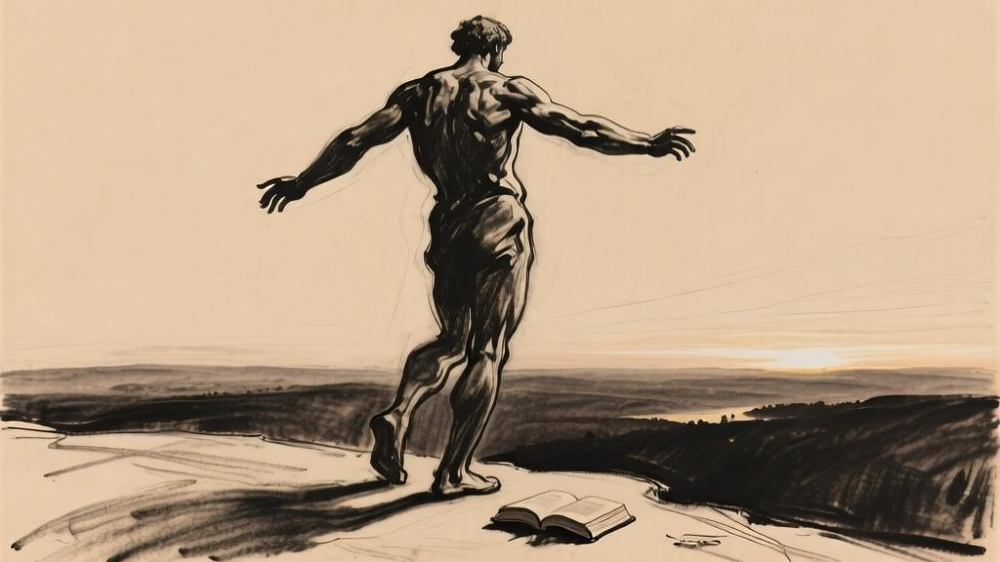

这就是我们在人间大地的食粮。

——《古兰经》第二章，第23节。

关于我为这本书所起的书名，纳桑奈尔，请你别误会。我原本也可以将它命名为“梅纳克”，然而梅纳克从来都没有存在过，就像你一样。唯一有可能印在封面上的真实人名，就是我自己的名字。但是身为作者，我怎么敢用自己的名字作为书名呢？

我毫无顾忌、毫不腼腆地投身于本书的创作当中。有时我在书中谈到自己从未见过的国度、从未闻到过的香气和从未亲身践行过的活动——或者谈到你，我的纳桑奈尔。我还从未遇见过的你——这样侃侃而谈并不是虚伪。与纳桑奈尔这个名字相比，我所写到的这些事物并不算是更过分的虚构。纳桑奈尔，我就这样称呼你。你将要阅读我的文字，我并不知道你在未来真正的名字。

当你读完这本书时请丢下它，然后出发。我希望这本书能够激起你动身出发的欲望——从随便什么地方出发，离开你所在的城市、你的家庭、你的卧室和你的思绪。

不要把我的书带在身旁。假如我是梅纳克的话，我将会牵起你的右手为你引路，不过那样的话，你的左手还是会浑然不觉。我将紧紧牵着你的手，一旦我们远离城市，我会立刻放开，然后对你说：忘了我吧。

希望你是因为我的书而对自己产生了兴趣，继而对其他一切都有了更大的兴趣。

这是一本关于逃避和解脱的书。人们总是习惯性地认为这本书是在写我自己。借这次再版的机会，我想向新读者们说明我的某些看法，希望能更准确地说明本书的立场和写作动机，也希望诸位读者不要对本书太过重视。

第一，《人间食粮》这本书，就算不是出自一位病人之手，至少也是出自一位大病初愈的人之手。在抒发情感时，难免像险些丢掉性命的人热切想拥抱生命那样，表达得有些过分。

第二，我写作这本书时，正值矫揉造作之风在文坛大行其道，整个文学界万马齐喑。在我看来，当时迫切需要让文学更接地气，让它赤脚站在大地上，感受泥土的气息。

想知道这本书与当时的文学品味有多么格格不入，从它彻底的失败就可见一斑——没有一位评论家谈起过它。十年中这本书只卖出了五百本。

第三，写作这本书时，我刚结婚不久，婚姻让我的生活安定下来。我心甘情愿放弃了自由——我在这本堪称是艺术品的书中极力宣扬的自由。毋庸置疑，在写作这本书时，我是绝对真诚的；在我的心灵做出背道而驰的选择时，也同样是真诚的。

第四，需要补充的是，我当初并不打算局限在这本书上。我在书中描绘了一种飘忽不定、无拘无束的状态，就像小说家创造笔下人物一样刻画这种状态的轮廓特点：人物与作者相像，但却是作者想象的产物。即使在今天看来，我在描绘这些特点时，也没有让它们与我割裂，或者换句话说，并没有让我与它们割裂。

第五，人们总是根据这部青年时期的作品来评价我，仿佛《人间食粮》中的伦理道德就是我一生所奉行的道理，仿佛我没有践行自己向年轻读者提出的忠告——“扔下这本书，然后离开我吧。”是的，我很快就听取了自己的忠告，抛下了那个写作《人间食粮》时的自己。现在，当我回首自己的人生，我发现这一生中占据主反复无常，而是始终不渝。这种始终不渝的忠诚来自心灵和思想的深处，我认为这是极其罕见的。如果有人在临终之前看到自己规划的一切全部宣告完成，那么请大家告诉我他是何许人也，我也要成为这样的人。

第六，再多说一句：有些人在这本书中只能看到或者说只愿意看到对欲望和本能的歌颂。我认为这是一种相当短视的看法。对我而言，当我再次翻开这本书时，我看到更多的是对清心寡欲的赞颂。当我抛开其他一切的时候，我始终坚持这一点，只对这一点保持着不渝的忠诚。正如我后来所讲述的那样，也正是得益于这一点，我最后皈依了《福音书》的教义，在自我遗忘中寻找更完满的自我实现，满足最高级的需求，达到无穷尽的幸福。

“希望你是因为我的书而对自己产生了兴趣，继而对其他一切都有了更大的兴趣。”你在《人间食粮》的前言和结尾中想必已经读到这样的话了，我为什么还要强调呢？

A.G.
