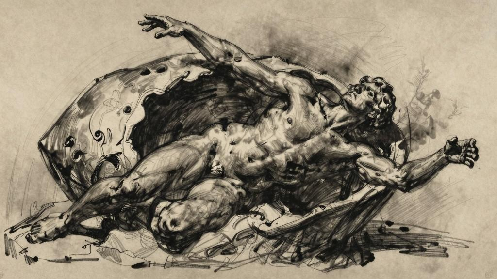
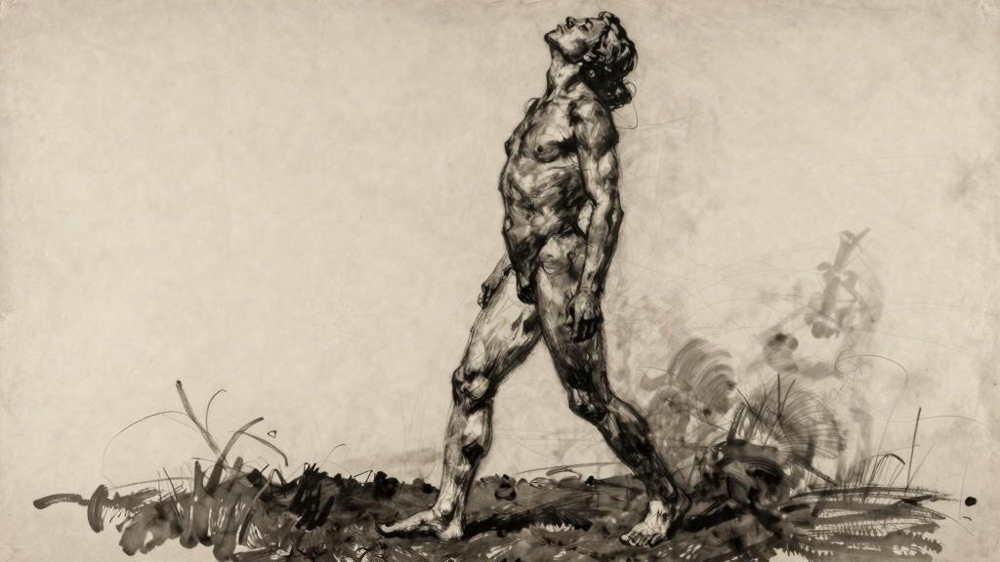

破茧重生

喜乐怠惰，潜眠于心，今朝自醒。

——哈菲兹（حافظ，波斯诗人，1320—1389）

一

纳桑奈尔，不要试图去寻找神明。神无处不在。

每一样造物都有神的影子，但没有一样能揭示神的真容。

当我们的目光停留在某个造物上时，便已经背离了神。

当别人著书立说、勤奋工作时，我却逆潮而动，花费三年的时光，在旅途中忘记了所学的一切。清空头脑的过程缓慢而艰难，但却比世人向我头脑中灌输知识的过程更有裨益，它让我开始接触真正意义上的教育。

你永远不会明白，为了对生活产生兴趣，我们付出了多大的努力；然而一旦有了兴趣，我们便会像对待其他事物那样，满怀激情地投入其中。

我愉快地责罚自己的肉体，感觉到惩罚比过错本身带来更强烈的快感——我就是这样，为了自己不是单纯地犯罪而洋洋自得。

抛开所谓的优越感吧，那是精神最大的绊脚石。

人生道路的不确定性会折磨我们一辈子。我能对你说什么呢？仔细想来，所有选择都令人畏惧。自由也是可怕的，因为它没有任何义务的约束。就像在一个完全陌生的国度里，每个人都会探索出自己的道路，请注意，是只为自己而探索；即使是非洲大陆上最不为人知的一条偏僻小道也比这样的道路可靠得多……在这陌生的国度，阴凉的树影使我们着迷，海市蜃楼让我们看到尚未干涸的清泉……但泉水只在我们欲念所及的地方流淌，因为只有当我们走近这片土地时，它才真正存在，周围的景色随着我们前行的脚步逐渐展现；我们看不见地平线的尽头；即便是我们近旁也只有不断变幻的表象。

为什么要用比喻来描述如此严肃的话题？我们都相信自己能够发现神的踪迹。可惜可叹啊，我们在寻觅神的过程中，甚至不知道该向何方祷告。最后大家才终于明白：

神无处不在，无所不在，但却寻而不见，于是便随意跪地叩拜。

无论你走到哪里，都只能遇见神明。梅纳克常说：神就在我们面前。

纳桑奈尔，你会在这一路上走走看看，但是不要在任何地方驻足。你要明白，唯有神才不是水月镜花的世事无常。

真正重要的是你的目光，而不是你眼前所见到的事物。

你所认识的一切事物，无论多么清晰和透彻，即使到世界末日也与你界限分明。

为什么要执着于此呢？

欲望是有益的，满足欲望也是有益的——满足会让欲望更加强烈。实话告诉你吧，纳桑奈尔，与占有我所渴求的对象相比，欲望本身会让我更加满足——欲求的对象终不过是虚妄。

纳桑奈尔，我已经为太多美妙的事物耗尽了自己的爱。正是我熊熊燃烧的欲望让它们焕发出如此夺目的光彩。我乐此不疲。所有热切的激情对我而言都是在消耗爱，多么甜美的消耗。

我是异端中的异端，始终被离经叛道的观念、荒诞不经的思想和分歧深深吸引。

只有与众不同的思想才能引起我的兴趣。我成功地革除了自己的同情心，我觉得同情只不过是对平庸情感的认同罢了。

不要同情心，纳桑奈尔，要爱。

去行动吧，不要评价行为是好还是坏。去爱吧，不要担心是劫还是缘。

纳桑奈尔，我要让你明白，什么是激越的热情。

去经历悲怆的一生吧，纳桑奈尔，不要平静如水。除了死后的长眠之外，我不想要任何其他休憩。我害怕所有那些在活着时不曾满足的欲望和未及消耗的精力会在我死后继续折磨着我。我希望能在世间充分表达自己内心的所有渴望，然后心满意足，了无希望地死去。

不要同情，纳桑奈尔，要爱。你能够理解，对么，同情和爱不是一回事。有时候，我唯恐失去爱，才会对悲伤、烦恼和痛苦心生怜悯，否则我完全不会在意那些情绪。每个人的生活，还是各自珍重吧。

（今天谷仓里的磨盘转个不停，我根本没法写作。昨天我就看见了那座石磨，是用来打菜籽的。糠秕四处翻飞，菜籽洒落在地上。飞扬的尘土呛得人透不过气。推磨的是一个女人。两个赤脚的漂亮男孩在地上捡拾菜籽。

我流下了眼泪，因为再也无话可说。

我明白，当一个人无话可说的时候，不能就这样提笔开始写作。但我还是写了下去，并且还会写到同一主题下的不同事物。）

*

纳桑奈尔，我想要让你得到谁也不曾给你的快乐。我不知道该如何给你，然而我确实拥有这种快乐。我想要对你诉说过去从没有对任何人说过的心里话。我渴望在这样的夜晚来到你身旁，这时你正打开又合上一本本书籍，从中探求更多的启示；你还在等待；在这样的时刻，你热切的激情难以自持，慢慢冷却成了忧伤。我只为你写作；只为这样的时刻写作。我希望能写出一本让你看不到任何个人思想和情绪的书，你只能从这本书里读到自己激情的影子。我渴望靠近你，渴望你爱我。

忧郁，无非是爱而不得的热情。

所有生灵都可以赤身裸体，所有情绪都可以沸反盈天。

我的感情蔓延开来，仿佛一种宗教。你能够理解么：每一种感觉都成了无限大的存在。

纳桑奈尔，我要让你明白，什么是激越的热情。

我们的行动从属于我们本身，就像磷光来自磷。诚然，行动消耗着我们，但也让我们焕发出自身的光彩。

如果说我们的灵魂还有一些价值的话，那是因为它比别的灵魂更加炽烈地燃烧过。

沐浴在晨光中的广袤田野啊，我曾亲眼看见你的纯美；蔚蓝的湖泊啊，我曾在你的波光中摇荡——每一丝明媚清风的爱抚都让我微笑，这就是我不厌其烦地向你诉说的一切。纳桑奈尔，我要让你明白，什么是激越的热情。

如果我知道还有更美好的事物，我将会对你诉说——当然是最美好的事物，而不是别的。

梅纳克，你没有教给我智慧。不是智慧，而是爱。

*

纳桑奈尔，我对梅纳克的感情超出了友谊，但还不至于成为爱情。我像爱自己的兄弟那样爱着他。

梅纳克是个危险人物，你要小心他。他遭到智者的谴责，孩子们却并不害怕他。

他教会孩子们不要只依赖自己的家庭，引领他们慢慢离开家庭；他激起孩子们心中的强烈欲望，让他们渴求酸涩的野果，追寻奇异的爱情。梅纳克啊，我真想再和你一起走更多的路。但是你痛恨软弱，所以想让我学会如何离开你。

每个人身上都充满了奇异的可能性。如果不是过去已经为现在划定了轨迹，那么当下完全可能通往无数种未来。但是，可惜啊，唯一的过去只能通向唯一的未来——未来像一束光线投射在我们面前，就像在时空中架起了一座看不到尽头的桥梁。

永远不要做自己无法理解的事情，这才是可靠的选择。理解，就意味着感觉自己可能做得到。尽可能肩负起人道的责任，这是一句金玉良言。

生命有许多种形式，所有形式在我看来都是美好的。（我现在对你说的这句话，正是梅纳克当年对我说过的。）

我真心希望自己能够亲身经历所有的激情和罪恶，至少能够助其一臂之力。我曾经有过各种各样的信仰。在某些夜晚，我甚至疯狂到几乎要信仰自己灵魂的地步，那时我真的感觉到灵魂就快要脱离自己的躯体了。这也是梅纳克告诉我的。

我们的生活就像玻璃杯里的冰水，高烧的病人焦渴难耐，将凝结着水珠的玻璃杯捧在手中，他将冰水一饮而尽，明知道应该等一等再慢慢喝下，但就是无法将玻璃杯从唇边移开。这水越是清凉，身体就越发滚烫。

二

我曾经多么畅快地呼吸着夜里的寒冷空气啊！窗户啊，淡薄的月色透过雾气，穿过你涌入房间里，仿佛潺潺溪水——可以捧起一汪月色畅饮。

窗户啊，不知道有多少次，我来到你面前，额头贴在窗玻璃上，想让自己清凉一下；不知道有多少次，我从令我焦灼的床榻上起身，跑到阳台上；当我静静仰望无垠的天空时，我的欲望便像轻雾一样消散得无影无踪。

往日的狂热对我的肉体造成了致命的损耗。但是，在心无旁骛地敬奉神明的时候，灵魂也同样会被消耗殆尽。

我的崇敬之情是一种骇人的执念，连我自己也为此觉得狼狈不堪。

你还要花费很长时间去寻找不可得的灵魂之幸福。梅纳克对我说。

最初那段令人困惑又心醉神迷的日子已经过去——在遇见梅纳克之前——那是一段焦虑等待的时期，仿佛穿越泥泞沼泽。我整日昏昏欲睡，无精打采，睡再多觉也无济于事。吃完饭，我倒头就睡；一直睡着，醒来的时候却觉得更加倦怠，精神也迟钝而麻木，仿佛要变成一只休眠的蛹。

生命在隐秘中活动；蛰伏在运作，未知事物在创生，艰难地分娩；我在半睡眠的状态中等待；我静静地睡着，仿佛虫蛹一般；我任由新的生命在我身上悄然成形，那将是新生的我，与现在的我大相径庭。光线仿佛透过层层碧波和树影才落在我身上；我感觉浑浑噩噩，麻木不仁，仿佛喝醉了酒，又好像深度昏迷。啊！我哀求道，请让我遭受一场性命攸关的危机，让我大病一场，让我体验生命的痛苦吧！我的头脑中好像有风暴来临，黑云压顶，让人无法呼吸，所有人都在等待一道闪电撕裂沉闷压抑的苍穹，好让被掩藏的澄澈蓝天显现出来。

等待，还要等待多久？等待结束之后，我们的生活还有什么盼头？等待啊，等什么呢？我呼喊着。不管发生什么，难道不都是从我们自己身上产生的吗？既然来自我们本身，难道还有什么是我们不知道的吗？

阿贝尔出生。我订了婚。埃里克死去。我生活中发生的种种变故不仅远没有结束这种麻木不仁的状态，反而让我陷得更深，情感的迟钝似乎来自我复杂的思想和犹疑不定的意志。我真想永无止境地睡下去，在潮湿的泥土中一直睡下去，好像自己是一株植物。有时，我心想，或许在痛苦到极点之后就能享受到快感吧。于是我便在肉体的精疲力竭中寻求精神的解脱。然后，我又睡了很久，像个年幼的孩子，因为暑热而睡意昏沉，大中午也能在吵闹的房间里安然睡去。

后来，我从遥远的梦中醒来，浑身大汗，心脏狂跳，头脑昏沉。光线透过紧闭的百叶窗，从窗缝里渗进来，将草坪的绿意反射在白色的天花板上。这一丝下午时分的光线是唯一让我感到愉悦的事物，就像在黑暗的包围中走了很长的路，终于走到石窟洞口，透过树影和流水看见隐隐颤动的天光，温柔而动人。

家中的喧闹声隐隐传来，我慢慢地恢复了生机。我用温水洗了把脸，百无聊赖地走到院子里，一直走到花园长凳那里，坐下来，无所事事地等待夜幕降临。我一直感到疲惫，不想说话，不想听别人说话，不想写作。良久，我开始读诗：

……

眼前所见，是荒芜的道路。

海鸟拍打水面，展翅飞翔。

……

我一定要栖居于此。

……

人们不顾我的想法，迫使我在森林里安家，在橡树浓荫里生活，在地底石窟中安眠。

土屋清冷苦寒，山谷沉入暗影，我无比厌烦。

高高的山岗上，树枝弯垂，仿佛是凄凉的轮回。

荆棘丛生，了无生趣[1]。

完满的生活或许能照进现实，但是目前还没有出现，有时感觉它触手可及，反复出现，越发萦绕心头。我不禁喊道：干脆打开一扇窗户吧，让生命在这无休止的折磨中彻底溃散吧！

我的生命似乎迫切需要焕然一新的变革。我等待着它第二次焕发青春。啊，洗刷掉书籍的污染，让我的双眼获得全新的视觉，让它们像眼前的蓝天一样纯净吧——最近一直下雨，今天碧空如洗。

我曾病倒；我曾踏上旅程，遇见了梅纳克；我奇迹般地康复，仿佛浴火中重生。

重生后的我是一个全新的生命，生活在一片全新的天空之下，身处于焕然一新的事物当中。

三

纳桑奈尔，我想和你谈谈等待。我曾见过夏日的原野静静等待着雨水落下。路上的灰尘变得很轻很轻，每一丝清风都会掀起尘埃。那种等待已经不能称之为欲望，它已经成了一种揪心的渴求。干涸的大地裂开缝隙，仿佛是为了迎接更多的雨水。旷野上的花香几乎让人无法忍受。炎炎烈日之下，万物了无生气。每天午后，我们都会在露台下小憩，尽量避开那炽烈的阳光。那也正是某些树木的球果满载花粉的季节，树枝不时轻轻晃动，将生命的种子播撒到很远的地方。风暴在天空中蓄势待发，大地万物都在等待。这样的时刻凝重得令人窒息，连鸟雀都缄默无声。大地上卷起灼人的热浪，几乎要让人晕厥。球果植物的花粉从树枝间飘散到空气中，好像一股金色的烟雾。片刻，下雨了。

我曾见过天空颤抖着等待黎明的到来。星辰一颗接一颗消失不见。晨露打湿了草地。空气的触感好似清凉的爱抚。有那么一阵子，意识模糊的生命还想要流连在梦乡里，我头昏脑涨，疲惫昏沉。我向高处走去，一直来到林地的边缘。我坐了下来。动物们知道白昼即将来临，快乐地开始活动。生命的奥秘也在每一片树叶的脉络中再次舒展开来。瞬间，天亮了。

我还目睹过许多次黎明来临的瞬间，也曾亲眼见证夜幕降临的那一秒。

纳桑奈尔，对你而言，每一场等待都不是因为欲望，而只是单纯地迎接事物的到来。等待一切顺其自然地来临吧，不过你也只能渴望自然而来的事物。你只能渴望自己可以拥有的事物。你要明白，在一天中的任何时刻，你都可以感受到神的恩赐。希望你的欲望源自爱，希望你对自己拥有的一切心怀爱意。假如欲望无果而终，又怎么能算得上是欲望呢？

纳桑奈尔啊，你拥有神的恩德，自己却浑然不觉！能看见神明，便是拥有了神的恩德，但人们总是视而不见。先知巴兰啊，你座下的毛驴都在神明面前停下脚步，驮着你绕远路，难道你一次都没有看见吗？那是因为你想象中的神是另一副模样。

纳桑奈尔，只有神明是不能等待的。你要是等待神明，纳桑奈尔，那就意味着你还没有意识到自己已经获得了神的恩德。不要把神和幸福区分开来，你全部的幸福都应该着眼于当下。

我把自己所有的财富都带在身上，就像东方女人把全部家当都穿戴在身上一样。

在我生命中每一个不起眼的时刻，我都能感觉到身上背负着自己全部的财富。这笔财富并不是许许多多具体事物的集合，而是我独一无二的崇敬之情。我始终支配着自己所有的财富。

你应该将夜晚看作是白昼消亡的时刻，而将清晨看作是万物生长的时刻。

希望你的视角每时每刻都是崭新的。

智者，就是对一切事物都感到新奇的人。

纳桑奈尔啊，你之所以疲乏头痛，纯粹是因为拥有的东西太过繁杂。你甚至都不知道在这一切当中自己最喜欢的是什么，你也并不理解唯一的财富其实就是生命。活着时最微不足道的瞬间也远远强过死亡，活着本身就是对死亡的否定。死亡就是在给别的生命让路，让天地万物不断地轮回更新；死亡为所有生命限定了时间，绝不让其超过应有的限度。当你的话语在世间回荡，那便是幸福的时刻。其他时候，就静静倾听吧。不过，只要开口说话，就不要再听他人的声音。

纳桑奈尔，你应该焚毁心里所有的书籍。

我崇敬我焚毁的一切有些书，可以坐在小凳上，在小学生的课桌前阅读；

有些书，可以边走边读（小开本）；

有些书适合在森林阅读，有些书适合在田园阅读，就像西塞罗说的那样：在乡野读书。

有些书，我在公共马车上阅读，有些书，躺在草料房深处阅读。

有些书让人相信灵魂的存在，有些却让人失去所有期待；

有些书证明了神的存在，有些书的证明却宣告失败。

有些书不为世人所容，只能藏在私人的书房；

有些书则广受好评，获得权威评论的颂扬。

有些书只研究如何养蜂，有人觉得内容太过专业；

有些书详尽地描绘大自然，读完之后不用再出门游玩；

有些书为智者所不齿，却让孩子们格外喜欢。

有些书被称作选集，收集辞藻华丽的文段；

有些书能教会你热爱生命，有些却让作者选择自我了断；

有些书播种仇恨，播下什么种子便收获什么果实；

有些书字字珠玑，美好得令人心醉，低调得那么谦卑；

有些书如兄弟般亲切可爱，比我们更纯洁，也更精彩；

有些书文笔奇谲，让人百思不得其解。

纳桑奈尔，我们什么时候才能烧掉所有的书籍啊！

有些书不值一文，有些却价值连城。

有些书讲述宫廷贵人，有些则关注布衣寒门。

有些书言辞温柔，仿佛正午树叶的低诉。

这里有一本书，曾经被圣徒约翰在帕特莫斯岛像老鼠一样咀嚼，不过我更喜欢覆盆子[2]的清甜；

啃书让他的脏腑苦不堪言，然后便产生无数幻觉。

纳桑奈尔，我们什么时候才能烧掉所有的书籍啊！

仅仅读到海边的沙滩有多么柔软，对我来说是不够的。我想要光着脚亲自去感受……一切没有直观感受的知识对我来说都没有什么用处。

每当我看见这世间柔和美丽的事物，都渴望倾注全部的柔情去抚摸它。大地是如此多情，繁花盛开的景象令人叹为观止。景观承载着我的欲望，广袤的国度任凭我探索寻觅！水边是纸莎草围成的小径，芦苇俯身向河面倾斜，林中空地让人眼前一亮，透过交错的树枝可以看到一望无际的平原。我曾在岩石或植物构成的走廊中漫步。我曾见过春回大地。

万象更新。

从那一天起，我生命中的每时每刻都充满了新鲜感，那实在是一种难以言喻的馈赠。从那时起，我的生活处处都是持续不断、激情洋溢的惊喜和错愕。我很快便为此而陶醉，满心欢喜，就这样飘飘然在世间行走。

不用说，我想要亲吻所有含笑的嘴唇，想要啜饮脸上的鲜血和眼中的泪珠，想要大嚼沉甸甸挂在枝头向我伸过来的果实。每到一家旅店，饥饿都在向我招手；每到一处清泉边上，我都觉得口渴——在某一口泉眼边，都有一种特别的干渴——我真希望能用别的字眼来形容各种各样的欲望：

在康庄大道上行走的欲望；

在阴影里休憩的欲望；

在深潭里游泳的欲望；

在每一张床上做爱或安睡的欲望。

我对种种事物大胆出手，自以为有权得到我渴望的每一个对象（话说回来，纳桑奈尔，我所期望的其实完全不是占有，而是爱）。啊！希望我面前的一切事物都色彩斑斓，希望一切美好的事物都因我的爱而更有光彩。

[1]节选自诗歌The Exile's Song，中译名《流放之歌》，出自《英国文学》。

[2]覆盆子，蔷薇科悬钩子属的木本植物，是一种水果，果实味道酸甜。
