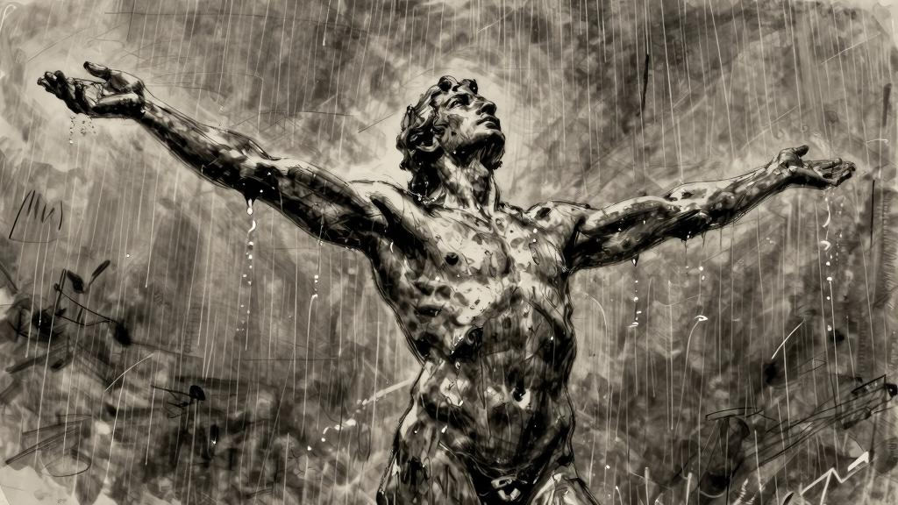
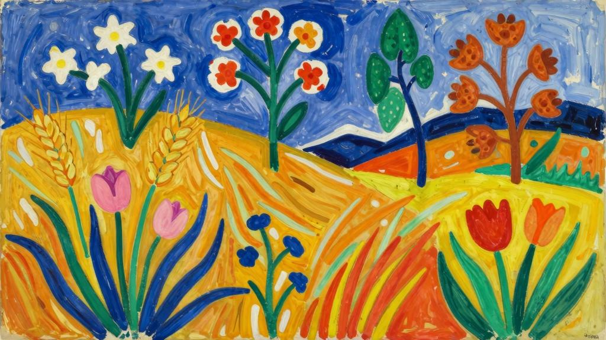

万物有时

食粮啊！

食粮啊，我对你们满怀期待！

我的饥饿感绝不会凭空消失，只有得到满足才能消停下来，大道理说服不了饥饿，抑制食欲只能滋养灵魂。

满足感啊，我苦苦寻觅着你。

你就像夏日清晨一样美丽。

夜里让人觉得甘甜，正午让人感到清冽的泉水；拂晓时分的凛冽溪流；波浪拍打岸边时拂面的清风；桅杆林立的港湾；水花韵律温柔地拍打着河岸……

对了，如果还有通向原野的大路；正午时分的暑热；田野中的开怀畅饮；还有干草垛里可以过夜的安乐窝；

如果还有通往东方的道路；令人心向往之的海上航线；摩苏尔的花园；图古尔特的舞蹈；赫尔维西亚的牧歌；

如果还有指向北方的大道；尼日尼的集市；掀起飞雪的雪橇；封冻的冰湖。

如果有这一切，纳桑奈尔，我们的欲望一定会得到满足。

航船驶入我们的港口，从陌生的海岸运来熟透的果实。赶紧卸下沉甸甸的货物吧，好让我们尝一尝鲜。

食粮啊！

食粮啊，我对你们满怀期待！

满足感啊，我苦苦寻觅着你，你就像夏日里的欢笑一样美丽。

我知道我的每一种欲望，都有虎视眈眈的对象，每一次饥饿感都等待着它应有的报偿。

食粮啊！

食粮啊，我对你们满怀期待！

我在这世间苦苦寻觅着你们，寻觅着可以满足我的七情六欲。

*

在这人世间，我知道的最美的事物，纳桑奈尔啊！

那就是我的饥饿感。

饥饿感永远忠实，忠实于它所期待的对象。

葡萄酒会让夜莺沉醉吗？

牛奶会让鹰隼沉醉吗？

而刺柏会让斑鸠沉醉吗？

鹰隼沉醉于飞翔。夜莺沉醉于夏夜。让原野颤抖的是炎热。纳桑奈尔，希望所有的情绪都能让你陶醉。如果面前的食物无法让你陶醉，那是因为你的饥饿感还不够强烈。

每一项圆满完成的活动都会带来快感。正因如此你才知道自己做的是正确的事。

我一点也不喜欢那些将辛苦劳作视为美德的人。如果觉得苦不堪言，他们最好还是去做些别的事情。做一件事情乐在其中，恰恰说明我们就适合做这个。纳桑奈尔，发自内心的愉悦感，对我来说就是最重要的指南。

我知道自己的身体每天会渴求怎样的快感，也知道自己的头脑能够承受的限度。

而在这之后，我又陷入了沉睡之中，大地和天空对我不再有任何意义。

*

总有些古怪的病症，让人偏偏想得到自己没有的东西。

“我们也一样啊，”有人说，“我们也一样，我们也经历过灵魂空虚的痛苦！”在亚杜兰的山洞里，大卫啊，在你渴望痛饮陶罐里的清水时，你也曾感叹过：“唉！谁能给我送来伯利恒城墙下的清水啊！当我还是个孩子的时候，总是喝那儿的水解渴；现在我烧得唇焦舌干，水却落入了敌人手中。”纳桑奈尔，永远别指望回头能品尝到昨日的甘露。

纳桑奈尔，永远不要在未来找寻过去的影子。每时每刻都是全新的，把握住每个瞬间吧，不要为快乐事先准备什么。你要知道，就算你准备了，最后出现的也只会是意料之外的另一种乐趣。

难道你还不明白吗，幸福就像路边的流浪者一样，随时随地都有可能出现在你眼前。倘若你说梦想中的幸福不是这样，只有符合你的原则和心意才算得上是幸福，并因此断言自己失去了幸福的话，那你可就真的太不幸了。

对明天的憧憬是快乐的，但在第二天获得的快乐又是另一码事。幸运的是，事情从来都不是人们梦想的那副模样；正是因为不同，才能体现出每种事物各自的价值。

我不想听你对我说：来吧，我已经为你准备好了这样或那样的快乐。我只喜欢偶遇的快乐，是那种能让我惊喜地喊出声来的快乐。这样的快乐像湍流一样奔涌而来，鲜活而强烈，就像刚刚酿出来的最新鲜的葡萄酒。

我不想要精心粉饰的快乐，也不要书拉密女[1]穿越一间间房舍向我走来。我亲吻她，甚至都来不及擦去葡萄在唇上留下的痕迹；亲吻她之后，嘴唇的温度还未退散，便又痛饮美酒；我咀嚼着甜美的蜂蜜，连蜂蜡也一起吃了下去。

纳桑奈尔，不要事先为快乐做任何准备。

*

不能说“真不错”的时候，就说“那就这样吧”。这样一来，你很有可能会收获幸福。

有些人认为幸福的时刻是神明赐予的——那么其他的时刻又是谁赐予的呢？

纳桑奈尔，不要把神和幸福区分开来。

“我因自己来到这世间而对‘神明’感激涕零——假使我不存在的话，我也会因此而埋怨‘神明’，而感激的程度绝不会超过怨恨。”纳桑奈尔，我们只能自然地谈论神明。

我想说的是，大地也好，人也好，我自己也好，只要神明存在，这一切存在就都是再自然不过的事物了。但是真正让我感到困惑的是，当我意识到这一点时竟然会目瞪口呆。

诚然，我也曾唱过圣歌，也曾写下下面这首回旋曲。

回旋曲：神存在的美好证据纳桑奈尔，我想让你知道，人类最美好的诗作就是无数证明神确实存在的诗篇。

你能理解，对吗？在这里我并不是要重述那些证据，尤其不想简单地重复。再说，那只是证明神确实存在的证据，而我们要证明的还有神的永恒。

啊，是的，我知道之前已有圣安塞尔姆的论述，还有关于那完美无缺的幸运岛的故事，但是可惜啊，可惜啊，纳桑奈尔，不能让全世界的人都在岛上居住。

我知道大多数人对此都表示赞同，可是你呢，却相信少数神的选民。

二加二等于四，证据确凿，但是，纳桑奈尔，并不是人人都会算术。

我们已有造物主最初存在的证据，但在那之前还有更古老的神明。

纳桑奈尔，真可惜我们当时不在那儿。

否则我们就能见证男人和女人的创生，看着他们——惊讶自己刚出生却不是婴儿之身，厄尔布鲁日山的雪松历经数百年，已心生厌倦，就那样屹立在流水蚀刻的山岗间。

纳桑奈尔！真希望我们就在那里，迎接世界的黎明！可是我们怎么那么懒惰，没能早起呢……你呀，你难道没有要求在那时出世吗？哎，如果是我的话，我一定会提出那样的要求……不过，那时神明也才刚刚从没有时间的混沌沉睡中苏醒。倘若我在那里的话，纳桑奈尔，我会请求神把一切都造得更宏伟一些；好吧，你可不要对我说，那时候一点也看不出这样的区别。

“我完全可以创造另一个世界，”阿尔希德说，“在那里二加二可不等于四。”“得了吧，我看你可做不到。”梅纳克说。

由果推因，可以证明神的存在。

但不是所有人都认为结果可以证明动机。

有人认为我们对神的爱就是神明存在的证据。纳桑奈尔，这就是为什么我说神明就是我所爱的一切，这就是为什么我愿意爱恋一切的原因。别担心我会以你为例，再说我也没打算从你开始；我对许多事物的喜爱都远胜过人类，人并不是我在这世界上格外钟情的对象。因为我不想骗你，纳桑奈尔——我身上最强大的特质显然不是善良，善良也不是我认为自己所具有的最优秀的品质；我认为人类最珍贵的品质也不是善良。纳桑奈尔，希望你爱神胜过爱人。我自己也曾经歌颂过神明，为神明大唱赞歌。有时候我甚至做过了头。

有人问我：“构建起各种体系，你觉得很有意思吗？”我答道：“我觉得没有什么能比伦理道德更有意思了，我能从中获得精神的满足。

只有让快乐获得道德上的意义，我才能充分品味其中的乐趣。”“这会让快乐更强烈吗？”“不会啊，但是能让我心安理得。”确实如此，我经常用某种学说，甚至是完备严谨的思想体系为自己的所作所为正名，这让我十分得意；有时却觉得这只是在为自己的纵情声色找借口罢了。

*

纳桑奈尔，万物皆有时，所有事物都是应运而生的。换句话说，都是应某种外化的需要而生。

树木对我说：我需要一片肺叶，所以我的汁液化生成叶片，让我能够呼吸。呼吸好了，叶子也就落了，但我并不会随之死去。我对生命的全部思考都凝聚在我的果实里。

纳桑奈尔，别担心，我不会滥用寓言，因为我并不十分赞赏这种表达方式。除了生活本身，我没有什么可以教给你的智慧。思考实在劳神费力。我年轻的时候总爱思考自己行为的后果，结果把自己弄得精疲力竭。后来我便相信，想要不再犯错，干脆什么都不要做。

于是我便写下了这样的话：我的肉体能够得救，恰恰是因为灵魂中毒太深，已无药可救。写完之后，连我自己也不明白我究竟想要表达什么。

纳桑奈尔，我再也不相信所谓的罪孽了。

不过你得明白，这么一点点思考的权利，是要以牺牲许许多多的快乐作为代价的。如果一个人在认为自己是幸福的同时还有思考的能力，那才称得上是真正的强者。

纳桑奈尔，人之所以不幸，是因为他们总在四处打量，而且认为所见之物就属于自己。一件东西的重要性并不取决于我们，而是取决于它自己。希望你的眼睛就是你所看见的事物。

纳桑奈尔，倘若不能再呼唤你动听的名字，那我再也不会写哪怕一行诗。

纳桑奈尔，我真希望是由我来亲手赋予你生命。

纳桑奈尔，你能感受到我话语中的凄楚情意吗？我真希望自己能离你近一点，再近一点。

就像先知以利沙让书拉密女的儿子复活那样——“口对口，眼对眼，手对手，伏在孩子身上”——我那有力的心脏照耀着你深如黑夜的灵魂，我全身伏在你身上，我的嘴对着你的嘴，我的额头贴着你的额头，我滚烫的双手握着你冰冷的双手，我的心脏急切地跳动……（“孩子的身体就渐渐暖和了”，书里记载道）你终于在快感中醒来，然后便丢下我，去迎接扣人心弦、落拓不羁的生活了。

纳桑奈尔，这就是我灵魂中的全部热情。你拿去吧。

纳桑奈尔，我要让你明白，什么是激越的热情。

纳桑奈尔，不要在和你相像的事物身边停下脚步；纳桑奈尔，永远不要停下脚步。如果周围的环境和你越来越像，或者是你越来越被周围的环境同化，那你就再也无法从中获得什么益处了。你必须离开这样的环境。你的家庭、你的斗室和你的过去对你而言比任何事物都更危险。从每件事物中学习知识，这就够了。尽情享受其中的快感吧。

纳桑奈尔，我想和你谈谈生命中的各种瞬间。你明不明白瞬间是一种多么强大的存在？如果不是时常想到死亡，生命中最微小的瞬间就不会显得那么珍贵。难道你还不明白，如果没有黑沉沉的死亡作为背景，生命中的一个个瞬间怎么可能闪现出如此令人赞叹的光芒？

倘若有人告诉我并且让我确信自己有足够的时间去做一件事，那我大概什么也不会做了。既然有充分的时间去做任何事，那在我决定开始做一件事之后，首先得好好休息一下才行。我已经知道这样的生命必将终结——在度过一生之后，我就要陷入一场长眠，比每一夜辗转期待的睡眠更深沉，更令人忘却一切……既然如此，那么我今生所做的一切都没有任何意义。

*

于是我便养成了习惯，将每一个瞬间从生命中抽离出来，这样可以获得孤立而完整的快乐，可以将独一无二的幸福凝聚在这几乎静止的瞬间；那种感觉是如此强烈，以至于当我回忆起刚刚过去的那一瞬间时，几乎认不出自己是谁。

*

纳桑奈尔，坦然承认一切，本身就会带来强烈的愉悦感：

枣椰树的果实叫作椰枣，那是一种美味佳肴。

枣椰酒学名叫拉格蜜，是用树汁发酵酿成的。阿拉伯人会喝得酩酊大醉，但我却不怎么喜欢。在瓦尔迪的美丽花园里，卡比尔牧羊人给我递上的，正是一杯枣椰酒。

*

今天早晨在水泉公园的小径上散步时，我发现了一株奇特的蘑菇。

它包裹在一层白色的鞘里，很像是橘红色的玉兰果，表面有规则的烟灰色花纹，应该是内部飘出的孢子形成的。我掰开往里看，里面装满了泥浆似的物质，正中心是一块透明的胶状物，散发出一阵阵令人恶心的气味。

它周围还长着别的已经打开的蘑菇，就是我们经常在老树干上看到的那种扁平的蘑菇。

（我在动身前往突尼斯城之前写下了上面这段文字，现在抄录于此，就是想让你明白，我对眼前所见的每一件小事都非常在意。）

翁弗勒尔街头——在某些时刻，我觉得自己虽然身在人群之中，但是来来往往的人群反而让我对自己的私人生活有了更强烈的感受。

昨天我在别处，今天就在这里。

神啊，他们和我有什么关系？

他们一直说，一直说，一直说：

昨天我在别处，今天就在这里……

在某些日子里，只要不断重复“二加二还是等于四”，只要看到我的拳头放在桌子上……就足以让我心中充满某种宗教般的至福。

在另一些日子里，我觉得这些都完全无所谓。

[1]Sulamite，《圣经·雅歌》中所罗门之妻。
