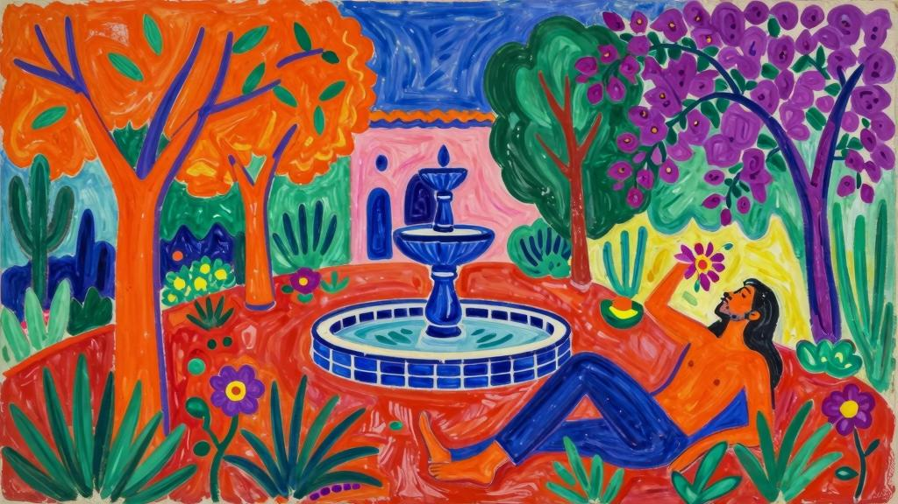

异域花园

波尔格斯别墅——在这只浅口盆里……在半明半暗的光影中……仿佛能看到每一滴水、每一缕光线和每一种生命都在获得快感的瞬间凋零。

快感！这个词，我愿意不停地重复成千上万遍。我觉得快感完全可以作为快乐的同义词，甚至足以作为生命的同义词。

啊！人们仔细思量之后才终于明白，神明创造这个世界并不单单是为了快感。

这里凉爽得出奇，让人特别想好好睡上一觉。这种愿望是如此强烈，但在此之前似乎从未有人体验过。

在这里，珍馐佳肴正静静等待着我们饥肠辘辘的时刻到来。

亚得里亚海，凌晨三点——水手在缆绳间的歌唱让我厌烦。

无比古老又如此年轻的大地啊，倘若你懂得，倘若你懂得苦涩与甜蜜交织的体验，懂得短暂人生的愉悦滋味，那该有多好啊！

关于表象的永恒概念啊，倘若你明白在等待死亡迫近的时候，当下的瞬间会有多么珍贵，那该有多好啊！

春天啊！有些植物只能存活一年，它们脆弱的花朵显得有些迫不及待。人的一生中也只有一季春天，对往昔快乐的回忆并不能让我们更靠近幸福。

菲耶索莱的山丘——美丽的佛罗伦萨，一座拥有庄严学识、奢华和鲜花的城市，它更是一座庄重的城市。这里有爱神木的种子和“细叶月桂”编织的桂冠。

在芬奇格利亚塔山岗上，我第一次看见云朵如何消散在蔚蓝的天空。我很吃惊，因为我没想到云朵竟然会融化在天空里，我原以为云朵会不断聚积，直到雨水倾泻而下，但是并没有。我仔细看着絮状的云朵一丝一丝消失不见，最后只剩下湛蓝的天空。

那是一场华丽的死亡，一场发生在天幕上的消逝和没落。

罗马，苹丘——那天让我感到愉快的，是某种类似爱情的感受。但那并不是爱情，至少不是人们惯常谈论和追求的那种爱情，也不是对美的感知。那种感受并非来自某个女人，也并非来自我的思想。如果说那仅仅是光线引起的兴奋激情，我会这样写吗？而你又是否能够理解我呢？

那天我就坐在这座花园里。我没有看见太阳，但是空气中弥漫着明晃晃的光，蔚蓝的天空仿佛融为液体，像雨水一样落下来。是的，千真万确，光线真的形成了波浪和涡流，星星点点的光像雨滴一样打在青苔上。是的，千真万确，在这条林荫小道上，真的会觉得光线在流动，闪耀的流光让树木的枝头挂满了金光闪闪的泡沫。

那不勒斯——沐浴在海边阳光里的小理发店。码头上烈日炎炎，掀起门帘走进店里，慵懒得只想放松一下，这需要很长时间吗？一片寂静。额角满是汗珠，肥皂泡沫轻轻抹在脸颊上。刮完胡须，还要用更纤薄的剃须刀再仔细修饰一番，然后用一小块海绵蘸着温水润湿皮肤，精心处理嘴唇上的胡须。之后，用淡味的香水洗去皮肤上留下的灼痛，再抹一层香膏，镇静皮肤。最后，为了能再多待一会儿，我又让理发师给我剪了头发。

阿马尔菲的夜——有人在夜色中等待，等那一无所知的爱。

那是一座能俯瞰海面的小房间。月光太过明亮，照得我从睡梦中醒来，一睁眼便看到海上生明月的景象。

我走向窗前，以为天已破晓，太阳快要升起……但是并没有。

是月亮（极为圆满的满月）。月色那么温柔，那么温柔，仿佛海伦迎接又一个浮士德那样温柔。海面上了无人迹，村庄里一片沉寂，一条狗在夜色中嚎叫，窗户上挂着破衣烂衫……

没有一点人的动静，我完全无法想象这一切还会苏醒。那条狗没完没了地哀嚎。

天再也不会亮了，我再也无法入睡。这种时候，你会做什么呢……比如下面这些？

你会到空无一人的花园里去吗？

你会走下沙滩，去海边洗澡吗？

你会去采摘在月光下看起来是灰色的柑橘吗？

你会去抚慰那条狗吗？

有好多次我都感觉到大自然要我做些什么，但我一直都不知道该如何回应。

辗转反侧，等待不会到来的睡意……

一个孩子尾随我走进了被围墙环绕的花园，手里紧紧抓着树枝条轻拂楼梯。楼梯通向与花园相邻的露台。但从外面看，并没有路可以通向露台。

我端详着那树影下的小小身影。再多阴影也遮掩不了你的光彩，卷发在你额前投下的影子只会被映衬得更加深暗。

我攀着藤蔓和枝条下到花园里，在树丛里满怀柔情地啜泣，树丛里的鸟鸣比大鸟舍还要热闹——我将一直流泪，直到夜幕降临，直到黑夜笼罩大地，将谜一般的喷泉水染成越发深邃的金色。

美好的肉体在树影中结合。

我伸出修长的手指触碰他润泽的肌肤，他悄无声息地踏在沙地上，我看见他秀美的双足。

叙拉古——平底小船，天空低沉。有时，在温暖的雨中，天空似乎就压在我们头顶上。水生植物带来淤泥的气味，茎秆摩擦发出沙沙的声响。

水很深，蓝色源泉的喷涌便不那么显眼。没有一点响动。在孤寂的田野中，在这天然形成的喇叭形洼地里，泉涌就像水波在纸莎草中开出的花朵。

突尼斯城——在清一色的碧海蓝天之间，唯独需要风帆的一点白色，还有风帆倒影的一点绿色。

夜晚。指环在暗影中闪现光泽。

月色清朗，我们在月下漫步。夜色中的想法与白天大相径庭。

沙漠中的月色诡异凄凉，恶灵在墓地中游荡。

赤足踏在青灰色的石板上。

马耳他——夏天里，每到日暮时分，当天还没有黑透但已没有日影的时候，广场上总会弥漫着一种令人心醉神迷的奇特氛围。那是一种特别的激情。

纳桑奈尔，我想和你谈谈我所见过的最美丽的花园：

在佛罗伦萨，到处都有人卖玫瑰。有那么几天，整座城市都散发着香气。那时我每天晚上都在乡村公园散步，每到周日则会去没有花朵的波波利花园。

在塞维利亚，吉拉达钟楼附近有一座古老的清真寺；院子里整整齐齐地种着一棵一棵的橘子树，树与树对称排列；其余地方则铺有石砖。太阳当空的日子里，树冠只会投下很小的一片阴影。庭院呈方形，周围有围墙环绕。这所庭院具有一种盛大的美感，但我不知道该如何向你诉说。

城外有一座围栏环绕的大型花园，里面生长着许多热带树木。我从来没有进去过，但是透过围栏可以看到里面。我曾经见过珍珠鸡在树间奔跑，我想里面应该有很多家养动物。

我该如何向你描述塞维利亚王宫呢？那座花园就像一处波斯奇观；当我和你说起它的时候，我想我对它的喜爱要胜过其他所有的花园。每当读到哈菲兹的诗句，我便会想起这座花园：

举杯斟美酒香渍染襟前踉跄为情故人谓为智贤花园里，林荫道上装点着一座座喷泉，小径上铺着大理石砖，沿路生长着爱神木和雪松。林荫道两旁是大理石砌成的水池，过去国王的情人们就在那里沐浴嬉戏。除了玫瑰、水仙和月桂，这里看不到任何别的花朵。花园深处有一棵参天大树，仰头望去，可以看到一只鹎鸟一动不动地立在枝头。在距离宫殿更近的地方，有些水池品味恶俗，令人联想到慕尼黑王宫花园里类似的作品，比如完全用贝壳做成的雕塑。

那是一个春天，我在慕尼黑王宫花园里游玩，品尝着五月苜蓿冰淇淋，听着军乐队没完没了的演奏。周围的听众一点也不优雅，但却对音乐如痴如狂。入夜之后，夜莺唱起凄婉的歌谣，那歌声就像德文诗一样令我郁郁寡欢。人对喜悦的感知是有限度的，过于强烈的喜悦会让人流泪。游览这些花园带来的甜美乐趣让我不禁想起，我原本也可能去往其他任何地方。那一年的夏天，我学会了如何享受温度的妙处。我的眼睑对温度格外敏感。我记得有一天夜里，在火车上，我特地从一扇打开的窗户旁走过，就是为了感受凉爽的气流从皮肤表面拂过。我闭上了眼睛，不是为了入睡，而是为了感受这种抚摸。令人窒息的炎热占据了整个白昼，现在到了晚上，空气依旧温热，但在吹过我滚烫的眼睑时，却好像是清凉的水流。

在格拉纳达，赫内拉利菲宫的露台上种着欧洲夹竹桃，我去游览的时候还未到花开的时节；去比萨公墓花园的时候，也没有看到花开；造访圣马尔克的小隐修院时，原以为能观赏到满园玫瑰的盛景，然而也并没有。不过，在罗马，我领略到了苹丘最美好的季节。午后暑热难耐，人们便去苹丘纳凉避暑。当时我就住在附近，每天都会去那里散步。那段日子我身体不好，没法思考任何问题。

我沉醉在大自然之中。

有时，在神经错乱的作用下，我觉得自己的身体仿佛不受任何束缚，可以自由自在地徜徉在天地之间；有时，我全身上下充盈着快感，仿佛一块酥松的方糖，就这样慢慢融化。从我所坐的石凳上望去，看到的不是令我疲惫不堪的罗马，而是可以居高临下，将波尔格斯花园尽收眼底，稍远处最高的松树梢也只与我的脚底齐平。高处的平台啊，向广阔的空间展开，让视线在空中遨游……

我真想在夜里游览法尔内塞宫花园，然而晚上不得入内。那里草木繁茂，遮掩了断壁残垣。

在那不勒斯，有的花园地势很低，就建在大海边，仿佛一道繁花似锦的海堤，笼罩在阳光里。

在尼姆，喷泉花园里随处可见曲水流觞。

在蒙彼利埃有一座植物园。我记得一天晚上，我和安布瓦兹一起，就像在阿卡德摩斯花园里一样，我们坐在一座古老的墓碑前，周围松柏环绕。我们有一句没一句地闲聊，咀嚼着玫瑰花瓣。在另一个夜晚，我们从佩鲁广场举目望去，看到远方的海面在月色下闪动着银亮的波光，周围只有水塔发出的隆隆声，翅边镶有白色羽毛的黑天鹅在宁静的水面上游曳。

在马耳他，我常在住所的花园里读书。老城区有一小片柠檬树，当地人称之为“小树林”。我常去那里，摘下熟透的柠檬一口咬下去，最初那一阵酸味连牙都要酸倒了，之后却会在唇齿间留下清新的回甘。在叙拉古惨不忍睹的古代石牢里，我也曾这样大嚼柠檬。

在拉艾公园，已经失去野性的黄鹿在林间奔跃。

在阿夫朗什花园，可以看到圣米歇尔山。日落时分，远方的沙滩宛如流动的火焰。有些城市规模极小，花园却格外迷人。我已经忘了那些城市，忘记了城市的名字。

我希望能再看一眼那些花园，但却永远不会再见了。

我梦想着摩苏尔的花园，听说那里开满了玫瑰，还有波斯诗人欧玛尔在诗中歌唱的纳什普尔花园，还有哈菲兹笔下的设拉子花园。我们再也见不到纳什普尔花园了。

但是在比斯克拉，我领略到了瓦尔迪花园的风光。孩子们在花园里放羊。

在突尼斯城，除了墓地之外再也没有别的花园了。在阿尔及尔的试验植物园（那儿栽植了各种各样的棕榈科植物），我有幸品尝了各种从未见过的水果。还有卜利达（阿尔及利亚北部城市）！纳桑奈尔，我该怎么和你说呢？

啊！萨赫勒的青草是多么温柔！橙花盛放，树影清凉，花园里飘荡着沁人心脾的芬芳！卜利达！卜利达！美丽的小玫瑰啊！初冬时节，我竟然没认出你来。圣洁的树林里绿叶常青，无需等待春天的焕新。紫藤萝和别的藤蔓植物却好像等待燃烧的柴薪。雪从远山飘落，慢慢靠近你。我在房间里都暖和不起来，在你那多雨的花园里更是无法取暖。我读着费希特的《全部知识学的基础》，感觉自己又有了宗教信仰。那时我很温柔，常说人应该学会与忧伤共处，而且试图让这种想法成为一种品德。此刻，我晃一晃凉鞋，鞋上的灰尘抖落，谁又知道风将它们带向何方？那是来自沙漠的灰尘，我曾和先知一样跋涉在沙漠中。干燥的石块风化成碎屑，炙烤着我的双脚（阳光将地面晒得滚烫）。现在，在萨赫勒的青草地上，我的双脚终于可以休息了！此时我们说的每一句话仿佛都是情话！

卜利达！卜利达！萨赫勒的鲜花！我的小玫瑰啊！我曾见过你的柔嫩和芬芳，枝繁叶茂，繁花似海。严冬的雪已经消逝得无影无踪。在你那圣洁的花园里，白色的清真寺闪耀着神秘的光，鲜花压弯了藤蔓的枝条。馥郁的空气中飘荡着橙花的清香，就连纤弱的橘子树也散发出清浅的香气。桉树恣意生长，老树皮从高高的枝桠上抖落，已经不能再保护大树了，好像天气转暖后无用的冬衣，又好像我那只有在冬天才有价值的陈旧道德。

卜利达——在这初夏的清晨，当我们走在萨赫勒的大路上，在金色阳光下，在蔚蓝天空下的桉树浓荫里，茴香茎秆粗壮，盛开的金色花朵黄里透绿，焕发出无与伦比的光彩。

而那些桉树，它们有时簌簌作响，有时纹丝不动。

所有事物都是大自然中的一份子，谁也无法跳出天地之外。物理法则无所不在。

列车飞驰，驶进夜色，又披着一身露水驶出清晨。

船上——有多少个夜晚啊！我在船舱里，面对紧闭的舷窗，看着圆形的玻璃——很多个夜晚，我就这样坐在床铺上看着你，心想：看吧，等窗外天色发白的时候，黎明就要到了，那时我就要起床，抖擞精神，抖落这一身的不舒服。那时黎明将使大海安静下来，我们也将踏上陌生的土地。可是黎明到来的时候，大海仍然不平静，陆地仍然遥不可及，我的思绪就这样荡漾在摇晃的海面上。

我的整个身体都清楚记得海浪颠簸带来的不适。我想：我是不是该把思绪挂在摇晃的桅杆上？海浪是什么样子，难道我只能看到夜风中飞溅的水花吗？我将自己的爱洒落在波涛里，将思绪播撒在波浪的荒原上。我的爱纵身跃进此起彼伏、前赴后继的海浪。浪花拍打而过，从舷窗里就再也看不见了。大海没有形状，始终波涛激荡。在远离人群的地方，海浪也悄无声息，再也没有什么能够阻挡海水的流动，也再没有人能够听见海的沉默。海浪在拍打最脆弱的一叶小舟，我们还以为那声音是风暴的怒吼。汹涌的浪头向前推进，一浪高过一浪，却没有一丝声响。海浪前赴后继，每一浪都掀起同一滴水，却没有改变水滴的位置。运动的只是海浪的形状，水体随浪花抬高然后落下，却不会追随波浪而去。每一朵浪花都只在一瞬间抓住一滴水，无数滴水掀起波浪又落下。灵魂啊！不要执着于任何一种想法。让所有的想法都随风而去吧。上天堂的时候，任何一种想法你都带不走。

涌动的浪涛啊，是你让我的思绪如此荡漾！你无法在浪尖上建造任何东西，浪花承受一丝重量都会粉身碎骨。

迷失在茫茫大海上，沮丧地四处飘荡，温馨的港湾究竟还会不会出现呢？让我的灵魂抵岸休憩吧——踏上坚实的海堤，身旁是旋转的灯塔。然后，回望大海。
