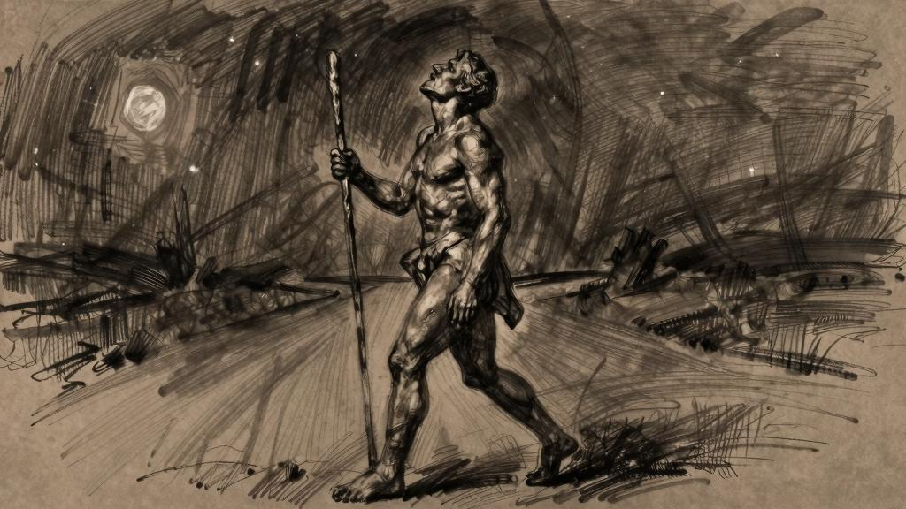
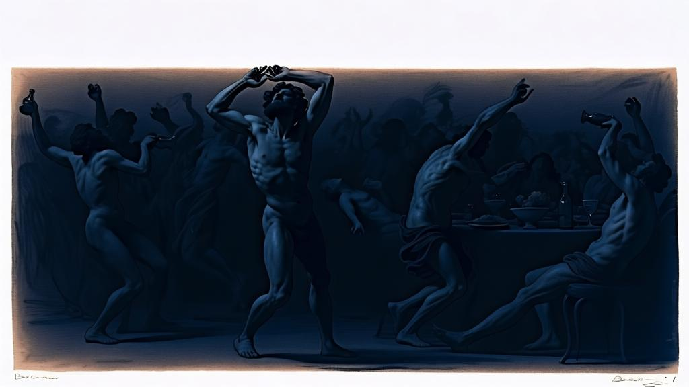

夜宴行吟

一

在佛罗伦萨的小山上在一座花园里面朝菲耶索莱我们在那一晚团聚梅纳克说（纳桑奈尔，现在是我在向你诉说）：

“安格尔，伊迪尔，狄提尔，你们不明白，也不可能明白，激情是如何焚毁了我的青春。时间的流逝让我心浮气躁。总是必须做出选择，这让我忍无可忍——对我来说，选择不是优中选精，而是放弃没有选中的一切。我满心恐惧地意识到，时光飞逝，就像白驹过隙；时间只有一个维度，而不像我所期望的那样是一片广袤的空间。时间只是一条线，我的种种欲望在这一条线上奔腾，难免彼此冲撞。我只能选择做一件事，如果做了这件事，我很快就会后悔没有去做另外那件事。所以我时常站在原地，什么都不敢做，不敢轻举妄动。我心中狂乱，不知所措，就这样一直张开双臂不敢放下，就怕仅能拥有一样东西而失去了其他的一切。这是我一生中最大的败笔。我无法进行任何持之以恒的研究，因为有太多无法舍弃的东西。不管是为了什么，这样的放弃都会付出昂贵的代价，我会失去很多，再多心灵鸡汤也无法排解我的忧伤。就好像走进繁华集市，手里却只有几个铜板可以支配（铜板也是拜他人所赐）。支配！选择就意味着放弃，永远放弃其他的一切；无论得到多少，失去的一切永远更多也更好。

“因此，我对世间任何形式的拥有都有所抵触，害怕从此再也不能拥有别的东西了。

“货物！食物！琳琅满目的新发现！你们毫无异议地献出自己供人享受！我知道，世上的资源正在枯竭（虽然还有取之不竭的替代品），我喝光了杯中水，轮到你时杯子就是空的，我的好兄弟（不过水源就在近旁）。但是你们呢，无形的思想啊！无拘无束的生活方式、科学、关于神的知识——真理的圣杯，永不干涸的圣杯，就算让我们所有人都喝个痛快也不会枯竭，永远有丰沛的清泉迎接干裂的嘴唇，可是为什么斤斤计较，不肯让我们畅饮杯中的甘露呢？现在我明白了——这伟大而神圣的泉眼中涌出的每一滴水都拥有同等的力量，最微小的一滴也能让我们心醉神迷，向我们揭示无处不在、无所不包的神的真容。然而，在那段疯狂的岁月里，有什么是我不想要的呢？我羡慕一切形式的生命，不管看到别人在做什么，我都希望自己也能去做同样的事。不是想证明自己做过，而是希望自己真正去做，明白吗？我并不害怕吃苦受累，反而认为苦和累是生活的教诲。有那么三周的时间，我嫉妒古希腊哲学家巴门尼德，就因为他学过土耳其语；两个月之后，羡慕的对象变成了西奥多修斯，因为他开创了天文学。就这样，我对自我的塑造一直非常模糊，只有最不清晰的轮廓，因为我一点儿也不愿意限制自己。”“梅纳克，和我们谈谈你的生活吧。”阿尔希德说。

于是梅纳克接着说：

“十八岁，我完成了最初的学业，然而无心工作，心里空落落的，萎靡不振，身体也觉得拘束。于是我动身上路，漫无目的地行走，以此实现心中流浪的愿望。我体验了你们所知道的一切：春天、泥土的气味、田间草地上盛开的繁花、清晨河面上的雾气和草场上的暮霭。我穿过一座座城市，不愿在任何地方停留。我想，在这世间没有任何牵挂，始终四处游荡，永远心向远方的人才是幸福的。我痛恨故乡，痛恨家庭，痛恨一切让人想要驻足休憩的地方；我厌恶持久的眷恋，厌恶爱情的忠贞，厌恶思想的执念，厌恶一切有损公平正义的事物。正如我常说的那样，我们应该时刻准备着用全部身心来迎接每一样新的事物。

“书本上的知识告诉我，任何形式的自由都是假象。所谓自由，只不过是为自己选择一种受奴役的方式，或者说选择一种自我奉献的形式罢了。人就像菊科植物的种子一样随风飘荡，寻找肥沃的土壤扎根落脚，只有安定下来才能开花。与此同时，我也在课堂上学过，理性思考并不能指相反意见，只要找到两者中的一个就能推翻另一个。有时候，在漫漫长路上，我只顾着思考种种驳论。

“我生活在永恒而甜美的等待中，等待随便哪一种未来。我明白了一点：面对快感的时候，永远是先产生对享受的渴望，然后才会有享受本身，就像在提问之前答案便已存在一样。我幸福，是因为每一眼泉水都会撩拨起我的渴望，在干旱的沙漠里，我反而要在烈日下暴晒，让无法平息的干渴变得更加炽烈。夜里，来到奇妙的绿洲，在整整一个白天的等待之后，那里会变得格外凉爽。在无垠的沙漠中，在太阳无情的炙烤下，我几乎要陷入无边的梦境，然而天气太热，滚烫的空气仿佛在微微颤动。生命不愿就这样入睡，我感受得到它的心跳，远在天边时只是虚弱的颤抖，在我脚下却成了充满爱意的搏动。

“每一天，在一寸一寸流逝的时光里，我唯一想做的事，就是简单直接地沉浸在大自然之中。我拥有一项罕见的天赋：不为琐事纠结。过去的记忆对我唯一的作用就是让我的生命变得完整，就像希腊神话中忒修斯手中的线团一样，神秘的丝线将他与逝去的爱情联结在一起，却并不妨碍他踏上新的征程。这根线后来也断了……破茧重生的感觉真是无与伦比的美好！清晨赶路时，我常觉得自己获得了全新的生命，美美地品味着新生感官的敏感与温柔。

“‘你有诗人的天赋，’我大声说，‘你注定要经历无数场遇见。’“我欢迎来自四面八方的一切际遇。我的心是十字路口的客栈，谁愿意进来都可以。我渐渐变得性情柔顺，友好可亲，我调动起所有感官，随时准备接受一切。我再也无法捕捉到任何一闪而过的情绪和反应，就这样，我不再认为有什么事情称得上是坏事，也不再对任何事情提出异议。而且我很快注意到，我对美的热爱和对丑的痛恨几乎毫不相干。

“我痛恨萎靡，我知道那来自无聊。我认为人应当重视事物的多样性。我可以在任何地方休息，我可以睡在田地里，也可以睡在平原上。我曾见过黎明掀起涌动的麦浪，乌鸦从山毛榉树林中飞起。清晨，我在草地上用露水洗脸，在初升的太阳下晒干被露水打湿的衣衫。有一天，我看见人们赶着牛车，唱着庆祝大丰收的歌谣满载而归。再也没有比这更美好的田园景象了！

“曾经有一段日子，我心中无比快乐，真希望能和什么人聊一聊，让别人知道是什么让我如此快乐。

“入夜时分，我来到陌生的村庄，看着白天各自忙碌的人们回家团聚。父亲累了一天回到家里，孩子们放学归来。房门半开，透出一线温馨的光影，屋内传出欢声笑语，将黑夜关在门外。一切漂泊的事物都不得入内，只能待在屋外萧瑟的风中。家庭啊，我恨你！封闭的炉灶，紧锁的宅门，唯恐分享幸福的占有！有时候，我靠在玻璃窗边，隐没在黑夜里，久久地凝望着一家人的日常生活。父亲坐在灯下，母亲在做针线活，祖父的位置空着，孩子待在父亲身边学习——我心中涌起强烈的渴望，想要带那个孩子和我一起去闯荡。

“第二天，我又看见那孩子放学归来；第三天，我和他说了话；第四天，他抛下一切跟我上路。我让他开了眼界，看见了原野是多么的光彩夺目。他也意识到原野正敞开怀抱等待着他的到来。在我的教的心。接着，我又教会他摆脱我的束缚，去经历他自己的孤独。

“我独自一人，品尝着骄傲的狂喜。我喜欢在拂晓前醒来，在茅草屋顶呼唤太阳，云雀的歌声装点了我的幻梦，朝露就是我清晨梳洗的甘露。那时我热衷于节食，几乎不吃什么，头脑轻飘飘的，对一切事物的感知都带着醉意。我曾喝过许多酒，但我知道没有任何一种酒能像断食那样令人头晕目眩。一大清早我就觉得天旋地转，太阳还没有升起，我又在干草垛里睡了过去。

“我随身带着干粮，有时饿得快要晕过去了才想起来吃一点。这样做让我可以更加自然地感受天地万物，大自然也更能浸透我的身心。外界的事物纷涌而来，我敞开所有的感官迎接它们。一切事物都是我心中的贵客。

“终于，我的灵魂充满了诗意，是孤独让这诗意更加激情澎湃，让我在每一天结束时都疲惫不堪。

“出于自尊和傲气，我一直保持着这种状态，我想起了伊莱尔的话，他在一年前就指出，我这样的幸福生活未免太过离群索居。我常在日暮时分与他闲谈。他也是诗人，对万物之和谐了然于心。在我们看来，每一种自然现象都是一种直白的语言，我们能读出其中的深意。我们学着通过飞行的姿态去辨认昆虫，根据鸟鸣声判断鸟雀的品种，从女人在沙滩上留下的脚印去揣测她们的美貌。他对冒险也有着强烈的渴望，这种渴望吞噬了他，强大的力量让他无所畏惧。心灵的青春期啊，什么样的荣耀都配不上你！我们兴高采烈，对一切都满怀憧憬，我们试图让欲望消停下来，但任何努力似乎都无济于事。每一个念头都是燃烧的热望，我们感知到的每一种事物都散发着辛辣刺鼻的气味。

我们挥霍着璀璨的青春，等待着美好的未来。我们在通向未来的道路上大踏步前进，咀嚼着随手从树篱上采撷的花朵，嘴里弥漫着花蜜的甘甜和花瓣清冽的苦味，这样的道路永远都不会显得太过漫长。

“有时候，当我又经过巴黎时，会抽出几天或者几小时回到当年的寓所，我在那里度过了学而不倦的童年。那里的一切都是寂静的。没有女人的打理，衣物随意散落在家具上。我举着灯在房间里穿行，没有打开已经尘封多年的百叶窗，也没有拉开满是樟脑气味的窗帘。空气凝滞沉闷，弥漫着令人不悦的气味。只有我的卧室还可以住人。整套寓所里最昏暗沉寂的房间是藏书室，书架和书桌上的书籍还原封不动地留在我当年摆放的位置上。有那么几次，我翻开其中几本书，借着灯光读了起来——大白天也要点灯——愉快地忘记了时间；还有几次，我打开钢琴，在记忆深处搜寻往日的曲调，却只能零零碎碎地想起某些片段，竟触动情肠，只好就此罢手。第二天，我已身在距离巴黎很远的地方。

“我有一颗天生多情的心，它像液体一样随处流泻。我觉得任何一种快乐都不是专属于我的，我愿邀请遇到的每一个人与我共享。当只有我一个人享受某种快乐的时候，就只剩下了过分的自傲。

“有人指责我自私，但我却要指责他们愚蠢。我立志不会爱上任何人，无论男人还是女人，但我深爱着感情、友情和爱情。当我对某一个人付出真情时，我不愿因此放弃对其他人所怀有的情感，我只想让自己经历每一次因缘际会，不愿意独占任何人的肉体或心灵。我是徜徉在天地间的流浪者，不会在任何地方停留。任何偏爱在我眼中都是不公平的，我想保留一切可能，我不会把自己献给任何一个人。

“我对每一座城市的记忆，都与一次纵情声色的经历紧密相连。在威尼斯，我参加了假面舞会，中提琴和长笛为游船伴奏，我在船里尝到了爱情的滋味。那条船后面还跟着其他小船，满载年轻女子和各色男人。我们去利多岛上等待日出，然而太阳升起的时候，音乐声已经停息，我们也在疲惫中睡去。但就连虚浮的欢乐留下的疲倦和苏醒时让人感到意兴阑珊的眩晕，都令我满心欢喜。我乘着大海船来到别的港口，与水手一起上岸，走进灯光昏暗的小巷，然而又自责不该有这样的欲望，不该去体验那独一无二的诱惑。于是，我在那些下等的小酒馆附近与水手们分道扬镳，又绕回到宁静的港口。夜色寂寥无声，恍惚间仿佛能听到小巷里传来的喧嚣，奇异而凄恻。我还是更喜欢田野间的珍宝。

“二十五岁那年，我突然明白，或者说我终于说服了自己——我已经足够成熟，可以开始一种全新的生活了。不是因为对旅途感到厌倦，而是因为我的傲气在这种漂泊生活中不受控制地在增长，这实在让我痛苦不堪。

“‘为什么？’我对人们说，‘你们为什么还要劝我去旅行？路边的花儿又开了，这我当然知道，可是那些花儿现在等待的是你们啊。蜜蜂只会在某一段时间里外出采蜜，之后便要专心酿蜜了。’我又回到了被遗弃的寓所，收拾起散落在桌椅上的衣物，打开窗户冥想。尽管一直四处漂泊，但我还是设法存下了一笔钱，我用这笔钱给自己添置了各种珍奇精巧的物件，比如花瓶和珍本书籍，尤其利用自己在绘画方面的知识，以极低的价格买下了许多画作。在那十五年里，我像个吝啬鬼一样积攒各种东西，竭尽所能地充实自己，不断学习。我学会了好几种古老的语言，可以阅读各种书籍，还学会了好几种乐器；每一天的每一个小时都花在了卓有成效的研究上；我对历史和生物尤其感兴趣，也很懂文学。我结交了许多朋友，我高贵的心灵和出身让我无法拒绝人们的友谊。友谊对于我比其他一切都更加珍贵，但我也并不过分依赖人们的友情。

“五十岁那年，时机到了，我卖掉了所有的东西。凭着我可靠的品味和对每件物品的了解，每一样东西都卖出了好价钱，短短两天之内我就变现了一大笔钱。我把这笔钱全部存了起来，以保障此后的开销。我把所有的东西都卖了，不想留下任何属于我的物品，不要一星半点关于它们的记忆。

“我对陪我在乡间散步的米提尔说：‘看这迷人的清晨、晨雾、光明、清新的空气和你脉搏的跳动，关于这一切，如果你懂得完全投入其中的话，你会感受到更加强烈的快乐。你以为自己身在其中，但其实你生命中最美好的一部分已经被束缚住了，它被你的妻子、儿女、书籍和学业占据了，它原本属于神，却被夺走了。就在此刻这一瞬间，你觉得你能强烈地、完全地、直接地体会生命的感动，同时又不忘记生命之外的事物吗？思想的惯性束缚了你，你活在过去，活在未来，却无法凭借本能感受到任何事物。

米提尔，我们什么都不是，只是生命的瞬间，所有的过往都已经死去，所有的未来都还没有开始。瞬间啊！米提尔，你明不明白瞬间是一种多么强大的存在？我们生命中的每个瞬间都是不可替代的，希望你能明白，人有时候就应该专注于眼下的瞬间。此时此刻，米提尔，如果你愿意，请不要再牵挂妻子儿女，你在人间将独自面对神明。但你仍然记得他们，你始终背负着你害怕失去的一切——你的全部过往，你的所有爱恋，你在这人间所在意的一切。至于我，我的爱无时无刻不在等待着我，准备给我新的惊喜，我始终都了解它，但从未认出过它。米提尔，不要怀疑，神会以各种形式出现。太过关注其中的任何一种形式，甚至迷恋上这种形式，都会让你闭目塞听。你的专一让我难过，我希望你的感情能更加分散一些。在你关上的每一扇门背后，都有神的存在。所有的神都值得珍爱，神的力量有无数种表现形式。’“我的收藏变现之后，我租了一艘船，带着三位友人、一组船员和四名学徒水手出海了。我迷上了其中最不英俊的那一个。不过，尽管他的爱抚极尽温柔，我还是更喜欢静静地凝望波涛汹涌的大海。我们在夜色中驶入美丽的港口，有时一整夜都在纵情欢爱，然后在黎明前离开。在威尼斯，我结识了一位貌美无双的交际花，跟她共度了三个夜晚。她是那么美，在她身边，我忘记了其他所有的鱼水之欢。我将自己的船献给了她。

“我在科莫湖畔的一座府邸住了几个月，那里是风度翩翩的音乐家的荟萃之地，还有许多行事低调又能说会道的漂亮女人。我们在夜里闲谈，音乐家们为我们演奏迷人的乐曲。随后，我们走下大理石台阶，最低处的几级台阶已经浸没在水中。我们登上摇曳的游船，在恬静的船桨声中纵情欢爱。有时在归途中仍然睡意昏沉，直到小船靠岸的那一下才猛然惊醒，依偎在我怀中的伊多娜悄然起身，静静地踏上石阶……

“一年之后，我在旺代省，住在一座大宅园里，距离河滩不远。三位诗人与我同住，他们歌颂我的盛情款待，也吟唱有鱼有树的池塘、椴树成荫的道路、孤独的橡树、群生的白蜡以及整座公园的美好布局。秋天来临时，我让人砍倒所有的大树，刻意为住处营造出一派荒凉景象。宅园面目全非，我们一行数人走在荒草蔓生的道路上，谁也认不出它原来的样子。走到哪里都能听到砍伐树木的斧声，横亘在路中间的树枝时常会挂住衣袍。倾倒的树木展现出浓浓秋意，着实美不胜收。如此美轮美奂的景象在我脑海中久久停驻，即使过了很长时间，我都还记得这一幅画面，并从中看到了自己的晚年。

“后来，我在上阿尔卑斯省的一间山地木屋住了一段时间；然后我去了马耳他，先是住在白色宫殿，后来搬到了老城区芬芳的树林边，那里的柠檬像柑橘一样又酸又甜；

之后，在达尔马提亚（克罗地亚）我住过四轮敞篷马车；今夜，在这座花园里，在正对着菲耶索莱的佛罗伦萨山岗上，我们欢聚一堂。

“不要再对我说，我的幸福纯属机缘巧合。命运诚然为我提供了许多机遇，但我并没有加以利用。不要以为我的幸福是靠财富实现的，我的心在人世间没有任何牵挂，这颗心一贫如洗，随时可以坦然赴死。我的幸福来自激越的热情。我疯狂地热爱一切，对所有事物都一视同仁。”

二

我们从旋梯登上壮观的平台，居高临下，俯瞰全城。平台仿佛一艘巨大的舰船，停泊在茂密的树海，有时仿佛要起航驶向市区。这个夏天，我时常登上这座幻想中的舰船，站在最高处的甲板上，远离街道的喧嚣，品味夜色中让人沉入冥想的宁静。当我登上高处，喧哗声若隐若现，那些喧闹好像海浪拍打的涛声，此起彼伏，前赴后继，浪头拍打着墙壁。我继续向上走，登上浪潮够不到的高处。在平台的最顶端，再也听不到喧哗与骚动，树叶簌簌作响，黑夜热切呼唤着我。

碧绿的橡树和高大的月桂整齐地排列在林荫道的两侧，与平台一起延伸到天边。

平台边缘有几根圆形栏杆悬空伸出去，仿佛是悬在蔚蓝天空下的阳台。我在栏杆边坐下，陶醉在遐想中，以为自己正在扬帆破浪，御风而行。在城市的另一端，深暗的山岗上方，天空是金色的。纤细的树枝从我所在的阳台伸向辉煌的落日，几乎没有树叶的细枝迫不及待地伸进夜色。城市里仿佛腾起一阵烟雾，那是落日余晖下的尘埃在广场的光影交织中浮动。有时候，不知从哪里腾起一团焰火，在这令人迷醉的炎热夜晚，仿佛一声呐喊划破夜空，急速颤抖着划出一个圈，呼啸着绽放出神秘的烟花，繁华散尽后又从高空坠下。我喜欢看焰火，尤其是浅金色的那一种，火星儿缓慢地，漫不经心地洒落开来，如梦似幻，让人以为满天繁星也是骤然绽放的绚丽烟花，甚至会因为星星一直挂在天上没有熄灭而吃惊……要过一阵子，人们才慢慢辨认出每一颗星星所在的星座，这样的体验延长了心醉神迷的状态。

约瑟夫说：“机缘巧合的事件支配着我，我是身不由己。”梅纳克说：“那就这样吧！我更愿意这样想：一件东西如果不存在，那说明它本来就不应该存在。”

三

今夜，他们为果实而歌唱。梅纳克、阿尔希德等人都聚在一起，伊拉斯唱起歌谣。

石榴之歌三颗石榴子足以让人想起冥后[1]的故事你还要花费很长时间，去寻找不可得的灵魂的幸福。

肉体的快乐，感官的快乐，谁愿意谴责就谴责好了。

肉体和感官的凄恻快乐啊，让别人去谴责吧——我可不敢。

热忱的哲人迪迪埃，我真心敬佩你，信仰让你获得精神上的快乐，任何其他乐趣都无法与之媲美。

然而不是所有人都拥有这样的热情。

当然，我也同样深爱，灵魂深处的致命震颤，心灵的快乐，精神的快乐。

但是今夜，我只为快感放歌。

肉体的快乐，像草地一样温存，像树篱上的鲜花一样令人难以抗拒，像原野上的牧草，在顷刻间萎谢或被收割，像绣线菊哀婉的花朵，轻轻一碰便颓然溃散。

视觉——最让我们烦恼的感官，一切无法触碰的事物都让我们心伤。

心灵可以轻松捕捉到思想，双手却抓不住眼睛渴求的目标。

纳桑奈尔，但愿你渴望的都是你能触及的事物，不要试图追求更完美的占有。

我能感受到的最甜美的快乐，就是已经得到满足的欲望。

朝阳下笼罩草地的晨雾无比美妙，阳光无比美妙，赤脚踩在潮湿的土地上，感觉无比美妙。

在海边看浪花打湿沙滩，在清泉水中游泳嬉戏，在阴影中亲吻陌生的嘴唇，都无比美妙。

但是关于果实——那些果实——纳桑奈尔，我该怎样向你诉说？

唉！你还未曾品尝过那些果实的滋味，纳桑奈尔，正是这一点令我悲伤。

那些果实口感细腻，甘美多汁，像血淋淋的鲜肉一样可口，像滴落的鲜血一样殷红。

享用那些果实并不需要特别的饥渴，它们盛在金丝编织的果篮里端上来，咬下第一口，除了苦味儿，平淡得几乎让人反胃；

人世间的任何水果都无法比拟，有点像熟过了头的番石榴。

果肉成熟得过了头，在口腔里留下生涩的苦味，再吃一个才能去除这股苦涩。

唯一能带来些许享受的，是吮吸汁水的瞬间，之前平庸的乏味有多令人反感，这瞬间的快感就有多享受，让人飘飘欲仙。

金丝果篮很快见底，只剩下最后一个；

我们把它留在那里，不忍心分而食之。

唉！纳桑奈尔，谁会想到，它会让我们的嘴唇这样苦热难熬；

喝多少水都无济于事，对果实的欲望啮噬着我们的心灵。

整整三天，我们在集市上寻觅，可是季节已经过去。

纳桑奈尔，在我们的旅途中，哪里还能再找到能撩起欲望的果实？

*

有些水果可以坐在露台上享用，面朝大海，在夕阳余晖里享用；

有些水果可以点缀在冰淇淋里，用糖浸透，浇上甜酒，重重高墙内，私家花园里种着果树；

有些果实刚刚从树上采下，我们就在夏日的浓荫里吃掉这些果实。

我们摆开一张张小桌，摇晃树枝，果实纷纷落下，惊起昏昏欲睡的果蝇。

我们捡起掉落的果实，装进大碗里，香气扑鼻，让我们心醉神迷。

有些果实的果皮会给嘴唇染色，只有口渴难耐才会去吃；

我们在沙石路边发现的果子，果实透过枝叶闪闪发亮；

多刺的树叶刺伤了摘果子的手，这果子吃下去也并不怎么解渴。

有些果实可以做成蜜饯，只需要在阳光下晒干就可以；

有些经过一个冬天仍然酸涩，咬上一口，一直酸到牙根；

有些果实即使在盛夏也永远冰凉，我们在小酒馆里品尝，蹲在草席上分享。

有些果实再也找不到了，想一想都让人渴望。

*

纳桑奈尔，我和你说说石榴好吗？

在东方的市集上只卖几个铜板，堆在芦苇席上的石榴突然滚落，眼看着就滚进了尘埃里；

裸身的孩子跟在后面追赶，石榴的汁液略有酸味，像尚未熟透的覆盆子；

石榴的花朵仿佛是蜡做的，花儿和果实是一样的颜色，被守护的珍宝，蜂窝状的隔层，五角形的结构，风味十足。

果皮裂开，石榴籽掉出来，血红的果粒落进碧蓝的高脚杯里，金色的汁液，滴在珐琅彩的铜盘中。

现在来为无花果歌唱吧，希米安娜，为了无花果深藏心中的爱情。

让我为无花果歌唱吧，她说。

无花果美好的爱情深藏于心，它的花朵开放得隐秘，在紧闭的花室中喜结连理；

一丝香气也不肯释放，一丝芬芳都没有散逸，全都变成了多汁甜美的果实；

花朵其貌不扬，果实妙不可言，果实就是成熟的花朵。

我已为无花果歌唱，她说，现在请为所有的花朵歌唱。

当然，伊拉斯应声说，我们还没有唱遍所有的花朵呢。

这就是诗人的天赋——为微不足道的小事动容。

（对我而言，花朵只不过预示着果实而已）

你还没有提到李子呢，树篱间的黑刺李，经过一场雪，由酸变甜。

欧洲山楂的颜色像枯叶的栗子，只有熟到烂掉才能吃，要在火边烤裂了才能吃。

我还记得有一天，顶着皑皑白雪在山上采到了欧洲越橘。

我不喜欢雪，洛泰尔说，这东西太过神秘，人世间完全容不下它。我讨厌大地一片白茫茫的景象。雪那么冷，把生命拒于千里之外。我知道，白雪覆盖大地，是在保护生命，但生命只有等冰雪消融之后才能露出头来。我倒愿意看到白雪变得脏兮兮，渐渐融化，很快就会变成植物需要的水分。

别这么说，雪也可以很美丽，尤里奇说。只有当过分的爱情将它融化时，雪才是悲伤痛苦的；你太渴望爱情，所以希望看到雪融。雪在傲视一切的时候才是最美的。

别说这个啦，伊拉斯说。当我说“真不错”的时候，你可别说“那就算了吧”。

*

今夜，我们每一个人都唱起歌谣。莫利贝开始歌唱：

著名的情人苏莱伊卡！为了你，我不再喝酒了，不再要司酒官为我斟酒。

为了您，格拉纳达的布阿卜迪勒[2]，我为殿下灌溉赫内拉利菲宫的夹竹桃。

巴尔基[3]，你从南方来，让我猜谜语，我便成了苏莱曼[4]。

他玛[5]，我是你的兄弟暗嫩，因为无法拥有你而黯然销魂。

我追着金色的鸽子，攀上宫殿高处的露台，从那儿我看见你正要入浴，拔示巴[6]，看着你裸身走进浴池，我便成了大卫王，我将杀死你的丈夫，只为得到你。

我曾为你而歌唱，书拉密女，那些歌谣被人们当作信徒的圣歌。

弗娜芮纳[7]，我在你怀中，因为爱情而欢叫。

左贝伊德[8]，我就是那天早上你在通向广场的路上遇见的奴隶，我头顶着空空如也的篮筐跟在你身后，你往篮子里装满了香橼、柠檬、黄瓜，还有各种各样的香料和甜食。我很讨你喜欢。你听见我说累，便留我过夜，陪伴你的两位姐妹和三位王子。我们轮流讲故事给大家听。轮到我的时候，我说：“左贝伊德，在遇见你之前，我的生命中没有任何可说的故事；现在我还有什么别的故事可说呢？你不就是我的全部生命吗？”我记得小时候，做梦都想吃《一千零一夜》里经常提到的蜜饯。后来，我吃到过一种加了玫瑰精油的蜜饯。听一位朋友说，荔枝也可以做成蜜饯。

阿里阿德涅，我是忒修斯[9]，从你生命里经过，又将你丢给酒神，然后继续走我的路。

欧律狄刻，我的爱人，我是你的俄耳甫斯[10]，你跟在我身后，让我牵肠挂肚，然而只是一回眸，便将你离弃在地府。

然后莫普絮斯开始歌唱：

不动产之歌河水开始上涨的时候，有人逃向高高的山岗，有人心想：淤泥可以肥田；

有人心想：一切都毁了；

有人什么也没想。

河水泛滥的时候，有的地方还能看见树梢，有的地方还能看见房顶、钟楼和墙壁，还有远处的山丘，有的地方，已经什么都看不见了。

有的农民将牲畜赶上山头，有的拖家带口登上小船，有的随身带着金银细软，带着食物、债券和所有值钱的东西，有些什么都没有带。

那些仓皇乘船逃离的人啊，醒来时已经到了完全陌生的土地。

船已经抵达美洲，有的到了中国，有的到了秘鲁，有的再也没有醒来。

然后，古兹曼开始歌唱，我只记下了最后一段：

疾病之歌在杜姆亚特，我得了热病，在新加坡，我全身长出白色和紫色的疱疹，在火地岛，我所有的牙齿都脱落了，在刚果，凯门鳄咬掉了我的一只脚，在印度，我得了抑郁症，全身皮肤发绿，变得透明，眼睛大了一圈，显得无比忧郁。

我生活在一座光明普照的城池，每一夜都有形形色色的罪恶上演。在距离港口不远的水面上，苦役犯服刑的海船永远漂在那里，永远凑不齐足够的人手。一天早晨，我登上其中一艘扬帆起航，城里的执政官为我调派了四十名桨手。我们航行了整整四天三夜，桨手们为我耗尽了最后一丝力气。他们不停地划桨，对抗无尽的海浪，这单调又累人的活计消磨了他们的精力；他们看起来更英俊了，喜欢沉浸在自己的思绪里，他们对过去的记忆消失在茫茫大海。入夜时分，我们驶进一座运河交错的城市，一座金光闪闪或者灰蒙蒙的城市，如果是座阴霾的城市，我们就叫它阿姆斯特丹；如果是座金色的城市，我们就叫它威尼斯。

四

夜里，在菲耶索莱山脚下的花园里，光线强烈的白日已经结束，但天色还没有黑下来，西米安娜、狄提尔、梅纳克、纳桑奈尔、伊莱娜、阿尔希德和其他一些人聚在一起。这座花园位于佛罗伦萨和菲耶索莱之间，在薄伽丘的时代，庞菲勒和菲亚梅塔[11]就开始在这里放声歌唱了。

天不再那么热了，我们在露台上随便吃了些点心，然后走下林荫道散步，歌唱。

我们在月桂和橡树下闲逛，尽情舒展身体，躺在清泉边的草地上，在橡树的荫蔽里好好休息，从白日的疲累中恢复过来。

我经过人群，只听见只言片语，都关于爱情。

艾力法斯说：“所有快感都是好的，都值得体验一番。”提布尔说：“但不是所有人要享受全部的快感，要懂得取舍。”更远处，泰朗斯正在向菲德尔和巴希尔讲述：

“我曾爱过一个卡比尔少女，她皮肤黝黑，身体刚刚发育成熟，简直完美。在缠绵悱恻、意乱情迷的欢爱中，她始终保持着一份令人困惑的庄重。她是我白天的烦恼，夜里的快乐。”西米安娜对伊拉斯说：

“那是一种经常要求别人把自己吃掉的小果子。”伊拉斯唱道：

“我们有过几次小小的艳遇，就像路边采摘的果实，酸得人龇牙咧嘴，真希望它们有更甜蜜的滋味。”我们在泉水边的草地上坐了下来。夜莺的歌声在我身边响起，让我出神了好一阵子，没有注意大家在说什么。等我回过神来，听见伊拉斯在说：

“我的每一种感官都有自己的欲望。当我直面自己的内心时，我发现心中的男女仆人都已入席，没有给我留下半点位置。主位已经被终极的欲望占据了，其他欲望也竞相争夺那个好位置。席间争得不可开交，但它们对付起我来倒是团结一致。当我想要靠近餐桌的时候，所有欲望都站起身来，醉醺醺地和我叫板。它们把我从自己的地盘赶了出去，把我拖到外面。我只好出去，给我的欲望采集葡萄。

“欲望啊！美好的欲望，我会给你们带来碾碎的葡萄，我将再次斟满你们硕大的酒杯，但是请让我回到自己的居所吧——让我在你们醉醺醺睡去的时候，再次给自己戴上紫藤萝和常春藤编织的花冠，用这冠冕来遮掩我额前的愁容吧。”我也醉了，再也听不清他们在说什么。有时，一旦鸟儿沉默下来，夜晚就变得寂静无声，好像只有我独自一人在凝望夜色。有时，仿佛能听到四面八方涌起无数细碎的声音，与我们这群人的交谈混在一起：

我们也一样，我们也一样啊，我们也经历过灵魂的愁云惨雾。

种种欲望纠缠，让我们无法安心做事。

这个夏天，我所有的欲望都干渴难耐，仿佛刚刚穿越了整片沙漠。

但我拒绝为它们解渴，因为我知道，喝多了对它们并不好。

（有的葡萄在遗忘中沉睡；有的葡萄上有蜜蜂在采蜜；有的葡萄仿佛留住了阳光。）

某一种欲望，夜夜坐在我的床头，清晨一睁眼就看到它在那里，它彻夜守护我，直到天明。

我走了很远的路，想要让欲望止息，然而却只是累坏了自己的身体。

此刻，克利奥达丽斯开始歌唱：

我的所有欲望我不知道昨夜做了什么梦，一醒来就感到欲望的饥渴，仿佛在我睡着的时候，欲望穿越了整片沙漠。

在欲望与烦恼之间，徘徊不定的是焦虑。

欲望啊！难道你们永远不会消停吗？

啊！一阵小小的快感来临！

但也很快就会逝去！

可惜可叹啊，我懂得怎样延长自己的痛苦，却不知道如何将快感留住。

在欲望与烦恼之间，徘徊不定的是焦虑，人性充斥着疾病，在床上翻来覆去想要入睡，想要休息，却睡意全无。

我们的欲望穿越了许多个世界，永远不会感到满足。

在对休息的渴望和快感的渴望之间，整个大自然都在痛苦辗转。

在空荡荡的公寓里，我们绝望地呼喊。

我们登上高塔，看见的却只有黑夜。

沿着干涸的陡峭河岸，我们像野狗一样哀嚎。

在奥雷斯山，我们像狮子一样怒吼，我们像骆驼一样，咀嚼盐湖里的灰藻，吮吸空心茎秆里的汁液。

因为沙漠里极度缺水。

我们像燕鸥一样，飞越无处觅食的宽阔海洋。

我们像蝗虫一样，为了填饱肚子摧毁一切。

我们像海藻一样，在暴雨中随波漂荡。

我们像柳絮一样，被风卷起，漫天飞扬。

啊，我真希望平静地死去，可以永远安息。希望我的欲望最终油尽灯枯，再也无法转世轮回。欲望啊！我拖着你和我一起上路，让你在田野间饱受折磨，在大城市里晕头转向，我灌醉了你，却没有让你解渴；我让你沐浴在清朗的月光里，带着你四处闲逛，在海浪的摇篮上轻轻地摇晃着你，想让你在涛声中睡去……欲望啊！欲望！我拿你有什么办法？你到底想怎么样？难道你真的永远不会消停吗？

月亮从橡树的枝叶间升起，与往常一样，千篇一律，但也和平时一样美。大家还在三五成群地聊着天，我只能听见断断续续的话语。他们每一个人好像都在谈论爱情，完全不在意是否真的有人在听。

后来，谈话声渐渐稀落下来，月亮又消失在更茂密的橡树林中。大家一个挨一个躺在树叶堆里，最后几个男男女女还在说个不停，根本不知道他们在说什么，只觉得那些低语好像和青苔上流水的窃窃私语混在一起，在我们的耳畔浮动。

西米安娜站起身来，用常春藤编了一个花冠。我嗅到了新摘下的树叶的清香。伊莱娜解开发辫，秀发垂落在裙袍上。拉谢尔起身采了些潮湿的青苔，敷在眼睛上，准备睡觉了。

月亮的清辉也消失不见。我舒展四肢躺在地上，心醉神迷，恍惚间甚至有些感伤。我没有和大家谈起爱情。我等待着天亮后再次出发，走上随便哪一条路。我已神思倦怠，早就睡意昏沉。睡了几个小时，拂晓时分，我又上路了。

[1]冥后，珀尔塞福涅，希腊神话中农神的女儿。她被冥王带到冥界，因为吃了冥界的石榴而无法返回凡间，石榴因此而成为冥后的象征。

[2]布阿卜迪勒，格拉纳达的最后一任摩尔国王。

[3]《古兰经》之后，阿拉伯作家称塞伯伊国的王后为巴尔基。

[4]苏莱曼一世，奥斯曼帝国苏丹（国王）。

[5]他玛和暗嫩：《圣经》中的一对兄妹。哥哥暗嫩爱上了妹妹他玛，忧思成疾。

[6]拔示巴和大卫王：《圣经》中的人物。拔示巴，以色列国王大卫下属的妻子。大卫王爱上了拔示巴，杀死了她的丈夫。

[7]弗娜芮纳，意大利画家拉斐尔的爱人。

[8]左贝伊德，《一千零一夜》中的人物。

[9]阿里阿德涅和忒修斯：希腊神话中的一对情侣。

[10]欧律狄刻和俄耳甫斯：希腊神话中的一对情侣。

[11]庞菲勒和菲亚梅塔：意大利人文主义作家薄伽丘代表作《十日谈》中的一对情侣。
