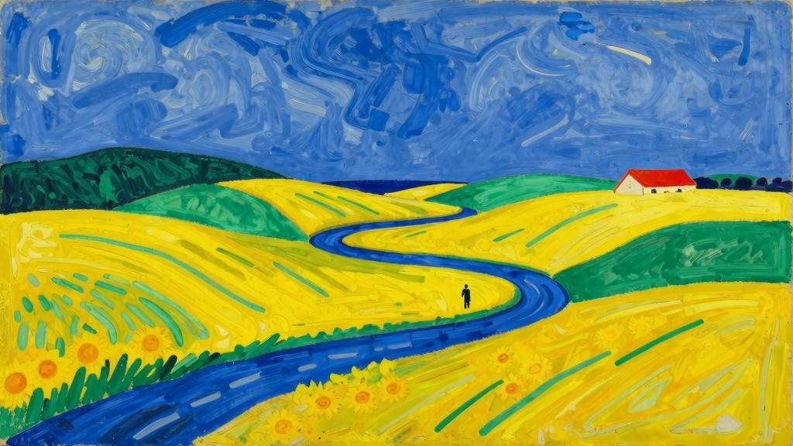
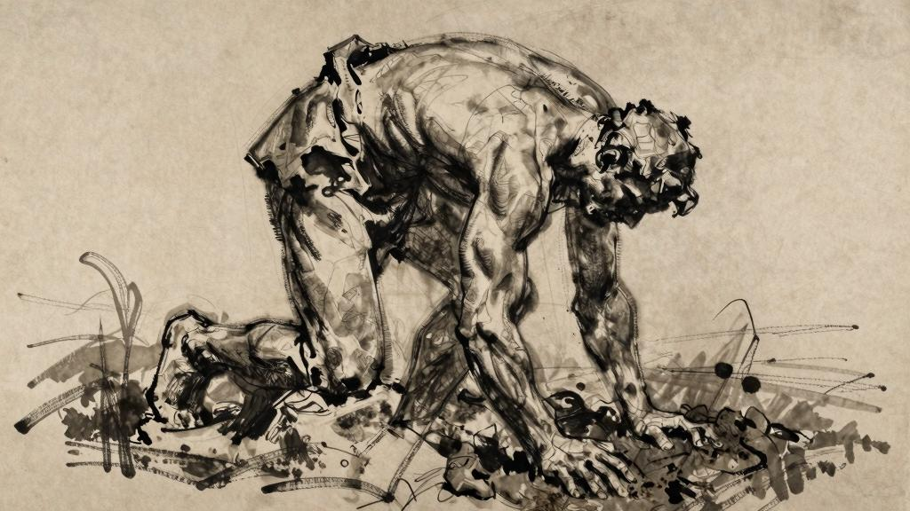

人间大地

一

诺曼底多雨的土地，已被驯化的乡野……

你说：“我们将在春天占有彼此。在某片我熟悉的树丛里，在某个长满青苔的隐秘处所，在一天中的某个时刻，空气中有馥郁的香气，去年歌唱的鸟儿又唱起婉转的歌谣。”今年的春天来得格外晚，春寒料峭，倒也是格调不同的乐趣。

长夏让人无精打采，萎靡不振，而你还在等待那个不会再来的女子。你说：“等到秋天就好了，秋天会补偿这一切，秋天会排解我的忧愁。我想她大概是不会来了，但树林里的叶子还是会变红的。在天气温和的日子里，我坐在池塘边，去年那儿落下了许多枯叶。我就坐在那里，等着夜幕降临……有时候，我在日暮时分顺着山坡走下去，一直到林地边缘，那儿还能看到最后一缕夕阳。但是今年秋天雨水格外多，树木朽烂，看不出几分秋色。池塘里的水溢出来，也无法去岸边闲坐。”

*

这一年，我在田地里忙个不停。看着人们劳动和收获，眼见着秋日一天天过去。

这一季与往年不同，温暖湿润，阴雨连绵。九月末的一天，一场可怕的狂风呼啸了整整十二个小时，将所有树冠的一侧刮得干干净净。没过多久，所剩无几的树叶被染成了金色。我的生活远离人群，在我看来，这件小事和任何大事件一样重要，值得一提。

*

日子叠着日子。白天与夜晚更替。

有些早晨，我在黎明前醒来，头脑滞重昏沉。秋天的朦胧清晨啊！灵魂还没歇够就醒来了，刚刚过去的焦灼的夜晚让它疲惫不堪。我只想再睡过去，尝一尝死亡的滋味。明天，我将离开这萧瑟的田园，草地上已经覆满寒霜。野狗在地里埋下面包和骨头，我和它们一样，知道该去哪里寻找不为人知的快乐。我知道，在溪流转弯处的洼地，还能感受到一丝暖风；在木栅栏外面，有一棵叶子还未落尽的金色椴树；在路上碰到铁匠的小儿子去上学，可以对他笑一笑，摸摸他的脑袋；远处传来浓重的落叶的气味；在茅屋边见到一个女人，可以对她微笑，亲吻她身边的孩子；秋日里，铁匠锻铁的声音传得很远很远……

“就这些了吗？”“嗨，还是让我们入睡吧！”“这些根本不算什么。”“我也已经厌倦了期待……”

*

在秋日的熹微晨光里出发，实在是糟糕透顶。灵魂和身体都在战栗。在眩晕中找寻着还能带走的东西。“梅纳克，动身出发这件事，究竟有哪一点让你如此迷恋？”他答道：“感觉像临死之前。”当然，我不是在找寻别的什么东西，只是在看自己丢下的并非不可或缺的一切。

啊！纳桑奈尔，我们还能丢掉多少东西啊！灵魂永远都不可能彻底抛下一切，让自己成为空荡荡的容器来盛放爱意。爱、期待和希望，才是我们唯一的财富。

啊！所有那些我们可能会去生活的远方！都是幸福自由生长的地方！

辛勤劳动的农场，数不尽的农活，劳累，无比安宁的睡眠……

走吧！去往随便什么地方！

二

公共马车上的旅行我丢下了在城里穿的衣服，那身衣服太过庄重。

*

他坐在我身旁，紧挨着我。我感觉着他的心跳，觉得这是一个鲜活的生命。他小小身体的温度炙烤着我。他靠在我肩上睡着了，我听见他的呼吸，温热的气息让我心神不宁，但我不敢动，生怕惊醒了他。他小巧的脑袋随着马车的颠簸不停摇晃，车颠得厉害，我们紧紧挤在一起。其他人也睡了，用睡眠打发漫漫长夜。

诚然，我经历过爱情，还有许多别的感情。但是对于当时的那种温柔的情感，我却不知道该说些什么。

诚然，我经历过爱情。

为了体验一切游荡的事物，我也成了四处游荡的人。我对所有不知该去何处取暖的人都满怀柔情，也热情地眷恋着所有浪迹天涯的人。

我还记得四年前，在一座小城度过了一个黄昏，现在我又来到了这座城市。那时和现在一样，也是秋天，同样也是星期天之外的某一天，最热的时辰已经过去了。

我记得自己那时也和现在一样在街上闲逛，一直走到城市边缘。那里有一座花园，从露台上可以俯瞰这块美丽的土地。

我走着和当时同样的路，认出了所有的景物。

我走过当年的足迹，重温着旧日的情绪……这里有一条石凳，我曾在上面坐过。

“就是这儿。”“我曾坐在这里读书。”“什么书？”“啊，维吉尔[1]的书。”“我曾听见洗衣女工捶打衣服的声音。”“现在也能听见。”“那天天气很好。”“就像今天一样。”孩子们放学了，我记得那天也是。街上人来人往，也和当时一样。那天是在太阳落山的时候，现在恰好也是傍晚。白日里的欢歌就要止息……

就是这样。

安吉尔说：“但是这些还不够写成诗啊……”我答道：“那就别管它啦。”

*

我们曾在天亮之前匆匆起身。

驿站的马车夫在院子里给马儿套上鞍辔。

一桶桶清水冲洗路面。不远处传来压水泵的声响。

思虑太过，无法入睡，早晨起来头脑昏沉。又要离开这地方，告别这狭小的卧房。有那么一小会儿，我的头曾靠在这里。我感受过，思考过，彻夜未眠。让我死去吧！随便死在哪里（既然死了，就无所谓在哪里了，反正已经不在了）。然而我活着。

我在这里。

离开了那么多客房！动身出发总是那么美妙，我可不希望分离让人悲伤。一想到此时此刻我所拥有的，总是能令我心潮澎湃。

让我们再在这窗边靠一会儿吧……很快就要出发了。我总是希望在动身前能够凭栏远眺，好让我在这天色破晓的时刻，再遥望一眼充满无限可能的幸福。

这一迷人的瞬间，在无边的蔚蓝天空里激起了黎明的浪花。

马车已经备好。出发吧！让我刚才的所思所想和我一起消逝在疲于奔命的路途中吧……

马车经过森林。温度不同的区域释放出不同的香气。温暖的地方有泥土的气味；

寒冷的地方有腐叶的气味。我闭上眼睛，嗅一嗅再睁开。没错，那里是落叶，这里是犁过的土地……

斯特拉斯堡——非凡的大教堂啊！你的塔楼高耸入云！站在塔顶上，好像身在热气球的篮筐里，可以看见房顶上的鹳鸟，它们的脚很长，一本正经，有些不自然。我挪不开眼睛——这景象实在难得一见。

客栈——夜里，我睡在谷仓深处；

清晨，车夫在干草堆里找到了我。

客栈——……

喝下第三杯樱桃酒，一股热血冲上脑门；

喝下第四杯，有了些许醉意，感觉所有物体都离我更近了，好像都在我的掌握之中；

喝下第五杯，我所在的房间和整个世界似乎都更加壮丽了，我那恢弘的灵魂得以更加自由地变幻；

喝下第六杯，觉得有些累了，我睡了。

（所有感官的快乐都是不完美的，或许都是假象。）

客栈——我品尝过客栈的烈酒，回想起来那酒带着一股紫罗兰的味道，能让人在正午酣睡不醒。我也体验过夜色中的醉意，在思想的重压下，整个大地似乎都在晃动。

纳桑奈尔，我想和你谈谈醉意。

纳桑奈尔，最普通的温饱往往足以让我沉醉，因为在满足之前，我已经醉倒在欲望里。在旅途中，我首先找寻的并不是客栈，而是我自己的饥饿感。

大清早起身赶路，肚子里没有食物，便会产生空腹的醉意，此时饥饿感带来的不是食欲，而是眩晕。从日出走到日落，干渴也会产生醉意。

此时，粗茶淡饭在我眼里也成了穷奢极欲的珍馐盛饷。我满怀激情地体会着生命浓烈的质感。快意占据了所有的感官，每一样带来感官刺激的物品都好像是可以触摸的具象的幸福。

我体会过那种让思想轻微扭曲的醉意。记得有一天，我的思绪好像圆筒望远镜一样可以一节一节地抽出来，每一节好像都细得不能再细，然而又能从里面抽出更细的一节。记得另一天，思绪变得圆滚滚的，只能任由它们滚来滚去。记得有一天，思绪像橡皮一样有弹性，每一种想法都陆续变成其他形状，互相变来变去。有些时候，两股思绪平行游走，无限靠近又不相交，就这样直到永远。

我还体验过一种醉意，让人觉得自己比真实的自我更好、更伟大、更值得尊敬、更高尚和更富有。

秋天——平原上，农民正忙着耕地。暮色中，田埂上烟尘浮动。疲惫的马儿步子越来越慢。每一场日暮都让我沉醉，永远像是第一次闻到泥土的气味。那时，我喜欢坐在田边土坡上的落叶堆里，听着劳动的号子，看着精疲力竭的太阳在平原的尽头慢慢睡去。

潮湿的季节，诺曼底的大地细雨连绵……

漫步。荒芜但并不崎岖的旷野。海边的悬崖。森林。结冰的溪流。阴影里的休憩和闲谈。红棕色的蕨类植物。

我们心想：“牧场啊，我们在旅途中怎么没遇见呢？我们真想从牧场上打马而过。”（牧场周围被森林环绕。）

日暮时的漫步。

夜色中的漫步。

漫步——活着，这给我带来了无穷的快感。真希望能体验所有形式的生命：鱼类的生命，植物的生命。在所有的感官享受中，我最想要的，是触碰的快感。

一棵孤独的树，伫立在原野上，在秋季冷雨中，树叶纷纷掉落。我想，在泥土深处，雨水早已浸透了它的根系。

在我这样的年纪，我贪恋赤脚站在潮湿的泥土里、踩在水坑里、踏在清凉或温热的泥浆里的感觉。我知道自己为什么这样喜欢水，尤其喜欢潮湿的事物：因为水比空气更能让我们在顷刻间感受到温度的差别。我热爱秋天里潮湿的微风，诺曼底多雨的土地。

*

拉洛克小镇——四轮货车满载而归，运回收获的粮食，粮食散发着香气。

谷仓里堆满了干草。

沉甸甸的大车啊，在路堤上磕磕碰碰，在车辙沟里颠簸；有多少次啊，我和翻晒草料的臭小子们躺在干草堆上，大车把我们从田里带回来！

啊，我什么时候才能再次躺在草垛上等待夜色降临？

夜色降临了。我们抵达了谷仓——在农场的院落里，最后一片落日余晖尚未消散。

三

农场——农夫们！

农夫啊，为你的农场歌唱吧！

我想在这谷仓旁边歇一歇脚，干草垛的气味又让我做起了夏天的梦。

带上你的钥匙，为我打开一扇又一扇门。

打开第一扇门，是谷仓：

啊！时光是多么忠诚！我为什么不在谷仓里温热的干草垛上好好休息？何必非要去浪迹天涯，怀着满腔热情去征服焦渴的沙漠呢？在这里，我可以听到收割时唱起的歌谣，看到四轮货车载着沉甸甸的收获，载着无比珍贵的食粮归来，那番景象让我平静而安宁，仿佛欲望提出的种种问题终于遇见了期待已久的答复。我再也不用去平原上苦苦寻觅了，在这里就可以从容不迫地满足我所有的欲望。

有开怀大笑的时候，也有一笑而过的时候。

没错，有开怀大笑的时候，也就有回忆那些笑声的时候。

毫无疑问，纳桑奈尔，曾经是我本人，是我而不是任何别人，看着这同一片草地欣欣向荣，现在它们都已枯萎，散发着干草的气味，同所有被割断的东西一样——我曾眼看着它们蓬勃生长，绿油油，金灿灿，在夜风中轻轻摇曳。啊！要是能回到那时候该多好，躺在草场边缘……在高高的草地里迎接我们的爱情。

小兽在草叶下跑来跑去，每一条羊肠小道都是它的大街。我俯下身子，凑近地面观察，仔细看着每一片草叶和每一朵花，看见了成群的小昆虫。

我懂得通过草叶的绿意和花朵的质感来判断土壤的潮湿程度，比如这片草坪，开满了星星点点的小雏菊。而我们最喜欢的草场，也是我们曾经欢爱的地方，开满了洁白的伞状花朵，有的小巧玲珑，有的宽大厚重，比如牛防风。到了夜里，草地的颜色显得更深，白色的花朵好似闪光的水母一般漂浮在草地上，自由自在，挣脱了茎秆，在升腾的夜雾中浮动。

*

打开第二扇门，是粮仓：

我要歌颂这成堆的谷粒。谷物；金棕色的麦子；期待中的财富；无比珍贵的食粮。

让面包被吃光吧！我已经有了粮仓的钥匙。成堆的谷粒啊，你们就在这里。你们不会在我满足口腹之欲前就被别人吃光吧？田里有鸟儿，粮仓里有老鼠，还有围坐桌边的所有穷苦的人……他们剩下的粮食能让我填饱肚子吗？

我手里还抓着一小把谷粒，等播种的季节来临，就将它们撒进肥沃的田地。一粒种子又能生出千百粒……

食粮啊，食粮！我的饥饿感越强，你就越是丰盛。

麦子啊，你刚长出来的时候，就像青青绿草，告诉我，等到茎秆被压弯了腰的时候，你能背起多少金黄的麦穗？

金灿灿的麦秆、麦芽和麦捆——来自我当初播撒的一小把种子。

*

打开第三扇门，是做奶酪的房间：

别动！别出声。乳清不断从柳条筐的缝隙里滴出，奶酪逐渐浓缩凝固，然后被放进金属模具里，压上石块定型。七月最热的那几天，牛奶凝结时散发的气味显得更加清爽，也更加寡淡。不，不是寡淡，而是一丝清浅的酸味在空气中暗自浮动，要深吸一口气才能在鼻腔里捕捉到它，那更像是味道而不是气味。

搅拌牛奶用的桶非常洁净。小巧的黄油面包整齐摆放在卷心菜叶上。农妇的手通红。窗户永远开着，不过装了金属丝网，以防猫和苍蝇跑进屋里。

敞口大碗排成一排，碗中的牛奶越来越浓缩，越来越黄，直到凝结成奶油。奶油浮在表面，膨胀，微微起皱，与乳清分离开来。等到奶油完全析出，就可以捞出来了……（不过，纳桑奈尔，我只能这么简单和你说一说。我有个务农的朋友，说起这一套来头头是道，他会向我讲解每一样东西的用途，还会告诉我乳清也是不能丢掉的好东西。）

（在诺曼底，乳清都用来喂猪，但我觉得似乎可以派上更好的用场。）

*

打开第四扇门，是牛棚：

牛棚里热得人受不了，奶牛却觉得很舒服。啊！真想回到过去，和农场的孩子们一起在牛腿间跑来跑去，少年汗涔涔的身体散发出美好的气味。我们在草料架的角落里翻找母鸡下的蛋，一连好几个小时看着奶牛，看着它们拉屎，牛粪啪嗒一声砸在地上，我们还打赌哪一头奶牛会先拉屎。有一天，我惊恐万分地逃出牛棚，因为我以为一头奶牛马上就要生小牛了……

*

打开第五扇门，是储藏水果的房间：

阳光照耀的窗前，细绳上挂着一串串葡萄。每一颗葡萄都在冥想，在沉默中慢慢熟透，悄悄地咀嚼着阳光，酝酿着飘香的甜蜜。

堆成小山的梨和苹果。水果啊！我吃下鲜美多汁的果肉，把果核吐在地里。让它们发芽吧！那样又能给我们带来新的快乐。

小巧的杏仁里，蕴藏着奇迹；果仁里，浓缩的春意在沉睡中等待。有的种子诞生于两个夏天之间，有的种子穿越了整个夏日。

纳桑奈尔，想想种子发芽的过程是多么痛苦（新芽为了从种子里破壳而出，付出的努力可谓惊天动地）。

不过此刻更让我们叹为观止的是：每一次受精都伴随着快感。果实把自己包裹在甘美的果肉里，一切生命的延续都裹藏在感官的快乐中。

果肉，是可以品尝的爱的证据。

*

打开第六扇门，是榨房：

啊！我现在就想躺在暑气渐弱的棚架下面——躺在你身旁，我们一起躺在等待压榨的和已经压榨过的酸苹果中间。啊，书拉密女啊！让我们来试一试，躺在潮湿的苹果上，在弥漫着苹果香甜气息的氛围里，肉体的快感是不是会持续得更久，是不是不再那样瞬息即逝……

石轮滚动的声响，回荡在我的记忆里。

*

打开第七扇门，是蒸馏坊：

光线模糊，炉火熊熊，机器在暗影中，铜质容器的光泽闪闪发亮。

蒸馏器滴滤出神秘的液体，被小心翼翼地收集起来（我曾见过人们用同样的方法收集松脂、野樱桃树的树胶和柔韧的无花果树的白色汁液，还有削去棕榈树尖后流出的树汁）。细巧的玻璃瓶啊，醉人的海浪凝聚在你体内，波涛汹涌。精油啊，你荟萃了果实和花朵中最美妙、最强烈、最芳香的精华。

蒸馏器渗出一滴滴金色的液体（有些比浓缩的樱桃汁滋味更浓厚，有些像牧场一样气味芬芳）。纳桑奈尔！那真是奇迹般的景象，好像整个春天都浓缩在这里……让我在迷醉中将其还原为一幅幅戏剧化的场景吧。将我关在这幽暗的房间里，让我痛饮一番吧，我很快就会不知自己身在何处。让我痛饮这天地精华吧，我将在幻象中再次看见所有心向往之的远方，我的心灵也将因此获得解脱。

*

打开第八扇门，是车库：

啊！我打碎了我的金杯，一下子清醒了。迷醉从来都只是幸福的替代品而已。马车随时准备上路，逃往任何地方。在冰天雪地里，我把自己的欲望套在雪橇上。

纳桑奈尔，我们将遇到千万种事物，我们将陆续抵达一切。马鞍两边的皮套里放着金币；行李箱里装着让人期盼的裘皮。车轮啊，逃亡路上，谁还会计算你转了多少圈？马车啊，你就是轻便的屋宅，承载着我们飘忽不定的快乐，任我们心血来潮驱赶着你亡命天涯！耕犁啊，让牛儿拉着你在我们的田地里漫步吧，像尖刀一样划开土地吧！

犁铧经久不用，就会在货仓里生锈，所有的工具都是这样……生命中所有的潜能啊，都在痛苦中等待——等着被某一种欲望激活，在欲望的驱使下去探寻未知的美丽天地！

让我们起身疾驰，在身后扬起一骑雪尘吧！我把所有的欲望都套在雪橇上。

*

打开第九扇门，是辽阔的原野。

[1]维吉尔，古罗马诗人，代表作有《牧歌》《农事诗》《埃涅阿斯纪》等。
