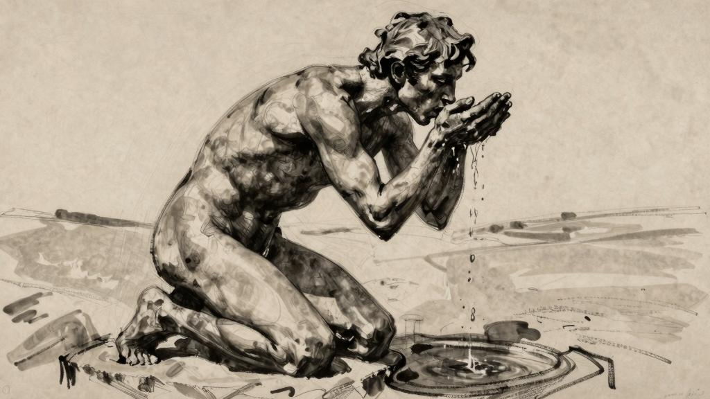

欲望之旅

林叩斯生而见其然幸而知其所以然《浮士德》——歌德神明的戒律曾让我的灵魂痛苦不堪。

神明的戒律——是十诫还是二十诫？

清规戒律约束森严，是否还要用教条框束人们，不断增添新的忌讳？

我对世上一切美好的事物都心怀渴望，是否要因此接受新的惩罚？

神明的戒律曾让我的灵魂患病，将我唯一的解药圈禁在四面高墙之间。

……

但是如今，纳桑奈尔，对人生的种种错误，我心中只有悲悯。

*

纳桑奈尔，我想让你明白，世间一切事物都有神性，都是自然的。

纳桑奈尔，我想和你谈谈这一切。

年轻的牧羊人啊，我将没有铲头的牧羊杆交到你手中，然后我们一起赶着无主的羊群，慢悠悠地，走向所有的地方。

牧人啊，我将指引你的欲望，带领它们走向人世间一切美好的事物。

纳桑奈尔，我想要你唇齿滚烫，燃起新的渴望，然后将一满杯清水送到你唇边。

我已经品尝过了，我知道哪里有解渴的甘泉。

纳桑奈尔，我想和你谈谈那些清泉。

岩缝间奔涌而出的泉水；

冰川下渗出的泉水；

有的泉水呈现出通透的蓝色，看起来格外深邃。

（叙拉古的西亚涅泉正是因此闻名。）

天空般湛蓝的泉水，树木掩映的泉眼，水花在纸莎草间绽放。我们从小舟上俯身往下看，天蓝色的鱼儿在水里游，水底是蓝宝石一样的鹅卵石。

在宰格万（Zaghouan，突尼斯东北省）的水泽仙女洞里，飞溅的泉水当年灌溉了迦太基的土地。

在沃克吕兹，丰沛的泉水从地下涌出，仿佛流经了漫长的岁月，几乎已经成了一条江河，人们可以从地下溯流而上。水流穿过一座座石窟，浸没在黑暗中。火把的光亮摇动着，被黑暗压得透不过气。继续往前走，来到一处无比幽暗的地方，让人不禁心想：不，不能再往前走了。

有的泉水含铁，给石头染上绚丽斑斓的色彩。

有的泉水含硫，乍看之下，苍绿滚烫的泉水仿佛含有剧毒。可是，纳桑奈尔，在这样的温泉里沐浴，皮肤会变得无比柔嫩光滑，出浴之后依然保持着美妙绝伦的触感。

有的泉水入夜后会升腾起一片轻雾，整夜飘荡在泉水边，到清晨日出时分才慢慢消散。

有的泉水只是涓涓细流，悄无声息地消失在厚厚的青苔和灯心草丛里。

有的泉水边，洗衣女工在浣洗衣物，泉水推动石磨转动。

不竭的源流啊，泉水喷涌而出。泉眼下涌动着丰沛的水流。隐秘的水源，袒露的浅潭。顽石终将崩裂，山岭终将草木丛生，贫瘠的国度终将欣欣向荣，苦涩的荒漠终将鲜花盛开。

大地的泉涌远远超出了我们的渴求。

水不断循环更新，蒸腾的气体化为云雾，又从天上落下。

平原缺水的时候，就会从高山上啜饮，或者通过地下河道将山中水源引向平原。

格拉纳达的灌溉系统令人叹为观止，还有水库和水泽仙女洞。毫无疑问，泉水之美与众不同，沐浴其中更是无上乐事。泉池啊，泉池，我们出浴的时候，身体如此洁净。

沐于晨曦，如彼朝阳。

沐于夜露，如彼朗月。

沐于甘泉，清波奔流。

洁身净体，解我烦忧。

泉水之美与众不同，从地下渗出的清水美得异乎寻常：仿佛从水晶中流过，清澈透明，喝起来宛如玉液琼浆；像空气一样淡薄，无色无味，几乎感觉不到它的存在，只能通过那无比的清凉来感知它，就像探寻深藏不露的高贵品德一样。纳桑奈尔，你是否明白，人们为什么渴望畅饮这样的泉水？

我能感受到的最甜美的快乐，就是已经得到满足的欲望。

纳桑奈尔，现在我将为你吟唱一首：

得到满足的欲望我们渴望端起斟满的酒杯，更甚于渴望亲吻。

嘴唇贴近斟满的酒杯，一饮而尽。

我能感受到的最甜美的快乐，就是已经得到满足的欲望。

*

人们压榨新鲜的水果做饮料，柑橘、橙子和柠檬，又酸又甜，喝下去神清气爽。

我曾用精巧的玻璃杯喝过饮料，玻璃薄得好像嘴唇一碰，还没触及牙齿便会破碎；

杯中的饮料贴着嘴唇，因而显得更加醇美；

我曾用柔软的大口杯喝过酒，双手挤一挤杯子，便能将酒液送到唇边。

我曾在太阳下暴走一整天，在入夜时分到达客栈，用粗糙的玻璃杯喝下甜腻的糖浆；

有时候，罐中的水冰凉，让我更敏锐地感受到夜色的阴凉；

我曾喝过羊皮袋里装的水，还带着浓重的羊皮气味。

我曾俯身趴在溪流边啜饮，真想整个人都泡在水里，赤裸的双臂伸进鲜活的水流，一直到底，触碰到洁白的卵石，清爽的感觉从双肩蔓延至全身。

牧人手捧清水痛饮，我教他们用麦秆做吸管；

有时我走在炎炎烈日下，走在夏天最燥热的时节里，只为寻找最强烈的干渴，再让干渴消弭于无形。

我的朋友，你还记得那个夜晚吗？那是场糟糕的旅行，那一夜我们大汗淋漓地醒来，起身去喝陶罐里的冰水。

妇人们走下台阶，到蓄水池和暗井边打水。那是从未见过天光的水，带着阴影的滋味，饱含空气的滋味。

水质异乎寻常，透明。但我倒希望它不要那么清澈，最好是绿色的，这样看起来更加沁人心脾，似乎略带茴香的气息。

我能感受到的最甜美的快乐，就是已经得到满足的欲望。

还不够！还有满天的繁星、深海的珍珠、海岸边的洁白羽毛，我都还没有一一数清楚呢。

还有树叶的低语，黎明的微笑，盛夏的大笑。现在我还有什么可说的呢？难道因为我沉默不语，你们就觉得我的心灵也沉寂了吗？

碧蓝天空下的田野啊！

浸润在蜜色中的田野啊！

蜜蜂飞向田野，然后满载而归……

我见过晦暗的港口，晨光隐没在无数桅杆和船帆之后，小船一清早就悄悄出发，在巨大舰艇的船身之间穿行。人们弯下身子，从绷直的缆绳间穿过。

夜色中，我看见数不清的炮舰起航，驶入夜的深处，驶向黎明。

*

小路上的砾石，没有珍珠的莹亮，也没有水波的流光，但也一样光彩熠熠。在我行进的山间小路上，砾石在阳光下呈现出柔和的色调。

但是纳桑奈尔，我该如何向你描述那片磷光呢？在我印象中，磷这种物质似乎无比疏松，遵循任何物理法则，格外顺从，透明。你没有见过那座穆斯林的城市，城墙在夕照下变成红色，在黑夜里微微发出亮光。白天，光线倾泻进高墙深处，正午时分，墙体像反光的金属一样晃眼，阳光都凝聚在墙上，到了夜里似乎又将光线释放出来。城市啊，你仿佛是透明的，从山丘上看去，在夜色的包围中，你灯火通明，像晶莹的灯盏，像一颗笃信宗教的虔诚的心。

城市仿佛多孔的海绵，吸收着光亮，光辉像牛奶一样散逸在四周的空气里。

道路上的白色砾石在夜色中就像蕴藏光芒的花蕾；荒原上，欧石楠在暮色中绽开了纯白的花朵；清真寺里的大理石砖；海边石窟中的海葵花……所有洁白的事物都是储存起来的光。

我懂得如何通过事物吸收光的能力来辨识它们。有些会在白昼吸收阳光，然后像电池一样在夜里释放光芒。我曾在正午时分见过平原上水流奔涌，跃入粗粝的岩石下方，水花飞溅，金光闪闪。

但是，纳桑奈尔，在这里我只想和你谈谈具体的事物，而不是无形的真理，就像奇妙的海藻一样，一旦从水里捞出来便失去了色彩。

变化无穷的景观不断提醒我们，我们还远没有见识到其中所蕴含的无数种幸福、冥想和哀伤。我还记得小时候，在那些悲伤的日子里，当我走进布列塔尼的荒野，有时悲伤会突然消失不见，似乎融入景色之中——当悲伤成了眼前景致的一部分，我便可以仔细地观察欣赏它了。

永无止境的新鲜事物。

有人做了一件再普通不过的事，然后说道：

“我想这件事情从来没有人做过，没有人想过，也没有人提起过。”突然之间，一切都变得纯洁无瑕。（世界的全部过往都蕴含在其中。）

*

七月二十日，凌晨两点。

起床了。我在起床时喊道：“绝对不能让神等待我们。”不管我们起得多早，总能看到生命在有条不紊地运转。生活睡得比我们早，不像我们，要让他人等待。

曙光，是最珍贵的乐事。

春天，是夏日前的曙光。

曙光，是每一日的春天。

天边挂起彩虹的时候，我们还没有起身。

然而对于月亮来说，彩虹来得永远不会太早，或者说永远不算太晚……

睡眠。

我体验过夏日中午的睡意，正午的睡眠。在大清早起身，劳作了一上午，精疲力竭之后的睡眠。

午后两点，孩子们睡下了，空气安静得让人无法呼吸，或许可以来点音乐。空气中弥漫着各种物体的气味——印花窗帘，风信子，郁金香，洗净的衣物。

下午五点，大汗淋漓地醒来，心脏怦怦乱跳，身体微微颤栗，头重脚轻，却觉得身心舒泰。全身放松，毛孔张开，似乎可以更敏锐地感知周围的一切事物。日暮西沉，将草坪染成金色，午睡的人在一天快要结束时才睁开眼睛。入夜时分的思绪啊，像甜酒一样动人！花朵在夜色中开放。用余温尚存的水清洗额头，然后出门去……路边一排排果树散发着清香，有围墙的花园沐浴在夕阳里。路上，有从牧场归来的畜群。不必再看落日了——周围的景致已经足够美好。

回去吧，回到灯下继续工作。

*

纳桑奈尔，我该怎样对你诉说那些床榻呢？

我曾睡在柴草垛上，睡在麦田的犁沟里，睡在阳光中的草地上，也曾在堆放干草的草料房里过夜。有时我就在树枝之间挂起吊床睡觉，有时在波浪的摇晃中沉沉睡去，有时干脆睡在船甲板上，或者睡在船舱里窄小的床垫上，对着独眼一般呆滞的舷窗发呆。有些卧榻上，风流成性的姑娘等待着我；另一些卧榻上，我在等待年轻漂亮的男孩。有些床铺柔软得就像一曲动人的歌谣，仿佛与我的肉体一样为爱欲而生。我也曾睡过军营的板床，简直是遭罪。我还曾在疾驰的列车上睡着，醒来后也甩不开晃动的感觉。

纳桑奈尔，入睡前的准备工作是美妙的，从睡梦中醒来的感觉也很棒。但是，我从来没有过真正美妙的睡眠。我只喜欢睡眠中的梦境，睡眠再香甜，也比不过醒来的时刻。

我习惯在睡觉的时候打开正对着床的窗户，感觉就像睡在天幕下。在七月酷热难耐的夜晚，我干脆全身赤裸，睡在月光里，等黎明时分乌鸫的鸣唱将我唤醒，然后全身泡在冷水中，为早早开始新的一天而洋洋自得。在汝拉山脉，我住处的窗户正对着一道山谷。冬天，山谷很快就被白雪填满。我躺在床上就能看到林地的边缘，渡鸦和乌鸦在林间飞来飞去。每天一大早唤醒我的，是牛群叮当作响的铃铛声，我住的小屋旁就有一眼清泉，牧人会带牛群来喝水。这一切都还历历在目。

我喜欢布列塔尼客栈里床单粗糙的触感，洗干净的床单闻起来很舒服。在贝尔岛上，我被水手的号子生生唤醒，起身跑到窗边，正好看见一艘艘小船远去。然后，我走向海边。

这世上有许多美轮美奂的住处，但我不愿在任何一处长留，害怕画地为牢，不愿作茧自缚。那些住处就像幽禁灵魂的囚笼。我要流浪者的生活，放牧者的生活。（纳桑奈尔，我把牧羊杆交到你手中，现在轮到你来照看我的羊群了。我乏了。你现在就出发吧，前面有广阔的天地等你去探索，永远吃不饱的羊群总是咩咩叫着，寻找新的草场。）

纳桑奈尔，有时候，某些特别的住所会羁绊住我的脚步。有的是林中小屋，有的矗立在湖水边，有的格外宽敞。但我总是很快习以为常，不再注意那些新奇之处，不再为之惊叹，开始憧憬窗外的景色，然后，我又会离开那些住所。

（纳桑奈尔，我不知道该如何向你解释这种对新事物永无止境的渴望。表面看起来，我没有触碰或损坏任何东西，但是每每接触新事物，我都会产生无比强烈的感受，之后再见却不会加强这种感觉。因此，我常常回到曾经走过的城市，回到同样的地方，就是为了旧地重游，感受时光和季节的变换，这种变化在熟悉的地方最为敏感。当我住在阿尔及尔的时候，每天傍晚我都会去一家摩尔人开的咖啡馆，仔细观察难以觉察的变化——每一个夜晚，每一个生命——就这样，时光流逝，这一片小小的空间在悄然发生着改变。）

在罗马，我住在苹丘附近与街道齐平的房间，钉着栏杆的窗户让它看起来像一座监牢。卖花的姑娘隔着窗栏向我兜售玫瑰花，整个房间都飘满玫瑰的香气。在佛罗伦萨，我不用从桌边起身就能看到阿尔诺河上涨的黄色河水。在比斯克拉的露台上，在月亮的清辉下，梅丽雅在寂静的夜色中来到我身旁。她整个身体都裹在宽大的白色裙袍里。她刚一踏进玻璃门，便笑盈盈地看着我，任由长袍滑落在地。我在卧室里已经为她准备好了点心。在格拉纳达，我的卧室壁炉上，放烛台的位置摆着两个西瓜。在塞维利亚，我住的地方有座内院，那是浅色大理石铺就的院落，树影婆娑，水雾清新；院子里有潺潺流水，汇聚到院落中央的浅池里，在院子里的任何角落都能听见淙淙流水声。

一堵厚实的墙壁，既能抵挡北风，也能吸收南边的日照。一座活动的住所，可以云游四方的房子，能享受南方的温暖……纳桑奈尔，我们的卧室会是什么样子？它将是众多美好景色中的一处避难所。

*

我们再谈谈那些窗户吧。在那不勒斯的夜晚，我们在阳台上谈天说地，身边的女子身穿浅色的裙袍。半垂的帘幕将我们与舞厅喧闹的人群隔开。谈笑间，你一言我一语，做作得让人难受，没过多久便无话可说。这时，橙花浓重的香味从花园里升腾上来，夏夜的鸟儿婉转歌唱。在某些时刻，连这些鸟儿也沉默不语，这时我们便能听见海浪微弱的涛声。

阳台；紫藤萝和玫瑰盛开的花坛；暮色里的休憩；温热的空气。

（今晚狂风呼啸，拍打着我的窗户；我努力让自己喜欢这一切。）

*

纳桑奈尔，我想和你谈谈那些城市：

我曾见过沉睡中的士麦那，仿佛一个熟睡的小姑娘；那不勒斯就像放荡的浴女；

宰格万像卡比尔族的牧羊人，在曙光里，脸颊被照得通红；阳光里的阿尔及尔因爱而颤抖，在夜晚，因爱而疯狂。

在北方，我曾见过月光下沉睡的村落，蓝黄相间的屋墙。村庄的周围是广袤的原野，农田里零散堆放着巨大的干草垛。我出门走进寂静无人的田野，又回到睡梦中的村庄。

城市，无数的城市。有时甚至不知道究竟是谁最早将城市建起。啊！东方的城市，南方的城市啊，平坦的屋顶上是白色的露台，每天夜里都有疯狂的女子在露台上做着美梦。声色犬马，纵情欢爱。从附近的小山上望去，广场上的路灯好似暗夜里的磷火。

东方的城市啊！燃情的欢庆！在被称作“圣人之路”街的咖啡馆里，随处可见烟花女子，她们合着刺耳的音乐翩翩起舞，身穿白袍的阿拉伯人穿梭其中，还有孩子——在我看来还不懂什么是爱欲的男孩。

（有些男孩子的嘴唇比刚破壳的小鸟还要滚烫。）

北方的城市啊！码头，工场，浓烟遮天蔽日的城市。宏伟的建筑，旋转的高塔，壮观的拱门。街道上车水马龙，人群熙熙攘攘。雨后的沥青路面闪闪发亮。街道两旁的栗树无精打采，但永远有女人在等待着你。有时候，夜晚是那样撩人，只需一声最轻柔的呼唤，就能让我浑身酥软。

夜里十一点。收摊了，铁制百叶窗发出刺耳的声响。一片片城区。我在夜色中穿过孤独的街道，惊起路边的耗子飞快地窜回水沟里。透过地下室的气窗，可以看到赤裸上身的男人在揉面团做面包。

*

咖啡馆啊！在那里，我们的疯狂一直持续到深夜。美酒与言笑终于也陷入了沉沉梦乡。咖啡馆啊！有的咖啡馆里挂满了油画和镜子，装饰奢华，光顾的客人看起来都很优雅；而在某些小咖啡馆里，人们唱着滑稽的小调，跳舞的女人把衬裙高高掀起。

在意大利，到了夏天的夜晚，有些咖啡馆的露天座位一直摆到广场上，客人可以坐在那里，品尝美味的柠檬冰淇淋。在阿尔及利亚，有一家咖啡馆里可以吸大麻，我差点在那儿丢了性命。一年之后，那家咖啡馆便被警方关停，因为那里常来常往的都是些形迹可疑的人。

还有许许多多的咖啡馆……啊，摩尔人的咖啡馆啊！叙事诗人讲着长篇故事，在无数个夜晚吸引我前来，尽管语言不通我也还是听得津津有味……不过，在所有咖啡馆当中，位于德尔布门的那家小咖啡馆当之无愧是我的最爱，那是一座属于黄昏的静谧处所，土砖垒起的小屋，坐落在绿洲的边缘，不远处便是接天的沙漠。在这间小小的咖啡馆，白天越是烈日炎炎，夜晚就越宁静清凉。在我身旁，吹笛人忘情地吹奏着单调的乐曲。于是我就想起了它——设拉子的小咖啡馆，诗人哈菲兹曾经歌唱过的咖啡馆。哈菲兹，他沉醉在侍者的美酒和世间的爱情之中，流连在玫瑰盛放的露台上，沉默不语；

哈菲兹，他在熟睡的侍者身旁等待着，在等待中写下一行行诗句，彻夜等待着天明。

（我真希望生在一个诗人只需简单列举事物的名字便足以歌颂万物的时代。那样的话，我就可以逐一赞颂每一样事物，用歌颂来揭示事物自身的价值，证明事物存在的充分理由。）

*

纳桑奈尔，我们还没有一起观察过树叶呢。树叶的千百道曲折纹路啊……

绿油油的树冠，像洞窟，叶片的缝隙间透出天光；大片树叶好像飘动的幕布，最柔和的微风也会使之轻轻晃动；树影婆娑，好像波浪起伏；树冠的边缘也像树叶一样呈锯齿状，枝干就像有弹性的支架；树冠轻轻摇曳，有的呈薄片状，有的呈蜂窝状……

树枝此起彼伏地摇动……每一根细枝的弹性都不相同，对风的抵抗力也不一样，风对每一根树枝施加的力量也都不一样……

咱们换个话题吧。

换成什么？

既然不是创作，就不用精心选择了……随便吧，纳桑奈尔，随便吧！

当所有的感官在一瞬间同时聚焦在一件事上，能够（不过也很难说）使生命本身的感受外化成对外界的感触和感知（反之也一样）。

我达到了这一境界，我占据了生命的洞府，五官感受着一切：

耳边听到的，是持续不断的流水声，松林间的风声渐强又减弱，蟋蟀时断时续的鸣叫，等等。

眼中看见的，是太阳映照在溪流上的粼粼波光，松树的摇曳风姿（看哪，一只小松鼠）……我的脚踏在这片青苔上便踩出一个坑，等等。

肌肤触碰的，是湿润的感觉，是青苔的柔软（哎哟！有根树枝刺痛了我！），是手掌覆盖额头的触感，额头贴在掌心的触感，等等。

鼻子闻到的，是……嘘！小松鼠过来了。

凡此种种凑在一起，汇聚成一个小包裹——这就是生命。这就是一切了吗？才不是呢！当然还有别的很多东西。

现在你是不是觉得，我只是各种感觉聚集在一起的产物？我的生活确实就是如此，但我本人不是。以后有机会我再和你谈谈我本人吧。今天就不说了，今天我并不打算歌唱《精神的不同形式》，也不打算歌唱《我最好的朋友们》和《因缘际会叙事曲》，在这首叙事曲中，会有这样的段落：

在科莫，在莱科，葡萄熟了。我登上矗立着古代城堡的高岗。山岗上弥漫着甜蜜的葡萄香气，甜得有些发腻，渗进鼻腔深处，浓重得像是味道而不是气味。但是这些葡萄吃起来并没有任何特别之处，只是我当时太渴太饿，几串葡萄就足以让我醉倒。

不过，在这首叙事曲中，我主要谈论的还是男人和女人。之所以没有将这首歌唱给你听，是因为我不想在这本书中塑造任何人物形象。正如你已经注意到的那样，这本书里没有任何一个人物。甚至连我自己也只是个幻影。纳桑奈尔，我就是灯塔的守护者，我就是林叩斯。漫漫长夜有多久，我就守护了多久。我在灯塔最高处呼唤你，曙光啊！多么灿烂也不为过的曙光！

我守护着对新生光明的希望，一直到黑夜结束；直到现在我也没有看见新的光明，但我始终期待着；我知道太阳将从哪一边升起。

毫无疑问，整个民族都在准备着。在灯塔的高处，我听见了街道上的喧哗声。太阳就要出来了！欢腾的人们已经在向着朝阳前进。

你如何看待黑夜？守卫，你如何看待黑夜？

我看着新的一代人崛起，看着旧的一代人日薄西山。我看见声势浩大的一代人蒸蒸日上，全副武装，欢乐就是他们的铠甲，他们就这样欢欣鼓舞地走向生活。

你在灯塔高处看见了什么？林叩斯，我的兄弟啊，你看见了什么？

可惜可叹啊！让另一位先知哭去吧，黑夜来了，白天也会来临。

他们的黑夜来了，我们的白昼也终将来临。困倦的人可以睡下了。林叩斯！现在走下你的灯塔吧。天亮了，到平原上来吧，近距离地观察每一样事物。来吧，林叩斯！

靠近我。天亮了，我们相信，光明已经来临。
