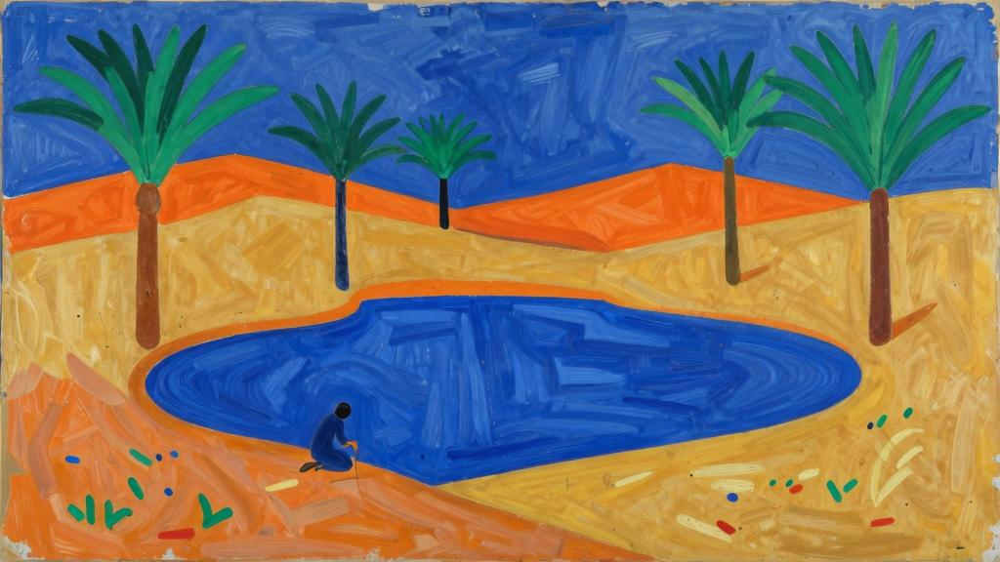
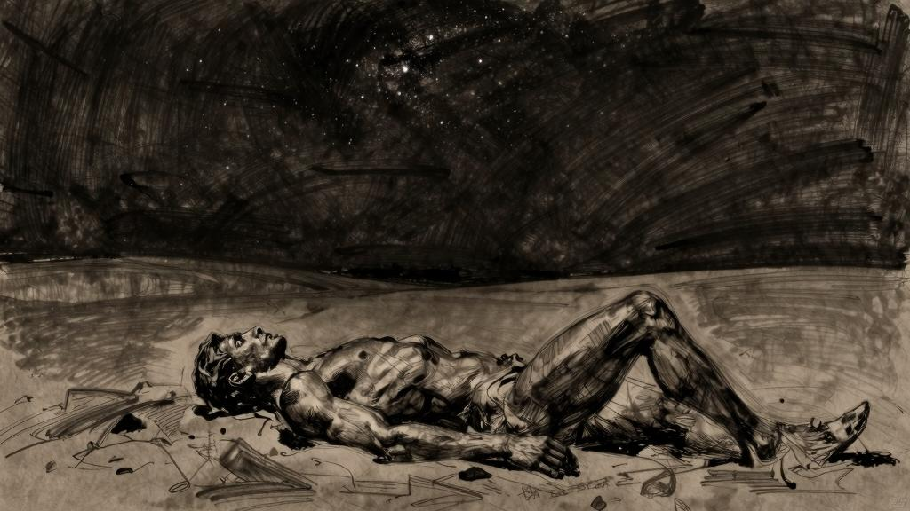

沙漠清泉

倘若阿闵塔斯肤色黝黑。

维吉尔——渡海，一八九五年二月。

从马赛出发。

狂风大作，空气绝佳。天热得比往年要早，桅杆轻轻摇晃。

波光粼粼的海面上装点着白色的浪花。水波拍打着船身，眼前一派光明景象。心中回忆起每一次动身出发的过往。

渡海。

记不清有多少次……

在寂寥的大海上等待黎明。

我看见曙光来临，海面并未因此而平静。

鬓角满是汗水，身体虚弱无力，听天由命吧。

海上的夜，狂暴的大海，甲板上水花四溅，螺旋桨嘎吱作响。

啊！焦灼的汗水！

倚在枕上，头痛欲裂……

那一夜，甲板上升起一轮满月，绝美。

然而我不在那里，什么也没看到。

等待浪潮。翻卷的银色水花。窒息。被海浪托起，又重重落下。我已了无生气。

我是什么？一个软木塞，随波逐流，可怜的软木塞。

将浪潮遗忘在脑后吧。享受随波逐流的快意。我只是一件物品。

将近天明。

天色未明的清冷早晨，船员用木桶打来冰冷的海水擦洗甲板，然后通风晾干。我在船舱里，听着刷子刮擦木板的声音。剧烈的碰撞。我想打开舷窗。强劲的海风扑面而来，打在汗水淋漓的前额和两鬓。我又想关上舷窗……又一头栽回到床铺上。啊，靠岸之前的颠簸真是可怕！白色舱壁上交织映照着纷乱的影子。狭窄逼仄。

眼睛酸涩，什么都不想看……

我叼着麦管，吮吸加冰的柠檬汁……

在全新的土地上醒来，就像大病初愈。眼前是种种不曾梦见过的事物。

*

彻夜在大海的怀中摇摆，清晨在沙滩上醒来。

阿尔及尔——丘陵在平原边缘歇脚，白昼在日落处偃旗息鼓。

水手从海滩扬帆出发，我们的爱情在夜色中睡去……

黑夜笼罩大地，就像无边的港湾，思绪，光影，忧伤的鸟雀，都来到夜幕下休憩，躲避白昼的光明；

荆棘丛中，所有暗影都平静下来，草场上水波不兴，泉水边芳草丛生。

后来，从漫漫旅途归来之时，海岸宁静，船舶归港。

我们看到浪迹天涯的飞鸟，在风平浪静的水面安眠；

看见小船下锚系好缆绳。

夜色降临，在我们头顶张开巨大的翅膀——沉默和友谊的翅膀。

万物入眠的时刻来临了。

一八九五年三月。

卜利达！萨赫勒的鲜花！在冬日里黯然失色，到了春天便美不胜收。那是一个雨雾迷蒙的清晨，天色模糊，晦暗阴沉。满树鲜花盛开，香气飘荡在大街小巷。平静的水池里有喷泉吐水。远处的军营里隐约传来军号声。

这是另一座花园，荒木丛生，橄榄树下隐约可见白色清真寺的光芒。神圣的小树林啊，今天早晨我来到这里休憩，神思倦怠，身体也被爱情的焦灼炙烤得精疲力竭。藤萝啊，在那个冬天初见你的时候，我从未想到过，你竟会绽放如此绚丽的花朵。藤蔓上垂坠着沉甸甸的紫色花朵，一串一串，像悬吊的小香炉，花瓣飘散，落在小径金色的沙地上。流水淙淙，发出湿润的响动，水池边传来窸窸窣窣的水声。高大的橄榄树，洁白的绣线菊，花团锦簇的丁香，丛生的沙棘，团成灌木的玫瑰。独自来到这里回忆冬天，感觉无比厌倦，就连春天的美景也无法让你惊艳，心里甚至渴望景色再萧瑟一些。良辰美景向孤独的人微笑，仿佛一个邀请，只会激起心中潜藏的无数欲望，就像空寂小巷中忽然涌入卑躬屈膝的人群。平静的水池里，潺潺水声静静地响，衬托得周围越发寂静。

*

我知道该去哪座清泉边濯洗双眼。

神圣的树林，我认得去那儿的路，浓密的树叶间，林中空地一片清凉。

等到夜里万籁俱寂，我便要去向那里；

空气中的微风，让我们渴望睡眠胜过渴望爱情；

冰凉的源泉，是黑夜落脚的地方，封冻的冷水，是黎明初现的地方。

纯洁的源泉，瑟瑟发抖，泛起白霜，我是否该到晨光中去寻找？

当曙光初现的时候，去寻找过去的滋味，那时，我对所见一切都还满怀惊奇？

让我再回到泉水边，清洗灼热的眼睑。

给纳桑奈尔的信——光明如潮涌浸没一切，持续的高温带来肉欲的迷醉。纳桑奈尔，你或许很难想象这是怎样的一种体验……橄榄树的树枝伸向天空，天边是起伏的丘陵；咖啡馆门前传来长笛吹奏的歌谣……阿尔及尔太过炎热，歌舞升平太过喧嚣，所以我想离开三五天；当我来到卜利达想躲个清静时，才发现这座城市早已橙花满枝。

每天清晨，我出门散步。什么都不细看，一切尽入眼帘。过去被我忽略的种种细微感受在我身上演绎成一场美妙绝伦的交响乐。时间静静流逝，激动的感觉也慢慢平息下来，就好像午后倾斜的阳光似乎移动得更慢一样。这时，我便会选择某个让我心潮澎湃的人或事物——必须是活动变幻的，因为我的感情一旦被固定的对象牵绊住便会失去活力。每一个新的瞬间，我都觉得自己还什么都没见识过，什么滋味都没品尝过。我欣喜若狂，毫无章法地追求那些飘忽不定的事物。

昨天，我跑到能俯瞰卜利达的小山丘最高处，只是想再多看一眼夕阳，看着太阳慢慢落山。在火红云霞的映照下，连白色的露台也熠熠生辉。我在无意间瞥见了树下静默的阴影。我在清朗月光下游荡。被明亮而温暖的空气包裹着，我可以慵懒地漂浮在其中。

我总是相信自己脚下的这条路就是我自己的路，我相信自己的选择绝不会错。我一向都保持着这样一种大而化之的信心，如果在神的面前宣誓，这种信心差不多就是人们通常所说的信仰了。

比斯克拉——女人倚在门边等待，身后是直通楼上的扶梯。女人们坐在门口，神情严肃，装扮得宛如神像，头戴钱币串成的冠冕。入夜以后，这条街便活跃起来。楼上亮起灯光，女人背对灯光坐在楼梯口，仿佛坐在光明的神龛里，面孔隐没在阴影中，只能看见冠冕上的金币闪闪发亮。所有的女人似乎都等待着我，只等我一个人。要想上楼，只需向冠冕上添一枚小小的硬币。女人站起身来，随手将灯熄灭，引着客人走进狭小的房间，端上小杯咖啡招待客人，然后在低矮的沙发床上，与客人发生关系。

*

比斯克拉的花园——亚特曼，你在信中写道：“我把羊群赶到棕榈树下，等待着您。您快回来吧！那时春意又会挂满枝头，我们将一起漫步，什么也不想……”亚特曼，我的牧羊人，你不用再去棕榈树下等待了。我回来了。春意已经在枝头绽放，我们一起漫步，什么也不想。

比斯克拉的花园——今天是阴天。金合欢香气弥漫，空气潮湿温热。厚重的雨滴大颗大颗地落下，仿佛在做慢动作，漂浮在空中，像是直接从空气中孕育而生……雨水落在树叶上，压得树叶弯下身子，然后缓缓滑过叶片，落到地上。

我还记得夏天的雨。那还算是雨吗？温热的水珠大颗大颗地坠落，重重地打在绿意盎然、姹紫嫣红的棕榈园中，花花草草和枝枝蔓蔓在雨水中纷纷落地，仿佛定情的花环被丢进水沟。雨水汇成的水流冲走了花粉，将它们带到远方去繁殖。水流浑浊发黄，呛得水池里的游鱼无法呼吸。靠近水面，能听到鲤鱼张口喘息的声音。

下雨之前，正午热风呼啸，烧灼感直入大地深处。现在，树冠下的小径热气蒸腾，金合欢垂下枝条，仿佛是为了荫蔽正在长凳上欢愉的人。这是一座寻欢作乐的花园，男人披着毛织衣裳，女人身穿纱袍，等着被这场大雨浇个湿透。他们坐在长凳上没有动，所有的欢声笑语都偃旗息鼓，每个人都静静听着暴雨的声音，盛夏时节转瞬即逝的骤雨将衣服淋得湿透，洗净裸露的身体。潮湿的空气，浓密的树荫，让我不由得和他们一起坐在长凳上，无法抗拒心中的爱恋。待到大雨过去，树木枝叶间的积水汇成涓涓细流。大家脱下脚上的便鞋，赤脚踩在湿润的泥土上，柔软的触觉会带来一种奇异的快感。

*

两个身穿白色羊毛衫的孩子带领我走进一座无人光顾的花园。长形的花园，尽头有一扇门。树木遮天蔽日，仿佛已经触碰到了低垂的天空。墙壁。笼罩在雨中的城市。

天幕之下是远山。雨水汇成涓涓细流。树木在吸收养分。植物在雨雾下庄重地授粉。空气中暗香浮动。

水渠里落满树叶（混杂着花瓣）。那是被当地人叫作“灌溉渠”的人工河流，水流很慢。

加夫萨的泳池有种危险的魅力——阴影会迷住唱歌的人。现在，夜空清朗无云，几乎连雾气都没有，显得格外深邃。

（那孩子穿着阿拉伯人的白色羊毛衫，真美。他的名字叫亚祖，意思是“亲爱的人”。另一个孩子叫瓦尔迪，意思是他出生在玫瑰盛开的季节。）

清水温润如空气，我们尽情啜饮。

深色的水面隐没在夜色里，在黑暗中看不真切——直到银色的月光倒映在水面上。

月亮从树叶的缝隙间透出来，让昼伏夜出的走兽躁动不安。

*

比斯克拉，清晨。

曙光初现。出发，忘乎所以地冲进焕然一新的空气里。

夹竹桃树的一根树枝，在寒意料峭的清晨瑟瑟发抖。

比斯克拉，傍晚——这棵树上有鸟儿在歌唱。它们的歌唱，比我印象中的鸟鸣声激越得多。我们看不到那些鸟儿，因此觉得是树木自己在呐喊——抖擞着每一片树叶在呐喊。我心想：这样的激情太过强烈了，它们会因此而死的，可是今晚它们究竟怎么了？难道它们一点儿也不知道，这一夜之后，清晨还会再次来临吗？它们是害怕一闭上眼就会永远沉睡吗？

它们是想要在一夜之间耗尽一生的热情吗？然后再安然睡去，陷入永无止境的黑夜？暮春时节的短暂夜晚啊！当夏日的曙光将鸟儿唤醒时，它们又会无比欢快。对前夜睡眠的模糊印象会让它们在今夜入睡时不再那么畏惧死亡。

比斯克拉，入夜——树丛寂静无声。周边的沙漠里回响着蟋蟀的情歌。

*

舍特马——白日渐长。光影在天地间散逸。无花果树的叶子一天天舒展长大，揪一片树叶，手上还有余香，叶片茎秆会渗出泪滴一样的乳白色液体。

暑气重回大地。看哪，我的羊群回来了！我听见了我亲爱的牧羊人吹奏的笛声。

他就要出现了吗？或者我将要看见的，其实是另一个自己？

时间慢慢度过，留下痕迹。去年结的石榴还挂在枝头，已经干缩起皱。果皮裂开，变得坚硬。现如今，同一根树枝已经再次长满花蕾。斑鸠在棕榈叶间穿梭。草场上野蜂飞舞。

（我还记得在恩菲达附近有一口井，美丽的女人们在井边打水。不远处是一道灰色和玫瑰色交织的悬崖，据说悬崖顶上是蜜蜂的巢穴。是的，成群的蜜蜂聚集在那里嗡嗡作响，在峭壁上筑建蜂巢。夏天一到，蜂巢在骄阳的炙烤下渗出蜂蜜，顺着岩壁流淌下来。恩菲达的居民们纷纷前去收集蜂蜜。）

来吧，我的牧羊人！

（我咀嚼着无花果的叶子。）

夏天！阳光宛如金色刀片，无处不在，强烈的光线气势恢宏。爱情仿佛不受控制，泛滥潮涌。谁想尝尝蜂蜜的滋味？浸透蜂蜜的蜂蜡已经融化。

那天我见到的最美的景象，是一群回圈的绵羊。小巧的羊蹄在地面蹬踏，发出骤雨击打地面般的声响。在沙漠的夕照下，归圈的羊群掀起阵阵沙尘。

绿洲啊，就像是沙海中漂浮的岛屿。棕榈树绿意盎然，让人不禁想象着，它们的根系正畅饮着泉水。有些绿洲泉水丰沛，水边的夹竹桃树冠向水面倾斜。那一天早上十点左右，我们抵达了绿洲，当时我不愿再向前多走一步。园中鲜花如此魅人，我再也不想离开——这片绿洲！

（艾赫迈德告诉我，下一片绿洲比这里还要美。）

*

绿洲。下一片绿洲还要更美，鲜花盛开，树叶簌簌作响。泉水更加丰沛，水边的树木更加高大。正午时分，我们泡在水里。之后还是要离开。

*

绿洲。对于再下一片绿洲，还有什么可说？它更美。我们在那里，等待夜幕降临。

不过我还是要说，傍晚时分的花园是那样的静谧宜人。花园啊！有的花园宛如出水芙蓉；有的花园只是平庸的果园，杏子熟了又落；还有的花园繁花似锦，蜜蜂在花间穿行，空气里弥漫着馥郁的香气，浓烈得好像可以咬一口，它们像甜酒一样让我们如痴如醉。

第二天，我心所恋的，就只有沙漠了。

乌马什——正午时分，我们走进这片沙石丛生的荒漠。眼前这座村庄在滚滚热浪中消磨尽所有的精力，完全没有预料到我们的到来。棕榈树挺得笔直。老人坐在门洞的阴影里闲聊。男人昏昏欲睡。孩子在学堂里聒噪。没有看到女人的踪影。

村里的土路，在白天看起来呈玫瑰色，日落时分则是紫罗兰色。午间沉寂如荒漠的村子，入夜之后便活跃起来。咖啡馆里挤满了人，孩子们放学回家，老人依然坐在门槛上闲聊。天色暗了，女人们走上露台，摘下面纱，露出鲜花般的面孔，幽幽地讲述自己的烦恼和忧愁。

阿尔及尔的这条街，一到中午便充满了茴香和苦艾的气味。比斯克拉的摩尔咖啡馆里只提供咖啡、柠檬水和茶。阿拉伯茶里有胡椒和姜粉，口味辛辣，这样的饮品让人想起那个无比遥远而极端的东方世界，它寡淡无味，难以下咽，我根本不可能喝完一整杯。

图古尔特的广场上有贩卖香料的小贩，我们在那儿买过各种各样的树脂，拿到鼻下嗅闻，放进嘴里咀嚼。有的树脂可以点燃，这样的树脂经常呈小圆片形状。熔化，燃烧，释放出浓烈刺鼻的烟气，仔细分辨才能觉察其中还混有一丝细微的芳香；树脂燃烧的烟气能够营造出令人恍惚迷醉的宗教氛围，清真寺举办仪式的时候，焚烧的就是这种树脂。

有的树脂，放进嘴里咀嚼，口腔里会立刻充满苦涩的味道，树脂粘在牙上，感觉很不舒服，就算吐掉，那股味道也会持续很久。而有的树脂就只有树脂的气味。

在特马西宁的穆斯林修士家吃饭，饭后奉上的甜点是香料蛋糕。蛋糕上装饰着金色、灰色和玫瑰色的叶子，好像是用面包屑捏成的。蛋糕咬一口就粉碎，好像咬了一嘴沙子，不过我觉得这样也别有风味。蛋糕有玫瑰味的，有石榴味的，有的却好像已经完全风干走味了。这样的筵席根本不可能让人醉倒，除非抽烟抽到迷醉。菜多得令人生厌，每上一道菜，席间的话题也随之转变。用餐完毕后，一个黑奴提着水壶，倒出加了香料的水让客人清洗手指，下面用浅盆接着。在那片地方，女人在做爱之后，也这样为男人清洗身体。

图古尔特——阿拉伯人在广场上搭起帐篷，燃起熊熊篝火，夜色里几乎看不见升腾的烟雾。

沙漠里的商队啊！在暮色中抵达，在黎明时出发。筋疲力尽的商队啊，醉心于海市蜃楼的幻景，最终，所有希望全都破灭！沙漠里的商队啊！若是能和你们一起出发该多好啊！

有的商队启程前往东方，寻找檀香、珍珠、巴格达的蜂蜜蛋糕、象牙和刺绣。

有的商队启程前往南方，寻找琥珀、麝香、金沙和鸵鸟的羽毛。

有的商队启程前往西方，日暮时分出发，在落日耀眼的余晖里消失不见。

我见过归来的商队，满载而归，疲惫不堪。骆驼卧在广场上，终于可以卸下身上的重担。厚实的帆布袋里，不知道装的是什么样的货物。有些骆驼驮着轿子，轿子里载着女人。还有些骆驼驮着夜里宿营用的帐篷。在无垠的沙漠里，车马劳顿也显得无与伦比，波澜壮阔！广场上燃起篝火，人们开始准备晚餐。

*

啊，不知有多少次，我在黎明时起身，东方的天空被朝霞映红，比神的圣光更加璀璨辉煌！不知有多少次，在绿洲边上，我看到最后几棵棕榈树枯萎变黄，生命再也无法战胜沙漠！不知有多少次，我向你——被光明和酷热吞没的广袤平原——释放自己的欲望，就像俯身靠近灿烂辉煌得让人无法直视的光源……需要多么忘乎所以的迷醉，多么暴戾而炽热的爱恋，才能征服沙漠的欲火？

废土，没有仁心也没有柔情的土地，满怀激情与狂热的土地，预言者热爱的土地。

啊！充满痛苦的沙漠，充满荣耀的沙漠，我曾如此疯狂地爱过你。

我曾见过海市蜃楼中的盐湖，白茫茫的盐壳看起来好像明亮的水面。盐湖像大海一样蓝。我知道，那是蔚蓝天空在盐湖上的倒影。但为什么会有灯心草丛，更远处还矗立着倾颓的页岩峭壁？为什么能看见漂浮的小船，更远处还有宫殿的虚影？所有这些扭曲的景象都悬浮在虚幻的深潭上。

（盐湖边的气味令人作呕，泥灰土混杂着盐壳，被太阳烤得滚烫，感觉糟透了。）

我曾见过阿马尔卡度山在熹微晨光中被染成玫瑰色，仿佛整座山都在燃烧。

我见过大风卷起地平线尽头的滚滚沙尘。绿洲在风沙中喘息着，颤抖着，恰似一条迷失在风暴中的航船，被狂风掀了个底朝天。在小村庄的街道上，瘦骨嶙峋的男人赤裸着身体，被难以忍受的焦渴折磨得缩成一团。

我见过废弃的道路，路旁散落着白森森的骆驼骸骨——骆驼疲倦到无法再拉车的时候，就会被沙漠商队抛弃，在路边静静腐烂，爬满苍蝇，散发出骇人的恶臭。

某些夜晚，除了昆虫尖锐的嘶叫，再没有别的歌唱。

我还想谈谈荒漠：

长满羽毛草的荒漠，里面藏满了游蛇。绿意盎然的原野，在风中碧波荡漾。

荒芜的石原，寸草不生，页岩闪闪发亮，虎甲拍打着翅膀在空中飞舞，灯心草枯萎，在阳光里噼啪作响。

黏土质的荒漠。在这里，只要有一点流水，一切都有可能存活。一场雨过后，整片荒漠都会变成绿色。过度干旱的土地似乎已经习惯于不苟言笑，反而让这里的青草显得比别处更加柔嫩清香。野草匆忙地开花，急着释放生命的芬芳，生怕在结果之前被烈日晒得凋谢。野草的爱情是疲于奔命的。太阳又出来了，土地龟裂风化，失去所有水分。大地被撕开裂口，大雨滂沱的时候，雨水灌满裂口，形成水沟。然而大地无法留住水分，荒漠依旧贫瘠得万念俱灰。

沙漠。流沙好似海浪，沙丘不断移动，仿佛一座座金字塔，指引着跋涉的商队。

登上一座沙丘，在最高处，才能望见天尽头另一座沙丘的尖顶。

刮风的时候，沙漠中的商队就会停下。赶骆驼的人借骆驼躲避风沙。

*

沙漠，生命寂灭，除了呼啸的风声和滚滚热浪之外，什么也没有。阴影里的沙子像天鹅绒一样光滑柔软，夕阳下，仿佛在熊熊燃烧，到了清晨又化为灰烬。沙丘之间有白色的谷地，我们骑马穿过那里。流动的沙子抹去了我们的足迹。我们十分疲惫，每到一处新的沙丘，都觉得自己再也无法翻越任何沙丘了。

沙漠啊，我原本应该满怀激情地热爱着你。一沙一世界，一粒小小沙尘中蕴藏着整个宇宙的奥秘！沙尘啊，你还记得什么样的生命？你还记得多少风化的爱情？尘埃也希望有人为它唱颂歌。

我亲爱的人啊，你在漫天黄沙里看到了什么？

看到累累白骨，还有空空如也的贝壳。

一天早晨，我们来到一处高高的沙丘旁，在阴影里躲避太阳。我们坐在那里，阴影里还算凉快，灯心草自在生长。

但是关于黑夜，黑夜啊，我还能说什么呢？

黑夜是一场缓慢的航行。

波浪没有沙丘那么蓝，却比天空更明亮。

我熟悉这样的夜晚，每一颗星辰在我眼中都格外美丽。

扫罗王[1]，你在沙漠中寻找失散的驴子，没有寻到驴子，却找到了你不曾期待的王国。

在身上饲喂寄生虫，自有一番乐趣。

对我们来说，生活的滋味野蛮而迅疾。

我希望人间的幸福，宛如坟墓上盛开的繁花。

[1]扫罗王，《圣经》中的人物，传说是以色列的第一位国王。
