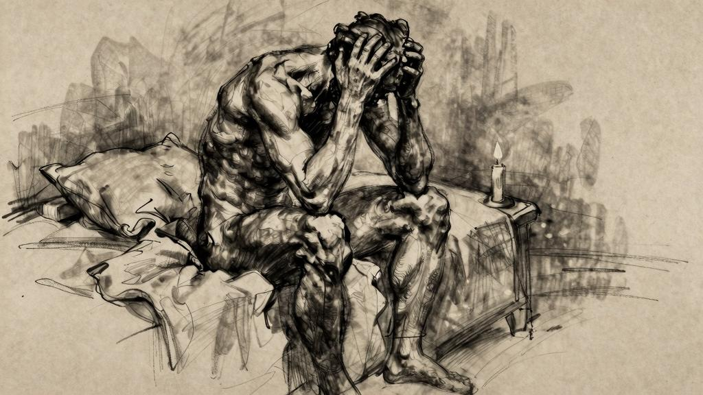
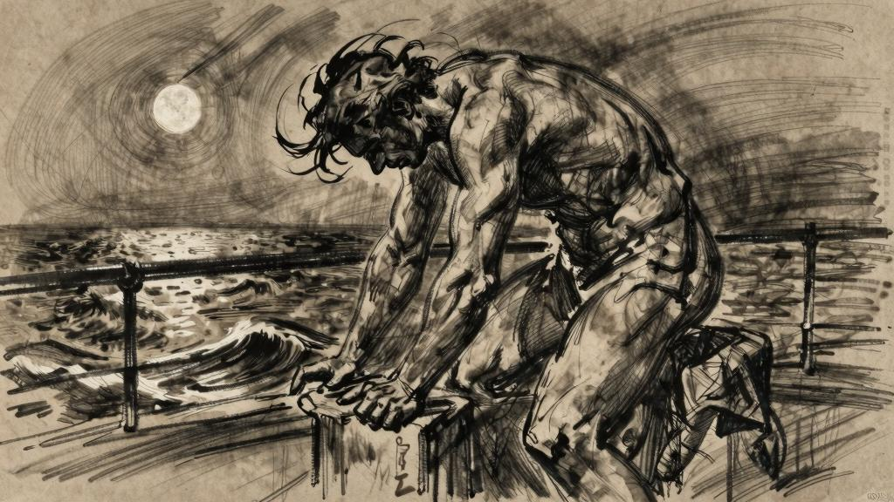

无眠之夜

我们的行动从属于我们本身，就像磷光来自磷。诚然，行动消耗着我们，但也让我们焕发出自身的光彩。

我的精神啊，在那些传奇般的旅途中，你曾经异乎寻常地亢奋。

我的心灵啊，我曾让你尽情痛饮解渴。

我的肉体啊，我让你在爱情中陶醉迷狂。

如今，我终于消停下来，现在再来清点自己的财产已经没有任何意义。我已经一文不名。

有时，我试图在过去的岁月中寻找某些记忆的片段，并串联起一段历史，回忆一段往事。尽管我的生命里充满了记忆，我却认不出回忆中的自己。我仿佛只能活在不断更新的当下这一瞬间。别人所说的“反躬自省”，对我而言是一种无法想象的束缚。“孤独”这个字眼对我不再有意义：我自己一个人的时候，不再是任何人，但也可以是任何一个人。无论身在何处，我都觉得悠然自在，只是欲望始终驱使着我前往更远的远方。

回忆再美好，在我眼里也只不过是旧日幸福的残骸。最微不足道的一小滴水，哪怕只是一颗泪珠，一旦润湿了我的手掌，对我来说便是一种弥足珍贵的真实存在。

*

梅纳克，我在想念着你！

你告诉我，你那艘沾染了浪尖泡沫的舰船，又要扬帆驶向哪一片海？

梅纳克，你还会回来吗？依然带着那副骄纵恣肆的神情，因为再次点燃了我的欲望而沾沾自喜？如果我现在停下来休息，我不会像你那样富足……

不，是你教会我，永远不要停下脚步。

难道这样漂泊游荡的生活还没有让你厌倦吗？至于我，有时我会因为痛苦而尖叫，但我从未对任何事物感到过厌倦。

当我的身体感到疲惫时，我总会责怪自己太软弱，我的欲望还期待我能更加强健。

当然，如果说今时今日，我还有什么后悔的事，那就是错过了爱神赐予我们的果实，没有好好咬上一口就任它腐烂变质，离我们远去了。

《福音书》中讲道：今日被夺去的，来日将百倍返回……唉！如果超出了欲望能够承受的范围，获得再多的财富又有什么用呢？

我已经品尝到了如此强烈的快感，再多一点便会让我麻木得失去感觉。

*

远处的人们说我以苦行赎罪但是忏悔对我有什么意义？

——萨迪诚然，我的青春阴暗无光，我为此而忏悔；

我尝不出泥土里盐花的滋味，也感觉不到海水的苦咸；

我以为自己就是地上的盐，也害怕失去自己的咸味。

海中的盐永远不会失去咸味，只是我自己唇舌衰朽，失去了味觉。唉！我真该趁着灵魂还对一切事物有着热切渴望的时候尽情呼吸海边咸湿的空气。现如今，还有什么样的美酒能让我醉意飘然呢？

纳桑奈尔！在你的灵魂还有欲求的时候，就尽情享受其中的乐趣吧！去满足你对爱情的渴求吧，趁你的双唇还鲜妍丰润，趁你的拥抱还能让人感到愉悦欢欣。

因为总有一天你也会说：那些果实曾经就在那里，沉甸甸地压弯了枝头；我的嘴唇就在那里，饱含着欲望；但我始终没能开口，始终没有张开怀抱，因为我双手合十在祈祷；我的灵魂和肉体始终饥渴，饥渴得几欲绝望。时光，就这样令人绝望地一去不返。

（是真的吗？书拉密女，这是真的吗？你曾经等待着我，而我却浑然不知？你曾经来找过我，而我却没听见你靠近的脚步声。）

青春啊！人只能拥有一次青春，然后用一生的时光来回忆它。

（欢愉轻轻叩响我的房门，我心中的欲望应声而起；我双膝跪地，没有开门。）

流水还会灌溉许多田野，滋润许多人干渴的嘴唇。但是关于流水，我还能学到什么呢？流水对于我的意义，难道不就在于它奔流而过时的鲜活吗？水一流过，清凉又变成灼热。我的种种欢愉啊，你们也像流水一般匆匆而过。真希望流水时时崭新，永远鲜活清凉。

江河的活水不会枯竭，奔涌的溪流永不干涸，它们不是被拘禁在容器里，被我掬来洗一洗手，弄脏了就泼掉的水。被拘禁在容器里的水啊，就像人类的智慧。人类的智慧啊，你没有江河湖海那种永不枯竭的鲜活生命力。

失眠。

等待。等待；狂热；小径上的青春年华……

对于别人称之为“罪过”的一切，我都心怀强烈的渴望。

一条狗对着月亮哀嚎一只猫像婴儿一样啼叫城市终于品尝到了一丝宁静第二天，所有的一切又将重现生机我还记得在小径上度过的时光，赤脚踩在石板路上。我记得在阳台上，额头倚靠着被夜露打湿的铁栏杆。月光下，我的身体仿佛一枚等待采撷的美丽果实。等待啊！我们在等待中容颜憔悴……过度成熟的果实啊！我们只有在被焦渴炙烤得痛不欲生，再也无法忍受煎熬的时候才会吃下那样的果实。腐败的水果啊，你们让我的口腔里充满恶臭，让我的灵魂痛苦不堪。有人趁着年轻，咬下无花果还带着酸味的果肉，吮吸清香的乳白色汁液，这样迫不及待的人真是幸运啊。吃完果子，又精神抖擞地上路——去度过漫长而痛苦的日子。

（诚然，为了不过分关注神明，我已竭尽所能。只有不断消耗自己的感知力，才能转移对神明的注意。我的灵魂全心全意地关注着神明，不分昼夜，千方百计地沉迷于复杂的祈祷，在激越的热情中将自己一点一点消耗殆尽。）

今天清晨，我从哪座坟墓里脱身？

（海鸟落在水面上，尽情舒展着羽翼。）

纳桑奈尔，对我而言，生命的意象就是：滋味浓郁的果实落在充满渴望的嘴唇上。

*

有些夜晚，我们无法入睡。

有时，我在漫漫长夜中久久地等待——很多时候根本不知道自己在等待什么。躺在床上辗转反侧，徒劳地期待着睡眠，四肢乏力，仿佛被爱欲啃过的骨头。有时，我试着在肉欲的愉悦之外，寻求另一种更隐秘的快感。

喝酒的时候，越喝越多，越喝越渴。到最后，这种干渴变得那样猛烈，我不禁为自己的欲望失声痛哭。

我的感官已经被打磨得几近透明。黎明，当我走向城市的时候，天空的蔚蓝直接穿透了我的身体。

嘴唇上薄薄的皮肤被撕裂，牙齿疼到极点——齿尖似乎都已磨损。太阳穴凹陷下去，仿佛头颅内空空如也。洋葱田里开花的气味，哪怕一丝丝都会让我作呕。

失眠。

我们听到夜深处传来号啕哭声。哭声啊，这就是散发着恶臭的花朵结出的果实，甜美甘醇。从此，我将在大街上漫步，心怀难以名状的烦闷和欲望。你那遮风挡雨的卧房让我透不过气，你的床榻再也满足不了我。

再也别想为你永无止境的游荡寻找任何借口。

干渴是如此焦灼，以至于我已经喝下整整一杯水之后才发现，天哪，它的味道实在令人恶心。

书拉密女啊！你之于我，就像生长在窄小封闭的花园里，在阴影中成熟的果实。

唉！我心想，人就是这样，在对睡眠的渴望和对快感的渴望之间耗尽了力气。在经历了难以想象的压力和全神贯注的激情之后，肉体颓然倒下，只想好好睡一觉——睡眠啊！唉，真希望我们不要再被突然袭来的欲望唤醒，又被欲望驱使着奔向生活。

人性就像个病人，在床上翻来覆去，想要减轻痛苦。

在数周的辛勤劳作之后，终于可以永远休息了。

人死了，身上还裹着衣裳做什么！

（凡事从简。）

我们将会死去——就像平时脱去衣服准备睡觉一样。

梅纳克！梅纳克啊，我想念着你！

我已经说过了，是的，我知道，但是那又有什么关系呢？在这里，那里，我们都一样自在。

现在，天边，夜幕降临……

唉，假如时光能够倒流，回溯到最初的源头，该有多好啊！假如过去能够重来该多好！纳桑奈尔，我真想带你回到我少年时那些充满柔情蜜意的岁月，那时的生活真的像蜜糖一样甜。品尝了那么多的幸福滋味，灵魂最终能否获得安慰？我曾经在那里，在那些花园中，是我而不是别人；我听着芦苇丛中的歌唱，呼吸着花朵的芬芳，端详又爱抚着那个孩子——毫无疑问，这些欢愉中的每一种都会带来新的春天——但是我呢，我怎么才能重新变回当初的那个自己呢？

（此时此刻，城市的所有屋顶都笼罩在雨幕中；我的房间孤零零的。）

这个时间，正是洛西夫的畜群归圈的时候，它们从山上回来了。落日下，整片沙漠金光闪闪。

夜里很宁静……

六月的夜晚，巴黎。

亚特曼，我想念着你。比斯克拉，我想着你的棕榈树。图古尔特，我想着你的沙漠……绿洲啊，沙漠里是不是还在刮着强劲干燥的狂风，吹得棕榈树沙沙作响？在热浪中爆开的石榴啊，你是不是还像从前那样，任由酸涩的果粒落在地上？

舍特马，我记得你那清澈的河流，还有一靠近就让人出汗的温泉。

坎塔拉，拥有金色大桥的城市，我记得你人声鼎沸的清晨和纵情狂欢的夜晚。

宰格万，我记得你的无花果和夹竹桃。

凯鲁万，我记得你那里的仙人掌。

苏塞，我记得你的橄榄树。

乌马什，我在梦境中看到你那里的倾颓荒野，坍塌的城池，陷入沼泽的断壁残垣。

还有你，毫无生机的德罗赫，苍鹰环伺，沟壑纵横，一派荒蛮险恶的景象。

高岗上的舍加小镇，你是否仍在凝望着沙漠？

姆赖耶沙漠，你是否还将纤弱的柽柳浸没在盐湖中？

麦加林纳，你是否已经浸透在盐水中？

特马西宁，你是否还在阳光下一天天枯萎？

我记得恩菲达附近有一块寸草不生的峭壁，在春天里流下蜂蜜；峭壁旁边有一口井，美丽的妇人在井边汲水，几乎半裸着身子。

亚特曼的小屋，摇摇欲坠的小屋，你是否还在原地，在清朗的月光里静静伫立？

你的母亲曾在那里织布；你的姐妹，阿穆尔的妻子，曾经唱起歌谣，讲着故事。

晦暗昏沉的河水边，一窝斑鸠在夜色里低声啁啾。

欲望！有多少个夜晚，我聚精会神地想着自己的梦，想得睡意全无！啊！如果梦境是夜雾，是棕榈树下的笛声，是小径深处的白色衣袍，抑或是强烈光线下的温柔阴影……那我愿意走进梦境，不再回来。

陶土做的小油灯啊！夜晚的风吹得火光瑟瑟发抖。窗户消失了，窗洞外是朗朗星空。屋顶上的黑夜万籁俱寂。唯有月光。

有时，在人迹全无的街道深处，传来公共马车或汽车驶过的声响。在更远处，火车鸣响汽笛，如逃亡一般疾驰离去——离开等待苏醒的巨大城市……

阳台的影子映在卧室天花板上，灯影在空白的书页上摇曳。

呼吸声。

此刻，月亮躲在云朵后面，我面前的这座花园好像一池碧水……啜泣声，紧闭的双唇，过于强烈的信念，思想的痛苦。我该说些什么？都是真切的事物。

他人！别人的生活也很重要。
