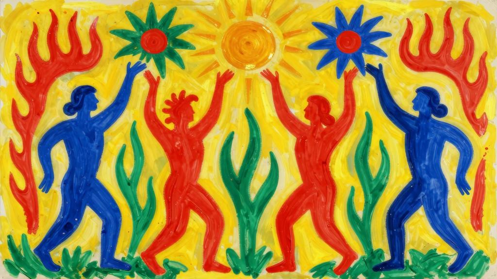

不是结语的结语献给M.A.G.她将目光转向初升的星辰。她说：

“我知道所有星星的名字。每颗星星都有好几个名字，每颗星星也都有不同的力量。在我们看来，星辰的移动是那么宁静，其实它们在飞快地运动，快得几乎要燃烧起来。它们的运行是那样迅疾，光彩夺目，都是因为它们内心燃烧着灼热的欲望。内心隐秘的渴求推动着它们，指引着它们；美妙的热情炙烤着它们，消耗着它们。正是因为这样，它们才如此耀眼辉煌。

“每一颗星辰都相互依存，在引力的作用下彼此联结，每一颗星星都依附于其他星星，也依附于所有的星星。每颗星辰都有既定的轨迹，每一颗都能找到自己的轨道。如果某一颗星星改变自己的路线，势必会牵连其他星星脱离自己的轨道，所有的星星都会相互影响。每颗星星选择的路，都是它应当遵循的那道轨迹；不仅应当遵循，它们也愿意遵循。它们的路，在我们眼中好像是命中注定，但对它们而言，是它们最喜欢的一条路，是它们心之所属的轨道。炫目的爱指引着它们。它们的选择为我们制定了法则，我们必须遵从这些法则，无法摆脱。”
