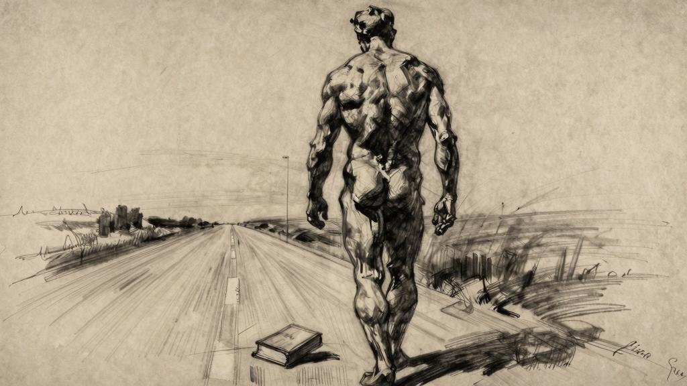

纳桑奈尔，现在丢掉我的书吧。从书里解脱出来吧。离开我。离开我吧。

现在，你开始让我厌烦了，你成了我的累赘，我对你的爱耗费了我太多的精力。

我厌倦了自己这副佯装教书育人的模样。我何时说过希望你变成和我一样的人？——正是因为你与我不同，我才会爱你；我爱的只是你身上与我不同的那一部分。教育！除了我自己，我还能教育谁？纳桑奈尔，你知道吗？我曾没完没了地教育我自己。我还会继续下去。我从来都只依据自己能够做到的事来评价自己。

纳桑奈尔，丢掉我的书吧，千万不要在这本书中寻找满足感。不要相信有人能够为你找到你所希冀的真理，如果你有这样的念头，那真是奇耻大辱。如果我为你准备好食物，你就不会再有胃口；如果我替你铺好床褥，你反而不会再有睡意。

丢掉我的书吧。你得告诉自己，生活有千百种可能，这本书仅仅描述了其中一种。你要去寻找自己的生活。如果一件事别人能和你做得一样好，那你就别做了；如果一件事别人能和你说得一样好，那你就别说了；如果一件事别人能和你写得一样好，那你就别写了。

你只需要专注于非你不可的事物，然后迫不及待地，耐心地，将自己塑造成天地万物中那个不可取代的人。
