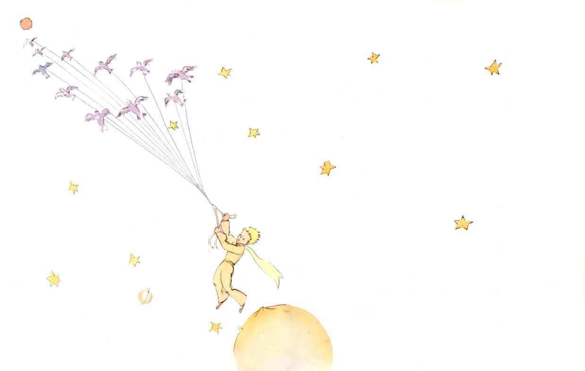

## 序言

献给莱翁·维尔特请孩子们原谅我把这本书献给了一个大人。我有一个正当的理由：这个大人是我在世界上最好的朋友。我另有一个理由：这个大人什么都懂，即使写给孩子们看的书也懂。我还有第三个理由：这个大人住在法国，忍冻挨饿，他很需要有人安慰。要是这些理由还不够充分，我就把这本书献给这个大人童年时代的他。每个大人曾经都是孩子。（然而，记得这事的又有几个呢？）因此，我把献词改为：献给童年时代的莱翁·维尔特
