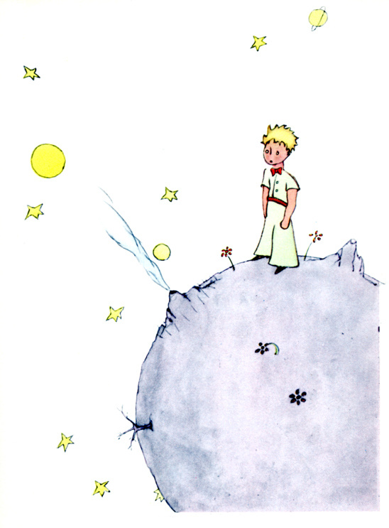
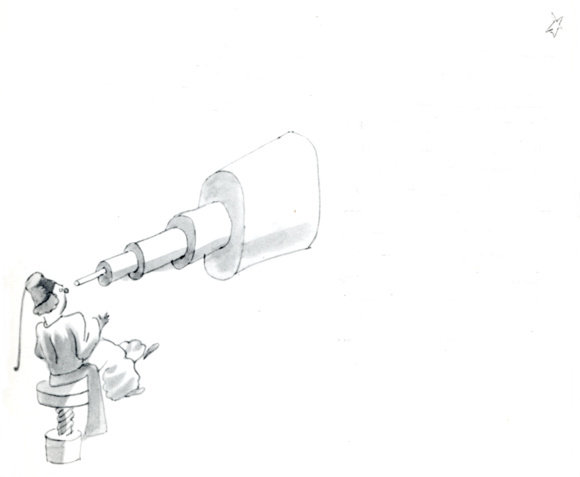
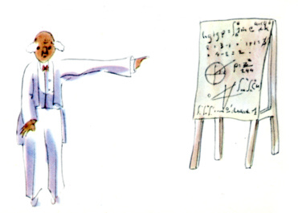
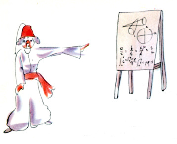

## 第4章

我还了解到另一件重要的事，就是他所在的那个星球比一座房子大不了多少。

这倒并没有使我感到太奇怪。我知道除地球、木星、火星、金星这几个有名称的大行星以外，还有成百个别的星球，它们有的小得很，就是用望远镜也很难看见。当一个天文学者发现了其中一个星星，他就给它编上一个号码，例如把它称作“325 小行星”。

我有重要的根据认为小王子所来自的那个星球是B612 星球。这颗星球仅仅在1909 年被一个土耳其天文学家用望远镜看见过一次。

当时他曾经在一次国际天文学家代表大会上对他的发现作了重要的论证。但由于他所穿衣服的缘故，那时没有人相信他。那些大人们就是这样。

幸好，土耳其的一个独裁者，为了B612 星球的声誉，迫使他的人民都要穿欧式服装，否则就处以死刑。1920 年，这位天文学家穿了一身非常漂亮的欧式服装，像上次一样重新地作了论证。这一次所有的人都同意他的看法。

我给你们讲关于B612 星球的这些细节，并且告诉你们它的编号，这是由于那些大人的缘故。那些大人们就爱数字。当你对大人们讲起你的一个新朋友时，他们从来不向你提出实质性的问题。他们从来不讲：“他说话声音如何啊？他喜爱什么样的游戏啊？他是否收集蝴蝶标本呀？”他们却会问你：“他多大年纪呀？弟兄几个呀？体重多少呀？他父亲挣多少钱呀？”他们以为这样才算了解朋友。如果你对大人们说：“我看到一幢用玫瑰色的砖盖成的漂亮的房子，它的窗户上有天竺葵，屋顶上还有鸽子……”他们怎么也想象不出这种房子有多么好。必须对他们说：“我看见了一幢价值十万法郎的房子。”那么他们就惊叫道：“多么漂亮的房子啊！”

要是你对他们说：“小王子存在的证据就是他非常漂亮，他笑着，想要一只羊。他想要一只小羊，这就证明他的存在。”他们一定会耸耸肩膀，把你当作孩子看待！但是，如果你对他们说：“小王子来自的星球就是B612 星球”，那么他们就十分信服，他们就不会提出一大堆问

题来和你纠缠。他们就是这样的。小孩子们对大人们应该宽厚些，不要埋怨他们。

当然，对我们懂得生活的人来说，我们才不在乎那些编号呢！我真愿意像讲神话那样来开始这个故事，我真想这样说：

“从前呀，有一个小王子，他住在一个和他身体差不多大的星球上，他希望有一个朋友……”对懂得生活的人来说，这样说就显得真实。

我可不喜欢人们轻率地读我的书。我在讲述这些往事时心情是很难过的。我的朋友带着他的小羊已经离去六年了。我之所以在这里尽力把他描写出来，就是为了不要忘记他。忘记一个朋友，这太叫人悲伤了。并不是所有的人都有过一个朋友。再说，我也可能变成那些大人那样，只对数字感兴趣。也正是为了这个缘故，我买了一盒颜料和一些铅笔。象我这样年纪的人，而且除了六岁时画过闭着肚皮的和开着肚皮的巨蟒外，别的什么也没有尝试过，现在，重新再来画画，真费劲啊！当然，我一定要把这些画尽量地画得逼真，但我自己也没有把握。一张画得还可以，另一张就不象了。还有身材大小，我画得有点不准确。在这个地方小王子画得太大了些，另一个地方又画得太小了些。对他衣服的颜色我也拿不准。于是我就摸索着这么试试那么改改，画个大概。我很可能在某些重要的细节上画错了，这就得请大家原谅我了。因为我的这个朋友，从来也不加说明解释。他认为我同他一样。可是，很遗憾，我却不能透过盒子看见小羊。我大概有点和大人们差不多，我一定是变老了。
