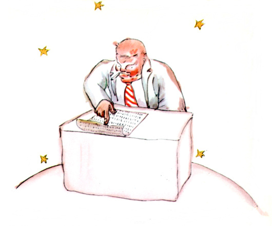

## 第13章

第四个行星是一个实业家的星球。这个人忙得不可开交，小王子到来的时候，他甚至连头都没有抬一下。

小王子对他说：“您好。您的烟卷灭了。”

“三加二等于五。五加七等于十二。十二加三等于十五。你好。十五加七，二十二。二十二加六，二十八。没有时间去再点着它。二十六加五，三十一。哎哟！一共是五亿一百六十二万二千七百三十一。”

“五亿什么呀？”

“嗯？你还待在这儿呐？五亿一百万……我也不知道是什么了。我的工作很多……我是很严肃的，我可是从来也没有功夫去闲聊！二加五得七……”

“五亿一百万什么呀？”小王子重复问道。一旦他提出了一个问题，是从来也不会放弃的。

这位实业家抬起头，说：

“我住在这个星球上五十四年以来，只被打搅过三次。第一次是二十二年前，不知从哪里跑来了一只金龟子来打搅我。它发出一种可怕的噪音，使我在一笔帐目中出了四个差错。第二次，在十一年前，是风湿病发作，因为我缺乏锻炼所致。我没有功夫闲逛，我可是个严肃的人。现在……这是第三次！我计算的结果是五亿一百万……”

“几百万什么？”

这位实业家知道要想安宁是无望的了，就说道：

“几百万个小东西，这些小东西有时出现在天空中。”

“苍蝇吗？”

“不是，是些闪闪发亮的小东西。”

“是蜜蜂吗？”

“不是，是金黄色的小东西，这些小东西叫那些懒汉们胡思乱想。我是个严肃的人。我没有时间胡思乱想。”

“啊，是星星吗？”

“对了，就是星星。”

“你要拿这五亿星星做什么？”

“五亿一百六十二万七百三十一颗星星。我是严肃的人，我是非常精确的。”

“你拿这些星星做什么？”

“我要它做什么？”

“是呀。”

“什么也不做。它们都是属于我的。”

“星星是属于你的？”

“是的。”

“可是我已经见到过一个国王，他……”

“国王并不占有，他们只是进行‘统治’。这不是一码事。”

“你拥有这许多星星有什么用？”

“我拥有这些星星就可以去买别的星星，如果有人发现了别的星星的话。”

小王子自言自语地说：“这个人想问题有点像那个酒鬼一样。”

可是他又提了一些问题：

“你怎么能占有星星呢？”

“那么你说星星是谁的呀？”实业家不高兴地顶了小王子一句。

“我不知道，不属于任何人。”

“那么，它们就是我的，因为是我第一个想到了这件事情的。”

“这就行了吗？”

“那当然。如果你发现了一颗没有主人的钻石，那么这颗钻石就是属于你的。当你发现一个岛是没有主人的，那么这个岛就是你的。当你首先有了一个想法，你就去领一个专利证，这个想法就是属于你的。既然在我之前不曾有任何人想到要占有这些星星，那我就占有这些星星。”

“这倒也是。可是你用它们来干什么？”小王子说。

“我经营管理这些星星。我一遍又一遍地计算它们的数目。这是一件困难的事。但我是一个严肃认真的人！”

小王子仍然还不满足，他说：

“对我来说，如果我有一条围巾，我可以用它来围着我的脖子，并且能带走它。我有一朵花的话，我就可以摘下我的花，并且把它带走。可你却不能摘下这些星星呀！”

“我不能摘，但我可以把它们存在银行里。”

“这是什么意思呢？”

“这就是说，我把星星的数目写在一片小纸头上，然后把这片纸头锁在一个抽屉里。”

“这就算完事了吗？”

“这样就行了。”

小王子想道：“真好玩。这倒蛮有诗意，可是，并不算是了不起的正经事。”

关于什么是正经事，小王子的看法与大人们的看法非常不同。他接着又说：

“我有一朵花，我每天都给她浇水。我还有三座火山，我每星期把它们全都打扫一遍。连死火山也打扫。谁知道它会不会再复活。我拥有火山和花，这对我的火山有益处，对我的花也有益处。但是你对星星并没有用处……”

实业家张口结舌无言以对。于是小王子就走了。

在旅途中，小王子只是自言自语地说了一句：“这些大人们真是奇怪极了。”
