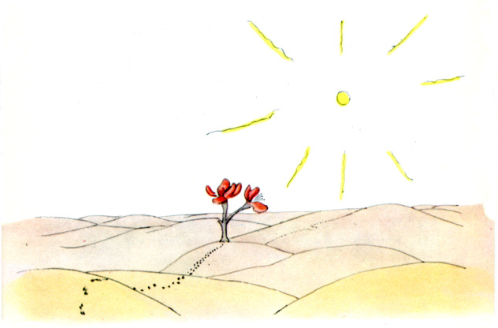

## 第18章

小王子穿过沙漠。他只见过一朵花，一个有着三枚花瓣的花朵，一朵很不起眼的小花……

“你好。”小王子说。

“你好。”花说。

“人在什么地方？”小王子有礼貌地问道。

有一天，花曾看见一支骆驼商队走过：

“人吗？我想大约有六七个人，几年前，我看见过他们。可是，从来不知道到什么地方去找他们。风吹着他们到处跑。他们没有根，这对他们来说是很不方便的。”

“再见了。”小王子说。

“再见。”花说。
