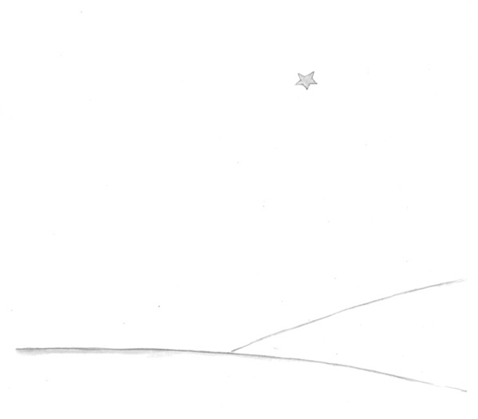

## 第27章

到现在，一点不错，已经有六年了……我还从未讲过这个故事。同伴们重新见到了我，都为能看见我活着回来而高兴。我却很悲伤。我告诉他们：“这是因为疲劳的缘故……”

现在，我稍微得到了些安慰。就是说……还没有完全平静下来。可我知道他已经回到了他的星球上。因为那天黎明，我没有再见到他的身躯。他的身躯并不那么重……从此，我就喜欢在夜间倾听着星星，好象是倾听着五亿个铃铛……

可是，现在却又发生了不寻常的事。我给小王子画的羊嘴套上，忘了画皮带！他再也不可能把它套在羊嘴上。于是，我思考着：“他的星球上发生了什么事呢？大概小羊把花吃掉了吧……”

有时我又对自己说，“绝对不会的！小王子每天夜里都用玻璃罩子罩住他的花，而且他会把羊看管好的……”想到这里，我就非常高兴。这时，所有的星星都在柔情地轻声笑着。

忽而我又对自己说：“人们有时总免不了会疏忽的，那就够呛！某一天晚上他忘了玻璃罩子，或者小羊夜里不声不响地跑出来……”想到这里，小铃铛都变成泪珠了！

这真是一个很大的奥秘。对你们这些喜欢小王子的人来说，就象对于我来说一样，无论什么地方，凡是某处，如果一只羊（尽管我们并不认识它），吃了一朵玫瑰花，或是没有吃掉一朵玫瑰花，那么宇宙的面貌就全然不同。

你们望着天空。你们想一想：羊究竟是吃了还是没有吃掉花？那么你们就会看到一切都变了样……

任何一个大人将永远不会明白这个问题竟如此重要！

在我看来，这是世界上最美、也最凄凉的景色。我再画上一遍，是为了引起你们注意。这里，就是小王子在地球上出现，然后又消失的地方。有一天，你们若去非洲沙漠旅行，请仔细认一认这个景色，免得当面错过了。你们若有机会经过那里，我请求你们，不要匆匆离去，在这颗星下守候片刻。倘若有个孩子走到你们跟前，倘若他在笑，有一头金发，不回答人家提出的问题，你们就可猜到他是谁了。那时，劳驾你们！不要让我老是这么忧伤，赶快写信告诉我：他回来了……
