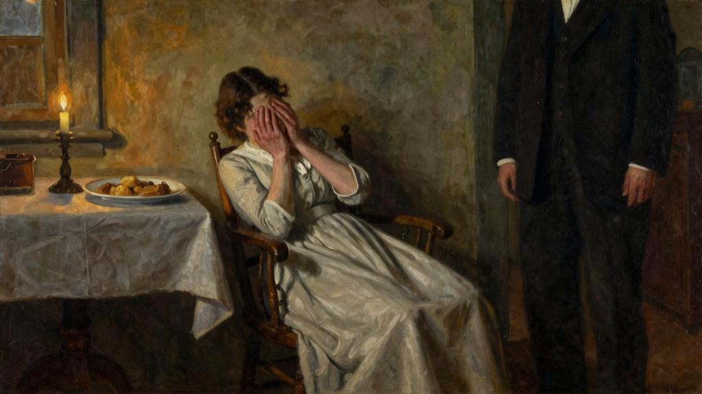
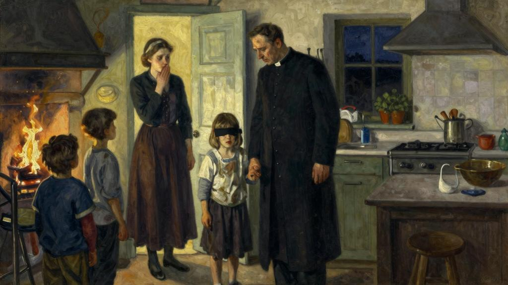

今夜雪还是下得很大。孩子高兴极了，因为他们说不久必须翻窗户出去了。事实也是，上午大门已被封住，从洗衣间才能出入。昨天，我得到证实，村子里有足够供应的粮食什物，因为可以肯定我们将有一段时间要与世隔绝了。这也不是第一个冬天我们被雪围困，但是雪积得那么厚，我记不起以前曾经见过。我还是趁机把昨日开始的事情继续写下去吧。

我说过，当我把那个残疾少女带回来时，没有仔细考虑过她在我的家里将占一个什么样的位子。我认识到妻子会有所不满；我也知道我们能够支配的房间和财力都很有限。我一贯我行我素，既出于天性，也出于原则，毫不考虑冲动之下会给自己带来多少额外支出（我一直认为这是反福音精神的）。但是信赖上帝与把任务交给别人完成，那是不同的事。

我不久感到我放在阿梅莉肩上的一份担子，重得我自己也惶惑不安起来了。

我先是尽力帮助她给少女剪头发，我看出她做这事已经不胜厌恶。但是给她全身擦洗，我只得让妻子去做了；我明白最繁重、最不愉快的活儿都不是由我干的。

目前来说，阿梅莉决不再出半点怨言。仿佛夜里经过一番深思熟虑后，她决定承担这项新任务；她好像做得不是没有一点儿乐趣，我看到她给吉特吕德梳洗完毕以后还笑了一笑。她的头发剃光，我在头上涂了油膏，戴上一顶白帽子；她的一身褴褛给阿梅莉扔进了火里，换上了萨拉的几件旧衣服和干净内衣。孤女不知道自己叫什么，我也不清楚到哪里去打听，既然无从得知她的真名，夏洛特给她取名吉特吕德，立刻得到大家一致同意。她大约比萨拉稍为小一点，因此萨拉一年前穿过不用的衣服给她穿上很合身。

我在这里必须承认，最初几天我心情抑郁，感到深深的失望。我对吉特吕德的教育肯定是想入非非的，现实迫使我降低期望。她脸上冷漠迟钝的表情，或者不如说根本没有表情，使我的一股热忱彻底冷了下来。她终日待在炉子旁边，时刻保持戒心，一听到我的声音，尤其当有人走近她时，她的脸好像绷了起来。通常麻木的面孔在表示敌意时才变得有生气了；只要我们有意引起她的注意，她开始鸣咽，嚎叫，像一个动物。我端起东西侍候她，用餐时，她收起小性子，扑了上来，贪吃的样子简直像只野兽，看在眼里叫人非常难受。我感觉到在这个灵魂面前遭到顽固的拒绝，内心也对她产生了一种反感，因为情还是要情来还的。是的，说真的，我承认起初十天我到了绝望的地步，甚至对她不再关心，也对自己的最初冲动感到反悔，真愿意根本没有把她带回家来。还有一件刺痛我的事，我的这些想法对阿梅莉是无法掩饰的，这使她有点儿得意，自从她觉得吉特吕德成了我的一个负担，她在我家出现是对我的羞辱后，她反而显得殷勤起来，心地也好像更加善良了。

当我接待我的朋友马尔丁医生时，我就处在这样的境地，他从瓦尔特拉凡尔一路探视病人过来。我对他谈起吉特吕德的情况，他对这个问题很感兴趣，女孩总的说来只是个盲人，心灵却是那么愚顽，叫他大为惊讶；但是我对他解释，她是瞎子，又加上从前抚养她的老妇人是聋子，从来不跟她谈话，以致那个可怜的孩子一直无人过问。他劝我说，既然这样我就没有理由绝望；还说这是我处理得不好。

“还没有弄清地基是否结实以前，”他对我说，“你就要开始造房子。你想想她的头脑里还是混沌一片，甚至最基本的概念也没有形成。一开始把某些可以触摸和有味道的感觉分门别类，然后在上面像贴标签似的给它一个音、一个字，你念给她听，直到听厌为止，然后设法让她重复给你听。

“尤其不要追求走得快；定下几个时间教她，一次时间不要太长……

“此外这种方法，”他在跟我详细说明以后还加了一句，“决不是什么旁门邪说。这不是我的发明，有人早已应用过了。你不记得吗，我们一起学哲学时，我们的教授提到孔狄亚克[3]和他的活雕像时，已经跟我们谈到类似这样的一个病例。”他想了一想又说，“也可能是我后来在一本心理学刊物中读到的……那无所谓；这件事使我很吃惊，我还记得那个可怜的女孩子的名字，她比吉特吕德还惨，因为不但是瞎子，还是聋哑人，我不知道英国哪个郡的医生在上世纪中叶收留了她。她的名字叫劳拉·勃里吉曼。这名医生留下一部日记——你也可以这样做——记录了女孩的进步，还有至少在开始时期他对她进行教育的努力。他坚持要她轮流触摸两个小物件，一只别针和一支笔，然后在盲人使用的凹凸纸上触摸两个英文词，别针和笔。一连几个星期他毫无收获。这个躯体里好像没有灵魂似的。可是他不灰心。他说，他好像一个俯在井口的人，井里又深又黑，他绝望地抖动一根绳子，盼望最后有一只手抓住它。因为他一刻也不怀疑有一个人在井底，这根绳子终会被抓住的。终于有一天，他看到劳拉这张木然的面孔闪过一丝微笑；我相信在那个时刻，感激与爱的眼泪从他的眼睛里流了出来，他跪下来感谢主。劳拉也一下子明白了医生对她的一番苦心；她得救了！从这天起她专心了；她的进步很快；她不久进行自学，后来当了一所盲人学校的校长——大家都不相信……因为最近其他病例也相继出现，报刊上登载长篇文章议论，谁都觉得不可思议，他们认为这样的人居然还会幸福，这个想法依我看来有点儿愚蠢。而这是事实：每个心灵封闭的人也是有幸福的。他们一有机会表达自己的意思，就是说到自己的幸福。记者们当然欣喜若狂，借此教育那些‘享有’五官功能还要怨天尤人的人……”

这时马尔丁与我两人争论起来，我反对他的悲观主义，决不像他那么认为五官的感觉到头来使我失望。

“这可不是我要说的意思，”他分辩说，“我说的意思只是人的灵魂更容易、更愿意去想象美、舒适与和谐，而不是无序与罪恶，正是无序与罪恶把这个世界搞得乌烟瘴气、四分五裂，而我们的五官既帮助我们了解，同时又鼓动我们推波助澜。因而我更乐意追随维吉尔这句名言：‘不知其恶，何等幸福’，而不是人们教我们的‘自知其善，何等幸福’；人若不知道恶，有多么幸福啊！”

然后他跟我说起狄更斯的一则短篇小说，他相信直接受到劳拉·勃里奇曼事例的启发，他答应不久把那部书寄给我。四天后我果真收到了《炉边蟋蟀》，我饶有兴趣地读完。故事有点儿长，但是有些篇章凄恻动人，写一个生产玩具的穷父亲，有意制造假象，让他的盲女儿幻想生活在舒适、富裕、幸福的环境中；这是一场骗局，狄更斯借用艺术竭力把它渲染成一片虔诚，但是感谢上帝！我不会跟吉特吕德玩弄这一套把戏的。

马尔丁来看过我后的第二天，我开始一丝不苟实践他的方法，我现在后悔，当初没有像他劝我的那样，记录下吉特吕德在这条走向黎明之路的最初几步，其实我也是一边摸索一边引着她走。开头几个星期所需的耐性超出大家的想象，这种启蒙教育不但需要时间，还要我忍受由此引起的谴责。叫我难于启齿的是这些谴责来自阿梅莉。此外我在这里提到这件事，不是我对这件事怀有任何不满和怨恨—— 我庄严作证，以防今后这些文字被她读到。（基督不是在“迷途羔羊”的比喻后立即教育我们要宽恕侮辱么？）我还要说明，就是受她谴责而最感难受的时候，我也没有怨恨她不同意在吉特吕德身上花费大量时间。我要责怪她的主要是她对我的努力多少会获得成功一事缺乏信心。是的，这种缺乏信心使我难过，然而没有使我灰心。多少次我不得不听她唠叨：“你要是有效果倒也罢了……”她就是死心眼儿地认为我都是在白操劳；于是在她看来我在这上面浪费时间，而不更好地花在其他地方很不妥当。每次我照顾吉特吕德，她总会向我提出有什么人或有什么事在我背后等着我，我把我该花在其他人身上的时间都花在她身上啦。最后，我相信一种母性的妒忌使她愤愤不平，因为我不止一次听到她对我说：“你对自己的孩子还从来没有那么关心过呢。”这是真的：因为我很爱自己的孩子，但是从来没有想过我必须很好关心他们。

我经常看到有许多人自称是虔诚的基督徒，“迷途羔羊”的比喻却是他们最难接受的。一头羊走失了，在牧羊人眼里会比羊群中其余羊的总数还要宝贵，这道理在他们看来太深奥，无法理解。这些话：“一个人若有一百只羊，一只走迷了路，你们的意思如何？他岂不撇下这九十九只，往山里去找那只迷路的羊么？”这些话充满爱德，光芒照人，他们若敢坦陈心曲，就会宣称这些话体现的不公平最令人愤慨。

吉特吕德的最初几次微笑使我无比欣慰，百倍补偿了我付出的辛劳。因为“这只羊，牧羊人若是找着了，我实在告诉你们，他为这一只羊欢喜，比为那没有迷路的九十九只欢喜还大呢”。有一天早晨她好像突然心里开窍，对我多日来努力教导她的东西有了反应，我看到这张雕像般的面孔开绽一丝微笑，在我简直是看到了天使的笑容，是的，我实在要这么说，我的孩子中没有哪个的笑容会使我这样心花怒放。

那是三月五日。我记下这个日期仿佛这是个生日。这不止是微笑，而是脱胎换骨。她的五官一下子活跃了；这像是豁然开朗，类似阿尔卑斯山巅上的这道霞光，黎明前映着雪峰颤动，然后从黑暗中喷薄出来；简直是一项神秘的彩绘工作；我同样联想到毕士大池子[4]，天使纷纷下池子搅动死水，看到吉特吕德脸上突然出现天使般的表情，我有一种勾魂摄魄的感觉，因为我认为这个时刻占据她内心的不全是智慧，还有爱。于是我心潮澎湃，感恩的心情那么强烈，我在她的美丽的前额印上

一吻，像是我奉献给上帝的。

这个初步的结果有多么艰难，自此以后的进步也有多么神速。今天我努力回忆我们经过了一些什么曲折；有时我觉得吉特吕德仿佛为了嘲弄我的方法简直是在跃进。我记得起初我把重点放在事物的表象而不是种类上；如：热、冷、温、甜、苦、硬、软、轻……然后是动作：隔离、靠近、举起、交叉、横放、打结、分散、集合等等。不久我放弃了一切方法，改为直接跟她交谈，不管她的思想是不是跟得上；但是慢慢地诱导她，鼓励她向我随便提问题。在我由她进行自修时，她的思想肯定也在活动；因为我每次重新见她时，每次都有新的惊奇，我觉得我与她之间横隔的夜幕愈来愈薄。我自忖，春天的和风煦意不就是这样坚持不懈，逐渐战胜冬寒的么。我曾经多少次赞赏积雪融化的情景：表面依然浑圆，底层开始溶解。每年冬天阿梅莉都受迷惑，她对我说：雪总是不变的；大家以为雪还厚着呢，然而已开始塌了下来，处处有生命突然往外冒。

我怕吉特吕德像个老妇人，长年累月待在炉子旁边，会虚弱苍白，开始让她走到户外。但是她只有我携着她才同意出去散步。她一走出屋子，先是感到惊奇和害怕，在她尚不会向我表白以前，使我明白她还从来没有贸然迈出过房门。在我发现她的茅屋里，没有人照管过她，除了给她吃和帮助她不死以外——我还不敢用“活下去”这个词儿。她的黑暗天地只限于她从没离开过的这个单间的四堵墙壁。到了夏天，当门户对着光明的大天地打开，她才大着胆子在门槛上待一会儿。她后来跟我说，她听到鸟的歌唱，以为纯然是光产生的一种作用，就像她在面颊和双手感到暖意的抚拂一样，她也没有深加追究，觉得这是非常自然的，热空气会唱就像水在炉子上会沸腾一样。这是真的，她从不操心，从不注意什么，在麻木不仁中生活，直至那天我开始照管她为止。当我跟她说这啾啾鸣声是有生命的生物发出来的，我至今还记得她表示出无限的喜悦，这些小生命的唯一功能就是感觉和表达大自然中到处遍布的欢

乐。（从这天起她常说：她像鸟那么快乐。）可是想到群鸟歌唱的壮丽 景象她无缘亲眼目睹，她又开始郁郁不乐了。

“真的吗？”她说，“大地真像鸟唱的那么美吗？大家为什么不对我多说说？您为什么不对我这样说？是不是想到我看不见怕说了叫我难受？你错了。鸟声我很会听。我相信它们要说什么我都懂。”

“我的吉特吕德，看得到的人并不像你那么会听。”我对她说，希望安慰她。

“为什么其他的动物不会唱？”她又说。有时她的问题叫我猝不及防，一时会感到狼狈，因为她逼迫我对那些我至今毫不奇怪接受的东西进行思考。这样我生平第一次想到，愈是依赖土地的动物愈是笨重，愈是苦。我努力要她明白这回事，我跟她谈起松鼠以及松鼠的游戏。

她这时问我是不是只有鸟才会飞。

“还有蝴蝶。”我对她说。

“蝴蝶会唱吗？”

“它们有另一种表达欢乐的方法，”我又说，“表现在它们的翅膀上有各种颜色……”我向她描述蝴蝶如何五彩缤纷。

