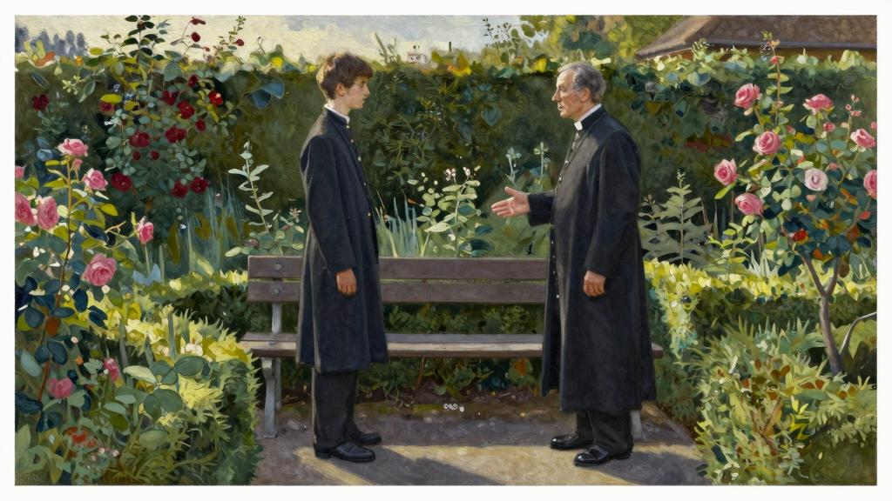
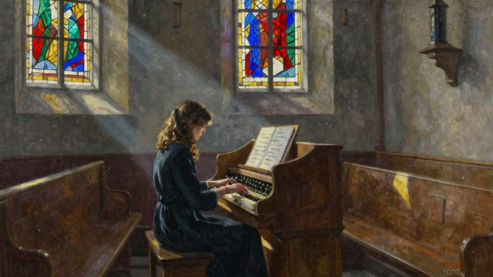

我唯一能叫阿梅莉高兴的，就是不去做她不高兴的事。她唯一允许我做的是完全消极的爱的表示。她把我的生活限制得多么狭隘，这点她是不能够体会到的。啊！她若要求我为她干一件艰难的事，那真是谢天谢地了！我会欢喜若狂，为她赴汤蹈火！但是一切不合惯例的事可以说都使她反感。因而生活的进展在她看来只是增加几个跟过去相似的日子而已。她不期望，甚至不接受我有什么新的美德，甚至在公认的美德上也不能有所增加。哪个人努力要在基督教义中看出除了本能的循规蹈矩之外还有其他，她看着不是不赞同，就是不安心。

阿梅莉托付过我，到了纳沙特尔跟我们的缝纫用品铺子结账，还给她带回一盒线团。我承认把这事忘得一干二净了。但是事后我怪自己比她怪我还厉害哩；尤其我郑重其事地说过决不会忘，也知道“小事踏实的人做大事也很牢靠”，还害怕她对我的遗忘得出什么结论。我真愿意她骂上我几句，因为在这件事上我确实应该挨骂。但是事情往往这样，臆测的怨恨比明确的责备更厉害：啊！人生会更美好，苦难会更容易忍受，如果我们只需应付真正的痛苦，对心灵的魔影和鬼怪不理不睬……我不由在这里记下了可以作为布道内容的这段话（《马太福音》第十二章第二十九节：“不要挂心”）[6]。我在这里要记录的是吉特吕德的心智与道德的发展过程。我还是回到正题吧。

我希望能够在这里一步步追随这个发展过程，我已开始叙述细节。但是因为时间不够，无法对各个阶段详细记录，今天就很难把全过程正确无误地贯穿起来。我沿着故事的脉搏首先提到吉特吕德的思考，其次是跟她的谈话— —这是近期的事。谁在无意中读到这些篇章，无疑会奇怪这么快就听到她表达那么准确，推理那么聪明。她的进步确实神速，令人目瞪口呆。她对我带给她的知识养料，凡是她的智力能够接受的东西，通过不断吸收和成熟的过程，转化成她自己固有的了。她叫我吃惊，不停地走在我的想法的前面，超越我的想法，经常前后两次谈话，我的学生也宛若两个人。

没几个月以后，她的智力一点也不显出曾经那么长时期处于蒙昧状态，甚至大多数少女还没有她那样的悟性，因为她们被外面世界扰得心猿意马，注意力都被无聊的琐事占据了。此外，我相信她的年龄要比我们最初看来明显要大。好像她还有意利用自己的失明，以致我怀疑到在好几方面这个残疾对她是不是个优点。我不由自主地把她与夏洛特比较，当我有几次给夏洛特复习功课时，看到她会为一只飞舞的苍蝇分心，我就想：“就是这么回事，她若看不见，就会好好听我讲了！”

不用说吉特吕德非常渴望阅读；但是由于尽可能追随她的思想发展，我宁可她不要多阅读——至少不要在我面前多阅读——主要是指《圣经》，一名基督徒说这样的话显然很怪。我会在这件事上作解释的；但是在谈到这个十分重大的问题以前，我愿意谈一件有关音乐的小事，我记得是在纳沙特尔音乐会后不久发生的。

是的，这场音乐会我相信是在暑假前三星期开的，暑假又使雅克回到我们身边。在这期间，我不止一次让吉特吕德坐在我们乡村教堂的小风琴前，一般由德·拉·M小姐弹奏，吉特吕德目前就住在她家。路易丝·德·拉·M还没有开始给吉特吕德上音乐课。尽管我热爱音乐，但不很懂行，当我挨着她坐在键盘前，自知没有能力教她什么。

“不，让我自己来吧，”她经过最初摸索后就说，“我宁可一个人试试。”

我也很乐意离开她，尤其在教堂里与她单独相处在我看来不大得体，既出于尊重圣地，也害怕流言蜚语；虽然我对流言蜚语一般是不予以理会的，但是这里牵涉的不只是我，还有她。当什么地方需要我去走访，我就把她带到教堂，让她经常好几个小时留在那里，然后回来时再去接她。她就是这样耐心地寻找悦耳的和声，傍晚时我看到她听着某一个谐音十分专心，长时间出神。

八月初的一个日子，距今约有半年多以前，我去慰问一个穷寡妇，到了她家没有见到。事前我把吉特吕德留在了教堂，就再回那里去找她；她没有料到我那么早回去，而我看见雅克在她身边诧异之至。他们两人谁都没有听到我走进去，我轻轻的脚步声都被琴声盖住了。我这人天性不爱刺探，但是有关吉特吕德的一切都叫我操心，我蹑手蹑脚偷偷走上通往讲经坛的那几级阶梯；从这上面观察一目了然。我应该说的是我待在那里的时候，没有听到一句两个人不会在我面前坦然说的话。但是他挨着她，好几次我看到他拿起她的手引导她的手指如何放在琴键上。以前她跟我说她宁可不要别人观察和指导，却又欣然接受他的，这不是已经叫人奇怪了么？我惊讶和难受的程度就是对自己也不愿承认，我已经准备露面，这时我看到雅克突然掏出他的表来。

“现在我该离开你了，”他说，“父亲快要回来了。”

这时我看到她听任他把自己的手放在嘴前一吻，然后他走了。隔了一会，我又悄无声息地走下阶梯，打开教堂的门，有意让她听到，以为我只是刚走进来。

“嗨，吉特吕德！你准备回去了吗？琴弹得高兴吗？”

“是的，高兴极了，”她说话的声音自然极了，“今天我进步真的很大。”

我心中辛酸难言，但是她与我谁都不提起我刚才说的事。

我急于要跟雅克单独见面。妻子、吉特吕德和孩子平时晚餐后很早就回房里去了，让我们两人在晚间勤奋学习。我等待这个时刻，但是跟他说以前，我心慌意乱，我不会或者不敢提到这个折磨着我的问题。还是他突然打破沉默，向我宣布他决心在我们这里过完整个假期。可是就在几天以前，他向我们提到他要去上阿尔卑斯山的度假计划，妻子和我都曾大为赞成；我还知道他选择的旅伴、我的朋友T还等着他去；所以我很清楚这次突然改变计划不会不跟我闯见的那一幕有关，首先我怒上心头，但是害怕我若大动肝火，儿子从今以后不会对我说心里话，也害怕自己出言不逊会后悔，我努力压制自己，用平时的自然声调对他说：

“我还以为T等着你去呢。”

“哦！”他又说，“他不一定等着我，他不愁没有人代替我。我在这里可以像在奥伯兰一样好好休息，这样利用我的时间，我真的相信要比爬山好。”

“这样说来，”我说，“你在这里找到什么事情干啦？”

他瞧着我，感到我的音调中有点讽刺意味，但是，因为他还不明白其中用意，神色自若地说：

“您知道我一直爱书籍胜过爱登山杖。”

“是的，我的朋友，”这次轮到我瞧着他说，“但是你不认为风琴伴奏更吸引你吧？”

他无疑感到脸红了，因为他把手放到额前，仿佛要遮挡灯光。但是他差不多立即又恢复镇静，说话的语气我本来希望不要那么肯定：

“爸爸，不要过分责怪我。我没有意思要向您隐瞒什么，我正要对您承认时您抢先了一步而已。”

他说话从容不迫，像在念书，一句句说得那么平静，似乎这不是在说他自己的事。他表现出不同寻常的自持力实在把我气坏了。他觉得我要打断他的话，举起手像在对我说，不，您可以接着说，先让我把话说完；但是我抓住他的胳臂摇晃。

“我才不愿意看到吉特吕德的纯洁灵魂给你扰乱，”我冲着他喊，“啊！我宁可不再见到你。我不需要你的承认！欺侮人家有残疾，天真无邪，不懂世道，我决没想到你会干出这么卑鄙可恶的事！谈起来还这样若无其事！你听着我说：吉特吕德由我照管，我一天也不能忍受你跟她说话，你碰她，你看见她。”

“不过，爸爸，”他又说，语气依然那么平静，简直叫我怒不可遏，“请您相信我跟您一样尊重吉特吕德。您认为这里面有什么事见不得人，您是大错特错了，我不说我的行为，就是我的意图和我的内心深处也都没有。我爱吉特吕德，我尊重她不亚于我爱她，跟您实说了吧。扰乱她，欺侮她天真无邪和眼睛瞎，这种想法不单对您、对我也同样可恶，”然后他声称他要对她做的，是当一个扶持人，一个朋友，一个丈夫；在下决心娶她以前他不认为应该对我说；这个决心吉特吕德本人也还不知道，他首先要对我说起。“这就是我要向您承认的事，”他又加了一句，“我没有别的要向您坦白的了。请相信这点。”

他的话叫我听了发懵。我听着这些话时也听到自己的太阳穴在跳。我原来一心只想到责备他，随着他把我发怒的理由驳回，我的神志更加恍惚了，以致等他把话说完，我竟找不出什么话来对他说。

“我们该上床去了。”经过一阵子沉默后我最后说。我站起身，把手放在他肩上。“明天我对你说我对这事的想法。”

“至少跟我说您不再对我发火了。”

“我要在夜里想一想。”

当我第二天见到雅克时，真像是第一次才对他瞧个仔细。我一下子觉得我的儿子不再是个孩子，而是个青年了；我若老是把他看成是个孩子，我闯见的这幕爱情在我看来好像令人发指，我整个夜里都在劝说自己，这样的事情纯属自然正常。我的不满情绪却愈发强烈，又是怎么一回事呢？那是以后我才渐渐明白的。目前我必须对雅克说出我的决定。这时一种本能，也像良心一样确切无疑，警告我自己要不惜一切代价阻止这桩婚姻。

我把雅克拉至花园深处；到了那里我首先问他：

“你向吉特吕德表示过爱吗？”

“不，”他对我说，“可能她已经感到我的爱；但是我没有向她明说。”

“那好！你向我承诺今后不向她提这件事。”

“爸爸，我答应过听您的话；但是我可以了解您的理由吗？”

我犹豫要不要对他说，我也不太明白首先出现在我脑海中的理由是不是应该首先提出的理由。说实在的，在这里指导我行为的是良心而不是理智。

“吉特吕德太年轻了，”我终于说，“你想她还没有领过圣餐。你知道这不是一个普通的孩子，唉！她的发展已经耽误很久了。像她这样对人充满信任的人，第一次听到有人向她求爱，必然会过分激动。就是因为这样不要对她说。冒犯一个不能自我保护的人是一种怯懦行为；我知道你不是一个懦夫。你的感情，据你说的，也没有可以指责的地方；我说这有罪只是因为过早了一点。吉特吕德还不会做事谨慎，我们要替她

谨慎。这是一个良心问题。”

雅克为人这点上很杰出，要制止他只须说这句简单的话：“我向你的良心要求”，在他的儿童时代我经常利用。可是我瞧着他，心里在想，要是吉特吕德能够看到，她也会情不自禁欣赏这个颀长柔软、既挺直又灵活的身材，这个没有皱纹的额头，这个光明磊落的目光，这个稚气未脱的面孔，但是这样的面孔突然笼罩上了一种庄重的神色。他没戴帽子，铅灰色头发留得很长，在太阳穴旁带点儿鬈曲，半掩着耳朵。

“还有这件事我要问你，”我从我们同坐的长椅上站起身时又说，“你以前说你想在后天动身，我请你不要推迟行期了。你应该在外面待上整整一个月；我请你不要把这次旅行缩短一天。这样说定了怎么样？”

“好吧，爸爸，我听您的。”

我觉得他变得苍白极了，就是嘴唇也没有了血色。但是我却自以为得计，他那么快屈服可见他的爱情并不很强烈；我感到一种难以形容的宽心。不过我对他的顺从也很有感触。

“我又见到了我一直爱的孩子。”我轻轻对他说，把他朝我身上拉，吻了吻他的前额。他略微往后退缩；但是我不愿意心存不快。

