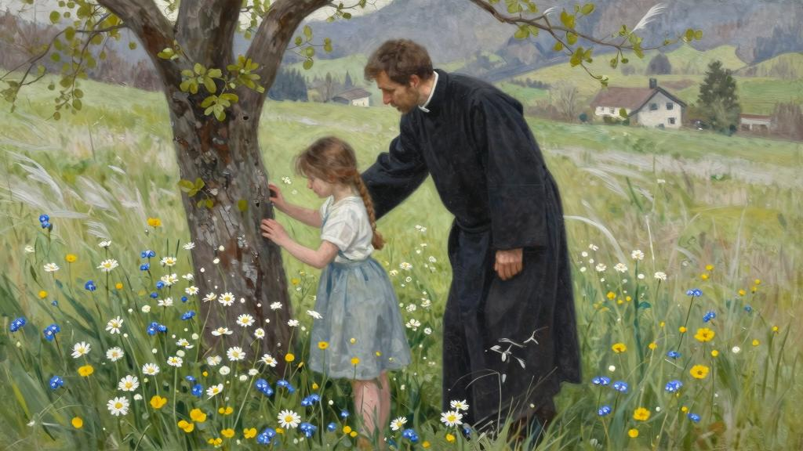

我家的房屋很小，大家不得不挤在一起生活，有时使我工作起来不方便，虽然我在二楼辟出了一个小间，我可以在里面躲开别人或接待访客；逢上我要单独跟一个孩子谈话，而又不想使谈话显得过于严肃，那就更不方便了。在那间会客室里谈话就会这样，孩子们戏称那里是圣地，平时是不许他们进去的；但是今天早晨雅克动身去了纳沙特尔，要在城里买几双旅行鞋；又由于阳光十分灿烂，孩子们吃了早饭后就和吉特吕德一起出去了，大家领着她，同时又被她领着。（我在这里高兴地提到夏洛特对她关怀备至。）到了午茶时刻，自然只剩下阿梅莉和我两人，我们总是留在共用的客厅里喝茶。这正是我希望的，因为我急于要和她谈话。我和她面对面的机会真是少得可怜，我竟像是感到了胆怯，想到我的谈话的重要性心里发慌；仿佛要谈的不是雅克的心曲，而是我自己的心曲。在说话以前，我也感到共同生活、彼此相爱的两个人也会是（或变成）对方的一团谜，中间隔了一道墙；在这种情况下，不论我们向另一个人说的话。还是另一个人向我们说的话，听起来非常凄凉，像是探测锤在试敲几下，看看隔离墙的厚度，若不加小心，这道墙头还会增厚……

“昨天晚上，还有今天早晨，雅克对我说，”她沏茶时我开始说昨天雅克的声音有多么坚定，我的声音也有多么颤抖——“他对我说起他爱吉特吕德。”

“他对你提起这件事做得很对。”她说，没有瞧我，也没有放下手头的家务活，仿佛我向她宣布一桩非常自然的事，或不如说仿佛我什么也没有告诉她。

“他对我说他想娶她；他决心……”

“这事早就可以预料到的。”她喃喃说，轻轻耸肩膀。

“那么你早有所怀疑了？”我说，带点儿神经质。

“这件事看在眼里已有很久了，只是男人不会注意罢了。”

因为反驳没有多大意思，再说她的抢白中可能也有对的地方，我只是表示一下异议：

“这样的话你早就可以提醒我啦。”

她嘴角一抿，露出一丝痉挛似的微笑，有时她就用这种微笑伴随和掩饰她的不情愿，她摆动侧着的脑袋：

“你不会注意的事都要由我来提醒么！”

这句含沙射影的话指什么呢？我不知道，也不想知道，我绕过这个话题：

“反正我是想听听你对这件事的看法。”

她叹口气，然后说：

“你知道，我的朋友，我一直不赞成这个女孩由我们收留下来。”

看到她又旧事重提，我好不容易才不发火。

“吉特吕德在这里的事不谈。”我说。但是阿梅莉已经往下说：

“我一直在想这不会带来什么好事。”

我渴望我们趋于一致，听了这句话很称心。

“那么你认为这么一桩婚事不是什么好事。那好。我要听你说的就是这句话；很高兴咱们想到一块儿去了。”我还说我向雅克提出我的理由时他倒也很听话，以致她也不用再为此担忧了，这都说定了，他明天去旅行，在外面过上整整一个月。

“我不见得比你更愿意他回来见到吉特吕德还在这里，”我最后说，“我想到最终还是把她托给德·拉·M小姐，在她家我可以继续去看她；因为我毫不隐瞒我对她是负有真正责任的。我不久前向新房东探过口风，她乐意为我们效劳。这样少了一个叫你烦的人，你也可以松口气。路易丝·德·拉·M照顾吉特吕德；她对这样的安排显得很高兴；她已经很高兴给她上起了音乐课。”

阿梅莉好像决心保持沉默，我又说：

“免得雅克瞒了我们到那里去找吉特吕德，我相信最好还是把情况告诉德·拉·M小姐，你认为怎么样？”

我提出这个问题试图引她说一句话，但是她抿紧嘴唇，好像发誓什么话也不说一句。我继续说，不是有什么话要补充，而是因为我忍受不了她的沉默。

“还有，雅克旅行回来也可能早已忘了爱情。在他那个年纪的人懂不懂得自己的欲望？”

“哦！即使年纪大的人也不见得懂自己的欲望吧。”最后她阴阳怪气说了一句。

她的谜语般、判决书式的声调叫我听了发恨，因为我这人生性直率，不习惯那些故弄玄虚的话。我朝她转过身，要求她给我解释一下她这里面含有的意思。

“没什么，我的朋友，”她悲哀地说，“我只是想起你一会儿以前，还希望人家把你没有注意到的事提醒你呢。”

“那又怎么啦？”

“怎么啦，我对自己说要提醒也不容易。”

我说过我讨厌故弄玄虚；原则上我从不去揣测什么弦外之音。

“你要是愿意我听懂你的话，你尽管说得明白一点。”我又说，可能说得有点粗暴，立刻又感到后悔，因为我看到她的嘴唇哆嗦了一下。她转过头去，然后站起身在房间犹犹豫豫，也像磕磕绊绊走了几步。

“你说呀，阿梅莉，”我大声说，“现在不都恢复原状了么，你还难过什么呢？”

我感觉我的目光使她难受。我对她说时，转过背，肘子靠在桌子上，手托着头：

“对不起，刚才我对你说话很生硬。”

这时我听到她向我走过来，然后我感觉她的手指轻轻放在我的额头上，她的声音温柔而又带着哭腔对我说：

“我亲爱的朋友！”

然后她立刻离开了房间。

阿梅莉的话，在我看来故弄玄虚，不久以后逐渐叫我明白过来了。这些话我原封不动地记了下来；那天我只是明白这是吉特吕德应该走的时候了。

