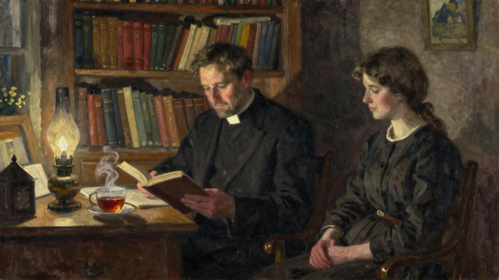

我给自己确定一项义务，每天给吉特吕德留出一点时间；根据每天的工作安排留几小时或者几分钟。在我跟阿梅莉谈话后的第二天，我相当清闲，又加上天气晴朗，我带着吉特吕德穿过树林，直至汝拉山脉的豁口；在这里，风和气清时，目光通过交叉的树杈，越过一层淡雾，会在广袤田野的另一边发现阿尔卑斯山的雪顶美景。当我们抵达常坐的地方，太阳已经在左边斜落。脚下伸展着一片低矮浓密的草地，远处有几头奶牛在啃草；山区的牛群放牧时，每头牛脖子上都挂一个铃。

“铃声也在描绘风景。”吉特吕德听着铃声叮当说。

她像每次散步时一样；要求我向她描述我们待的地方的风景。

“但是，”我对她说，“这里你熟悉的，就是看得见阿尔卑斯山的那个森林边缘。”

“今天阿尔卑斯山看得清楚吗？”

“山里的壮丽景色一览无遗。”

“您跟我说过阿尔卑斯山每天都有点儿不同。”

“今天我把它比作什么呢？比作夏日的干渴。黄昏以前阿尔卑斯山就要溶解在空气中了。”

“我要您告诉我，我们面前的大草地上有没有百合花？”

“不，吉特吕德；这样的高山上不长百合花；或者只长些稀有植物。”

“人家不是说野地里的百合花吗？”

“野地里是不长百合花的。”

“就是纳沙特尔附近的野地里也不长吗？”

“野地里不长百合花。”

“那么主为什么对我们说：‘瞧野地里的百合花’？”

“既然是主说的，他那个时代就是有的了。但是人的庄稼使它们绝了种。”

“我记得您经常对我说，大地上最需要的是信任和爱，您不认为人抱着更多的信任又会看到野地里的百合花吗？当我听到这句话时，我向您保证，我是看到的。我来给您描述野地里的百合花，您要听吗？像是火红的小钟，蓝色的大钟，洋溢爱的芬芳，在黄昏的风中摇摆。您为什么要对我说我们面前没有呢？我感觉到的！我看到草地上都是！”

“我的吉特吕德，这些百合花不会比你看到的更美。”

“您要说也不会没我看到的那么美。”

“跟你看到的一样美。”

“‘我要告诉你们，就是所罗门极荣华的时候，他所穿戴的，还不如这花一朵呢！’”她引用基督的比喻，听她说得那么婉转动人，我觉得我还是第一次听到这句话。“极荣华的时候”，她若有所思地反复说，然后她有一会儿沉默不语。我又说：

“吉特吕德，我跟你说过这话：有眼睛的人是不知道看的人。”我从心底听到这声祈祷升起：“主啊，我感谢你，因为你将这些事，向聪明通达的人，就藏起来，向婴孩就显出来！”

“您要是知道，”她趁一时兴奋大叫了起来，“您要是能够知道，这一切在我多么容易想象那就好了！您要不要让我给您描述一下风景？在我们背后，左右上下，都是巨大的枞树，发出树脂的香味，枣红色树干上斜伸出长大的黑树枝，被风吹得弯下来时就吱吱嘎嘎响。在我们的脚下，色彩斑斓的大草地像一部打开的书，斜放在山坡书桌上，在黑影下它发蓝，在阳光下它放黄光，上面的花朵——龙胆花、银莲花、毛茛花、美丽的所罗门百合花——像文字一样历历分明。母牛带着它们的项铃来认字，天使也过来阅读，因为您说人的眼睛是闭着的。在书的下方，我看到一条奶白色大河，烟雾腾腾，遮住山谷充满神秘，一条无边无际的大河，流到离我们前面极远的地方才看得见岸，那是天光闪闪的美丽的阿尔卑斯山……那里是雅克要去的地方。告诉我，他明天动身是真的吗？”

“他明天要走的。这是他告诉你的？”

“他没有告诉我。但是我明白，他要有很长时间不在这里吗？”

“一个月……吉特吕德，我要问你……你为什么不把他来教堂找你这件事告诉我？”

“他来找过我两次。哦！我不愿意向你隐瞒什么！但是我怕叫您不好受。”

“你不告诉我才叫我不好受哩。”

她的手搜索我的手。

“他要走很伤心。”

“吉特吕德，告诉我……他跟你说过他爱你吗？”

“他不曾跟我说过；但是我不用人家说就感觉得到的。他不像您那么爱我。”

“吉特吕德，你看到他走难受吗？”

“我想他还是走的好。我没法回报他。”

“但是你说，你看到他走难受吗？”

“牧师，您知道我爱的是您……哦！您为什么把手抽回去啦，您要是没有结婚我就不会跟您这样说了。但是谁也不会娶一个瞎眼的姑娘的。那么我们为什么就不能相爱呢？牧师，您说，您觉得这不好吗？”

“爱决不会是不好的。”

“我觉得自己心中只有一片好意。我不愿意叫雅克难受，我愿意谁都不要因为我难受……我愿意给人的是幸福。”

“雅克想过要向您求婚。”

“您让我在他走以前跟他谈一谈吗？我要他明白他应该放弃对我的爱情。牧师，您明白的，是不是，我是谁也不能嫁的？您让我跟他谈一谈，可以吗？”

“今晚谈吧。”

“不，明天，他动身的时候……”

太阳在绚丽彩霞中下山了。空气温和。我们站起来，一边说，一边沿着黄昏的小路回去。

