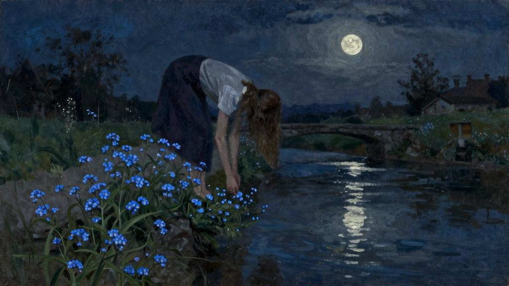
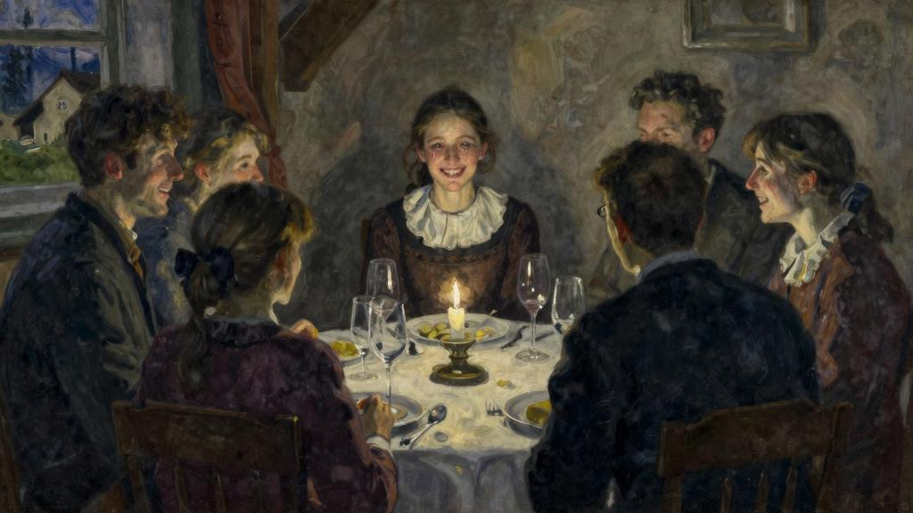

我陷入了多么可怕的黑夜！怜悯我吧，主啊，怜悯我吧！我放弃爱她，但是您，不要让她死去！

我怕得多么有道理啊！她做了什么？她要做什么？阿梅莉和萨拉对我说，陪她走到了“谷仓”的门前，德·拉·M小姐在里面等她。她就是要往外走……发生什么啦？

我努力理清我的思绪。他们跟我说的事无法理解，或者相互矛盾，在我心里形成一团乱麻……德·拉·M小姐的园丁刚才把她送回“谷仓”，她已不省人事；他说他之前看到她沿着河走，然后跨过花园的桥，然后弯下身，然后人影不见了；但是他起先不明白她会掉下去，没有按照常理急于奔过去；他在小水闸附近找到她的，流水把她冲到了那里。当我稍后见到她时，她还是没有苏醒过来；或者至少又陷入了昏迷，因为用药以后她醒来过一阵子。上帝保佑，幸好马尔丁还没有离开，他也难以解释她怎么会陷入这类木僵和无痛苦的状态；他问了她也没用；可以认为她什么也没听见或者她铁了心不开口。她的呼吸一直很急促，马尔丁害怕肺充血；他使用了芥子泥和吸杯，答应明天再来。错误的是大家忙于抢救，没顾到把她裹在身上的湿衣服脱下；河水冰冷刺骨，德·拉·M小姐一个人曾从她嘴里听到几句话，说她要采几朵在河岸一边盛开的勿忘我，她还不善于计算距离，或者把浮动的花毯当作了实土，她突然一脚踩空……这话我能相信吗？我若使自己相信这只不过是一件意外事故，我的灵魂可以卸下多么可怕的重担！那顿饭吃时还是快快活活，但是她的面孔自始至终保持那种奇异的笑容，叫我不安；这是一种勉强的笑容，我从未见她有过，但是我竭力去相信这是她目光新了，笑容也变了。这种笑容仿佛从她的眼睛里流淌出来，像泪水似的落在我的脸上，相比之下其他人鄙俗的欢乐叫我气恼。她没有加入大家的嬉笑！可以说她发现了一个秘密，要是我单独跟她一起无疑会告诉我的。她几乎不说一句话；但是这并不奇怪，因为跟其他人一起时，别人闹得愈凶的时候，她经常是不出一声的。

主啊，我求您，允许我对她说话。我需要知道，不然我怎么度过余生呢？可是如果她坚持不愿意活下去，是不是正好说明已经知道了呢？知道什么？我的朋友，到底什么可怕的事让您知道了？我对您隐瞒了什么事叫您突然看到后会自寻短见呢？

我在她床头度过两个多小时，眼睛一刻不离开她的额头，她的苍白的面颊，她的清秀的眼皮，带着一种说不出的忧伤紧闭着，她的湿漉漉的头发像海带似的散披在枕头上——我还听着她的不均匀和不顺畅的呼吸音。

