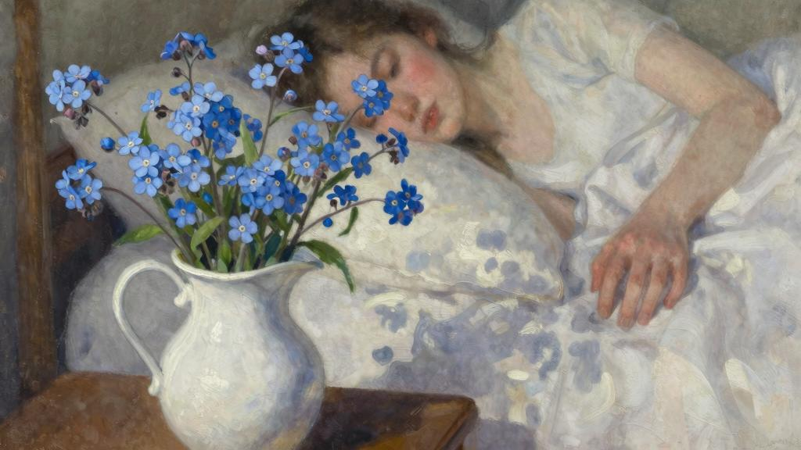
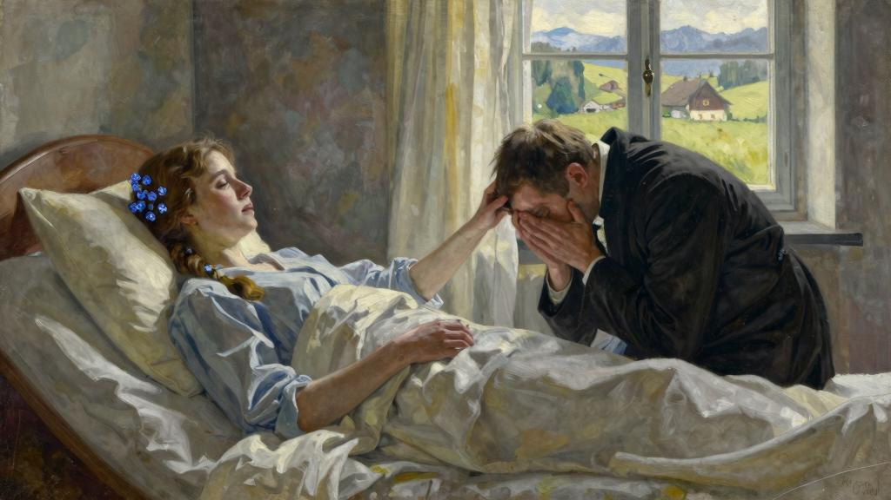

我正要去“谷仓”的时候，路易丝小姐差人来叫我。经过一个较为平静的夜晚，吉特吕德终于脱离麻木状态。当我走进她的房间，她对我微笑，向我示意走到她的床头。我不敢问她，毫无疑义她也害怕我的问题，因为她立即对我说话，好像为了防止一切感情冲动：

“我在河面上要采的这些蓝色小花，你们是怎么叫的？蓝得像天空的颜色。你手脚比我利落，愿意给我去釆一束来吗？我要放在床边……”

她的声音有意装得高高兴兴，叫我听了难受，她肯定也看在眼里，因为她又较为认真地接着说：

“今天早晨我不能对您说：我太累了。您去给我采花吧，好吗？您过会儿回来。”

当我一小时后给她带回一束勿忘我，路易丝小姐对我说吉特吕德又休息了，在晚上以前不能见我。

今天晚上我又见到她了。她的床上堆了几只靠垫，撑着她几乎坐了起来。她的头发现在编成辫子盘在头上，还插了我给她带回来的勿忘我。

她肯定在发烧，显得气喘吁吁。我向她伸出手，她揣在发烫的手中不放；我在她旁边站着。

“牧师，我应该向您承认一件事，因为我怕我今晚会死去。”她说，“今天早晨我向您撒了谎……这不是为了去采花……我要是跟您说

我要自尽您原谅我吗？”

我跪倒在她的床边，把她的虚弱的手握着不放；但是她拉出手开始抚摩我的额头，而我把面孔埋在被子里不让她看见我的眼泪，听到我的呜咽。

“您认为这样做很不对吗？”她又温柔地说；因为我一句也没有回答。

“我的朋友，我的朋友，您很明白，我在您的心中、您的生活中占据了太多的位子。当我回到您的身边，我立刻就看了出来；或者至少我占的那个位子是另一个人的位子，那个人为此很伤心。我的罪孽是没有更早地感觉到这一点，或者至少——因为我早就知道了——是一直让您还是这样爱着我。但是当她的面孔一下子在我面前出现，当我看到她的愁脸上那么深刻的悲伤，我想到这份悲伤都是由我造成的，我就忍受不了了……不，不，您不要责备自己；但是让我离开吧，让她重新快乐吧。”

她的手停止抚摩我的额头；我抓住她的手，在上面吻个不停，盖满泪水。但是她不耐烦地抽回手，一种新的焦虑开始使她激动。

“这还不是我原来要说的话，不，我要说的不是这个。”她反复说；我看到她的额头上冒汗。然后她低下眼皮，闭了一会儿眼睛，好像要集中思想，或者恢复原先的失明状态；她的声音开始拖沓颓丧，但是当她张开眼睛时立刻又升高，然后激动到了刺耳的程度：

“当你们给我光明时，我张开眼睛看到的是一个我从未梦想有那么美的世界；是的，真是这样，我没有想到白天那么亮，空气那么晶莹，天空那么辽阔。不过我也没有想到人的额骨那么突出；当我走进你们的家，您知道吗，首先让我看到的……啊！我还是应该跟您说的：我首先看到的是我们的错，我们的罪。不，请不要争辩。您记得基督那句话：‘你们若瞎了眼，就没有罪了’。但是现在我看见了……牧师，您站起来。坐到我身边来。听着我，别打断我。在我住院的那段时间，我读了，或者不如说，我让人家给我读了《圣经》中我还不知道，您也从不向我念的几个章节。我记得圣保罗的一段话，我整天反复念：‘我以前没有律法是活着的，但是诫命来到，罪又活了，我就死了。’”

她说的时候，情绪激动万分，声音高昂，最后几句话几乎叫了起来，因而我想到外面可能会听到而觉得难堪；然后她又闭上眼睛，把最后几句话又重复一遍，嗫嗫嚅嚅像在说给自己听似的：

“罪又活了 我就死了。”

我全身战栗，心冰凉，充满恐惧。我愿意引开她的思路。

“谁给您念这几段话的？”我问。

“是雅克，”她说时张开眼睛，盯着我看，“他当了修士，您知道吧？”

这太过分了；我正要恳求她别提啦，但是她已经继续往下说：

“我的朋友，我要给您带来很多痛苦；但是我们之间不应该有任何谎言。当我看到雅克，我顿时明白我爱的不是您，而是他。他确确实实有您的这张面孔；我要说的是我想象中您有的那张面孔……啊！您为什么要让我回绝他呢？我是会嫁给他的……”

“但是，吉特吕德，你现在还可以嫁给他。”我绝望地大喊。

“他已经进了隐修院。”她愤愤地说。然后她哽咽得全身战栗：“啊！我愿意向他忏悔……”她在神思恍惚中呻吟：“您看得很清楚我只有死的分了。我口渴。请您去找个人来。我透不过气来了。让我一个人待着吧。啊！我原来希望跟您这样说了以后会心里轻快些。请离开我吧。我们相互离开。我看到您会受不了……”

我离开她。我把德·拉·M小姐叫来……代我守在她身边；她激动过度，使我担心一切都会发生的，但是我也必须相信我待在那里只会加重她的病情。我请求他们有什么三长两短务必通知我。