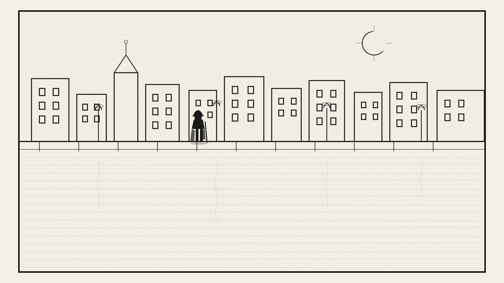
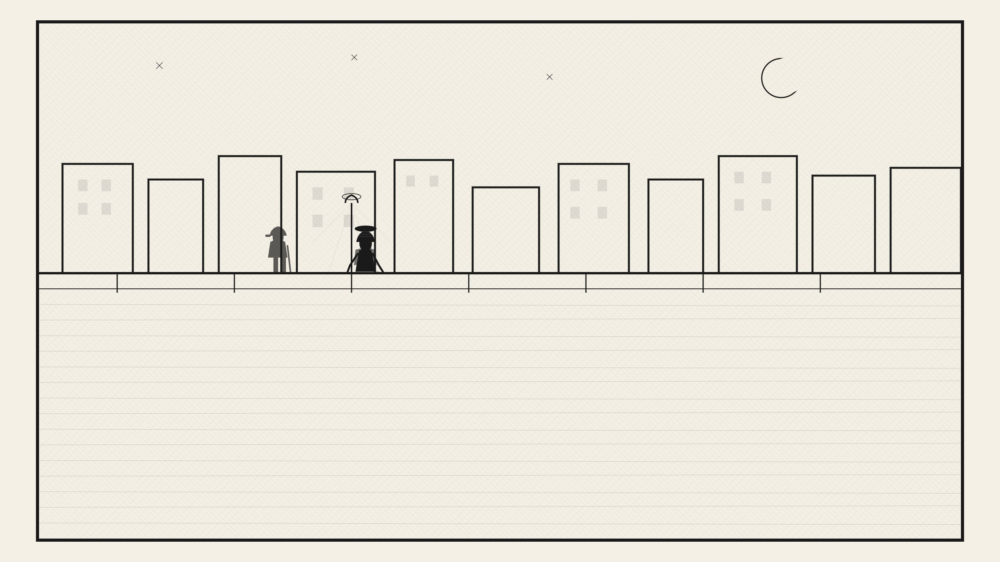

那是美妙的一夜。那样的夜晚，亲爱的读者，大概只有在我们年轻幼稚的时候，才会出现。那时天空繁星闪耀，清新透明。举目一望，你会情不自禁地反问自己：在这样的天空底下，难道还会有人怒气冲冲、喜怒无常吗？这也是一个幼稚的问题，亲爱的读者，非常幼稚，但愿上帝经常用它去触动您的灵魂！……

既然上面提到怒气冲冲、喜怒无常的先生们，那么，我就不能不回想起我在这一整天里的高尚行为。

打从大清早起，我就受到一种莫名其妙的苦恼的折磨。我忽然觉得：我孤零零的，正在受到所有的人的抛弃，所有的人都在离开我。当然，任何人都有权发问：这所有的人究竟是些什么人呢？因为我住在彼得堡已经八年，并没有结识过任何人。不过，话得说回来，我要结识人干什么呢？不结识我也熟悉彼得堡呀。所以，一旦所有的彼得堡人收拾行装，突然乘车外出避暑，我就觉得所有的人要抛弃我了。

我觉得一个人孤单单地留下来，是很可怕的。我怀着深深的忧伤，在城里整整徘徊了三天，根本不明白我到底出了什么事。上涅夫斯基大街也好，进街心公园也好，在沿河大道上漫步也好，我惯常在某一时间、某一地点见到的那些人，一个也没有见到。他们当然并不认识我，但是，我却认识他们，不仅一般地认识，甚至对他们的外貌，还进行过一番认真的研究。他们兴高采烈的时候，我也兴高采烈；他们满脸愁云、闷闷不乐的时候，我也闷闷不乐。我与一个小老头，几乎建立起了友谊。我天天在固定的时间在丰坦卡河边与他见面。他外貌庄重、沉思，老是喃喃自语，时不时地挥动左手，右手则柱一根顶端镶金的、有许多节巴的长拐杖。他甚至注意到了我，对我表示由衷的关切。假如我在一定的时间不在丰坦卡河边那个固定的地点出现的话，我相信他一定会感到不安。唯其如此，我们有时候几乎到了相互鞠躬问好的地步，特别是在我们两个的心情都很好的时候。前一向，我们整整两天没见面，第三天见到的时候，我们都情不自禁地伸手去抓帽子，准备鞠躬问好，幸好及时醒悟，才放下手来，然后十分关切地彼此擦肩而过。

对一栋栋的房屋，我也很熟悉。每当我走在大街上的时候，好像每一幢房子都会跑到我的前面，敞开所有的窗户，对着我差点说出声来：“您好啊！您身体怎么样？托上帝的福，我很健康，到五月份，我又要加高一层了。”要不就说：“贵体如何？我明天就要翻修了。”或者说：“我差点全被烧光了，可把我吓死啦！”如此等等。这些房子之中，有我非常喜爱的，甚至有的如同我的至亲密友。其中的一幢打算今年夏天请建筑师来治病，到时候我会天天去看它，不能让它整治坏了，但愿上帝保佑给它治好！……

但是一幢淡红色的漂亮房子的经历，我却永远也忘不了。那是一座非常令人喜爱的石头房屋，它是那么彬彬有礼地望着我，那么骄傲地望着笨拙的左邻右舍。每当我从它的身旁走过时，总是抑制不住内心的欢喜。上星期我从大街上经过，望了我的朋友一眼，突然听到它抱怨的叫喊：“他们把我涂成黄色啦！”这些杀人凶手！这些野蛮的暴徒！他们什么也不怜惜，包括圆柱和房檐，于是我的朋友全身发黄，黄得像一只金丝雀。为了这事，我差点气炸了！直到现在我还无力与我那可怜的朋友见面，它已被糟蹋得面目全非，全身都被染上了天下帝国的颜色①。

--------

①此处指我国清朝黄龙旗的颜色。

这么一来，读者先生，您应该明白我是多么熟悉整个彼得堡了吧！

我在前面已经说了，在我找出烦躁不安的原因之前，我整整痛苦了三天。到了大街上，我感到很不痛快，这个人没有出来，那个人也没见到，某某人又不知道藏到什么地方去了。回到家里也感到很别扭。我苦苦地思考了两个晚上，我这个小小的角落里到底缺少什么呢？为什么呆在这里叫人这么不舒服呢？我疑惑不解地仔细察看那几面被油烟薰得黝黑的绿色墙壁和挂满蜘蛛网的天花板（那蜘蛛网的存在完全是玛特莲娜“非常成功地”精心培育的结果），我反复检查我的全部家具，仔细检查每一把椅子，心想：莫非问题就出在这里？因为只要一把椅子放的地方与昨天放的不同，我就心神不定，不能自已。我老向窗外张望，也是白搭，全然白费功夫……我的心情一点也轻松不起来。我甚至把玛特莲娜叫到跟前，像严父一样，对她训斥一番，责备她不该把屋子里搞得满是蜘蛛网，杂乱不堪。但她只是大惊失色地望了我一眼就走开了，没有回答我一句话。所以那些蜘蛛网至今还完好无损地悬挂在那里。

直到今天早晨，我才终于猜到问题出在哪里。唉，原来是人们在离开我，逃到别墅里去！请原谅我言语粗俗，我实在顾不上挑选高雅的言辞了……因为彼得堡所有的人或者已经乘车去了别墅，或者已经收拾行装，打算起程；因为每一位仪表堂堂、雇有车夫的尊敬的先生，在我的眼里，马上都变成了可尊可敬的一家之长，他现在已经摆脱了日常的事务，正坐着轻便马车，到他家人聚集的别墅里去；因为每一个过路的行人，现在都有一种非常特别的神情，几乎逢人就说：“诸位，我在这里只是路过而已，再过一两小时，我们就要乘车到别墅里去了。”

一扇窗户打开了，先是一双纤细的，白得像砂糖一样的小手，像击鼓似的在敲打窗扉，随后就是一位漂亮的姑娘从里面探出头来，把卖盆花的小贩叫到跟前，我当时就觉得人们把这些花买来并不是把它放在窒息人的城市居室里供人欣赏春光的，而是很快就会被人带着运到人们消夏的别墅里去。再说我已经在一项特殊的发现方面，取得了巨大的进展，已经能够仅凭外表就能判断出什么人住在哪一栋别墅里。石头岛和药剂师岛的，或者是彼得戈夫大街上的住户与众不同，他们风度潇洒，夏季的服装十分考究，进城乘坐的马车豪华。巴尔戈洛夫或者更远一点的居民，一眼就显示出他们的理智和派头。克列斯托弗岛上的旅客最突出的特点是他们悠然自得的欢快表情。我经常遇到长长的车队，车夫们手挽缰绳，懒洋洋地走在货车旁，车上装载的各种家俱，各式各样的桌椅，土耳其式的或非土耳其式的沙发和其他家什，堆积如山。除此以外，车顶上往往端坐着一位年老力衰、虚胖的厨娘，她小心翼翼地、像保护自己的眼睛一样地守护着东家老爷的家什。我还看到一条条满载着家用杂物的小船，沿着涅瓦河和丰坦卡河朝黑河或其他各个小岛开去。这些船只和装载的货物在我的眼中一变十，十变百地成倍增长，仿佛一切的一切都已收拾停当，用车船装走了，一船一船地搬运到别墅里去了。整个彼得堡似乎有化为废墟的危险。我为此感到羞愧、忧伤和愤怒。我无处可去，也没有必要去避暑。我本来准备随便跟随一辆马车走去，或者跟上任何一位仪表堂堂、雇有马车的老爷离去，但是根本没有人，没有任何一个人邀请我，好像他们都把我忘了，仿佛我对他们来说，真是一位陌路人！

我走了很久很久的时间，走了很远很远的路程，像往常一样，完全忘记了我到底走在什么地方，忽然发现我来到了城门口的哨卡旁。这时候，我高兴得不得了，于是我跨过拦路的横木杆，朝下过种的田野和草地中间走去，忘记了疲劳，只是全身感觉到，一个沉重的包袱从我的心头消失了。所有过往的乘客都很有礼貌地望着我，差点向我点头致意。不知道为什么，所有的人都很高兴，无一例外地都在吸烟。所以我也高兴起来，这在以前，是从来也没有发生过的。我好像突然来到了意大利，大自然的美景，使我这个似病非病、闷在城里差点喘不过气来的小市民，惊叹不已。

我们彼得堡的自然景色，也有它的无比动人之处，一旦春天降临，它就焕发出它的勃勃生机，表现出上天赋予它的全部威力。花木吐出嫩绿的细叶，披上漂漂亮亮的新装，开出五颜六色、万紫千红的花朵。……它使您情不自禁地想起那位病态的、消瘦的姑娘，望着她你一会儿怀着惋惜，一会儿又充满某种同情的爱，一会儿却又对她视而不见，十分冷漠。可忽然间她出乎意外地变得难以言喻地美丽、动人，而你则在震惊之余，情不自禁地问自己，是一股什么力量在促使这双忧郁、沉思的眼睛放射出动人的火光？又是什么东西在促使这个苍白、消瘦的面颊现出血红的颜色？为什么她那娇嫩的面庞焕发着激情？为什么她那丰满的胸脯高高地隆起？到底是什么东西在这可怜的少女面庞上唤起了力量、生命和美丽，使她露出笑容，发出清脆悦耳、热情奔放的笑声？于是您环顾左右，想要寻找什么人，最后你终于找到了原因……然而，这短暂的瞬间很快就过去了，也许明天您遇到的又是那个若有所思、却又漫不经心的目光，还是以前那样的苍白面孔，还是往常那样的举止恭顺和羞怯，甚至还有懊悔，甚至是对过去短暂欢快而感到非常难过和悔恨的痕迹……于是您感到惋惜，惋惜这瞬间的美丽竟是如此迅速地消失，一去而不复返，它在您面前那么诱人地闪光，却又那么无情地转瞬即逝，无影无踪。令人感到遗憾的是连爱它的时间也没有……

不过，我度过的夜晚还是胜过白天！事情的经过是这样的。

我很晚才回到城里，走近住所时，时间已是十点过了。我是沿着运河的堤岸走去的，这时连一个人影也见不到了。是的，我住的地方离市中心很远。我边走边唱，在我感到很幸福的时候，总要低声哼上几句，任何一个既无亲朋，又无故旧，在高兴的时刻，无人与之分享快乐的幸福人，都是如此。

突然，我遇上了一个最最出人意外的惊险事件。

道路的一边，站着一位女子，她侧身倚着运河的栏杆，手臂靠在栅栏上，显然是在聚精会神地望着混浊的河水。她头戴一顶十分可爱的黄色小帽，身披一件精美的黑色大披肩。

“这是一位姑娘，而且肯定是一位黑发女郎。”我心里这么想着。

她好像没有听到我的脚步声，在我屏声静息、怀着怦怦地激烈跳动的心，从他身边走过时，她甚至一动也未动。

“真奇怪！”我想道，“她一定是在想什么事想得出神了！”

突然，我停下脚步，呆若木鸡似地站着。原来我听见了低声的抽泣声。对！我没听错，那姑娘是在哭泣。一分钟过后，又传来一阵接一阵的呜咽。我的天哪！我的心紧缩起来了。尽管我对女人一向十分羞涩，但眼下这是什么时刻啊！

……

我返身朝她走去，假如“小姐”这个称呼不是在描写上流社会的小说中，出现过千万次的话，我一定也会脱口而出，说上一声的。正是因为我知道这一点，所以我才强忍着，没有叫出声来。正在我搜索枯肠，寻找合适的字眼时，姑娘清醒过来了。她回头一望，好像猛然想起了什么，垂下脑袋，从我身旁匆匆地走了过去，走上沿河大道。我马上跟着她走去，但她察觉出来了，于是离开沿河大道，穿过街心，沿着人行道走去。我不敢下决心穿过街心，我的心在怦怦地跳，活像一只被捉住的小鸟。但是，突如其来的一件事，却帮了我的大忙。

在人行道的那一边，离我素昧平生的姑娘不远处，突然出现一位身着燕尾服的先生。此人上了一把年纪，但步伐却不能说很稳健。他一摇一晃地走着，小心翼翼地扶着墙壁。姑娘却像离弦的箭，走得匆匆忙忙，非常胆怯，就像所有不愿别人夜间送她回家的姑娘一样。如果我的命运之神不启示他寻开心的话，那位摇摇晃晃的先生当然赶她不上的。突然间，我的那位先生没对任何人说一声，拔腿就跑，脚不点地地向前飞奔，去追赶我的那位陌生的姑娘。眼看就要追上了，姑娘大叫一声……感谢上帝，幸好命运之神给予我的那根多节的漂亮手杖，恰恰握在我的手中。我马上就到人行道的那一边，眨眼之间，那位不请自来的先生明白了自己的处境，意识到了不可抗拒的道理，终于默默地停下了脚步，直到我们走过去很远的时候，他才用相当有力的词语对我发出抗议，但是他的话，我们已经听得不甚清楚了。

“快把您的手伸给我，”我对陌生的姑娘说道，“这样他就不敢再来纠缠您了！”

她默默地把手伸给了我，但那只小手却由于激动和惊恐还在不停地抖动。啊，不请自来的先生，此时此刻我对您有多感激啊！我偷偷地瞧了姑娘一眼，发现她真的非常迷人，而且真是一位黑发姑娘，我的猜想完全正确。她黝黑的睫毛上还挂着泪花，我不知道，那是因为她刚才受到的惊吓，还是因为以前受到的痛苦。不过，她的嘴唇上已经露出了笑容。她也偷偷地看了我一眼，然后脸一红，就把脑袋垂下去了。

“您看，您当时为什么要把我赶开呢？要是我在那里，什么事也不会发生的。……”

“但是，我并不了解您呀，我还以为，您也是……”

“难道现在您就了解我了吗？”

“有了一点点了解了，比方说，您为什么要瑟瑟抖动呢？”

“噢，您一下子就猜出来了！”我欢喜若狂地回答，因为我发现我的这位姑娘的确很聪明。聪明和美丽往往并不矛盾，一个人既聪明又漂亮，总是好事。“是的，您一眼就看出来了。我确实对女人很羞怯，我不否认我很激动，而且不亚于您刚才受到那位先生惊吓时的激动。这好像是作了一场梦，而我即使在梦中也想不到有朝一日会遇上一个女性。”

“怎么？真是这样吗？”

“对，如果我的手在抖动，那是因为它从来没有握过像您这样漂亮的小手。我对女人非常生疏，也就是说，我从来没有贴近过女人。您知道，我还是孤伶伶的单身……我甚至不知道如何同女人说话。比如此刻我就不知道是否对您说了什么不该说的蠢话？请您坦率地告诉我，您提醒我，我是决不会见怪的……”

“不，一点也没有，恰恰相反，您说得很得体。既然您要求我坦率，那我就坦率地告诉您，女人喜欢您这样的羞涩。如果您想进一步了解，我得说我也喜欢这样。所以在到家以前，我决不会让您离开我。”

“您这样对待我，我就立刻不再感到羞怯了，而且我准备好的一套手段也就用不着了！……”

“手段？什么手段？干吗要用手段？这倒确实不好！”

“对不起，我再也不敢了。我是说走了嘴，脱口而出的。不过，您怎么能够设想，我此时此刻脑子里完全不生想法呢！”

“您是想让人喜欢您，对吗？”

“是的！看在上帝的面上，麻烦您判断一下，我到底是一个什么人？您知道吗，我已年过二十六岁，但是还没有见过任何人。唉，我怎么能够说得恰当、机灵和得体呢？不过，把一切的一切都直率地说出来，也许对您更为合适……我心里有话要说的时候，我是不会沉默的。唉！反正都一样，……信不信由您，我可从来没有结交过一个女人，从来没有，从来没有啊！也没有任何相识！我只是天天在幻想，幻想有朝一日我会碰上一个什么女人。哎，要是您知道，我以这种方式恋爱过多少次那就好了……”

“什么方式？爱上了谁呢？”

“什么人也没爱上，我爱上的只是一位理想的女性，是梦中见到的那位姑娘！我在幻想中创造了许多浪漫故事。啊！您不了解我！的确，我不是没有遇到过两三个女人，但那是什么样的女人呢？全都是一些不三不四的女房东……我大概要让您见笑了。我坦白地告诉您吧。我好几次想同大街上遇到的贵族女郎，进行无拘无束的谈话，当然，是在她孤身一人的时候。当然说的时候，态度是怯生生的，谦恭的，充满激清的。我告诉她，我孤独得要死，希望她不要把我赶走，告诉她我没有结识任何女人的手段，让她明白，不理睬像我这样一个不幸的人的怯生生的乞求，即便从女人的责任角度，也是说不过去的。最后我告诉她，我的全部要求仅仅是请求她对我说一两句亲切的、同情的话，不要一下子就赶我走，相信我说的话，倾听我的诉说，如果需要也可以对我嘲笑，总之是，给我以希望，对我说一两句话，仅仅一两句就足够了，然后我们就分手，永远不再相见也好……您在笑啦……其实，我说的目的就是为了让您发笑……”

“您别见怪，我是在笑您自己给自己过不去。只要您试着去做，您肯定会获得成功，即便您到大街上去试也行，越简单越好……任何一个善良的女子，除非她是傻瓜或者她此刻正在为什么事大发脾气，否则她是不会不说一两句您那么羞答答地要求的话，就断然将您赶走的……您看，我怎么啦？当然，她可能把您当成疯子。我这只是说说自己的看法。关于世人怎么生活，我知道的可不少啊！”

“啊，太感谢您了！”我叫了起来，“您不知道，您现在为我做了一件多大的好事！”

“好，好！请您告诉我，为什么您认为我就是那样的女人，可以和她……嗯，就是您认为值得关心并与之建立友谊……总之，不是您称之为女房东那样的女人。您为什么要走到我的身边来？”

“为什么？为什么？因为您是孤身一人，而那位先生又是那么放肆，加上现在又是夜间。我觉得这是我义不容辞的责任，这一点，您大概也会同意吧！”

“不，不，我不是指刚才，而是更早一点，在道路那边的时候。您当时不是想走到我身边吗？”

“在道路的那一边吗？我真不知道该怎么回答好。我是害怕……您知道吗？我今天非常非常幸福，我边走边唱，我甚至走到了城郊，我还从来没有经历过这么幸福的时刻。也许，我觉得……您……，请您原谅，如果我说，我当时觉得您在哭……而我是听不得哭声的……我的心紧缩起来了……我的天哪！难道我不能为您伤心、难过吗？难道对您表示由衷的同情就是罪过吗？……请原谅，我说的是同情……总而言之，难道我身不由己地走到您的身旁，就是对您的冒犯吗？”

“算了，够啦，您别再说下去啦！……”姑娘低下头来，握着我的手说，“是我不对，我不该提起这事。不过，我感到高兴的是我没有把您看错……您看，我就到家了，只要由这里往胡同里一拐。再走两步就行了……再见吧，我非常感谢您……”

“莫非，莫非我们从此就永远不再见面吗？……难道就这么分手永别？”

“看您说到哪里去了？！”姑娘笑着说道，“您起初只想讲两三句话，可现在……不过，话又说回来，我并没有说您什么呀……或许，我们还会见面的……”

“我明天一定到这里来，”我说道，“哦，对不起，我已经是在提要求了……”

“对，您是性急了点，您确实几乎是在提要求……”

“等等，您听我说吧！”我打断了她的话，“如果我以后对您说什么不中听的话，一定请您原谅……不过，事情是这样的：明天我不能不到这里来。我是一个靠梦想过日子的幻想家。我的实际生活很少很少，像现在这样的时刻，我认为是罕见的，因此我不能不让这些时刻在我的幻梦中重现。我会整夜、整个星期都想您，成年成月地想您。明天我一定到这里来，就是这个地方，这个时刻来到，而且一想起今天的情景，我会感到无比的幸福。这个地方对我来说，实在太可爱了。在彼得堡，我有两三个这样可爱的地方。有一次我甚至因为回忆而流出过眼泪，像您一样。也许我就是据此而判定您在十分钟以前，也是因为回忆往事而哭泣的……对不起，我又忘乎所以了。也许，您过去在这里曾经感到过特别幸福？……”

“好，”姑娘说道，“我明天一定到这里来，也是十点钟的时候。我发现，我已无法禁止您……这也是我需要来这里的原因。您别以为我是在与您订约会。我预先告诉您，我之所以需要来这里，完全是为了我自己，不过，唉……我还是对您直说了吧！如果您来，那也没有什么要紧，第一，可能又会发生今天这样的麻烦事，不过，这且不管，暂时置之一旁……总而言之，我只是很想见到您……和您说上一两句话。您看，您现在不再怪我了吧？您别以为我会那么轻率地与人约会……我是从不与人约会的，除非……不说了，就算这是我的一个秘密吧。硬要我说，我得先讲讲条件。……”

“条件？您说吧，说吧，把它通通都说出来。我会全盘接受，完全同意的。”我欢喜莫名，高声大叫。“我向您保证，我一定老老实实听话，恭敬从命……您是了解我的……”

“正是因为我了解您，所以我才邀您明天到这里来，”姑娘笑着说道，“我非常了解您，不过，您来这里得答应两个条件：第一，（您一定要执行我提出的条件，满足我的要求，您看，我说得多坦率）您不能爱上我……这是万万不行的，这一点我得提醒您注意。我只准备和您建立友谊，您看，这是我给您伸出的手……但恋爱不行，我求求您啦！”

“我向您发誓，”我赶紧抓住她的小手，叫了起来。

“算了吧，您别发誓！我不是知道您的脾气火爆，像炮竹一样，一点就着吗？我这么说，您可别怪我。要是您知道就好了……我也没有任何一个可以交心的人，没有人给我出主意、提意见。当然不是要到大街上去寻找这样的人，不过，您算是一个例外。我非常了解您，好像我们是二十多年的老朋友……真的，您不会对我背信食言、欺骗作弄我吧？”

“这您会看得见的……不过，我不知道怎样打发时间，虽然只有一个昼夜。”

“好好地睡上一觉就行了，祝您晚安！同时请您记住：我已经完全相信您了。您刚才大声说出的话真好！难道一种感情，就算是兄弟之间的同情吧，能够说得清楚、体会明白吗？您知道吗，这话说得实在好，我脑子里马上就出现了信赖您的念头，决定把心事统统告诉给您……”

“看在上帝的面上，这到底是怎么一回事呢？到底是什么心事呢？”

“明天再说吧，暂时让它保密。这对您也许更好，因为这样看起来多少有点罗曼蒂克的味道。明天我也许会告诉您，也许不说……不过我以后还是会同您说的，我们彼此会更加了解……”

“噢，明天我就把我的一切都讲给您听！不过，那是怎么回事呢？好像我身上出现了奇迹……我的天哪，我这是在哪里呀？唔，您说说看。您一开始就不像别的女人那样，对我大发雷霆，赶我走开。难道您对这种作法不满吗？两分钟！仅仅两分钟您就使我永远感到幸福！对，永远幸福！也许据此可以知道，您使我和自己和解了，您化解了我的内心矛盾，打消了我的疑虑……也许我也会遇到这样的时刻……好啦，就在明天，我会和盘托出，把我的一切都告诉您，一切的一切，您都会了解的！……”

“好的，我一定好好地倾听，到时候您就开始讲吧……”

“我同意。”

“再见！”

“再见！”

于是我们便分了手。我整夜走来走去，怎么也下不了回家去的决心。我是那么幸福……明天见吧！ 
wＷw。xiaoshuo txt.coＭ