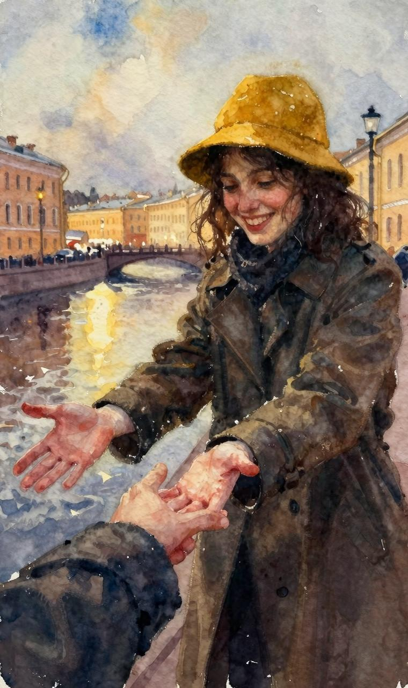
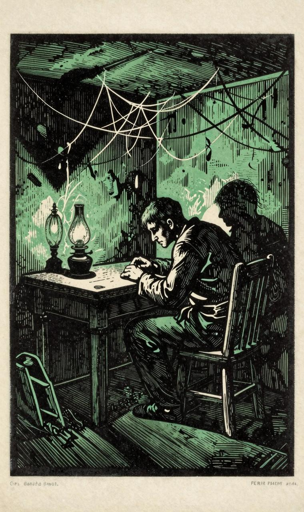
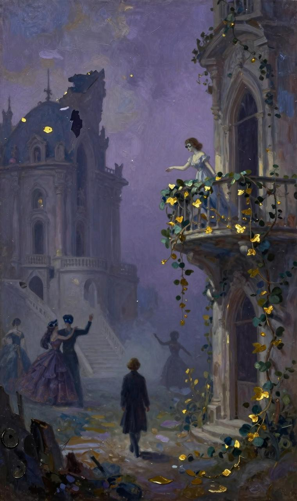
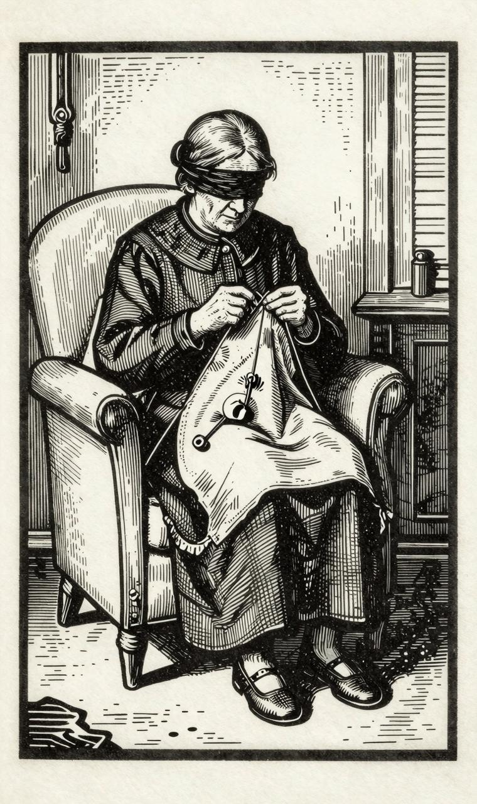
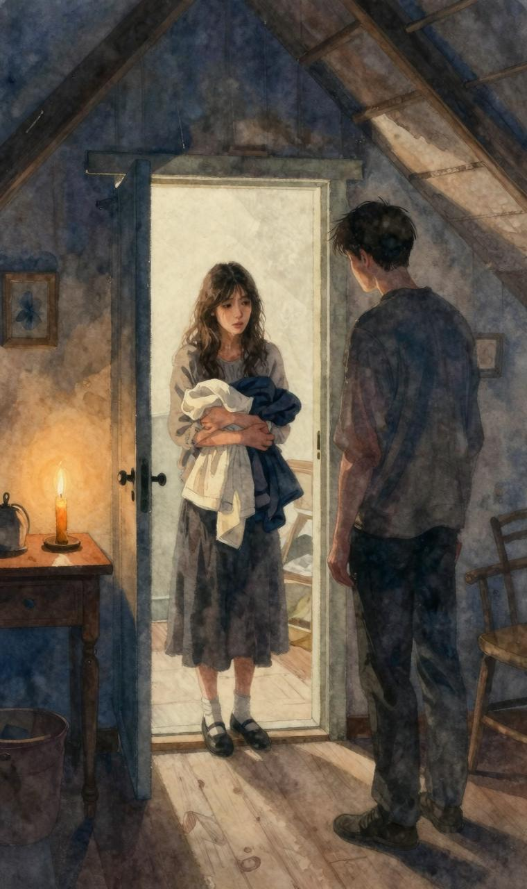
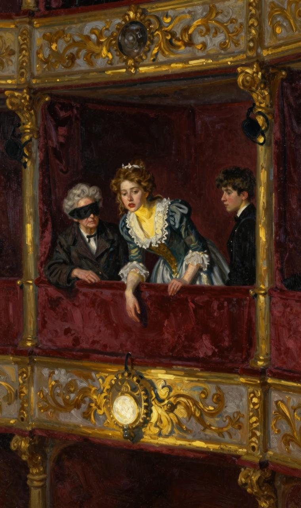

"嗯，您到底还是熬过来了！"她笑着对我说道，同时握住我的两手。

"我在这里已经等了两个钟头，您不知道我这一整天是怎么过的！"

"知道，我知道，现在言归正传谈正经事吧！您知道我为什么到这里来吗？并不是像昨天那样闲扯谈的。我觉得我往后的行为举止要更加理智一些才行。这就是我所要说的。对于这个问题，我昨天想过很久。"

"到底在哪一方面，在哪一点上我们要更理智一些呢？从我这一方面来说，我已做好充分准备。不过说实在的，在我的一生中，没有什么比昨天的所作所为更理智了。"

"真的吗？第一，我请求您别把我的手握得这么紧。其次，我要告诉您，对于您这个人，我今天翻来复去想过很久。"

"好，想的结果呢？"

"结果是：一切需要重头开始。因为我已作出结论：我对您还很不了解，我昨天的行为，很像一个小孩子，一个小姑娘。当然，这一切追究起来，还是怪我的心肠太好，也就是说我自己夸赞自己。往常也是如此，一当我们剖析自己的言行时，结果总是自我陶醉。为了改正这一错误，我决定对您进行最详细的了解。由于无人向我提供您的情况，您自己得向我把一切的一切，从头到尾，都讲清楚，比方说您是一个什么样的人？您快点开始讲吧，讲您自己的经历！"

"经历？"我吓得叫了起来！"经历？谁告诉您说我有经历？我没有经历……"

"要是没有经历，您又是怎么生活过来的呢？"她笑着打断我的话。

"根本没有任何经历！常言说得好，我是自由自在活下来的，也就是说，我是孤身一人，完全是只身一个人，孤伶伶的，您懂得什么是孤伶伶吗？"

"什么是孤伶伶？那就是您从没见过任何人。"

"哦，不，人倒是见过的，不过我还是孤身一人。"

"怎么？难道您没跟任何人说过话吗？"

"从严格的意义上讲，是没跟任何人说过话。"

"那么，请您解释一下，您到底是个什么人？您等一等，让我猜一猜：您大概同我一样也有一个老奶奶。她双目失明，一辈子哪儿也不让我去，使我几乎丧失了说话的能力。两年前我很淘气，她发现管我不住了，便把我叫到跟前，用一根别针，把我的衣服别在她的衣服上面。从此我们就成天坐在一起。她虽然双目失明，但能织袜子，我就坐在她身旁缝衣服或者念书给她听。多奇怪的办法！她把我别在她身边已经两年多了……"

"哎呀，我的天哪！多大的不幸啊！不，不，我没有这样的奶奶！"

"既然没有，您又为什么老是呆在家里呢？……"

"您听我说，您不是想知道我是一个什么样的人吗？

"唔，对呀，对呀！"

"是按这个词的严格意义说吗？"

"是按它最严格的意义来说！"

"那就请您记住，我是一个典型！"

"典型，典型！什么典型？"姑娘哈哈大笑，那样子好像她整整一年没有这么笑过似的，然后就大叫起来。"同您在一起真开心！您看，这里有条板凳，我们坐下来谈吧。这儿没有人走动，说话也没人听见，您就开始讲您的经历吧！因为不论您怎么说也无法使我相信您没有经历。我有经历，不过把它隐瞒起来了。首先请您说说典型是什么？"

"典型？典型就是一个有特色的人，一个荒唐可笑的人！"她孩子般的笑声感染了我，我也跟着哈哈大笑。"典型是一种性格。您听我说，您知道什么是幻想家吗？"

"幻想家！对不起，怎么会不知道呢？！我本人就是幻想家！有时候我坐在奶奶身旁，脑子里什么都想。哎，一旦开始幻想，就什么稀奇古怪的想法都出来了，甚至想嫁给中国的皇太子……您知道，当幻想家真舒心！不，不过那只有天晓得！特别是真有心事要想的时候！"这一次她相当严肃地这么补充说道。

"妙极了！既然您幻想过嫁给中国的皇太子，那您就一定会理解我的意思。嗯，您听我说……对不起，我还没有问您尊姓大名呢？"

"您到底还是想起来了！您早该想到呀！"

"哎呀，我的天啦！我太高兴了，所以没有想到这上面来……"

"我叫纳斯金卡！"

"纳斯金卡！仅仅是这个小名吗？

"仅仅是这个名字，怎么，您还觉①得不够吗？真是贪心十足！"

--------

①俄罗斯人的姓名包括名、父称和姓氏三部分，初次见面作自我介绍时通常是说出自己的名字和父称，只说自己的小名，是对对方表示亲切。女主人公在这里的自我介绍出乎对方的意料，因而引起后面的对话。

"不够吗？不，恰恰相反，已经足够了，非常非常够了！纳斯金卡，您是一位心地非常善良的姑娘，要是您一开始就成为我的纳斯金卡有多好啊！"

"这就对啦！唔！"

"好吧，纳斯金卡，请您听听下面是我多么可笑的经历。"

我在她身旁坐了下来，装出一副近乎迂腐的庄严神态，好像念稿子似的说了起来：

"纳斯金卡，可能您不知道，彼得堡有一些相当奇怪的角落。普照彼得堡所有的人的那个太阳，似乎不肯光顾这些地方，而照射这些地方的，好像是另一个专门为这些地方订做的太阳。它用另一种特殊的光芒，照射着这里的一切。亲爱的纳斯金卡，这些角落里过的完全是另一种生活，根本不像我们周围沸腾的生活。这样的生活，不是存在于我们这儿，不是存在于我们这个极其严肃的时代，而是可能存在于遥远的九重天之外。这种生活是荒诞、热情的理想混合物，哎，纳斯金卡，它里面和着阴暗、平淡无奇和无法想象的庸俗！"

"啊，我的上帝呀！这是一个多好的开场白呀！我这是听到了什么呢？"

"纳斯金卡（我叫您纳斯金卡，总是觉得不够），您会听到，在这些地方生活的是一些稀奇古怪的人——幻想家！如果要给它下一个详细的定义，那就应该说，幻想家不是人，而是某种中性的东西。他们多半住在人迹罕至的角落里，好像藏身在里面，甚至害怕见到白昼的阳光。它一旦爬进自己的窝里，就在那里面落地生根，像蜗牛一样，或者至少在这一方面活像一种有趣的动物。这种有趣的东西既像动物，又像动物的家，人们通常把它叫做乌龟。您想想看，他为什么那么热爱自己的四面墙壁，而那些墙壁总是涂有绿的颜色，被薰得黑黝黝的，看了叫人丧气，而且散发出一股叫人难以忍受的烟味！为什么这位可笑的先生在接待他的某个来访的熟人（他的熟人是很少的）时，神色是那么窘迫，脸色突变，神情慌乱，好像他刚刚在自己的房内犯过罪似的，不是制造伪币就是写下几行小诗，用匿名的方式，寄往杂志社，谎称原作者已经故去，作为朋友，认为发表故友的诗作，具有不可推卸的责任云云。纳斯金卡，请您告诉我：为什么这两位朋友见面却谈不来？为什么那位突然来访的朋友闷闷不乐？他既不笑，也说不出一句像样的话来，而在其他场合，他却总是谈笑风生、妙语如珠的，特别是在议论女人和其他引人入胜的话题的时候。其次，这位朋友肯定是结识不久的新交，为什么他第一次造访就（第二次造访是不会有的，因为下次他是决不会来的）看到主人惊慌失措的神色，尽管他口若悬河（他是有这个本事的），却变得如此窘迫，竟然张口结舌，不知所措？而他的主人呢，一开始就作出极大的努力，力图使他们的谈话风趣横生，有声有色，为了表现他对上流社会的了解，他也谈女性，甚至低声下气，讨好这位误来他家作客的可怜人，但是所有这些努力，全部归于无效！还有一点，为什么客人突然想起一件极其紧要的事情（其实，那是根本不存在的事），赶紧把主人热情地紧握着的手抽出来，匆匆忙忙抓起帽子，迅速离去，而主人却在想方设法，表示他的懊悔，希望以此挽回失去的面子？为什么离去的客人一出门就发誓，以后决不再到这个怪人家里来，虽然这个怪人实质上是一位好得不能再好的大好人？同时，这位客人大肆发挥自己的想象力，把自己前不久与之交谈的主人与谈话时他见到的一只可怜的小猫相比较，这当然是不伦不类的。那只小猫遭到孩子们的戏弄，受尽了他们的惊吓和侮辱。孩子们对小猫不讲信义，居然抓住它，把它当俘虏，弄得它浑身是灰，狼狈不堪，最后只好躲到椅子底下，藏进暗处，好不容易才摆脱孩子们的纠缠。它在那里整整呆了一个小时，它竖起身上的毛，呼哧呼哧地喘气、喷嚏，用自己的两只前爪，洗自己受尽凌辱的嘴脸。此后很长一段时间，它对周围的一切，都怀着敌意，甚至对同情它的女管家为它留下的主人吃剩的饭菜，也是如此！"

"您听我说，"纳斯金卡打断了我的话，她一直睁着两眼，张着小口满脸惊讶地听我说话。"您听着，我完全不知道，为什么这一切会发生？为什么正是由您向我提这样可笑的问题？不过我知道，这些奇闻异事肯定是发生在您的身上，而且一点不假。"

"那是没有疑问的，"我以非常严肃的神情，对她作了回答。

"好！既然没有疑问，那您就继续说下去吧，"纳斯金卡回答说，"因为我很想知道结局如何。"

"您想知道，纳斯金卡，我们的主人公到底在自己的角落里干了些什么？其实，与其说是我们的主人公，不如说是我，因为整个事情的主人公就是我，就是这卑贱的我！您想知道，我在自己的角落里干了些什么？为什么一位友人的突然造访，竟然使我一整天如此神情慌乱、手足无措？您想知道人家打开我的房门时，我为什么吓得跳了起来、满脸胀得通红？为什么我善于接待客人，却又为自己做不到殷勤好客而感到羞愧难当，无地自容呢？"

"嗯，对，对！"纳斯金卡作了回答。"问题的实质正在这里。您听我说，您讲得很动听，不过，难道您不可以讲得这么动听吗？您好像不是在讲故事，倒是很像照着稿子念什么似的。"

"纳斯金卡，"我好不容易才忍住笑，装出一副庄重、严肃的样子回答，"亲爱的纳斯金卡，我知道我讲得很动听，对不起，换个方式，我却做不到。现在，亲爱的纳斯金卡，我就像是所罗门国王的灵魂，它在用七重封条贴住的罐子里，关了一千多年，最后那七重封条终于揭开了。现在，亲爱的纳斯金卡，经过这么长久的分离，我们又团聚了——因为我早就已经认识您，纳斯金卡，因为我早就在寻找一个人，这就是一个信号，表示我要找的就是您，我们现在是命中注定要见面了。——现在我脑海里的几千座闸门都已打开，我必须口若悬河、滔滔不绝地讲下去，否则，我就会憋死！所以我请求您千万别打断我的话，纳斯金卡，而要乖乖地听我讲下去，否则，我就不讲了。"

"别，别，别！千万别这样！您说下去吧，现在我一句话也不插了。"

"好，现在我继续往下说。我的朋友纳斯金卡，我的一天之中，有一个小时是我极其喜爱的。这时候，所有的工作包括公务和家务，都已干完，大家急急忙忙赶回家去吃饭，然后躺下来休息休息。在回家的路上，大家也在思考一些欢快的事情，盘算着如何度过黄昏、夜晚和剩下的整个业余时间。就在这个时刻，我们的主人公（纳斯金卡，请允许我还是用第三人称来讲好，用第一人称谈起来，实在叫人感到怪难为情），就在这个时刻，我们的主人公也没有闲着，他跟着走在别人的屁股后面。他那苍白而多少有点绉纹的脸上，流露出一种奇怪的满足感。他望着彼得堡寒冷的天空中渐渐消退的晚霞，心中很是平静。我说他'望着'，其实是不确切的。他不是望，而是视而不见，漫不经心地扫了一眼。似乎他已疲惫不堪，或者此时此刻正在思考什么别的更为重要的事情，因此对周围的一切，只能匆匆一瞥，几乎是极不情愿地一扫而过。他感到心满意足的是：在明天到来之前，使他感到恼火的'事务'都已做完。他像放学归来，离开教室去玩自己喜爱的游戏、尽情玩耍、淘气的小学生一样，内心里感到无比的高兴！纳斯金卡，您从旁看看他吧，您马上就会发现，欢快的情绪已经对他脆弱的神经和处于病态的兴奋之中的幻想力，产生了极好的作用。您看，他正在聚精汇神思考什么问题……您以为他在考虑用餐吗？盘算今晚怎么过吗？他在看什么呢？是在看那位相貌堂堂的先生吗？由几匹快马拉着的一辆马车金光闪闪地正从那位先生的身旁驶过去，那位先生向马车里坐着的一位夫人恭恭敬敬地鞠躬致礼！不，纳斯金卡，他现在哪里有功夫顾得上这些琐屑的芝麻小事呢？！他现在正在全神贯注着自身的特殊生活，显得格外充实。他好像一夜之间，突然成了一位富翁。落日的余晖在他面前欢快地闪烁，并非毫无作用，它唤起了他温暖的心中蕴藏着的许多印象。现在他好不容易才看清那条道路，而在这以前，最不起眼的芝麻小事也会使他大吃一惊。现在，'幻想女神'（亲爱的纳斯金卡，如果您读过茹科夫斯基①的作品的话那就好了）已经运用自己的巧手，编出了金黄色的底幅，又在底幅上面编织出美丽无比、虚幻迷人、光怪陆离的生活图案。谁知道呢？也许她会用巧妙的两手把他从正在漫步的花岗石砌的人行道上托起来，送到晶莹灿烂的七重天上。这个时候，您试一试把他叫住，突然问他：您现在走在什么地方，走在哪条街上？他肯定会什么也想不起来：既想不起他走在什么地方，也想不起他站在哪里。他会懊丧得满脸胀得通红，为了挽回面子，他肯定会编造一通谎言。所以当一位非常令人起敬的太太很有礼貌地把他拦在人行道的中央，开始向他询问她走错了的道路时，他竟然浑身发抖，两眼惊恐地环顾四周，差点叫了起来。他心烦意乱，双眉紧蹙，大步大步地朝前走去，几乎没有注意到，不止一个过路人在望着他发笑，并且跟在他屁股后面走去。还有一位小姑娘，睁着一双眼睛，直望着他满脸堆着的微笑和做出的各种手势，怯生生地给他让开道路，随后就大声笑了起来。但是，还是那尊幻想女神，在任意飞行中顺便带走了那位老太太，好奇的过路客和微笑的小姑娘，还有在把丰坦卡河塞得满满的驳船上过夜的农民（我们假定此时此刻我们的主人公正从河边走过来），淘气地把这些人和物通通都绣到自己的绣布上，就像把苍蝇黏在蜘蛛网上一样。于是，这位怪人便带着新的收获，回到他那个令人感到愉快的洞穴里，然后坐下来吃饭。吃了很久之后，他才清醒过来。这时候，服侍他的、总是心事重重、脸上从来没有开朗过的玛特莲娜，已经收拾好桌上的杯盘碗碟，给他递来了烟斗。他清醒过来以后，惊讶地发现他已经吃完了饭，至于这顿饭是怎么吃的，他却怎么也回想不起来了。房间里已经黑了下来。他的心里，既感到空虚，又感到悲哀。整个幻想王国在他的周围坍塌了，坍塌得无声无息，毫无痕迹，没有发出一点破裂的劈啪声，像梦一样消失得无影无踪。他自己也记不起他梦中见到了什么。然而却有一种模模糊糊的感觉，使他的心隐隐作痛，无法平静下来。有一个新的愿望在颇具诱惑力地触动和刺激他的幻想力，不知不觉地唤起一连串新的幻象。小小的房间里，笼罩着一片寂静。离群索居和懒惰是可以激发想象的。想象正在悄悄燃烧起来，开始沸腾，就像老玛特莲娜的咖啡壶中烧着的水。老玛特莲娜正在厨房里不动声色张罗，为她自己烧冲咖啡用的水。这时候，想象正在一阵阵地激荡，喷出像火星一样的光芒。那本随手拿到的书，已经从我们的幻想家手中滑落下来，他毫无目的地读着，还没读到第三页呢！他的想象力又兴奋起来了，接着又突然出现一个崭新的世界，一种新的、迷人的生活便在他面前展现出光辉灿烂的前景。一场新的梦，就是一次新的幸福！一剂令人心荡神驰的甜蜜毒药！

--------

①茹科夫斯基（一七八三——一八五二）俄国大诗人，浪漫主义诗歌的创始者之一。

"啊，我们的现实生活在他的眼里又算得了什么呢？在他那带有偏见的眼里，纳斯金卡，你我都活得这么懒懒散散，慢慢吞吞，无精打采。在他看来，我们全都对自己的命运不满，我们简直是在受着生活的折磨！事实上也确实如此。您看吧，我们之间的一切，即使粗粗一看，的确都是冷冰冰的、阴森森的，好像大家都在生谁的气似的……

"可怜的人们！我的幻想家想道。他想的也并不奇怪。您看看那些仙魔一样的幻影吧：它们有多么迷人，多么奇妙，多么无拘无束，多么自由自在！它们在他的面前组成一幅神奇的、人格化了的图画。在这幅图画之中，站在前面第一位的，自然是他自己，是我们高贵的幻想家本人！您看看那些五花八门、无奇不有的惊险场面和一连串没完没了、变化无穷、令人兴奋不已的梦幻吧！您也许要问：他在幻想什么呢？其实干吗要问这个呢？他什么都想啊……想起初不被人承认但后来却荣获桂冠的诗人所起的作用；想他与霍夫曼①的友谊；巴托罗缪之夜②；狄安娜·维尔隆，伊凡·华西里耶维奇在攻占喀山时所起的英雄作用；克拉拉·毛勃雷、埃非·迪恩斯③，教长会议和教长前面的胡斯④，《魔鬼罗伯特》⑤中死人的复活（您还记得那音乐吧？它散发出一股坟墓的气息！）还有敏娜⑥、布雷德⑦，别列津纳河上的大会战，沃——达伯爵夫人家里的诗歌朗诵会⑧，还有丹顿⑨，埃及女王克列奥帕特拉的情夫⑩，科洛姆纳的小屋⑾以及属于他自己的小窝，身旁还有可爱的女友相伴，在漫长的冬夜，张着一张小口，睁着一双眼睛，听他讲话，就像您现在听我讲话一样，我的小天使！……

--------

①霍夫曼·埃伦斯特·捷奥多尔·阿马杰（一七七六——一八二二）德国浪漫主义最著名的代表。他作品中描写的生活总是荒诞与现实的统一。

②巴托罗缪之夜——一五七二年八月二十四日圣·巴托罗缪节日之夜，在巴黎发生了天主教徒大规模屠杀新教徒的事件。这一事件反映在梅里美所著的历史小说《查里第九时代轶事》中。

③狄安娜·维尔隆、克拉拉·毛勃雷和埃非·迪恩斯都是著名英国作家瓦尔特·司各特小说中的人物。

④扬·胡斯（一三六九——一四一五）——捷克伟大的爱国者，主张建立独立的国家教会，是为反对德国封建主而开展民族解放运动的鼓舞者。一四一五年康斯坦茨的教长会议因其拒绝放弃新教教义而判处胡斯死刑，放在篝火上烧死。

⑤《魔鬼罗伯特》是法国作曲家梅耶比尔（一七九一——一八六四）的一部歌剧。

⑥《敏娜》是瓦·阿·茹科夫斯基（一七七三——一八五二）根据歌德的作品而创作的一首诗。

⑦《布雷德》是伊·伊·科兹洛夫（一七七九——一八四○）的一首歌谣。

⑧沃—达指沃隆卓娃·达什科娃。

⑨丹顿（一七五九——一七九四）——十八世纪末法国革命的著名领导人。

⑩普希金的一首诗，见于《埃及之夜》。

⑾普希金的一首叙事诗的篇名。

"不，纳斯金卡，您我那么渴望的生活，对他这个神不守舍的懒汉来说，简直不屑一顾，他认为这是贫乏的、可怜的生活，但他却没有料到，有朝一日也许使他烦心的日子就会到来，那时，他为了过上一天这样可怜的生活，就得付出他全部的荒诞、幻想的岁月，而且不是为了得到欢乐，也不是为了得到幸福，而在那忧伤、悔恨和无法遏止的痛苦时刻，连选择他都不想要了。但是，这可怕的时刻，暂时还没有到来，所以他什么也不想要，因为他超然物外，一无所求，因为他什么都有，因为他什么都得到了满足，因为他本身就是描绘自己生活的画家，是他每时每刻在为自己随心所欲地创造生活。唯其如此，这个神奇的、虚幻的世界才创造得这么轻松，这么自然！似乎这一切都不是幻影。真的，要是在另一个时候，我会相信，这全部生活并不是感情冲动的结果，不是海市蜃楼，不是想象力的欺骗，而所有这一切都是现实，真真切切，实实在在。纳斯金卡，请您告诉我，为什么在这样的时刻，精神受到压抑？为什么他的脉搏像中了邪似的，任意加速跳动，眼泪止不住地从幻想家的眼中流出？为什么他苍白、湿润的两颊在发烧？为什么他全身感到那么难以形容的高兴？为什么一个个不眠之夜在无穷的愉快和幸福之中就像短短的瞬间，一眨眼就过去了，而在朝霞映在窗户上，闪烁出玫瑰色的光芒，梦幻似的游移不定的晨光，照亮我们彼得堡这里阴暗的房间时，我们的幻想家已经精疲力尽，疲惫不堪，一头倒在床上，沉沉地坠入梦乡，他那病态的、受到震撼的灵魂则高兴不已，但心里却带着甜丝丝的、令人疲倦的隐痛？是的，纳斯金卡，一旦您上当受骗，就会情不自禁地相信：真正的、诚挚的激动是能够触动他的灵魂的，还会情不自禁地相信，在他那无血无肉、虚无飘缈的幻想之中是有着可以感触得到的、活生生的东西的。您知道，那是一种什么样的欺骗啊！比方说，他心中萌发了爱情，那爱情里面就包含有无穷无尽的欢乐和各种令人难以忍受的痛苦和折磨……只要您瞧上他一眼就会相信的！亲爱的纳斯金卡，您望着他真的会相信他不认识他在幻想中发疯似地爱着的那个女人吗？难道他只是在一些诱人的幻景中见过她，而他对她的满腔激情不过是一场春梦？难道他们真的没有手挽手，成双成对地、形影相随地一起度过漫长的岁月？难道他们没有抛弃整个世界，而把他们各自的小天地、彼此的生活联系在一起？难道不是她，在很晚的时候，在分手来临的时刻，难道不是她趴在他的怀里，痛哭嚎啕，愁肠寸断？她听不见阴森森的天空下着的暴雨，也听不到刮着的狂风，可是狂风却吹落了她黑睫毛上挂着的泪珠！难道这一切都是梦幻，包括这座花园？这花园阴冷、荒芜、凄凉，幽径上长满青苔，显出一副孤寂、忧郁的模样。他们曾经在这里，并肩漫步，共话衷肠，表白爱情和思念之情。他们彼此爱得那么长久，'那么长久，那么深沉'！还有那幢祖先遗留下来的怪模怪样的房子。就是在这幢房子里，她孤寂而忧伤地住过很久，陪伴着她年老力衰、面色阴沉、老是沉默寡言却又性情暴躁的丈夫。正是这个老家伙吓得他们心惊胆战，像小孩子一样羞答答地隐藏着他们彼此的恋情。他们有多么痛苦，有多么害怕啊！他们的爱情又有多么纯洁，多么诚挚！（纳斯金卡，这已经是不言自明的了。）但世人却又非常歹毒！我的天啦！难道他后来碰到的不是她吗？那是在远离祖国海岸的异国土地上，在正午酷热的天空底下，在一座非常漂亮的城市之中。当时，一座沉浸在火光海洋之中的宫殿（肯定是一座宫殿）里正在举行舞会，灯火辉煌，乐声悠扬，她站在爬满常春藤和蔷薇的阳台上，一眼就认出他来了。她赶紧摘下假面具，说完一句'我自由啦！'就浑身抖动，一下扑进他的怀里。他们紧紧地拥抱，身子贴着身子，高兴得不禁大叫，在一煞那间，居然忘记了痛苦，忘记了离别，忘记了所有的折磨、那座阴森森的房子，还有那个老家伙、遥远祖国阴暗的花园以及那张长凳，在那里她曾经给予过他最后一次热烈的吻。后来，她从他由于绝望而感到痛苦的拥抱中挣脱出来了……

"啊，纳斯金卡，您一定会同意：某一位个子高大、健壮的小伙子，一位好说笑话逗乐的小青年，您不请自来的朋友打开您的房门，像没事似的大叫：'老兄，我是刚从巴甫洛夫斯克来的！'这时，您一定会一惊而起，脸红到脖子上，样子十分难堪，好像一个小学生刚刚从邻居果园里偷来一只苹果，塞进自己的口袋里被人发现了似的。我的天哪！老伯爵已经死去，难以用笔墨加以形容的幸福就要到来，可这时人们却从巴甫洛夫斯克来了！"

我结束了我悲怆的叫喊，情绪激动地沉默下来了。记得我很想使劲放声大笑，因为我已经感觉到，有一个与我作对的小鬼，附在了我的身上，而且已经开始掐我的喉咙，揪我的下巴颏，于是我的两眼也就越来越湿润。我期待着正在睁着一对聪明的眼睛听我说话的纳斯金卡哈哈大笑，发出她那小孩子般的、难以遏制的笑声。我已经感到后悔，不该走得那么远，不该讲那些早已憋在我心里的话，而这些话我早已烂熟在心，一说起来就滔滔不绝，就像背书似的。因为我早就准备好了我自己的判决书，现在叫我不念是欲罢不能了。我坦白承认，我不希望有人理解我，但使我感到大吃一惊的是，她居然一言不发，过了好一会儿，她才轻轻地握了握我的手，怀着一种胆怯的关切心情问我：

"难道您的一生真是这样过来的？"

"对，我整个的一生都是这么度过的，纳斯金卡！"我作了回答。"看来，我也会这样结束我的一生！"

"不，这不行！"她心情惶恐地说道，"这是不会出现的。不过，我的整个一生大概会在奶奶的身旁度过了。您听我说，您知道吗这样活下去是非常不好的！"

"我知道，纳斯金卡，知道！"我再也控制不住自己的感情，大声叫道。"现在我比任何时候都清楚，我白白地葬送了我的全部大好年华。现在我不仅知道这一点，而且因此而感到更加痛苦，因为上帝亲自把您，我善良的天使，派到我的身边来，把这一点告诉我，并且加以证明。现在，当我坐在您身边，和您说话的时候，我已经害怕思考未来了，因为将来又会是孤独，又是这死水一潭、毫无用处的生活。现在我真真切切地坐在您的身旁，感到无比的幸福，将来我是会有幻想的！啊，愿上帝赐福与您，让您永远幸福，亲爱的姑娘，因为您没有一见我就让我滚开，因此我可以说，我一生之中至少痛快地过了两个夜晚！"

"嗯，不，不！"纳斯金卡叫了起来，两眼闪着泪花，"不，这种情况再也不会有了，我们就这样不再分离！两个晚上算什么呢？"

"唉呀，纳斯金卡，纳斯金卡！您是否知道您使我和自己和解了多久？您是否知道，我现在已经不像过去那样，把自己想得那么坏了。您是否知道，我也许不再为我过去犯过罪、在生活中有过过失而伤心了。因为这样的生活本身就是过失和犯罪。您不要认为我是在夸大其辞，看在上帝的面上，您千万别这么想！纳斯金卡，因为我有时候感到那么悲伤，那么愁苦……因为我在这样的时刻里开始感到我永远也无法过上真正的生活；因为我已经觉察到我失去了同真正的现实的任何接触，失去了任何感触的能力；还因为我咒骂过我自己，因为在荒诞的不眠之夜以后，我也有一些非常可怕的清醒时刻！这时候，你会听见你四周的轰隆声，人群在生活的旋风中飞舞；你会亲耳听到、亲眼见到人们是怎样生活的，他们是在实实在在地生活。您会看到：生活不是为他们定做出来的，他们的生活并没有像梦，像梦境一样消止，他们的生活总是不断更新的，总是永远年轻的，它的这一小时与那一小时总是不同的，而胆怯的幻想却是那么令人丧气，单调到了粗鄙的地步！幻想是阴影的奴隶，思想的奴隶，第一块突然遮住太阳并用愁苦压迫着（那么珍惜自己的太阳的）真正彼得堡的心的云彩的奴隶，而愁苦中的幻想算是什么幻想呢！？你会感觉到，它终于感到了疲倦，在永无休止的紧张之中·永·不·衰·竭的幻想正在逐渐衰竭，因为你在不断成长，正在慢慢地放弃自己以前的理想。这些理想正在化为灰尘，变成碎片。如果没有另一种生活，那就只好用这些碎片来拼凑了。不过心灵却在祈求和向往另一种东西！幻想家便在灰烬中白白地翻寻，在自己以往的幻想中寻找，希望在这一堆灰烬之中找到哪怕是一些火星，把它煽旺，用重新煽起的火光去温暖已经冷却了的心，使往日感到那么亲切可爱的一切，重新在心中复活，触动他的心灵、使他的血液沸腾，眼泪夺眶而出。过去的一切曾经使他大大地受骗上当！纳斯金卡，您是否知道，我已经走到了何等地步？您是否知道，我已经被迫举行周年纪念，纪念自己的感受，纪念那些过去感到非常亲切，实际上却根本没有过的一切。因为这个周年纪念是根据那些愚蠢、虚妄的幻想进行的，而所以举行是因为这些愚蠢的幻想已经不复存在，而且也无法使之再现：要知道幻想也是可以活下来的！您知道吗，我现在喜欢回忆，喜欢在固定的时间去重游我曾经感到过幸福的那些地方，我喜欢使自己的现在与一去不复返的过去协调起来，并且经常像黑影一样，在彼得堡的大街小巷漫游，既无需要，也没有目的，心情颓丧、抑郁。那都是什么样的回忆啊，真是不堪回首！比如我就经常想起，恰恰是在一年前，正是这个时候，这一个钟头，我就在这条人行道上漫步，像现在这样，也是这么孤独，这么颓丧。有时还回忆起，那时的幻想也是很忧伤的，尽管当时的生活并不好过，但不知为什么仍然觉得，那时的生活似乎轻松一些，也平静一些，没有现在困扰我的这个阴暗的思想；没有这些良心上的谴责。现在这些阴暗、忧郁的谴责使我日夜不得安宁，所以你常常问自己，你的幻想到底在哪里呢？你总是连连摇头，说：光阴似箭，岁月如流，日子过得多快啊！于是你又问自己：这些年你到底干了些什么呢？你把美好的时光打发到哪里去了？你过去到底生活过没有？瞧，你对自己说，瞧，这世界正在变得越来越冷。再过一些年，阴暗的孤独就会接踵而来，战战巍巍、腰弯背驼的老年也会来到，在这以后就是愁苦和颓丧。你的幻想世界变得越来越苍白，你的幻想也会停滞、枯萎、飘零，就像树上飘落下来的黄叶……啊，纳斯金卡！要知道，孤苦伶仃，孑然一身将是多么痛苦，甚至连遗憾也没有，真正一无所有……因为一切都已失去，这所有的一切，早已成了虚无，全都等于零，仅仅是一场梦幻！"

"唔，您别再勾起我的怜悯了！"纳斯金卡一边说一边擦她眼里滚出的泪水。"现在一切都已结束！现在我们两个在一起，不论我发生什么，我们永远也不分开了。您听着，我是个普普通通的姑娘，读书很少，虽然奶奶也给我请过老师，但是，说真的，我理解您，因为你刚才对我转述的一切，我自己都经历过。当然我不会像您那样讲得好，我没有学习过。"她羞怯地补充了这么一句，因为她对充满激情的讲话，充满了敬意，对我高雅的用词，也颇为赞赏。"但是，我感到非常高兴的是，您对我完全掏了心里话。现在我了解您了，完完全全、彻底了解了。您猜怎么样？我也想把我的经历讲给您听，毫无保留地全部告诉您，然后请您给我提意见。您是个很聪明的人，您答应给我提意见，出主意吗？"

"啊呀，纳斯金卡，"我回答说，"虽然我从来没有给人当过参谋，更不说是个聪明的参谋了，不过，现在我发现，如果我们将来永远这样生活，那肯定是非常明智的，我们彼此都能为对方提供很好的意见的。好啦，我的好纳斯金卡，您到底需要什么主意呢？您直率地对我说吧！我现在是这么愉快、幸福、勇敢、聪明，什么主意不用想就可以说出来的。"

"不，不！"纳斯金卡笑着打断我的话，"我需要的不是一个好主意，我需要的主意是发自内心的、具有兄弟情谊的，就像您爱了我一辈子。"

"行，纳斯金卡，行！"我高兴得叫了起来，"就算我已经爱了您二十年，那也没有我现在这样爱得强烈。"

"把您的手伸过来！"纳斯金卡说道。

"这就是！"我把手伸给她，然后作了回答。

"那好，开始讲我的经历吧！" 
	纳斯金卡的经历

"我经历的一半您已经知道，那就是说，您知道我有一个年老的奶奶……"

"如果另一半也像这一半一样的简单……"我本想笑着打断她的话。

"您别插嘴，听下去。首先我得提个条件，别打断我的话，要不然，我一定会丢三拉四说错的。嗯，您乖乖地听着吧。"

"我有一个年老的奶奶。我很小就来到了她的身边，因为我的父母都已先后死去。应该说，奶奶过去比现在富裕，因为她现在常常怀念过去的好日子。她还教我学过法文，后来还为我请过老师。在我十五岁的时候（我现在十七岁），我就结束了我的学习生活。这个时候我也很淘气，至于我玩过什么花样，我不告诉您，只说过失不算大就够了。有一天早晨，奶奶把我叫到自己身边，她说因为她双目失明，看不住我，于是拿起一枚别针，把我的衣服别在她的衣服上，这时她说我们就这么一辈子坐在一起，当然，如果我不变好的话。一句话，最初一个时期，我怎么也走不开，干活也好，念书学习也好，都得在奶奶身旁。我有一次试着要了一个花招，说服菲克拉坐到我的位子上。菲克拉是我们家的女工，耳朵听不见。菲克拉代替我坐着，那时奶奶坐在围椅里睡着了，我便到不远处找女友。咳，结果坏透了。我不在的时候，奶奶醒了，问起一件什么事情来，以为我还乖乖地坐在位子上。菲克拉呢，一看奶奶在张口发问，她自己又听不见，于是想呀，想呀她该怎么办呢？结果她解开别针，撒腿就跑开了……"

这时纳斯金卡停了下来，开始哈哈大笑。我也同她一起笑了起来，不过她马上就止住了。

"请您听着，您不要笑我奶奶。我之所以发笑，是因为事情本身好笑……既然奶奶是这个样子，那又有什么办法呢？不过我还是有点爱她。咳，当时我可吃够了苦头：我马上被安排到位子上，一点也不能动弹了。"

"嗯，我还有一点忘了告诉您：我们，也就是奶奶，有一幢房子，其实是一间小房，总共三扇窗户，完全是木头做的，年纪嘛，与奶奶的一般大，可顶上有个小阁楼。一位新来的房客搬来住在阁楼上……"

"这么说，以前有过一位老房客罗？"我顺便插了一句。

"当然有过啦，"纳斯金卡回答说，"不过比您善于沉默，说实话，他难得动嘴动舌头。那是一个干瘪的老头，又哑、又瞎，还是个跛子，最后他无法活在世上，死了。所以后来就需要找到一位新房客，因为没有房客我们没法活，我们的全部收入就是奶奶的养老金。事有凑巧，新来的房客是个青年人，不是本地的，是外来人。因为他没有讨价还价，所以奶奶就让他住进来了，可后来她却问我：'纳斯金卡，我们的房客年轻还是年老？'我不想撒谎，就说：'奶奶，既不能说他很年轻，当然，也不能说他是老头子'。奶奶接着问：'嗯，外貌长得漂亮吗？'

"我又不想说谎，我说'是的，奶奶，他外貌长相漂亮！'可奶奶却说：'哎呀，糟糕，简直是遭罪！小孙女，我对你讲这个是叫你别偷看他。现在是什么年月啊！你看，这么个小小的房客居然长相漂亮，从前可不是这样啊！'

"对奶奶来讲什么都不如从前！从前她比现在年轻，从前的太阳比现在暖和，从前的乳酪也不像现在酸得快，总之从前的一切都比现在好！我坐在那里，一言不发，心里寻思：奶奶干吗要提醒我，问房客年轻不年轻，长相漂亮不漂亮呢？不过我只是这么想想而已，马上又开始数针数、织袜子去了，后来就完全忘记了。

"有一天早晨，房客找我们来了，他询问关于裱糊房里的墙壁的事。奶奶是多嘴的，一句接一句地说过不停，后来她说：'纳斯金卡，到我卧室里去，把账单拿来！'我马上跳起来，不知道为什么竟然满脸通红，甚至忘了我的衣服是用别针别住了的，结果我向前一起身，把奶奶的围椅也带动了。我看到房客对我的举止已经看得一清二楚，便满脸通红地站在原地一动也不动，本来是应该轻轻地取下别针，不让房客看到的。我突然大声哭了起来，此时此刻，我感到又羞又恼，无地自容，恨不得不看这世界！可奶奶叫了：'你干吗站着不动呀？'这一下我便哭得更加厉害了……房客一见我羞于见他，便欠身鞠躬，马上走开了。'

"从此，只要过道里有点响声，我就吓得要死。我以为是房客来了，便悄悄地解开别针，以防万一。不过，来的并不是他，他从没来过。过了两个星期，房客叫菲克拉传话，说他有很多法文书，而且都是好书，可以读的。他问奶奶想不想让我给她念一念，免得闲着无聊？奶奶答应了，而且表示了谢意，不过她老是问这些书是否正经，她说'如果是一些不正经的书，纳斯金卡，那就千万别读，读了你会学坏的！'

"'我学什么呀，奶奶！那里面写的什么内容呀？'

"'哎呀！'她说道，'那里面写青年人如何诱骗良家女子，借口和他们结婚，把他们带离父母家，随后就把这些不幸的姑娘扔掉，让她们听凭命运的摆布，最后非常悲惨地死去。'奶奶还说，'这样的书，我读过很多，都描写得很好，夜里坐着就偷偷地读。纳斯金卡，你可给我留点神，千万读不得。他送来的是些什么书呀？'

"'都是瓦尔特·司各特的长篇小说，奶奶！'

"'瓦尔特·司务特①的小说！好啦，这里有没有什么阴谋呀？你看看，他在书里塞没塞情书？'

--------

①司各特（一七七一——一八三二）英国作家。

"'没有，'我说，'奶奶，没有字条。'

"'你仔细看看封皮下面，他们这些强盗往往朝封皮底下塞东西！……'

"'没有，奶奶，就是封皮下面也没有任何东西。'

"'嗯，那就算了！'

"就这样我们开始读司各特的小说了，一个月就几乎读完了一半。以后他还一次又一次地送书来，普希金的作品也送来了，结果弄得我没有书就不行了，也不再去想同中国皇太子结婚的事了。

"有一次，我在楼梯上遇到我们的房客。当时是奶奶叫我去拿什么东西。他停下了脚步，我的脸一下子就红了，他也跟着红了脸。不过他笑了，跟我问了好，还询问了奶奶的健康，随后他说：'怎么样，那些书您都读完了吗？'我回答说：'都读完了。'他又问：'您最喜欢哪些书？'我马上回答：'最喜欢的是司各特的小说《艾凡赫》和普希金的作品。'那一次说到这里就结束了。

"一个星期以后，我又在楼梯上碰到他。这一次不是奶奶要我去拿什么东西，而是我自己去寻找什么东西的。那是两点多的时候，房客正好回家。他对我说了一声'您好！'我对他也回了一声'您好！'

"接下去他就问：

"'怎么？您成天和奶奶坐在一起不感到无聊吗？'

"他一问到这件事，不知道为什么，我就唰的一下红了脸，觉得怪不好意思，同时我又感到生气，显然这是因为他一开始就问起了这事的原故。我本不想回答，一走了之，可又无力办到。

"他说：'您听我说，您是一位善良的姑娘！我同您这么说话，请您原谅！不过，请您相信，我比您奶奶更希望您好！难道您没有一个可以去作客的女友吗？'

"我告诉他说，一个也没有。原来有过一个，叫玛申卡，就是她，也到普斯科夫城里去了。

"'您听着，'他说道，'您想同我一起上剧院看戏吗？'

"'上戏院？奶奶怎么办呢？'

"'您，'他说，'您偷偷地背着奶奶……'

"'不，'我说道，'我不想骗奶奶，再见吧，先生！'

"'……那好，再见！'他说完这一句就没再说什么了。

"刚吃完饭，他就到我们那里来了。他坐下来和奶奶聊了好久，详细地问她乘车去过哪里？有没有熟人？突然他说：'今天我在剧院的包厢订了票，演的剧目是《塞维尔的理发师》。原来我的朋友想去看，可后来他又改变主意，不去了，所以我手头还有一张多余的票。'

"'《塞维尔的理发师》！'奶奶叫了起来，'是不是以前演过的那个理发师？'

"'是的，'他说道，'正是以前演过的那一个。'说完他就瞟了我一眼，于是我就全明白了，脸庞马上红了起来，期待使我的心几乎跳了出来！

"'那当然，'奶奶说道，'怎么不知道呢！我以前在家庭剧院还演过罗津娜一角呢！'

"'这么说您今天是想去罗？'房客说道，'我这张票不会浪费啦。'

"'对，我们当然要坐车去，'奶奶说道，'干吗不去？您看，我们的纳斯金卡还从没上过剧院呢。'

"我的天哪，这有多高兴呀！我们马上收拾、打扮，乘车去了。奶奶虽然眼睛看不见，但她还是很想去听听音乐，再说她又是个善良的老太太，更多的是想让我开开心、解解闷，我们自己上剧院，那永远也是办不到的。至于《塞维尔的理发师》究竟给我留下什么印象，我可对您说不上来。不过，整个晚上我们的房客都是那么热情地望着我，同我那么亲切地谈话，使我马上明白了，今天早晨他建议我和他一起上剧院，那是他想考验考验我。啊，真高兴！睡觉的时候我是那么洋洋得意，那么兴高彩烈，心跳得那么厉害，简直像害了一场小小的热病，随后就整夜说梦话，老说有关《塞维尔的理发师》的故事。

"我以为此后他会常来，可事实却不是这样。他几乎完全不来了。有时候一个月来次把，而且也只是为了邀我们上戏院。后来我们去看过两次戏。不过对此我是很不满意的。我发现他不过是可怜我老坐在奶奶身边，仅此而已，别无其他想法。打这以后，我就像掉了魂似的，坐不像坐，念书不像念书，干活不像干活，有时莫明其妙地发笑，故意顶撞奶奶，有一次还没来由地哭了。再以后，我就瘦了，差点得了大病。

"歌剧演出季节一过，我们的房客就再也不来找我们了。每次见面（当然都是在那架楼梯上），他都是那么默默地欠身鞠躬，那么严肃，好像连说句话都不愿意，很快就下楼走到台阶上，我却还是站在楼梯上，脸红得像樱桃，因为在我碰上他的时候我的血液已经全部涌上头部。

"现在很快就要完了。整整一年前的五月间，房客找我们来了，他告诉奶奶说他在这儿的事情已经忙完，他得又要去莫斯科住一年。我一听就面色变白，扑通一下跌倒在椅子上，像死去了似的。奶奶一点也没有发觉，他呢，说完他要离开我们，就朝我一弯腰告别走了。

"怎么办？我想了又想，愁得不知道怎么办好，最后我终于下定了决心。他明天要走，我决定奶奶今晚去睡觉的时候就把一切结束。结果正是这样的。我把几件连衣裙和几件必要的内衣扎成一个包，然后两手捧着半死不活地去阁楼上找房客。我想我爬楼梯花了整整一个小时。当我打开他的房门时，他望着我吓得大叫。他以为我是鬼，赶紧跑来给我倒水喝，因为我的两腿已经站不住了。我的心跳得很快，头也很痛，神志已经模糊不清。等我清醒过来，我首先想到的是把我的包袱放到他的床上，自己坐到他的身旁，随后就两手捂着脸，大声哭了起来，泪水不住地向外涌出。看来，他一下子就全明白了，脸色惨白地站在我的面前，那么忧伤地望着我，使我心如刀绞！

"'您听着，'他开口说道，'您听我说，纳斯金卡，我一点办法也没有。我是个穷光蛋，暂时我一无所有，连个像样的工作也没有。如果我和您结为夫妻，我们将来怎么活呢？'

"我们谈了很久，最后我急得差点晕了过去，我说我无法留在奶奶身边生活，反正我是要从她身边跑走的，我不愿意让人用别针别住，不管他愿不愿意，我一定要和他一起上莫斯科，因为没有他我就没法活。羞、爱、娇，所有这一切全都从我身上表现出来了，我倒在他床上，几乎抽风了。我是那么害怕他拒绝我！

"他默默地坐了好几分钟，然后站起身来，走到我的身边，抓住我的一只手。

"'您听着，我的善良的、亲爱的纳斯金卡！'他也是噙着眼泪开始说话的。'您听着，我向您发誓，如果有朝一日我有能力结婚，您肯定就是我的幸福对象。只有您才是我的幸福，这一点，我可以向您保证。您听我说，我这次去莫斯科，要在那里呆上整整一年。我希望能把自己的事情处理好。我回来的时候，如果您还爱我，我发誓，我们将成为幸福的一对。现在呢，却是不可能的，我办不到，我什么也无权向您许诺。我再说一遍，如果一年以后这事还办不到的话，将来总会有一天能办到的，当然那得有个前提，就是假如您不甩掉我而另找他人，因为我不能、也不敢用什么言语来约束您。'

"这就是他对我说的话，第二天他就坐车走了。我们约好关于此事，不向奶奶透露半点风声。这是他的希望。呶，现在我的经历已经全讲完了。恰恰过去了一整年。他回来了，到这里已经三天了，可是……"

"可是什么？"我迫不及待地想听完结局，急得叫了起来。

"可至今他还没出来见面！"纳斯金卡似乎用尽了气力，才说出这么一句话来，"连一点信息也没有！……"

她马上把话停住，沉默了一会儿，然后垂下脑袋，两手捂着脸，突然放声大哭，把我的心都哭碎了！

我怎么也没有料到如此结局。

"纳斯金卡！"我开始用怯生生的声音悄悄地说道，"纳斯金卡！看在上帝的面上，您别哭！您怎么知道呢？或许，他还没来呢……"

"在这里，他在这里！"纳斯金卡接着我的话讲下去。"他在这里，这我知道。还在他离开的前夕，我们就有过一个约定，还在那天晚上就说好了的。在我们说完我刚才告诉您的那些话以后就约好我们来这里，也就是来这条沿河大道散步。那是晚上十点，我们坐在这条长凳上。当时我已不再哭泣，听到他说的那些话，我心里感到甜蜜蜜的……他说一回来马上就来找我们，如果我不拒绝他的话，就把一切告诉奶奶。现在他回来了，这一点我知道，可是他却不露面，无踪无影！"

接着她又泪如雨下。

"我的天哪！难道不能想点办法，减轻一点她的痛苦吗？"我完全绝望地从长凳上跳起，大声叫了起来。"纳斯金卡，请您告诉我，我去找他行吗？……"

"难道这可能吗？"她突然抬起头来说道。

"不，当然不行！"我猛然省悟，说道，"有了，您写封信！"

"不，这不可能，这不行！"她果断地作了回答，不过已经低下头，两眼不再望我了。

"怎么不行？为什么不行？"我牢牢地抓住自己的想法，继续说道。"不过，您知道，纳斯金卡，该写一封什么信呢？信和信可不相同啊……啊，纳斯金卡，就这么办。请您相信我，相信我吧！我给您出的不是坏主意。这一切您可以办得到。您不是已经开始迈出了第一步吗？为什么现在……"

"不行，不行！那样似乎我要强加于人，硬要……"

"哎呀，我最最善良的纳斯金卡！"我打断了她的话，忍不住微微一笑。"为什么不行呢？其实您完全有权这么做，因为他向您许诺过。再说，从各方面来看，我觉得他是讲信用的人，为人正派，"我继续往下说去，为自己的论点所具有的逻辑力和说服力而越来越感到高兴。"他为人怎样？他用许诺约束了自己。他说过，只要他结婚，那就非您不娶，而且他还给了您充分的自由，即使现在拒绝他也行……在这种情况下，您可以迈出第一步，您有这个权利，您对他有优势，比如说，如果您想摆脱他的诺言的约束……"

"您听着，要是换上您，您会怎么写呢？"

"写什么？"

"写这封信呀！"

"要是我就这么写：'亲爱的先生……'"

"一定要这么写上'亲爱的先生'吗？"

"一定要写上。不过话又说回来，为什么呢？我认为……"

"行，行，往下写吧！"

"'亲爱的先生！

请您原谅，我……'不，不，不需要什么原谅不原谅！这里事实本身足以说明一切，您就这么简简单单地写吧：

"'我现在给您写信。请您原谅我缺乏耐心。但是整整一年我满怀希望，感到非常幸福，现在我连一天的怀疑都忍受不了，这责任在我身上吗？现在，您已经回来，也许已经改变了自己的意图。这封信会告诉您，我没有抱怨，也不责怪您。我之所以不责怪您是因为我无法控制您的心。我的命运就是如此！

"'您是一个高尚的人。您对我这几行迫不及待的信既不会嘲笑，也不会感到恼怒。您会想起，这是一个可怜的姑娘写的，她孤孤单单，没人教她，也没人给她出主意，她从来不会自己控制自己的心。但是，还得请您原谅我，因为怀疑已经偷偷地爬进我的心房，尽管只有一瞬间。即便在思想上您也不能忍心伤害那个过去和现在都那么爱您的姑娘的。'"

"对，对！这正是我心里所想的！"纳斯金卡叫了起来，她的两眼闪烁出高兴的光芒。"啊！您解除了我的怀疑，您是上帝亲自给我送来的！谢谢，我谢谢您！"

"谢什么？感谢上帝派来了我？"我异常兴奋地望着她高兴的脸蛋，进行反问。

"对，既便是为了那个，我也要感谢您。"

"唉，纳斯金卡！您知道，我们有时感谢别人，仅仅是因为他们和我们生活在一起。我感谢您，因为我见到了您，因为我这一辈子忘不了您。"

"'唔，够啦，够啦！现在您给我听着：当时是有约定的：只要他一回来，马上就把信留在我的熟人家里的一个地方，让我知道他的情况。我的熟人都是纯朴的好心人，对我们的事，他们一无所知。或者，如果不能给我写信，因为靠一封信把什么事都说清楚是不行的，那么他就在他回来的当天十点正到这里来，这是我们约定的会面地点。他已经回来，这我已经知道，但三天来既不见他的信，也见不到他的人。早上要离开奶奶，我又怎么也办不到。请您明天把我的信交给我对您提到的那些好人，他们一定会转给他的。如果有回信，您晚上十点亲自把它带来。'

"但是信呢，信呢？要知道，首先需要把信写好！看来不到后天是办不成的。"

"信……"纳斯金卡神情慌乱地作了回答，"信……不过……"

但是，她没有把话说完。她先是把脸转了过去，不让我瞧见，原来她已经满脸通红，红得像玫瑰一样。后来我突然感到我手中有一封信，显然是早就写好了的，而且一切准备停当，封好了口的。我的脑海中闪出一种非常熟悉、亲切、动人的回忆。

"罗——罗，申——申，娜——娜，"我开始唱起歌剧《塞维尔的理发师》的插曲来了。

"罗申娜，"我们一起唱起来，我高兴得差点把她抱了起来，她则满脸通红，红得不能再红了，随即就破涕为笑，虽然眼泪像颗颗珍珠似的，还在她黑黝黝的睫毛上抖动。

"呶，够啦，够啦！现在我们告别吧！"她迅速说道，"这是交给您的信，地址在这儿，照着送去就是了。我们分手吧！再见！明天见！"

她紧紧握住我的两手，点了一下头，然后像箭似的，飞进了她的胡同里。我站在原地，目送她好久。

"明天见！明天见！"当她从我的视野中消失时，这话还在我的脑海中回响。