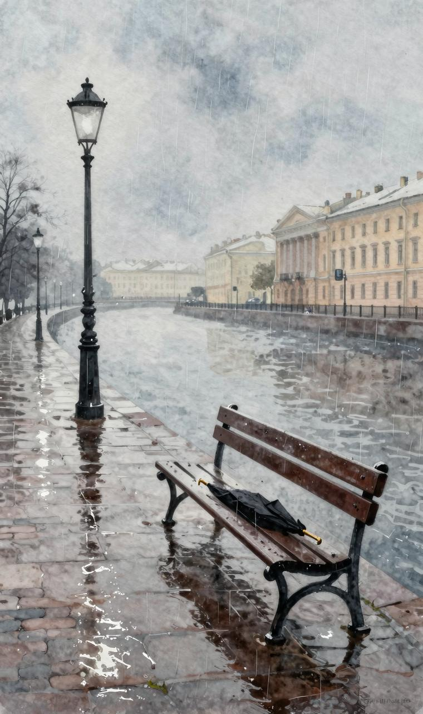
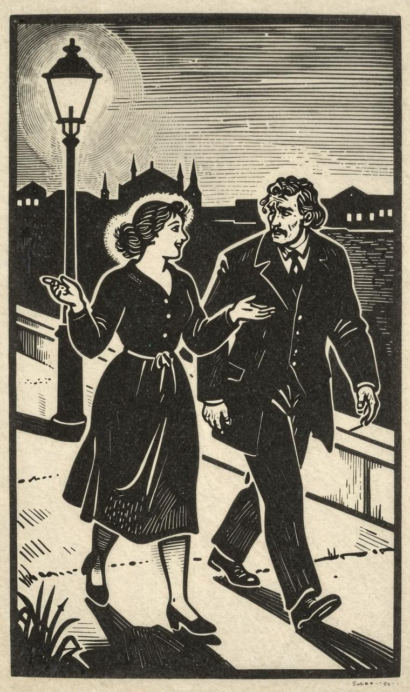
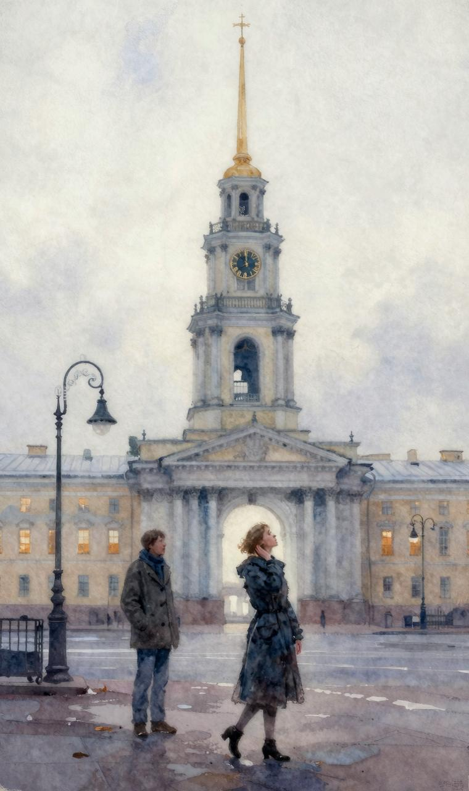
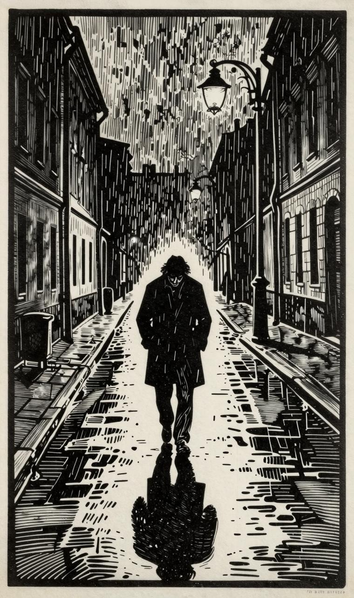

今天是个令人悲伤的日子，多雨，没有阳光，很像我未来的老年。有这样的奇怪思想、这么阴暗的感觉在压迫着我，我的脑海里聚集着许多我还弄不清楚的问题，不知道为什么，我既无力去解决这些问题，也没有解决它们的愿望。这一切不是我所能解决的！

今天我们不会见面，昨天我们分手的时候，乌云布满了天空，还起了雾。我说过明天天气会不好，她却没有作答，她不想说她不愿意说的话。对于她来说，这一天是晴朗的，没有一朵乌云遮盖她的幸福！

"既然会有雨，我们就不见面吧！"她说道，"我不会来的。"

我原以为她不会注意今天的雨，然而她却没有来。

昨天是我们的第三次见面，是我们的第三个白夜……

然而，快乐和幸福可以使人变得多么美好啊！使你心里的爱情燃烧沸腾！好像你想把自己的心完全灌进另一颗心里，你希望一切都使人愉快，一切都带上笑意。这种欢乐具有多大的感染力啊！她昨天说过的话里包含着多少柔情、心里对我充满了善意……她对我是那么殷勤，那么亲切，鼓励和安慰着我的心！啊，幸福可以使人卖弄多少风情！可是我……

我却把这一切信以为真！我以为她……

我的天哪，我怎么可以这么想呢？既然一切都已被别人拿走，一切都不属于我，包括她的柔情蜜意、她的关心，她的爱……都不属于我的时候，我怎么能够如此盲目，视而不见呢？至于对我的爱情，只不过是想到很快就要与另一个人会晤时的欢欣，希望将自己的幸福强加于我的一种愿望而已……在他没有到来而我在徒劳无功地等待的时候，她双眉紧蹙，胆怯害怕。她的动作，她的言语都变得不那么轻松、愉快、轻佻。奇怪的是她增大了对我的注意，似乎本能地把她自己所希望的、如果不实现她就感到害怕的东西倾注到我的心上。我的纳斯金卡是那么胆怯，那么害怕，似乎已经明白最终我是爱她的，所以对我可怜的爱情感到惋惜。我们不幸的时候，对别人不幸的同情就会更加强烈。感情不会破裂，而是更加集中……

我是带着满腹心事去找她的，好不容易才见到她。我事先没有预感到我现在的感觉，也没有预料这一切会这么结束。她高兴得容光焕发，她在期待着回答。这回答就是她自己。他应该来，应该响应她的召唤，跑到这里来。她来到这里，比我整整早一个钟头。首先她对什么都哈哈大笑，对我说的每一句话，她也发笑，我本想开口，却又停了下来。

"您知道我为什么这么高兴吗？"她说道，"为什么望着您就这么高兴？为什么我今天这么爱您？"

"唔？"我下意识地反问，我的心已经开始抖动。

"我之所以爱您，是因为您没有与我恋爱。要是换上另一个人，让他处在您的位置上，他肯定会心慌意乱，就会缠着我不放，就要唉声叹气，您却是这么可爱！"

她马上握住我的一只手，痛得我差得喊叫起来。她笑了。

"天哪！您是一位多好的朋友！"过了分把钟，她很认真地开始说话。"您确实是上帝给我送来的！假如您现在不同我在一起，我肯定会出什么事的。您是一位多么无私的人啊！您对我多好！我结婚以后，我们会更加亲蜜，比亲兄弟还要亲。

我几乎会像爱他一样爱您……"

不知道为什么，我此时此刻，感到特别难过。但是某种类似于笑的东西，却在我心中动了起来。

"您在歇斯底里大发作，"我说，"您胆怯了……您以为他不会来。"

"愿上帝与您同在！"她回答说道，"如果我不幸福，您的不相信，您的责备就会使我大哭一场。不过，您使我产生了一个想法，给我提出了一个值得长久思考的问题。让我以后去好好思考吧。不过我现在得向您承认：您说的是实话。是的！我不知怎的，心神不定，我好像全部身心都在期待，觉得这一切有点过于轻率。算了吧，关于感情问题，留待以后再说！……"

这时传来一阵脚步声，黑暗中出现一个人影，正朝我们迎面走来。我们两个都哆嗦了一下，她还差点惊叫起来。我松开她的手，做出一个似乎想走开的手势。但是我们估计错了，来的不是他！

"您怕什么？您为什么把我的手松开了"她说完就又把手伸了过来。"喂，怎么啦？我们将一起会见他。我希望他看到我们多么相爱。"

"我们彼此多么相爱！"我叫了起来。

"啊，纳斯金卡，纳斯金卡！"我心里想道，"您这一句话说出了许多意思啊！这样的爱情，纳斯金卡，有时使您的心冷若冰霜，使您心情沉重。您的手是冰冷的，我的手却热得像一团火。您有多盲目啊，纳斯金卡！……啊！有时候，一个幸福的人简直叫人难以忍受！不过，我不能对您生气！

……"

我的心终于再也忍耐不住了。

"您听我说，纳斯金卡！"我大声叫了起来，"您知道我这一整天是怎么过来的吗？

"怎么，出什么事啦？快讲给我听！为什么您直到现在还守口如瓶呢！"

"第一，纳斯金卡，我执行了您交给我的任务，交了信，到了您的好心朋友那里，后来……后来我就回家睡觉……"

"就是这些？"她笑着打断了我的话。

"对，几乎就是这些。"我压住心情的激动，作了回答，因为泪水已经涌上我的两眼。"我直到我们见面前一小时才醒来，但好像我没有睡觉。我不知道我出了什么事。我来是为了把这一切告诉您，好像时间对我来说，已经停止不动，好像一个感觉、一种情感从此就应该永远留在我的心里，好像一分钟应该像一世纪那么长，好像整个生活对于我来说，已经停止前进……当我醒来的时候，我觉得，一个早就熟悉的、以前在哪儿听过、虽已忘却却仍然感到甜蜜的音乐旋律，现在想起来了。我觉得这个曲子一辈子都想从我的心灵中出来，不过直到现在它才……"

"哎呀，我的天哪，我的上帝啊！"纳斯金卡打断我的话，"这一切到底为什么这样？我一句都听不懂！"

"哎呀，纳斯金卡！我不过是想把这个奇怪的印象告诉您……"我开始用抱怨的口气说话，这里面还包含着希望，虽然它非常遥远。

"够啦，您别说了，够啦！"她说完一眨眼功夫就全猜到了，这个机灵鬼！

忽然间，她好像变得异乎寻常地爱说话，特别快活、跳皮。她笑着挽起我的手，想让我也跟着她笑，于是我不好意思说出的每一句话，都得到她那么响亮、那么长时间的笑声……我开始生气，她却突然向我卖弄起风情来了。

"您听着，"她开始说道，"要知道，您没有爱上我，我是有点恼火的。等这人走了以后您好好分析吧！但是，您，不屈不挠的先生，您还是不能不夸我是如此纯朴。我什么话都对您说，什么都告诉您，不论我脑海里闪过多么愚蠢的念头，我都不对您隐瞒。"

"您听！好像，这是十一点吧？"当均匀的钟声从市内遥远的钟楼响起时，我这么问她。她突然停下脚步，收敛笑容，开始数钟声。

"对，是十一下，"她终于用羞怯的、不大果断的声音说道。

我马上感到后悔，不该吓唬她，强迫她数钟声，并且责怪自己生气。我为她感到伤心，不知道怎样赎还我犯下的罪过。我开始安慰她，寻找他不来的原因，陈述各种各样的理由，提供各种证据。谁也不会像她那么容易在此时此刻上当受骗，再说任何人在此种时刻似乎也高兴听到哪怕是任何一种不着边际的安慰话，即便是只有一丁点辩解的理由，她也会听着高兴的。

"说起来真是可笑，"我开始说了起来，为自己论证的异常明确而感到洋洋得意，因此我越说越激动。"他确实也不能来呀，是我被您，纳斯金卡，弄糊涂了，上了当，弄得我忘记了时间：您只要想一想就会明白，他只能刚刚收到信。如果我们假定他不能来，又假定他要写回信，那么在明天以前，信就到不了。明天天一亮我就去取回信，马上给您弄清楚。最后，我们还可以假设出上千种可能性，比如信到的时候他不在家，也许他直到现在还没看到信呢？要知道，什么事都有发生的可能啊！"

"对，对！"纳斯金卡作了回答，"我根本就没有想到。当然，什么事情都是可能发生的，"她继续用十分豁达的口气说话，不过语气之中透露着恼火的意味，包含着某种遥远的想法。"您帮我这么办吧，"她继续说道，"您明天尽早去一趟，有什么消息，马上通知我。我住在什么地方，您不是知道吗？"

接着她又开始向我重说一遍她的地址。

后来她突然对我那么情意绵绵，那么羞羞答答……她好像在注意听我劝她说的话，但我向她提出一个什么问题时，她却一言不发，神情忐忑不安，把头扭了过去。我朝她盯了一眼，原来她在哭泣！

"唔，怎么可以这样，怎么可以这样呢？哎，你真是个孩子！多孩子气啊！……算啦，别再哭啦！"

她试着想笑一下，安静下来，但她的下巴颏还在抖动，胸脯还在起伏不平。

"我在想您，"经过一会儿的沉默，她对我说道，"您真善良，如果连这一点我都感觉不出来，那我就真是铁石心肠的木头人了……您知道我现在脑子里有个什么想法吗？我把你们两个人作了比较。为什么是他而不是您呢？为什么他不像您这样呢？他不如您，虽然我爱他超过爱您。"

我什么也没有回答，她好像在等待，看我说出什么话来。

"当然，或许我还不完全了解他，对他不够理解。您知道，我似乎老是怕他，他总是那么严肃，好像有点骄傲。当然，我知道，他只是看起来如此，其实他心里的柔情比我心里的多……我记得我提着包袱去找他时他看我的神情，您还记得吧！不过，我仍然对他有点过份尊敬，看起来我们似乎不是平等的一对。"

"不，纳斯金卡，不，"我回答说，"这意味着您爱他胜过世界上任何一个，甚至大大超过您爱自己。"

"对，我们假定如此吧，"天真无邪的纳斯金卡这么回答。

"但是，您知道我现在脑子里出现了什么想法吗？不过，我现在不打算讲他一个人，而是泛泛地谈所有的人。请您听着，为什么我们都不像兄弟对兄弟那样坦诚？为什么一个最好的人总好像有什么事要瞒着另一个人，对他缄口不言呢？既然你知道说话是要算数的，为什么现在不把心里话明说出来？要不然，任何人看起来似乎都比本人更严肃，似乎都害怕一旦和盘托出自己的感情，就会使自己的感情受到伤害……

"哎呀，纳斯金卡！您说的对。其所以发生这种现象，原因很多"我打断了她的话，其实我自己此时比任何时候都更加克制自己的感情。

"不，不！"她满怀深情地回答，"比如您吧，就不像别人！真的，我不知道如何把我现在的感受给您讲清楚，但是，我觉得比如您现在……就算是现在吧……我觉得您在为我作出某种牺牲，"她羞怯地补加了这么一句，顺便望了我一眼。

"如果我说得不恰当，请您原谅我，您知道，我是个普普通通的姑娘，我的阅历很少，我真的不会说话。"她补充说道，那声音却因为隐藏着某种感情而不断地颤抖，与此同时却又竭力装出微笑来。"不过，我只想对您说，我非常感激您，而且所有这一切我都感觉出来了……啊，愿上帝给您幸福！至于您以前对我讲的那么多有关我们的幻想家的话，完全是不对的，也就是说我要说的是：那与您根本没有关系。您是个健康的人，完全不是您所描写的哪样的人。如果您曾经有过爱的话，但愿上帝把幸福和爱人都给您！我对她没有任何要求与希望，因为她和您在一起一定会非常幸福！我知道，我自己也是女人，所以如果我对您这么说话，那就是认为您应该要相信我……"

她没说完就中止了，接着就紧紧地握着我的手。我也激动得什么话都说不出来。这样过了好几分钟。

"是的，看来他今天是不会来了！"她终于抬起头来说道。

"他明天肯定会来，"我用最肯定的坚定声音说道。

"是的，"她快活起来，补充说道，"我自己现在也认为，他只会明天来。那好，我们再见吧！明天见！如果下雨，我可能不来。但是后天我会来，我一定会来，但愿我什么事也不出。您一定要来这里，我希望见到您，我会把一切都讲给您听。"

后来我们分手告别时，她把手伸过来，望着我说道：

"我们以后会永远在一起，对吗？"

啊，纳斯金卡，纳斯金卡！要是您知道我现在有多孤独就好啦！

时钟已经响过十点，我不能再坐在房间里不动了。虽是阴雨天，我还是穿好衣服，走了出去。我到了那里，坐在我们坐过的长凳上。我本想到她的胡同里去，但我感到害臊，于是折返回来，没望她们家的窗户，其实离她们家只差一两步远了。我走回家来，那种愁苦的样子，是从来没有过的。多么潮湿、阴暗的天气啊！如果是晴天，我肯定会在那里逛悠一整夜……

但是还得明天见，明天见！明天她会把一切都讲给我听。

然而，今天还是没有信。不过，这本是情理之中的事。他们已经一起……