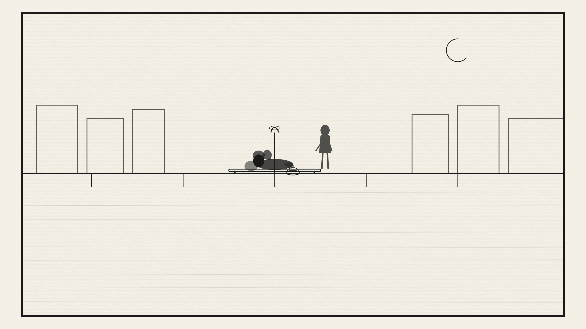
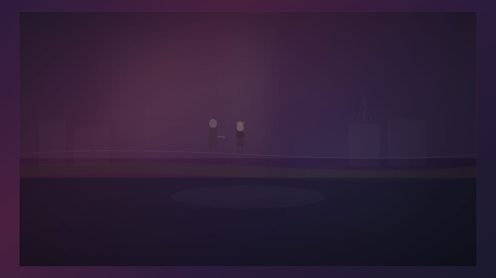
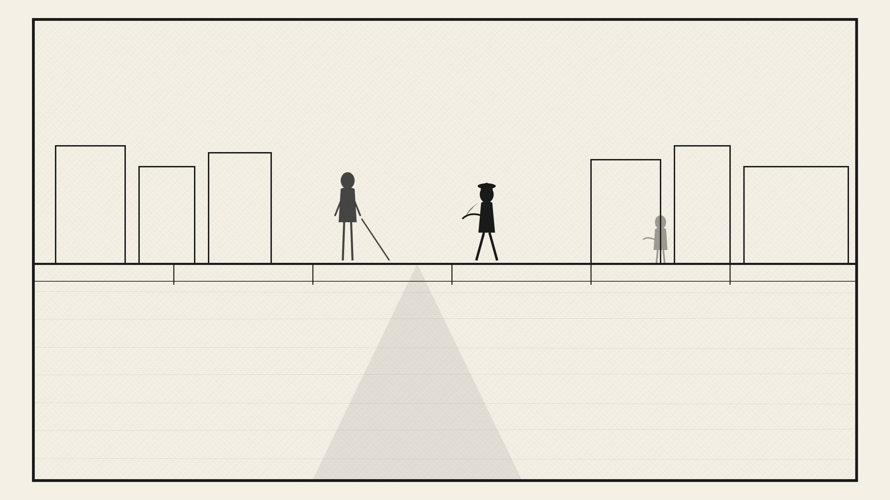

天哪！所有这一切怎样结局啊！如何结局啊！

我是九点钟来的。她已经到了那里。我老远就发现了她。像第一次见面那样，她手臂依着沿河街的栏杆，没听到我走近她的脚步声。

“纳斯金卡！”我竭力压住自己的激动，喊了她一声。

“唔！”她说道，“喂，快点！

我莫明其妙地望着她。

“喂，信在哪里呢？您把信带来啦？”她一手抓住栏杆，重复问道。

“不，我没有信，”我终于说了出来，“难道他还没来？”

她面色惨白，相当可怕，一动不动地望了我好久。我粉碎了她最后的一线希望。

“唔，但愿上帝与他同在！”她终于用断断续续的声音说道，“如果他这样抛弃我，上帝是会和他在一起的。”

她垂下两眼，后来她想瞧我一下，但她又办不到。她还花了好几分钟才克制住自己的激动。可是她突然转过身子，伏在沿河大街的栏杆上，大声痛哭起来了。

“别哭啦！算了！”我本想开口说话，但我无力望着她继续说下去，再说，我说什么好呢？

“您不要安慰我，”她哭着说道，“您千万别说他，不要说他会来，说他不会那么残酷无情，那么毫无人性地把我抛下，就像他所作的那样。为什么，为什么？难道我的信里，那封倒霉的信里有什么问题吗？……”

这时痛哭嚎啕的声音，压过了说话的声音，我望着她心也碎了。

“啊，这多残酷无情，多没有人性啊！”她又开始说话了。

“连一行字，一行字也不写！那怕是回答说他不要我了，他要甩掉我也好嘛，要不然整整三天连一行字也没有！他伤害、侮辱一个不能自卫的可怜姑娘有多轻松！而这个姑娘的过错就是不该爱他。啊，在这三天里，我忍受了多少痛苦！我的天哪，我的天哪！一想起我第一次亲自登门去找他，我站在他面前低声下气、痛哭流涕，向他乞求爱情，那怕一点点也好……还有以后呢！……您听我说，”她转身对着我说了起来，她的一对黑眼睛熠熠闪着泪光！“这不会是这样的！这不可能这样，这不合乎情理！莫非是您，要不就是我受骗上当了？也许他没有收到信？也许他至今一无所知？怎么可以，您判断一下，看在上帝的面上，请您告诉我，给我解释解释（我对此无法理解），怎么可以这么野蛮、粗暴地行事？他怎么可以如此待我！连一句话都不说！即使对待世上最低贱的人，也不能如此缺乏同情心嘛！也许他听到了什么闲言，也许有人对他说了我许多坏话？”她大声叫喊，向我提问，“您是怎么看呢？”

“您听着，纳斯金卡，我明天代表您去找他。”

“唔！”

“我向他问个明白，把一切情况都给他讲清楚。”

“唔，唔！”

“您写封信，不要说不，纳斯金卡，千万不要说不！我会迫使他尊重您的行为，他一切都会了解清楚的，假如……”

“不，我的朋友，不，”她打断我的话，“够了！我不再写一个字，一个字，一行字都不再写了，已经够了！我不了解他，我不再爱他了，我会把他……忘……记掉……”

她没有把话说完。

“您安静一下，您安静一下！纳斯金卡，您坐在这里，”我说完要让她坐到长凳上。

“我已经很平静。够了！原来是这样！这是眼泪，不过它会干的。您以为我会自杀，我会投水自尽吗？”

我的心情非常激动，本想说几句，却又说不出来。

“您听着！”她抓住我的手，继续往下说去。“请您告诉我：要是您，肯定不会这么做吧？您不会抛弃自动找上门来的姑娘，不会对着她的两眼、厚颜无耻地嘲笑她那颗脆弱、愚蠢的心吧？您会珍惜她吗？您会想到她孤零零的，她不善于照看自己，她不善于放弃对您的爱情，她是无辜的，她之所以无辜是因为她没干任何坏事！……天哪，我的天哪！……”

“纳斯金卡！”尽管我无力克服自己的激动，我还是叫喊起来了。“纳斯金卡！您在折磨我！您伤了我的心，您简直是在枪杀我，纳斯金卡！我无法保持沉默！最后我应该说话，把我心中翻腾的一切全说出来……”

我说的时候，身子从凳子上稍稍抬了起来。她抓住我的手，惊讶地望着我。

“您怎么啦？”她终于说道。

“您听我说！”我果断地说道。“您听我说，纳斯金卡！我现在要说的，全是胡说八道，全是不能实现的，愚蠢至极！我知道，那是永远也不会出现的事，不过，我还是无法保持沉默。我以现在受难的名义，事先央求您，请您原谅我！……”

“快说，到底是什么事？”她说道。她已停止哭泣，目不转睛地望着我，一双惊讶的眼睛，露出奇怪的好奇表情。“您出什么事啦？”

“这是不可能实现的，但是我爱您，纳斯金卡！就是这回事！好了，现在全讲出来了！”我说完把手一挥。“现在您会看到，您能不能像刚才同我谈话时那样说话，最后看您能不能听听我要对您说的话……”

“唔，说什么，到底说什么呀？”纳斯金卡打断我的话，“这又有什么呢？嗯，我早就知道您爱我，不过，我觉得您只是一般地喜欢我罢了……哎呀，我的天哪，我的天哪！”

“起初是一般地喜欢，纳斯金卡，可现在，现在……我就和您一样，像您带着包袱去找他的时候那样。比您那时还不如，纳斯金卡，因为他当时没有爱任何人，可您现在却爱着一个人。”

于是纳斯金卡完全心慌意乱了。她两颊绯红，垂下了两眼。

“怎么办，纳斯金卡，我到底该怎么办！我有罪，我滥用了……不，不，有罪的不是我，纳斯金卡！这是我听到的，感觉到的，因为我的心在告诉我，说我是做得对的，因为我不能伤害您，一点也不会侮辱您！我是您的朋友，就是现在也是朋友。我没有丝毫改变。您看，纳斯金卡，我在流泪。让它流吧，不断地流吧，它不会妨碍任何人，它也会干的，纳斯金卡！……”

“您坐下来嘛，您坐！”她说完就让我坐到长凳上，“啊，我的天哪！”

“不！纳斯金卡，我不坐。我已经无法再呆在这里了，您再也不能再见到我了。我把一切说完就走。我只是想说，您永远也不知道我在爱您。我要保守秘密。我不会在现在，在此时此刻用我的自私来折磨您。不！不过，我现在已经忍不住了。是您自己先开口谈起这事来的，责任在您那里，责任全在您身上，我没有错。您不能把我从您的身边赶走……”

“当然不，不，我不赶您走，绝对不！”纳斯金卡说的时候，尽量设法掩饰自己的窘态，真可怜！

“您不赶我走？不！我本想从您这儿自行跑走。我先说完就走，因为您在这里说的时候，我坐不住。您在这儿痛哭，您在这里自我折磨，因为，唔，因为（我要把这个说出来了）因为您遭到了抛弃，您的爱情受到拒绝，而我却亲身听到，亲身感到，我的心里有着多少对您的爱。纳斯金卡，有着多少爱啊！……一想起我的这些爱，对您一无所助，我就感到非常痛苦……连心都痛炸了，所以我不能沉默，我应该说出来，纳斯金卡，我应该说啊！……”

“对，对！您对我说吧，就这样同我说吧！”纳斯金卡做了一个无法解释的动作，说道，“我同您这么说话，您也许感到奇怪，不过……您说吧！我以后再告诉您！我会把一切都告诉您！”

“您是在可怜我，纳斯金卡。您只不过是可怜可怜我，我的好朋友！过去的事就让它过去吧！说出去的话你是收不回的。不是这样吗？好了，现在您什么都知道了。您瞧，这就是出发点。唔，好！现在这一切都是美好的，不过，您听我说！您坐着哭的时候，我想过我自己（哎呀，请允许我说出我当时的想法）！我想（当然，纳斯金卡，这是不可能的），我以为您……已经完全和他分手，不再爱他了。当时（这一点昨天和以前我都想过，纳斯金卡），当时我就这么干，一定要想方设法让您爱上我。您不是说过，您不是亲口说过，纳斯金卡，您几乎已经完全爱上我了吗？好，下一步怎么办呢？好了，这几乎是我想要说的全部了。只剩一点没说，那就是假如您爱上了我，那会出现什么情况呢？仅此一点，别的什么也没有了！您听听我说吧，我的朋友（因为您终归还是我的朋友）。当然，我是一个普普通通的人，是这么一个无足轻重的人，而且一贫如洗，不过，问题不在这里（好像我总是说不到点子上，这是心情烦乱造成的，纳斯金卡），而在于我是那么爱您，即便在您还爱着他，还继续爱着那个我不认识的人时，也是那么爱您。您肯定不会发觉，我对您的爱会成为您沉重的包袱。不过，您会随时听到，无时无刻不感觉到，有一颗崇高的、高尚的心，一颗热烈的心在您的身旁，为您而跳动……啊，纳斯金卡，纳斯金卡！您真把我迷住了！……”

“您不要哭嘛，我不希望您哭，”纳斯金卡说完就迅速地从长凳上站起身来。“走，起来，和我一起走，您不要哭嘛，您千万别哭，”她一边说一边用手巾给我擦眼泪。“好，我们现在一起走，也许，我还有话要对您说呢……是的，既然他现在已经抛弃了我，既然他已将我忘掉，尽管我还爱着他（我不想骗您。）……现在您听我说吧，请您回答我。比如，如果我爱上了您，也就是说如果我只是……啊，我的朋友，我的朋友！我一想起我曾经嘲笑过您对我的爱，以至于伤害了您，甚至还夸过您没有爱上我呢！我就感到难过。……啊，天哪！我怎么就没有预见到这一点，我怎么就没有预见到呢？我真愚蠢，不过……好了，我下定了决心，我把一切都说出来……”

“您听我说，纳斯金卡，您知道吗？我马上要离开您，就是这么个事。我简直是在折磨您。瞧，您现在为了曾经嘲笑过我而受到了良心上的谴责，可是我不希望，是的，我确实不希望您除了痛苦之外……我当然是有责任的，纳斯金卡，我们分手吧！”

“站住，您听听我的意见吧。您能等下去吗？”

“等什么？怎么等？”

“我是爱他，但这会过去的，这是应当过去的，它不能不过去，实际上也正在过去，我听见……谁知道呢？也许今天就会结束，因为我恨他，因为当我们在这里一起哭泣的时候，他嘲笑过我；因为您不像他那样，把我抛掉；因为您爱我，而他却不爱；最后因为我自己爱您，是的，我爱您！我像您爱我一样爱您！这一点我不是以前亲口对您说过，您亲自听到过吗？我爱您，因为您比他好，因为您比他高尚，因为，因为他……”

可怜的姑娘激动得说不下去了，她把头靠在我的肩上，后来就躺到我的怀里，伤心地痛哭起来了。我安慰她，劝她，但她还是哭个不停。她一直握着我的一只手，一边痛哭嚎啕，一边说道：“您等一等，您等一等，我马上就不哭了！我想告诉您……您不要以为这些眼泪（这是由于软弱造成的）……您等一等，它会过去的……”最后，她停止了哭泣，擦去了眼泪，我们又往前走去了。我本想开口说话，但她老是求我等一等。我们后来都不说话了……最后，她打起精神又开始说了起来。

“是这么回事，”她用虚弱无力和颤抖的声音开始说道，但那声音之中突然响起一种异样的音符，直接刺进我的心里，叫人感到甜蜜蜜的。“您别以为我是那么水性杨花、朝三慕四，不要认为我会那么轻率而迅速地忘记和背信弃义……我爱过他整整一年，我可以用上帝发誓，我甚至从来没有动过对他不忠实的念头。但他对这事却是鄙视的，他嘲笑过我，愿上帝与他在一起！他刺激我，而且伤害过我的心。我不爱他，因为我只能爱一个度量大、能理解我、道德高尚的人，因为我自己就是一个这样的人，所以他不值得我爱，咳，愿上帝与他同在！他这样做更好，比我在自己以后的期待中发现受骗上当时才认清他的面目要好。……好啦，完了！但是，我善良的朋友，谁知道呢？”她握着我的手继续说下去。“谁知道呢？也许我全部的爱就是感情上的受骗，想象力的受骗，也许它一开始就是一场淘气的游戏，是一些鸡毛蒜皮的小事，而产生它的原因是我生活在奶奶的监视之下吗？也许，我应该爱的是另一个人，而不是他，不是一个这样的人，而是一个怜我痛我的人，所以，所以……咳，我们不谈这个事吧，不谈啦，”纳斯金卡激动得喘不过气来，把话打断了。“我只想告诉您……我想告诉您的是：尽管我爱他（不，是过去爱他），尽管您还会说……假如您觉得，您对我的爱非常深，最终足以从我的心中把我以前对他的爱，排除出去的话……如果您想可怜我，如果您不想我一个人去单独面对命运的挑战，没有人安慰，没有希望，如果您想象现在这样爱我，永远爱我的话，那么我可以赌咒发誓，我对您的感激，我对您的爱最终是会对得起您对我的爱的……您现在愿意抓住我的手吗？”

“纳斯金卡，”我哭得上气不接下气，大声叫了起来。“纳斯金卡！……啊，纳斯金卡……”

“好，够啦，够啦！唉，现在真的够啦！”她好不容易才克制住自己，说了起来。“唔，现在什么都说完了，不是吗？是这样吗？唔，您非常幸福，我也非常幸福，这事以后就根本不用再说了。请您等一等，您饶恕我吧……看在上帝的份上，您谈点别的，行吗？……”

“对，纳斯金卡，对！这事已经谈够了，现在我感到很幸福，我……唔，纳斯金卡，我们开始谈别的事吧，快，快，我们快点谈。是的，我准备……”

结果我却不知道说什么好，我们一会儿哭，一会儿笑，说了上千句既无思想内容又互不连贯的话。我们时而沿着人行道走去，时而又突然返身往回走，穿过街道。后来我们停下来，又走到沿河大道上。我们完全像是两个不懂事的孩子……

“我现在一个人住，纳斯金卡，”我开始说话，“可明天……唔，纳斯金卡，您当然知道，我很穷，我总共才有一千二百卢布，不过，这没有什么关系……”

“当然，不，奶奶有养老金，她不会加重我们的负担。应该带上奶奶！”

“哪当然，奶奶是该带上的……只是这个玛特莲娜……”

“啊呀，我们也有个菲克拉呀！”

“玛特莲娜，心肠好，只是有一个缺点：她没有想象力，纳斯金卡，完全没有想象力。不过，这没有什么关系！……”

“反正一样。他们两个可以在一起。不过，您明天就搬到我们那里去。”

“这怎么行呢？搬到你们那里去！好，我准备去……”

“是的，您去租我们的房子住。我们楼顶上，有个小小的阁楼，它空着的，原来有个老太太住，她是贵族，后来搬走了，再说我知道，奶奶希望进一个青年人。我问过她：‘干吗要进一个青年人呢？’她的回答是：‘是这样的，我老了，不过你可不要以为，纳斯金卡，我想给你做媒，让你嫁给他。’我猜想这是为了那个……”

“哎呀，纳斯金卡！……”

接着我们都笑了起来。

“唔，算了，不说了，您现在住在哪里？我把它忘啦！”

“住在乌——桥边，巴拉尼科夫家的房子里。”

“那是一幢这么大的房子？”

“是的，有这么大。”

“啊呀，我知道，房子好。您知道吗？您还是把它退掉，快点搬到我们家来吧……”

“明天，纳斯金卡，明天搬。我在那里还欠着点房租，不过，这不要紧的……我不久就可以领到薪水……”

“您知道吗，我也许会去讲课。我一边学习，一边讲课……”

“那太好啦！……我很快就会获奖，纳斯金卡……”

“这么说来，您明天就要成为我的房客了……”

“是的，我们也坐车去看《塞维尔的理发师》，因为这个歌剧很快又要演出了。”

“对，我们去，”纳斯金卡笑着说道，”“不，最好我们不去听《塞维尔的理发师》歌剧，而去看点别的……”

“唔，好，我们看别的，当然，这会更好，要不我真没想到……”

说这话的时候，我们好像走在云里雾里，似乎不知道我们出了什么事。一会儿停下来，站在一个地方交谈很久，一会儿又放开脚步，信步走来走去，又是笑，又是哭的……纳斯金卡突然想回家，我不敢阻拦她，想把她送到家门口。我们走着走着，过了刻把钟，突然发现来到了沿河大街我们的长凳旁。她叹息一声，泪水又涌到了眼边。我害怕了，全身直冒冷汗……但她马上握住我的一只手，拖着我又走来走去，天南海北地聊天、说话……。

“现在该回家了，我该回家了，我想，天色已经很晚，”纳斯金卡终于说话了，“我们的小孩子气也该发够啦！”

“对，纳斯金卡，不过我现在已经睡不着了，我不回家去。”

“大概，我也会睡不着的，不过，您得伴送我……”

“一定！”

“但现在我们一定要走到我的住房门口才行。”

“一定，一定……”

“是真话？……反正迟早总是要回家的！”

“是实话，”我笑着作了回答……

“那好，我们走吧！”

“走吧。”

“您看看那天空，纳斯金卡，您看看吧！明天一定是个美妙的日子，多蓝的天空，多好的月亮！您快看哪，这朵黄色的云彩马上就要遮住月亮啦，您快看呀，快看呀！……不，它飘过去了，快看呀，快看呀！……”

但是纳斯金卡却没有看云彩，她站在那里，默不作声，像被钉子钉住了似的。过了一会儿，她好像有点害怕似的，紧紧地靠在我的身上。她的一只手在我的手中颤动，我望了她一眼……她靠着我更紧了。

这时候，从我们的身旁走过去一个青年人。他突然把脚步停了下来，盯着我们看，随后又走过去几步。我的心开始抖动起来了……

“纳斯金卡，”我低声问道，“这是谁，纳斯金卡？”

“是他！”她悄悄地回答，身子靠得我更近，也颤抖得更厉害……我费了好大的力气才站稳脚跟。

“纳斯金卡！纳斯金卡！原来是你呀！”我们身后传来一个声音，这时那个青年人朝我们身边走了好几步……

天哪，这是什么叫喊声呀！她浑身一抖！她马上挣脱我的两手，迎着他扑了过去！……我站在那里，呆呆地望着他们，像死了似的。但是她刚把手伸过去，刚要倒进他的怀抱中时，突然又回转身子朝我走来，像风，像闪电一样，飞快地出现在我的身旁，我还没来得及醒过来，她的两只手已经把我的颈脖子紧紧抱住，热情地吻了我一下。后来，对我一句话也没说，又跑到他身边，拉起他的两手，拖着他一起走了。

我望着他们的背影，站立了好久……最后他们两个都从我的视线中消失不见了。 
wＷw。xiaoshuo txt.coＭ