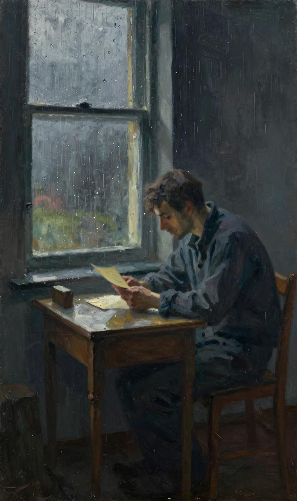
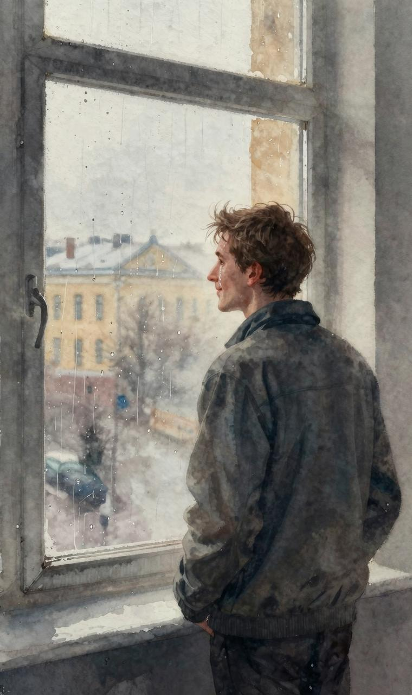
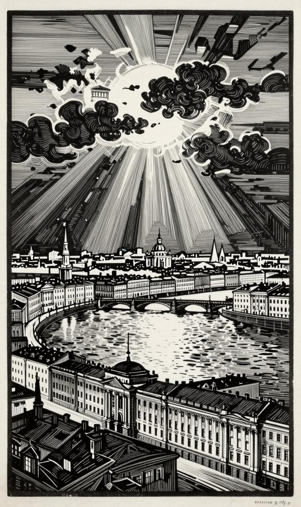

早晨的降临，结束了我的夜晚。天气不好。下着雨，雨点敲打着我的窗玻璃，令人感到凄怆。小房间里漆黑一团，外面也是阴沉沉的。我头痛，发昏，寒热病已经偷偷地钻进了我身体的各个部分。

"有您一封信，先生，是市邮局的邮差送来的。"玛特莲娜俯身对着我说道。

"信！谁来的？"我从坐椅上一跃而起，叫了起来。

"我不知道，先生，你看看吧，或许写着呢！"

我打开铅封。原来信是她写的！

"啊，请您原谅，原谅我！"纳斯金卡在信中对我写道，"我双膝跪着求您，请您原谅我。我欺骗了您也欺骗了我自己。这是一场梦，一个幻象……我今天为您感到痛心，请您原谅，请您原谅我！……

"不要怨恨我，因为我在您的面前，没有任何改变。我说过我将来会爱您，而且现在我也爱您，而且还不止于此。啊，天哪！要是我一下能爱上你们两个该有多好啊！啊，要是他是您有多好啊！"

"啊，要是他是您有多好啊！"这一句话在我的脑海中一掠而过。我想起了您的话，纳斯金卡！

"上帝知道，我现在该为您做什么好！我知道您心情沉重，十分悲伤。是我伤了您的心，但是您知道，既然爱，受了委曲是不会记很久的，而您是爱我的！

"我很感激！是的，我感谢您对我的这种爱，因为它在我的记忆中，已经留下深深的印记，像一场甜蜜的美梦，醒来后久久不能忘却；因为我将永远记住那一瞬间，当时您像兄弟一样向我敞开您的心，那么宽宏地接受我的一颗破碎心，珍惜它，抚慰它，给它治愈创伤……如果您原谅我，那么，对您的怀念在我的心里必将上升成为对您的永远感激，而这种感激之情是永远也不会从我的心灵之中消失的……我将保留这种情感，对它忠贞不二，永不改变，也决不背叛我自己的心。我的这种感情是始终如一的。昨天它还是那么快地回到了它永远归属于那个人的身边。

"我们将来会见面的，您会来看我们的，您不会抛弃我们，您将永远是我的朋友、兄弟……您见到我的时候，您一定会向我伸过手来……好吗？您会向我伸手，您会原谅我，不是吗？您仍然爱着我，是吗？

"啊，您爱我吧，千万别抛弃我，因为我此时此刻是那么爱您，因为我值得您爱，因为我受之无愧……我亲爱的朋友！下星期，我就要和他结婚。他是带着深深的恋情回来的，他从来没有忘记我……我在信中提到他，您千万不要生气。我会带他一起来看您。您会爱上他的，对吗？

"请您原谅我们，请您记住和喜爱您的纳斯金卡。"

这封信，我翻来复去看了好久。我的眼泪夺眶而出。最后，信纸从我手中掉落下来，我两手捂着脸。

"亲爱的！亲爱的！"玛特莲娜开始说话了。

"出什么事啦，老太婆？"

"天花板上的蜘珠网我全部扫掉啦，现在您要结婚办喜事、宴请宾客，都行啦！……"

我望了望玛特莲娜……这还是一个精力相当充沛的年轻的老太婆，但是，我不知道为什么，我忽然觉得她目光灰暗，满脸皱纹，腰弯背驼、老态龙钟……我不知道为什么我忽然觉得，我的这个房间也像老太婆一样，老态百出。墙壁和地板已经变色，一切都变得暗淡无光，蜘蛛网也越来越多。我不知道为什么，当我向窗外望去时，我觉得对面的一幢房子，也是老态龙钟，灰暗无色了，圆柱上的灰泥纷纷消蚀、剥落，房檐变黑了，而且均已开裂，深黄色的墙壁，原来颜色鲜艳，现在也到处是斑斑点点，简直不堪入目了……

莫非是阳光从乌云里面钻出来，又藏到一朵雨云后面去了，所以我眼中的一切，又变成一团漆黑；也许在我面前闪过的，是我未来的全景，它是那么不友好，令人伤心！于是我发现整整十五年以后的我，还是像现在一样，只是老了一点，还是住在这间房里，还是那么孤孤单单，还是和玛特莲娜在一起。后者在这些年里，一点也没有变得聪明起来。

要我记住我受到的委曲吗，纳斯金卡？要我驱赶一片乌云，在您明朗而宁静的幸福头上，留下一片阴影吗？要我狠狠地责骂您，让您的心灵，蒙上一层愁苦，暗暗地用良心上的谴责，去刺痛您的心，迫使它在最最幸福的时刻，忧心忡忡地跳动吗？当您和他一起走上祭坛举行结婚仪式的时候，要我把您扎在您的黑卷发上的鲜花踏碎，即便是其中的一朵也罢，行吗？……啊，不，永远也不！但愿你头顶上的天空永远晴朗，您迷人的微笑永远爽朗、平静，但愿你在幸福的时刻，非常幸福，因为你曾经把幸福给予过另一颗孤独的、满怀感激的心！

我的天哪！整整一分钟的幸福！即便是对于一个人的整个一生来说，难道这还少吗？