怎么数，也只有区区的一美元八十七美分，其中的六毛钱，还是一分分的硬币。

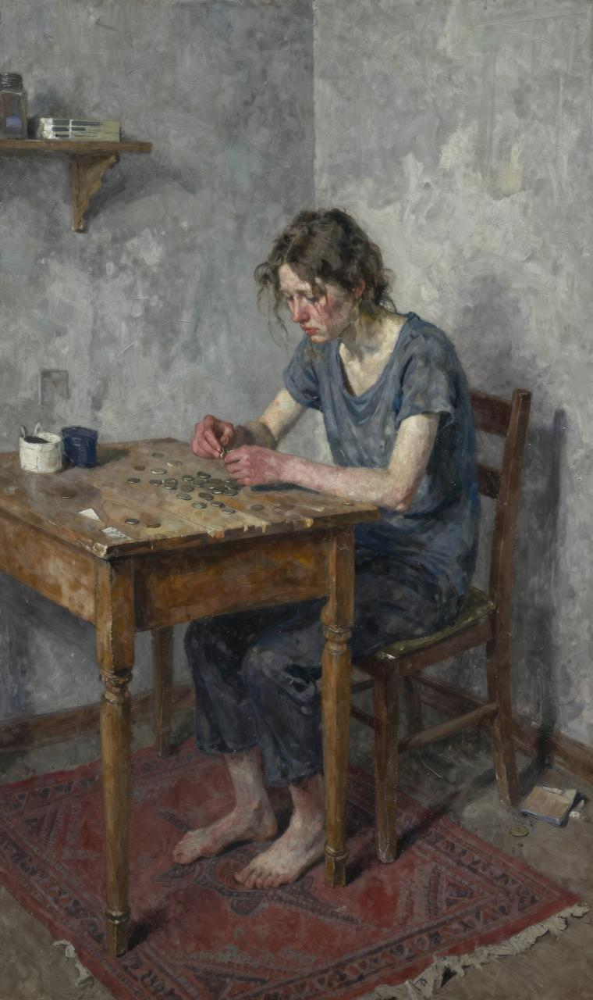

即便是这点儿钱，也是德拉从杂货铺、菜市场、肉食摊位那里厚着脸皮，软磨硬泡地一分一分地攒下的。德拉不是厚脸皮的妇女，她在和商贩们斤斤计较的同时，也会暗暗脸红，她知道自己这样的行为会被别人所不齿，甚至是嘲笑，但是她没办法。德拉反反复复地把这一美元八十七美分数了三次，但每次结果都是一样。然而明天就是圣诞节了，此时她还能做什么？除了在她那张破旧的小床上大哭一场。

德拉没有别的办法，她突然领悟到人生无非是由抽噎、哭泣和微笑组成的，而抽噎占了其中绝大部分。此时的德拉，这位家庭主妇，正在努力将自己的情绪平复，那我们先来看看她的家吧。

这是一套租来的公寓，屋子的主人为这个公寓添置了些破旧的家具。整体来看，这间屋子简直糟糕透了，如果说这是一所贫民窟的房子也会有人相信。就这样一套小屋，它的租金是每周八美元。

在楼下的门廊里有个信箱，可是投递员从来没有光顾过这里；在门边还有一个电铃，当然，它也从来没有被按响过。除此之外，门边上还有一张名片，上面写着"詹姆斯·迪林厄姆·杨先生"。

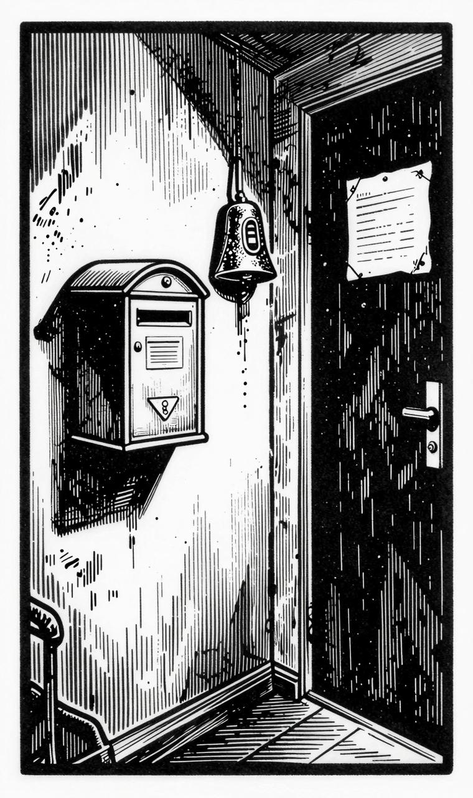

"迪林厄姆"这几个字，是名片的主人在其职场得意之时加上去的，那个时候，他每个星期的收入是三十美元。然而，随着他每周收入缩减到二十美元，那个名片上的名字也显得黯然失色了。或者这些字母正在考虑把当初张扬、高傲的“迪林厄姆”缩减成为谦虚的字母“D”。不过不是所有的一切都这么糟糕，每天当詹姆斯·迪林厄姆·杨先生下班回到家，走进自己楼上的房间时，詹姆斯·迪林厄姆·杨夫人，也就是前面提到的德拉，就会送给詹姆斯·迪林厄姆·杨先生一个大大的拥抱，并且亲昵地称呼他“吉姆”。

再说回德拉吧，刚才痛哭过后已经让她的心情平静许多，她起身，用粉扑掩盖一下自己刚才的失态，之后站在窗前。德拉呆呆地望着外面的一片灰色，灰蒙蒙的天空下，有一只灰白色的猫走在灰白色的篱笆上。或许这些灰色与德拉的心情有关。明天就是圣诞节了，然而德拉却只有那少得可怜的一美元八十七美分，这点钱能给她心爱的丈夫买怎样的礼物？她已经尽力了，在这几个月里，德拉省吃俭用，对自己已经十分苛刻了，只要能多节省下一分，她就会多节省一分。但是，每周的二十美元确实不够花，最终的支出总是比她预计得要多。无论她怎样努力，还是周周如此。德拉用了那么长的时间来筹备吉姆的礼物，虽然说筹备的时光是幸福的，但这一美元八十七美分怎样也不能送给吉姆一件精致的礼物，至少是配得上吉姆的礼物。

在房间的两扇窗户的中间墙壁上，挂着一面镜子。这面镜子与这每周八美元的廉价房真是绝配。假设一个娇小身材的女生站在这面镜子前，那么她只能通过这种纵向的断断续续的影像，了解自己的一个大概的容貌和身材轮廓。对于身材苗条的德拉来说，她已经深谙其道。

德拉在毫无征兆的情况下，突然将身体转向镜子，与镜子里的自己面对面而站，此时她的眼中闪烁着一丝光亮，但是这种光芒却维持了不到二十秒的时间，随后被满脸的阴郁所取代。她快速地将绾起的头发拆开，它们像瀑布一样倾泻下来。

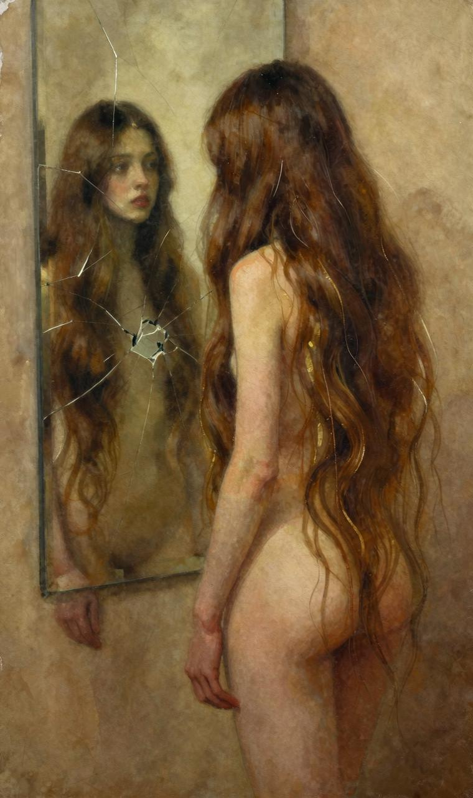

其实，德拉与她的丈夫詹姆斯·迪林厄姆·杨先生，各有一样引以为傲的宝贝。一件是詹姆斯·迪林厄姆·杨先生的金表。这块金表是他的祖父传给他的父亲，他的父亲又传给他的。另外一件，就是德拉的秀发。这样说吧，如果《圣经》中的希巴女王就住在德拉的对面，那么当德拉洗完头发，将头发伸到窗外晾晒的时候，希巴女王的所有珠宝都会黯然失色；如果所罗门王自己给自己的地下金库当守门人的话，那么当吉姆走过他的门前，掏出那块金表看时间时，所罗门王也会嫉妒吉姆有这样一个宝贝，乃至捶胸顿足。

眼前，一头美丽的长发一直垂到膝下，披散在德拉那瘦小的身体四周，宛如一件棕色的晚礼服，光闪夺目。德拉的长发又如一道瀑布，微波起伏。可是，德拉只让这种状态保持了一瞬，便立刻将其绾起，之后傻傻地站在镜子前，满心踌躇，任由两滴热泪肆意地溅落在破旧的红地毯上。德拉穿上那件棕色的，有些破旧的外套，顺手戴上了依旧很破旧的棕色帽子，轻盈的步伐带动着衣裙飞扬。她走出了房门，来到了大街上，只是眼里依旧还闪烁着泪光。

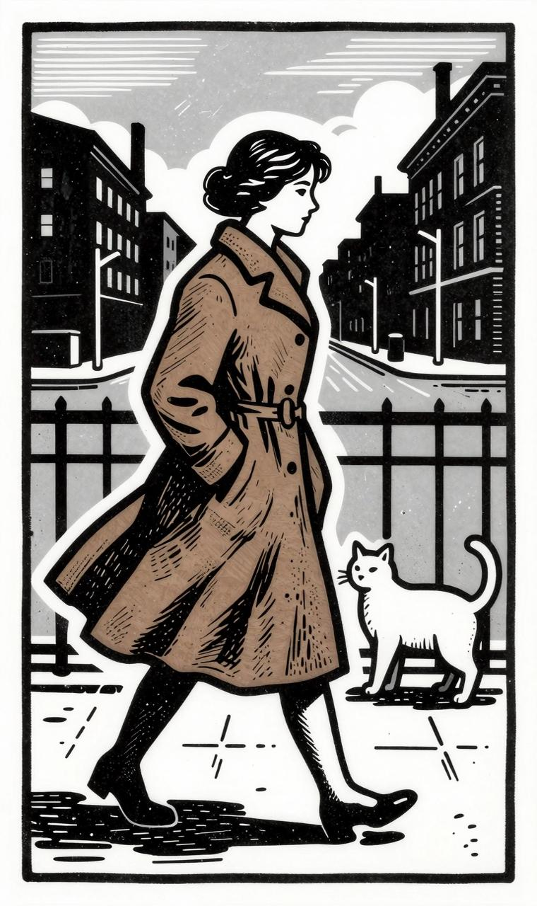

德拉走到一家店铺前，只见店铺的招牌上面写着：索弗罗妮夫人——头发制品专营店。她不由自己多想，快步冲上楼去。进入店铺时，她已经气喘吁吁了。德拉定了定神，看见一位体态臃肿的妇女。她面色苍白，态度严正，一副不可接近的样子。这个人与“索弗罗妮夫人”这个名号一点都不相称。

德拉问道：“你买头发吗？我想卖掉我的头发。”那位夫人说：“是的，我买头发。

你把你的帽子摘下来，我先看看你的头发。"棕色的瀑布一泻而下，美丽极了！那位夫人一边老到地抓着德拉的头发，一边说："二十美元。"说实话，无论出多少价钱，对于这完美的头发而言都是少的，只是德拉已经下定了决心，她无心讨价还价，只想快些结束这场交易，于是她说："就这么定了，快给我钱吧。"

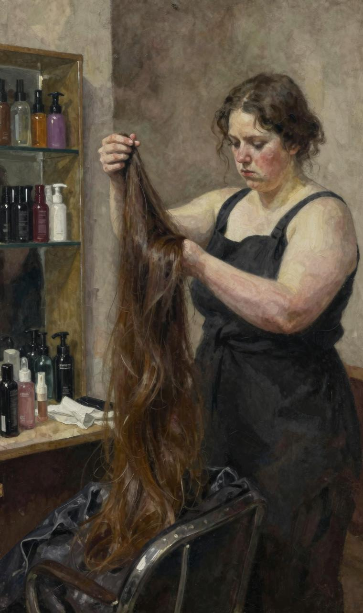

快乐的时光就像装有翅膀，总是流逝得很快，不管这个比喻是否恰如其分，但在接下来的两小时的时间里，德拉确实从一家店铺逛到另一家店铺，她一家家搜寻着适合吉姆的礼物。

几番周折过后，德拉终于找到了适合吉姆的礼物。与其说是适合，不如说这就是为吉姆准备的。这是再好不过的礼物了，一条简洁大方的白金表链。白金的品质上乘，除了镂空的设计别无其他，正如一切高贵典雅的艺术品一样，它无须过多庸俗的装饰。

这条表链与吉姆的金表简直就是绝配，当德拉看到它的时候，她就知道它是吉姆的了。

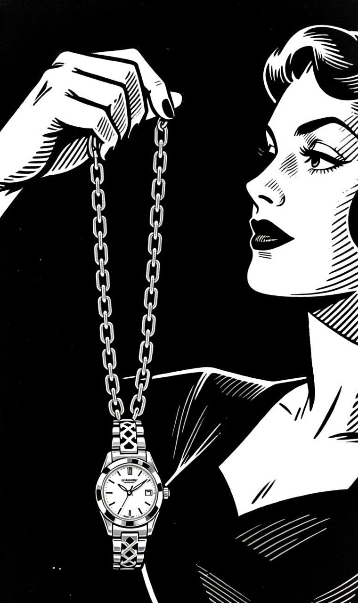

因为高贵而不张扬的表链与成熟又稳重的吉姆相得益彰。德拉花了二十一美元将这条表链买下，紧攥剩下的八十七美分往家赶。一路上她都在想，这下吉姆可以大大方方地用他的金表看时间了，他再也不用因为羞愧于金表上那破旧的皮带而总是偷瞄时间了。

一路上的兴奋与喜悦都在德拉进门的刹那开始慢慢消退了。她的表情从小女生的那种快乐变成谨慎而又充满智慧。她麻利地找出烫发的工具，开始着手补救因为爱，因为慷慨而造成的损坏。这是德拉今后的工作中，最难的一项，简直是一项了不起的工作。

在不到四十分钟的时间里，德拉让她的头上满是密密麻麻的小卷，它们紧贴着她的脑袋。她死死地盯着镜子，看着镜子里那个人，就像一个习惯逃学的小男孩。德拉将头转向左面，之后又转向右面，挑剔地看着自己的新发型，自言自语道："如果吉姆看到现在的我，一定想要把我杀了。如果我能幸存，他也会觉得我像康尼岛上的卖唱姑娘。但是，我真的没有别的办法了，一美元八十七美分真的什么都做不了。"

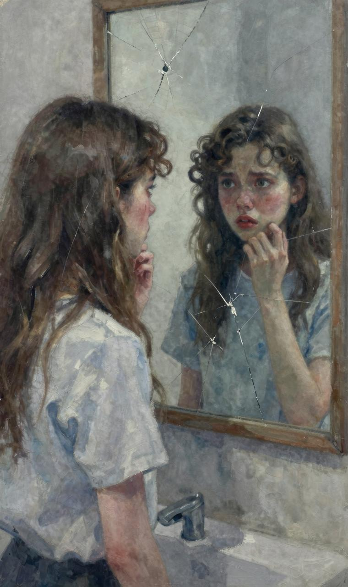

每天晚上七点钟左右，吉姆都会准时回家。此时，德拉已经将咖啡煮好了，并且将煎锅放在炉子上加热，只等待吉姆进门，就可以在第一时间煎上牛排了。德拉坐在最靠近门边的椅子上，手里握着那条她精心挑选的圣诞礼物。突然，她听到了一阵熟悉的脚步声，与往日不同的是，她此时非常紧张，脸色变得苍白。她轻声地祈祷：“上帝保佑，一定要让吉姆觉得我像以前一样漂亮。”德拉总是为一些小事祈祷，但此时她觉得这件事并不小。

门开了，吉姆像往常一样自然而又熟练地将门随手关上。他的身材很消瘦，只是在他的脸上，有种不该出现在二十二岁的年轻人身上的那份镇静与严肃。这一切或许因为他过早地需要承担起家庭的重担，而此时的他不仅外衣是破旧的，就连手套都没有。

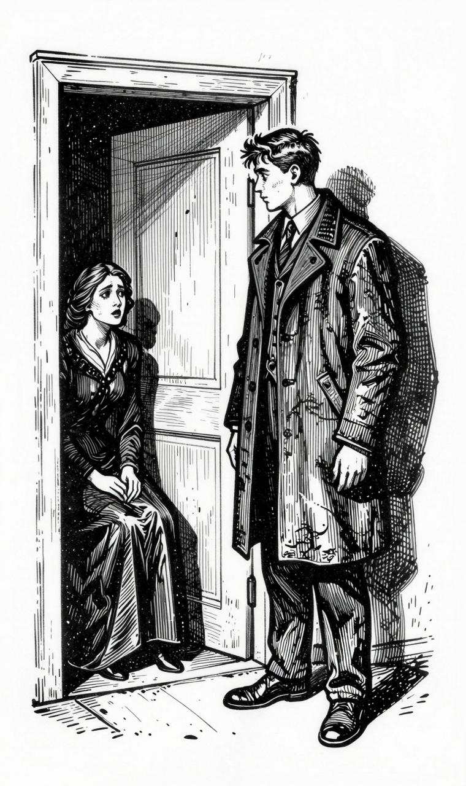

打从吉姆进门后看到德拉的那刻起，他就一动都没有动过了，就像是一条猎犬嗅到了猎物的味道。他死死地盯住德拉，脸上的表情让人捉摸不透。既不是愤怒，也不是厌恶，更不是惊讶，这种怪异的表情德拉无法读懂，只是让她感觉到了一丝丝恐惧。德拉猜想过吉姆看到短发的自己时的反应，但此时吉姆的表现不是她预料中的任何一种，他只是死死地盯着她，看不出他心里在想什么。

德拉立刻从椅子上跳起来，走到吉姆的身边，她有些失控地喊道：“哦，吉姆，我亲爱的吉姆，别这样盯着我看。我剪掉头发，只是想用它们换些钱，给你买件圣诞礼物。否则我真的没办法安心度过这个圣诞节。我真的没有别的办法了。头发剪掉了可以再长出来，况且我的头发长得很快的。好了，吉姆，快说‘圣诞快乐’，我们来高高兴兴地过节。你一定猜不到我为你准备了一样多么适合你，又多么精致的礼物。”这一连串的话，仿佛吉姆并没有听到，他的思绪仍旧停留在德拉的头发上，他一字一顿地说：“你真的把头发剪掉了？”德拉回答道：“是的，剪掉了，并且已经卖了。我知道，没有头发，你也一样会爱我的，对吗？”

吉姆好像仍旧没弄明白是怎么回事儿，他用那副没人能懂的表情四处张望，之后傻乎乎地问：“你的头发，已经没有了吗？你是这个意思吗？”德拉安慰道：“是的，亲爱的。头发我已经卖掉了，没有了，你不用找了。为了能让你度过一个美好的平安夜，我才卖掉了我的头发。你以后一定要好好对待我。”此时的德拉突然变得很温柔，她深情款款地说，“或许我的头发能数得出来有多少，但我对你的爱已经多得数不清了。好了，亲爱的，我去煎牛排，好吗？”此时的吉姆终于从恍惚中走了出来，他紧紧地将德拉拥入怀中。

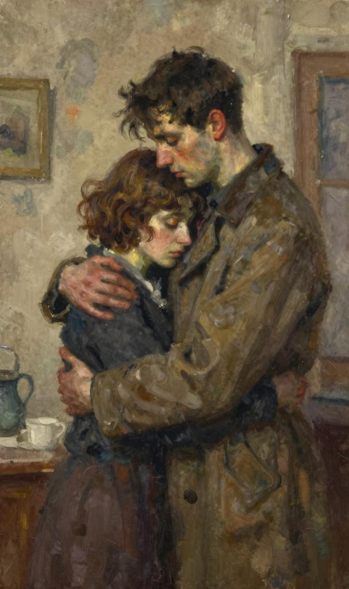

现在，我们先让那对恋人相拥一会儿。因为我们得用十几秒的时间从另外一个角度审度下面一个问题：每周八美元的房租和每年一百万美元的房租，它们之间有什么差别呢？如果你征询数学家或者是很聪明的人，他们给你的答案也不会是正确的。因为麦琪，也就是圣贤带来了宝贵的礼物，只是不包括这件东西在内。也许你觉得这句话有些难懂，甚至是莫名其妙，那么你看到下面的内容就会明白了。吉姆轻轻将德拉推开，从

自己的外衣口袋中拿出来一个小包，放到了桌子上。他深情地对德拉说：“亲爱的，你千万不要误会，无论你是长发还是短发，我都会一样爱你。头发的长短与我们之间忠贞的爱情无关。只是，你把这个包裹打开之后，你就会明白，为什么刚才我的表情那么怪异了。”

德拉用她那纤瘦细长的手指将包裹打开，伴着包裹内东西的显现，一声欣喜若狂的尖叫声也随之而来。但是这兴奋的叫声立刻被满脸的泪水和抽泣声所取代。如果不明真相的人，一定认为这位女士有些神经质。而这间屋子的男主人却用尽全力地去安慰他的妻子。原来包裹里的东西是一整套梳子。它们包括用来梳两鬓的，也有用来梳后面头发的，总之是样样俱全。其实德拉在很早之前就喜爱上这套梳子了。有一次，德拉在经过百老汇时，一眼就看到了橱窗里的它们。她真的很渴望拥有它们。这套梳子是用纯的玳瑁做的，不仅做工非常精细，而且在发梳的边缘还有珠宝镶嵌在上面，它的颜色与德拉的头发很相配。只是德拉知道这套梳子的价钱一定很昂贵，对于拥有这样奢侈的东西简直是不敢想象的。她只是对它们有一种渴望，但也知道她与它们之间的距离。而现在，居然在她梦想成真的时刻，却缺少了与其相配的长发。

德拉将这套梳篦紧紧地抱在胸前，她用了好长的时间来体味这种失去与得到交错的感觉。之后，她慢慢地抬起了头，双眼带着晶莹的泪珠，而嘴角却微微翘起，她说："吉姆，我的头发长得很快的，我会用得上的。"她猛地像被烫着的小猫一样跳起，欢快地说道："对了，你的礼物。"

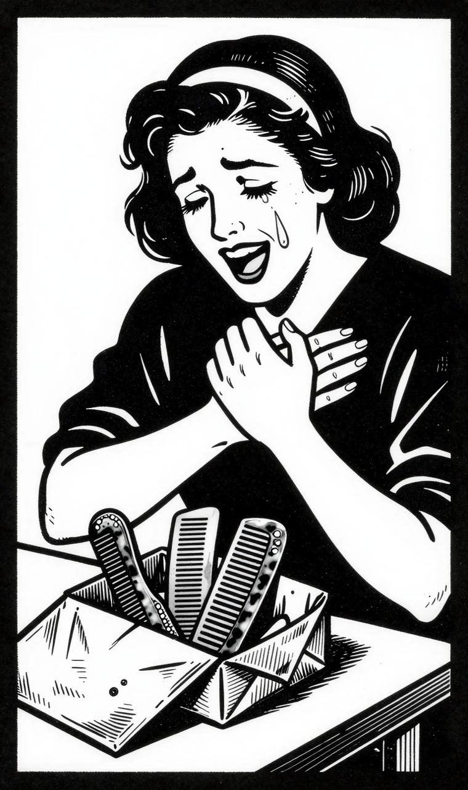

德拉将双手摊开，一条白金的表带闪着灵动的光，就如此刻德拉的心情一样欢快。她将礼物送到了吉姆面前，问道："吉姆，它漂亮吗？这可是我走了好久，几乎搜遍全城所有的店铺才找到的。快把你的金表拿出来，让我看看它们有多么的相配。"

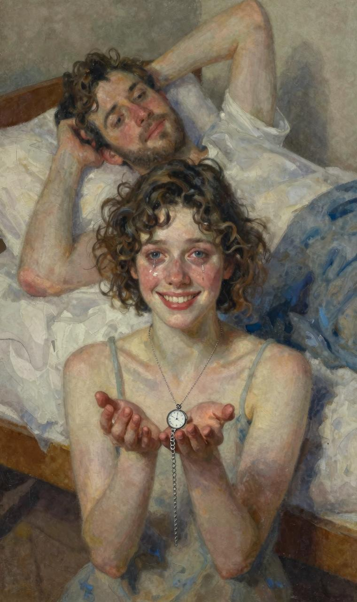

吉姆没有去拿他的金表，反而平躺在小床上，头枕着双手，嘴角挂满微笑。吉姆说：“亲爱的，让我们把我们各自的圣诞礼物都保存起来吧。现在它们还派不上用场。

因为我的金表已经被我卖掉，换了你的梳子了。现在，你去准备平安夜的牛排吧。"

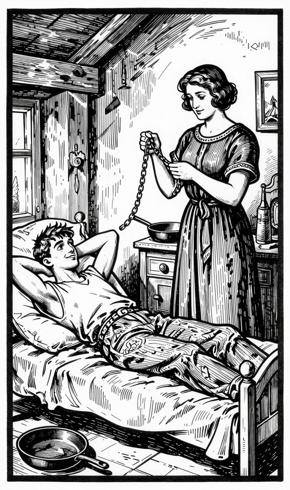

正如大家所知道的那样，当耶稣出生在马槽里的时候，有三位贤人给耶稣送来了礼物。也正是这三位圣贤发明了圣诞节互赠礼物的习俗。他们三位是聪明的，所以他们互赠的礼物都不一样，即使一样，也会有掉换的权利。然而上面故事里的主人公，傻傻地送给了对方自己最珍贵的东西。但是，我想对那些聪明的人说，其实这两个傻孩子是聪明的；在一切的赠与和接受礼物的人当中，他们才是最聪明的。无论在任何地方，他们都是最具智慧的。他们就是麦琪。