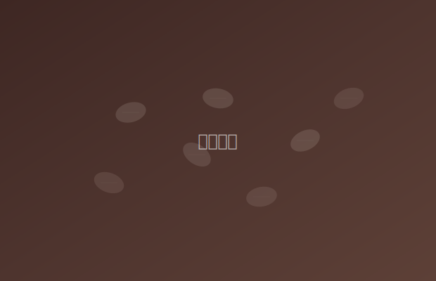

晨光穿过窗帘的缝隙，厨房里弥漫着咖啡豆被研磨时那种令人安心的焦香。这是一天中最安静的时刻——手机还没有开始震动，消息还没有涌入，世界还没有对你提出任何要求。

我把手冲壶的水烧到九十三度。不需要温度计，听水壶发出的声音就知道。水泡从底部升起，发出细密的「沙沙」声，像春雨落在树叶上。那就是恰到好处的温度。

## 仪式的意义

有人说，做手冲咖啡太麻烦了。胶囊机按一下就好，或者干脆去楼下便利店买一杯。他们说得对。从效率的角度看，手冲没有任何优势。

但效率不是一切。

这个二十分钟的仪式，是我给自己的一份礼物。在这二十分钟里，我只做这一件事。磨豆、烧水、闷蒸、注水。每一步都需要注意力，但不是紧张的注意力，而是一种放松的、带着享受的专注。

> 所谓仪式，不过是用行动告诉自己是值得被认真对待的。当你愿意为一杯水花二十分钟的时候，你也在对自己说：这一刻是重要的。

---

## 第一口

咖啡端到桌上。不用加糖，不用加奶。第一口总是微苦的，但紧接着，耶加雪菲特有的柑橘酸感会在舌根泛起，然后是蜂蜜般的甜，最后留下干净的花茶余韵。

我端着杯子走到窗边。楼下的小区花园里，有人在遛狗。远处传来早餐铺子的吆喝声。阳光已经完全升起来了，照在咖啡的液面上，泛着琥珀色的光。

新的一天开始了。有了这杯咖啡打底，好像什么都可以面对。
