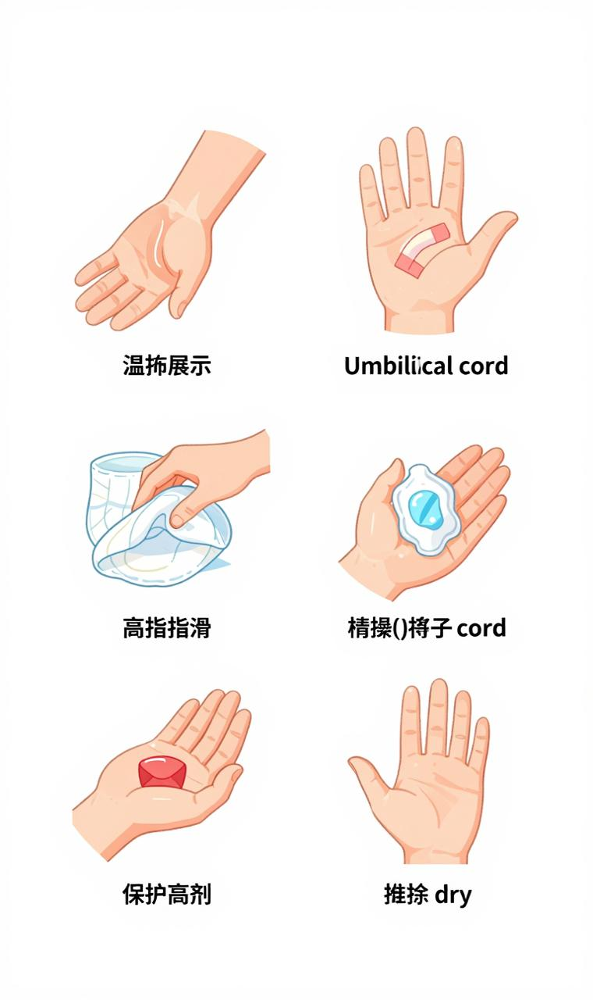
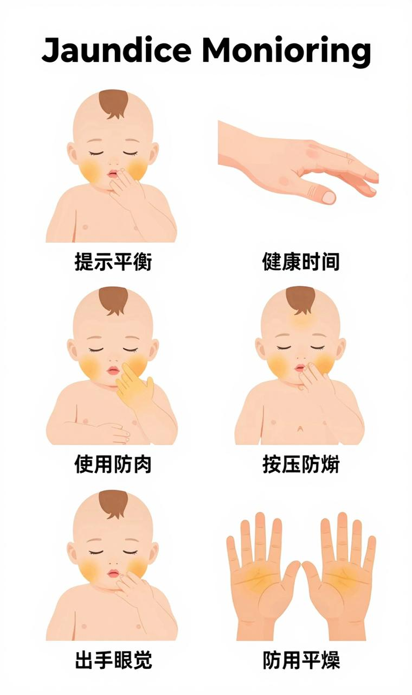

# 脐带与黄疸

## 一、脐带护理

脐带残端通常在出生后 7~14 天自然脱落。脱落前保持干燥清洁是唯一原则。

### 日常护理

- **保持干燥**：不要沾水，不要涂爽身粉/油/霜
- **暴露空气**：尿布前端折叠到脐带下方，避免覆盖
- **自然脱落**：不要拉扯，即使只剩一丝连接
- **观察**：每天观察有无红肿、渗液、异味

### 清洁方法

1. 洗净双手
2. 用 75% 酒精棉签从脐带根部向外螺旋擦拭
3. 再用干棉签擦干
4. 每日 1~2 次（洗澡后/换尿布时）

### 何时就医

- 脐周皮肤红肿
- 有脓性分泌物或恶臭
- 脐部大量出血（少量血丝正常）
- 脐带超过 4 周未脱落
- 脐部有粉红色肉芽组织突出（脐肉芽肿）

### 脐疝

- 肚脐鼓起的软包，哭闹/用力时更明显
- 因脐环肌肉未闭合，多数 1~2 岁自愈
- **不要贴硬币/压硬物**（无效且可能感染）
- 直径 > 2cm 或持续增大需儿童外科评估

---

## 二、新生儿黄疸

### 什么是黄疸

胆红素在皮肤沉积，表现为皮肤和巩膜黄染。约 60% 足月儿、80% 早产儿会出现。

### 类型

**生理性黄疸（正常）：**

- 出生后 2~3 天出现
- 4~5 天达高峰
- 7~14 天消退（早产儿可延至 4 周）
- 血清胆红素在安全范围内

**病理性黄疸（需医疗干预）：**

- 出现过早（出生 24h 内）
- 进展过快（24h 内胆红素上升 > 5mg/dL/日）
- 持续时间过长（足月儿 > 2 周，早产儿 > 4 周）
- 直接胆红素 > 2mg/dL

### 家庭监测

**按压法：**在充足自然光下，用手指按压宝宝额头 → 鼻尖 → 胸骨 → 腹部 → 大腿内侧 → 手掌/脚底。

黄疸延伸到哪里？越往下越严重。**如果手掌/脚底发黄，必须立即就医。**

### 加重黄疸的因素

- 摄入不足（喂养不够）
- 胎便排出延迟
- 母乳性黄疸（部分宝宝母乳中酶影响胆红素代谢）
- ABO/ Rh 血型不合溶血
- G6PD 缺乏（蚕豆病）

### 治疗方法

**光疗（蓝光）：**

- 最常用、最安全
- 宝宝戴护眼罩、穿护阴尿布
- 全裸 except 保护部位，最大化光照面积
- 持续 24~48 小时，可间断哺乳
- 副作用：大便变绿/稀、皮疹、发热（均轻微可逆）

**换血疗法：**

- 重度黄疸、光疗无效时
- 预防胆红素脑病（核黄疸）

### 母乳性黄疸

- 约 1/3 母乳宝宝出现
- 通常在生理性黄疸基础上持续 3~12 周
- 诊断方法：停母乳 48h，胆红素明显下降
- **处理：继续母乳喂养**，不需要停（除非胆红素极高需光疗）
- 不影响生长发育和疫苗注射

### 预防

- 尽早开奶、频繁喂养（促胎便排出）
- 避免 24h 内出院不监测
- 有溶血风险（母亲 O 型/Rh 阴性）的宝宝出生后即密切监测

### 胆红素脑病（核黄疸）警告

未经治疗的极重度黄疸，胆红素穿过血脑屏障：

- **早期**：嗜睡、吸吮弱、肌张力低
- **中期**：发热、尖声哭、角弓反张
- **晚期**：不可逆脑损伤、手足徐动症、听力损失、智力障碍

> **这是可预防的灾难。** 任何可疑重度黄疸，立即就医不要等。
