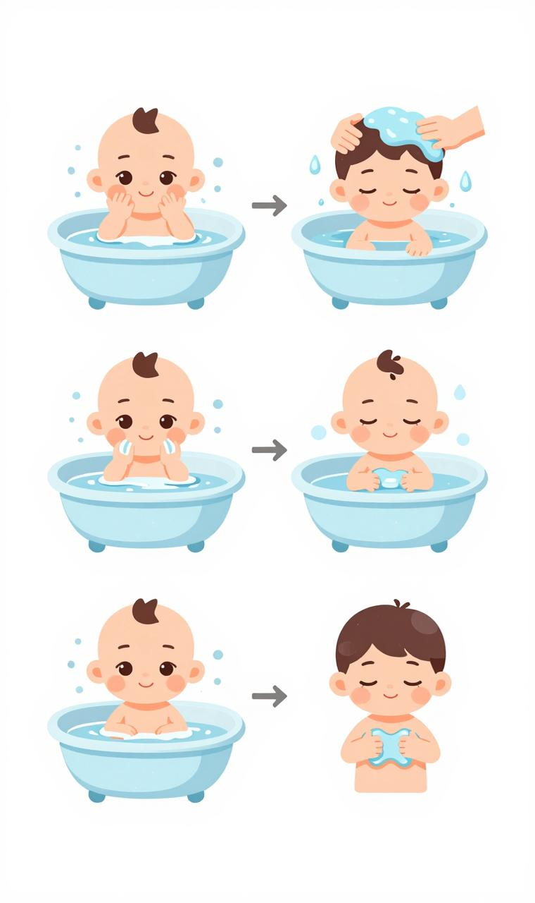
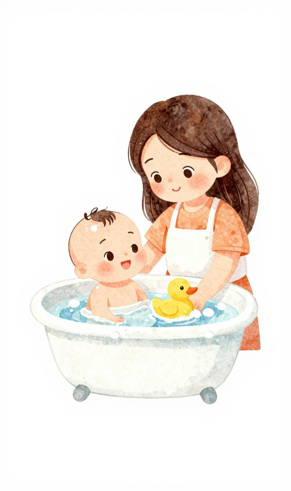
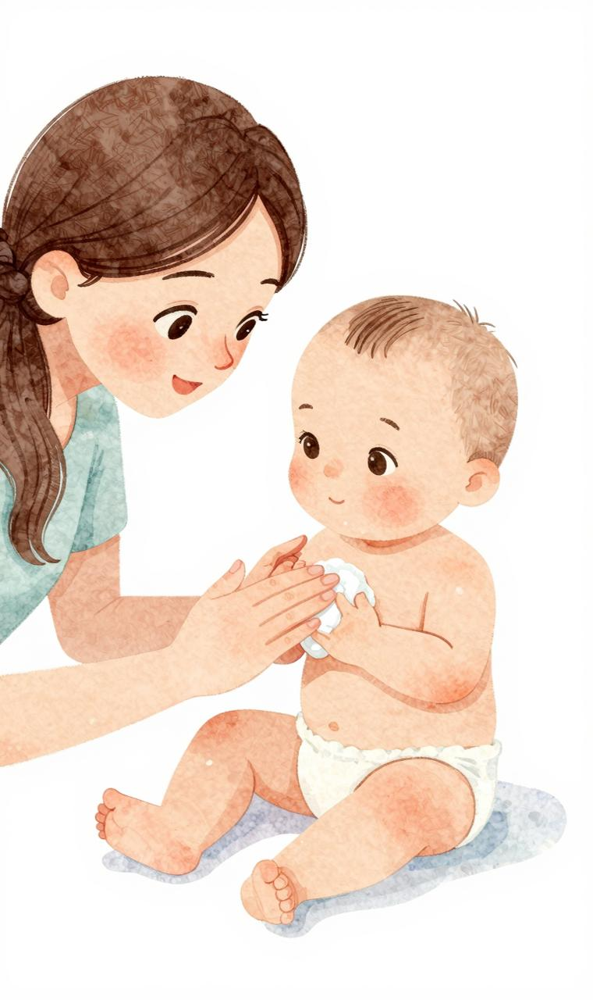

# 洗澡与皮肤护理

## 一、洗澡

### 频率

- 不需要每天洗，**每周 2~3 次足够**
- 脐带未脱落前只做擦浴（海绵擦浴），不盆浴
- 夏天出汗多可增加次数，但不建议过度清洁（破坏皮肤屏障）

### 最佳时间

- 两次喂奶之间（喂奶后至少 1 小时，防吐奶）
- 晚上睡前洗可帮助睡眠（纳入睡前仪式）

### 准备工作清单

- [ ] 室温调到 24~26°C
- [ ] 浴巾、衣服、尿布、护臀霜提前展开摆好
- [ ] 浴盆清洁，水温 37~38°C（手肘内侧测温温热）
- [ ] 婴儿沐浴露（无泪配方、弱酸性）
- [ ] 棉球（擦眼）、脐带护理用品

### 洗澡步骤

**第一步：洗脸**

- 脱去外衣，保留尿布，用大浴巾包裹
- 用温水浸湿的棉球从内眼角向外擦眼（一只眼一换棉球）
- 擦洗脸颊、额头、耳朵外耳廓（不深入耳道）
- 用温水擦洗嘴周

**第二步：洗头**

- 用手呈杯状托稳宝宝头颈（"橄榄球式"夹抱）
- 用温水弄湿头发，少量沐浴露在手心搓泡
- 用指腹轻轻按摩头皮（包括囟门，力度轻柔）
- 冲洗干净，用毛巾擦干

**第三步：洗身体**

- 一手穿过宝宝胸前握住对侧上臂（"安全握"），托稳头颈
- 另一手托住臀部，缓缓放入水中
- 先胸腹部 → 四肢 → 背部 → 臀部
- 皱褶处（脖子、腋下、大腿根、手指缝）重点清洗

**第四步：擦干穿衣**

- 从水中抱起，立刻用大浴巾包裹吸水（不要用力擦）
- 皱褶处重点擦干（防湿疹/糜烂）
- 3 分钟内涂保湿、穿好衣服（防受凉）

### 注意事项

- 全程不离开宝宝（一秒都不行）
- 水深 5~8cm 即可
- 洗澡全程不超过 10 分钟（防止受凉）
- 不用肥皂（碱性太强），用婴儿专用沐浴露
- 洗澡次数不宜过多（洗掉皮肤天然油脂）
- **水温绝不能靠手感判断**——用水温计

---

## 二、皮肤护理

### 保湿

- 每次洗澡后 3 分钟内涂婴儿润肤霜
- 干燥季节每天涂 2~3 次
- 选不含香精、酒精、色素的产品
- 凡士林是性价比最高的选择

### 尿布疹（红屁股）

详见"换尿布与臀部护理"章节。

### 湿疹

详见"异常情况处理"章节。核心：大量保湿。

### 间擦疹（脖子/腋下/大腿根糜烂）

- 皱褶处积汗/积奶引起红肿
- 处理：保持干燥，勤清洗擦干，可涂氧化锌护臀霜隔离
- 预防：穿衣不过厚，皱褶处勤擦干

### 新生儿中毒性红斑

- 出生后 1~2 天出现，黄色小脓疱周围红晕
- 良性自限，不需处理

### 新生儿痤疮

- 3~4 周出现，面颊/额头红丘疹
- 与母体激素有关，不需处理，数周消退
- 不要挤、不要涂成人祛痘产品

### 脂溢性皮炎（乳痂）

- 头皮黄色油腻鳞屑
- 用婴儿油/橄榄油软化 15 分钟后洗去
- 不要硬抠

### 粟粒疹

- 鼻尖/面颊白色小点，皮脂腺堵塞
- 数周内自行消退，不处理

---

## 三、囟门护理

### 前囟门

- 位于头顶前部，菱形软区域
- 出生约 2×2cm，通常 12~18 个月闭合
- **可以正常洗头、擦拭**（有一层硬膜保护）
- 轻轻触摸不会伤到大脑

### 观察意义

- **正常**：平坦柔软，随心跳轻微搏动
- **凸起**：颅内压增高（脑膜炎、脑积水）→ 急诊
- **凹陷**：脱水 → 补充液体

---

## 四、阳光与维生素 D

### 维生素 D 补充

- **出生后即开始**，每天 400 IU
- 纯母乳宝宝必须补（母乳中 VD 含量极低）
- 配方奶宝宝计算奶量中 VD 含量，不足部分补足
- 持续到 2 岁（饮食丰富后可调整）

### 日晒

- 不建议直晒太阳给新生儿"补钙"（皮肤太娇嫩）
- 6 个月以下不用防晒霜，以遮阳为主
- 树荫下散射光即可
- 每天 15~30 分钟户外散射光有助黄疸消退
