三个女人，一个叫里奇曼太太，是个寡妇；一个叫萨克利夫太太，是个美国人，离过两次婚；还一个叫希克森小姐，是个老姑娘。她们年纪差不多，都是四十岁左右，而且衣食无忧。

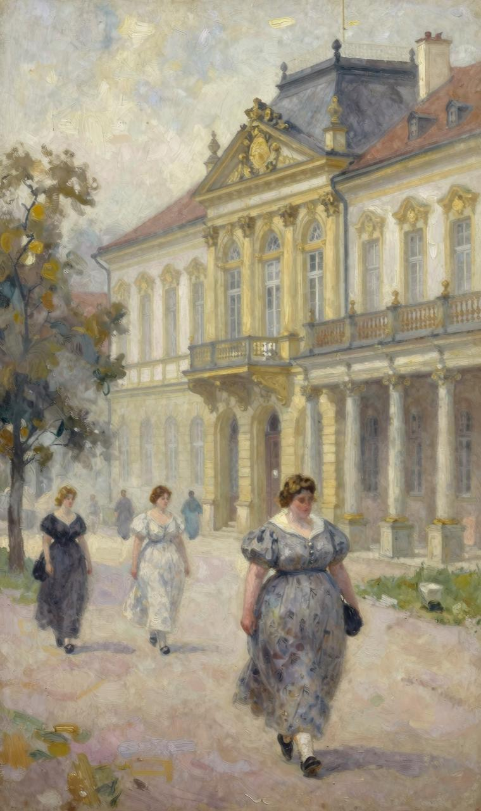

萨克利夫太太的名字非常奇特：Arrow[132]。年轻时，她身材苗条，这个名字倒是很适合她。虽然也经常被人拿来开玩笑，但都是在恭维她。另外，Arrow意味着直接、快速、坚定，她认为自己的性格就是这样，所以一直很喜欢这个名字。然而，随着身体越来越胖，四肢粗壮，臀部肥大，原本精致的五官完全走样，她便开始讨厌这个名字了。她发现，想找件穿起来好看的衣服变得越来越难。而且，人们不再拿她名字当面和她开玩笑了。当然，人们现在会怎么说她，她也心知肚明。尽管如此，她丝毫没人到中年不再像年轻人那样注重打扮的想法。为了使眼睛显得清澈神，她仍然选择穿蓝色系衣服；为了使头发显得柔软顺滑，她经常给头发做营养护理。

她之所以喜欢比阿特丽斯·里奇曼和弗朗西斯·希克森，至少以下三个原因：一是因为她们两个都比自己胖。和她们在一起，她看起来比较苗条。二是虽然她们两个年纪并不比她大多少，但都喜欢把她当作小姑娘来看待。三是她们俩善解人意，喜欢拿她的追求者来逗她开心。趣的是，尽管她们两位都对爱情不再抱幻想（希克森小姐一直对男女之事不感兴趣），却极力怂恿Arrow与男人调情。她们一致认定，总一天，Arrow还会牵手一个男人的。

“亲爱的，你可不能再长肉了。”里奇曼太太央求她道。

“看在上帝的分上，那个幸运的家伙必须会打桥牌。”希克森小姐也不甘落后。

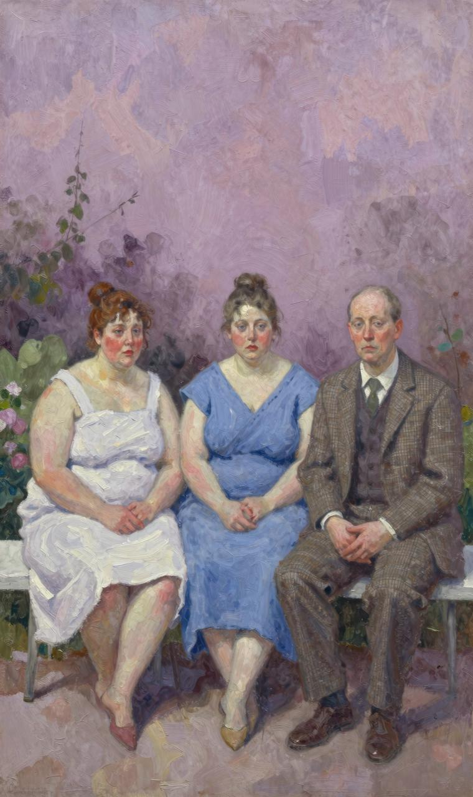

她们认为，Arrow的第三任丈夫应该是这个样子：五十岁左右，身材高大，言谈举止彬彬礼，最好是一位退伍海军上将，会打高尔夫球，而且是一个鳏夫[133]，不能拖儿带女。当然，最重要的是，收入一定要可观。Arrow没插言。其实这根本不是她想要的。是的，她的确再婚的打算。她想嫁给一位皮肤黝黑、身材修长、两眼炯炯

神的意大利人，还要一个响亮的头衔。当然，嫁给一个血统高贵的西班牙人也可以。至于年龄，绝对不能超过三十岁。她经常对着镜子端详自己，无论怎么看，都觉得那个"他"也应该是这个岁数。

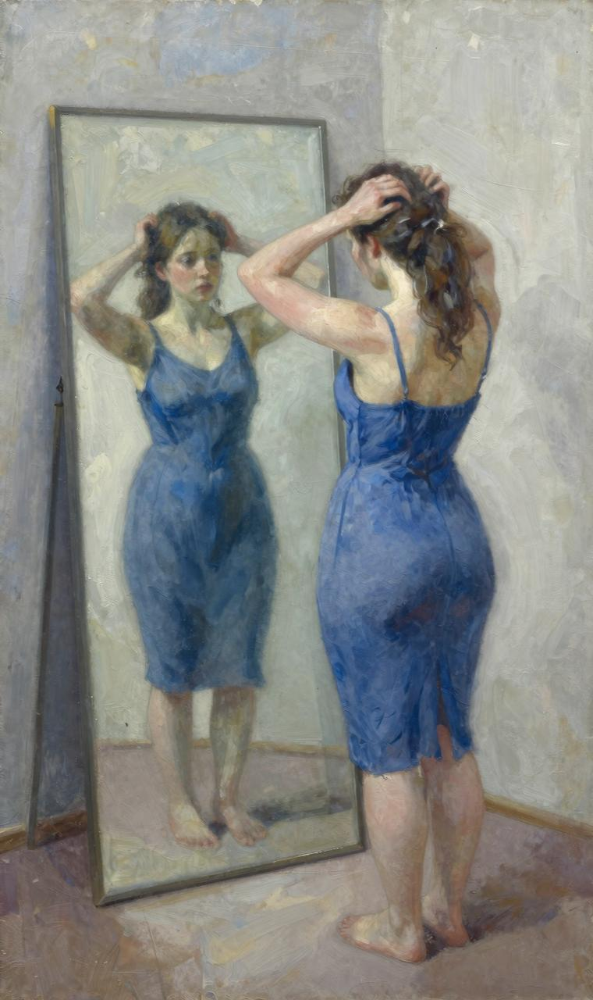

希克森小姐、里奇曼太太和萨克利夫太太三个人是好朋友。肥胖使她们走到了一起，桥牌使她们建立了友谊。她们第一次见面是在卡尔斯巴德[134]，入住的是同一家酒店，减肥主治大夫也是同一个。这个大夫对待她们的态度也完全一样：残忍冷酷。比阿特丽斯·里奇曼体形硕大，但长相一点儿也不逊色：一双美丽的大眼睛，脸颊涂着胭脂，嘴唇抹着口红。丈夫虽然死了，但给她留下了一大笔钱，所以她并没觉得自己很不幸。她是个吃货。面包、黄油、奶油、马铃薯以及牛油布丁，都喜欢。一年中十一个月，她都在尽情吃，剩下的一个月去卡尔斯巴德减肥。尽管每年都去，雷打不动，但她越来越胖。她非常难过，但大夫根本不同情她，反而说她完全是咎由自取。

“如果连喜欢的食物都不能吃，我活着还什么意思？”她争辩道。

大夫耸了耸肩，对她完全无语。

她跑去找希克森小姐抱怨说，这个大夫的医术根本不像她们所想象的那么高。倘若继续让他治疗，估计裙子是没法穿了。希克森小姐一听，令人感到莫名其妙地大笑了几声。她就是这种人。她嗓音低沉，肤色黯淡，面颊扁平，一双只豌豆粒大小的眼睛闪闪发光。她衣着打扮像个男人，走起路来无精打采，喜欢把双手插在口袋里。如果路上没行人，她就会立即拿出一根大雪茄点上。

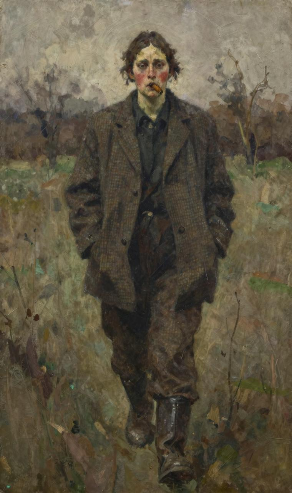

“穿裙子？俗！”她一脸的不屑，“你瞧我，这样穿多舒服！”

希克森小姐经常身穿粗花呢制服，脚蹬厚重皮靴，但从来不戴帽子。她力气很大，经常自我吹嘘说，若论高尔夫球打得远，别说女人，连很多男人都不是她的对手。

她平时寡言少语，骂起人来却口无遮拦，足以让泼妇感到汗颜。另外，她喜欢别人称呼她“弗兰克”。她们三个之所以相处融洽，与其精明圆滑是分不开的。她们三个朝夕相处：一起玩耍，一起洗浴，一起散步，一起在职业教练的指导下打网球，一起吃减肥

餐。除了磅秤显现的数字，世界上没任何事情能影响她们的心情。

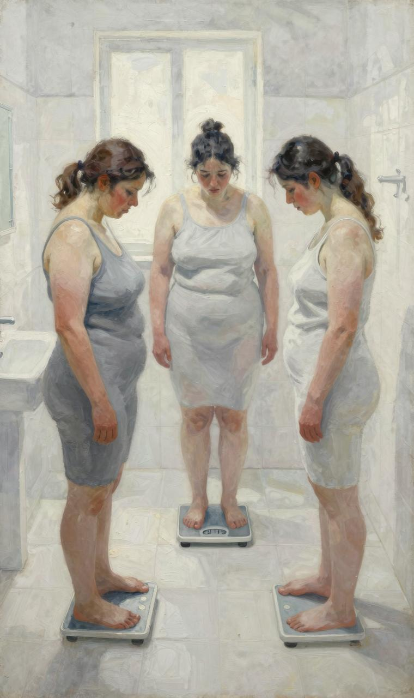

如果一天她们当中人体重没降低，三人立刻愁容满面。这时，不管是弗兰克粗俗的笑话，还是比阿特丽丝温和的言辞，还是Arrow柔媚的举止，都不能使她们高兴起来。遇到这种情况，她们一定会严惩“出问题”的那个人，责令她一整天都躺在床上。除了大夫配置的那碗蔬菜汤，任何食物都不能吃。这碗蔬菜汤就像洗过几遍卷心菜的温水，少油无盐，寡淡无味。

天底下再也找不出比这三个女人更要好的朋友了。要不是桥牌需要四个人才能打，她们绝对不会和第四个女人打交道。她们牌瘾很大，每天减肥治疗一结束，就会立马围坐在桥牌桌旁。Arrow打得最好。她牌风凌厉，从不放过对手所犯的任何一个错误。比阿特丽丝牌风沉稳，最能让同伴放心。弗兰克牌风洒脱，擅长理论分析。她们常常为了究竟是采用卡伯特森[135]叫牌法，还是采用西姆斯[136]叫牌法而争论不休。毫无疑问，她们每次出牌都一大堆理由，然而同样毫无疑问，她们每次出完牌，又一大堆不该这样出牌的理由。只要能够找到一个和她们牌技相当的人，即便那个大夫真的坏透了（比阿特丽丝语）；即便那该死的（弗兰克语）、讨厌的（Arrow语）磅秤显示，她们两天来连一个盎司的体重都没减掉；即便她们不得不天天喝那碗蔬菜汤，都可以忍受。

每次减肥结束，比阿特丽斯都能减掉二十磅。然而，她的体重很快就会反弹回去。弗兰克建议说，这个样子可不行。既然比阿特丽斯缺乏自制力，那就应该找一个意志坚定的人来做她们的厨师，负责她们的饮食。除此之外，她还建议，等离开卡尔斯巴德后，就去昂蒂布[137]租房子。在那里，她们可以游泳（人人皆知，游泳是瘦身效果最佳的运动之一），继续减肥。拥了自己的厨师，她们至少可以避开那些让人肥胖的食物。这样一来，她们一定还能够再减几磅。这个主意不错。比阿特丽斯显然知道健康饮食的益处。只要诱惑不在鼻子底下，她还是能够抵制的。而且，她喜欢赌博。对她来说，一周去赌场玩上两三回，日子过得才滋味。Arrow本来就很喜欢昂蒂布。而且，在卡尔斯巴德苦练了一个月，身材好了许多。那些在海滩散步的年轻的意大利人、狂热的西班牙人、殷勤的法国人以及身穿泳裤和便装、四肢修长的英国人都会任她挑。

计划很顺利，她们在昂蒂布过得很舒服。每周两天，她们的食物只煮鸡蛋和生西红

柿。每天早上称体重，她们都很开心。Arrow减到了十一英石[138]，感觉自己身体轻盈得像个小姑娘。比阿特丽斯和弗兰克使用了一种特殊站姿，体重不超过十三英石。体重秤显示的是千克，但她们刹那间就能把千克换算成英石和盎司。

体重问题总算是解决了，但打桥牌三缺一依然是个老大难问题：要么不会出牌，要么出牌缓慢，要么老是争辩，要么输不起，要么出老千。她们感到很纳闷：想找个称心的牌友怎么就这么难呢？正是出于这个原因，弗兰克建议邀请莉娜·菲茨来昂蒂布和她们一起住上几个星期。本故事就是在这样的背景下发生的。

一天清晨，她们三人身穿睡衣坐在阳台上，望着水天一色的大海，喝着不加奶和糖的绿茶，吃着胡德波特大夫推荐的脱脂脆饼干。他向她们郑重承诺，这种饼干不会让人发胖。弗兰克读完信，慢慢抬起头来。

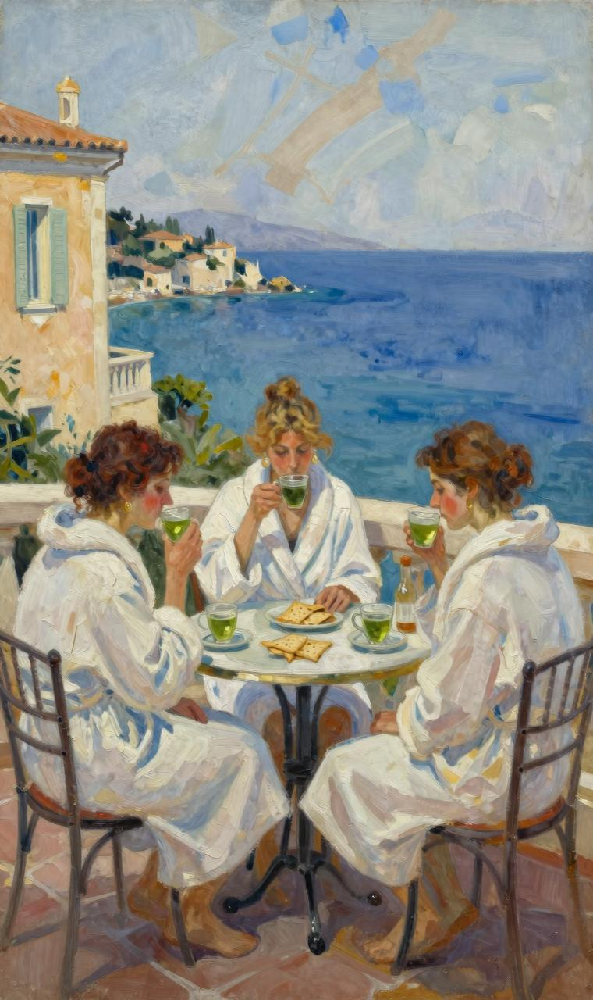

“莉娜·菲茨想去里维埃拉[139]散心。”她大笑了几声。

“莉娜·菲茨是谁？”Arrow第一个问道。

“她嫁给了我的一个表兄。几个月前，表兄突然因病去世，对她的打击很大。可不可以邀请她来我们这里住上半个月？”

“她会打桥牌吗？”比阿特丽斯问道。

“会。”弗兰克嗓音低沉，“而且水平很高。”

“多大年纪？”Arrow问道。

“和我同岁。”

“那就叫她来吧！”

事情就这么定了。弗兰克向来做事果断。吃完早餐，她立刻就出门给莉娜·菲茨发了封电报。三天后，莉娜·菲茨来到了昂蒂布。弗兰克去车站接她。她仍然沉浸在丈夫

过世的悲痛之中，但言谈举止非常得体。

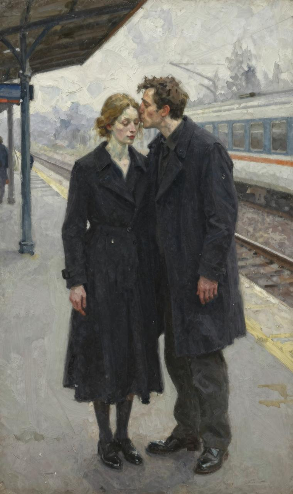

弗兰克已经两年没见过她了。她吻了吻莉娜的脸颊，上下仔细地打量着她。

“亲爱的，你瘦多了。”她对莉娜说道。

莉娜笑了笑。“最近一段时间，烦心事太多了。”

弗兰克叹了口气，但原因不详。到底是出于对莉娜的同情还是妒忌，就不得而知了。

弗兰克带莉娜回到住处。莉娜简单冲了个凉，便跟随弗兰克来到了伊甸洛克[140]。弗兰克把莉娜介绍给她的两位朋友。寒暄过后，她们四位要了一个名叫“猴屋”的单间。

“猴屋”四面都是玻璃。客人坐在里面就可以俯瞰大海。它的后面一个酒吧。酒吧里面坐满了客人——穿泳衣的，也穿睡衣的，还穿便服的。比阿特丽斯一听莉娜是个寡妇，或许是同病相怜的缘故，顿时心生好感。Arrow看她脸色苍白，相貌平平，而且年近五十，也喜欢上了她。这时，一个服务生走了过来。

“莉娜，你想喝点儿什么？”弗兰克问道。

“哦……跟你他们一样好了。一杯干马提尼或者白美人鸡尾酒。”

Arrow和比阿特丽斯迅速对视了一眼：喝鸡尾酒容易发胖。

“你一路舟车劳顿，肯定是累坏了。那就来杯干马提尼解解乏吧。”弗兰克非常友好。

她为莉娜点了干马提尼，给自己和两位好友要了柠檬橘子汁。

“天太热，不宜饮酒。”弗兰克解释说。

“哦，天气冷热对我没影响。”莉娜坚持道，“我就喜欢喝鸡尾酒。”

Arrow涂胭脂的那张脸略显苍白（每次下海游泳，她和比阿特丽斯一样，从来不会把脸弄湿），但她没吭声。四位女士天南海北聊了起来。一个平淡无奇的话题，她们也能聊得热火朝天。转眼间，午餐时间就到了。她们站起身来，一边聊，一边朝住处走去。

每张餐盘中都摆放着两小块脱脂脆饼干。莉娜笑了笑，把餐巾和饼干从自己面前的餐盘中拿出来，放在餐桌上。

“能给我来点儿面包吗？”她轻声问道。

这句话着实让三位胖女人吃了一惊。她们已经十年没吃过面包了。就连最贪吃的比阿特丽斯都不敢越雷池半步。最先反应过来的是弗兰克。

“当然可以，亲爱的。”她让管家拿些面包过来。

“还黄油。”

屋里寂静无声。那一刻，仿佛空气中满是尴尬。

“不知道家里没。”弗兰克回答说，“我帮你问问，也许还点儿。”

“我最喜欢吃的食物就是黄油面包。你呢？”莉娜问比阿特丽斯道。

比阿特丽斯苦笑了一下，没吭声。管家拿来一长条松脆的法国面包和一小块黄油。莉娜将面包一分为二，涂上黄油。

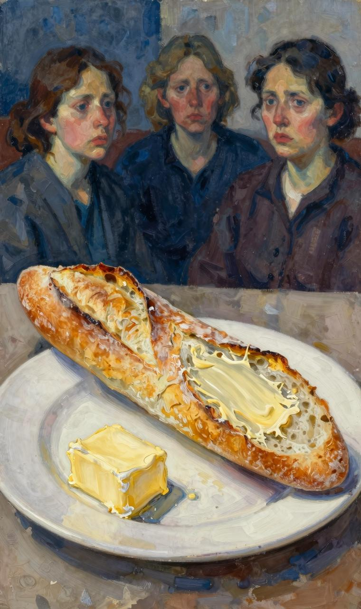

这时，管家端上来一盘烤鳎鱼[141]，淡然无味。

“我们吃饭很简单。”弗兰克解释说，“希望你别介意。”

“不会，绝对不会。实话说，我也喜欢吃清淡食品。”莉娜将黄油涂在鳎鱼上，“只要面包、黄油、土豆和奶油就行。”

三位胖女人对视了一眼。弗兰克的脸色阴沉下来。她看着自己餐盘里的烤鳎鱼，一点儿胃口也没。比阿特丽斯看在眼里，急在心里。

“这个鬼地方竟然连奶油都买不到，真让人郁闷！”她急忙开口安慰弗兰克道，“但是别忘了，这里是里维埃拉！凑合着过上几个星期，我们就走人了。”

“确实不适合长住！”莉娜随声附和道。

午餐菜肴还羊排和菠菜。羊排没一丝肥肉，以免比阿特丽斯得寸进尺。菠菜也只是放在清水里煮一煮。最后上的是甜点——炖梨肉。莉娜尝了一两口，就给了管家一个问询的眼色。管家心领神会，立马递给她一个糖罐，里面既砂糖也方糖。天哪，自从三位胖女人来到这里，就没吃过糖。莉娜往炖梨肉中加了好几勺砂糖，三位胖女人都假装没看见。等咖啡端上来，莉娜又在咖啡杯中加了三块方糖。

“你很喜欢吃甜食啊！”Arrow极力保持友善的口吻。

“砂糖比方糖甜。”弗兰克将一小勺砂糖放入自己的咖啡杯中。

“还是方糖甜。”莉娜答道。

比阿特丽斯两眼盯着方糖，垂涎欲滴。

“比阿特丽斯！”弗兰克冲她大叫了一声。

比阿特丽斯只好把口水咽下，将一小勺砂糖放入自己咖啡杯中。

四位女士终于围坐在桥牌桌旁，弗兰克这才松了口气。她很清楚，莉娜这个样子，比阿特丽斯和Arrow是不会喜欢她的。她非常希望莉娜能够和她们俩搞好关系，希望莉娜能够过得愉快。第一轮，Arrow和莉娜搭档。

“范德比尔特[142]还是卡伯特森？”Arrow问莉娜道。

“都可以。”莉娜回答得很轻松，“由你决定。”

“那就卡伯特森。”Arrow没客气。

简直太狂妄了！今天一定要好好教训她！打起桥牌来，弗兰克绝对是六亲不认。

和她的两位好朋友一样，她也打算给莉娜上一课。三位胖女人个个摩拳擦掌。但是，莉娜的“桥牌天赋”却不答应。她天生就是一块玩桥牌的好料儿，而且经验丰富。她凭感觉出牌，大胆果断，信心满满。三位胖女人虽然牌艺精湛，但和莉娜玩，丝毫不占上风。

俗话说：英雄相惜，再加上三位胖女人善良、大度，玩着玩着心中的怒气渐渐消散了。

啊，太爽了！这样玩桥牌才过瘾！看到Arrow和比阿特丽斯对莉娜产生了好感，弗兰克长长地松了一口气。看来她邀请莉娜来，是非常正确的。

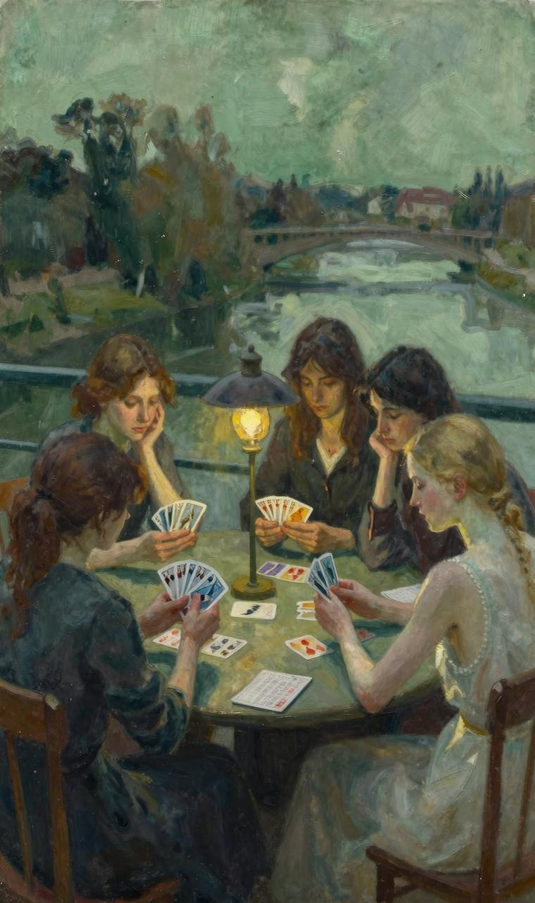

接连玩了两个小时她们才散场。然后，弗兰克和比阿特丽斯去打高尔夫，Arrow刚刚认识了一位年轻帅气的王子——洛卡马尔。她说要和他出去散步。莉娜说，她也累了，想小憩一下。

快到晚餐时，大家又聚在了一起。

“亲爱的莉娜，你不会感到无聊吧。”弗兰克觉得点儿难为情，“很抱歉，把你一个人丢在家里。”

“噢，没关系。我睡了一觉，然后去了趟若昂[143]，喝了杯鸡尾酒。告诉你，我一个重大发现，你听了一定很感兴趣：家小茶馆，卖的奶油浓稠鲜美。我让他们每天送半品脱给我们。这也算是我对大家的一点儿心意。”

莉娜两眼放光，等待着她们欢呼雀跃。

“你太客气了。”弗兰克给她的两位好朋友使了个眼色，回答道，“不好意思，忘了告诉你了，我们不吃奶油。这个季节吃奶油会让人烦躁不安的。”

“那好，我自己吃。”莉娜丝毫没生气的迹象。

“难道你不怕身体发胖吗？”Arrow语气冷冷地问了一句。

“医生要我加强营养。”

“医生要你吃面包、黄油、土豆和奶油？”

“你他们不是也在吃这些东西吗？”

“这样下去，你会胖得走不动的。”比阿特丽斯嘲笑她道。

莉娜哈哈大笑起来。

“不会！绝对不会！我吃什么都不胖。想吃什么就吃什么。对我来说，这些食物已经再清淡不过了。”

三位胖女人一听这话，都陷入了沉默，直到管家进来。

“女士他们，晚饭准备好了。”[144]管家说道。

那天晚上，等莉娜睡下后，三位胖女人躲在弗兰克的房间里一直聊到深夜。刚才还你打我闹，兴致勃勃，但此时此刻却都像完全变了一个人：比阿特丽斯脸色阴沉，Arrow话中带刺，弗兰克也没了往日的男子气概。

“让我眼睁睁看她享用那些我特别喜欢的食物，太痛苦了！”比阿特丽斯第一个开口道。

“我也很痛苦。”弗兰克接话道。

“都怨你，就不应该邀请她来！”Arrow抱怨道。

“我怎么知道她是这样一个人？”弗兰克感到非常无辜，哭了起来。

“如果她真的爱她丈夫，绝对不可能胃口这么好。”比阿特丽斯说道，“她丈夫刚刚入土才两个月。我的意思是说，她应该伤心得什么也吃不下才对。”

“她是客人。”Arrow看了看弗兰克，接话道，“再说了，是医生让她多吃的。”

“那她应该去疗养院。”比阿特丽斯坚持道，“弗兰克，如果她再这样下去，我实在是忍不住了。”

“既然我能忍，你也能行。”

“她是你的表嫂，好吗？不是我们的，”Arrow反对道，“我不能眼睁睁看着那个女人大吃大喝的。绝对不能！”

“我觉得，不能把全部心思都放在吃上，这样未免太粗俗了。”弗兰克声音比以往更加低沉了，“我们最好把心思用在提高修养方面。”

“你的意思是我粗俗，弗兰克？”Arrow两只眼睛似乎要喷出火来。

“她当然不是这个意思。”比阿特丽斯急忙打圆场道。

“等我们都睡着了，自己偷偷跑到厨房猛吃一顿。”Arrow不依不饶。

弗兰克一听这话，顿时站了起来。

“Arrow，你怎能这样说话？我自己做不到的事，从来不会要求别人去做。你认识我这么多年，居然这么不了解我？”

“那你的体重怎么从来没下降过？”

弗兰克泪水夺眶而出。

“你越说越不像话了！我的体重已经下降好多了！”

她哭得像个孩子，魁梧的身体不停颤动，泪水滴落在肥硕的前胸上。

“亲爱的，我不是那个意思。”Arrow一把抱住弗兰克，也哭了起来，睫毛膏顺着脸颊流了下来。

“我一点儿都没瘦吗？”弗兰克哽咽道，“我已经尽了最大努力了。”

“瘦了，亲爱的，你瘦了很多。”Arrow满脸是泪，“这谁都看得出来。”

比阿特丽斯尽管天生理性，向来不轻易动感情，此时此刻也低声抽泣起来。任何铁石心肠的人，看到弗兰克这样勇猛的女人竟然哭成了泪人，也会心疼的。过了一会儿，她们擦干眼泪，喝了点儿兑水白兰地（据医生说，吃这些食物不会发胖），感觉好多了。她们一致决定允许莉娜遵循医嘱吃些富营养的食物，并发誓绝对不会因此而改变自己减肥的决心。莉娜是一流桥牌选手，而且只待两周。尽量让她过得开心一些。各自回房间休息之前，她们相互亲吻，心情异常舒畅。什么都不能影响她们的友谊。这份友谊美好、真挚，使她们三人生活快乐，非常值得呵护、值得珍惜。

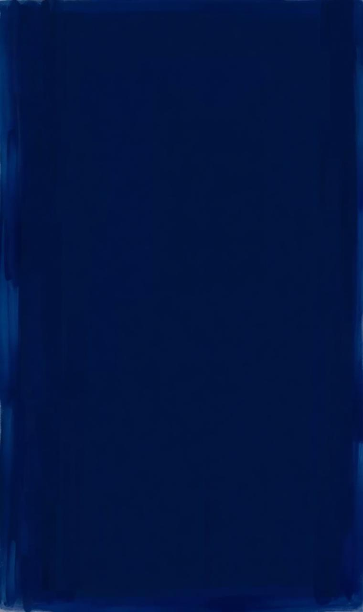

人性非常脆弱，很难经得起考验，尤其是长期的。莉娜吃奶酪黄油通心粉，他们吃烤鱼片；莉娜吃鹅肝酱，他们吃没一滴油的烤羊排和水煮菠菜；莉娜吃奶油豌豆和各种美味马铃薯，他们吃白水煮鸡蛋和生西红柿。而且，厨师手艺很好，好不容易逮到这个机会，自然全力以赴为莉娜做菜，一道比一道美味可口，一道比一道别出心裁。

“唉，可怜的吉姆！”莉娜看着面前丰盛的菜肴，长长地叹了一口气。她想起了自己的丈夫。他也非常喜欢法国菜。尽管厨师能够制作六种鸡尾酒，而且莉娜也告诉她们说，医生建议她午饭喝勃艮第[145]葡萄酒，晚餐喝香槟，三个胖女人丝毫不为所动。尽管她们天天嬉笑打闹，看上去幸福快乐（女人天生善于伪装），但比阿特丽斯精神变得萎靡不振，Arrow蓝眼睛变得不再温柔，弗兰克低沉的嗓音变得沙哑刺耳。这些变化在她们玩桥牌时更是暴露无遗。从前，她们都是一边出牌一边讨论，气氛非常友好。但现在呢？讨论变成争论，最后变成争吵，几乎局局都以愤怒的沉默收场。一次，弗兰克指责Arrow故意乱出

牌，Arrow气得扔下牌摔门而出。比阿特丽斯性格软弱，被气哭了两三次。三位胖女人脾气越来越差，莉娜成了和事佬。

“玩牌是为了娱乐，不是为了吵架。”她劝说道，“毕竟是个游戏，何必当真呢！”

这理三位胖女人肯定懂。如果三位胖女人也能像她顿顿吃得好，再喝半瓶香槟，肯定脾气不会变成这样。莉娜不仅吃得好，喝得好，而且牌运很好。局局都是她赢。每局结束，分数都记在一个小本子上。莉娜的得分天天都在增加。这个世界还公平可言吗？虽然她们心里憎恨莉娜，但每当因为玩牌和好朋友关系闹僵，都跑去找她倾诉。

Arrow说，她之所以心情不好，就是因为天天和这两个老女人在一起。剩下的时间，她真想拿着剩余的房租，跑去威尼斯玩上几天。弗兰克告诉莉娜，Arrow非常轻浮，比阿特丽斯则愚蠢透顶。

“只智者才能和我谈得来。”她嗓音非常低沉，“像我这样聪明绝顶的人一般都会找智商高的人为伴。”

比阿特丽斯再也不想和女人打交道了。

“我讨厌女人。”她说道，“她们个个蛇蝎心肠，根本靠不住。”

等到莉娜快要离开昂蒂布时，三个胖女人的关系已经僵到互相不搭理的地步了。

当然，在莉娜面前，她们不得不做做样子。

莉娜要去意大利里维埃拉见几个朋友。弗兰克把她送到火车站。火车还是她来昂蒂布时乘坐的那一班，只不过钱包里装满了三个胖女人玩桥牌输给她的钱。

“我不知道该如何感谢你。”莉娜上车时这样说道，“这次昂蒂布之行，我很快乐！”

最让弗兰克·希克森引以为豪的是她是一位女绅士，换言之，她不仅是一位淑女，而且还是一位绅士。她的回答大方得体，堪称完美。

“你能来，我们很高兴，莉娜。”她说道，“我们相处得很愉快！”

火车驶出站台后，弗兰克长长叹了一口气。叹息声很大，她脚下的站台都摇晃起来。她耸了耸自己宽大的肩膀，大步往回走。“她总算走了！”她边走边说，“她总算走了！”

回到住处，弗兰克立即换上泳衣，穿上拖鞋，披上男士睡袍（这是必须的），直奔伊甸洛克。午餐前还时间游泳。路过“猴屋”时，她四处看了看，跟熟人一一打招呼。她感觉神清气爽。突然，她一下子愣住了，简直不敢相信自己的眼睛：比阿特丽斯一个人坐在一张餐桌旁边，身上穿着前几天在莫里诺克斯[146]购买的睡袍，脖子上挂着珍珠项链。弗兰克还注意到，比阿特丽斯刚刚做了头发，脸颊、眼睛和嘴唇都化了妆。

是的，比阿特丽斯很胖，但非常迷人。这谁也不能否认。她在干吗？弗兰克朝比阿特丽斯走去。从她走路的姿势看，活像一个尼安德特人[147]；从她身上穿的黑色泳衣看，更像一只日本人在托雷斯海峡[148]捕捉到的海豚，俗称“海中母牛”。

“比阿特丽斯，你一个人坐在这里干什么？”弗兰克冲她大叫道，但嗓音依旧低沉。

这声音犹如远处传来的“隆隆”雷声。比阿特丽斯瞅了她一眼，眼神冷漠。

“吃饭。”她回答道。

“废话，我眼睛不瞎！”

比阿特丽斯面前摆放着一盘羊角面包，一碟黄油，一罐草莓酱，一壶咖啡，还一罐奶油。她在热热的面包上涂上厚厚的一层黄油，再涂上一层草莓酱，最后倒上很多奶油。

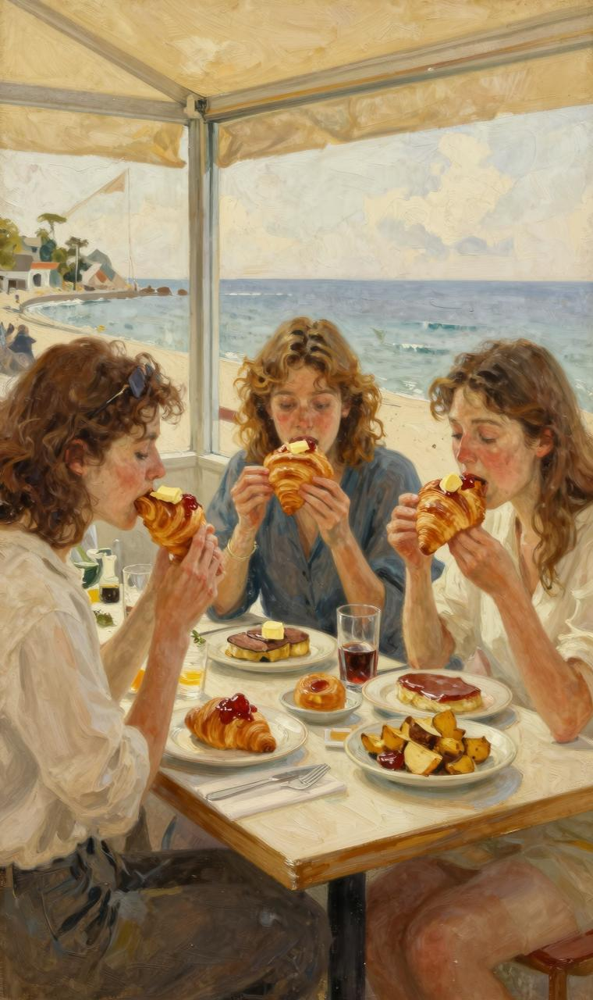

“你想死啊！”弗兰克吃了一惊。

“我愿意！”比阿特丽斯咕哝道。她嘴巴里已经塞满了食物。

“你吃完这一顿，一定会长好几磅。”

“不用你管！”比阿特丽斯大笑道，“天哪，羊角面包太好吃了！”

“没想到你意志这么不坚定。比阿特丽斯，我对你很失望！”

“都怪你！你早就应该把那个可恶的女人打发走了！整整两个星期，天天眼睁睁看着莉娜像头猪一样吃这吃那，不仅我受不了，任何血肉之躯都无法忍受！今天，哪怕长十磅，我也要好好吃一顿！”

弗兰克热泪盈眶。她突然觉得自己像个女人，非常脆弱，非常希望个强壮的男人把她抱在怀里，一边爱抚她的身体，一边呼唤她的乳名。弗兰克没说话。她走到比阿特丽斯身边，一屁股坐在椅子上。这时，服务生走了过来。弗兰克用手指了指桌子上的咖啡和面包。

“给我也来一份。”她叹了一口气，气无力。

看到弗兰克伸手要拿自己的面包，比阿特丽斯急忙把盘子拿走。

“不能动，这是我的！”她语气很坚决，“等着吃你自己的那份吧！”

弗兰克低声骂了她一句。不一会儿，服务生就把羊角面包、黄油和咖啡端来了。

“奶油呢，你个蠢货？”弗兰克像头陷入困境的母狮子，大声吼叫道。

弗兰克吃了起来，真可谓狼吞虎咽。“猴屋”里的人渐渐多了起来，基本都是晒完日光浴、洗完海水澡，来这里喝杯鸡尾酒的。没过多久，Arrow与洛卡马尔王子一起走了过来。她身上披着一条漂亮的丝绸披肩。为了尽可能让自己看起来更苗条一些，她用一只手紧紧拉着披肩一角；为了不让王子看到她的双下巴，她高高地扬着脑袋。她笑得很开心，感觉自己就是一个妙龄少女。王子刚才对她说了（用意大利语），她的蓝眼睛非常美。和她的蓝眼睛相比，蔚蓝色的地中海就是豌豆汤。王子要去洗手间梳理一下乌黑油亮的头发。他们约定五分钟后一起去喝一杯。

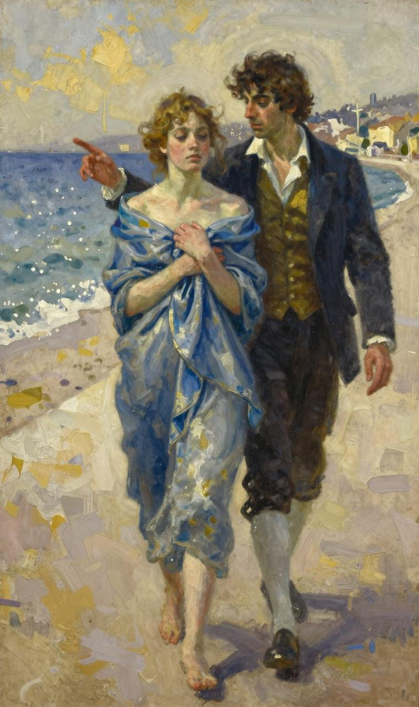

Arrow也朝洗手间走去。她想在

脸颊上添些胭脂、在嘴唇上抹些口红。这时，她看到了弗兰克和比阿特丽斯，立即停下了脚步。她简直不敢相信自己的眼睛。

“我的上帝！”她大声叫骂道，“你们这两个畜牲！你们这两头死肥猪！”

Arrow快步跑了过去，拉过一把椅子坐下，大声喊叫道：“服务生！”

此时此刻，她已把王子抛到了九霄云外。眨眼工夫，服务生就过来了。

“这两位女士正在吃的东西，也给我来一份。”她命令道。

弗兰克把大脑袋从盘子上抬起来。

“给我拿些鹅肝酱来。”她吼叫道。

“弗兰克！”比阿特丽斯白了她一眼。

“闭嘴！”

“好吧。给我也来一点儿。”

咖啡、热腾腾的羊角面包、奶油以及鹅肝酱很快就端了上来。她们把奶油抹在鹅肝酱上往嘴里送，草莓酱大勺大勺地往下吞，面包嚼得“嘎吱嘎吱”直响。此时此刻，对于Arrow来说，爱情算什么呢？让王子自个儿待在罗马的宫殿和亚平宁山脉中的城堡里吧。眼下最重要的事情是吃。三个胖女人不再说话。她们吃得津津味，她们吃得高高兴兴。

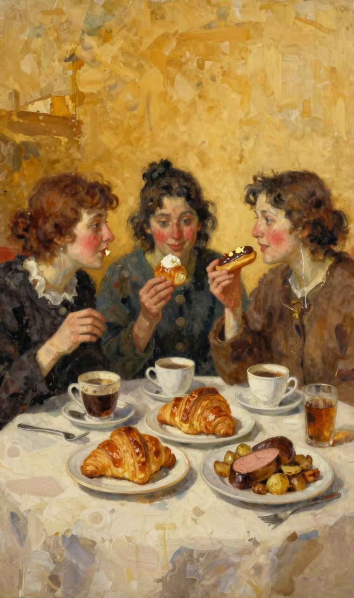

“我已经二十五年没吃过土豆了。”弗兰克若所思，喃喃自语道。

“服务生，”比阿特丽斯高声叫道，“再来三份烤土豆！”

“好的，夫人。”

烤土豆端上来了。即便把所的阿拉伯香料都拿来，也没这烤土豆香！三个胖女人干脆用手抓着吃了起来。

“给我来杯干马提尼！”Arrow说道。

“饭才吃一半，不能喝干马提尼，Arrow。”弗兰克提醒她道。

“我就要喝！”

“好吧。那就来两杯吧！”弗兰克妥协道。

“我也来一杯！”比阿特丽斯急忙说道。

干马提尼端上来了，三个胖女人一饮而尽。她们彼此看了看，长长地叹了口气。

过去两个星期的误会消除了，过去的友情重新涌上心头。这份友情使她们感到生活充实、快乐，然而，她们竟然不知道珍惜。在刚刚过去的两周里，她们恶语相向，甚至打算断绝来往。

烤土豆也吃完了。

“不知道他们这里没巧克力泡芙。”比阿特丽斯说道。

“肯定。”

一问服务生果然。弗兰克用手抓起一个，整个塞进她的大嘴，立马吞了下去。

她又抓了一个。在入口之前，她看了看两个好朋友，说道：

“不知道你他们怎么想，但事实就是事实，莉娜桥牌真的打得很糟糕！”

“糟糕极了！”Arrow随声附和道。

比阿特丽斯还想吃蛋白酥皮饼。

（马晓婷　薄振杰　译）
