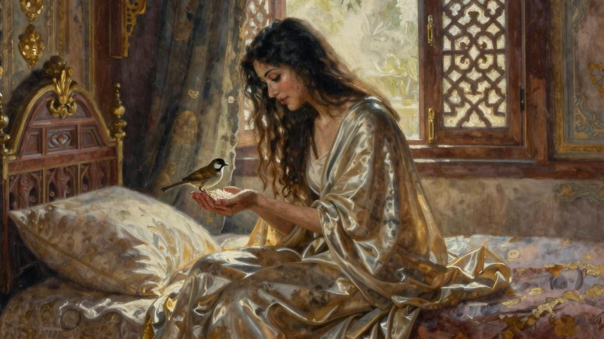
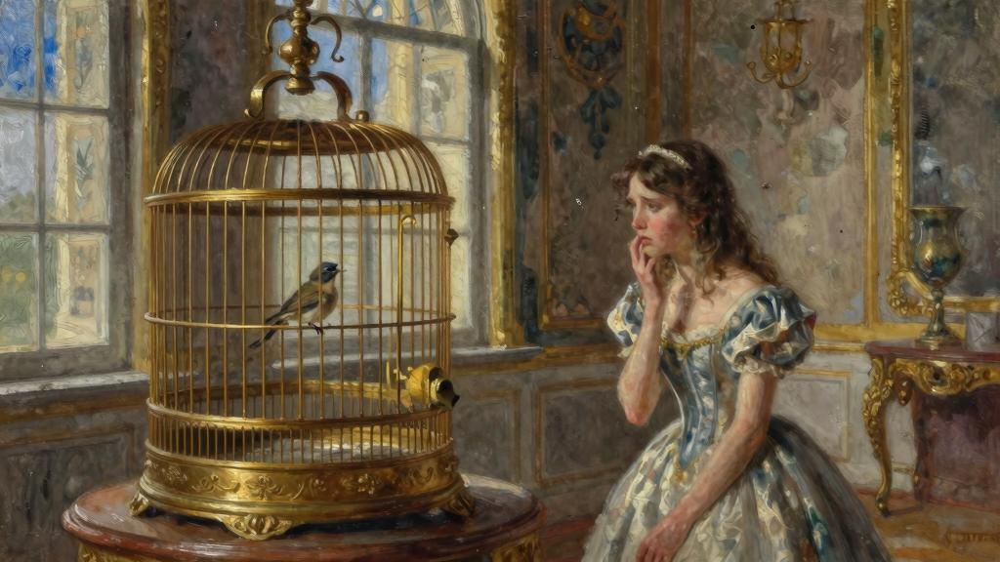
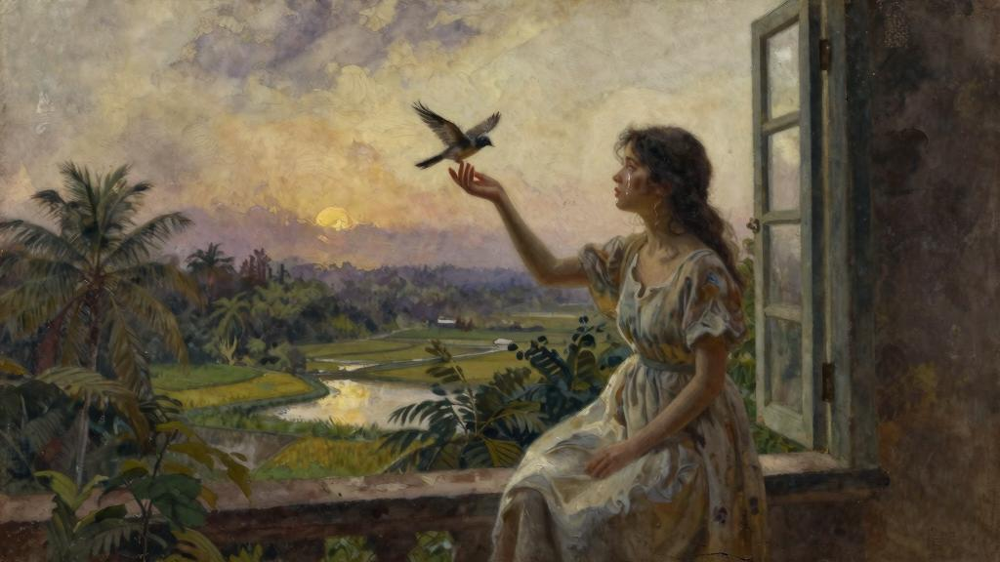

高兴得直拍手，于是，小鸟便跳上了她的床头，用婉转的歌喉唱来，直到把她哄睡着了。

第二天，她一觉醒来时，小鸟依然守候在她的床前，她刚睁开眼睛，小鸟就朝她道了声“早晨好”。侍女他们把她的早饭端进屋来，小鸟吃了她托在手掌上的米饭，在她的茶碟里洗了个澡，接着又把茶碟里的水也喝了。侍女他们说，她们认为，喝洗澡水是非常不雅的行为，九月公主却说，那是艺术家特有的气质风范。小鸟吃完早饭后，又开始歌唱来，唱得那么优美动听，侍女他们都感到十分惊奇，因为她们从来没有听到过如此美妙的歌喉，九月公主感到非常自豪、喜不自胜。

"瞧，我想把你介绍给我的八个姐姐看一看。"九月公主说。

她伸出右手的食指，权当鸟儿的临时栖枝，小鸟见状，立即展翅飞扑下来，停落在她的食指上。随后，她率领着她那几个侍女，穿过逶迤的王宫，挨个儿呼唤公主姐姐他们出来，她首先请的是“元月公主”，因为她很讲究礼数，然后再一路请下来，直到“八月公主”。小鸟每觐见一位公主，都会唱一首不同的歌。那些鹦鹉却只会说“上帝保佑吾王”和“漂亮的波莉”这两句话。最后，她把小鸟带给国王和王后看了。他们都感到很惊讶，十分喜欢。

“我就知道，我没给你吃晚饭就打发你上床睡觉一点儿也没错。”王后说道。

“这只鸟儿唱得比鹦鹉好听多了。”国王说道。

“我早该想到，人们老是说这句‘上帝保佑吾王’，你肯定早就听厌了，”王后说道，“我就想不通，女儿他们为什么都想教她们的鹦鹉说这句话呢。”

“这份感情还是值得大加称赞的，”国王说道，“因此，这句话无论听多少遍，我都不会厌烦。可是，我倒真有些听不惯那几只鹦鹉老是说‘漂亮的波莉’。”

“那些鹦鹉能够用七种不同的语言说这句话呢。”公主他们异口同声地说。

“我想，那几只鹦鹉大概没错，”国王说道，“可是，这一点难免会让我想我那些幕僚的嘴脸。明明是同一件事，他们偏要用七种不同的方式来说，而且还说得天花乱坠，根本没有任何意义嘛。”

那些公主，我前面已有交代，由于本来就性格乖戾、满腹怨恨，一听这话，都感到很不是滋味儿，那几只鹦鹉似乎也是一副垂头丧气的样子。但是，九月公主却自顾穿行在王宫大大小小的屋子里，一边奔跑，一边像只云雀一样欢快地唱着歌，那只小鸟也始终围绕在她身边飞来飞去，像只夜莺似的歌唱着。它确实就是一只夜莺。

日子像这样又保持了几天，后来，那八位公主凑在一碰了个头。她们来到九月公主的住处，围成一圈坐下来，把她围在当中。她们个个都盘腿坐着，脚藏在裙裾下，这是暹罗国的公主他们最合乎礼仪的坐姿。

“我可怜的九月啊，”她们七嘴八舌地说道，“听说你那只美丽的鹦鹉死了，我们都很难过。我们都有宠物鸟儿，而你却没有，你肯定很不乐意。所以，我们就把自己的零花钱集中来了，我们正打算给你买一只非常可爱、绿喙黄羽的鹦鹉呢。”

“得了吧，我可不想麻烦你他们，”九月说，（她这种态度并不是很有礼貌，不过，暹罗国的公主他们彼此间有时候也有点儿不讲情面。）“我有宠物鸟儿，它会唱最美妙动听的歌给我听，我不知道我要一只绿喙黄羽的鹦鹉到底有什么用。”

元月公主轻蔑地擤了擤鼻子，紧跟着，二月也擤了擤鼻子，随后，三月也擤了擤鼻子；事实上，那几个公主个个都在擤鼻子，只不过是严格按照她们地位的高低依次进

行的。等她们都擤了鼻子之后，九月朝她们问道：

“你他们为什么老是擤鼻子？难道你他们个个都得了头痛脑热的重伤风吗？”

“唉，亲爱的妹妹啊，”她们说，“你那只鸟儿说来也真够荒唐的，那小家伙老是飞进飞出，想什么时候来就什么时候来。”她们横眉竖眼地朝四处张望着，傲慢地翘着脑袋，翘得连额头都完全看不见了。

“你他们就不怕弄得满脸皱纹啊。”九月说。

“你不会介意吧，我们想打听一下，你那只鸟儿现在到底躲在什么地方呢？”公主他们异口同声地问道。

“它走了，拜见它的岳父去了。”九月公主说。

“那你凭什么认为，它还会再飞回来呢？”那几个公主问道。

“它向来言而有信，肯定会回来的。”九月说。

“唉，亲爱的妹妹啊，”八位公主齐声说道，“你要是肯听从我们的劝告，保你不会再碰到类似于这样的风险。如果它回来了，你听着，如果它真的回来了，算你运气好，你就赶紧捉住它，把它关进笼子里，千万别再放它出来。只有这样做，你才能万无一失地把它留在你身边。”

“可是，我喜欢让它在我的房间里自由自在地飞。”九月公主说。

“安全第一啊。”她那几个姐姐都很不吉利地说。

她们站身来，个个都摇着头走出了房间，丢下九月心神不宁地独自守在那儿。

她仿佛觉得，那只小鸟已经离开她很长一段时间了，她想象不出它究竟在干什么。它也许碰到麻烦事了。万一遇到老鹰怎么办，万一落入了人们布下的罗网怎么办，你压根儿就不知道它会陷入什么样的困境。此外，它说不定已经把她给忘了，或者喜欢上别的什

么人了；那可就糟糕啦；啊，她多么希望它能安然无恙地回到这儿来啊，那只金色的鸟笼正虚位以待地等候在那儿呢，因为侍女他们安葬了那只死去的鹦鹉之后，又把鸟笼放在老地方了。

突然间，九月听见了一声鸟儿的啁啾，那声音分明就在她耳后，她扭头一看，发现那只小鸟正栖息在她的肩头上。他来得这么悄无声息，飞落得这么轻柔徐缓，她一点儿也没听见它的动静。

“我刚才还在担心，不知你到底出什么事了呢。”九月公主说。

“我料到你会担心的，”小鸟说，“事实上，我今晚还真的差点儿就回不来了。我岳父正在举办晚会，大家都希望我留下来，但是，我心想，你会着急的。”

在这种情况下，小鸟真不该说这句会给它惹来大祸的话。

九月感到自己的心在怦怦乱跳，胸腔难受得隐隐作痛，接着，她横下心来：决不能再冒任何风险了。她抬手来，一把捉住了小鸟。这一举动它早已习以为常，她喜欢把它捧在手里，抚摸它的心，感受它那颗心在轻快、有力地搏动，我想，小鸟大概也喜欢让她用那只温软的小手抚摸它。所以，它一点儿也没有疑心，等到她抱着它走向鸟笼，突然把它往鸟笼里一塞，“啪嗒”一声关上了鸟笼的门时，它才大吃一惊，一时间竟想不出该说什么才好。但是，过了一两分钟后，它跳上笼中的象牙横杆，说：

"这回是在开什么玩笑呢？"

“没有开玩笑，”九月说，“妈妈养的那几只老猫今晚一定会暗中四处觅食的，所以，我想，你还是待在笼子里更加安全。”

“我想不通，王后为什么要养那些猫呢。”小鸟气呼呼地说道。

“唉，听我说，它们是非常稀奇古怪的猫，”九月公主说，“那些猫都生着一双蓝眼睛，而且个个都诡计多端。还有，它们个个都是王室特别宠爱的宝贝疙瘩，但愿你明白

我这话的意思。”

“完全明白，”小鸟说，“可是，你为什么不事先说一声，就把我关在这个笼子里呢？我想，这可不是我喜欢待的地方。”

“要是我没法确保你平安无事，我整夜都没法合眼。”

“好吧，仅此一次，下不为例，”小鸟说，“只要你明天早晨放我出去，我就不计较这件事。”

它吃了一顿非常丰盛的晚饭，然后便亮开歌喉唱来。不料，那支歌刚唱到一半时，它突然停了下来。

“我也弄不明白这究竟是怎么一回事，”它说，“我今晚感觉不好，不想唱歌。”

“好得很，”九月公主说，“不想唱就赶紧睡觉吧。”

于是，小鸟把脑袋藏在羽翼下，不一会儿便酣然入睡了。九月也上床睡觉去了。

不料，天刚破晓时，她忽然被小鸟的叫声吵醒了，小鸟在高声呼喊她：

“醒醒，快醒醒，”它说，“快打开这个笼门，放我出来。趁露水还在大地上，我要去痛痛快快地展翅飞翔。”

“安心待在那儿吧，你会过上更加舒适安逸的生活的，”九月说，“你已经拥有一只这么精美的金色的鸟笼啦。那是我爸爸的王国里手艺最好的工匠制作的，我爸爸因为太喜欢这只鸟笼，就把那个工匠的脑袋砍了，免得他再制作出这么精美的鸟笼来。”

“放我出去，放我出去。”小鸟说。

“你一日三餐都有侍女他们伺候；你从早到晚什么事都不用操心，你可以尽情地放声歌唱。”

“放我出去，放我出去。”小鸟说。它试图从鸟笼栏杆间的缝隙里钻出来，却怎么也钻不出来，它使劲儿撞击着鸟笼的门，却怎么也撞不开。没过多久，八位公主进屋来了，个个都朝它打量了一眼。她们对九月说，她非常聪明，肯听从她们的劝告。她们说，它很快就会适应鸟笼里的生活的，再过几天，它就会完全忘记它一贯享有的那种自由自在的日子了。她们在场时，小鸟什么也没有说，不过，等她们一走，它马上便高喊来：“放我出去，放我出去！”

“别这样啦，弄得像个大傻子似的，”九月说，“我不过是因为非常喜欢你，才把你放在笼子里的。我知道怎么做才对你有好处，比你自己要清楚得多。给我唱一支小曲吧，唱完我就给你吃一块红糖。”

岂料，小鸟站在鸟笼的角落里，抬头仰望着蓝天，却一声也不肯唱。它整整一天都没再吭声。

“生闷气有什么用？”九月公主说，“你为什么不唱歌，忘掉你的烦恼呢？”

“我怎么唱得出来？”小鸟回答说，“我想去看看树木，看看湖泊，看看生长在稻田里的绿油油的水稻。”

“如果你只有这么点儿要求，我带你出去散散步好了。”九月公主说。

她提鸟笼，走了出去。她径直来到湖边，湖畔周围生长着郁郁葱葱的柳树，接着，她站在稻田边，眺望着眼前这一望无际的稻田。

“我以后每天都带你出来，”她说，“我爱你，我一心只想让你感到开心。”

“我们说的并不是一码事，”小鸟说，“如果你隔着鸟笼的栏杆往外看，那些稻田、湖泊、柳树都是一幅截然不同的景象。”

于是，她又带着它回到家里，喂它吃晚饭。但它一口也不愿吃。九月公主见状，真有点儿着急了，便去请教姐姐他们有没有什么好办法。

“你必须毫不动摇地坚持下去。”她们说。

“可是，如果它不肯吃饭，它会死掉的。”她回答说。

“那就怪它太忘恩负义了，”她们说，“它必须懂得，你现在这样做，是一心一意为它好。如果它顽固不化，绝食死掉了，那也是它咎由自取，你干脆扔掉它得了。”

九月心里明白，照这样下去对她自己并没有多大好处，可是，她们是八人对付一人，而且个个都比她岁数大，所以，她没有发表任何意见。

“也许它明天就会习惯住在笼子里的生活了。”她说。

第二天，她一觉醒来就兴致勃勃地高喊了一声“早上好”，却没有听到任何回音。

她急忙跳下床，直奔鸟笼。她吓得惊叫了一声，因为那只小鸟侧身倒在鸟笼的底部，两眼紧闭，看上去好像已经死掉了。她打开鸟笼的门，一只手伸进鸟笼，把它托了出来。

她如释重负地呜咽了一声，因为她感觉到了，它那颗小心脏依然还在搏动着。

“小鸟，醒醒，快醒醒。”她说。

她忍不住哭了来，泪水洒落在小鸟的身上。小鸟睁开眼睛，发觉自己已经不再处于鸟笼围栏的团团包围之中了。

“如果我得不到自由，我就唱不出歌来，如果我没法歌唱，我就死定啦。”它说。

九月公主无比伤感地啜泣了一声。

“那就享受你的自由去吧，”她说，“我之所以把你关在一只金色的鸟笼里，就是因为我非常喜欢你，想把你完全占为己有。可是，我根本不知道这样做反而害了你。去吧。远走高飞去吧，飞向湖畔周围的树林去吧，到绿茵茵的稻田上空去自由自在地翱翔吧。我既然十分爱你，就应该让你称心如意地去获得幸福。”

她推开窗户，温情脉脉地把小鸟摆放在窗台上。小鸟情不自禁地抖了抖羽翼。

"小鸟啊，你自由了，来去自便吧，"她说，"我再也不会把你关在笼子里了。"

“我会回来的，因为我爱你，小公主。”小鸟说。

“我会为你唱歌的，我要把我所知道的世上最优美动听的歌都唱给你听。我要飞向远方去了，但是我会时常回来的，我永远也忘不了你。”它不由自主地再次抖了抖羽翼。“我的老天啊，我都快僵硬得飞不来啦！”它说。

随后，它展开双翅，潇洒自如地飞向了蓝天。可是，我们的小公主却号啕大哭来，因为要把你心爱之人的幸福放在首位而牺牲自己的幸福，实在太勉为其难啦，直到那只心爱的小鸟远远飞出了视线之后，她才突然感到自己非常寂寞，百无聊赖。她的姐姐他们得知了事情的原委后，都在嘲笑她，她们还说，那只小鸟恐怕永远也不会回来了。

没想到，它果然又回来了。它停落在九月公主的肩头，吃着她托在手中的食物，为她唱了它新学的那些优美动人的歌。在学歌期间，它南来北往地飞遍了世上风景秀丽的地方。打那以后，九月公主日日夜夜都开着窗户，这样，小鸟只要想来，随时都可以飞进屋来，这种做法也对她自己大有裨益；所以，她出落得无比美丽。长大成人后，她嫁给了柬埔寨国王，坐在一头白象上，随着国王前来迎亲的队伍浩浩荡荡地去了柬埔寨首都。可是，她的姐姐他们从来没有开着窗户睡觉，所以，她们个个都长得面目可憎，无比丑陋，到了该出嫁的年龄时，她们都被许配给了国王的幕僚，国王赏赐给她们的陪嫁是一磅茶叶和一只暹罗猫。