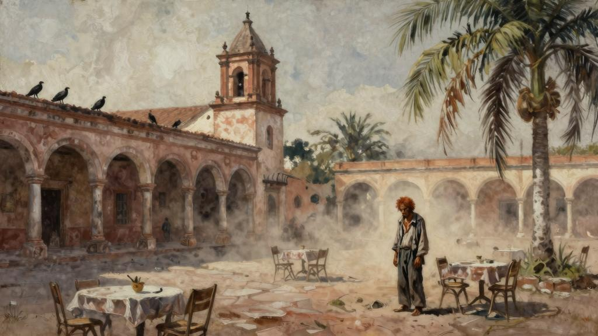
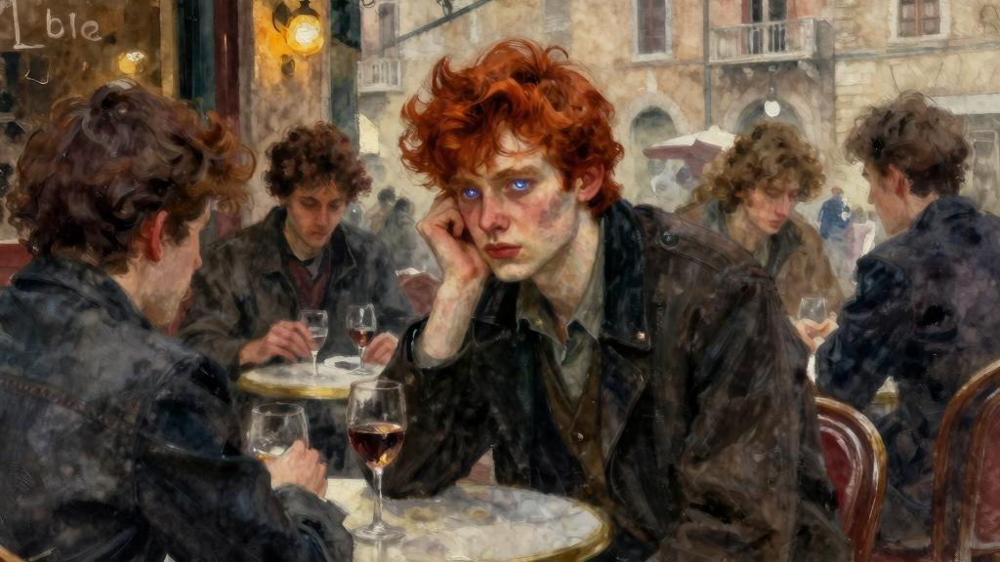
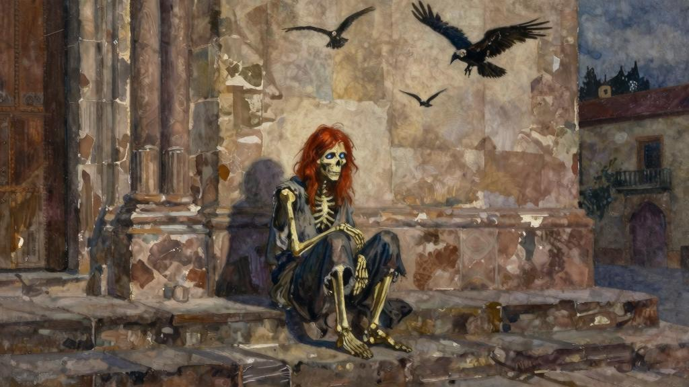

上帝知道，我一直怨叹，即使时间翻倍，也没法做完手头一半的活儿。我已记不得次什么时候偷得半日清闲。我常幻想可以整整一周悠闲自在。我们大多数人若不是忙着工作就是在忙着玩乐：骑马、网球、高尔夫、游泳、赌博；而我却幻想自己什么都不干。早慵懒地躺躺，中午四处闲逛，晚一样懒懒散散。我的头脑如同一块石板，时间则如同一块海绵，将感官世界留下的印记统统抹去。时间，如白驹过隙，一去不返，时间是人类最宝贵的财富，虚度光阴是人类最奢侈的放纵。克娄巴特拉将无价珍珠溶入酒中，送予安东尼饮用[30]；一寸光阴一寸金，浪费时光无异于端起珍珠酒的高脚杯将酒泼到地。这个动作很豪气，但就如所有豪气之举一样，也很荒唐。当然，荒唐就是它的理由。在我答应留给自己的一周里，我肯定会读书，因为对于读书成瘾的人来说，书就如同奴役人的药物，一旦没了可读的东西，他便会紧张兮兮、喜怒无常、坐立不安；就像酒鬼没了白兰地会用含甲醇的虫胶清漆和甲基化酒精一样，嗜书的人没了书，读起五年前的广告和电话簿也能将就。但是职业作家读书不会那么无所用心。我倒希望我的阅读也是一种独享清闲。我下定决心，如果有一天我能够享受无忧无虑的闲暇时光，我定会去完成一项一直令我魂牵梦萦的事业：读完尼克·卡特侦探的全套作品。但是迄今为止，就像探险家探索未知国度一样，我才刚刚起步。

我一直幻想自己能有一处钟爱之所，悠然度过这段时光；当这种闲暇时光突然来临，而我又必须全力应对时（就像在广阔太平洋汽轮遇到的一面之交的人，你邀请他来伦敦做客，他就真带着全部家当冷不丁出现在你眼前一样），总感觉有些猝不及防。

当时，我从墨西哥城到维拉克鲁斯，前往尤卡坦搭乘沃德公司的白色凉船[31]。令人始料未及的是，一夜之间码头罢工，我要搭乘的船进不了港，我于是滞留在了维拉克鲁斯。我在面朝广场的迪丽君西亚斯酒店订了房间，整个早都在观赏城镇风光。我专在偏街小巷里漫步，窥视着古色古香的宅院。穿行在教区教堂，雕刻和飞拱美丽如画，极有旧时建筑的风姿；海风咸涩，骄阳灼灼，教堂粗糙厚重的墙壁经年累月也变得沧桑斑驳；穹顶铺满蓝白相间的瓦片。饱览风景之后，我在广场周围的拱廊里坐下，点一杯

饮料小憩乘凉。烈日无情地炙烤着整个广场，椰树耷拉着满是灰尘的叶子，无精打采；黑色的大兀鹰在树稍作停留，略显不安，突然冲向地面，衔起食物碎屑，而后便拍着笨拙的翅膀飞教堂塔楼。广场人来人往，有黑人、印第安人、克里奥尔人、西班牙人和“西班牙海”[32]地区的各色人种，肤色也从乌木黑到象牙白各有不同。午的时间就这么过去了，我身边的桌子渐渐坐满了人，基本都是午饭前来小酌一口的男人，他们大都穿着白色的帆布衣服，但也有人不顾炎热，穿着体面的深色工作服。拱廊里有一个小型乐队——一个吉他手、一个盲人小提琴手和一个竖琴手，在表演拉格泰姆舞曲，每演奏两首曲子，吉他手就会拿着盘子来收钱。我已经买了一份当地报纸，所以当卖报的小贩没完没了地向我兜售同一份报纸时，我坚决不予理睬。总有脏兮兮的顽童想帮我擦鞋，可我的鞋干干净净，为此我拒绝了他们不下二十次；总有乞丐纠缠讨钱，可我的零钱所剩无几，也只能摇头拒绝。他们不给人留片刻安宁。瘦小的印第安妇女他们衣衫褴褛，每个人背都用披巾裹着个婴儿，伸着瘦削的双手乞讨，呜呜咽咽地重复着那套凄惨的说辞；一个个盲人被小男孩领到我的桌边；身体残疾的、跛足的、畸形的，向我展示他们先天或后天所遭受的伤痛和残暴；食不果腹、衣不蔽体的孩童纠缠不休地哀号着，一心想要铜板。但这些人也得时刻留心，以防那些大腹便便的警察突然拿着皮鞭冲出来，对着他们的后背或脑袋一顿猛抽。他们即刻落荒而逃，只等那些警察精疲力竭、昏昏欲睡，他们便再次回到老地方。

突然间，我的注意力被一个乞丐所吸引。其他乞丐还有坐在我周围的人都是黑皮肤和黑头发，而他的头发和胡子却红得让人心惊。他的胡子蓬乱，一头长发脏兮兮的，似乎几个月没有梳过了。他只穿着一条单裤，一件棉汗衫，但都破破烂烂，臭烘烘的，简直要散架。我从未见过这么瘦的人，他的腿、他的胳膊，只剩皮包骨头；他的根根肋骨，在破烂的汗衫下清晰可见；他满是尘土的双脚，每根骨头都数得清。在这群饥肠辘辘的人当中，他无疑是最凄惨的一个。这个人年纪不大，应该还不到四十岁，我不禁暗自揣摩，到底是怎样的经历使他沦落到这步田地。要是能找到工作，他也不愿工作，就让人没法理解了。在这群乞丐中，只有他一言不发。其他人都大倒苦水、喋喋不休，不拿到施舍不罢休，直到你不胜其烦把他们赶走。他从不求人，我想他大概明白，自己这副穷困潦倒的样子已胜过哀求。他甚至都不伸手，只是看着你，满眼悲伤，满脸绝望，让人心生畏惧；他呆呆地站着，一言不发，一动不动，直盯着你，如果你仍不搭理

他，他便慢吞吞地挪到下一张桌子前。没有得到施舍，他不会流露出失望或是生气。如果有人给他一枚硬币，他就稍稍向前移一点，伸出变形的手接过硬币，一句感谢的话都没有，继续面无表情地向下一张桌子走去。我没有什么好给他的，所以当他朝我走来的时候，我摇了摇头，让他不用白等。

“看在帝的分，原谅我吧。”我对他说，这是卡斯蒂利亚人惯用的礼貌语，西班牙人拒绝乞丐时常常这么说。但他并没有理会我说的话，依旧站在我面前，满眼凄苦地看着我，在我桌前也不长不短地停留了一会。我从未见过如此凄惨的一个人。他看去很可怕，似乎有些神志不清。过了一会，他继续向下一桌走去。

中午一点，我吃了午饭。午睡醒来时，天气依然炎热；傍晚将近，我犹豫着打开了窗户，一股凉风吹过，把我吸引到广场去了。我坐在拱廊下面，点了一大杯饮料。

此刻，人们正从四面八方大量拥入广场，餐厅里的桌子旁挤满了人，广场中心的凉亭里，乐队也开始演奏。人群愈发拥挤。公共长椅人们挤坐在一起，就像一串串密匝匝的紫葡萄。

叽叽喳喳的谈话声不绝于耳。黑色的大兀鹰在人们头顶盘旋尖叫，看到食物便疾速俯冲下来，然后从行人脚边匆匆飞逃。夜幕降临，大兀鹰从城镇四周向教堂塔楼群集，盘旋在塔楼周围，嘶鸣不已，聒噪不安地停在栖息之处。擦鞋匠想求着我擦鞋，卖报童硬给我塞潮乎乎的报纸，乞丐他们没完没了地哀求施舍。我又看到了那个长着红胡子的怪家伙，在一张张桌子前一动不动地站着，满面愁容，神情悲悯。他并没有在我的桌子前停留，我猜他大概记得，早在我这什么都没得到，所以也没必要再次尝试了。红头发的墨西哥人很少见，我只在俄罗斯见过这么落魄的人，所以我想，他会不会就是俄国人呢？能让自己落得如此穷困潦倒，正符合俄国人浑浑噩噩的品性。可是他的面相又不像俄国人；他瘦削脸，五官清朗，蓝色的眼睛深嵌在脸的样子也不是俄国人的长相；我在想他是不是一名水手，可能来自英国、斯堪的纳维亚或者美国，弃船跑了，却一步步陷入这般惨境。一转眼，他就没影了。因为无事可做，我便一直待在那儿，觉得饿了便去填饱肚子，然后又回到那里。我静静地坐着，直到人群渐渐散去，直到该睡觉

之时。不得不承认，这一天着实难熬。我不由得想，这样的日子什么时候是个头，我何时才能乘船离开。

没睡多久我便醒了，而且再难入睡。房间里很闷，我打开百叶窗，眺望着窗外的教堂。没有月亮的夜晚，闪亮的星光隐约勾勒出教堂的轮廓。兀鹰挨挨挤挤地蹲在穹顶的十字架和塔楼边缘，时不时挪动一下，感觉十分诡异。不知怎的，我突然想起那个红胡子的家伙，心头有一种奇怪的感觉：我以前见过他。这种感觉十分强烈，让我睡意全无。我确定见过他，但不记得在何时何地。我试图想象他出现时的场景，却只能看到迷雾中一个模糊的身影。黎明将至，天气稍稍凉爽了些，我才再次入睡。

我在维拉克鲁斯度过的第二天与第一天没有什么不同。但是这次，我留心注意着红头发乞丐何时出现。每当他站在我旁边的桌子时，我都要仔细观察一番。现在，我肯定我曾在什么地方见过他，甚至可以肯定我认识此人，并且和他说过话，但我还是想不起具体的情形。他再一次从我的桌边经过，没有停留；目光交会之时，我试图从中寻找记忆的影子，却一无所获。我怀疑自己搞错了，就像我们正在做什么事的时候，由于大脑失灵，便会觉得是在做以前做过的事。我曾经见过他，这个想法在我的脑海中挥之不去。几番冥思苦想之后，我终于确定，他不是英国人，就是美国人。但是我不好意思和他打招呼。我在脑海中搜索可能与他相遇的各种场景，却仍毫无头绪，这让我心烦意乱，就像某个人的名字就在嘴边却想不起一样。这一天同样漫长。

新的一天来临，又是一个清晨，又是一个傍晚。恰逢周日，广场比往常更拥挤。

跟前两天一样，红头发的乞丐又来了，衣衫褴褛、愁容满面，一言不发却令人毛骨悚然。他正站在离我两个桌子远的地方，默不作声地乞讨，连手都没伸。我又看到了那个警察，他时不时就会保护公众免受乞丐骚扰。他悄悄绕过柱子，用皮带把红头发乞丐狠抽了一顿。乞丐瘦弱的身躯抽搐了一下，但既没有反抗，也没有流露出憎恨；那剧痛的鞭笞对他而言似乎已是家常便饭。他慢吞吞地溜进广场，消失在薄暮之中。但这一记毒打抽醒了我的记忆，我突然想起来了。除了名字，关于他的其他一切事情我都记起来了。他肯定已经认出我了，因为二十年间我都没有多少变化；也正是因为这个，自第一天早之后他再也没有在我桌前停留。没错，二十年前我们就认识。当时，我在罗马待

了一个冬天，每天晚都在西斯提纳大道的一家餐厅吃饭，那里的通心粉味道一流，酒水也口味绝佳。一小伙英美艺术生和几个作家经常光顾这家店；我们常常待到深夜，没完没了地谈论着艺术和文学。红头发乞丐通常是和他的年轻画家朋友一起来，那时他还只是个年轻小伙子，不过二十出头的样子；蓝眼睛、高鼻梁、红头发，长相算是赏心悦目。我记得他讲了很多关于中美洲的事情，因为他曾经在联合果品公司工作，但是后来因为想成为一名作家便辞职了。我们都不大喜欢他，因为他很傲慢，而当时的我们也都年轻气盛，还不知道如何容忍年轻人的傲慢。他觉得我们是愚蠢的可怜虫，而且很没教养地当着我们面说。他从来不会向我们展示他的作品，因为我们的称赞对他来说一文不值，他对我们的批评也不屑一顾。他的极端自负让我们恼火；但是我们中的一些人尴尬地意识到，他的自负也许是合情合理的。难道他对自己天赋的强烈感知是空穴来风吗？

为了当作家，他牺牲了一切。他有一种没由来的自信，以至于他的朋友都对他将信将疑的。

我记得他当时斗志昂扬、精力充沛、对未来信心十足，一副超然物外的派头。很难想象，他竟和那个乞丐是同一个人，但我又十分肯定，他们确实是同一个人。我起身付了酒水钱，走进广场去找他。我的思绪如一团乱麻，内心也十分惊诧。我曾时不时地想起他，也会胡乱猜测他的近况。我从来都不曾想过，他竟落得如此悲惨的境地。成千万的年轻人怀着不切实际的梦想踏追求艺术的艰苦征程，但大多数人接受了自己的平庸，在生活中找了一个可以躲避饥饿的栖息之地。像他这样可太悲惨了。我问自己，他到底经历了什么。是怎样的希望落空使他精神崩溃，是怎样的连番打击让他心灰意冷，是怎样的幻想破灭让他万念俱灰？我问自己，他是否真的无药可救了呢？我在广场找了一圈，他也不在拱廊里。想在演奏台周围的人群中找到他只怕是希望渺茫。灯光渐渐暗下来，我担心就此见不到他了。经过教堂时，我发现他正坐在台阶。我无法描绘他当时有多么颓丧。生活将他掳走，百般蹂躏，撕扯肢解，然后将血肉模糊的残躯狠狠地扔到教堂的石阶。我朝他走去。

“还记得罗马吗？”我问他。

他没有动，也没有回答。他没有理会我，就像眼前没有我这个人一样。他也没有看我。一双空洞的蓝眼睛注视着石阶下面嘶叫着争抢食物的几只兀鹰。我有些不知所措。从口袋里掏出一张黄色的钞票，塞到他手里。他连瞥都没瞥一眼。但他的手稍稍动了一下，瘦得变形的手指握住了钞票，将它揉作一团，捏成小球，挑到大拇指尖，然后弹到空中，最后落在聒噪的大兀鹰之间。我本能地扭过头去，看到一只大兀鹰叼着纸球飞走了，还有两只飞在后面嘶叫。当我回过神来，他已经没了踪影。

我在维拉克鲁斯又待了三天。始终没有再看到他。