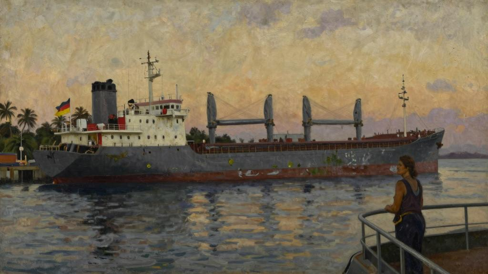
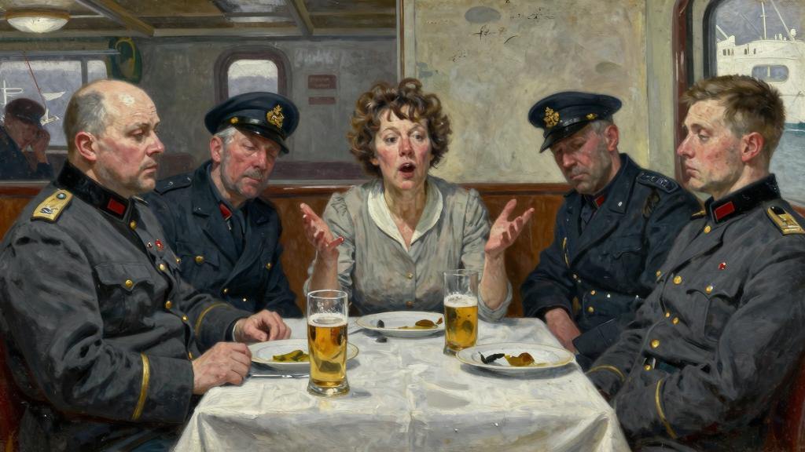
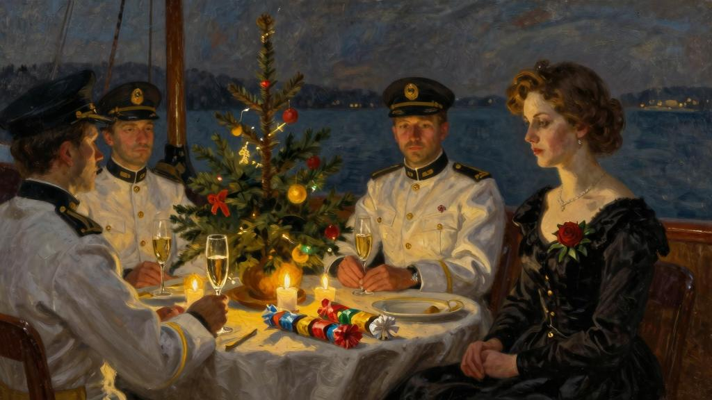

弗里德里克·韦伯号抵达海地之前，厄尔德曼船长对丽德小姐几乎一无所知。她是普利茅斯[2]上船的，但他那时已经接纳了不少旅客，有法国人，有比利时人，也有海地人，他们中的许多人以前都搭乘过他这艘船，于是，她便被安排坐轮机长那一桌。弗里德里克·韦伯号是一艘货轮，沿哥伦比亚海岸线定期从汉堡[3]驶往卡塔赫纳[4]，中途也会西印度群岛[5]的不少岛屿作短暂停靠。这艘船从德国运来的是磷肥和水泥，装载回去的则是咖啡和木材；然而其船东，即“韦伯兄弟公司”，但凡有什么货物值得去装运，向来都愿意指派这艘船脱离其规定的航线前去跑一趟。弗里德里克·韦伯号的配置可以随时承运牛羊、马骡、土豆，等等，或者说，只要有机会能赚到点儿正当的小钱，运什么都行。这艘船也承接客运业务。船的上层有六个舱室，下层也有六个舱室。舱位虽谈不上奢华，但膳食不错，清淡爽口，供应量充足，价格也很便宜。往返旅程需要九个星期，而丽德小姐的花费还不到四十五英镑。她翘首期盼的不仅是沿途可以观赏到许多令人心驰神往的名胜古迹，而且还能获得大量的信息和见闻来充实自己的头脑。

那位代理商早就告诫过她，这艘船抵达海地的太子港[6]之前，她得跟另一个女人合住一间舱室。丽德小姐对此并不介意，她喜欢有人做伴儿，所以，当船上的那位管事告诉她说，她的室友是波林太太[7]时，她马上想到的是，这不啻为一个重温法语的极好机会。后来发现波林太太黑得像煤炭时，她也只是略微有点儿慌乱而已。她暗暗告诫自己，人必须顺境逆境都能兜得住才行，再说，包罗万象才构成一个大千世界嘛。丽德小姐是个从不晕船的人，这一点倒确实是人们可以料想到的，因为她的祖父就是一名海军军官嘛，经过两三天风狂雨猛的颠簸之后，天气转而晴好起来，于是，没过多久，她便与同船的旅客他们都混熟了。她是个很善于交际的人。这是她之所以能把她的生意做得风生水起的原因之一；她经营着一家茶室，开英格兰西部一个闻名遐迩的风景区里，她对走进店铺的每一位顾客向来都笑脸相迎，再客客气气地问候一声；冬季来临时，她

就不营业了，最近这四年来，每到冬季，她便乘船去漫游世界。她说，这样做不仅可以结识到如此这般妙趣横生的人，而且总能学到点儿东西。诚然，搭乘弗里德里克·韦伯号的这些旅客档次并不高，远不如她一年前地中海的邮轮上所结识的那些人，不过，丽德小姐并不是一个瞧不起穷人的势利眼，尽管他们中有些人餐桌上的举止或多或少让她感到有些震惊，但她已经拿定主意，要以特定的眼光去看待事物光明的一面，于是便定下心来，尽最大努力与他们处好关系。她是个酷爱看书的人，浏览了一遍船上的那间图书室之后，她便欣喜地发现，那里居然有很多菲利普斯·奥本海姆[8]、埃德加·华莱士[9]、阿加莎·克里斯蒂[10]等人的作品；可是，因为有那么多的人要去攀谈，她便无暇顾及看书了，她决定暂且忍痛割爱，等这艘船抵达海地、旅客他们都走光了之后再说。

“不管怎么说，”她说，“人性总比文学重要得多。”

丽德小姐是个很善于交谈的人，也素来享有这种好名声，她私下里常为此而感到沾沾自喜，海上航行的这么多日子里，她一次也没有让桌边的谈话走向冷场。她知道该怎样去鼓动人们畅所欲言，每当有某个话题似乎要让大家无话可说了，她便非常机灵地插上一句，顿时就能让这个话题起死回生，要不就把早已等候她舌尖上的另一个话题抛出来，使交谈再次热烈起来。她的闺蜜，普莱斯小姐，也就是坎普顿镇[11]的那位已故教区牧师的女儿，此次还专程赶来普利茅斯为她送行，因为她家就住那边，普莱斯小姐经常对她说：

“你知道吗？维尼夏，你像男人一样很有头脑呢。你从来不会一时犯迷糊而找不到合适的话来说。”

“好吧，我想，如果你对人人都很关心，人人也会对你很关心的，”丽德小姐谦逊地说，“熟能生巧嘛，再说，我也肯下苦功夫，我这方面的本事大得使不完呢，狄更斯说，这就是天资。”

丽德小姐其实并不叫维尼夏，她的本名叫艾丽斯，但她并不喜欢这个名字，她还是个小姑娘的时候，就开始采用现这个富有诗意的名字了，她觉得这个名字非常适合于她的个性特点。

丽德小姐和同船的旅客他们待一起时，尽情享受过许许多多饶有趣味的高谈阔论，等到这艘船终于抵达了太子港，最后一位旅客也离船而去时，她真感到有些依依难舍。弗里德里克·韦伯号太子港停泊了两天，这期间，她游览了这座城市及其附近的乡镇。弗里德里克·韦伯号再次起航时，她成了船上独一无二的旅客。轮船沿着这座岛屿的海岸线继续向前航行，为了卸货或者装货，中途又停靠了一系列港口。

“丽德小姐啊，你孤身一人跟这么多男人待一起，但愿你不会因此而感到难为情。”他们坐下来吃午饭的时候，船长热诚地对她说。

她被安排坐船长的右手边，旁边的餐桌上依次坐着大副、轮机长，以及那位船医。

“船长，我可是见过世面的女人。我向来认为，如果一个大家闺秀是一个名副其实的大家闺秀的话，那么绅士也会保持地地道道的绅士风度的。”

“尊敬的女士啊，我们这些人只不过是一些粗野鲁莽的船夫，你可千万不要抱有过高的期望。”

“船长，善良的心要胜过小小的冠冕，朴实的信义要胜过诺曼人[12]的血统。”丽德小姐回答说。

船长是一位五短身材、体格壮硕的男子汉，脑袋剃得精光，一张红脸膛也刮得干干净净。他身穿一件白色的对襟衫，不过，只有甲板上用餐的时候，他才会解开钮扣，露出他那毛发旺盛的胸脯。他是个天性乐呵呵的汉子。他好像不大声吼叫就说不出话来似的。丽德小姐觉得，他无非就是个性格乖僻之人，但她有非常敏锐的幽默感，也有良好的心理准备，能够充分体谅这一点。对于这种交谈，她是驾轻就熟的。她出航之前就对海地作过大量的了解，停泊的这两天里，她又对海地进行过实地了解，掌握了更多的信息，但是，她也深知，男人们喜欢高谈阔论，却不太喜欢倾听，于是，她便向他们提了若干个问题，对于这些问题，她心里其实早已经知道答案了；十分奇怪的是，这些人并不喜欢高谈阔论。到头来，她忽然发觉，居然是她自己情不自禁地开了一

场小小的讲座，这顿饭还没来得及吃完，用他们自己那套滑稽可笑的说法，叫做“神圣的午餐”[13]，她已经向他们传授了大量引人入胜的信息，内容涉及海地共和国的历史由来及其经济形势，这个国家目前所面临的诸多问题，以及这个国家未来的发展前景。她说话的语速相当缓慢，拿腔拿调地说得很优雅，所涉及的语句也非常广泛。

夜幕降临时，他们停靠一个很不起眼的港口里，他们要那儿把三百袋咖啡装上船，那位代理商也上了船。船长邀请他留下来共进晚餐，还点了鸡尾酒。那位管事刚把鸡尾酒端上来，丽德小姐忽然仪态万方地飘然走进了这间会客室。她的姿势从容不迫、娉婷典雅、充满自信。她经常说，一个女人究竟是不是一个很有教养的大家闺秀，根据她行走的步态，你立即就可以判断出来。船长把这位代理商介绍给她之后，她便坐了下来。

“你们这些男人喝什么呢？”她问道。

“鸡尾酒。你要不要来一杯，丽德小姐？”

“来一杯也无妨。”

她喝下了这杯鸡尾酒，船长有点儿吃不准，满腹狐疑地问她要不要再来一杯。

“再来一杯？行啊，我的这种表现还算平易近人吧。”

那位代理商的长相比某些人要白皙一些，却比大多数人都要黑很多，他是海地派驻德国的一位前任公使的公子，柏林生活了好多年，能说一口漂亮的德语。果然是由于这层关系，他谋得了一份与一家德国航运企业打交道的职位。吃晚饭期间，这位丽德小姐的竭力怂恿下，他向大家谈起了他沿着莱茵河溯流而下的一次旅程，因为她也曾经这样游览过莱茵河。吃完晚饭之后，她和这位代理商，这艘小商船的船长、医生以及大副，都围坐同一张餐桌边喝起了啤酒。丽德小姐成心要撩拨起这位代理商的谈兴。

他们往船上装载咖啡这一事实向她表明，他说不定会雅兴大发，借此机会来了解一下人们锡兰[14]是如何种植茶叶的，没错，她曾经乘邮轮去过一趟锡兰，而他父亲是一名外交官这一事实，肯定也会促使他想乘兴了解一下英国皇室的概况。她度过了一个非

常惬意的夜晚。等她终于告退要去休息了，因为她决计不会说她要去上床睡觉了，这时，她才暗暗寻思道：

“毫无疑问，读万卷书不如行万里路啊。”

想不到自己竟孤身一人同这么一帮男人混一起，这可真是一次难得的体验啊。

等她回家后跟大伙儿说起这段经历时，他们不知会笑成什么样子呢！他们准会说，这种事情只会发生维尼夏的身上。她情不自禁地笑了笑，就这时，她忽然听见船长甲板上唱起歌来，他那特有的声若洪钟的嗓门不绝于耳。德国人就是这样富有音乐天赋。

他那两条短短的腿儿神气活现、忽上忽下地蹦跶着，嘴里唱着瓦格纳[15]的曲调，而歌词却是他自己杜撰出来的，模样显得十分滑稽可笑。他这时忽而又唱起了《汤豪仕》[16]，（大概是关于黄昏之星[17]的那个美妙的传说吧），由于不懂德语，丽德小姐只有好奇的份儿，却不知他即兴编造出来的那些荒诞不经的歌词究竟是什么意思。反正那歌声也挺好听的。

“啊，这个女人真惹人烦，要是她再这样没完没了地唠叨下去，我就当机立断宰了她。”紧接着，他又突然换成了《齐格弗雷德》[18]的战歌曲调，“她真惹人烦，她真惹人烦，她真惹人烦。我要把她扔进大海。”

这段歌词当然是针对丽德小姐的秉性有感而发的。她真是个特爱夸夸其谈的女人，她真是个语不惊人誓不休的女人，她真是个让人备受折磨、格外令人厌烦的女人。

她说起话来绵绵不断，声音也单调得毫无曲折变化，打断她也无济于事，因为她随后便会再次从头说起。她对各类见闻有一种永不餍足的求知欲，桌面上的任何一句漫不经心的交谈都会引起她的谈兴，使她提出数不清的问题来。她是一个超级梦想家，而且还不厌其烦地娓娓讲述她自己的那些梦想。这世上没有一个话题是她插不上嘴的，而且还说得头头是道。她有一套可适用于每一个场合的老生常谈的说辞。对于那些司空见惯的话题，她能立即一针见血地说出自己的观点，就像挥舞着一把榔头把一枚钉子钉墙上一样。对于那些平淡无奇的事情，她也会毫不迟疑地投入进来，就像马戏团的一名小丑突然窜出了呼啦圈一样。即使大家都哑口无言，她也不会感到窘迫。那些远离自己家乡

的男人都百般无聊，连吧嗒吧嗒的脚步声都很轻微，加之圣诞节即将来临，难怪他们都打不起精神；为了调动起他们的兴趣，逗引他们开心起来，她付出了双倍的努力。她下定决心，要把一点儿微不足道的欢乐注入他们这无精打采的生活中来，因为这是旅途中最难熬的一段时光：丽德小姐的本意是无可厚非的。她不仅想让自己度过一段愉快的时光，也竭力想让大家都度过一段愉快的时光。她坚信，他们都喜欢她，就像她也喜欢他们一样。她觉得她是尽自己的绵薄之力，让这伙人有一个好的结局，她自己也天真地高兴起来，满以为自己也会有一个好的结局。她向大伙儿谈起了她那个闺蜜普莱斯小姐，说这位闺蜜经常对她说：维尼夏呀，只要有你做伴儿，谁也不会感到枯燥无味，绝不会有一分钟的冷场。对乘客要以礼相待，这是船长的职责，然而，无论他心里多么想教训她，让她免开尊口，却怎么也说不出口，即使他可以无所拘束地把自己的心里话说出来，但他深知，他决不能口无遮拦地伤害她的感情。没有任何办法可以堵住她那张口若悬河、滔滔不绝的嘴。实无计可施了，他们便用德语交谈起来，可是，丽德小姐立即制止了这种交谈。

“瞧，我可不愿让你他们说这些我听不懂的话。你他们大家都应该充分利用你们这么好的运气才对，因为有我这么全心全意地向着你他们，好好操练你他们的英语吧。”

“我们谈技术方面的事情呢，这些事情没什么意思，只会让你感到厌烦，丽德小姐。”船长说。

“我才不会感到厌烦呢。这就是我为什么从不招人厌烦的原因，你不会认为我这样说有点儿刚愎自用吧。你瞧，我就喜欢了解各种事情。样样事情都能勾起我的兴趣，何况你压根儿也不知道哪条信息将来能派上用场啊。”

船医干涩地笑了笑。

“船长只是这么一说罢了，因为他觉得有些不好意思了。就实际情况而论，他刚才是讲一个传奇故事，这种故事不宜让一个黄花大闺女听见。”

“就算我是个黄花大闺女吧，可我也是一个见多识广的女人啊，我又没指望海员个个都是圣人。不管你我面前说什么，你根本用不着害怕，船长，我不会感到震惊的。

我倒很想听听你讲的这个故事呢。”

船医是一位年届六旬的男人，灰白色的头发已经稀疏，蓄着灰白色的八字胡，一双蔚蓝色的小眼睛炯炯有神。他是个寡言少语、不苟言笑的人，丽德小姐无论怎样煞费苦心地想把他拉进这场谈话中来，也没法从他嘴里套出一句话来。不过，她可是一个不撞南墙不回头的女人，于是，有一天早晨，那时候他们还海上航行呢，她看见他坐甲板上看书，便把自己的座椅拉到他的座椅边，他身旁坐了下来。

“你喜欢看书啊，大夫？”她满面春风地说。

“是的。”

“我也喜欢看书。我估计，像所有德国人一样，你也很有音乐天赋吧。”

“我喜欢音乐。”

“我也喜欢音乐。我一见到你，就觉得你很聪明。”他朝她瞄了一眼，便抿紧嘴唇，自顾看书去了。丽德小姐并没有因此而乱了方寸。

“不过，当然，人随时都可以享受读书的乐趣。我向来宁愿跟人家好好聊一聊，也不愿独自抱着一本好看的书。难道你不喜欢这样吗？”

“不。”

“真有意思。那就劳驾你跟我说说为什么呢？”

“我说不出理由。”

“那就太不可思议啦，对不对？但是，话说回来，我向来认为，人的本性就是这么不可思议。想必你也知道，我特别爱好跟人打交道。我向来喜欢当医生的人，他们深知

人的本性，但是，我可以告诉你一些连你都会感到惊讶的事情。要是你像我这样经营着一家奶茶铺的话，你就会对各式各样的人有非常深入的了解啦。”

船医站起身来。

“请原谅，丽德小姐，我必须向你告辞啦。我得去看一个病人。”

“不管怎么样，我总算打破这矜持的气氛啦，”他走开之后，她暗自思忖道，“我看来，他只不过有些害臊罢了。”

没想到，过了一两天之后，船医忽然感觉身体不太舒服了。他患有一种脏器性疾病，这种病时不时会折磨他，不过，他已经习惯了，因而不愿把自己的病情告诉别人。

一旦病情发作起来，他只想独处一隅，免得有人来打扰。他那间舱室很小，又密不透风，所以，他便独自一人来到甲板上，闭着眼睛坐一张长条椅上歇息。丽德小姐此时正那儿来来回回地跑动，进行她每天早晚必做的为时半个钟头的锻炼。他暗暗寻思，假如他假装睡着了，她或许就不会来打搅他了。岂料，她他身边来回经过了五六次之后，便突然他面前收住了脚步，静静地站那儿。尽管两眼紧闭，但他心里有数，知道她仔细端详着他。

“大夫，有没有什么我能帮得上忙的事情？”她说。

他吓了一跳。

“哎呀，不会有什么事情要劳驾你吧？”

他朝她瞥了一眼，却发觉她的眼睛里满含着忧虑。

“你看上去病得不轻呢。”她说。

“我现疼得很厉害。”

“我知道。我看得出来。有没有什么办法可以止痛？”

“没有，这种病痛一会儿就过去啦。”

她迟疑了片刻，随后便走开了。没过一会儿，她又回来了。

“没有枕头、软垫之类的东西，你显得很不舒服。我把我自己的枕头给你拿来了，我外出旅行时向来都随身带着这个枕头。请允许我把这个枕头垫你的脑袋后面吧。”

他感到自己此刻确实病得很厉害，无力抗拒她的这一举动。只见她温情脉脉地抬起他的脑袋，把这只柔软的枕头垫他的脑袋后面。这下果然让他真的感觉舒服多了。

她顺手摸了摸他的额头，发觉他的额头软绵绵的，很凉。

“可怜的人儿啊，”她说，“我知道大夫都是些什么样的人。他们压根儿就不懂，他们的首要任务应该是如何关心自己的健康。”

她离开了他，不料，一两分钟后，她竟然搬着一把椅子又返身回来了，还拎来了一只袋子。船医一看见她，便痛苦得抽搐了一下。

“瞧，我不会让你说话的，我打算就守你身边织毛线。我向来认为，人要是感觉身体不太好，身边有个人陪着，总是一件让人舒心的事。”

她坐了下来，随手从袋子里拿出了一条尚未织成的围巾，接着便开始飞针走线地编织起来。她真的自始至终一句话也没说。说来奇怪，船医竟不由自主地发觉，有她陪身边果然是一种安慰。船上甚至都没有一个人注意到他生病了，他感到很孤独，因此，这个特爱夸夸其谈、特别惹人厌烦的女人的这份同情心，不免令他心存感激。看着她不声不响地编织着，他的疼痛渐渐减轻了，不一会儿便睡着了。等他一觉醒来时，她还织毛线。她朝他嫣然一笑，却没有开口说话。由于疼痛已经消失，他感觉好多了。

那天下午，他拖到很晚才来到会客室。他发觉船长和汉斯·克劳斯，也就是那位大副，正坐一起喝啤酒。

“请坐，大夫，”船长说，“我们正开紧急会议呢。你也知道，后天就是除夕夜[19]啦。”

“没错。”

除夕夜，新年的前夕，是德国人极为看重的一个传统节日，他们都翘首期盼着这个节日。他们还不远万里专门从德国带来了一棵圣诞树。

“今天用餐时，丽德小姐比以往任何时候都健谈。我和汉斯已经商量好啦，必须采取相关措施来应对这种情况。”

“她今天早上陪我坐了足足有两个钟头，一句话也没说。我估计，她大概很想把白白失去的时间补回来吧。”

“不管怎么说，此时此刻，远离自己的家乡和亲人，总是让人心情很不好，我们只能这种不利的情况下尽力而为。我们要欢度我们的除夕夜，可是，如果不对丽德小姐采取点儿措施，我们将无缘欢度这个节日。”

“有她缠着我们，我们就没法享受这份快乐，”大副说，“她肯定会破坏节日的气氛，这是明摆着的，就像鸡蛋就是鸡蛋一样。”

“除了把她扔进海里，你打算用什么办法干掉她呢？”船长笑着说，“她是个还算不错的老熟人，她只是缺少一个情人罢了。”

“就她这把年纪？”汉斯·克劳斯大声吼道。

“尤其她这个年纪。那么肆无忌惮地饶舌，对各类见闻的那份激情，她提出的那些数不清的问题，她那些说得头头是道的话，她那种絮絮叨叨的说话方式——这些全都是一种迹象，表明她依然还保持着爱吵吵闹闹、缺乏社会经验的处女身。要是有一个情人，她就会平静下来啦。她那些绷得很紧的神经就会松弛下来了。她至少可以享受到

一个钟头的令她满意的生活嘛。她眼下所需要的那种令她身心满意的生活就会击穿她那些愈演愈烈的言辞的核心，这样一来，我们就能安安静静地过节啦。”

要想弄明白船医所说的话里有几分是真话，向来有一定的难度，尤其是他拿你开玩笑的时候。不管怎么说，反正船长的那双蓝汪汪的眼睛调皮地一连眨巴了好几下。

“好吧，大夫，我对你的高超的诊断能力还是很有信心的。你提出的这个治疗方案显然值得试一试，既然你是一个单身汉，这个治疗方案就要靠你来实施啦，这可是明摆着的事实啊。”

“你就饶了我吧，船长，为这条船上的病人开出对症下药的治疗方案，这是我的职业范围所规定的我应尽的义务，但是，这并不等于要我本人亲自来实施这些治疗方案，再说，我已经六十岁啦。”

“我是个已婚男人，还有几个已经长大成人的孩子，”船长说，“我又老又胖，还是个散光眼患者，显而易见，你他们总不能指望我来承担这项使命吧。老天爷规定我只能担任丈夫和父亲这个角色，并没有规定我要担任一个情人的角色。”

“这些事情上，年轻是最主要的因素，漂亮的长相也占有很大的优势。”船医非常严肃地说。

船长捏紧拳头使劲儿擂了一下桌子。

“你考虑的人选是汉斯吧。你的想法完全对。汉斯必须承担这项任务。”

大副吓得猛然站起身来。

“我吗？绝对不行。”

“汉斯啊，你人高马大，相貌英俊，身体健壮得像头雄狮，向来英勇无畏，而且也很年轻。我们还要继续海上航行二十三天才能抵达汉堡港，遇到紧急情况时，你总不

能开小差，抛弃这个与你肝胆相照的老船长吧，再说，你也不能辜负这位大夫、你的好朋友的一片苦心吧？”

“不行啊，船长，这个要求太高啦。我结婚还不到一年，我也很爱我的老婆。我迫不及待地想早日回到汉堡呢。我老婆盼望着我回去，我也盼望着早日跟她团聚。我可不愿对她不忠，尤其不愿跟丽德小姐通奸。”

“丽德小姐真的很不错。”船医说。

“有人甚至还说，她长得挺标致呢。”船长说。

的确，如果仔细看看丽德小姐的容颜和身段，你就会发现，她确实不是一个相貌平平的女人。诚然，她生了一张傻乎乎的长脸蛋，但她那双棕褐色的眼睛却很大，眼睫毛也很浓密，她的发型是一头短短的棕褐色的秀发，鬈曲的波浪相当漂亮地披散她的脖子上；她的皮肤也不错，身段既不算太胖，又不算太瘦。她并不像人们现如今所说的那么老，假如她对你说，她已经四十岁了，你肯定非常乐意相信她的这一说法。唯一对她不利的特点是：她缺乏应有的朝气，不是那么活泼有趣儿。

“如此说来，这漫长得要命的二十三天里，难道必须由我来忍受那个令人生厌的女人喋喋不休的啰唆话吗？这漫长得要命的二十三天里，难道必须由我来回答她那些颠三倒四的问题，听她说那些没头没脑的蠢话吗？难道必须让我，一个老头子，来牺牲我的除夕夜，牺牲我一直翘首期盼的欢乐之夜，任凭那个让人难以忍受的老处女不受欢迎地陪伴着我、毁了我的快乐时光吗？难道就找不到一个人愿意向一个孤苦伶仃的女人献上一点儿殷勤，向她表示一点儿富有人情味的善意，向她施舍一星半点儿的仁爱之心吗？我干脆让这条船触礁沉没得啦。”

“那个报务员随时都可以派上用场。”汉斯说。

船长顿时兴奋得大吼了一声。

“汉斯啊，让科隆[20]成千上万的处女他们站出来，向你高呼万岁吧！管事，”他大声吩咐道，“通知报务员，我要见他。”

报务员一走进会客室，脚后跟便“咔嗒”一碰，潇洒地行了个礼。那三个男人全都默不作声地朝他打量着。他忐忑不安地疑惑起来，不知自己会不会因为做错了什么事而被训斥得灰头土脸。他略高于中等个头，肩膀宽阔，腰胯匀挑，身材挺拔而又苗条，被晒成了棕褐色的皮肤光洁细腻，看上去仿佛从来没有碰过剃须刀，他天生一双蓝得让人吃惊的大眼睛，蓄着一头像马鬃似的鬈曲的金发。他简直就是年轻的日耳曼男子汉完美的标本。他显得那么健康、那么精力充沛、那么活力四射，即使他与你还隔着点儿距离，你也能感受到他浑身上下散发出的朝气。

“雅利安人[21]，行啦，”船长说，“这事准能成。你多大啦，我的孩子？”

“二十一岁，长官。”

“有没有结婚？”

“没有，长官。”

“有没有订婚？”

报务员嘿嘿一笑。他的笑声中依然还带着一股子惹人喜爱的孩子气。

“没有，长官。”

“你知不知道，我们船上有一位女性乘客？”

“知道，长官。”

“你认识她吗？”

“我甲板上见到过她，我对她说过‘早上好’。”

船长装模作样地摆出一副官气十足的样子。他那双眼睛一般情况下总是要朝你逗趣儿地眨巴几下的，此时却显得非常严肃，他那浑厚、圆润的说话声里似乎也骤然间平添了几分威严。

“尽管这是一艘货轮，尽管我们运载的是非常值钱的货物，但我们同时也承运我们能够接受的诸如此类的旅客，这是我们扩大了的一项业务，因为公司急于要发展这项业务。我的命令是，务必尽一切可能提高旅客的愉快感和舒适感。丽德小姐需要一个恋人。大夫和我已经有了结论，你是非常合适的人选，可以满足丽德小姐的各种要求。”

“我吗，长官？”

报务员羞得满脸绯红，但随后便咯咯儿地笑了起来，不过，他很快便镇静下来，因为他看到了那三个男人一本正经的面孔，他们都正襟危坐地面对着他。

“可是，她的岁数大得简直可以当我的母亲啦。”

“就你这个年纪而言，这种事情没有任何不良后果。她可是一位高不可攀的上流社会的女子，而且跟英国所有的名门望族都有千丝万缕的联系。她要是德国人的话，那她至少也是个女伯爵。特意挑选你来担当起这个责任重大的角色，这就是一份荣耀，你应当对此深表感激才对。再说，你的英语老是毫无长进，这可是你提高英语水平的一个极好机会啊。”

“这当然是一件值得考虑的事情，”报务员说，“我也知道，我需要锻炼。”

“既可以享受性爱的快活，又可以提高知识水平，两不耽误，人这辈子不会经常碰到这种好事的，你应该庆幸自己有这么好的福分才是。”

“可是，长官，请允许我提一个问题，行吗？丽德小姐为什么需要一个恋人呢？”

“这好像是一个古老的英国习俗，每到一年中的这个时节，那些养尊处优的未婚女子都会放下架子，主动向她们心仪的恋人投怀送抱。公司方面急于想了解，丽德小姐我们这儿是否受到很好的款待了，如同她英国轮船上所享受到的待遇一样，我们相信，如果她得到满足了，凭她与贵族阶层的那些关系，她能够把她的许多朋友都发动起来，搭乘本公司的轮船去漫游世界。”

“长官，我只好恳求你放过我啦。”

“我可不是提什么要求，这是一项命令。你必须主动去见丽德小姐，她的舱室里，今晚十一点。”

“到了那儿之后，我该干什么呢？”

“干什么？”船长雷鸣般地吼道，“干什么？顺其自然呗。”

他挥了挥手，打发他走开了。报务员脚后跟“咔嚓”一碰，敬了个礼，转身走了出去。

“行啦，让我们再来一杯啤酒吧。”船长说。

当天晚上，吃晚饭的时候，丽德小姐竟然自我膨胀到了登峰造极的地步。她的噜苏话格外多。她顽皮地开着玩笑。她的言谈举止也变得高雅起来。没有一个不言而喻的事情是她搭不上腔的。没有一个老生常谈的话题能让她忍得住不发表意见。船长一直努力克制他内心的满腔怒火，脸涨得越来越红；他感到自己再也没法继续对她以礼相待了，假如大夫提出的那个治疗方法不管用，他总有一天会全然不顾自己的身份，向她提出的就不是一句警告，而是要把他心里的所有怨愤都一股脑儿发泄出来。

“我会丢了这份工作的，”他暗暗想道，“可是，到底值不值得这样大动肝火，我也没有把握啊。”

第二天，他们已经围坐餐桌边了，她才进来用餐。

“明天就是除夕夜啦。”她兴高采烈地说。这种事情她居然也不揣冒昧地说起来。

她接着又说：“今天上午你他们大家都干了些什么？”

由于他们每天干的都是些雷打不动、完全相同的事情，她也非常清楚都是些什么事，这个问题着实让人十分恼怒。船长的心情陡然跌入了低谷。他言简意赅地对大夫说起了自己对他的看法。

“喂，行行好，别讲德语啦，”丽德小姐调皮地说，“你他们知道的，我可不允许你他们讲德语，船长啊，你干吗那么一脸愠怒地望着可怜的大夫呢？现正值圣诞节期间，你知道的；我祝福普天之下所有的人幸福安康、心想事成。一想到明天晚上的情景，我就兴奋得不得了，你们会圣诞树上插满蜡烛吗？”

“当然。”

“多么令人激动啊！我向来认为，不插蜡烛的圣诞树就不是圣诞树。哦，你他们知道吗？昨天夜里，我遇到了一件非常滑稽的事情。我到现都弄不懂究竟是怎么一回事。”

众人大吃一惊，顿时都哑然无语了。大家都目不转睛地望着丽德小姐。这一回，他们都全神贯注地听她往下讲了。

“真的，”她用她所特有的那种单调乏味、平铺直叙的腔调娓娓讲述起来，“昨天夜里，我正准备上床睡觉了，却忽然听见有人敲我的门。‘谁呀？’我说。‘是我，报务员。’我听到的是这声回答。‘有什么事吗？’我说。‘我可以跟你谈谈吗？’他说。”

众人都凝神静气地听着。“‘好吧，等一下，我要换件晨衣，’我说，‘马上就来开门。’于是，我赶紧套了件晨衣，把门打开了。报务员说：‘对不起，小姐，请问，你需要发无线电报吗？’唉，他居然这个时候跑来问我要不要发一份无线电报，我当时就觉得这事很滑稽，我就当着他的面哈哈大笑起来，这事大大触动了我的幽默感，但愿你他们明白我这话的意思，可是，我当时并不想伤了他的感情，所以，我就说：‘非常感谢你，不过，我觉得我不需要发无线电报呀。’他愣愣地站那儿，显得十分滑稽，他似乎感到非常尴尬，于是，我就说：‘谢谢你专门前来问我，可是，我不需要发电报啊。’接着，我又说：‘晚安，愿你好梦常。’随后就把门关上了。”

“这该死的傻瓜。”船长气得大叫一声。

“他还很年轻，丽德小姐，”船医插进来说，“那是他热情得过了火的表现。我估计，他大概以为你很想给你的朋友他们发一份新年贺词吧，他巴不得你利用这个有利条件，想让你享受特别优惠的价格呢。”

“哦，我压根儿也没计较。我喜欢这些稀奇古怪的小事情，人旅途中，难免会碰到这些奇人奇事。我一笑了之就是了。”

晚餐一结束、丽德小姐离开了他们之后，船长马上就派人去叫来了报务员。

“你这个白痴，昨天夜里，你是怎么搞的？怎么能鬼使神差地跑去问丽德小姐要不要发无线电报呢？”

“长官，是你吩咐我要顺其自然的。我是报务员。我还以为问她要不要发无线电报是理所当然的事情呢。我也不知道还有什么别的话可说啊。”

“上帝天作证，”船长高声喊道，“看到布伦希尔德[22]躺她的礁石上时，西格弗雷德哭喊道：‘这不是个男人啊[23]。’”（船长唱起了这句歌词，由于对自己的歌喉颇为得意，便把这句歌词反复唱了两三遍，然后才接着说。）“看到布伦希尔德苏醒过来时，西格弗雷德有没有问她要不要发一份无线电报，要不要告诉她爸爸她哪儿？我估计，她睡了一大觉之后，就一直坐那儿等消息吧？”

“我诚恐诚惶地恳求长官阁下注意这一事实，布伦希尔德是西格弗雷德的婶婶。对我来说，丽德小姐却是一个素不相识的陌生人。”

“他当时并不清楚她是他的婶婶啊。他只知道，她是一个如花似玉、毫无自卫能力的良家女子，他做了任何一个正人君子都会做的事情。你血气方刚、相貌英俊，是地地道道的雅利安人，德国的荣誉掌握你的手里呢。”

“很好，长官。我尽力而为吧。”

当天夜里，丽德小姐的门上又响起了一阵叩击声。

“谁呀？”

“是我，报务员。丽德小姐，我有一份电报要交给你。”

“交给我？”她感到非常诧异，不过，她马上想到的是，肯定是其中一位曾经与她同行、海地下船的旅客给她发来了新年贺词。“真是好人啊，”她暗暗想道，“我已经上床啦。放门口吧。”

“这份电报需要回复。要预付十个单词的电报费。”

如此看来，这份电报就不可能是一份新年贺词啦。她紧张得心脏都停止跳动了。

唯独只有一种可能：她的店铺被彻底烧毁了。她一跃而起，跳下床来。

“把电报从下面的门缝里塞进来吧，我马上写回电，再从门缝里塞还给你。”

一只信封被人从门槛下面的门缝里推了进来，信封赫然出现地毯上时，乍一看真是一个不祥之兆。丽德小姐一把抓起电报，迅速撕开了信封。电文她眼前模糊不清地摇晃着，她急得一时都找不到眼镜了。以下是她看到的电文：

“新年快乐。愿普天下所有的人幸福安康、心想事成。你的确非常美丽。我爱你。

我必须向你表白。落款：报务员。”

丽德小姐把这份电文通读了两遍。随后，她慢慢摘下眼镜，把眼镜藏一条围巾下。她打开了门。

“进来吧。”她说。

第二天是除夕。高级船员他们坐下来用餐时，个个都既兴致勃勃，又有点儿伤感。

乘务人员早已用热带地区的匍匐植物弥补了没有冬青植物和槲寄生植物的缺憾，把会客室装饰得焕然一新，那棵圣诞树也矗立餐桌上，树上插满了蜡烛，准备吃晚饭的时

候点燃。丽德小姐直到那些高级船员全都入座后，才姗姗来迟地走进了会客室，众人朝她道“早安”时，她也没吭声，只是点了点头。大家都好奇地望着她。她这顿饭吃得很香，却始终没说一句话。她这样默不作声倒让人觉得很不可思议了。到最后，船长再也忍不住了，于是，他说：

“丽德小姐，你今天不怎么说话嘛。”

“我想心事呢。”她回应道。

“你大概不愿意把你的那些心事告诉我们吧，丽德小姐？”船医调侃地问道。

她冷冷地白了他一眼，那副表情简直可以称之为目中无人。

“大夫，我宁可憋自己心里，也不愿告诉别人。我想再来点儿肉末土豆泥，我今天胃口特别好。”

他们饱享口福、一派肃静的氛围中吃完了这顿饭。船长大大地舒了一口气。这才是吃饭时间应该有的样子嘛，吃饭时间就应该好好吃饭，别叽叽喳喳地饶舌。等大家都吃饱肚子后，他起身走到船医面前，使劲儿握着他的手。

“大夫啊，好像有眉目了。”

“已经有眉目啦。她已经是一个脱胎换骨的女人啦。”

“可是，这种情况能不能一直保持下去呢？”

“我们只能怀着最好的希望。”

为了欢度除夕夜，丽德小姐特意换上了一件晚礼服，那是一件非常素雅的黑色连衣裙，胸前佩戴着手工制作的玫瑰花，脖子上挂着很长的一串仿玉项链。灯光已被调得朦朦胧胧，插圣诞树上的那些蜡烛都点亮了。这情景颇有点儿让人觉得像置身教堂里似的。这天晚上，级别较低的船员他们也都会客室里聚餐，他们身穿洁白的制服，显

得非常精神。公司出钱，让大家畅饮香槟酒。晚宴结束之后，他们又喝起了“香车五月酒”[24]。他们拉响了彩色爆竹[25]。他们伴随着留声机播放的乐曲一支接一支地唱起歌来，唱的是“德国，高于一切的德国”[26]，“老海德堡”[27]，以及"友谊地久天长"[28]。

他们热情奔放地高唱着这些歌曲，船长亮开歌喉，歌声比其他人都要高亢，丽德小姐也用她那甜美的女低音加入进来。船医注意到，丽德小姐的那双眼睛时不时会落报务员的身上，他从她那双眼睛里看出了一丝心慌意乱的神色。

“他是个美男子，对不对？”船医问道。

丽德小姐转过身来，冷冷地朝船医看了一眼。

“谁呀？”

“报务员啊。我还以为你是看他呢。”

“哪一位是他？”

“女人口是心非的典型表现。”船医喃喃自语地嘀咕了一声，但他依然面带微笑地回答说，“坐轮机长旁边的那一位就是他。”

“哦，没错，我总算认出他啦。你知道吗？我向来认为，一个男人的长相怎么样，其实并不重要。我看重的是一个男人的头脑，根本不乎他的长相。”

“啊。”船医说。

大家都喝得有点儿醉醺醺的了，丽德小姐也不例外，但她一点儿没有失态，她向众人道“晚安”时，依然保持着她的最佳风度。

“我度过了一个非常愉快的夜晚。一艘德国轮船上度过的这个除夕夜，我将终生难忘。这个除夕夜过得非常有趣。多么美好的一次经历啊。”

她泰然自若地朝门口走去，这简直就是一种大获全胜、得意非凡的姿态，因为她整个晚上都和其他人一样，左一杯右一杯地喝了不少酒。

第二天，他们多少都有些疲惫。等到船长、大副、船医、轮机长下来用餐时，却发现丽德小姐已经端坐那儿了。他们每个人的座位前都摆放着一个小包裹，上面扎着粉红色的丝带。每个小包裹上都写着：新年快乐。他们都满腹狐疑地朝丽德小姐瞥了一眼。

“大家一直都对我这么关心，这么友好，我心里早就有这个想法了，我想给你他们每个人都送上一份小小的礼物。太子港也没有多少可以挑选的东西，所以，你他们千万不要有过高的指望。”

她送给船长的礼物是一对用欧石楠根制成的烟斗，送给船医的是六条丝巾，送给大副的是一只精美的雪茄烟盒，送给轮机长的是两条领带。大家吃好晚饭后，丽德小姐便起身告退，回她的舱室休息去了。这几个高级船员面面相觑，都感到有些不太自。

大副抚弄着她送给他的那只雪茄烟盒。

“我真为自己感到有点儿难为情。”他终于开口说道。

船长则陷入了沉思，显而易见，他有点儿忐忑不安了。

“不知我们该不该开那种玩笑捉弄丽德小姐，”他说，“她是个挺好的老熟人，她也并不是很有钱；她是一个靠自己挣钱谋生的女人。她肯定做了精打细算，才舍得花费一百马克买下这些礼物的。要是我们不干涉她该多好。”

船医耸了耸肩。

“是你想把她的嘴巴封住的，我已经封住她的嘴巴了。”

“既然话都说到这个份儿上了，事情也做下了，再听她叽叽喳喳地唠叨三个礼拜对我们也没多大坏处。”大副说。

“她这件事情上，我感到不太痛快，”船长又补了一句，“我总觉得，她这样寡言少语不是什么好兆头。”

他们刚才和她同桌共进晚餐期间，她几乎一句话也没说。她好像也没太注意听他们说话的内容。

“大夫，难道你不觉得我们应该去问问她，现是不是感觉挺好？”船长提议道。

“她现当然感觉挺好啦。她现吃起饭来活像一头饿狼。你要是想打听具体情况，最好去找那个报务员。”

“你也许还没注意到吧，大夫，我可是一个感情很脆弱的人。”

“本人也是一个心肠很软的人啊。”船医说。

剩下的这段旅程里，那些男人便毫无节制地宠着丽德小姐了。他们个个都对她非常体贴，关怀备至，就像对待一个罹患了一场旷日持久的重病之后正处于康复期的人似的。尽管她的胃口好极了，他们仍挖空心思地变换着花样，用新的菜肴来勾起她的食欲。船医点了葡萄酒，执意要她和他一起来品尝这瓶酒。他们陪她玩多米诺骨牌。他们陪她下棋。他们陪她打桥牌。他们想方设法地邀请她加入他们的谈话。不过，有一点是毫无疑问的：虽然她客客气气地应答着他们大献殷勤的举动，却很矜持，不愿跟人交往。她仿佛用那种近乎鄙夷的眼光打量着他们；你没准会认为，她把那些男人，连同他们旨表示友好的诸般努力，都当成荒诞不经的笑料了。她很少开口说话，除非别人主动跟她搭讪。她白天看侦探小说，晚上则坐甲板上看星星。她沉浸自己的生活之中。

本次旅程终于要接近尾声了。一个风平浪静、天色灰暗的日子里，他们驶进了英吉利海峡；他们总算看到陆地了。丽德小姐收拾好了旅行箱。下午两点钟时，他们停泊普利茅斯码头。船长、大副、船医一起来向她告别。

“行啦，丽德小姐，”船长用他那乐呵呵的口吻说，“我们都舍不得让你走，可是，我估计，你盼着早点儿到家呢。”

“你对我一直都很亲切，你他们大家都一直对我很亲切，我不知道我有何德何能，才修来了这个福分。跟你他们一起的这些日子里，我过得非常愉快。我永远忘不了你他们。”

她说得相当感人，她竭力想笑一笑，嘴唇却颤抖，紧跟着，泪水便顺着她的脸颊奔流下来。船长脸红得很厉害，他很尴尬地笑了笑。

“丽德小姐，我可以吻你一下吗？”

她比船长高半个头。她俯下身子，船长她那泪水涟涟的脸颊上结结实实地吻了一下，接着又她的另一侧脸颊上结结实实地吻了一下。她朝大副和船医转过身去。他们俩也都亲吻了她。

“我真是个大傻瓜呀，”她说，“人人都这么好。”

她擦干眼泪，随后便以她所特有的那种仪态万方、很不协调的姿势，慢慢走下了舷梯。船长的眼睛湿湿的，盈满了泪水。走到码头上时，她仰起头来看了看，朝甲板上的某个人挥了挥手。

“她向谁挥手致意？”船长问道。

“报务员呗。”

为了迎接她，普莱斯小姐早已恭候码头上了。她们办理了海关手续，把丽德小姐的那只沉重的行李箱寄存好之后，便去了普莱斯小姐家，她家提前用了下午茶。丽德小姐的火车五点钟才发车。普莱斯小姐有好多话要对丽德小姐倾诉。

“可是，你刚刚回国，我就像这样没完没了地说起来，这也太不像话啦。我一直期盼着听你讲讲有关你这趟旅行的方方面面的事情呢。”

“恐怕没有多少值得讲给你听的事情。”

“我不信。你这趟旅行大有收获吧，对不对？”

“一种截然不同的收获吧。这份收获很微妙。”

“你不乎跟那帮德国佬混一起吗？”

“当然，他们跟英国人不一样。人必须适应他们的行为方式才行。他们有时候干的那些事情啊——还算不错，你也知道，英国人是不会那样干的。不过，我向来认为，人必须审时度势，安于现状才对。”

“你指的是哪一类事情？”

丽德小姐心平气和地望着她的闺蜜。她那张傻乎乎的长脸蛋上全然是一副安之若素的表情，普莱斯小姐根本就没注意到，她那双眼睛里闪烁着一种异样的、调皮的光芒。

“真的是一些无关紧要的事情。就是些滑稽可笑、出人意料、相当微妙的事情。毫无疑问，旅行是一种让人受益匪浅的教育。”