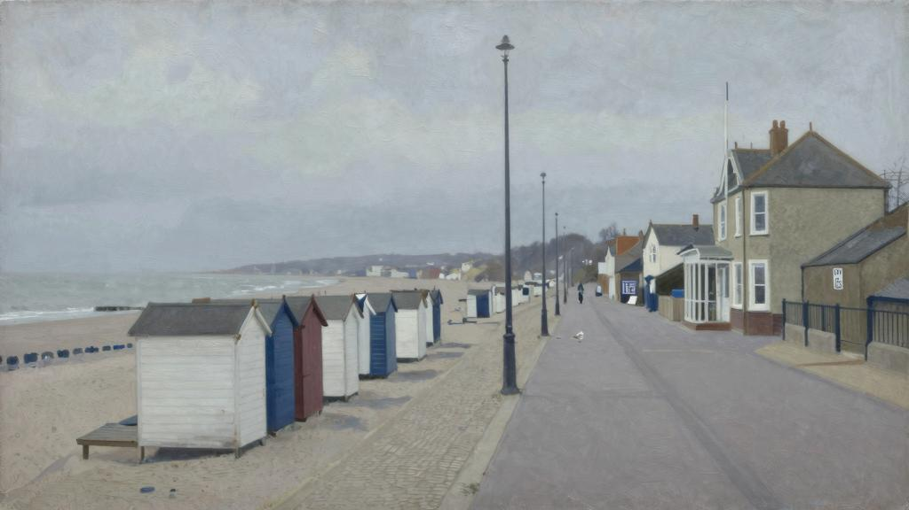
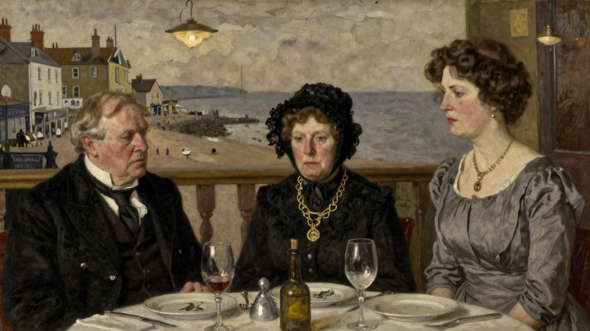
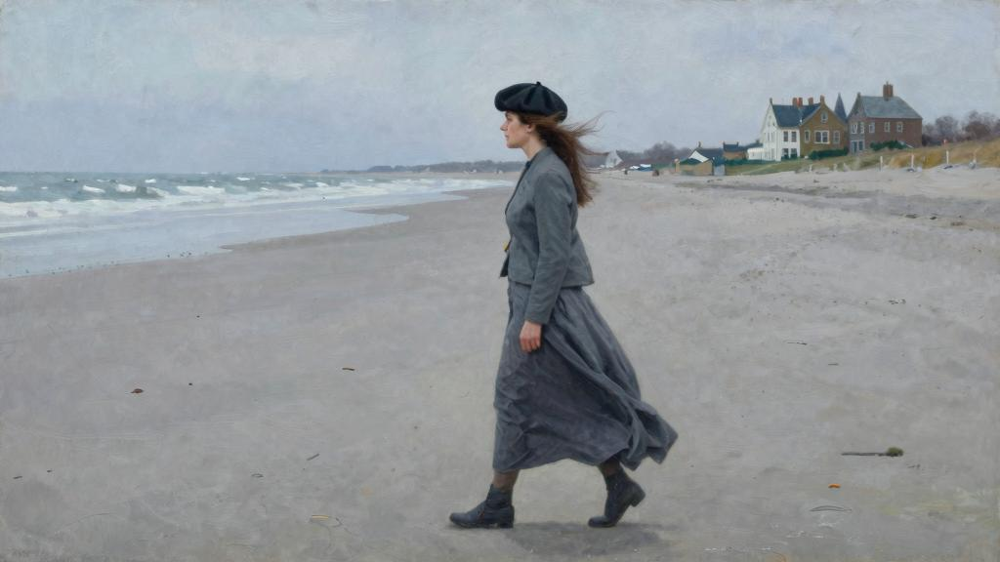
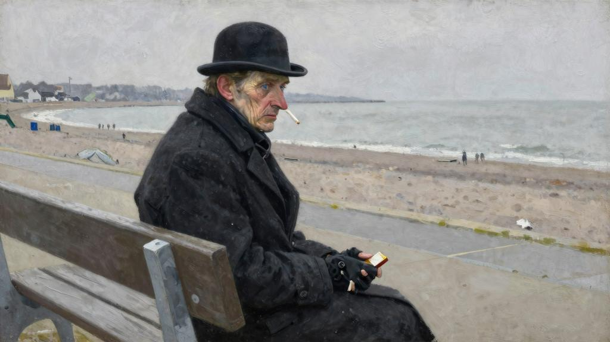

我喜欢埃尔索姆。那是坐落在英格兰南部的一个海滨度假胜地，离布莱顿[83]不算太远，那个宜人的小镇颇有点儿乔治国王[84]时代晚期的魅力。不过，这个地方既不喧闹，也不俗艳。十年前，经常动不动就去那儿，你依然时不时就会看到一幢古老的房屋，很坚固，而且虚于其表，但格调并不令人讨厌（就像一个名门出身的贵妇人，纵然穷困潦倒，但其血统中带有的那种谨慎的骄傲只会让你觉得好笑，而不会冒犯你），它们都是“欧洲第一绅士”[85]统治时期建造的，一个家道中落的侍臣不妨可以在这里安度晚年。主干街上弥漫着懒洋洋的气息，医生开的汽车似乎有些不合时宜。主妇他们悠闲自得地做着家务。屠夫挥动着手臂从南丘羊[86]身上砍下脖子根部最好的肉，主妇他们一边望着他，一边和他闲聊，她们也会亲切地问候杂货店老板的妻子，一边等着他把半磅茶叶外加一袋盐放进她们的购物网袋。不知道埃尔索姆过去是否也称得上一个时髦的地方：去的那个时候肯定不是了；但是，这个地方体面，性价比也高。住在那里的人通常是一些未出嫁或者寡居的老妇人，还有从印度来的平民，以及退伍的士兵，他们既期待八九月份的天气，同时又有些惧怕八月和九月前来度假的人流；不过嫌弃归嫌弃，他们乐意让游客他们在自家屋子里借宿，收了房租就可以到瑞士的某个膳宿公寓过几周尘世间的快乐时光。从来没有见识过那个繁忙时期的埃尔索姆，听说那个时候所有出租房都住满了，穿着夹克衫的年轻人在海岸边漫步，白面小丑在沙滩边上表演，一直到晚上十一点，你都能听到从海豚旅馆的台球房里传来的台球的碰击声。只见识过冬天的埃尔索姆。靠海的每一栋房子，都是一百年前建造的，刷着粉饰灰泥，装着拱形窗棂，每一幢都张贴着出租告示；海豚旅馆只有一个服务生和跑腿的门童负责接待各方宾客。每天晚上十点一到，门童就会进入吸烟室，看着你，什么都不说，让你不得不起身回房休息。埃尔索姆是个休闲的地方，海豚旅馆也是个令人惬意的地方。想到摄政王[87]多次带着菲茨尔伯特夫人一路开过来，在旅馆的咖啡厅里喝茶，倒也让人遐想连连。大厅里挂着装裱起来的萨克雷[88]先生的一封信，上面写着他要一间有一个客厅两个卧室的套房，面朝海景，还要求必须派一辆马车到车站去接他。

有一年的十一月里，是战后第二年还是第三年吧，由于突然患上了严重的流感，去埃尔索姆调养身子。下午到达之后，放好行李，便到海边去走走。天色阴沉，平静的海面呈现出一派灰色，天气寒冷。几只海鸥在贴着岸边飞翔。因为是冬天，帆船的船桅都收起来了，在布满沙砾的沙滩上高高挂起，一间间淋浴房排成了一条长龙，灰色的墙面，显得很破旧。市镇委员会到处投放了一些长椅，但是现在都空着，附近有几个人拖着沉重的步伐在来回走动着，是在锻炼身体。一路走来，看到了一位上了年纪的上校，长着红鼻头，穿着宽大的运动裤，在大踏步地走着，后面跟着一条猎狗，看到了两位老妇人，穿着短裙，脚上穿着结实的鞋子，还有一位相貌平平的姑娘，戴着苏格兰式的无檐圆帽。从来没见过这么荒凉的海滩。出租房看上去像浑身透湿、邋遢不堪的老处女，在等待着那个永远不会回来的爱人，甚至连以往宾客盈门的海豚旅馆都好像有些破败荒凉。的心顿时沉了下来。生活似乎突然间变得索然无味了。回到旅馆，拉开客厅的窗帘，点上炉火，拿起一本书，想用读书来驱散阴郁的心情。到了该换衣服去吃晚餐的时候，的心情确实开朗了一些。走进咖啡厅，发现旅馆的客人都已落座就餐了。随意瞟了他们一眼。只见有一位中年女士独自坐着，有两位老先生，也许是高尔夫球手吧，红红的脸颊，秃顶的脑门，在郁郁寡欢地吃着饭。房间里的其余三个人则坐在拱形窗边，立马被他们吸引住了。那是一位老先生和两位女士，其中一个年纪大了，大概是他的老婆，另一个年轻一些，也许是他的女儿吧。起先是这位老夫人引发了的好奇。她穿着肥大的黑丝裙，戴着黑色的蕾丝帽；手腕上戴着沉甸甸的金镯子，脖子上挂着大金链，上面吊着一个大金坠；领口处别着一枚大金胸针。不知道如今还有谁会戴那种珠宝。经常路过二手珠宝店和当铺，会停留一会儿，微笑着打量这些奇怪、老式的物件，牢固、昂贵、模样丑陋，想到佩戴这些首饰的女子早已不在人世了，笑容里又添上了几分哀愁。这些物件告诉了人们，衬垫、荷叶边是在什么时候取代了裙撑，平顶卷边帽是在什么时候取代了宽檐帽的。那时候，英国人喜欢牢固的好东西。他们周日早上去教堂做礼拜，结束后去公园散步。他们的家宴上会准备十二道菜肴，由主人来切牛肉和鸡肉，餐后，会弹钢琴的女士会向在场宾客献上一曲门德尔松[89]的《无词歌》[90]来助兴，擅长中音的男士会唱上一曲古老的英国民谣。

年纪轻的那位女士背对着，起初，只能看到她那苗条、年轻的身姿。一头浓密的棕色头发，似乎是精心打理过的。她穿着灰色的裙子。他们三个人坐在那儿，在窃

窃私语地聊天，此刻，她转过头来，看到了她的容貌。惊为天人。鼻子坚挺、小巧，脸部线条分明；这时才看到，她梳着亚历山德拉皇后[91]的发型。晚餐快要结束了，仨人站起来，离开了餐桌。老妇人翩然走出房间，目光直视着前方，丝毫没有左顾右盼，年轻的那位跟着她。看到她原来也上年纪了，大吃一惊。她穿的裙子极其简单，裙摆长度比当时的款式稍长，而且剪裁上有点儿过时，收腰比常见的款式更加明显，但这仍是一条女孩子穿的裙子。她个头高挑，颇像丁尼生[92]笔下的女主角，身材纤细，两腿修长，走路姿态优雅。之前见过那样的鼻子，希腊女神才有这样的鼻子，她还有美丽的嘴巴，有一双又大又蓝的眼睛。皮肤已经算不上特别紧实了，额头和眼睛周围有几道细细的皱纹，但是年轻的时候，她的皮肤肯定光彩动人。她让你想起了阿尔玛—塔德玛[93]所画的五官匀称、精致的罗马美人，虽然她们身着复古的裙子，却依然固执地表露出自己的英伦特色来。这是过去二十五年来没有见过的完美，带着冷冷清清的感觉。这就如同隽语这种体裁一样，已经死寂消亡。就像一个考古学家，发现了埋藏已久的雕像，无意中发现过去的时代是这样留存下来的，感到无比兴奋。消亡最为彻底的，往往只是昨日。

两位女士离开时，那位老先生也站了起来，现在他又回到座位上了。一个服务员给他拿来一杯浓波特酒。他先闻了闻，小口抿着，然后在舌上细细品味了一会儿再咽下去。仔细地观察了他好一会儿。他个头矮小，比他那位身形高大的妻子要矮得多，身子肥胖不结实，有一头灰白的鬈发。他脸上布满了皱纹，带着有点儿滑稽的表情。他双唇紧闭，脸颊方正。照现在的观念来看，他的着装未免有些太过花哨：穿着黑色天鹅绒夹克，低领的褶边衬衫，系着宽条的黑色领带，还有极其宽大的晚宴西裤。你仿佛觉得，他穿的是一套戏装。他不慌不忙地喝完了那杯波尔多红酒，站起身来，慢慢走出了餐厅。

很好奇，想知道这些人是谁，穿过大厅的时候，瞥了一眼访客本。看到他们三个人的名字是一种女性化的字体写上去的，这大概是四十年前曾经风行一时的学校里教给年轻女子一种有棱有角的写法，他们的名字是：艾德温·圣克莱尔夫妇，以及波切斯特小姐。他们的地址是：伦敦市贝斯沃特区伦斯特广场68号。这些名字和地址肯定是那三个让饶有兴趣的人的。问了女经理谁是圣克莱尔先生，她告诉说，他是

本城的大人物。随后，走进台球房，打了一会儿台球，然后上楼，经过了休息室。先前见到的那两位红脸的绅士正在读晚报，那位年纪大的女士手里拿着一本小说，在打瞌睡。另外那三个人则坐在角落里。圣克莱尔太太在织毛线，波切斯特小姐在忙着刺绣，而圣克莱尔先生则在朗读，虽然想尽量不打扰别人，但听上去声音还是很洪亮。经过的时候，发现他在读《荒凉山庄》[94]。

第二天，基本在读书、写作，但下午抽空出去走了走，回来的时候，在海边的公用椅子上坐了会儿。天气没有昨天那么冷了，空气宜人。无事可做，看到远方有个人朝走过来。是一个男人，走近了才看清，是一个衣衫褴褛的家伙。他穿着单薄的黑色大衣，头上戴着一顶有点儿破旧的圆顶礼帽。他走路时双手揣口袋里，看上去有些冷。经过身边的时候，他朝瞥了一眼，继续向前走了几步，犹豫了一下，然后又停下脚步，转过身来。等到再次出现在坐着的地方时，他从口袋里伸出手，摸了摸自己的帽子。看到他戴着破破烂烂的黑色手套，估计他是个经济条件有些拮据的鳏夫。或者说，他从事的也许是殡葬行业，像自己一样，刚刚流感痊愈，在这里静养。

“先生，打扰了，”他说道，“能借个火吗？”

“当然了。”

他坐在旁边，在口袋里找火柴时，他在找香烟。掏出一小盒“金叶”[95]牌香烟之后，他忽然脸色一沉。

“哎呀，哎呀，真扫兴！的烟都抽完了。”

“给你一支吧。”笑着回答道。

拿出烟盒，他自己动手拿了一支。

“黄金的？”他问道，合上烟盒的时候，他拍了拍烟盒，“是黄金的吧？这种东西向来留不住。之前有过三个。都让人偷了。”

他的目光落在自己的靴子上，神情颇有些惆怅，那双靴子急需修补。他是个身材干瘪、瘦小的家伙，鼻子又长又窄，淡蓝色的眼睛。他的皮肤蜡黄，脸上皱纹密布。说不上他有多大岁数；他可能是三十五岁，也可能已经六十岁了。他身上没有什么突出的特点，除了他那无足轻重的模样。但是，虽说很明显，他是个穷苦人，但他显得整洁、干净。他值得别人尊重，也很在意自己的社会地位。不对，觉得他不是一个专门从事殡葬行业的人，想，他也许是某个律师事务所的职员，最近刚刚安葬了自己的亡妻，是体恤下情的老板送他到埃尔索姆来的，好让他熬过丧妻之痛的头一波打击。

“先生，你在这儿要待很久吗？”他问。

“十天或者两个星期吧。”

“先生，这是你第一次来埃尔索姆吗？”

“以前来过。”

“先生，很了解这里。可以很自豪地说，这世上没有几个海边度假地是没有去过的，时常隔三岔五地去这些地方。埃尔索姆可谓天下难寻啊，先生。你会发现，这个地方的人与众不同，都很有修养。埃尔索姆既不热闹，也不俗气，但愿你懂的意思。先生，埃尔索姆给留下了许多非常美好的回忆。想当初，对埃尔索姆可熟悉了。是在圣马丁大教堂结婚的，先生。”

“是吗？”有气无力地说。

“先生，那可是一段非常幸福的婚姻啊。”

“很高兴听你这么说。”回答道。

“九个月，那场婚姻持续了九个月。”他若有所思地说。

这话谅必有点儿出奇。并没有满怀热情地翘首期盼他下一步可能要说些什么，因为已经十分清楚地预见到，他准会毫不吝啬地向倾诉他的婚姻经历，不过，这

会儿还是在耐心等待着，即使算不上心情迫切，至少也算怀着一份好奇心，目的是为了再增长点儿见闻。他不为所动。他只是轻轻叹息了一声。熬到最后，打破了沉默。

“周围好像没有多少人嘛。”说道。

“喜欢这样。可不是个喜欢凑热闹的人。刚才还在说呢，依看，已经在一个又一个海滨度假胜地消磨过好多年了，但从来不在旅游旺季去。冬天才是喜欢的季节。”

“你不觉得这里的冬天有点儿凄凉吗？”

他转向，把一只戴着黑手套的手搭在的胳膊上。

“确实凄凉。但是，正因为凄凉，稍有一缕阳光就特别招人喜欢。”

这话在听来似乎纯属无稽之谈，便没去搭腔。他把那只手从的胳膊上抽了回去，随即站起身来。

“得啦，不能再这样没完没了地烦你了，先生。很高兴能认识你。”

他彬彬有礼地摘下他那顶脏兮兮的帽子向致意，然后便信步走开。此时，天有些阴冷起来，得回旅馆了。走上宽阔的台阶时，一辆活顶双排座的四轮马车跟了上来，拉车的两匹马瘦得皮包骨，从车里下来的人是圣克莱尔先生。他戴着的那顶帽子，看着就像圆顶礼帽和高顶礼帽两者很不和谐地糅合在一起的产物。他伸出手去扶太太，接着再去扶自己的外甥女。门童在他们身后拿地毯和垫子走进了旅馆。圣克莱尔先生付钱给车夫的时候，听到他在吩咐对方第二天老时间来，马上就知道了，他们每天下午都会坐马车外出兜风。如果有谁告诉说，他们三个都没有坐过汽车，一点都不会惊讶。

女经理对说，他们平时喜欢独处，不会主动和旅馆里的其他住客打交道。信马由缰地展开了自己的想象力。每天三餐都在观察他们。看到，圣克莱尔夫妇俩每

天早晨都会坐在旅馆门前的台阶顶上，圣克莱尔先生在看《泰晤士报》，圣克莱尔太太在织毛线。估计，圣克莱尔太太这辈子压根儿就没读过一份报纸，因为他们向来只带着《泰晤士报》，从没见过他们带着别的报纸，而圣克莱尔先生每天带着去城里的当然也是这份报纸。大概在十二点的时候，波切斯特小姐会加入他们。

“埃莉诺，你享受到散步的好处了吧？”圣克莱尔太太问道。

“格特鲁德阿姨，散步确实非常好。”波切斯特小姐答道。

也明白了，就像圣克莱尔太太每天下午要去兜风一样，波切斯特小姐每天早上都要去散步。

“亲爱的，等你把这一排毛线打完之后，”圣克莱尔先生瞥了一眼他太太手头的毛线活，说道，“他们不妨去散散步，权当在午餐前做一次健身运动。”

“那就太好啦。”圣克莱尔太太回答道。她折叠起手头的活儿，把它交给了波切斯特小姐。“埃莉诺，如果你上楼去的话，顺便把的毛线活带上去，好吗？”

“当然啦，格特鲁德阿姨。”

“亲爱的，想，散了步之后，你大概有点儿累了吧。”

“用午餐前，想先休息一会儿。”

波切斯特小姐走进了旅馆，而圣克莱尔夫妇则沿着海边慢慢向前走去，俩人肩并肩地走到了一个特定的地点，然后又慢悠悠地走了回来。

每当在楼梯上遇到他们其中某一个人时，都会鞠躬致意，也会收到对方回敬的彬彬有礼的鞠躬，脸上却没有笑容。有天早上，冒昧地说了一句“日安”，不料，这句问候语当即就此结束了。如此看来，似乎无缘与他们当中的任何一个人说话了。但是现在，感觉圣克莱尔先生时不时就会朝瞥上一眼，估计他可能听到过的名

字，于是，就遐想着，也许是枉费心机的遐想吧，他是怀着好奇心在打量。过了一两天之后，正好坐在自己的房间里，那个门童忽然闯进屋来，给带来了一个口信。

“圣克莱尔先生向您问好，并且请问您能否把《惠特克年鉴》[96]借给他看看？”

吃了一惊。

“他怎么会想到有《惠特克年鉴》？”

“哎呀，先生，女经理告诉过他了，你是写书的。”

还是不明白这其中的关联。

“告诉圣克莱尔先生，非常抱歉，《惠特克年鉴》一本也没有，假如有这本书的话，倒很乐意借给他。”

瞧，的机会来了。直到现在，才满怀着迫切的心情，想得寸进尺地去详细了解这几个天方夜谭式的人物。从前时不时地待在亚洲的核心地区时，经常会遇见某一个孤零零的部落，他们生活在一个小村子里，周围都是格格不入的异族人口。没有人知道他们是怎么过来的，为什么偏偏在那个地点定居下来。他们过自己的日子，说自己的语言，与附近相邻的部落没有任何交往。没有人知道他们是不是自己的民族在浩浩荡荡地横扫这片大陆时留下的某一支部队的后裔，抑或是曾经在该地区建立过帝国的某些伟人的后代，这些后人已经所剩无几，在那里苟延残喘地活着。他们充满了神秘。他们没有未来，也没有历史。在看来，眼前这个奇怪的小家庭似乎也具有同样的特征。他们所具有的特点，是一个早已逝去、不复存在的时代的特点。他们不禁使想起了父辈他们爱读的那些休闲、老派小说里的人物。他们属于八十年代，而且自那以来就没有前进过一步。他们居然也经历了最近这四十年，仿佛这个世界已经停滞不前了一样，真是太奇葩了！他们使回到了的童年，使回想起了那些逝去多年的人。很疑惑，不知这是不是纯属年代造成的距离感，这才使感到，他们比生活在当今世界的任何人都要怪诞。如果当年有人被形容为“真是个怪人”，老天爷作证，那可是意有所指的。

所以，那天晚上，用过晚餐后，就走进休息室，大胆地跟圣克莱尔先生说话了：

“抱歉，没有《惠特克年鉴》，”说道，“不过，如果有什么书籍你能派上用场，很乐意借给你。”

圣克莱尔先生显然吓了一跳。那两位女士的眼睛都盯着自己手头的活儿。全场一片寂静，人人都尴尬地愣住了。

“没关系，不过，那位女经理的确告诉说，你是个小说家。”

绞尽脑汁地思索着。的职业与《惠特克年鉴》之间似乎显然存在某种关联，可怎么也想不起来。

“想当年，和特罗洛普[97]先生经常在伦斯特广场共进晚餐，记得他说过这样的话，对于小说家来说，最有用的两本书是《圣经》和《惠特克年鉴》。”

“看到了，萨克雷曾经在这家旅馆住过。”说道，心里很着急，不想让这场交谈半途而废。

“一向不大喜欢萨克雷先生，尽管他和已故的岳父萨金特·桑德斯先生不止一次地共进过晚餐。对来说，萨克雷的作品太愤世嫉俗了。外甥女直到今天也没有读过《名利场》。”

波切斯特小姐一听见提到了自己，顿时有点儿脸红了。这时，一个服务员端上了咖啡，圣克莱尔太太转向她的丈夫。

“亲爱的，也许这位先生肯赏脸，愿意陪他们一起喝咖啡呢。”

这话虽然不是直接对说的，还是立即答应了：

“非常感谢。”

坐了下来。

“特罗洛普先生一直是喜爱的小说家，”圣克莱尔先生说道，“他是一个纯粹的绅士。钦佩查尔斯·狄更斯。但是查尔斯·狄更斯的笔下永远也描绘不出一位栩栩如生的绅士。据了解，现在的年轻人认为，特罗洛普的作品节奏有点儿过于缓慢。的外甥女波切斯特小姐更喜欢威廉·布莱克[98]的小说。”

“可惜还没读过他的书。”说道。

“噢，明白了，你跟一样；你也跟不上潮流啊。有一次，外甥女要说服去看罗达·布劳顿[99]的一部小说，但还没看到一百页，就再也看不下去了。”

“艾德温姨夫，没说喜欢那本书，”波切斯特小姐自解嘲地说道，脸又红了，“只是跟您说了，这本书的内容很放荡，可是，人人都在谈论这本书。”

“埃莉诺，相信这不是你格特鲁德阿姨想要你读的书。”

“记得布劳顿小姐有一次跟说，她年轻的时候，人们说她的书内容很露骨，等她年纪大了，他们又说她的书过于平淡，这就很难办了，因为她四十年来写的完全是同一种类型的书啊。”

“哦，你了解布劳顿小姐吗？”波切斯特小姐问道，这是她第一次和说话，“太有趣了！那你认识奥维达[100]吗？”

“亲爱的埃莉诺，你接下来还要说什么啊！敢肯定，你从来就没有读过奥维达的作品。”

“艾德温姨夫，可确实读过呀。看过她写的《两面旗帜之下》，非常喜欢这本书。”

“你倒让不得不刮目相看了。真不知道如今的女孩子都成什么样了。”

“您一直说，等到了三十岁，就给绝对的自由，允许想看什么就看什么。”

“亲爱的埃莉诺，自由和放肆是有区别的。”圣克莱尔先生说道，微微笑了笑，目的是为了不让自己的责备显得过于唐突，但还是带着几分严肃。

至今也不清楚，在如此这般地详细描述这场交谈时，是否已经准确表达出了当时的感受，那场交谈确实具有一种令人痴迷的老派的气氛。完全可以通宵达旦地听他们谈论十九世纪八十年代期间尚属年轻的一代人的腐化堕落行为。要是能看上一眼他们在莱茵斯特广场的那座洋洋大观、室内非常宽敞的豪宅，付出再大代价都愿意。

应该能认得出客厅里铺着红色织锦的成套家具，每一件都笔直地竖立在指定的位置；那些陈列柜个个都摆满了德累斯顿[101]瓷器，会让不由自主地回想起的童年。他们通常都坐在餐厅里，因为客厅只用来举办各类聚会，餐厅里有一块土耳其地毯，有一个巨大的红木餐具柜，由于装了太多的银器而“不堪重负”。墙上的画作肯定会在十九世纪八十年代的学院派中备受亨弗莉·沃德夫人[102]和她叔叔马修的青睐。

第二天早上，漫步穿过埃尔索姆后面的一条漂亮的街道时，正巧见到了波切斯特小姐，她在散步。本来可以和她一起走一段的，但是五十岁的小姐和这样年龄的男人独自走在一起，肯定会让她尴尬。路过的时候，她向鞠躬，脸红了。

奇怪的是，在她后面几码的地方，忽然看见了那个滑稽可笑、衣衫褴褛的小个子男人，戴着黑手套，就是之前在海滩上和说过几分钟话的人。他摸了摸自己那顶破旧的圆礼帽。

“请问，先生，可不可以请你帮个忙，借给一根火柴？”他说道。

“当然可以，”反唇相讥地回答道，“不过，恐怕没有带香烟啊。”

“让请你抽一支的烟吧。”他一边说，一边掏出自己的纸质烟盒。那是只空烟盒。“哎呀，哎呀，也一支不剩了。多么奇怪的巧合啊！”

他继续向前走去，总觉得他稍许加快了步伐。马上对他产生了疑虑。但愿他不会去打扰波切斯特小姐。过了一会儿，心里想着要折回头赶上去，但并没有真这样做。他是个文明的小男人，就不信他会自讨没趣地去骚扰一个单身女子。

就在当天下午，又看到他了。当时一直坐在海滨人行道上。他迈着小步，期期艾艾地朝走来。那时好像有点儿风，他看上去就像被风儿吹过来的一片枯叶。这回他没有犹豫，而是直接在身边坐了下来。

“先生，他们又见面了。这个世界真是个小地方。如果这样做不会使你感到不便的话，不妨请你允许休息几分钟吧。稍许有点儿累了。”

“这是一条公用长凳，有权坐在这里，你当然也同样有权坐在这里。”

没有等他开口向借火柴，就立马给了他一支烟。

“先生，那就太谢谢你啦！不得不限定自己，一天不能抽那么多烟，但是，能享受到抽那几支烟的快乐。人年纪越大，生活的乐趣就越少，不过，的经验是，人反而可以更加尽情地去享受那些所剩无几的乐趣。”

“这倒是个非常令人宽慰的说法。”

“请问，先生，你就是那位著名作家吧，不知这样想对不对？”

“确实是一位作家，”回答道，“可是，你凭什么会这样想呢？”

“在画报上看见过你的照片。估计，你认不出了吧？”

又朝他看了看，一个骨瘦如柴、个头矮小的男人，穿着一身整洁、破旧的黑色衣服，长鼻子，一双水汪汪的蓝眼睛。

“不好意思，没认出来。”

“想，已经今非昔比啦，”他感慨地说，“曾几何时，的照片登载在联合王国的每一家报纸上。当然，那些报社的摄影师拍的照片从来就不像你本人。先生，这么跟你说吧，要不是看到照片下面有的名字，怎么也猜不出来有些照片就是针对拍的。”

他沉默了一会儿。退潮了，铺满砂砾的海滩的另一边是一溜黄泥。防波堤半埋在其中，宛如史前巨兽的脊梁骨。

“先生，当一名作家肯定是一件极其有趣的事吧。时常认为，自己很有写作的天分。前前后后读了大量的书。最近没再坚持多读书了。其中一个原因是，眼睛不如从前那么好了。相信，如果试一试，也可以写出一本书来。”

“人们常说，无论什么人都可以写出一本书来。”回答道。

“写不出一部小说吧，你知道的。就是个不太喜欢小说的人，更喜欢历史之类的书。不过，回忆录另当别论。如果有人肯出这笔钱，倒愿意写一写的回忆录。”

“写回忆录当下非常时髦。”

“这世上像这样正反两方面的阅历都很丰富的人并不多。关于这一点，的确给一家星期天发行的报纸写过信，没想到，他们根本没回的信。”

他朝意味深长、评头品足地审视了一番。瞧他那种十分正派的样子，总不至于会开口向讨要半个克朗[103]吧。

“当然，你还不知道是谁吧，先生，对不对？”

“还真不知道。”

他仿佛在动脑筋思索了一会儿，接着又抚弄着他那副黑手套手指上的几处褶皱，盯着其中的一个破洞看了一会儿，然后才转过身来面对着，脸上不无羞赧的表情。

“就是那个大名鼎鼎的莫蒂默·埃利斯啊。”他说道。

“哦？”

不知道还会冒出什么惊人的话来，因为就所知，到目前为止，还从来没有听到过这个名字。看到他的脸上浮现出失望之色，也感到颇有点儿尴尬。

“莫蒂默·埃利斯，”他重复了一遍，“你总不会当着的面说你不知道吧。”

“不好意思，确实不知道。大多数时间都不在英国。”

有些纳闷，不知他的名气究竟从何而来。把各种各样的可能性在脑海中梳理了一遍。他绝对不可能是一名运动员，因为在英国，唯独只有当运动员的人能真正出名，但他说不定是一名信仰治疗师[104]，或者是一名台球冠军呢。当然，最默默无闻的人莫过于一名下台的内阁大臣，而他也可能是某一届已经倒台的政府里的贸易委员会主席。但他根本就没有一名政治家应有的派头。

“你的名声就是这么来的，”他愤愤不平地说道，“哼，以前常常一连好几个星期都是英国最受热议的人。你再看看。你肯定在报纸上见过的照片。莫蒂默·埃利斯。”

“抱歉。”说罢，摇了摇头。

他停顿了一下，目的是为了增强他揭开谜底时的效果。

"就是那个大名鼎鼎的重婚犯。"

瞧，当一个几乎素不相识的人主动告知你，说他是个大名鼎鼎的重婚犯时，你该怎么回答才好？承认，偶尔也怀有这种虚荣心，认为自己一般情况下还不至于窘迫得想不出反驳的话来，但此时此刻，发觉自己真的无语了。

“先生，娶了十一个老婆。”他继续说道。

“大多数人都觉得，一个老婆就快要招架不住了。”

“哦，那是缺乏实践。等你娶了十一个老婆，你就会对女人了如指掌了。”

“可是，你为什么娶了十一老婆之后就不再娶了呢？”

“你看看，就知道你准会说这种话。第一眼看到你时，就对自己说，他是个聪明人。你知道吗，先生，让一直痛悔不迭的就是这件事。‘十一’的确像是个难以解释的数字，是吧？这个数字似乎有点半途而废的意思。瞧，‘三’无论什么人都能接受，‘七’也不错，人家说，‘九’是个幸运数字，‘十’也没什么毛病。但是‘十一’！让懊悔的就是这件事。要是能把这个数字再向上提一提，满满凑成一打，就什么都不在乎了。”

他解开大衣纽扣，从内侧口袋里掏出一个鼓鼓囊囊、非常油腻的皮夹子。他从这只皮夹子里取出了一大叠剪报；那些剪报已经磨损得破破烂烂，布满了折痕，而且也很脏。但他还是把其中的两三张铺展开来了。

“瞧，你看看这些照片吧。问你，这些照片像吗？这是一种令人愤慨的侵权行为嘛。哼，光看这些照片，人家还以为是一名罪犯呢。”

这些剪报的长度真可谓洋洋大观。从报社审稿人的角度看来，莫蒂默·埃利斯当年显然是一则很有价值的新闻。第一份的标题是：《一个频频结婚的男人》；第二份是：《没良心的无赖被绳之以法》；第三份是：《卑鄙流氓遭遇滑铁卢》。

“不是你所说的正面报道嘛。”嘀咕道。

“从不关心那些报纸上是怎么说的，”他答道，耸了耸他那瘦削的肩膀，“自己就认识太多的记者，犯不着去计较这种事情。不，要怪的是那个法官。他对的态度十分恶劣，顺便提醒你一下，这对他也没什么好处；不到一年，他就死了。”

迅速扫了一眼手中的报道。

“明白了，他判了你五年徒刑。”

“依看，这个判决简直是辱没法律的尊严，你看看这报纸上是怎么写的，”他用食指朝某一行字点了点，“‘三名受害者请求法庭对他从宽处理。’这就表明了她们对的看法嘛。可是，尽管这样，他还是判了五年徒刑。还有，你瞧瞧，他是怎么辱骂的，一个没良心的无赖——吗？可是这世上心肠最好的人——他还骂是一个扰乱社会的害人精，一个有害于民众的危险分子。说他要是有这个权力，他恨不得用九尾鞭抽一顿。其实并不在乎他判了五年徒刑，尽管无论如何也不会说，这个判决并不算太重，但是，问你，他有什么权利像那样教训？不，他没有，永远也不会原谅他，即使活到一百岁了，也决不原谅他。”

这名重婚犯的脸颊涨得通红，那双水汪汪的眼睛里一时间充满了怒火。这是个让他痛心疾首的话题。

“能让看一下这些报道吗？”问他。

“拿出来就是让你看的。先生，想请你好好看一看。但是，如果你看了之后，还不说是一个被大大冤枉了的人，唉，那你就不是原来以为的那种人。”

把这些剪报逐一翻看了一遍之后，马上就明白了莫蒂默·埃利斯为什么对英国的海滨旅游胜地有如此广泛了解的缘由。这些地方全是他的猎艳场。他的惯用伎俩是，在旅游旺季即将结束的时候赶往某个地方，在一幢空出来的出租别墅里租下一套公寓。显然，他用不了多久就能搭识到某个这样或那样的女人、寡妇、或者老处女，还注意到，她们当时的年龄都在三十五岁至五十岁之间。她们在证人席上陈述时，都说她们是在滨海区与他初次相识的。他通常会在第一次见面后的两周之内主动向她们求婚，而且很快就会结婚。他会用各种方式骗取她们的信任，让她们把自己的积蓄都交给他去打理，随后，不出几个月，他就会借口要去伦敦出差，从此抛下她们一去不回头。她们当中只有一个人后来又见过他一面，除此之外，她们都是被请去法庭提供证据的，都是在刑事法庭的被告席上再次见到他的。她们都是拥有一定社会地位的女性；其中有一位是一名医生的女儿，还有一位是一名神职人员的女儿；这些人里有的是出租公寓的管家，有的是常年在外四处奔波的推销商的遗孀，有的是已经退休的女装裁缝。就绝大部分人而言，她们的财产都在五百至一千英镑之间，但是，不管原来有多少钱，这些受骗上当

的女人最后都被骗得一分不剩。其中有些人竟沦落到了一贫如洗的境地，她们在法庭上讲述了这些实在令人同情的经历。但是，她们都承认，他是个好丈夫。不仅有三个人当庭为他求情，希望法官放他一马，而且还有一个人在证人席说，如果他愿意回来，她随时可以重新接纳他。他注意到正在读这篇。

“这个女人或许能跟好好过日子。”他说道，“这一点没有任何疑问。但是，说了，还是让过去的事情让它过去为好。承认，没有人比更喜欢吃羊羔脖子上最鲜嫩的那块肉，不过，可不太喜欢吃冷了的烤羊肉。”

莫蒂默·埃利斯没有娶上第十二位老婆，因而也没实现他凑成满满一打的愿望，这一点纯属意外，明白，凑足满满一打才符合他喜欢对称美的心意。原因是，他已经与一位哈伯特小姐订了婚，马上要去做人家的上门女婿了——他向推心置腹地说：“她有两千英镑呢，算有钱了吧，都投放在战时公债[105]里。”——大家都看到他的结婚公告了，偏偏就在这时，他的那些前妻中有一位突然撞见了他，询问了一番之后，便向警方报了案。就在他的第十二次婚礼即将举行的前一天，他被逮捕了。

“她是个坏女人，就是坏，”他跟说，“她欺骗了，有点故意伤人的味道。”

“她是怎么骗你的？”

“唔，是在伊斯特本[106]与她邂逅相遇的，那是有一年的十二月份吧，在码头上见面的；在交谈的过程中，她告诉说，她一直是从事女帽生意的，已经退休了。她说，她已经积攒下了数目可观的一笔钱。她不肯确切地说这笔钱究竟有多少，但是，她的话让觉得，这笔钱大约在一千五百英镑左右。可是，等和她结婚的时候，你相信吗？她连三百英镑都没有。就是她揭发的。顺便提醒你一下，从来没有责怪过他。

有不少男人在发现自己遭人耍弄了之后，准会气得大发雷霆。甚至都没有向她流露出的失望之情，一句话都没有说，就一走了之了。”

“不过，相信，你不会不卷走那三百英镑的。”

“嗨，得啦，先生，你应该讲点儿道理才对，”他用深受委屈的腔调回答道，“你总不能指望用这三百英镑过一辈子吧，何况和她已经结婚几个月之后，她才说实话的。”

“原谅冒昧地问一声，”说，“也请你千万别以为，这个问题含有贬低你个人魅力的意思，但是——她们为什么要嫁给你呢？”

“因为向她们求婚了呀。”他答道，显然对这的询问大为惊讶。

“可是，难道你从来就没有被拒绝过吗？”

“很少。在的整个生涯中不会超过四到五次。当然，对物色的人选没有十足的把握，也不会求婚，但并不是说，有时候也抽不到中奖的彩票。你总不能指望每次都能一拍即合吧，但愿你明白这话的意思，经常浪费好几个星期的时间向一个女人献殷勤，结果却发现无利可图。”

一时间，不由自主地陷入了沉思之中。不过，很快就注意到，这位朋友表情多变的脸上绽开了无所顾忌的笑容。

“明白你的意思，”他说，“是这副模样让你大惑不解的吧。你很难说得清她们到底看中了哪一点。这是小说、电影看得太多造成的结果。你会觉得，女人想要的是那种牛仔类型的男人，或者是那种富有老派西班牙情调的抒情短诗，炯炯有神的眼睛，橄榄色的皮肤，再加上一个美丽动人的舞女。你弄得要开怀大笑了。”

“那就好极了。”说道。

“先生，你是一个结过婚的男人吗？”

“是。不过，只有一个老婆。”

“凭这一点，你就做不了什么评判。你没法根据单单一个例子来归纳出具有普遍性的结论，但愿你明白的意思。现在来问你吧，假如你只养了一条斗牛犬，除此之

外，什么狗都没养过，你对狗会了解多少呢？”

这句问话是用来增强效果的，心里有底，不需要来回答。为了加深印象，他特意停顿了一会儿，然后才接着往下说。

“你错了，先生。你大错特错了。她们也许会一时兴起，喜欢上了某个好看的小伙子，但她们并不想嫁给他。她们其实不注重外貌。”

“道格拉斯·杰罗尔德[107]这个人虽然很有才气，但长得也很丑陋，他从前就经常说，如果给他十分钟，让他马上和一个女人相处，他可以让室内最英俊的男子灰溜溜地走掉。”

“她们需要的不是才气。她们不需要一个懂幽默会逗乐的男人；她们觉得这样的男人不正经。她们不需要一个长得太英俊的男人；她们认为这样的男人也靠不住。这就是她们想要的，她们需要的是一个处事持重的男人。安全第一嘛。然后——是要关注她们。可能不够英俊，也不够风趣，但是，相信，拥有每个女人都想要的东西——稳重。证据就是，让的每一个老婆都觉得很幸福。”

“有三个女人当庭为你求情，还有一个愿意重新接纳你，当然靠的是你的优点。”

“你不知道，坐牢的时候有多么焦虑。满以为在刑满释放的时候，她一定会在监狱门口等着，所以，对典狱长说：‘先生，看在上帝的分上，把偷偷带出去，别让人看见。’”

他又在抚弄着仍旧戴在他手上的那副手套，目光再一次落在食指部位的那个破洞上。

“先生，这就是住在寄宿公寓里带来的结果。要是没有女人来照顾，一个男人怎么能把自己收拾得干干净净、整整齐齐呢？结了那么多次婚，所以，如果没有老婆，是没法过下去的。世上就有一些男人不喜欢结婚。对这些人无法理解。事实说明，如果你不肯用心去经营，你就不可能真正把一件事情做好，而就喜欢做一名已婚男人。

那些能讨女人欢心的小事情，有些男人嫌麻烦，不愿去做，对来说却是小菜一碟。正如刚才所说的，女人要的就是关注。每次离开家的时候都会给妻子一个亲吻，回来时，一进屋就再给她一个吻。很少两手空空地回家，总要给她带几块巧克力或者几束鲜花。在这方面花钱，向来不吝啬。”

“不管怎么说，反正你花的是她的钱。”插了一句。

“是又怎么样？你为买礼物付出的这点儿钱算不了什么，重要的是你投入在其中的这份心意。这才是与女人相处的关键所在。不，不是一个喜欢自吹自擂的人，但是，得为自己说句话，是一名好丈夫。”

手里依然还拿着关于那场审判的一些报道，便漫不经心地翻了翻。

“来告诉你，真正让感到惊讶的是什么吧，”说，“所有这些女人都是很受人敬重的人，都是有一定年纪、性格文静、举止得体的人。但是，她们与你相识了短短几天之后，也没有去打听一下，就贸然嫁给了你。”

他感慨万千地把一只手搭在的胳膊上。

“啊，先生，这正是你们这些人想不通的地方。女人都怀有一种渴望出嫁的心思。

不管她们有多年轻，或者有多年老，无论她们是矮个子还是高个子，是黑皮肤还是白皮肤，这些都没关系，她们都有一个共同点：她们都盼着出嫁。顺便再提醒你一下，都是在教堂里和她们结婚的。一个女人只有在教堂里结婚，她才会真正感到安全。你说压根儿就不是美男子，是啊，自己从来也没有认为是个美男子，但是，即使只有一条腿，而且还是个驼背，依然可以找到数不清的女人，她们都会争先恐后地抢着要嫁给。这是她们与生俱来的一种不可理喻的狂想症。这是一种病态的嗜好。哎呀，哪怕在第二次见面时就向她们求婚，她们几乎也没有一个人会拒绝，无非是想在结婚前先把物色的对象的家底摸清楚了再表态而已。一旦事情传开了，就会有一场闹翻了天的好戏，因为已经结过十一次婚了。十一次？啊唷，这都不是事儿，还没有凑成

满满一打呢。只要愿意，结三十次婚也无妨。先生，这么跟你说吧，一想到有过那么多的机遇，就为自己的收敛而感到惊奇。”

“你刚才告诉说，你很喜欢读历史书籍。”

“是的，这话是沃伦·黑斯廷斯[108]总督说的，对不对？读到这句话时感触很深。就像完全适合的一副手套似的。”

“你从来就没有觉得这些一成不变的求爱套路有点儿单调乏味吗？”

“好吧，先生，想，有一颗很有逻辑思维能力的头脑，看到同样的动机是怎样铸成同样的效果的，每次都会给带来无与伦比的极大快乐，但愿你明白这话的意思。来举个例子吧，假如遇到一个以前从来就没有结过婚的女人，总是把自己装扮成一个鳏夫。这一招就像施展了魔法一样，非常奏效。你瞧，老处女喜欢的是那些对女人有所了解的男人。但是，和寡妇在一起时，向来都说自己还是个单身汉：寡妇会担心之前结过婚的男人懂得太多。”

把剪报还给了他；他把那些剪报整整齐齐地折叠起来，重新塞进了那只油腻腻的皮夹子里。

“先生，想必你也知道，始终认为，他们对的判决不公平。你瞧瞧他们是怎么评价的：一个危害社会的害人精、厚颜无耻的流氓、卑鄙下流的无赖。瞧，就请你看看吧。问你，像那种人吗？你了解，你是一位很善于识别人品的行家，把自己的所有事情都告诉你了；你认为是一个坏人吗？”

“与你萍水相逢，对你的了解还很肤浅。”用自认为相当圆通的方式回答道。

“百思不得其解，不知道那个法官、那帮陪审团，还有那批观众，到底有没有考虑过这一方的问题。被带上法庭的时候，观众朝发出了一片‘呸’声，警察不得不护着，才没有被他们暴打一顿。他们有没有人想过为这些女人做了些什么？”

“你拿走了她们的钱。”

“确实拿走了她们的钱。因为人人都得生活，同样也得生活。但是，用她们的钱作为交换，给了她们什么呢？”

这又是一句用来增强效果的问话，虽然他看着，仿佛在等着听回答，但什么也没说。确实不知道该怎么回答。这时，他抬高了嗓门，用铿锵有力的口气说起来。

看得出，他不是在开玩笑。

“来告诉你，用她们的钱作为交换，给了她们什么吧。给了她们浪漫。你看看这个地方，”他做了个张得很开、有如环抱的手势，把大海和天际都囊括在内，“像这样的地方，英国有一百来处。你看看这片大海，看看那片天空，看看这些供人寄宿的房屋，看看那座码头和那片滨海区。难道这种景象不让你感到心情沉重吗？这是一派气绝已久的景象。你是因为累坏了身子，才到这里来住上一两个星期的，你当然觉得很不错。可是，你想想所有那些年复一年地住在这里的女人吧。她们没有一点儿机会。她们几乎什么人都不认识。她们只有靠自己的钱来勉强度日，仅此而已。不知你是否知道她们的生活有多糟糕。她们的生活就像那片滨海区一样，顺着一条漫无止境、整齐划一、水泥铺就的步道，连绵不断地从一个海滨度假村走向另一个海滨度假村。即使在旅游旺季，她们也百无聊赖。她们已经被排斥在外了。她们还不如死了为好呢。就在这时，出现了。顺便提醒你一下，一个女人如果大大方方地承认自己有三十五岁，才会去接近她、巴结她。向她们献出了的爱。啊唷，她们当中的许多人从来还没有体验过有一个男人帮她们扣上背后的扣子是什么滋味。许多女人从来还没有经历过在茫茫夜色中坐长条椅上时，有一个男人搂着自己的腰肢是什么感觉。给她们带来了变化和令人兴奋的东西。赋予了她们一种前所未有的自豪感。她们之前是被搁置在货架上的过期商品，不露声色地一路走来，从容不迫地把她们取了下来。一缕阳光照进了她们枯燥乏味的生活，就是这缕阳光。难怪她们会欣然接受，难怪她们想让重新回到她们身边去。唯一告发的人是那个做女帽生意的女人；她说自己是个寡妇，的个人见解是，她根本就没有结过婚。你说用卑劣的手段坑害了她们；哼，把幸福感和醉人的美事注入了十一个女人的生命，她们根本就没想到自己还有那么一点儿东山再起的机

会。你说就是个混蛋，就是个流氓，你错了。是一位慈善家。他们判了五年徒刑；他们应该授予皇家人道学会[109]的奖章才对。”

他掏出自己那个金叶牌的空烟盒，看了看，伤感地摇了摇头。把的烟盒递给他时，他毫不谦让地拿了一支，一句话都没说。亲眼目睹了一个大男人为情所困、苦苦挣扎的情景。

“问你，捞到什么好处了？”过了一会儿，他又接着说起来，“无非是膳宿，外加点儿够买香烟的钱罢了。但是，那时根本就存不下钱来，落到现在这步田地便是证据，已经不像过去那么年轻了，而且口袋里连半个克朗都没有。”他用余光偷偷瞄了一眼。“想不到自己竟沦落到了这种地步，对来说，真是今非昔比、一落千丈啊。

向来都自食其力，这辈子都从来没有向朋友借过债。先生，心里老是在犯嘀咕，不知你肯不肯答应一个小小的请求。迫不得已地开这个口，也觉得很丢脸，但是，事已至此，要是你肯赏给一英镑，就是对莫大的帮助。”

好吧，从这位重婚犯身上获得的乐趣确实值得付一英镑，于是，赶紧把手伸进怀里去掏的皮夹子。

“非常乐意帮你这个忙。”说道。

他两眼直勾勾地望着取出的那沓钞票。

“先生，猜想，你莫非要凑成两张给不成？”

“想，也许会的。”

递给了他两张一英镑的钞票，他把钱接过去时，微微叹了一口气。

“对于一个过惯了舒适安逸的家庭生活，不知道该去哪儿投宿过夜才好的男人来说，你不知道这点儿钱意味着什么。”

“但是，有一点希望你能如实告诉，”说道，“希望你别以为是在冷嘲热讽，不过，认为，女人大体上都应了这句至理名言，‘施予比获取更能给人以幸福感’，总以为这句话完全可以用在他们这些男人身上。你是怎么说服这些值得敬重，无疑也很节俭的女人，使她们那么放心大胆地把自己的所有积蓄都委托你来打理的？”

仿佛被逗乐了似的，他那张其貌不扬的脸上竟笑开了花。

“好吧，先生，莎士比亚曾经说过，雄心过大，常致失败[110]，想必你也知道这句话的意思，这就是原因。假如你对一个女人说，要是她愿意把钱交给你来运作的话，你可以在六个月之内让她的资金翻一番，她恨不得立刻就把这笔钱交给你。贪婪啊，这就是事情的根由。纯属贪婪。”

从这个可以让人消愁解闷的无赖身边回到圣克莱尔夫妇和波切斯特小姐这边，回到这个满目都是薰衣草香囊和硬裙撑的体面世界，真有一种反差强烈的快感，同时也很有刺激性，令人胃口大开（好比辣酱配冰淇淋）。现在每天晚上都和他们相伴在一起。两位女士一离开，圣克莱尔先生就会朝的餐桌频频示意，邀请过去陪他喝上一杯波尔图红葡萄酒[111]。喝完这杯酒之后，他们就走进那间豪华酒吧去喝咖啡。圣克莱尔先生自斟自饮地品着他那杯陈酿白兰地。如此这般地陪他们一起度过的这段时光令人乏味到了极致，对来说，反倒具有某种别具一格的吸引力。他们又从那位女经理口中得知，也写过戏剧。

“亨利·欧文爵士[112]还在兰心剧院[113]的时候，他们经常去看演出，”圣克莱尔先生说道，“曾经有幸见到过他本人。那是在埃弗拉德·米莱斯爵士[114]带去嘉里克文学俱乐部[115]用晚餐的时候，他介绍认识了欧文先生，他当时还没有封爵。”

“艾德温，跟他说说，欧文爵士跟你聊了些什么。”圣克莱尔太太说道。

圣克莱尔先生摆出一副上台演戏的架势，有模有样地模仿起了亨利·欧文，他的模仿能力真的不赖。

“‘圣克莱尔先生，你有一张演员的脸，’他跟说，‘如果你真想去登台演戏，来找吧，给你安排一个角色。’”说完这话，圣克莱尔先生马上又恢复了他那与生俱来的风范。“这种话足以让一个年轻人高兴得神魂颠倒。”

“可你并没有神魂颠倒啊。”说道。

“不否认，假如当时身处逆境的话，说不定就放任自己去接受这份诱惑了。但是，得考虑自己的家族。假如不进入家族的生意，父亲会伤心的。”

“你他们家族的生意是什么？”问道。

“先生，是一名经营茶叶的商人。的公司是伦敦城里历史最悠久的一家。四十年来，一直在全力以赴地跟的同胞他们要改喝锡兰红茶的愿望相抗争，年轻的时候，大家喝的普遍都是中国茶，要让他们重新喝上中国茶。”

耗费毕生的时间和精力来说服大家购买他们不想要的东西，而不是购买他们想要的东西，想，这倒确实是他很有魅力的特点。

“但是，丈夫在他年轻的时候，的确参与过不少业余演出，大家都认为他很机灵。”圣克莱尔太太说道。

“你瞧，演过莎士比亚的戏剧，有时候也演《造谣学校》[116]。绝对不会同意在垃圾剧本中担任角色。不过，那都是过去的事儿啦。有这份天赋，浪费了未免有点儿可惜，但是，现在已经为时太晚，不好再出这种风头了。他们举办晚宴的时候，往往会经不住女士他们的怂恿，背上一段《哈姆雷特》里面著名的经典独白。但也不过仅此而已罢了。”

哟！哟！哟！激动不已、心驰神往地遐想着那些晚宴，同时也很想知道日后是否会受到邀请去参加其中的某一场。圣克莱尔太太对微微一笑，那种表情一半是震惊，一半是拘谨。

“丈夫年轻的时候是非常放浪不羁的。”她说道。

“以前确实喜欢拈花惹草，干过不少荒唐事儿。认识很多画家和作家，比如，威尔基·柯林斯[117]，甚至还认识那些专门为报纸撰稿的人。沃茨[118]为夫人画过一幅画像，还买过米莱斯[119]的一幅画作。认识好几位拉斐尔前派[120]的画家呢。”

“你有罗塞蒂[121]的画吗？”

“没有。钦佩罗塞蒂的才华，但是不赞成他的私生活。一个不愿意请到家里用晚餐的画家，是不会买他的画作的。”

的脑子开始晕晕乎乎地不听使唤了，就在这时，波切斯特小姐看了看她的手表，说：“艾德温姨夫，你今晚不打算念书给他们听了吗？”

赶紧起身告辞了。

有天晚上，陪圣克莱尔先生喝了一杯波尔图葡萄酒，在他们边喝边聊的时候，他跟说起了波切斯特小姐的伤心往事。她跟圣克莱尔太太的一个外甥订过婚，那人是一位有资格出席高等法庭的大律师，不料，在即将结婚之际，他跟家里那个洗衣婆的女儿私通的丑事败露了。

“这是一件很糟糕的事儿，”圣克莱尔先生说道，“一件影响很坏的事儿。不过，外甥女理所当然地采取了唯一可行的措施。她把他的结婚戒指、书信、照片都退还给了他，并告诉他说，她永远不可能嫁给他了。她恳求他娶那个被他诱奸过的小姑娘为妻，还说她会把那个小姑娘当作姐妹来看待。这件事伤透了她的心。自那以后，她再也没有喜欢过任何人。”

“那他跟那位小姑娘结婚了没有？”

圣克莱尔先生摇摇头，叹了口气。

“没有，他们之前大大错看了他的人品。一想到自己的外甥竟然会做出这种不光彩的事情，亲爱的妻子就感到痛心疾首。过了一段时间之后，他们听说他跟一位小姐订了婚，那位小姐的家境很好，她自己就拥有一万英镑。觉得有责任要给她父亲写封信去，把事实真相摆在他面前。他却用极其厚颜无耻的口吻给回了封信。信中说，他宁愿自己的女婿有情妇，婚前有总比婚后有好。”

“后来呢？”

“他们结婚了，妻子的那个外甥如今是皇家高等法院的一名大法官，他的妻子也成了贵夫人。但是，他们从来不同意接待他们。妻子的外甥被封为爵士的时候，埃莉诺建议说，他们应该请他们夫妇到家里来吃顿晚饭，但是，妻子说，他永远都不要来败坏他们家的门风，支持她。”

“那个洗衣婆的女儿呢？”

“她嫁给了她自己那个社会阶层的人，如今在坎特伯雷开了一家小酒馆。这个外甥女自己也有点儿钱，便处处替她着想，还当了她第一个孩子的教母。”

可怜的波切斯特小姐。她把自己当成了祭品，心甘情愿地牺牲在维多利亚时代的道德圣坛上，而她自以为表现得很漂亮的那种姿态，恐怕是她从中捞到的唯一好处。

“波切斯特小姐是一个貌美如花、令人惊艳的女人，”说道，“她年轻的时候肯定十分迷人。不知她后来究竟嫁人了没有。”

“波切斯特小姐以前是人们公认的大美女。阿尔玛—塔德玛[122]对她赞不绝口，想邀请她去为他其中的一幅油画当模特，不过，他们当然不能随随便便地允许这样的事情发生。”圣克莱尔先生的这种口气表明，那位画家的提议深深触犯了他的礼义廉耻观。“没有，除了她那个表哥，波切斯特小姐从来没有喜欢上任何人。她之后再也没有提起过他，自从他们分手以后，这一晃已经有三十年了，但是，深信不疑地认为，她至今依然还爱着他。她是个忠实可靠的女人啊，亲爱的先生，一辈子，一场爱，虽说也深感遗憾，她被剥夺了为人妻、为人母的乐趣，但不得不佩服她的忠贞不贰。”

但是，女人的心是捉摸不透的，而草率的往往是男人，总以为女人会坚贞不渝地从一而终。艾德温姨夫，你太草率啦。你已经认识埃莉诺很多年了，当年是因为她母亲身患痨病，最终撒手人寰了，你才把这个孤儿接到你在莱茵斯特广场的这座舒适、甚至奢华的宅邸里来的，那时候，她还只是个不懂事的孩子；然而，一旦涉及实质性问题时，艾德温姨夫，你真的了解埃莉诺吗？

圣克莱尔先生向吐露了这个感人的故事，解释了波切斯特小姐为何至今还是个未出嫁的老姑娘的原因之后，也不过才隔了两天，下午打了一场高尔夫球，刚刚回到旅馆，那位女经理就万分焦急地迎了上来。

“圣克莱尔先生向你问好，还想请问你一下，是否愿意一回来就火速到楼上的27号房间去一趟。”

“当然愿意。怎么啦？”

“啊，碰到了一件非常罕见的烦心事儿。他们会亲口告诉你的。”

敲了敲门。听到里面传来了一声“请进，请进”，这个声音不禁使想起，圣克莱尔先生曾经在伦敦或许称得上格调最高雅的业余剧团里扮演过莎士比亚戏剧里的角色。走进房间，发现圣克莱尔太太正躺在沙发上，脑门上敷了一块浸透了古龙香水的手帕，手里还握着一瓶嗅盐。圣克莱尔先生则伫立在壁炉前，看那架势像是要阻止这屋子里的任何人从这里抢走任何一件宝物似的。

“用这种很不讲究礼节的方式请你上这儿来，必须先向你道歉，但是，他们遇到了极为苦恼的事情，他们认为，你也许能给他们指点迷津，让他们对已经发生的事情有所了解。”

他内心的烦乱一望而知。

“到底出了什么事儿？”

“他们的外甥女，波切斯特小姐，已经跟人私奔了。今天早上，她叫人给妻子送来了一个便条，说她又犯头疼病了。她只要一犯头疼病，就喜欢一个人待着，绝不允许别人来打扰，所以，直到今天下午，妻子才过去看她，想看看有没有什么办法能帮她缓解一下病痛。没想到她房间里竟空空如也。她的行李箱已经收拾好了。她那个装银首饰的梳妆盒却不见了。枕头上放着一封信，告诉了他们她这种草率行为的原因。”

“非常抱歉，”说道，“确实不知道能做什么。”

“他们一直有这种印象，你是她在埃尔索姆唯一有点儿认识的男士。”

顿时悟出他这话的意思了。

“可没有带着她去私奔，”说道，“好歹也是个结了婚的男人。”

“知道，你没有带着她私奔。乍一得知这件事时，他们以为，大概是……但是，如果不是你，那会是谁呢？”

“真的不知道。”

“艾德温，把那封信拿给他看看吧。”圣克莱尔太太躺在沙发上说。

“格特鲁德，你躺着别动。否则你的腰痛病会加重的。”

波切斯特小姐患上了“她的”头痛病，圣克莱尔太太患上了“她的”腰痛病。圣克莱尔先生患上了什么样的痛病呢？愿意出五英镑的赌注来赌一把，圣克莱尔先生肯定患有“他的”痛风病。他把那封信递给了，于是，装出一副中规中矩、深表同情的样子，把这封信看了一遍。

亲爱的艾德温姨夫和格特鲁德阿姨：等你他们收到这封信时，已经远在他乡了。打算今天上午嫁给一位男士，他对非常亲切。知道做错了，不该像这样逃走，但是，怕你们会千方百计地设置各

种障碍来阻挠的婚姻，既然木已成舟，没法再让回心转意了，不如就这样不告而别吧，免得他们大家都为此而感到不快。的未婚夫是个性情孤僻的人，那是由于他身体欠佳，长期居留在热带国家而造成的，因此，他认为他们还是私下里悄悄地结婚为好。等你他们知道是多么喜悦、多么幸福时，希望你他们能原谅。请把的行李箱送到维多利亚车站的行李寄放处。

爱你他们的外甥女埃莉诺

“永远也不会原谅她，”把信还给圣克莱尔先生时，他说，“她永远都别来败坏家的门风。格特鲁德，不许你在面前再提埃莉诺的名字。”

圣克莱尔太太声音很轻地抽泣起来。

“你是不是太冷酷无情了？”说道，“有没有什么理由能说明，波切斯特小姐为什么就不该结婚？”

“就她这把年纪，”圣克莱尔先生恼怒地回答道，“简直太荒唐可笑了。他们要成为莱茵斯特广场所有人的笑料了。你知道她多大岁数了吗？她已经五十一岁啦。”

“五十四了。”圣克莱尔太太抽抽噎噎地说道。

“她一直是的掌上明珠。他们待她就像待他们自己的亲生女儿一样。她已经做了好多年的老姑娘了。觉得，就她这个岁数而言，还在想着婚姻的事儿，那是绝对不成体统的。”

“艾德温，在他们眼里，她一直是个小姑娘。”圣克莱尔太太辩解道。

“她要嫁的那个男人到底是个什么人？这种欺骗行径最令人痛恨了。她肯定一直在他们眼皮子底下跟他搞不正当的男女关系。她甚至都不把他的名字告诉他们。这才是最担忧的事情。”

忽然灵机一动。那天早晨吃完早饭后，出去给自己买香烟，在烟草店里，意外遇到了莫蒂默·埃利斯。已经有几天没看见他了。

“你今天看上去挺潇洒嘛。”说。

他的靴子已经修补好了，均匀地擦上了黑鞋油，帽子也刷得整整齐齐，他当时正穿着领口干干净净的衬衣，戴着一副新手套。满以为这是他花了给他的两英镑所产生的好效果。

“今天上午要去伦敦出差。”他说。点点头，离开了烟店。

想起来了，两周之前，在田野里散步时，遇到了波切斯特小姐，她身后几码的地方就是莫蒂默·埃利斯。有没有这种可能，他们本来是相依相伴地在一起散步的，他们突然看见的时候，他才故意落在后面的？老天作证，总算想明白了。

“记得你说过这话，波切斯特小姐自己也有一笔钱。”说。

“有一点儿吧。她有三千英镑。”

现在心里有底了。怅然若失地望着他们。突然间，圣克莱尔太太大叫一声，随即从沙发上一跃而起。

“艾德温，艾德温，要是他不肯娶她怎么办？”

一听这话，圣克莱尔先生立即用手捂着脑袋，接着便一屁股跌坐在椅子上，人已经处于崩溃状态了。

“这种耻辱会要了这条老命的。”他呻吟道。

“别弄得这么大惊小怪啦，”说道，“他肯定会娶她的。他向来都是这么做的。他会在教堂里跟她结婚。”

他们根本没有理睬在说什么。估计，他们准以为突然间变得精神失常了。

现在已经有十足的把握了。莫蒂默·埃利斯终于实现了自己的宏伟目标。波切斯特小姐帮他完成了那个“凑满一打”的心愿。