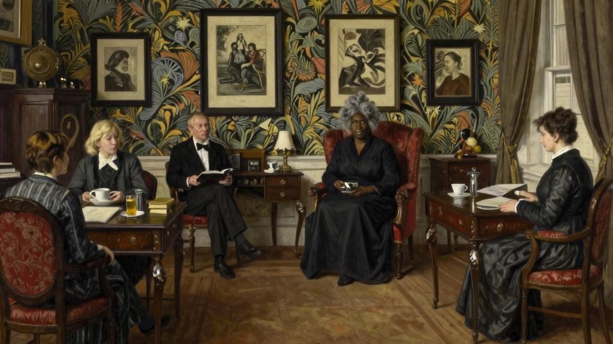
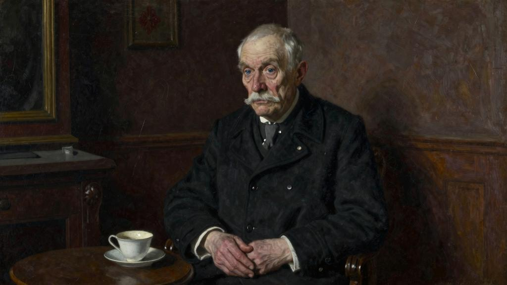
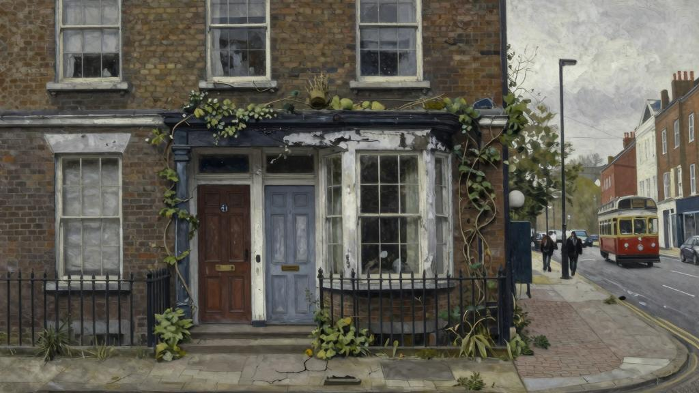
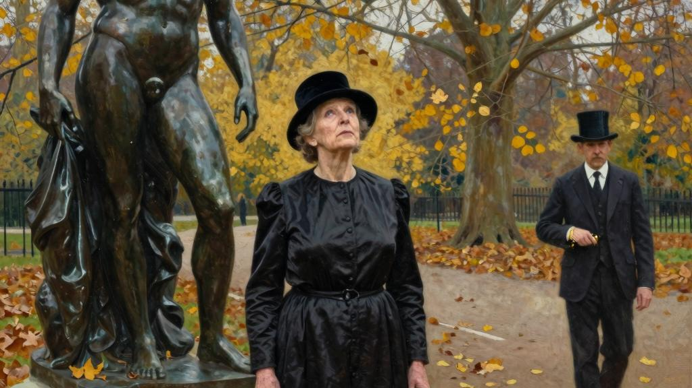

阿尔伯特·福里斯特夫人是怎么写出《喀琉斯雕像》的，我猜没有几个人知道。

既然它被誉为是当下最伟大的小说之一，想必所有认真研习文学的人都会对它的诞生历程感兴趣。诚如评论家们所言，如果这是一部传世之作，那么以下叙述就不只是供读者消遣，它还有一个更好的用途，那就是历史学家们会当它是当代文学史的一个有趣脚注。

该书出版时的轰动想必每个人都还历历在目。一连好几个月，印刷机和装订工都没闲下来；英美的出版商他们，即便是昼夜不歇，也难以完成各大书店的加急订单。很快，《喀琉斯雕像》的欧洲各国语言译本纷纷问世，最近还传出消息，说要不了多久就能读到日语和乌尔都语译本了。不过，该书此前就已经在大西洋两岸的一些杂志上连载过，而从这些杂志主编那里，尔伯特·福里斯特夫人的代理商为其谋得的稿酬可以说是相当可观。它还一度被改编成戏剧，在纽约上演了整整一个季度，毫无疑问，要是搬到伦敦，它也一样能大获成功，座无虚席。此外，它的电影改编权也以天价售出。关于这本书为尔伯特·福里斯特（在文学圈里）赚了多少钱的传言或许有些夸大，但这笔钱足以让她下半辈子衣食无忧，这一点是毋庸置疑的。

很少有书能受到公众和文学评论家的一致赞誉。而在所有人中，只有她能画方为圆（如果我能这么说的话），这对于她本人来说，必是春风得意之事。自此，虽然她在文学评论界颇受赞赏（事实上她本人也认为这是实至名归），但公众对她的作品竟出奇的冷淡。她出版的每部作品都印刷精美，并用白色的麻布装订成薄薄的一小册。书评家他们常常用整个专栏对其大加赞赏，将其誉为经典；在年代久远的俱乐部里，你甚至还能在那尘封的图书馆中扒出这些作品的周刊评论，其篇幅之长可达一整页；所有的文人学者读完后也都赞赏有加，但显然，他们不会去买，因此，她的书的销量一直惨淡。而一个蜚声文坛、想象细腻、文风清美的作家，竟一直被大众忽视，这说起来确实有些难堪。可以说，她在美国几乎就是一个默默无闻的存在，虽然美国小说卡尔·范维钦先生

曾写过一篇文章痛斥公众的无知愚昧，但大家依旧是无动于衷。她的经纪人极度崇拜她的写作天分，曾要挟一位美国出版商出版尔伯特·福里斯特夫人写的两本书（自然是粗制滥造的），否则就拒绝授权那几本他真正想出的书。这么一来，那两本书也就顺理成章地出版了。媒体对她一直吹捧赞誉，这也表明在美国，精英他们能敏锐地察觉到她的天分。但在向那位美国出版商强推她写的三本书的时候，这位出版商她的经纪人（以出版商他们一贯的粗鄙态度）说，要有这个闲钱，他还不如去买配制酒[16]呢！

也就是在《喀琉斯雕像》畅销后，尔伯特·福里斯特夫人此前写的书得以再版（而卡尔·范维钦先生在他的另一篇文章中说道，早在十五年前他就提醒读者去好好关注这位名不见经传的作家，他说这话时，既为作者多年的埋没而深感遗憾，同时也为自己慧眼识珠而自豪），而这些书的宣传力度之大，以至于任何一个受过教育的人都免不了要读一读。因此，实在没必要再介绍一下这些书了。而且，经过卡尔·范维钦先生写的这两篇精湛的文章，我再赘述就变得索然无味了。尔伯特·福里斯特夫人很早就开始创作，她的第一部作品（一卷挽诗集）问世时，她不过还是个十八岁的少女。而后，她每两年或三年才出一本诗集或散文集，因为她对自己的艺术构想总是精益求精，所以很难追求产量。当《喀琉斯雕像》成形的时候，她已经五十七岁了，算得上是德高望重的年龄了，这时候要是去估算她的作品数量，想必是相当可观的。她留给这个世界六部诗集，都以拉丁文标题出版，像《幸福》、《和平之海》和《三重铜甲》，都是比较严肃的那种。因为她的缪斯不愿轻佻起舞，只想迈出庄严的步伐。她对挽诗情有独钟，也花了不少心思在十四行诗上，但主要成就还是使颂诗这种在当时不被重视的诗歌体裁重现异彩。或许我们也可以毫不含糊地断定，她的《总统法利埃颂歌》在每本英文诗集中都能占有一席之地。而这首诗之所以能备受推崇，不仅在于它那高昂响亮的韵律，还在于恰如其分地描绘了法兰西大地一派祥和愉悦的景象。尔伯特·福里斯特夫人写了卢瓦尔河谷，其中还穿插了杜·倍雷的回忆，写了沙特尔大教堂以及那镶嵌珠宝的彩色玻璃，写了阳光照耀下的普罗旺斯。在描绘这些景象的时候，她竟惊人地感同身受。要知道，除了婚后乘坐邮轮短暂地游历过布伦，她从未深入探索过法国这片土地。不过，极度晕船的生理戕害以及心智上所蒙受的屈辱——她发现在这座人气海滨度假胜地，当地居民竟听不懂她那流利地道的法语，使她坚决不想再有这般狼狈不悦的体验了。自

此，她从未在危险重重的海上航行过，不过在《和平之海》中，她还是用了大量或悲沉抑郁或轻快甜美的语言来颂扬大海。

在《伍德罗·威尔逊颂歌》中，也有一些相当精妙的段落，然而遗憾的是，尔伯特·福里斯特夫人对这一无可争议的杰出人物发生了一些情感变化，使她决定不再重印它。但我认为，她最优秀的作品一定还是散文。她写过几卷散文，虽精炼简短，但都匠心独运、构思巧妙，内容涉及苏塞克斯郡的秋天、维多利亚女王、死亡、诺福克郡的春天、乔治王朝时代的建筑之风、佳吉列夫先生以及但丁。她还描写过十七世纪的耶稣会建筑，引导我们从文学角度审视英法百年战争，这些专著无一不展现了她的博学多识和才思敏捷。也正是散文为她赢得了一批忠实的拥趸者——虽然为数不多，但个个都是伯乐（尔伯特·福里斯特夫人曾如是评论，可见其在遣词造句上的极高天分），他们宣称尔伯特·福里斯特夫人当属本世纪以来在英语方面的泰斗级人物。她本人也承认自己最出彩的地方是写作风格，浑厚高亢而又不失生动活泼，精巧优美而又雄辩有力。

她那只有在散文中偶尔显露的绝妙而又内敛的幽默感，常常让读者他们欲罢不能。而这种幽默不仅是见解上的幽默，也不只是措辞上的幽默，那是一种更妙不可言的幽默——是一种通过标点符号表达的幽默。往往在灵感乍现的瞬间，她感知到了分号的戏剧效果，于是拿它大做文章，可以说是尽臻其妙。如果你是一个有文化且幽默感十足的人，见到这种标点符号的用法，虽不会像套着马颈轭[17]一般咧嘴大笑，但肯定能让你咯咯笑，而且文化程度越高，你就越发咯咯笑个不停。她的友人曾说，这种幽默使其他所有的幽默形式都显得粗俗夸张。也有几位作家试图模仿她，但都以失败告终。不论你对尔伯特·福里斯特夫人做出何种评论，你都得承认她能将分号里每一盎司的幽默感都发挥殆尽，在这一点上，任何人都是望尘莫及的。

尔伯特·福里斯特夫人住在大理石拱门附近的一所公寓，地段良好，租金也不算贵。朝街方向有一个体面的会客厅，每周二下午，尔伯特·福里斯特夫人都会在那个漂亮的会客厅招待友人。那间宽敞的卧室是她自己用的，房子另一头是光线幽暗的餐厅，而厨房隔壁那个狭小的房间是尔伯特·福里斯特先生的，他也正是那个掏房租的人。这是一所简朴素净的公寓，壁纸是英国画家威廉·莫里斯本人设计的，墙上挂着的黑色画框装着美柔汀版画，这些都是在它们升值之前收藏起来的；家具多是齐本德尔时

期的，只有那张她用来创作的书桌，隐约是路易十六时期的风格。每每游客前来观赏，都会先给他们介绍这张书桌，这时绝大多数人都会深情动容地注视着它。地毯厚重，光线幽暗，尔伯特·福里斯特夫人就坐在那张红色锦织包面的直背扶椅中。这张椅子倒也没什么特殊之处，但它是房间里唯一一张坐着舒服的椅子，所以仅凭这一点就使尔伯特·福里斯特夫人和她的客人与众不同，衬托得她高高在上。上茶的是一位年龄不明的妇人，她沉默寡言、不苟言笑，虽从未被尔伯特·福里斯特夫人引荐给客人过，但她深知，能替尔伯特·福里斯特夫人做端茶倒水这种乏味的累活儿是莫大的荣幸。这样一来，尔伯特·福里斯特夫人就能全身心投入到谈话中——还真得承认，她的谈话还挺精彩。虽说不上是轻快，而且在口头表达的时候因为不能使用标点符号，听上去也缺少点幽默感，但话题广泛、论证有力、发人深思且生动有趣。尔伯特·福里斯特夫人熟知社会科学、法学和神学。她博闻强记，也难怪有旁征博引这种天赋，而这种天赋也能最为有效地弥补智力的欠缺。三十年来，她与很多社会名流都相交甚好，因此谈话时总能引出不少关于他们的逸闻趣事。当然，讲述这些趣事的时机她拿捏得很得当，即便是重复地讲上几遍，也不会引来当事人的责怪。尔伯特·福里斯特夫人的交际天分很高，总能结交到形形色色的朋友，甚至还能在她的会客厅内同时招待前首相、报社老板以及一流国家的大使。我常想这些大人物之所以挤在这小小会客厅内，就是因为他们能在这儿接触到放荡不羁的文化人，而且这些人相当整洁干净，不至于弄得他们灰头土脸。她还热衷于政治，我曾亲耳听到内阁首相对她直言相告，说她具有男人的心智。她曾一度反对女性选举权，而当女性最终赢得选举权时，她又动了心思，想进国会了。可难就难在，她不知道该加入哪个政党。

她耸了耸那有点宽的肩膀，略带戏谑地说道：“我总不能建一个人的党吧。”

就像很多严肃的爱国者一样，在没有摸清楚形势以前，她不会表明自己的政治观点。不过最近，她显然明确倒向了工党，认为它是国家的希望所在。如果在工党内有稳当席位，她肯定会毫不犹豫地站出来，为备受压迫的工人阶级摇旗呐喊。

她的会客厅对外国人一向是敞开的，只要是有点知名度的，不管是捷克斯洛伐克人、意大利人还是法国人，她都来者不拒；她也欢迎美国人，哪怕是个名不见经传的小

人物。但她并不势利，你很少在她那里碰到某位公爵，除非这位公爵品行端正，你也很少在她那里碰到贵妇人，除非这贵妇人除了有地位，还有一些无关痛痒的过失，比如说离过婚、写过书、伪造过支票，这些都能变成通行证，唤起尔伯特·福里斯特夫人的天主教同情心。她不太喜欢画家，因为他们太腼腆、太沉默了；她对音乐家也没什么兴趣，因为他们但凡有点名气，都是推三阻四的，即便是答应演出，反倒又妨碍谈话了。

人们要真想听点音乐，大可以去音乐厅；她偏爱更为细腻的音乐，这种音乐能荡涤心灵。她对作家——尤其是有潜质而眼下却默默无闻的作家，总是那么热情殷切。她生就一双慧眼，总能捕捉到那些刚刚崭露头角的才子，在那些与她经常喝茶的知名作家里，大都是在她的鼓励和指引下做出第一次尝试、迈出第一步的。在文学界，她的地位无可撼动，因此不会对谁心生艳羡，她也频频听到别人称自己为天才，即便是其他作家依靠才华取得了她所没有的物质上的成功时，她也不会有一丝嫉妒。

尔伯特·福里斯特夫人相信后世自有公正的评价，因此她将名利置之度外。具备了这些品质，也难怪她能创造出这个野蛮民族从未有过的文化，让它无比接近十八世纪的法国沙龙。没有几个人不认为，在周二受邀去她家吃点心、喝茶是无比荣幸的。当你置身于这个幽暗简朴的房间内，坐在那张齐本德尔式靠椅上时，你一定会感觉自己正经历着一段文学史。美国大使曾这样对尔伯特·福里斯特夫人说：

“尔伯特·福里斯特夫人，与你喝上一杯茶，是我们这类人最富足的精神享受之一。”不过这有时候有点过犹不及。尔伯特·福里斯特夫人的品位太完美，凡是正确的她总免不了好好欣赏一番，然后做出公允的评论，会让人听得喘不上气。而我呢，在加入她那高格调的社交聚会之前，则需要喝上一两杯鸡尾酒来壮胆。确实，我差点被永远逐出这个聚会了——因为有天下午，我本应该问那个给我开门的女仆：“尔伯特·福里斯特夫人在家吗？”结果说成了：“今天有礼拜吗？”

这当然是一句无心之语，可不幸的是，女仆咯咯地笑了起来，尔伯特·福里斯特夫人最忠实的崇拜者之一艾伦·汉娜薇也恰好在门厅脱高筒套靴，于是她把这句话转述给了女主人，当我走进会客厅的时候，尔伯特·福里斯特夫人便直勾勾地盯我。

“你为什么问今天这里是不是有礼拜？”尔伯特·福里斯特夫人问。

我解释说我刚才有点心不在焉，而她看我的眼神我只能说令人不安。

“你的意思是我的聚会……”她在脑海中搜索一个合适的词，“像圣礼？”

我不知道她到底什么意思，但我实在不想在那么多聪明的宾客面前暴露我的无知，于是决定拍她马屁。

“亲爱的尔伯特·福里斯特夫人，你的聚会正如你的人一样，极其美好和神圣。”

尔伯特·福里斯特夫人结实的身躯微微颤了一下，好比一个大男人突然闯入了一个摆满风信子的房间，浓郁的花香差点把他给熏倒。不过好在她也不那么咄咄逼人了。

“你要真是想打趣儿。”她说，“我倒希望你能在我的宾客面前开点玩笑，而不是当着我的女仆的面……沃伦会给你上茶的。”

尔伯特·福里斯特夫人挥了挥手，这才让我如释重负。但这事她并没有就此放过，在接下来的两三年里，每次将我介绍给别人时，都不忘说上一句：

“你可不能放过他，他到这儿就是来忏悔的。到我家门口的时候他总是要问上一句：这儿做礼拜吗？很搞笑，是不是？”但尔伯特·福里斯特夫人不光是每周搞一次下午茶聚，她还要在周六的时候举办一次八人规模的午宴：因为她认为八个人最适合共同交谈，而她的餐厅也最适合容纳八个人。而能够让她沾沾自喜的地方，不是她对诗歌独到的理解，而是她那出名的午宴。

客人都是经她精挑细选的，因此收到她的邀请不只是一种赞誉，更像是一种献祭。比起鱼龙混杂的下午茶聚会，在午宴餐桌上更容易维持高水准的谈话。因此每个人在离开尔伯特·福里斯特夫人的餐厅时，都会更加笃信她的才能，也对人性有了更光明的信仰。她只邀请男士。虽然她极力拥护女性，也很愿意在其他场合上与她们相处，但她发现在餐桌上时，女士他们更倾向于和自己的邻座交谈，这会妨碍人们共同交流。而她想让

自己的午宴不仅是肉体上的款待，更是灵魂上的享受。不得不说，尔伯特·福里斯特夫人总能为宾客奉上不可多得的食物、上乘的红酒和一流的雪茄。对那些接受过其他文学家款待的人来说，确实是非同一般了，因为大多数的文人墨客都是内心丰腴而生活清苦，他们忙于精神层面的求索，都意识不到羊肉没烤熟、土豆已经放凉了。啤酒倒是不错，但红酒太过提神，咖啡更是碰不得的。宾客他们对她提供的美食啧啧称赞，这让她很是欢喜。

“谁要是能赏脸和我一同进餐。”她说，“那我好歹要像模像样地款待他们，吃得至少得和家里一样好吧。”但如果赞誉过头了，她是拒不承认的。

“你的这番谬赞我可是愧不敢当啊。你要夸就夸布尔芬奇太太。”

“谁是夸布尔芬奇太太？”

“我的厨师。”

“那她可真是好手艺啊！可别告诉我这红酒也是出自她的手。”

“这酒还不错吧？我对这类事物是一窍不通的，所以就全权委托给我的供酒商了。”但要是提及雪茄，尔伯特·福里斯特夫人便会莞尔一笑。

“雪茄就要归功于尔伯特了，这都是他挑的。我总认为没有人比他更了解雪茄了。”

说罢，她看向了坐在餐桌另一头的丈夫。只见他那一双眼睛炯炯有神，透露着高傲，就像一只纯种母鸡（浅黄奥平敦鸡）骄傲地注视着它唯一的后代。很快，谈话里一片恭维之声，这些宾客总算是找到了一个合适的时机，于是大家都迫不及待地夸赞他独到的品位。

“你他们真是太客气了。”他说，“我很高兴你他们能喜欢这些雪茄。”

接下来，他会就雪茄展开一点论述，告诉我们他所追求的雪茄品质，感慨因为雪茄产业商业化导致的品质下降问题。尔伯特·福里斯特夫人一边听，一边露出满意的微笑。显然，她也很享受丈夫的这次小胜利。当然，不能没完没了地说雪茄，所以一旦觉察到宾客有不耐烦的迹象，她都会马上提出一个更宽泛的话题，而这个话题往往更有探讨价值也更有趣味性。这时，尔伯特先生重归沉默，但至少他已经出过风头了。

其实正是尔伯特先生让她的周六午宴比下午茶聚逊色了几分，因为他实在太无趣了。而尔伯特·福里斯特夫人显然意识到了这一点，但她就是要让丈夫加入这一聚会，为此把午宴时间定在了周六——尔伯特先生只有在周六才能抽出时间。因为她认为丈夫出席这些重要场合是对她的一种尊重，这份尊重就好比是他必须偿还给自己的一笔债。

她从未失口——承认自己嫁的男人跟自己的精神境界不相匹配——或许在夜深人静之际，她还会扪心自问，一个真正的灵魂伴侣是怎么找到的。尔伯特·福里斯特夫人的朋友他们倒是直言不讳，认为这样的女人竟为这样的丈夫所累，实在是可惜。他们（她的大多数朋友都信奉独身主义）互问，尔伯特·福里斯特夫人怎么就嫁给了他，最后只能绝望地归结为：娶嫁是夫妻俩的事，旁人看不明白。

尔伯特的无趣倒不是絮絮叨叨、极其刺耳的那种。他不会用一些没完没了的故事或不得要领的笑话纠缠你，让你不得清静；也不会用一些陈词滥调或者老生常谈的事儿来折磨你、让你不自在。他只是无聊透顶而已，只是无足轻重罢了。克里福德·博伊尔斯顿洞悉法国浪漫文学家的所有秘密，他自己也是个成就斐然的作家，他说如果你到尔伯特进去的房间一瞧，你会发现里面还是空无一人。尔伯特·福里斯特夫人的朋友他们认为这个调侃妙极了，其中有个叫罗茨·沃特福德的小说家，有些名气，也胆量过人，竟向尔伯特·福里斯特夫人转述了这句话。虽然尔伯特·福里斯特夫人佯装恼怒，却还是隐藏不住嘴角扬起一丝笑意。看到福里斯特夫人如此这般对待丈夫，他们对她的敬意更是有增无减。福里斯特夫人主张，无论朋友他们内心是如何看待自己丈夫的，他们对他都必须以礼相待。她自己就做得令人敬佩。如果他难得发言一次，福里斯特夫

人会面带笑意，仔细聆听；如果他帮她拿了本书或者递了一支笔给她，以便她记下一闪而过的灵感，她都会道一声感谢。尔伯特·福里斯特夫人也决不容许她的朋友他们故意冷落自己的丈夫。但作为一个讲究策略的女人，她知道如果自己出行时都有丈夫随行，外界是不太能接受的。所以她经常独自现身，但她的朋友他们心里清楚，她还是希望他们一年里能邀请自己的丈夫至少一次。当尔伯特·福里斯特夫人要演讲的时候，尔伯特先生总是会陪同她出席这类公众宴会；如果要讲座，她总要确保自己的丈夫在演讲台上有位置可坐。

在我看来，尔伯特中等身高，但或许是因为一看到他就能联想到他那身形魁梧的妻子，所以总觉得他个头小。也因为他体型瘦削，一副弱不禁风的样子，所以和他妻子一样，看上去有些显老。他总是把白发剪得很短，显得有些稀疏，蓄起的小白须也就只是胡茬而已。清瘦的脸庞，除了沟壑纵横，再找不出特别之处。一双蓝眼睛，也早已失去了往日神采，变得暗淡无光、呆滞无力。他一向穿戴齐整——同一个样式的芝麻呢裤子，配上黑色大衣，系上别了珍珠领带夹的灰色领带。因为他看上去实在太不起眼了，有时候站在会客厅里陪同尔伯特·福里斯特夫人接待应邀前来参加晚宴的宾客时，就像是一件安安静静、有绅士派头的家具。尔伯特举止得体，与宾客他们握手时，也都是面带微笑，随和谦恭。

“你好啊！你能来我真是太高兴了。”如果这些朋友是有些交情的，他就会这样问候他们：“最近怎么样，还不错吧？”但要是社会名流第一次来他家，他便会在门口候着，等他们进来的时候对他们说：

“我是尔伯特·福里斯特夫人的丈夫，我来带您见我太太。”

接着，他就带着这位宾客去见尔伯特·福里斯特夫人。只见她背对着光线，但一看到友人走近，便急切地迎上来，欣喜地欢迎他的到访。

在尔伯特·福里斯特夫人的文学名声大噪之际，尔伯特先生能发自肺腑地为太太感到自豪，也甘愿为了她的事业而退居其次，这可算作一段佳话。当需要的时候，他总能陪伴一侧，而不需要的时候，他也不会来凑热闹。这种审时度势的圆滑老练，如果不是苦心孤诣地刻意为之，那就一定是天性如此。尔伯特·福里斯特夫人最早察觉到了这一优点。

“如果没有他，我还真不知道该怎么办了。”尔伯特·福里斯特夫人这样说，“他对我来说就是无价之宝，我写的每篇东西，都要先读给他听一听，因为他的评价通常都很有参考价值。”

“就像莫里哀[18]和他的厨师一样。”沃特福德小姐调侃道。

“我亲爱的罗兹，这很好笑吗？”尔伯特·福里斯特夫人略带不悦地问道。

尔伯特·福里斯特夫人要是不赞成某一评论，就会反问一句，说是不是自己太愚钝，听不出来这话里的玩笑，令在场的许多人听得云里雾里的。但这一招对沃特福德小姐可不管用，这女人漫长的一生经历过多段恋情，不过唯一的激情还是倾注在了文字里。尔伯特·福里斯特夫人对她更多的是容忍而非赞赏。

“得啦，得啦，亲爱的。”她答道，“你心里其实清楚得很，没有你，他什么都不是，也不会认识我们。能结识这个时代最有头脑、最杰出的人，这对他来说是天大的运气。”

“没有安身立命的蜂房，蜜蜂可能确实很难活，但即便是这样，蜜蜂也有自己的价值。”虽然尔伯特·福里斯特夫人的朋友他们精通文学艺术，但对于自然科学几乎是一窍不通，因此对她的反驳也就不敢多加妄议了。于是她又继续说道：

“他从不打扰我，而且是本能地知道我什么时候不想被打扰。真的，当我文思泉涌的时候，他坐在那儿不但不会妨碍我，反而还能让我安心。”

“就像一只波斯猫。”沃特福德小姐评论道。

“是一只训练有素、血统高贵、教养十足的波斯猫。”尔伯特·福里斯特夫人郑重其事地纠正道，沃特福德小姐哑口无言。

关于自己的丈夫，尔伯特·福里斯特夫人还有话要说。

“我们都是知识分子。”她说，“知识分子总喜欢抽身事外，而且比起实实在在的事物，抽象的概念对我们来说更具有吸引力。有时候我觉得，我们总是以一种过于超脱的姿态去审视纷繁人世，也总是居高临下地看待世间万象。难道你他们不怕人性慢慢泯灭吗？我一直很感谢尔伯特，是他让我一直接触到普通大众。”

她这些话一如她的文字，精妙细微、见解精辟，在场没有一位能予以否认。因此，尔伯特在尔伯特·福里斯特夫人的密友圈内也被称为“普通人”。但这个称谓持续了一段时间后，就被抛弃了。他随后又成了“集邮家”。这个称谓可是克利福德·博伊尔斯顿那位鬼才为他量身定制的。有一天，他和尔伯特聊着天，正聊到搜肠刮肚、黔驴技穷之际，他问了一句：

“你收集邮票吗？”

“不收集。”尔伯特轻声回答，“我恐怕没有这个爱好。”但克利福德·博伊尔斯顿的问题一出口，就感觉尔伯特十有八九是集邮的。克利福德以对法国精神的详尽研究而知名，很大程度上承袭了法国人的敏捷和智慧，他写过一本关于波德莱尔妻子的姑母的小说，曾引起所有法国文学爱好者的关注。他无视尔伯特的否认，一有机会就告诉尔伯特·福里斯特夫人的朋友他们，说他总算发现了尔伯特的秘密——他喜欢集邮！之后，每次见到尔伯特他都要问：

“福里斯特先生，你的邮票收集得怎么样了？上回见面之后有没有买到什么新邮票啊？”

尔伯特一再否认也不管用，因为这个无中生有的捏造太形象了，必须要拿来做够文章。尔伯特·福里斯特夫人的朋友他们对此也坚信不疑，跟他搭话都是先打听他集邮的近况。甚至当尔伯特·福里斯特夫人兴致盎然的时候，也会打趣儿地称自己丈夫为“集邮家”。

这个称谓实在太贴切了，就像是为他定做的手套一般合适。有时他们会当面这么叫他，但他也只是一笑了之，丝毫不以为意，甚至不再澄清。这种好脾气，真是让人不得不欣赏。

当然，尔伯特·福里斯特夫人深谙社交门道，她是绝不会让声名显赫的宾客坐在丈夫身边的，因为她也担心破坏了午宴的氛围。她会特意安排自己的故友或者是密友坐在丈夫两边，而当这两个朋友被指派去做这份苦差事的时候，她会对他们说：

“你肯定不会介意坐在尔伯特旁边，对吧？”

这时候他们也只能说自己乐意至极。但要是他们的神色中流露出明显的沮丧，她就会笑着拍拍他们的手，补上一句：

“下次你坐我旁边。尔伯特一碰到陌生人就害羞，也只有你知道该怎么和他相处了。”

他们确实知道——只要忽视他就行了。在他们看来，他坐的这把椅子还不如空着好。其实仅凭尔伯特·福里斯特夫人的收入，绝对没法让宾客他们在春天吃上三文鱼，或者享用反季的芦笋。这些宾客他们吃着尔伯特掏钱买来的美食，却对他不理不睬，对此他竟没有表现出丝毫恼怒。他只是安静地坐在那儿，一言不发，如果开口说话，也只是指挥女佣人。如果客人初来乍到，他会认认真真打量他一番，要不是他目光单纯，对方甚至会觉得难堪。而打量别人的时候，尔伯特似乎在问自己，这是个怎么样的陌生人呢？经过一番审视后即便是有了什么答案，他也绝不会表露出来。随着谈兴渐浓，他的眼神会跟着说话人游走不停，但从那张清瘦、满是皱纹的脸上，你还是看不出他对这些餐桌上的奇思妙想持何种态度。

克利福德·博伊尔斯顿曾说过，所有的机敏和智慧也就是在尔伯特的脑子里逛了一圈，有如雁过无痕。他已经不打算听懂什么了，只是做个聆听的样子而已。但那位博学多才的评论家哈里·奥克兰却说，尔伯特实际上都听进去了，他觉得所有的谈话都妙不可言，所以也试着用他那愚钝、混乱的大脑努力弄懂他听到的这些奇谈怪论。到了城里，尔伯特肯定会跟人吹嘘自己认识的大人物，没准在他那个圈子里，他的学识还算是出色，还会被追捧为权威呢。要是能听一听他是怎么把我们在饭桌上说的话物尽其用的，那可真是妙不可言。哈里·奥克兰是尔伯特·福里斯特夫人忠实的崇拜者之一，他写过一篇颇具才气的文章，对她的写作风格有过一番精湛的评述。他五官精致，甚至可以说精美，像极了圣塞巴斯蒂安[19]。不过毛发出奇的旺盛，像是用生发剂用过了头。他还很年轻，三十岁都不到，却已经先后做过戏剧评论人、小说评论人、音乐评论人和绘画评论人。不过他现在对艺术有些腻烦了，所以他放言，未来要专心地在体育评论领域施展天分。

应该说明的是，尔伯特算是个城里人，不幸的是，尔伯特·福里斯特夫人的朋友他们都认为，她以非凡的克己精神包容了自己没钱的丈夫。如果尔伯特是个商界传奇，手握国家命脉，派遣出去的船只满载珍贵的香料驶向黎凡特的各个港口——这些港口名字洋味十足，够诗人大书特书的，要真是这样，那还是有些浪漫情调的。但他不过就是个醋栗商，所得收入只勉强能让妻子过上富足优渥的生活。因为他每天要在办公室待到六点，等他赶到妻子的周二下午茶聚会，一些重量级宾客都已经走了，会客厅里至多只有三四个尔伯特·福里斯特夫人的密友，他们畅所欲言，用诙谐的语言点评已经离场的宾客。当听到前门传来尔伯特拿钥匙开门的声音，他们便同时意识到时间已经不早了。片刻之后，尔伯特略带迟疑地推开了门，温和地朝屋内瞅瞅。这时，尔伯特·福里斯特夫人会用一个灿烂的微笑招呼他过来。

“进来，尔伯特，快进来。这些人想必你都已经认识了。”

于是，尔伯特走过去，与妻子的朋友他们一一握手。

“你刚从城里回来吧？”尔伯特·福里斯特夫人迫不及待地问道，虽然她心里清楚丈夫除了去城里哪儿都不会去的，“你要杯茶吗？”

“不了，不过谢谢你，亲爱的。我在办公室喝过了。”

尔伯特·福里斯特夫人还是笑容满面，在旁人看来，她和她丈夫还真是伉俪情深。

“这样啊，但我觉得你肯定还想再喝一杯，我来给你倒一杯吧。”

她走到茶几边，给丈夫倒了一杯茶后又在里面加了牛奶和糖，全然忘了这壶茶是一个半小时前煮的，现在已经凉透了。尔伯特接过茶杯说了声“谢谢”，然后温柔地搅了搅。但当尔伯特·福里斯特夫人继续刚才被丈夫打断的谈话时，尔伯特连尝都没尝就把茶杯轻轻放下了。事实上，他的到来是聚会告终的信号，剩下的客人很快一一散去。但有一回，谈话实在太尽兴了，所交流的议题意义重大，尔伯特·福里斯特夫人执意挽留要告辞的客人们。

“一定要把这个事说清楚。”她以几乎有些调皮的语气说道，“毕竟在这个问题上，尔伯特或许是有些想法的，我们不妨听听他的意见，或许能有点启发。”

那时候女士他们开始时兴剪短发，而大家正探讨的话题是尔伯特·福里斯特夫人应不应该剪一个盖瓦式短发。她是一个看上去颇威严的女士，骨架很大而且体形厚实。要不是人高马大的，你或许会觉得她是个肥胖的女人。她将这种粗犷豪放的体格驾驭得游刃有余。她的五官比常人略大一些，也正因为如此，她脸上流露出男人的英气和才气，而这些都是她骨子里就有的。她的皮肤很黑，会让你觉得她可能有黎凡特人的血统。她自己也承认她有吉普赛人的特质，这也解释了为什么她的诗歌有时候狂野放纵、激情澎湃。她那一双大眼睛乌黑发亮，鼻子像极了那位了不起的威灵顿公爵[20]，不过尔伯特·福里斯特夫人的更具肉感。她的下巴方方正正，透着刚毅果决。她的嘴也很大，但即便没有化妆品的装饰——尔伯特·福里斯特夫人也不屑于用这些玩意儿——双唇也一样丰满红润。而她那一头灰发又密又硬，高高地盘在头顶，更衬得她高高在上。从外表看来，她不仅咄咄逼人，甚至有些令人生畏。

她着装虽一向偏冷色调，但搭配得体，质感十足，举手投足之间都是女文人的模样。不过能看得出来，她也在慎重地追随潮流（她也是人，难免爱慕虚荣），衣裙长短剪裁得很时髦。我猜她一直都想剪个盖瓦式头，但又觉得，与其主动去剪头，不如应朋友之请去剪头来得有范。

“哦，你一定要剪，一定要剪。”哈里·奥克兰像个小男孩一样急切地说道，“绝对很漂亮。”

克利福德·博伊尔斯顿却有些迟疑，他最近在写一本关于路易十四的情妇曼特农夫人的书，觉得这个尝试有些冒险。

“我认为。”他一边用一块细纺手绢擦着他的眼睛，一边说，“人一旦有了自己的风格，就要始终如一，要是路易十六不戴假发，会成什么样子？”

“我也很犹豫。”尔伯特·福里斯特夫人答道，“但我们终归得跟上时代。我是活在当下的，可不想落伍。就像威廉·迈斯特说的，所谓的美国式自由，就是活在此时此地。”她兴冲冲地转过头问尔伯特：“我的先生有没有什么想说的呢？你意下如何，尔伯特？‘盖瓦’还是‘不盖瓦’，这是个问题[21]。”

“恐怕我的意见无足轻重吧，亲爱的。”尔伯特谦逊地回答。

“不，对我来说，你的意见可太重要了。”尔伯特·福里斯特夫人有些讨好似的说。

她心里明白，朋友他们都看得出来，她对待这位“集邮家”已经做到了无可挑剔。

“你一定要说。”她继续说道，“我就想知道你怎么想的，没有人比你更懂我了，尔伯特，这个发型到底适不适合我？”

“或许吧。”他回答，“我就是担心，你的身材跟雕像一样魁梧，剪了短发会不会让人想起——这么说吧，让人想起萨福尽情歌颂和热爱的希腊岛。”

一刹那气氛变得尴尬，大家都怔住了。罗慈·沃特福德强忍着不笑，但其他人就像石化了一般默不作声。尔伯特·福里斯特夫人的笑脸也十分僵硬。显然，尔伯特失言了。

“我一直觉得拜伦的诗稀松平常。”尔伯特·福里斯特夫人终于说了句话。

聚会结束了。尔伯特·福里斯特夫人没有剪盖瓦头，事实上也没有人再提起这个话题。

在另一个周二下午茶聚会接近尾声的时候，发生了一件事，对尔伯特·福里斯特夫人的文学生涯产生了重大的影响。

那是她办得最成功的一次聚会，当时工党领袖也现身了，而尔伯特·福里斯特夫人竭尽所能地暗示她自己有意投身贵党，就差直截了当地说出来了。时机已经成熟，如果她真的想要从政，现在就得做出决定。克利福德·博伊尔斯顿带了一位法兰西学院的院士过来，明知对方一点都不懂英文，听到他这样谦恭地夸赞自己华美却不失清雅的文风，心中还是感到欣慰。美国大使也来了，还有那位俄国大公，要不是那纯正的罗曼诺夫血统，别人还以为他是个舞男呢。一位刚刚离了婚就下嫁给赛马骑师的公爵夫人，看上去还是那么雍容贵气，发冠上佩戴的草莓叶[22]虽有些枯黄，倒为此次聚会增添了一番风味。这儿本是文坛巨星荟萃，但现在其他人都散了，只剩下克利福德·博伊尔斯顿、哈里·奥克兰、罗斯·沃特福德、奥斯卡·查尔斯河西蒙斯。奥斯卡·查尔斯是个个头小得像侏儒一样的男人。他年纪不大，戴着一副金边眼镜，看上去像猴子一样精明。他在政府里谋职，闲暇时从事文学，给《六便士周报》写点小文章。他愤世嫉俗，对这个世界充满了鄙夷。但尔伯特·福里斯特夫人很喜欢他，觉得他颇具才华。查尔斯虽一直对她的文风表示由衷赞赏（但事实上就是他给尔伯特·福里斯特夫人起了个“分号师太”的外号），但他对什么都要抨击一番，因而就连女主人也惧他三分。西蒙斯是他的经纪人，脸圆圆的，架着一副眼镜，因为眼睛度数太高了，所以那一双眼睛好似变形一般，让你想起水族馆里某些粗蛮原始的甲壳类生物。他会定期出席尔伯特·福里斯特夫人的聚会，一方面是他对女主人的文学天分推崇备至，另一方面也是因为在她的会客厅里很容易结识到潜在客户。

西蒙斯为尔伯特·福里斯特夫人鞍前马后地效劳了很多年，但报酬微薄。因此女主人一点也不介意牵线搭桥，让他正经赚点钱。遇上有文学作品要出手的客人，她会把他们郑重推荐给西蒙斯，而且带着发自内心的感激。圣斯维金夫人那本粗制滥造但获利颇丰的回忆录最早就在她的会客厅里敲定的，每想起此事她就不免沾沾自喜。

所有人围坐在尔伯特·福里斯特夫人身旁，愉快地——但不得不承认，也有些恶毒地——谈论着当天在场的各路宾客。沃伦小姐的脸色看上去有些苍白，她在茶桌端茶递水已经两个小时，一直在房间里轻轻地走来走去，收拾客人四处留下的茶杯。她好像有一份正式工作，但总能抽空过来为尔伯特·福里斯特夫人端茶倒水，晚上帮她把手稿打出来。尔伯特·福里斯特夫人没有给她开工资，甚至还理所当然地认为，她为这个可怜的女人做了不少事呢。但她会把别人寄给她的免费电影票送给沃伦小姐，还经常把自己不穿的衣物送她。

女主人的声音低沉饱满，侃侃而谈，其他人都聚精会神地听着。她现在状态很好，可以说做到了妙语如珠，出口成章。突然，廊道里“哐啷”一声，好像有什么东西摔到地上了，紧接着传来一阵争执声。

尔伯特·福里斯特夫人停了下来，高贵的眉头微微蹙起，看上去有些不快。

“我是不允许这种要命的喧声出现在我公寓里的，我还以为他们知道呢。沃伦小姐，能劳烦你摇一下铃，问一下这闹声是怎么回事吗？”

沃伦小姐摇铃后，很快就有女仆过来了。为了不打扰到尔伯特·福里斯特夫人，沃伦小姐站在门边压着嗓音问女仆话。但尔伯特·福里斯特夫人还是停下不说了，似乎有些气恼。

“行了，卡特，到底怎么回事？是房子要倒了还是红色革命终于爆发了？”

“请你原谅，夫人，是那个新厨师的箱子。”女仆回答，“搬运工在拿进来的时候掉地上了，厨师气得不行。”

“你说的‘新厨师’是什么意思？”

“夫人，布尔芬奇太太今天下午走了。”女仆答道。

尔伯特·福里斯特夫人直勾勾地盯着她。

“我才知道这事，布尔芬奇太太之前有打过招呼吗？福里斯特先生回来就告诉他，我有话和他说。”

“好的，夫人。”

女仆退下了，沃伦小姐也静静地回到了茶桌边。虽然没人要喝茶，但她还是很机械地倒上了几杯茶。

“这真是飞来横祸！”沃特福德小姐惊呼着。

“你一定要把她请回来。”克利福德·博伊尔斯顿说着，“那女人的厨艺可了不得，是个宝贝，而且每天都有进步。”

这时，女仆端着一个放了一封信的小托盘走了进来，然后将信递给女主人。

“这是什么？”尔伯特·福里斯特夫人问她。

“福里斯特先生交代我，如果你找他，就把这封信给你。”女仆说道。

“那福里斯特先生人呢。”

“他走了，夫人。”女仆答道，对这个问题显然感到意外。

“走了？那没事了，你下去吧。”

女仆走出了房间。尔伯特·福里斯特夫人那宽大的脸庞满是疑惑，而后打开了信封。罗斯·沃特福德小姐告诉我，她一开始还以为因为厨师的不辞而别，尔伯特怕太

太怪罪他，所以先投泰晤士河了呢。哪知尔伯特·福里斯特夫人读完信后，脸上升起一股怒气。

“天呐，这太荒唐了。”她惊呼道，“太荒唐了！真是荒唐至极！”

“发生什么了，福里斯特夫人？”

尔伯特·福里斯特夫人跺着地毯，像一匹亢奋刚性的烈马来回蹭着地，双手交叉在胸前，那姿势很难描述（泼妇开始打街骂巷的时候你能看到这种阵势），怒视着那些惊讶而又慌乱的宾客。

“尔伯特和那个厨师私奔了。”

大家错愕地吸了口气。接着发生了一件令人惊骇的一幕——站在茶桌后边的沃伦小姐突然失控了。这沃伦小姐向来一言不发，从来没有人和她搭过话。三年来虽然每周必在，到了街上也不一定有人认得她。就是这位沃伦小姐突然按捺不住，放声大笑起来。在场的客人们就好像以色列先知巴兰听到他的驴子开口说话了一样，惊惶失措，竟不约而同地转过头去盯着她看。沃伦小姐确实扯着嗓子在笑，这幅场景有种难以名状的恐怖，就好像突然发生了某种异象，客人们惊慌失措，就跟看到周围的桌椅开始毫无征兆地跳着滑稽舞一样。沃伦小姐也不想笑了，但越是想停下来，越是笑得浑身战栗，最后只能抓起一块手绢塞进自己嘴里，冲出了房间。门“砰”的一声关上了。

“疯了。”克利福德·博伊尔顿说道。

“完全是个疯子，肯定是。”哈里·奥克兰附和道。但尔伯特·福里斯特夫人却一言不发。

那封信已经落到了她脚边。她的经纪人西蒙斯捡了起来，要递给她，但她没有接过来。

“读出来。”尔伯特·福里斯特夫人说道，“大声地读出来。”

西蒙斯先生向上推了推眼镜，把信凑得离眼睛很近，然后读了起来。

亲爱的：布尔芬奇太太想换换环境，决定离开。没有她我也不愿留下，所以准备走了。我实在受够了文学，不想再受艺术熏陶了。

她不在意结不结婚，但如果你不介意和我离婚的话，她愿意嫁给我。我希望你能喜欢这位新厨师，前雇主他们的介绍信对她评价都很高。为方便你找到我们，给你留下我们的地址：伦敦东南坎宁顿大街411号。

尔伯特没人敢吱一声。西蒙斯先生又把金边眼镜推到鼻梁上。事实是，这些人平日里才智过人，每个场合都不缺乏适宜的话题，但眼下，没有一个人想得出一句恰当的话。尔伯特·福里斯特夫人是不会接受别人怜悯的，因此每个人都不敢以身犯险，生怕说的话缺乏新意而被人笑话。最后还是克利福德·博伊尔顿壮着胆子站出来救场。

“我们都不知道该说些什么。”他说。

又是一阵沉默。接着罗斯·沃特福德开口了。

“布尔芬奇太太长什么样啊？”她问道。

“我怎么知道。”尔伯特·福里斯特夫人有些气恼，“我从来没正眼看过她，都是尔伯特在打理下人的事，当时也就是让我看看人顺不顺眼。”

“但你每天早上料理家务的时候肯定见过她吧？”

“都是尔伯特在料理家务，这也是他自愿的，这样一来我就能全身心投入工作了。人生在世，哪能事事亲力亲为？”

“你的午宴也是尔伯特替你安排的？”克利福德·博伊尔顿问道。

“当然了，都是他一手包办的。”

克利福德·博伊尔顿微微地扬了扬眉。原来尔伯特·福里斯特夫人的美味佳肴都要归功于尔伯特，而大家从来没有想到这一点，真是失策啊！当然，那些口感上乘的夏布利酒也是得益于尔伯特，才能冰镇得恰到好处，入口凉爽但又不失醇香和风味。

“他的确知道怎么弄到好酒好菜。”

“我一直告诉你他们，他有他的长处。”尔伯特·福里斯特夫人答道，就好像有人正在指责她一样，“你他们一直都笑话他。我告诉过你他们，我有不少事都是靠他的，你他们还不信。”

大家都默不作声，会客厅又陷入了沉闷可怕的寂静之中。突然，西蒙斯先生甩出了一颗炸弹。

“你一定要把他找回来。”

尔伯特·福里斯特夫人听后大吃一惊，要不是她倚着壁炉，肯定要向后踉跄好几步。

“你究竟在瞎说什么呢？”她惊呼道，“我这辈子都不会再见他的。让我挽留他？想都别想！即便是他回来跟我跪地求饶，我也决不心软。”

“我的意思不是‘挽留他’，而是把他找回来。”

这话插得不是时候，尔伯特·福里斯特夫人根本就没听到。

“我为他什么事都做了，要是没有我，我问你他们，他算什么？我给他的地位，他连做梦都梦不到。”

谁都不能否认，尔伯特·福里斯特夫人义愤填膺的时候也是非同寻常的。但西蒙斯先生似乎浑然不觉。

“你以后靠什么生活呢？”

尔伯特·福里斯特夫人听后，毫不留情地白了他一眼。

“上帝自会关照我。”她冷冰冰地回答。

“我想这不太可能吧。”西蒙斯先生回敬道。

尔伯特·福里斯特夫人怒火满腔地耸了耸肩。但西蒙斯先生此时换了个坐姿，舒舒服服坐在椅子里，然后点上了一支烟。

“你要知道，没人比本人更欣赏你的艺术了。”他说道。

“是比‘我’。”克利福德·博伊尔顿纠正了他。

“或者是比‘你’。”西蒙斯先生不予理会，继续说道，“我们都认同，当下没有谁的文笔能跟你相比，不论是散文还是诗歌，你绝对是一流的。还有你的文风——这不用多说，大家都是有目共睹的。”

“有着托马斯·布朗爵士的华美，枢机主教纽曼的畅达。”克利福德·博伊尔斯顿说道，“加上约翰·德莱顿的犀利和乔纳森·斯威夫特的尖锐。”

尔伯特·福里斯特夫人那暗含忧伤的嘴角挤出一丝短暂的苦笑，只有这能表明她还在听。

“还有你的幽默感。”

“莫非世上还有其他人。”沃特福德小姐叹道，“能在这一个分号里融入充满才智、讽刺和幽默的见解？”

“但事实是，你的书一直不好卖。”西蒙斯先生面不改色地继续说道，“我经销你的作品二十多年了，坦白说，靠抽取佣金我是发不了家的。但我还在帮你打理，因为有时候我喜欢为好作品尽点绵薄之力。我一直对你有信心，也希望你能在什么时候获得大众的青睐。但如果你以后要靠写这类作品谋生，我敢打包票，你一点机会都没有。”

“我是生不逢时啊。”尔伯特·福里斯特夫人叹道，“我应该出生在十八世纪，那时候阔绰的赞助人会为一句献词花一百基尼。”

“你估计他的醋栗生意能赚多少钱呢？”

尔伯特·福里斯特夫人轻轻地叹了口气。

“也没挣几个钱，尔伯特一直告诉我，他一年大概也就挣一千二百镑。”

“那他一定很会理财。不过，你别想能靠你自己的收入过上好日子了。听我一句劝，你现在能做的就是把他找回来。”

“那我宁可住阁楼。你觉得他这般羞辱我，我还能对他卑躬屈膝？你不会想让我和一个厨子争风吃醋吧？你难道忘了，对于我们这样的女性来说，尊严可比养尊处优重要多了。”

“我正要说尊严呢。”西蒙斯先生冷冷地说道。

他扫了大伙儿一眼，那双歪斜怪异的眼睛此时更加吓人了，像极了往外鼓的鱼眼睛。

“毫无疑问，我一直认为。”他继续说道，“你在文坛是响当当的人物，也保持着独一无二的地位。你代表的是一些另类。你是断不会为了几个臭铜板而出卖自己的才情的，也一直为了纯粹的艺术而呐喊呼吁。我知道你正想进议会。我自己虽然对政治不太感兴趣，但不能否认这是一个很好的宣传。要是你能成功，我们绝对能借势为你弄一场

美国巡回演讲。你是一个有理想的人，我敢说，即便是从未接触过你作品的人也会对你顶礼膜拜。但以你的地位来说，有一件事你是输不起的——那就是成为一个笑柄。”

尔伯特·福里斯特夫人坐直了身子。

“你说这话到底是什么意思？”

“我对布尔芬奇太太一无所知，但就我所知，她是个挺正派的女人。但要是一个男人带着厨师私奔了，他老婆会贻笑大方，这是肯定的。如果对方是个舞女，或者是位贵太太，那我敢说，这对你造成不了什么伤害，但她要是个厨子，你就真的完了。不出一周你就会成为整个伦敦的笑柄。如果说有什么能让作家或者政客一击致命的，那就是这种嘲笑。你一定要把你丈夫找回来，而且要赶紧找回来。”

尔伯特·福里斯特夫人的脸顿时阴沉下来，她没有马上作答。但她的耳边突然响起了沃伦小姐冲出房门时那疯狂诡异的笑声。

“在座的都是你的朋友，你大可放心，我们不会对外声张的。”

尔伯特·福里斯特夫人看了看她的朋友他们，觉得罗斯·沃特福德小姐眼里已经有了不怀好意的笑容，查尔斯那张干巴巴的脸则神思恍惚。她真希望刚才情绪失控的时候，还没把秘密抖出来。西蒙斯对文坛了如指掌，他的目光落在了这些宾客身上。

“毕竟在座的都以你为中心，对你马首是瞻。你的丈夫不仅背叛了你，也背叛了他们，这对他们来说也不光彩。事实上尔伯特·福里斯特把我们所有人都耍了。”

“所有人。”克利福德·博伊尔斯顿附和道，“我们都是一条船上的。他说得很对，福里斯特夫人，你一定得把这个‘集邮家’找回来。”

“连你也，布鲁图[23]。”尔伯特·福里斯特夫人用拉丁语感叹道。

西蒙斯先生不懂拉丁语，但即便真懂一点，恐怕也不为所动。他清了清嗓子。

“我建议尔伯特·福里斯特夫人明天就去见他，好在我们有他的地址，到时候就恳请他再考虑一下这个决定。我不知道一个女人在这种场面上应该要说什么，但福里斯特夫人足智多谋，充满想象力，她肯定知道要说什么。如果福里斯特先生开了什么条件，那她一定要全盘接受，一定要想尽办法把他弄回来。”

“你要是能把这手牌打好了，明天晚上没有理由弄不回他。”罗斯·沃特福德说得很轻巧。

“你会这么做吗？福里斯特夫人。”

盯着他们看了至少两分钟后，她将头别了过去，凝视着空荡荡的壁炉，接着，她面向他们坐直了身子。

“我是为了我的艺术生涯考虑，不是为了我自己。我不允许那些粗俗的流言蜚语玷污我所坚守的真善美。”

“好极了！”西蒙斯先生高兴地跳了起来，“明天回家我会顺道过来看看，到时候希望能看到你他们俩夫妻如胶似漆。”

说完他就告辞了。其他人都怕跟情绪激动的尔伯特·福里斯特夫人独处，也都一窝蜂地散了。

尔伯特·福里斯特夫人下午走出公寓的时候已经很晚了。她穿着一条黑色丝绸裙，戴着一顶丝绒无边女帽，看上去气度不凡。她要到大理石拱门坐公车去维多利亚车站。西蒙斯先生先前已经在电话里详细说明了一条去坎宁顿大街的路线，既便捷又省钱。她不觉得自己是妖妇黛利拉，看上去也不像。在维多利亚车站，她搭上了一辆驶往沃克斯霍尔桥大街的电车。电车过桥的时候，她发现自己身处的伦敦，比以往所熟悉的更嘈杂、更脏乱，也更熙攘，但此刻她心事太多了，无暇顾及这喧嚣的街景。当电车开到了坎宁顿大街的时候，她总算松了一口气，于是让司机在她要找的那栋房子附近停下来。下了车后，电车轰鸣着向前开去，只剩下她一人站在这喧闹的大街上，这种奇怪的感觉就像是迷了路，好比在东方传奇故事里，一位旅人被神灵丢弃在一座未知的城市

里。她慢慢地走着，不时地左顾右盼。此刻，她那丰满的胸腔虽然充满了愤怒和窘迫，但她还是本能地认为，眼前的景象正适合写一篇精美的散文。街边林立的小房子呈现出一种旧时气息，那时这里几乎还是乡村。尔伯特·福里斯特夫人在她海量的记忆里加了一条标注——回去以后一定要查一查关于坎宁顿大街的相关典故。411号坐落在一排老旧的屋子里，离街边还有一点距离。屋前有一片杂草，一条砌砖小径通向油漆斑驳的木格门廊。房子前面的墙上爬满了藤蔓，稀稀落落的，看上去有些枯槁，再加上刚才的门廊，使这房子的乡村气息显得虚幻不实，特别是在车水马龙、鸣笛声不断的街边，更显得诡异阴森。这栋房子总有些暧昧不明之处，好像里面住了一位女子，整日寻欢作乐，但依旧填补不了内心的空虚。

门开了，里面走出来一个十五岁左右瘦骨嶙峋的小女孩，两腿细长，头发也乱糟糟的。

“布尔芬奇太太是住在这儿吗？”

“你按错门铃了，她住在二楼。”女孩一边指了指楼梯一边大声喊道，“布尔芬奇太太，有人找你，布尔芬奇太太。”

尔伯特·福里斯特夫人踩着破烂的地毯走上了阴暗的楼梯。因为不想让自己一会儿气喘吁吁的，所以她走得很慢。走到二楼，门开了，她认出了那个厨子。

“下午好，布尔芬奇。”尔伯特·福里斯特夫人趾高气扬地说道，“我想见你家老爷一面。”

看到这突然冒出来的人，布尔芬奇太太怔了一下，这才把门敞开。

“进来吧，夫人。”说罢，她转过了头，“尔伯特，福里斯特夫人来找你了。”

尔伯特·福里斯特夫人快步从她身边进了屋子。尔伯特就坐在火炉旁，坐着的那张扶手椅虽是皮革面的，但已经破旧不堪。只见尔伯特套着拖鞋，穿着衬衫，正抽

着雪茄读晚报。看到尔伯特·福里斯特夫人进来了，他站起身来。布尔芬奇也关上了门，跟着这位来访者进了屋。

“你还好吧，亲爱的？”尔伯特笑嘻嘻地问道，“应该还不错吧？”

“你还是把外套穿上吧，尔伯特。”布尔芬奇太太说道，“福里斯特夫人看到你这个样子会怎么想？我想不出来。”

说罢，她从衣帽钩上取下了外套帮他套上，又替他往下拽了拽背心，不让它盖住领子，俨然对男性着装的细枝末节很熟练。

“我看到你给我的信了，尔伯特。”福里斯特夫人说。

“我也猜你肯定看到，不然你怎么会知道我的住址，是吧？”

“何不坐下来谈呢？夫人。”布尔芬奇太太一边说，一边娴熟地拂着椅子上的灰尘，然后将椅子推上前。椅子都是一整套的，外面是紫红色丝绒面。

尔伯特·福里斯特夫人将身子微微一欠，坐了下来。

“我想和你单独谈一谈，尔伯特。”她说道。

尔伯特的双眼闪动了一下。

“既然你要说的事情既关乎我，也关乎布尔芬奇太太，我想她在场会更好一些。”

“那就依你吧。”

于是布尔芬奇太太也抽了一把椅子坐了下来。尔伯特·福里斯特夫人只见过她在印花裙外面套着一件大围裙的样子，但她现在穿着一件白绸敞口衬衫，黑色的裙子和一双带银扣的漆皮高跟鞋。她看上去四五十岁的样子，头发微红，脸颊也泛红，算不上漂

亮，但面相和善，身段丰满，这让尔伯特·福里斯特夫人想起了一位荷兰绘画大师画的那幅欢快的画作，里面也有个风华已逝、略显老态的女佣。

“好了，亲爱的，你要和我说什么。”尔伯特问道。

尔伯特·福里斯特夫人对他灿烂一笑，看上去友善极了，一双黑色的大眼睛闪烁着忍气吞声的好脾气。

“你一定清楚这件事是荒谬至极，尔伯特，我想你肯定是疯了。”

“是吗？亲爱的，我倒不这么觉得。”

“我不和你生气，我只是觉得可笑。但玩笑就是玩笑，不能开得太过，我今天来是带你回家的。”

“我信上说得还不够清楚吗？”

“信上写得很清楚了。我什么都不问，也不会指责你，我们就当它是暂时的出轨，以后绝口不提。”

“亲爱的，不管你怎么说，我都不会和你一起生活了。”尔伯特的语气极其友好。

“你不会是认真的吧？”

“我很认真。”

“你爱这个女人吗？”

尔伯特·福里斯特夫人依旧强作笑颜，但灿烂的笑容中却带着些许焦虑和苦涩。

她决意要轻描淡写、举重若轻地应对这件事，不过她那一贯的价值观让她意识到，眼前的这幅场景实在有些荒唐。尔伯特瞅了瞅布尔芬奇太太，那沧桑的脸上浮现出笑容。

“我们处得还不错，是吧，老伴？”

“还不错。”布尔芬奇太太回答他。

尔伯特·福里斯特夫人扬了扬眉，结婚那么久了，丈夫还从来没有称呼她为“老伴”。不过话说回来，她也不想他这么称呼自己。

“如果布尔芬奇太太关心你、尊重你，她一定清楚，这是不可能的。想想你以前的生活和社交圈，再看看这破烂出租屋里的家具摆设，她是不可能让你永远幸福的。”

“这个出租屋不带家具，夫人。”布尔芬奇太太反驳道，“这些家具都是我自己的，你看，我也是自食其力的那种人，一直希望有一个自己的家。所以不管我有没有活干，我都留着这些屋子，这样我随时都有地方可去。”

“你看这个小窝多温馨啊。”尔伯特说道。

尔伯特·福里斯特夫人打量着这个屋子。只见壁炉里筑了一个灶台，上面烧着的一壶水已经开了。壁炉架上摆着一座黑色大理石钟，钟的一侧竖着同样材质的支形大烛台。有一张铺着红布的大餐桌，一个梳妆台和一台缝纫机。墙上挂着照片和一些画框，看上去像是发放的圣诞福利。屋子后面还有扇门，挂着红色长绒门帘，往里走的话，考虑到房子的大小，只可能是这间屋子唯一的卧室（闲暇时间里，尔伯特·福里斯特夫人对建筑学可以说是有深入的研究）。尔伯特和布尔芬奇太太共处一室，俩人的关系自不待言。

“和我在一起不开心吗？尔伯特。”尔伯特·福里斯特夫人的声音低沉下来。

“我们结婚三十五年了，亲爱的。太久了，真的太久了。你是个不错的女人，但不适合我。你是个文人，我不是，你是艺术家，我不是。”

“我一直努力想让你跟我志同道合，为了不让你活在我成就的阴影下，我付出了很多心血。我做所有的事情都会考虑到你，这你不能否认吧。”

“你是个才华横溢的作家，我一点都不否认。但说实话，我一点都不喜欢你写的小说。”

“关于这个——如果我可以这么说的话，只能说明你品位不佳。那些最出色的评论家都认为我的作品有力量与魅力。”

“我也不喜欢你的朋友。告诉你个秘密，亲爱的，在你弄的那些聚会上，我有时候会产生一种几乎是抑制不住的冲动，真想脱光衣服，看看会发生什么事。”

“什么都不会发生。”尔伯特·福里斯特夫人眉头微微一皱，“我应该只会请一位医生过来。”

“你的身材也没有那么好。”布尔芬奇太太补充道。

西蒙斯先生曾暗示过尔伯特·福里斯特夫人，有必要的情况下，她一定得毫不犹豫地诱之以美色，将她那位出了轨的丈夫拽回婚姻的屋檐下。但具体要怎么做，她一窍不通。这时她不由寻思：如果今天穿了晚礼服，兴许还好办些。

“难道这三十五年的忠诚婚姻对你来说什么都不是吗？这么些年来，我都没有正眼瞧过其他男人，尔伯特，我已经习惯和你在一起了，没有了你，我都不知道该怎么办。”

“我已经把菜单留给了那位新厨师，夫人。你只要告诉她有几位宾客参加午宴，她会安排好的。”布尔芬奇太太说道，“她能靠得住，我见过的所有人里面，就数她油酥点心做得最好。”

尔伯特·福里斯特夫人有点气馁了。布尔芬奇太太完全是一番好意，但这么一来，想要动之以情就有些困难了。

“恐怕你是在浪费时间，亲爱的。”尔伯特说道，“我心意已决，而且我岁数也不小了，现在就想找个人照顾我。当然我会尽我所能给你一笔生活补贴。科丽娜想让我退

休算了。”

“科丽娜是谁？”尔伯特·福里斯特夫人大吃一惊。

“是我。”布尔芬奇太太解释说，“我母亲有一半法国血统。”

“这就说得通了。”尔伯特·福里斯特夫人噘起嘴巴。因为她虽然欣赏邻国的文学成就，但认为法国的道德观念还有很大的提升空间。

“我想说的是，尔伯特已经干了大半辈子了，现在该享享福了。我在滨海克拉克顿买了套房子，那地方很适合养老，空气新鲜，我们会过得很舒服。而且那儿有沙滩，有码头，不愁打发不了时间。那儿的人待人很好，只要你不惹他们，他们也不会惹你。”

“今天我和合伙人谈过我要退休的事情了，他们愿意收购我的股份。当然，是会有一点牺牲的。等到事情都落实以后，我每年会有九百英镑的收入。我们三个人，那就一人三百英镑。”

“三百英镑我怎么过得了日子？”尔伯特·福里斯特夫人大声质问道，“我好歹是有地位的人，交际应酬总是免不了的。”

“亲爱的，你可是文笔流畅、文采斐然的多产作家啊。”

尔伯特·福里斯特夫人不耐烦地耸着肩。

“你很清楚，我写的书只给我带来了虚名，没带来什么实际的好处。出版商他们也总说出版我的书，都是亏本买卖。事实上，他们替我出书也是为了虚名。”

就在这时，布尔芬奇太太提议了，这个提议后来对尔伯特·福里斯特夫人影响深远。

“那你为什么不写刺激的侦探小说呢？”她问道。

“我？”尔伯特·福里斯特夫人惊呼一声，这是她生平第一次置语法于不顾。

“这个主意不错啊。”尔伯特附和道，“这主意真的不错。”

“如果这样，那些评论家会众口一词地攻击我。”

“我倒不这么认为。给那些风雅文人一次低俗的机会，而且还不用他们自降水准，想必他们会对你感激得不知所措。”

“你倒会替人宽心，谢谢了[24]。”尔伯特·福里斯特夫人若有所思地嘀咕着。

“亲爱的，那些评论家会喜欢的。而且用你那精妙的文笔写出来，他们会发自内心地奉为杰作。”

“这个主意太荒唐了。跟我的才华格格不入，我永远也不会媚俗的。”

“怎么不会？读者想读好作品，但最好是吸引人的好作品。你的名字虽然家喻户晓，他们却很少读，还不是因为你写的东西太无聊了。事实就是这样，亲爱的，你太无聊了。”

“我不明白，你怎么能这么说，尔伯特。”尔伯特·福里斯特夫人大为恼火，就好比赤道硬被说成是块严寒之地一样，“大家都知道，并且也都承认，我有敏锐的幽默感，还没有人能像我一样，从一个分号里挖掘出陶冶性情的幽默感呢。”

“如果你能献给大众一个精彩刺激的故事，同时让他们感到他们的推理能力有所进步，那你就发财了。”

“我这一辈子还没读过推理小说呢。”尔伯特·福里斯特夫人说道，“之前听说过有一位纽约的巴恩斯先生，他写了一本名叫《高档出租马车悬疑案》[25]的小说，但我从没读过。”

“当然，你必须懂门道。”布尔芬奇太太补充道，“你要记住，第一件就是不能掺杂儿女情长，这与侦探小说是不搭调。你要写的是凶杀、警犬，不到最后一页绝不能让人猜出真相。”

“亲爱的，别糊弄读者。”尔伯特说道，“我最烦的就是嫌疑人明明是秘书或某个贵太太，最后却发现是二号男仆，可是他除了‘行李在门边’以外，什么话都没说过。迷惑读者是可以的，但绝不能把他们当傻子。”

“我就爱看好的侦探小说。”布尔芬奇太太感叹道，“一位贵妇人穿着晚礼服、珠光宝气的，躺在图书馆的地板上，胸口插着一把匕首——一读到这里，我就知道接下来我要大饱眼福了。”

“品位这东西真的没法解释。”尔伯特说道，“我喜欢另一类故事，比如戴着金腕表、留着络腮胡、面相谦和的名门望族律师，被人发现死在了海德公园。”

“是被人割喉了吗？”布尔芬奇太太迫不及待地追问。

“不，是被人从背后捅了一刀。对于读者来说，一位品行端正的中年绅士惨遭杀害，这类故事总是有它独特的吸引力。我们当中就有些人，表面上非常无辜，实际也有不为人知的秘密，想想这个真让人幸灾乐祸。”

“我懂你的意思，尔伯特。”布尔芬奇太太说道，“他肯定知道一个致命的秘密。”

“我们能给你提供所有的建议，亲爱的。”尔伯特冲着福里斯特夫人温和地一笑，“我都读过上百本侦探小说了。”

“就你！”

“我和科丽娜最早在一起也是因为这个。以前我经常把读完的书给她看。”

“有好多次，我听到他在凌晨天快亮的时候才把灯关了。这时候我会偷偷一笑，然后对自己说：‘好啦，他终于睡了，这下我也能安心地睡一觉了。’”

尔伯特·福里斯特夫人站起身，挺直了腰板。“现在我知道，我们有天壤之别。”说这话的时候，她那饱满的女低音似有些微颤，“这三十年来，你身边尽是英语文坛上出类拔萃的人物，而你却读了几百本的侦探小说。”

“上千本吧。”尔伯特打断了她，并露出了得意的微笑。

“我来这儿是要带你回家的，只要你的要求合理，我愿意让步，但现在看来没有这个必要了。你已经让我看到，我们之间没有共同点，并且也从来没有过。我们之间隔着万丈深渊。”

“那就好，亲爱的。”尔伯特温文尔雅地说道，“我听你的，但你也不妨考虑一下侦探小说的事。”

“我也将离开。”她喃喃说道，“去往茵尼斯弗利岛[26]。”

“那我送你下楼吧。”布尔芬奇太太说道，“要是不知道地毯哪块地方有洞，下楼可一定要当心。”

尔伯特·福里斯特夫人走向楼梯，看上去小心翼翼但又不失矜持。布尔芬奇太太为她开了门，当问她是否需要叫一辆出租车时，她摇了摇头。

“我还是坐电车吧。”

“夫人，你不用担心，我会照顾好福里斯特先生的。”布尔芬奇太太和善地说道，“他会过得很舒心的。布尔芬奇先生病故的前三年，都是我在照顾，我很内行了。

我不是说福里斯特先生身体弱，按他的年纪，他的身体算是好的，精力也充沛。当然他还会有爱好，我一直觉得男人就该有点爱好，他打算收集邮票了。”

尔伯特·福里斯特夫人听了一怔。恰在这时，她看到电车来了。就像所有女人一样（有身份的女人也不例外），她不顾生命危险冲到了马路中间，使劲地挥着手。车停了，她走了上去。她不知道要怎么面对西蒙斯先生，等到了家，他肯定已经等在那儿了。克利福德·博伊尔斯顿说不定也在。大家都会在，而她只能告诉他们，自己是铩羽而归了。在那一瞬间，她从那一小群忠实的仰慕者那里感受不到任何友谊的温暖。她想知道几点了，便抬头打量了一番坐在对面的男士，想看看礼貌地向他打听是不是合适。

突然，她惊了一跳！坐在她对面的男人正是一位外表看来品行正派的中年绅士，戴着金腕表，留着络腮胡，面相谦和。这不正是尔伯特所描述的那位死在海德公园的男人嘛！这时，她情不自禁地断定，此人正是一位家族律师。这巧合太匪夷所思了，就好像命运之手正向她招手一样。他戴着一顶丝质礼帽，穿着一件黑外套和一条芝麻呢裤子，身边放着一个公文包。看上去虽有些发福，但体形还挺结实。电车开到沃克斯霍尔桥大街的中途，他告诉售票员要下车，之后就走进了一条破旧的小胡同里。为什么呢？啊，为什么要进那里去呢？她完全沉浸在自己的想入非非中，电车抵达了维多利亚她都浑然不觉。售票员提高嗓门提醒她到了，她才下车。爱伦·坡就写过侦探小说。她搭上了一辆巴士。坐在车上，她仍然神思恍惚。车子开到海德公园角的时候，她突然决定要下车。她实在坐不住了，必须下车走走。她走进了海德公园门，走得很慢，边走边四处环顾，像是心无旁骛，又像是无所用心。是的，爱伦·坡是写过侦探小说，没人能否认这一点。毕竟正是他首创了这一体裁，大家都清楚这对法国高蹈派诗人产生了巨大的影响。还是象征派？无所谓，反正就是波德莱尔那些人。当她经过喀琉斯雕像的时候，她停下来片刻，扬眉注视着它。

最后，她终于回到了家。打开了门，看到门廊里已经挂了好几顶帽子，她便知道，他们都来了，于是径直走进会客厅。

“夫人可算回来了。”沃特福德小姐喊道。

尔伯特·福里斯特夫人笑盈盈地走上前，精神抖擞地握了一只只向她伸过来的手。西蒙斯先生、克利福德·博伊尔顿在，哈里·奥克兰和奥斯卡·查尔斯也来了。

“哦，你们这些可怜的东西，茶都没喝一口吧？”她热情洋溢地喊道，“我也不知道现在几点了，但我一定迟得很了吧？”

“怎么说？”他们问道，“有什么消息呢？”

“亲爱的朋友他们，我有一件了不得的事要告诉你他们。我有灵感了。凭什么说只有魔鬼才能奏出最好的乐章[27]？”

“你说这话是什么意思？”

为了给她即将要宣布的惊喜营造震撼的效果，她故弄玄虚地停了一会儿，然后冷不丁地说道：

“我打算写侦探小说了！”

他们一个个都张大嘴巴，呆若木鸡地盯着她。她则扬起了手，想示意他们不要打断她，但事实上在座的没有一个想插话。

“我要把侦探小说提升到艺术的高水准。我是在逛海德公园的时候才突然有了灵感的。这是一个凶杀故事，真相会在最后一页才揭晓。到时候我会用无可挑剔的英文将这个故事展开。并且我最近意识到，在分号技巧上我已经江郎才尽了，所以我打算好好利用一下冒号。迄今为止，还没有人好好探索过它的潜能呢。我会致力于发掘冒号的幽默和神秘。书名就叫《喀琉斯雕像》。”

“好名字！”西蒙斯率先回过了神，高呼道，“单凭你的书名和你的名气，我就能把它的连载权卖出去。”

“但尔伯特先生呢？”克利福德·博伊尔斯顿问道。

“尔伯特？”福里斯特夫人重复了一遍，“尔伯特？”

她看着博伊尔斯顿，就好像这辈子她都想不出对方想要表达什么意思。过了一会儿，她轻喊了一声，就像是突然记起来了。

“尔伯特啊！我就说嘛！我刚才出去好像是想办点什么事来着，倒全给忘了。我逛海德公园的时候，突然有了这么个想法，你他们一定觉得我是糊涂了吧？”

“也就是说你没去见尔伯特？”

“亲爱的，尔伯特已经被我抛到脑后了。”她笑得乐不可支，“就让尔伯特跟厨子过吧，我现在可顾不上他了。他就像分号一样已经成为过去式了，而我现在要写一部侦探小说。”

“亲爱的，你可真是太了不起了，太了不起了。”哈里·奥克兰感叹道。

洁上没什么比一支上好的哈瓦那雪茄更美妙了。我年轻的时候很穷，只有别人递烟时我才能抽上一支雪茄。当时我就下定决心，如果以后有钱了，我每天午饭和晚饭后都要抽上一支。我年轻时立下了很多志向，唯一实现了的也就是这一个，而且实现的过程中从未感到幻灭和痛苦。我喜欢温和但味道浓郁的雪茄。不能太小，太小的话还没品出滋味就抽完了；也不能太大，太大的话会令人厌倦。不能卷得太紧，这样抽起来才不费劲；也不能卷得太松，不然会粘在嘴上。只有这样的雪茄，抽到最后也仍然是有滋有味的。当你吸完最后一口，放下那已经不成形状的烟蒂，看着最后一团蓝色的烟雾在空气中逐渐消散，如果你天性细腻敏感，这时候不免会感到伤感。你会想，这半小时的享受需要付出多少努力、投入多少精力、经历多少痛苦，这一过程耗去多少思虑、平添了多少烦恼。为了这半小时的享受，有人在热带的骄阳下度过了漫长而闷热的年月，船只穿越了七大洋。当你在吃一打牡蛎（外加半瓶干白葡萄酒）的时候，这些思考会变得更加尖锐；而吃一块羊排的时候，这些念头几乎让人不敢面对。这都是些鲜活的生灵，地球在数百万年的时间里养活了它们代代，但它们的出现最终却是为了在一盘碎冰或一个银烤架上终结。想到这一点，不由得让人心生敬畏。缺乏想象力的人领会不了吃牡蛎的庄严和可怕，而进化论告诉我们，这种双壳类动物在漫长的岁月中一直固步自封，所以很难得到人类的同情。牡蛎自有一种遗独立的超然态度，对人类的进取精神乃是一种冒犯；它们还沾沾自喜，也为人类的虚荣心所不容。当然，有人面对羊排切肉时能做到不假思索，不动声色，我觉得不可理喻。是人类干预了自然进程，这个物种的历史与你盘子里的那块珍馐美味息息相关。

有时想起来，人类自身的命运也很奇怪。看看平时生活中那些默默无闻的普通人，银行职员、清洁工、合唱团第二排的中年女子，想想他们背后漫长的历史，你就会觉得奇怪。人类经历了多少艰难困苦，历史的进程才将他们从史前的烂泥污淖中带到了此时此地。既然需要经历沧海桑田的巨大变迁才能造就他们，你会觉得他们一定具有某种重大的意义；你会想，他的生平际遇对于创造了他们的生命之神或其他人类命运的主