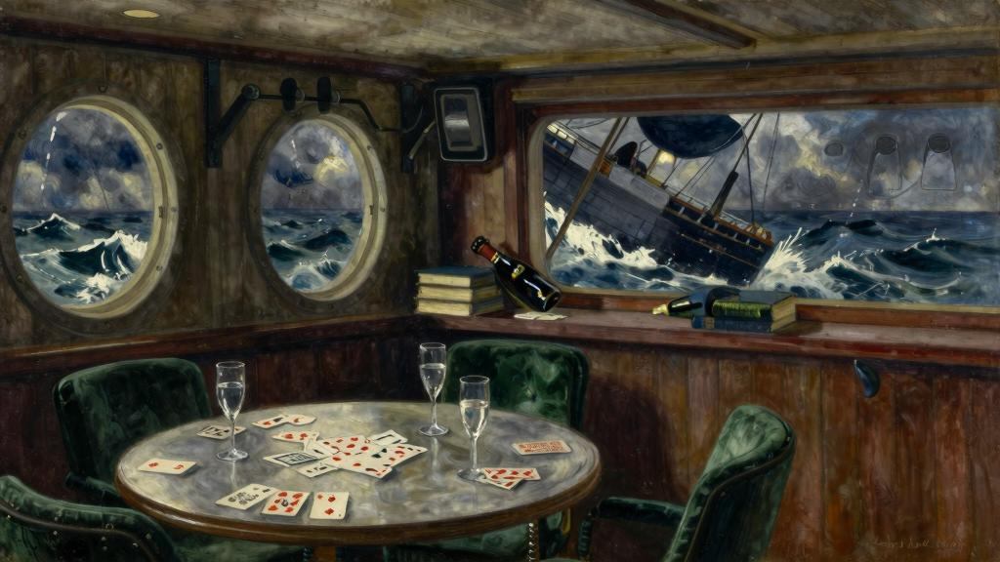
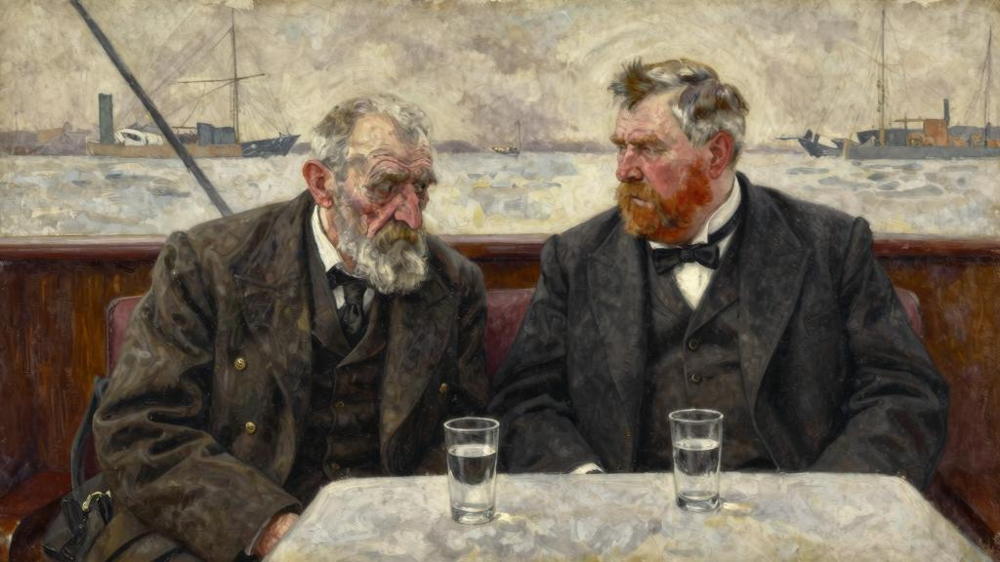
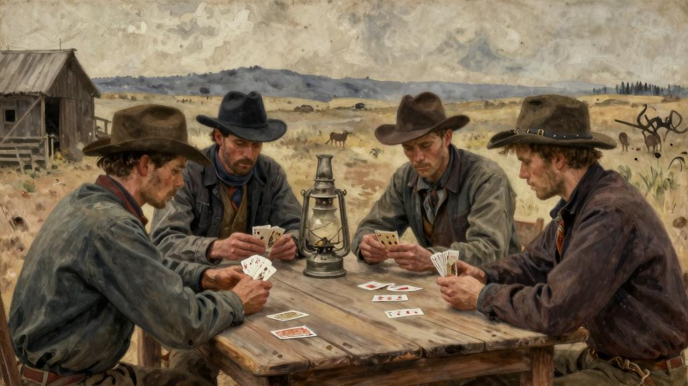

我好歹不是个经常晕船的人，倘若迫于天气恶劣、牌局散了时，不会溜到下层甲板去。他们有打扑克的习惯，经常会打到凌晨一两点钟，小打小闹的输赢，谁也不会因此而伤了和气。没想到，海风刮了整整一天都没停，夜幕降临时，风力已经增强到接近八级大风。他们这伙人里有一两个家伙却大言不惭地说，他们一点儿也没有觉得不舒服，还有一两个家伙竟快活得在那儿蹦来蹦去，脸上挂着非常罕见、超然物外的神态。

话说回来，即使你从不晕船，在海上遇到极端恶劣的天气也大煞风景，令人不爽。世上居然有人会对你说，他酷爱暴风雨，一边神采飞扬地在甲板上奔跑着，一边仰天高呼，让暴风雨来得再猛烈些吧，这种傻瓜最讨厌了。每当船舶开始严重倾斜，板壁嘎吱作响，桌椅来回乱晃，玻璃杯稀里哗啦地摔落在地板上，东倒西歪地坐在椅子里时，每当狂风怒号、海浪雷鸣般地冲击着船舷时，恨不得尽早回到干爽的陆地上去。这时，如果有一个牌友说他已经玩够了，大家也毫无异议地一致同意，这是最后一轮累积赌注时，想，谁也不会对此感到遗憾。独自一人留在吸烟室里，因为心里很清楚，在这铺天盖地的海浪声中，不可能轻轻松松地酣然入睡，有北太平洋在毫不停息地猛烈撞击着的舷窗，也不可能舒舒服服地躺在床上看书。把他们一直在玩的两副牌放在一起重新洗了洗，打算来玩玩这种花样复杂的单人纸牌游戏。

刚玩了大约十来分钟，却见舱门忽然大开，扑面而来的一阵劲风把的扑克牌吹得四处乱飞，紧接着，有两位呼吸相当急促的旅客悄悄溜进了这间吸烟室。他们这艘船并不是乘客已满，而且他们起航离开香港也有十来天了，因此，有的是时间，完全可以跟船上的每一个人都混得非常熟。至于此刻闯进屋来的这两个人，已经在好几个不同场合跟他们说过话，他俩看见孤身一人待在这儿，便立即朝这张桌子走来。

他们是年事已高的老头儿，两个都是。或许这正是他们相伴而行的原因吧。他们是在香港上船时才初次相识的，现在倒好，你瞧，他们差不多整天都凑在一起坐在吸烟室里，他们交谈并不多，只是为了享受这份安逸，彼此肩并肩地坐着，中间放着一瓶薇

姿[182]矿泉水。他们也是非常富有的老人，这是维系他们之间关系的纽带。富人和富人待在一起时，彼此都感到轻松自在。他们知道，有钱就有贤德。他们对穷人的经验之谈是，穷人总是缺这少那。诚然，穷人羡慕富人，能得到别人的羡慕何尝不令人愉快呢，但是，穷人也嫉妒富人，这种嫉妒会使他们的羡慕大打折扣，变得不那么真诚坦率。罗森鲍姆先生是一位略有点儿驼背的犹太人，由于非常虚弱，他身上的那套衣服便显得过于肥大，很不合身，他给人的直观印象是：已经行将就木，只是在苟延残喘。他那老迈力衰、骨瘦如柴的躯体看上去仿佛已经感染上了坟墓的腐朽气息。他脸上唯独仅有的表情是老奸巨猾，不过，这副表情纯然出自个人习惯，是多年精于老谋深算的结果。他其实是一位慈眉善目、和蔼可亲的老人，从来烟酒不分家，他的慈善捐款举世闻名。另一位名叫唐纳森。他是苏格兰人，小小年纪就去了加利福尼亚，后来靠采矿赚了很多很多钱。他又矮又胖，长着一张瘦骨嶙峋的红脸膛，胡子刮得干干净净，头发脱落得只剩下残留在脑勺上的一绺银发，他那双眼睛非常温和。无论他当年闯荡江湖时有多锐不可当，这份锐气也早已被岁月磨灭了，如今只是一个处世淡泊、积善行德者的形象。

“还以为你他们早就上床睡觉了呢。”说。

“是想早早上床睡觉的，”苏格兰人回答道，“可是，罗森鲍姆先生偏要缠着谈谈昔日的陈年旧事。”

“你反正也睡不着，早早上床有什么用？”罗森鲍姆先生说。

“如果你明天早上跟一起在甲板上散散步，只要来回走十趟，你就能睡得很香。”

“这辈子从来就没有做过什么锻炼，也不打算现在才开始锻炼。”

“纯属傻话。要是你坚持锻炼，你肯定会比现在强健得多。你看看。你根本想不到已经七十九岁了，对不对。”

罗森鲍姆先生用挑剔的眼光打量着唐纳森先生。

“不，才不锻炼呢。你确实保养得很好。你看上去比年轻多了，才七十六岁。想当年，根本就没有机会照顾好自己的身体。”

就在这时，服务员上来了。

“先生他们，酒吧马上要打烊了。你他们还想再要点儿什么吗？”

“在这个暴风雨之夜，”罗森鲍姆先生说，“让他们来一瓶香槟酒吧。”

“给来一小瓶薇姿矿泉水。”唐纳德先生说。

“啊，好得很，干脆也给来一小瓶薇姿矿泉水吧。”

服务员转身走开了。

“不过，你可得当心点儿，”罗森鲍姆先生继续像在考验似地说，“少不了要干那些你从来不干的事情的，绝对不是为了钱。”

唐纳德先生文质彬彬地朝笑了笑。

“罗森鲍姆先生对这一点始终耿耿于怀，因为已经有五十七年没有碰过一次牌，也没有沾过一滴酒。”

“那倒要问问你，这样活着还有什么意思呢？”

“年轻的时候既是个嗜酒如命的酒鬼，也是个嗜赌如命的赌徒，可是，有过一次非常可怕的经历。那是个沉痛的教训，终生难忘。”

“跟他说说吧，”罗森鲍姆先生说，“他是作家。他会把它写下来的，他说不定还能把这篇文章拿出去卖钱呢。”

“这可不是传奇故事，如今虽然时过境迁了，但还是不太愿意重提这件事。尽量长话短说吧。当年和另外三个人用界桩标定了一块地皮的所有权，他们大家都是朋

友，年龄最大的还不到二十五岁呢；参与此事的有和的搭档，再加一对亲兄弟，他们的姓氏是麦克德莫特，不过，与其说他们是亲兄弟，倒不如说他们是好朋友。这小哥儿俩要好得无论什么东西都不分你，假如其中一个想进城去，另一个必定也跟着去，他们弟兄两个在一起时总是嘻嘻哈哈，玩笑不断。真是一对纯而又纯的毛头小伙子，弟兄俩的身高都在六英尺以上，而且都长得很英俊。他们这一伙人向来放浪不羁，从总体上说，他们的运气也相当不错，他们只要一赚到钱，就肆无忌惮地挥霍。唉，有一天晚上，他们大家都在开怀畅饮，喝了很多酒，接着又玩起了扑克牌。估计，他们不知不觉都喝得酩酊大醉了。也不知怎么一回事，麦克德莫特兄弟俩之间突然大吵起来。其中一个指责另一个有作弊行为。‘把你这句话收回去，’杰米怒喝道。‘要看着你先下地狱，’艾迪说。和的搭档还没来得及上前劝架，就见杰米突然拔出枪来，当场把他兄弟打死了。”

就在这时，轮船忽然剧烈颠簸起来，大家都紧张得牢牢抓着座椅。酒吧服务员的餐具柜里传来一阵非常刺耳的乒乒乓乓的响声，所有酒瓶和玻璃酒杯都在架子上滚来滚去、相互碰撞着。听到这则阴森可怖的小故事，而且是由这位处世淡泊的老人讲述的，真让人感到匪夷所思。这是发生在另一个时代的故事，但你简直难以相信，眼前这位胖乎乎、红脸膛、后脑勺飘着一绺银发、身穿晚礼服、衬衣胸襟上佩戴着两枚大珍珠的小老头儿，果真是这则故事里的当事人。

“后来怎么处理的呢？”问道。

“他们很快都清醒过来。杰米起初怎么也不相信艾迪已经死了。他把艾迪抱在怀里，嘴里不停地呼喊着。‘艾迪，’他说，‘你醒醒，老兄，快醒醒啊。’他哭喊了整整一夜，第二天，他们骑着快马，带着他进城去了，走了四十英里的路，和的搭档一边一个搀扶着他，把他交给了县治安官。他们与他握手告别的时候，也忍不住大哭起来。对的搭档发誓说，今生今世绝不会再碰一下牌，绝不会再喝一滴酒，从此再也没有，今后也绝不会再碰牌和酒。”

唐纳森先生低下头来，嘴唇在不住地颤抖。很久以前发生的那一幕仿佛又重现在他眼前了。故事里有一个疑点本想问问他的，见他显然十分激动，便不忍心问了。

他们，他那个搭档和他本人，似乎没有任何犹豫，就把这个倒霉的小伙子送交法院去审判了，仿佛这是天底下最理所当然的事情似的。由此看来，即使在那些粗犷强悍、放浪不羁的莽汉心目中，对法律的尊重多少也有几分出自本能的约束力。不禁打了个寒颤。唐纳森先生一口喝干了他杯中的薇姿矿泉水，唐突地道了声晚安，随即便起身离开了他们。

"这老家伙越来越有点儿爱耍小孩子脾气了，"罗森鲍姆先生说，"觉得他并不是非常非常的聪明。"

“得啦，他明摆着够聪明的，赚了那么多的钱。”

“可是，怎么赚来的呢？想当年，在加利福尼亚，你根本不需要靠头脑去赚钱，你只要运气好就行。知道这样说纯属经验之谈。约翰内斯堡[183]才是你必须时刻保持头脑清醒的地方。八十年代的约翰内斯堡。那才让人大开眼界呢。实话对你说吧，他们当年就是一帮铁石心肠的硬汉子。人各争先、落后就要遭殃啊[184]。”

他若有所思地啜了一口薇姿矿泉水。

“你们这些人可以大谈板球[185]、棒球、高尔夫球、网球、足球，你他们甚至可以把这些球类运动当作爱好，这些运动也都很适合小青年他们玩；倒要问问你，让一个成年人在球场上来回奔跑、抢球击球，你觉得合乎情理吗？扑克牌才是唯一适合成年人玩的游戏。玩扑克牌时，你只用手里的牌去对付每一个人，每一个人也都用手里的牌来对付你。团队协作精神？究竟有谁靠团队协作精神发过财呢？发财的路子只有一条，那就是，打败你的对手。”

“原先并不知道你从前也是个玩扑克牌的高手，”打断了他的话，“你哪天晚上来露一手怎么样？”

“再也不打牌了。也洗手不干啦，要不是因为有这条唯一能解释得通的理由，本来还是可以打打牌的。至今都弄不明白主动杜绝打牌的根由，就因为的一个

朋友太不走运，也被人杀了。不管怎么说，如果一个人自己太他妈的愚蠢而惹上了杀身之祸，那他也不值得做朋友。可是，在从前那些日子里！要是你真想知道扑克牌的奥秘，那你就该去南非看看。那是有生以来所见过的赌注最大的赌场。那些人都是玩牌的高手；他们诡计多端，坑蒙拐骗无所不用其极。那种场面真让人大开眼界。干脆给你举个例子吧。有天晚上，正在跟约翰内斯堡的几个头面人物打扑克，忽然有人把叫了出去。当时那笔累计赌注有两三千英镑呢。‘给发牌吧，不会让你他们久等的。’说。‘行啊，’他们说，‘你别那么急急匆匆的。’好吧，走开还不到一分钟。一回来就拿起这副牌看了看，发现拿到手的居然是一副连到Q的同花顺。二话不说，就把手缩了回来。了解的这帮牌友。可是，你知道么，大错特错了。”

“你这话是什么意思？听不明白。”

“发给的牌明明是一副地地道道的同花顺，而那笔赌注却是靠三个7赢的。可是，怎么判断得出来呢？理所当然地以为是另有人拿到了一副连到K的同花顺。在看来，就因为这手牌，说不定要输掉一万英镑了。”

“太恶劣了。”说。

“急得差点儿就中风了。后来因为又再次拿到了一副纯属人为的同花顺，才彻底放弃打扑克牌的。这辈子只打过大概五次牌。”

“认为，拿到同花顺的概率大概是六万六千分之一。”

“在旧金山是，前年还是。那次整个晚上手气一直很不顺。从来就没有输过多少钱，因为根本没有机会打牌。几乎压根儿就没拿到过一个对子，即使拿到了一个对子，也好不到哪里去。接下来，拿到手的牌就跟其他人一样差了，没有跟着下注。坐在旁边的那个人也不想再赌下去了，于是，便把手里的牌亮给他看了看。‘整晚上拿到的全是这玩意儿，’说，‘像这样玩牌，人家怎么能指望赢呢？’‘他们绝大多数人都会凭着一手同花顺胸有成竹地下注。’‘这算哪门子事啊？’大吼一声。

气得浑身直哆嗦。又仔细看了看牌。本来以为拿到的是两三张小红桃和两三张

小方块。没想到，这副牌居然是清一色的红桃同花顺，起先没看出来。的天哪！真的是一副同花顺。当即就知道这意味着什么了。如今老啦，不怎么乱吼乱叫了。也不是那种人。可是，当时实在按捺不住了。努力抑制着满腔怒火，但也憋屈得泪流满面。紧接着，站起身来。‘先生他们，不玩了，’说，‘如果一个人的眼力差到如此地步，连发给他的一副同花顺都看不出来，那他就没有资格玩扑克牌。老天爷已经提醒过，要接受这个提醒。今生今世永远不会再打扑克了。’把所有的筹码都兑了现，只留下了一枚，随后便离开了那家赌场。从此再也没有打过牌。”

罗森鲍姆先生从马甲口袋里掏出一枚筹码，亮给看了看。

“把这枚筹码当作纪念品收藏起来了。无论走到哪儿都随身带着它。是个多愁善感的老糊涂蛋，这一点你也看得出来，可是，你瞧，扑克牌是从前唯一喜欢的娱乐活动。现如今，只剩下一个爱好啦。”

“这个爱好是什么呢？”问道。

他那张老奸巨猾的小脸上漾起了一丝笑意，透过他那副厚厚的眼镜，看到他那双泪水涟涟的眼睛里闪烁着带有讽刺意味的兴奋之情。真让人难以置信，他这副模样看上去既精明过人，又凶相毕露。他咯咯地笑了一声，那是一个老头儿感到开心时发出的尖声细气的笑声，然后仅仅用一个词回答说：“慈善事业。”

（吴建国　译）

亡的结局跟船长握手道别，他也祝一路顺风。随后，便朝下面那层甲板走去，那里早已挤满了各路旅客，有马来人、中国人，也有迪雅克人[186]，费劲儿地挤出人群，径直来到舷梯前。放眼朝客轮的另一侧望去，看到的行李已经卸下来，摆放在那艘帆船上了。那是一艘规模挺大、外形粗陋、竖着一面正方形大竹篷的帆船，船上已经挤挤插插塞满了打着各种手语的本地人。爬上船后，马上便有人为让出了一块地方。

他们此时距离海岸线大约还有三海里，阵阵海风在一个劲儿地吹拂着。随着帆船离海岸越来越近，看到了一大片郁郁葱葱的椰林，椰子树一直生长到了海水边，还看到了掩映在椰林中的那个村落一派棕褐色的屋顶。有一位会说英语的中国人帮指认出一幢白色的孟加拉式的平房，对说，那就是政务专员的官邸。尽管那位政务专员还不知此事，但马上就要与他同住一些时日了。口袋里揣着一封写给他的介绍信。

上岸后，行囊摆放在身边这片亮晶晶的沙滩上，不知何故，竟油然生出一阵莫名的孤独凄凉感。这个偏僻的去处，这座矗立在婆罗洲北海岸上的小镇，是自己找上门来的。一想到得主动向一个地地道道的陌生人做自介绍，还得告知他，接下来就要睡在他的屋檐下，吃他的饭菜，喝他的威士忌，直到另一艘船驶进这个港口，带去的下一个目的港，总感到有点儿羞于启齿。不过，也许犯不着这样瞻前顾后、自寻烦恼，因为一来到那幢平房前，把的介绍信呈递进去，一个身强力壮、面色红润、性情爽朗的男子汉，马上就迎出屋来，他大约有三十五岁，而且由衷地对热情相待。他一边拉着的手，一边大声吩咐男仆去拿酒来，接着又指派另一个男仆去照看的行李。他不由分说地打断了的客套话。

“啊呀，的上帝！好不容易把你盼来了，你不知道有多高兴呢。别以为会不遗余力地亲自安排好你的食宿。这事应该由其他方面负责。你愿意住多久就住多久，只要你喜欢就行。住一年吧。”