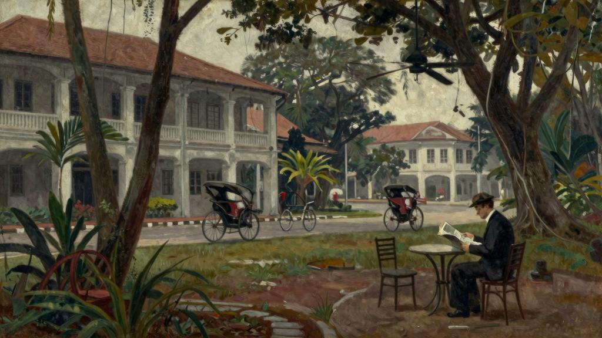
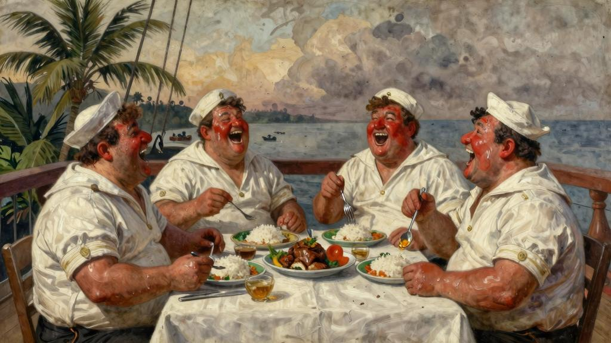
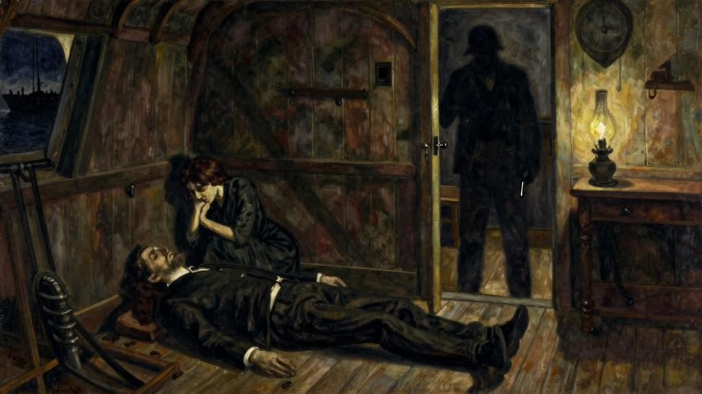

桌子，外加一些炊具。屋外一棵大树下，还有一张桌子，一条长凳。屋后，是他自己垒的鸡圈。

说不清他到底欢不欢迎他们，不过他接过他们带来的东西时，似乎就是接受一份理所应当的馈赠，连句感谢的话都没说，甚至还嘟囔了几句，因为他需要的什么东西他们没有带过来。他性格孤僻，大部分时间都沉默不语，对他们带来的消息，也没什么兴趣，毕竟外边的世界他已经不放在心上了。他唯一在乎的，只有他的岛。他用岛主的口气，自豪地把岛称之为“的养老胜地”，但又很担心岛上丰富的椰子树会招来那些胆大妄为的商人的垂涎。他拉着脸，用怀疑的目光看着，大概是心想，为什么会在这里。他说起话来已经磕磕巴巴，更像是喃喃自语，而不是跟他们说话。一开始听到他旁若无人地喃喃自语，你会觉得有些不可思议。后来，船老大跟他说，他的一位跟他年纪相仿的老相识去世了，他才有些动容。

“老查理死了？真是糟糕！老查理死了！”哈利一遍又一遍地念叨着。问他识不识字，他漠然回答道：“识得不多。”

他似乎只关心他的食物、狗和鸡。果如书上所说，一个人和自然、大海长时间朝夕相处之后，定会修身养性、获益良多。但是，哈利是个例外。他还是原来那个狭隘无知、鲁莽暴戾的水手。看着他那张丑陋、布满皱纹的老脸，心想，三年中到底发生了什么可怕的事，居然让他心甘情愿地忍受这漫长的囚徒岁月。那双蓝灰色眼睛的深处到底埋藏了怎样的秘密，他宁可把它带进坟墓。仿佛看到了哈利的宿命：总有一天，他不再像往常那样，安静地守在礁石上，等待采珠人的到来；不再像往常那样，把踏足他领岛的采珠人视作入侵的敌人。他会走进自己的茅屋，躺在床上，依稀之中找到曾经的那个自己。也许他也会把荒岛周边翻个底朝天，去寻找许多冒险家梦寐以求的大量珍珠。不过，觉得，德国人哈利肯定找不到，他也不会让任何人找到。珍珠就在那里，烂在那里。采珠人只好悻悻返回自己的小船上，而这个岛会再一次回归人迹罕至的荒岛。

（王珍珍　译）

加坡的范·多斯旅馆远算不上豪华。客房里又黑又脏，蚊帐上全打着补丁。离客房很远的地方有一排浴室，阴冷潮湿，充斥着异味。不过，旅馆还是很有特色的。住宿的多是开往加坡的不定期货船上的船长、失业的采矿工程师，以及度假的种植园主，不过，在我看来，比起那些环球旅行家、政府官员和他们的太太，还有在欧洲举办午餐会、打高尔夫、出入舞场、穿着入时的阔绰商贾等潇洒一族，这些人要浪漫得多。旅馆里有一间台球室，有一张铺着块破桌布的球桌，船上的工程师和保险公司的职员经常在这里打斯诺克。偌大的餐厅里人不多，很安静。准备前往苏门答腊岛的几家荷兰人，正坐在一起吃饭，可是彼此间一句话也不说，从巴达维亚[19]出差来的单身客商一边狼吞虎咽地享受美食，一边专心致志地看报纸。餐厅每周两次供应印尼特色的瑞福饭[20]，所以喜欢这一口的加坡人会经常来就餐。许多人认为，范·多斯旅馆本该是一个很沉闷的地方，其实不然，因为这里发生过一些奇闻趣事，只不过这些奇闻已经渐渐被人们遗忘了而已。旅馆有一个面向大街的小花园，客人们可以坐在树荫下喝冰啤。在这座拥挤而又忙碌的城市里，尽管汽车呼啸而过，黄包车一辆接着一辆，车夫他们的脚步声在路上“啪嗒啪嗒”地响个不停，“叮铃铃”的车铃声不绝于耳，但仍不乏荷兰飞地的宁静。这是我第三次住在范·多斯旅馆了。我第一次听说范·多斯旅馆，是一艘荷兰货船S.S.乌得勒支号的船长告诉我的。当时，我正从几内亚的马老奇出发，坐船去望加锡[21]。由于要装卸货物，货船经常要停靠在马来群岛的一些小岛，阿鲁岛、卡伊岛、班达—奈拉岛、安汶岛，还有我已记不起名字的很多岛，快则停一两个小时，慢则需要一整天，因此整个航程耗了将近一个月的时间。一路上虽然单调，但整个行程倒也十分有趣。船抛锚靠岸后，船代会乘着小艇过来，一般情况下，荷兰籍常驻，还有我们，会聚在甲板上的天篷下，船长点些啤酒。大家一边喝酒，一边相互交流从各地听来的消息，我们还会帮岛上的人带信件。如果待的时间比较长，常驻还会留我们吃饭。把船交给二副以后，我们大家（包括船长、大副、轮机长、货管员和我）都会挤上小艇上岸，晚上开开心心地大吃一顿。这些小岛虽然看上去模样都差不多，但还是经常让我突发奇想，原因

只有一个，那就是：我心里清楚，自己再也没有机会见到这些小岛了。很奇怪，这些小岛好像根本不存在似的。我们的船一走远，小岛就消失在海天之中，只有通过想象，我才能让自己相信，虽然看不到，但岛还是存在的。但是，船上的船长、大副、轮机长和货管员却没有那么魔幻、那么神秘。

他们都是些有血有肉的大活人，是我见过的最胖的四个人。虽然货管员皮肤黝黑，其他几个的皮肤很白皙，可我总是搞不清谁是谁，在我看来，他们长得都差不多。几个人都是大块头，圆润的大红脸上没什么胡须，粗壮的胳膊，粗壮的大腿，而且都是膀大腰圆。每次一上岸，他们都会把衣领扣上，勒得就像吃东西被噎住，双下巴都从衣领里突了出来。但大多数情况下，他们是不系扣子的。这些人经常是忙得大汗淋漓，一般都是用头巾擦脸，用芭蕉扇使劲儿扇的主儿。

看他们吃饭可真是难得一见的美事。这些人的胃口特大，他们每天都吃瑞福饭，吃饭时甚至还会相互较劲，看谁吃得多。他们真的很喜欢吃。

“在这个国家，饭要是无滋无味，你根本吃不下去。”船长说。

“在这个国家，要想活着，就得猛吃。”大副说。

四个人是非常要好的朋友，在一起就像学童一样，相互捉弄，相互打趣，对彼此的笑话也都心领神会。往往是笑话刚一开口，讲笑话的人自己就先口沫四溅地哈哈大笑起来，但由于膀大腰圆，身体肥胖，笑得浑身的肉直哆嗦，笑话讲到一半就讲不下去了，引得其他人也跟着开怀大笑起来。几个人坐在椅子上笑得前仰后合，脸涨得越来越红，身上也越来越热，这时，船长会吆喝一声“上啤酒”，于是，大家一边开心地不断打嗝，一边喘着粗气，对着酒瓶喝酒。他们在一起跑船有五年了，就在不久前，有人要送给大副一艘船，但他谢绝了对方的好意。他不想离开自己的伙伴。于是，大家商定，四个人如果有谁先退出了，其他人就一起退。

“几个朋友一条船，有肉有酒不间断。生来要做糊涂人，知足常乐到永远？”

刚开始，他们跟我有点疏远。虽然船上可以搭乘六个乘客，但他们很少或者从来不让不认识的人住。在他们眼里，我是陌生人，而且还是外国人。他们有自己的乐趣，不想让外人打扰。四个人都喜欢打桥牌，不过，大副或轮机长有时候需要值班，这样其他人也组不成局。后来，他们三缺一的时候，发现我会打牌，就欣然地接受了我。就跟他们人一样，他们的牌打得也很怪。几个人打牌的赌注小得可怜，打一百分才值五分钱。不过，几个人都说，他们只是喜欢打牌，并不想赢谁的钱。可是，这还叫什么打牌啊！人手拿着一副牌，都想叫到小满贯。只要有机会瞄别人的牌，你就瞄。假如你能侥幸藏牌成功，而且神不知鬼不觉地告诉了自己的同伴，俩人就会哈哈大笑，笑得眼泪都出来了。但如果同伴执意不让你叫牌，却用五张黑桃（最大的是Q）叫到大满贯，而你手中七张小一点的方块本来会好打一点，在你手中的牌凑不成一个赢墩的情况下，你叫了加倍，结果他一下子丢了两三千分，对手也会开怀大笑，桌上的杯子也跟着晃动起来。

我总是记不住他们那拗口的荷兰名字，只能根据他们各自的职责去区分谁是谁，就像意大利假面喜剧里我们只记住潘塔隆、哈乐昆、庞奇尼这几个丑角的名字一样。只要一看到他们四个人在一起，你就会笑。我觉得，只要陌生人看到他们，都会觉得非常惊讶，他们倒也乐在其中。他们都自豪地说，他们是东印度群岛上最有名的四个荷兰人。在我看来，他们也有严肃的一面。有时候，夜深人静时，四个人脱下制服，卸下伪装，换上睡衣和纱笼裤，其中的某一个挨着我躺在长椅上，伤感的情绪会慢慢涌上心头。轮机长快要退休了，上次回家时遇到了一名寡妇，准备和她结婚，然后搬到须德海[22]滨的小镇上，找几间红砖房，度过余生。船长非常迷恋本地的姑娘，一提到对她们的痴迷，他本来就带浓重口音的英语，更是兴奋得语无伦次。曾经有一段时间，船长打算在爪哇岛的小山上买一处房产，娶一个爪哇姑娘。爪哇姑娘一般长得小巧玲珑，性情温柔，说起话来莺声燕语。船长说，结婚时，他要给娘子穿上丝纱笼裤，脖子上戴上金项链，胳膊上套上金手镯。因为这事，大副还一直取笑他。

“他那套玩意儿太傻了！她会跟你所有的朋友、所有男仆、所有人上床。老兄，退休后，你要的是保姆，不是老婆！”

“我？”船长嚷道，“就算到了八十岁，我也要娶个老婆！”

上一次，船停靠望加锡时，他挑了件小玩意儿，就在船快要进港时，他开始忙活起来，大副不屑地耸了耸他那厚重的肩膀。船每到一处，船长便一头扎进一个又一个烂女人的怀里，不过，到下一个地方，就把上个岛的人抛在脑后了。每次都是大副帮他擦屁股，这次也不例外。

“老家伙有心脏病。可是，每当我赶过去看他，他又没啥大碍。浪费钱是有点可惜，但既然已经得到了想要的，浪费点钱又算什么呢？”

大副很通情达理。

后来，我在望加锡上岸，跟我的四个胖朋友道了别。

“下次再跟我们一起旅行吧！”他们对我说，“明年或后年再回来。你在这一片会看到我们的，还跟以前一样。”

一晃好几个月过去了，我又游历了不止一个岛屿。我去过巴厘岛、爪哇岛，还有苏门答腊岛，还去过柬埔寨和安南[23]。此刻，坐在范·多斯旅馆的花园里，我感觉像是又回到家一样。清晨的天气很凉爽，吃完早餐，我读着过了期的《海峡时报》，想看看最近有什么闻。报纸上没什么大事。突然，一个标题映入我的眼帘：乌得勒支号悲剧，货管员和轮机长无罪释放。我大致看了一下报道，不由得坐了起来。乌得勒支号正是我那四个荷兰胖朋友的船。很明显，货管员和轮机长因为谋杀，被控上法庭。不可能是我那两个胖朋友。报道中提到了他们的名字，但我并在意他们叫什么。案子是在巴达维亚审的。报道中并没有提供更多的细节，只是一个简要的官方报道，说法官在听完控方和辩方的陈辞后，做出了如上判决。我大吃一惊，不敢相信我的朋友居然会杀人。我翻遍了前几期的报纸，也没能找到被害人的任何信息。报纸上只字未提。

我站起身，走到旅馆经理跟前，把报纸拿给他看。经理是个友善的荷兰人，英语说得很流利。

“这艘船我曾经坐过，在上面待了将近一个月。我敢说，报道中提到的人不是我认识的人。我认识的那几个人都很胖。”

“没错，就是他们，”经理答道，“这几个人在整个荷属东印度群岛很出名，在一起共事的四个大胖子。这件事情很糟糕，引起了不小的轰动。他们是好朋友，这个世界上最好的朋友。我认识他们。”

“可是，究竟发生了什么？”

他回答了我的问题，告诉了我那天发生的事情。但我想知道的有些事，他也回答不上来。一切都令人困惑，令人难以置信，当时究竟发生了什么，只能靠猜测。后来，经理被人叫走了，我一个人又回到花园。此时，天气渐渐热了起来，我便回到自己的房间，但心里仍然像一团乱麻一样。

事情的经过似乎是，在一次旅行中，船长把他一直朝思暮想的一个马来女人带上了船，但是不是我在船上时听他念叨过的那个女人，就不得而知了。其他三个人都反对她上船——船上要女人干什么？她一上船就会把一切都毁了，但船长执意把她带上了船。我想，他们可能是对她心存嫉妒吧。那次航行，几个人再也不像往常一样欢声笑语，相互打趣了。每次其他人想打桥牌，船长却在自己的船舱里跟这个女子乐逍遥。每次船靠岸，四个人虽然都是一起上岸，但对船长来说，从上岸到回到船上的这段时间可谓是漫长的煎熬，因为他已经离不开这女子了。对四个好朋友来说，像云雀一样快乐的日子已经一去不复返了。几个人中，大副最不喜欢这个女子。他跟船长自一开始从荷兰出来跑船就是搭档，所以关系尤其亲密。对船长迷恋这女子的事，俩人不止一次拌过嘴。没多久，几个好朋友便沉默下来，只有在工作需要时，才说几句话。四个胖男人之间维持了很久的友谊，就这样结束了。再后来，事情越来越糟了。手下的另外两位感觉到，麻烦就要来了。不安。紧张。

一天夜里，船上突然传来一声枪响和马来女子的尖叫声。货管员和轮机长一骨碌滚下铺，发现船长拿着手枪，站在大副的舱门口。他把俩人一把推开，跑到甲板上。货管员和轮机长赶紧走进船舱，发现大副已经死了，只剩马来女子蜷曲在门后边。俩人被船长捉奸在床，船长一怒之下杀了大副。他是怎么发现的？

大副和女人为什么要私通？没有人知道。是大副引诱女子跑到自己船舱里，以此来报复

船长？还是女子明知大副不喜欢自己，所以故意采取怀柔策略，引他上钩？这恐怕是永远也解不开的谜。我脑海里闪现出无数种可能性。就在轮机长和货管员在船舱里被眼前的一幕惊呆时，又传来一声枪响。俩人马上意识到发生了什么，便立刻冲了出去。船长回到自己的船舱，饮弹自尽了。接下来，事情的经过越来越模糊，越来越神秘了。第二天早晨，怎么都找不到马来女子了，已经接管这艘船的二副把情况告诉了货管员。货管员回答道：“她可能是从船上跳下去了。这也是她最好的结局。包袱总算给甩了。”但是，据巡航的船员说，就在天亮前，他看见货管员和轮机长把什么东西抬到甲板上，一个鼓鼓囊囊的包裹，大小跟当地女人的身材差不多。俩人四处张望了一下，在确定没人察觉后，把包裹丢下了船。后来，大家都在传，货管员和轮机长跑到马来女子的船舱里找到她，把她掐死，然后把尸体扔进海里，替他们的朋友报了仇。船抵达望加锡后，俩人被捕，被带到巴达维亚，以谋杀罪受审，但因证据不足，被无罪释放。但是，整个东印度群岛的人都知道，货管员和轮机长伸张了正义，动手弄死了那个害死他们的两个好友的婊子。

四个荷兰人广为流传而又充满风趣的友谊，就这样结束了。