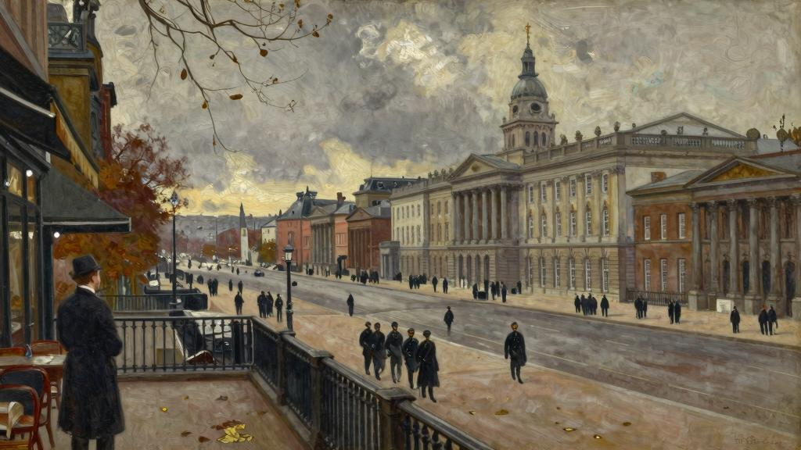
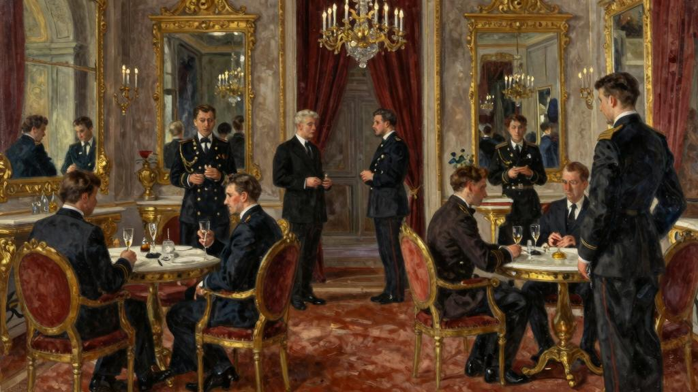
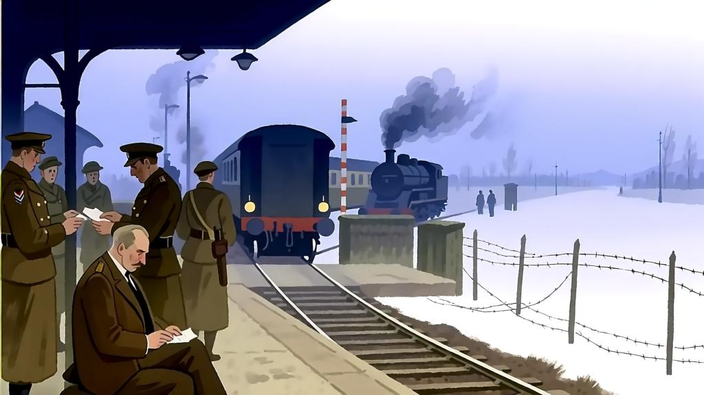
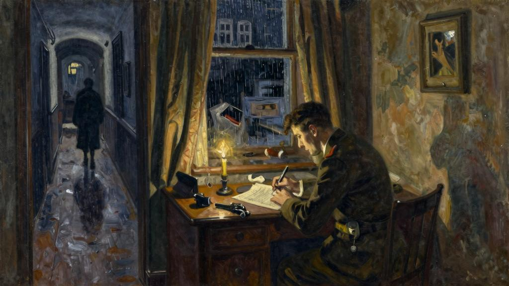

阿申登被派往X城时，他环顾四周发现自己所处的情况十分微妙。X城是一个主要好战国的首都；但这个国家已经四分五裂；有一个很大的政党反对战争，革命即使不是迫在眉睫也是不可避免的。阿申登接到指令，前来看看在这种情形下该怎么做最好，他要拿出一个方案。如果这个方案被派他来的尊贵人物批准通过的话，他就要着手实施了。他手上可支配的资金非常充裕。英国大使和美国大使也都奉命要给他提供他们可以自由支配的设施，但阿申登私下里被告知要单独行动；他并不是去向两大强国的官方代表他们透露不方便他们知道的事实从而给他们制造麻烦的；而且由于他必须要在暗中支持一个政党，该政党与执政局剑拔弩张，并且和关系十分密切的美国和英国也势不两立，因此阿申登凡事最好自己作决定。尊贵人物并不想让大使他们因为发现一位不明身份的特工被派来跟他们对着干而感到羞辱。另一方面，在对立阵营中有一个代表也是好的，万一发生突然的剧变，他的手头有足够的资金，而且也会得到国家新领导人的信任。但大使他们都坚持自己的尊严，并且有敏锐的嗅觉能察觉到任何侵犯他们权威的行为。阿申登一到X城就前去正式拜访英国大使赫伯特·威瑟斯彭爵士，并毫无例外地受到彬彬有礼的接待，只是他态度中散发出的冷淡连北极熊的脊椎都会感到有些微微颤抖。

赫伯特爵士是一名职业外交官，在某种程度上培养了自己的职业风格，让旁观者充满了敬仰和钦佩。他没有问阿申登任何关于他任务的问题，因为他知道阿申登一定会顾左右而言他，但是他让他看到这是个完全愚蠢的行为。他带着强忍的尖酸刻薄讲起把阿申登派到X城的尊贵人物。他告诉阿申登他接到指示要满足他提出的任何需要帮助的要求，并说如果阿申登任何时候想见他，但说无妨。

“我接到一个有点奇怪的请求，需要用事先已给过你的专用码为你发电报，再把收到的电报用专用码交给你。”

“我希望它们寥寥无几，先生。”阿申登回答，“我不知道还有什么比编码和解码更乏味的事了。”

赫伯特爵士停顿了片刻，也许这不是他期望的回答。他站起身。

“如果你想进入大使馆我将为你介绍参赞和秘书，你可以从秘书那儿取你的电报。”

阿申登跟着他走出房间，大使把他交给参赞后就无力地握了握他的手。

“我希望今后能愉快地再次见到你。”他说，例行公事般微微点一下头就离开了。

阿申登沉着冷静地接受了对他的招待。他的职责需要他保持默默无闻，他并不想引起官方对他的关注。但在同一天的下午，他去拜访美国大使馆时发现了为什么赫伯特·威瑟斯彭爵士对他如此冷淡。美国大使是威尔伯·谢弗先生，来自堪萨斯城，他被任命这个职位作为对他政治表现的奖励，时还很少有人怀疑战争即将爆发。他是个高大魁梧的人，头发花白已不再年轻，但他保养得很好并且异常健壮。他有一张方形的红润脸庞，胡子剃得很干净，一个小小的狮子鼻和一个透着坚强意志的下巴。他的面部表情十分多变，他不断把它扭曲成奇特而有趣的鬼脸，看起来好像是用制作热水袋的印度红橡胶做的。他热情地欢迎阿申登。他是个真诚热心的家伙。

“我想你已经见过赫伯特爵士并已惹恼他了。华盛顿和伦敦方面告诉我们收发你的密码电报而不必知道它们的内容，这是什么意思？你知道，他们没有权利这么做。”

“哦，大使先生，我想这么做只是为了节省时间和避免麻烦。”阿申登说。

“那好吧，你这次的任务到底是什么？”

这个然是阿申登没有准备要回答的问题，但想到直接拒绝不够得体，他决定给大使一个答复但又让他知之甚少。阿申登从他的表情就已作好判断，谢弗先生虽然拥有在总统选举中灵活改变立场的天赋，至少大家明眼可见的是他不具有他的职位要求的敏

锐性。他给人的印象是个直率豪爽、性情愉快并喜欢开玩笑的家伙。阿申登如果跟他玩纸牌可能会对他有所提防，但对于在自己掌控之下的事他感到相安全。他开始含糊而漫不经心地谈论整个世界格局，在他深入这个话题之前他设法问大使对于前总体局势的看法。这就像是对着战马吹响的号角声：谢弗先生长篇大论没有停顿足足讲了二十五分钟，直到他最后筋疲力尽停下来。阿申登对他的友好接待表示衷心感谢并告辞离去。

阿申登决定对两位大使都敬而远之，他开始着手工作并制定好一套作战计划。但碰巧他能帮赫伯特·威瑟斯彭爵士一个大忙，于是他又开始和他有了接触。有人认为谢弗先生与其说是外交官不如说是政治家，是他的地位而不是他的个性决定了他的观点。

他把这次显赫的升迁看成是享受美好生活的机会，并且纵情享乐，如果他不加节制的话，他的健康很快就会垮掉。他对外交的无知让他在任何情况下作出的判断都令人值得怀疑，但他在盟国大使会议上的状态经常是昏昏欲睡的，他似乎根本无法作出判断。众所周知他迷上了一位异常美丽的瑞典女士，但从一位情报局特工的角度来看，这位女士的动机十分可疑。她和德国的关系密切，这就使她对盟国表现出的同情显得十分不可靠。谢弗先生每天都与她见面，而且显然受她的影响很大。现在人们注意到经常有非常秘密的信息泄露出去，人们不禁怀疑是否谢弗先生在他每日的拜访中不经意地把这些信息说出去，然后被快速地传到敌人的总部。没有人怀疑谢弗先生的忠诚和爱国，但对他在言行上的谨慎程度却十分不确定。这是个棘手的问题，但伦敦和巴黎方面的担忧和华盛顿的一样严重。阿申登被指示前来处理此事。然他被派到X城来完成任务并非没有任何帮手，在他的助手中有一个特别精明能干有魄力的人，他是加利西亚裔的波兰人，名叫赫巴特斯。在与他商量后就发生了一个秘密工作中偶尔会发生的幸运巧合，那位瑞典女士的一个女佣突然病倒了，伯爵夫人（她的身份就是如此）很幸运地找到了一位来自相邻地区克拉科夫的非常可敬的人来顶替她的位置。在战前她曾是一位杰出科学家的秘书这一事实使她毫无争议地胜任女佣这个位置。

这一事件的结果就是阿申登每隔两三天就能收到一份简洁的报告，让他对在这个迷人女士家中发生的一举一动了如指掌，虽然还没确凿的证据证实那被提出的模糊怀疑，他却意外掌握了一些重要的信息。在伯爵夫人专为大使举行的舒适小型二人晚餐上，从他们的交谈中可见，大使先生对他的英国同行颇有微词。他抱怨他和赫伯特爵士

之间的关系被刻意维持在纯粹的官方层面上。他直言不讳地说他厌倦了这该死的英国佬摆出的臭架子。他是个男子汉和百分百的美国人，礼仪对他来说就像地狱里的雪球（瞬间被地狱之火融化）一样毫无用处。他们为什么不能像两个普通人一样聚在一起，无拘无束地畅所欲言呢？血浓于水，他说，为了赢得战争他们必须要坦诚地坐下来喝点朗姆酒作进一步的沟通对话，而不是通过外交辞令和争吵来解决。现在很明显两位大使之间不存在一种百分百的热诚，这是让人很不愿意看到的。因此阿申登想问问赫伯特爵士他是否能见他。

他被引进赫伯特爵士的书房。

“啊，阿申登先生，我能为你做点什么？我希望你对一切都很满意。我知道你的电报线一直都很繁忙。”

阿申登坐下来时看了大使一眼。他得体地穿了一件剪裁完美的燕尾服，对他修长的身材来说就像手套一样非常合身，在他的黑色丝绸领带上嵌着一颗漂亮的珍珠，他的灰色长裤上有一条完美的线，面料上清晰幽雅的条纹和那干净整洁的尖头鞋看上去仿佛他从未穿过。你简直无法想象他只穿衬衫喝着苏打威士忌的样子。他是个又高又瘦的人，有着一副非常适合现代服装的好身材，他笔直地坐在椅子上，好像正在为一幅正式的画像做模特。从他冷漠而无趣的神情看，他真是个非常英俊的家伙。他那整齐的灰色头发在一边分开，苍白的脸上刮得干干净净，他有一个精致笔挺的鼻子、灰色眉毛下一双灰色的眼睛，他的唇形很好，年轻时一定很性感，但现在已被打造成一种随时流露出嘲讽的表情，并且显得黯淡没有血色。从这张脸可以看出几个世纪的高贵血统和良好教养，但你可能不相信它有表达情感的能力。你从来不会指望它能由于放声大笑而绽放出一个真诚的笑脸，最多就是被一个讽刺的微笑点亮而发出冷冷的光，转瞬即逝。

阿申登异常紧张。

“恐怕你会认为我在干预与我无关的事，先生。我已准备好被告知别多管闲事了。”

“别急着下结论，先说说看。”

阿申登说着他得到的消息，大使认真地听着。他那灰色冰冷的眼睛一眨不眨地盯着阿申登的脸，阿申登心知他的尴尬一览无遗。

“你是怎么知道这些的？”

“我有办法掌握一些小道消息，有时还挺有用的。”阿申登说。

“我明白了。”

赫伯特爵士依然目不转睛地看着他，但阿申登奇怪地看到在他钢铁般冷漠的眼睛里突然有了一丝笑意。他那冷酷而高傲的脸瞬间变得颇具吸引力。

“可能有另一条小道消息你会很愿意说给我听的。做一个普通人应该做些什么？”

“恐怕他什么也不需要做，大使先生。”阿申登严肃地回答，“我认为这是上帝的恩赐。”

赫伯特眼里的笑意消失了，但他的举止比阿申登刚被引进屋来时要稍微彬彬有礼些。他站起来伸出手。

“你来告诉我这些做得很好，阿申登先生。我实在是疏忽之至。对我来说，冒犯那位温文随和的老绅士是不可原谅的。但我会尽力去弥补我的错误。我今天下午就去拜访美国大使馆。”

“但是不要太过于正式了，先生，请允许我冒昧地建议。”

大使的眼睛闪闪发光。阿申登开始觉得他几乎有点人情味了。

“我只会做正式的事，阿申登先生。这是我性格中的不幸之一。”阿申登要离开时他又补充了一句，“对了，不知道你明晚是否愿意来跟我一起吃晚饭。黑色领带，八

点一刻。”

他并没有等待阿申登的同意，而是认为这是理所然的，他点头示意告别后就又坐回到他的大书桌旁。

阿申登满怀疑虑地期待着赫伯特·威瑟斯彭爵士的晚宴。黑色领带意味着是一个小型宴会，也许只有大使的妻子安妮夫人，阿申登并不认识她，或者还有一两个年轻的秘书。没有任何迹象显示这会是一个欢闹的夜晚。他们在晚餐后有可能会打桥牌，但阿申登知道职业外交官不善于打桥牌：也许是因为他们发现很难让他们伟大的头脑屈从于微不足道的室内游戏。另一方面他也很想多了解一些大使在不太正式的情况下的样子。因为显然赫伯特·威瑟斯彭爵士不是个普通人。他在外貌和举止风度上都堪称是他这个阶级的完美典范，能遇到一个众所周知的行业中的杰出代表是件有趣的事。他就正好是你所期待的大使形象。如果他的任何性格特点稍微夸张一点，他就是个漫画人物了。他一点也不可笑，你看着他时会情不自禁屏住呼吸，就像在看一个在令人目眩的高度上表演危险技艺的钢索舞者。他是个有个性的人。他在外交界的崛起非常迅速，虽然与一个有影响力的家族联姻无疑对他有帮助，但是他被提拔主要还是归功于他自身的能力。他知道什么时候该态度强硬、机立断，什么时候又该态度缓和、适调解。他的言谈举止非常完美，他能轻松准确地说六国语言；他的头脑清晰、逻辑性强，从不害怕将自己的想法贯彻到底，但也会足够明智地使自己的行动适应严峻的形势。在他年仅五十三岁时在X城做到了这个职位，在这个由战争和政党意见不合造成的极其困难的境地中用自己的机智、信心和至少有一次用勇气承担起了职责。有一回发生了一场骚乱，一帮革命者强行进入英国大使馆，赫伯特爵士站在楼梯的顶端训斥他们，对在他面前挥舞的左轮手枪视而不见，他成功地说服他们回家去。他将在巴黎结束他的职业生涯。这很显然，他是一个你不得不钦佩但很难喜欢上的人。他属于维多利亚时代的那类大使，能够很有信心地被委托处理大事，他们有独立自主的个性，有时让人觉得骄傲自满，但结果证明是有益的。

阿申登开车到大使馆门口时，门被推开了，一个结实而又严肃的英国管家和三个男仆出来迎接他。他被带上了一段华丽的楼梯，就是在这里发生了上述的戏剧性事

件，接着被引入一间极大的房间，屋内灯罩下的灯光显得十分黯淡，他第一眼就看到大件庄严的家具，在烟囱的上方是一幅巨大的身着加冕长袍的乔治四世画像。但壁炉里燃烧着明亮的熊熊炉火，旁边有张宽厚舒适的沙发，他的名字被报上时，主人赫伯特爵士缓缓地从沙发里站起身来。他朝他走来时显得优雅极了，穿着无尾礼服气质非凡，这是最难让男人穿起来显得好看的服装了。

“我的妻子去听音乐会了，但她会晚些时候加入我们。她很想认识你。我没有邀请其他人。我想我会非常享受与你俩面对面在一起的乐趣。”

阿申登礼貌地小声客套了两句，但他的心已沉了下去。他不知道要怎么单独跟这个男人在一起打发至少几个小时，他不得不承认，这个人让他非常拘束。

门被再次打开，管家和一个男仆捧着非常沉重的银托盘走了进来。

“晚餐前我总要先来一杯雪莉酒。”大使说，“但万一你养成了喝鸡尾酒的野蛮习惯，我也可以给你来上一杯，我记得是叫干马提尼。”虽然感到害羞，阿申登却不打算逆来顺受地在这种事情上落了下风。

“我是紧跟时代潮流的。”他针锋相对地说，“你能喝一杯干马提尼时却选择喝雪莉酒，无异于你能乘东方快车旅行却坐了马车一样。”

这一场关于时尚的东拉西扯的闲聊被两扇大门突然打开的声音打断了，接着宣布阁下的晚餐可以开始了。他们走进餐厅。这是一间宽敞的屋子，六十个人一起舒适地用餐都没问题；但现在那儿只放了一张小圆桌，因此赫伯特爵士和阿申登可以坐得亲密些。那儿有一个巨大的桃花心木餐边柜，上面摆放了许多金盘子，再上面正对着阿申登的是一幅卡纳莱托[94]的精美画作。在烟囱的上方是一个四分之三长的维多利亚女王少女时代的肖像，她整洁的小脑袋上戴着一顶小巧的金王冠。晚餐由壮实的管家和三个高大的英国男仆负责上菜。阿申登觉得大使很享受那种对他生活的浮华视而不见的感觉，这也许出自他良好的教养。他们就像在英国的豪华乡村别墅里吃饭；他们完成的是一套仪式，奢华而不张扬，而正因为它是一种传统，让你感受不到它的荒诞。但阿申登从中

所品味到的则是一直萦绕在他心头的想法，他感到在墙的另一边是不安的骚动的人群，随时都有可能演变成一场血腥的暴力革命，在不到两百里的地方，战壕里的人们正躲在深挖的坑里躲避着刺骨的严寒和无情的炮击。

阿申登不需要害怕会谈会艰难地进行，而他认为赫伯特爵士邀请他来是为了询问他的秘密任务的想法也很快消除了。大使对待他彬彬有礼，就好像他是个英国游客前来向他递交一封介绍信。你几乎想不到一场战争正在爆发，因为他仅仅提到他并不是故意回避一个令人苦恼的话题。他谈论艺术和文学，让人觉得他是个虔诚的天主教读者。阿申登跟他谈论自己熟悉的作家，赫伯特爵士只知道他们的作品，但他以友好的态度谦恭地倾听，就像那些伟大的艺术家对待后辈的态度（虽然有时他们也会因一幅画或一本书略有瑕疪而让后辈稍感宽慰）。他顺便提到阿申登某部小说中的一个人物，但并没有提到他的客人就是作者。阿申登很佩服他的温文尔雅和善解人意。他不喜欢别人面谈论他的作品，他一旦完成就不再感兴趣了。别人面称赞或责备他，会让他觉得难为情。

赫伯特·威瑟斯彭爵士为了维护他的自尊，体贴地表示自己读过他的作品，但并不发表意见来体现自己的周到。他也提到在他的职业生涯中被派驻过的许多不同的国家，以及在伦敦或其他地方他和阿申登都认识的各种各样的人。他很会说话，也很有技巧，明明是讽刺的口吻却偏偏让人感到愉悦，还可能会被认为是幽默。阿申登觉得他的晚餐既不丰盛也不令人兴奋。如果大使不是在每个话题上的评论都那么正确、睿智和理智的话，他可能还觉得有趣些。阿申登发现要费点劲才能跟上他敏捷的思维，但他更希望这种谈话能直接坦率些，好比说可以把脚翘在桌子上。但在这里绝无可能。阿申登发现自己不止一次在想，晚餐后多久他可以得体地告辞。十一点他在巴黎饭店还要和赫巴特斯碰面。

晚餐接近尾声，咖啡被送了进来。赫伯特爵士对美食和美酒颇有研究，阿申登不得不承认他见多识广。餐后酒也和咖啡一起被送进来。阿申登拿了一杯白兰地。

“我有一些陈年的汤姆利乔酒。”大使说，“你要不要尝尝？”

“说实话我认为白兰地是唯一值得品尝的酒。”

“我不敢肯定我不同意你的看法。但如果是那样的话，我必须要给你更好的东西。”

他给管家下了个命令，后者很快就拿来了一个还带着蜘蛛网的瓶子和两只巨大的酒杯。

“我并不想炫耀。”大使边看着管家把那金黄色的液体倒进阿申登的酒杯边说，“但我敢说如果你喜欢白兰地，你就一定会喜欢这个酒。这还是我在巴黎短期参赞时弄到的。”

“最近我跟你的一个继任者打过多次交道。”

“拜林？”

“是的。”

“你觉得白兰地怎么样？”

“妙不可言。”

“拜林呢？”

这问题突如其来，看似与前一个问题风马牛不相及，听起来有点滑稽。

“哦，我认为他就是个十足的傻瓜。”

赫伯特爵士向后靠在椅子上，用双手握着大玻璃杯以便用体温带出点酒的香气。

他慢慢地环顾这间庄严而又宽敞的房间。桌上没有多余的东西。只有一碗玫瑰花放在阿申登和主人之间。仆人们离开时把电灯都关了，现在屋子里只靠桌上的蜡烛和壁炉里的火照明。尽管空间很大，还是能感觉到一种清新舒适的氛围。大使的目光停留在挂在烟囱上方的那幅非常出名的维多利亚女王画像上。

“愿闻其详。”他最后说道。

“他将不得不离开外交部门。”

“恐怕是的。”

阿申登迅速地给了他探究的一瞥。他没料到大使会同情拜林。

“是的，在这种情况下，”大使继续说，“我认为他离职是不可避免的。我感到很遗憾。他是个能干的人，大家会想念他的。我相信他还会有自己的事业。”

“是的，这就是我所听到的。我听说在外交部，他们对他的评价很高。”

“他对这枯燥的行业倒是天赋异禀，做起事来如鱼得水。”大使淡淡地笑着，态度冷淡却又公正地评价道，“他长相英俊，具有绅士风度，举止优雅，讲一口标准流利的法语，他很聪明，工作相出色。”

“他浪费了这么好的机会真是可惜。”

“我知道他在战后会做葡萄酒生意。说也奇怪，他将要代理的公司正是我得到这种白兰地的那家。”

赫伯特爵士举起玻璃杯凑到鼻子边深深地吸了一口酒的芳香，然后看着阿申登。

他看人的时候也许在想其他事情，这说明他认为他们有些奇怪，但并不讨厌。

“你见过那个女人？”他问道。

“我跟她和拜林一起在拉鲁饭店吃过饭。”

“真有意思。她是个什么样的人？”

“很迷人。”

阿申登想要对主人描述她，但与此同时，他回忆起在饭店里拜林把他介绍给她时给他留下的印象。他对这个听闻已久的女人并不感兴趣。她叫自己罗斯·奥伯恩，但她的真名很少有人知道。她最初是作为“快乐女孩”舞蹈团的一员来到巴黎的，她们在红磨坊演出，但她惊人的美貌很快使她引人注目，一个富有的法国制造商对她一见倾心。他送给她一栋房子和无数的珠宝，但他无法长期满足她的需求，于是她频频更换情人。短时间内她就成了法国最有名的交际花。她挥霍无度并玩世不恭、冷漠无情地毁了一个又一个的仰慕者。最富有的男人都发现自己无法满足她的奢侈挥霍。在战前阿申登有一次在蒙特卡洛见到她一口气输了十八万法郎，这可真是一大笔钱。在好奇的旁观者包围中，她坐在大桌子旁泰然自若地扔下了几包一千法郎票面的钞票，如果她输的是自己的钱，那会很令人钦佩的。

阿申登遇见她时，她过的就是这种奢侈无度的生活，整夜整夜地跳舞和赌博，一周中大部分的下午时光都泡在赛马场上，一晃十二三年过去，她已不再年轻；但她那可爱的额头上几乎没有一丝皱纹，水汪汪的眼睛周围也几乎没有鱼尾纹来泄露她的真实年龄。最令人惊奇的是，她在这些狂热而无休止的愚蠢的放荡行为中，还能保持一种童真的气质。然这也是她刻意培养出来的。她身材优美苗条、婀娜多姿，她无数的连衣裙总是式样简单、朴素大方。她棕色的头发也打理得很简单。她有着椭圆形的脸蛋、迷人小巧的鼻子和大大的蓝眼睛，完全像安东尼·特罗洛普[95]作品中的女主角。这种如此罕见的纪念风格让你几乎无法呼吸，意乱情迷。她的皮肤吹弹可破，白里透红，如果她化妆的话那一定不是出于需要而是任性。她散发出一种露水般的纯真，出乎意料地迷倒众生。

阿申登然听说拜林她的情人已一年多之久。由于她的声名狼藉，所有跟她有风流韵事的人都会受到公众的强烈关注。而这一次公众的流言蜚语似乎有了更多的含义，因为拜林没有什么钱，而罗斯·奥伯恩这个众所周知从未给过任何人好处的人好像也不那么金钱至上了。难道她爱他？这看上去难以置信，但若非如此，还有其他解释吗？拜林是个任何女人都有可能爱上的年轻人。他大概三十来岁，身材高大相貌英俊，举手投足间有着独特的风度和魅力，他的外貌如此出众，走在街上的人们都会忍不住频频转身看他；但与大多数帅气的男人不同，他似乎完全没有意识到他给人留下的这种印

象。大家得知拜林是这个知名交际花的心上人[96]（这是个比“情夫”更高雅的英文词儿）时，他成了许多女人仰慕而许多男人忌妒的对象；但他要娶她的流言四处传播时，他的朋友他们都惊慌失措，而其他所有人都用下流的笑声谈论他。听说他的上司问他此事是否真，而他竟直言不讳地承认了。有人对他施加压力要他放弃这个只能导致灾难的计划，也有人向他指出外交官的妻子要承担一定的社会责任，而显然罗斯·奥伯恩无法履行。拜林则回应，他随时都可以辞去职务，因此他不会造成任何不便。他对别人的规劝和争论置之不理，他铁了心要娶她。

阿申登初识拜林时对他并没有什么好感。他发现他略微有点冷淡。但因为他工作的危险性使他不时要跟拜林接触，渐渐地他看出拜林冷淡的态度仅仅是因为他的羞怯；随着他对他的了解，他被他异常甜美的性情迷住了。但是他们的关系纯粹是官方的，因此有一天拜林提出邀请他吃饭并认识一下奥伯恩小姐时，他有点出乎意料，不禁纳闷是否因为人们已经开始对他冷眼相待。等到场时他发现这次邀请是出于奥伯恩小姐对他的好奇。更让他感到意外的是，他得知她花时间读过（看起来带着仰慕的态度）他的两三部小说，晚让他惊奇的事还不止这一件。由于一直过着安静勤勉的生活，他从来没有机会深入高级妓女的世界，他对那个时代风靡一时的交际花他们也是只闻其名。他有些吃惊地发现，罗斯·奥伯恩与梅费尔上流社会的时髦女人在言行举止和神态气质上几乎没什么差别，这些女人也是他通过写书或多或少熟悉起来的。她可能有点急于取悦他人（的确，她的一个令人愉快的特点是她对任何与她谈话的人都表现出感兴趣），但除此之外她没有任何装腔作势，她的交谈也充满了智慧。唯一缺少的只是最近社会上颇为流行的粗俗。也许她本能地觉得漂亮的嘴唇不应用脏话毁了自己的形象；也许她本质上还是个淳朴的郊区人。显而易见她和拜林正疯狂相爱着。看到他们彼此热恋的激情真的很感动。阿申登跟他们握手告别时（她握住他的手，用她湛蓝而闪亮的眼睛看着他的眼睛），她对他说：

“我们定居伦敦后你会来看我们的，对吗？你知道我们马上就要结婚了。”

“我衷心地祝贺你。”阿申登说。

“和他？”她微笑着，她的笑就像天使一般，带着晨曦的清新和南方春天柔情的欢欣。

“你从来没有在镜子里看过自己吗？”

阿申登（他认为自己带着一丝幽默）在描述那场晚宴时赫伯特·威瑟斯彭爵士专心致志地看着他。他冰冷的眼睛里没有一丝笑意。

“你认为这是场好姻缘吗？”他现在问道。

“不。”

“为什么不？”

这个问题使阿申登大吃一惊。

“一个男人不仅仅是跟他的妻子结婚，他还要接受她的朋友。你知道拜林将要和什么样的人交往吗？涂脂抹粉、名声败坏的女人，社会地位低下的男人、不劳而获的寄生虫和冒险的投机商。然他们会很有钱，她的珍珠就可能价值十万英镑，他们可以在伦敦时髦的波希米亚圈中大出风头。你知道社会的黄金边缘吗？一个品行不良的女人结婚了，她能赢得大家的赞赏，她耍花招迷住了一个男人从而自己变得体面，而他，那个男人却只是沦为笑柄。即使是她的朋友，那些老妇人和她们养的小白脸，以及那些卑贱的、靠介绍那些没有警惕心的人给商人从而得到百分之十的佣金过着简陋的生活的人，甚至连他们都看不起他。他就是个容易受骗的人。相信我，在这样的位置上要举止得体，你要么需要高大的人格尊严，要么需要无与伦比的厚颜无耻。再说了，你觉得他们有可能长久吗？一个曾经过着疯狂刺激日子的女人可能安心于平静的家庭生活吗？没过多久她就会觉得无聊并焦躁不安。爱情能持续多久？你不认为拜林不再喜欢她时，如果他把他的现状跟他本可能会成为的样子做比较，他的内心难道不痛苦吗？”

威瑟斯彭又喝了一口原来的白兰地。然后他抬头好奇地看着阿申登。

“我不确定一个人去做他非常想做的事而让结果顺其自然是否是不明智的。”

“大使一定很愉快。”阿申登说。

赫伯特爵士勉强笑了笑。

“拜林让我想起了我在外交部做低级职员时认识的一个家伙。我不能告诉你他的名字，因为他现在非常有名，德高望重。他在事业上取得了巨大的成就，但成功总是有点荒谬的。”

阿申登听闻此言微微扬起了眉毛，这话出自赫伯特·威瑟斯彭爵士之口有点出乎意料，但他没说什么。

“他是我的一位同事。他是个才华横溢的家伙，没有人能否认这一点，而且每一个人从一开始就预言他会前途无量。我敢说他具备从事外交生涯所需的一切相好的资质。他出身于军人和水手的家庭，虽不显赫但非常受人尊敬，并且他知道如何在这个纷繁世界里举止得体、泰然自若。他博览群书。对绘画很有兴趣。我敢说他把自己弄得有些可笑；他想参加运动，他非常渴望成为时髦人士，在时人们对高更[97]、塞尚[98]还知之甚少时，他就对他们的作品赞不绝口。也许他的态度里有一种俗不可耐的东西，想要震惊传统来达到哗众取宠的愿望，但内心深处，他对艺术的仰慕是真诚的。他崇尚巴黎，只要有机会就跑去拉丁区的一家小旅馆入住，在那儿他可以和画家、和作家交流，按与这类绅士打交道的习惯，他们对他有些屈尊纡贵，因为他只是个外交官，并且有时嘲笑他，因为他显然是个绅士。但他们喜欢他，因为他总是愿意听他们演讲，他赞美他们的作品时，他们甚至愿意承认，虽然他是个庸俗的人，但他对正确的东西有种本能。”

阿申登注意到他语气中的讽刺，并且出于自己的职业习惯一笑置之。他很想知道这段长篇大论最终指向哪里。大使看起来在顾左右而言他，也许是因为他喜欢这样说话，但也有可能是因为出于某种原因，他迟迟不肯说到点子上。

“但是我的朋友很谦虚。他很享受自己的生活，这些年轻的画家和不知名的涂鸦者大肆抨击那些名人、并狂热地赞叹连头脑冷静而有教养的唐宁街秘书他们都闻所未闻的人时，他目瞪口呆地听着。在他内心深处他知道其实他们相普通，只是二流货色，但他回到伦敦工作时，他并不感到遗憾，而是觉得自己仿佛观看了一出奇怪而又充满愉悦的戏；现在帷幕落下他也准备回家了。我没有告诉你他是个有抱负的人。他知道他的朋友希望他能做大事，他也不想让他们失望。他完全意识到自己的能力。他想要成功。

可惜的是他不富有，他一年只有几百英镑的收入，他双亲都已过世，既没有兄弟也没有姐妹。他知道这种脱离亲密关系的自由也是一种财富。他与别人建立有用联系的机会是不受限制的。你认为他听起来是个讨厌的年轻人吗？”

“不。”阿申登回答这个突如其来的问题，“大多数聪明的年轻人都能意识到自己的聪明，他们对于未来的打算中总有几分玩世不恭的态度。然年轻人必须要有抱负。”

“嗯，在这些去巴黎的短途旅行中，有一次我朋友结识了一位有才华的年轻爱尔兰画家叫奥马利。奥马利现在是皇家艺术院会员，专为英国大法官和内阁大臣画肖像，收费昂贵。我不知道你是否记得他画过我的妻子，几年前展出的。”

“不，我不记得了。但我知道他的名字。”

“我的妻子对此很高兴。他的艺术在我看来十分高雅，令人愉悦。他能非常明显地在画布上体现他的姐妹他们的不同特点。他画一个有教养的女人时，你就会知道这是个淑女而不是个荡妇。”

“这真是种迷人的天赋。”阿申登说，“他也能画个荡妇并让她看起来像个荡妇吗？”

“他能。毫无疑问现在他几乎不想这么做。以前他曾和一个矮小的法国女人住在切尔米迪街一间又脏又小的画室里，她就是你说的那种女人，他为她画了很多非常体现她身份的肖像。”

在阿申登看来赫伯特爵士有点过于赘述细节，于是他自问故事中的这个朋友到现在还是没有所指，是否实际上就是爵士本人。他开始更加关注这个故事。

“我的朋友喜欢奥马利。他是个很好相处的人，那种令人愉快的话痨，具有典型的爱尔兰人能说会道的口才。他经常滔滔不绝地说，并且在我朋友看来总是妙语连珠。他觉得去奥马利的画室坐坐是件非常有趣的事。奥马利在作画时，他就听他喋喋不休地谈论他的绘画技术。奥马利总是说他要为我的朋友画一幅肖像，这引发了他的虚荣心。

奥马利认为他远非凡人，并说如果他展出某幅至少看起来像绅士的肖像对他只有好处。”

“能否问一下这是什么时候的事？”阿申登问道。

“哦，三十年前了……他们常常谈起他们的未来，奥马利说，他将要为我朋友画的肖像放在国立肖像馆里会大放异彩时，我的朋友内心深处是有些疑惑的，不管怎样他还是谦虚地说，它最终会在那儿被人发现。有一天晚上，我的朋友——我们姑且叫他布朗吧——坐在画室里，奥马利正拼命利用白天的最后一丝光线，赶着为画廊完成他情妇的肖像，现在这幅肖像放在泰特美术馆[99]。奥马利问他是否愿意跟他们一起吃饭。他正在等他的一位朋友——顺便说一下，她叫伊冯娜——如果布朗愿意四人成行他会很高兴。伊冯娜的朋友是个杂技演员，奥马利非常想让她做他的裸体模特。伊冯娜说她的身材妙不可言。她看过奥马利的作品并且愿意为他做模特，这顿晚餐就是专门用来商量此事的。她现在没有演出，但她将在盖埃特斯蒙帕纳斯酒店开始表演。在休息的这几天她不介意帮帮朋友顺便挣点零花钱。这个想法让布朗觉得好玩，他从未认识过杂技演员，于是欣然同意了。伊冯娜建议他可以先看看她朋友是否合他的口味，如果他中意的话她保证不是那么难追到手的。以他高贵的气质和华丽的英式服装，她会把他作英国贵族。我的朋友大笑。他并没把这个建议真。‘你永远不知道[100]。’他说。伊冯娜促狭地看着他。他坐下。时是复活节期间，天气还很寒冷，但画室里温暖舒适，虽然房间很小，一切东西都摆放得杂乱无章，窗棂边上堆积着厚厚的灰尘，但它却显得无比的温馨惬意。布朗在伦敦的韦弗顿街有一间小小的公寓，墙上挂着精美的金属雕版

画，四下里零星摆放着几件早期中国陶器，他不由得纳闷为什么他那品位高雅的起居室却既没有半点家的温馨氛围，也没有他在这间凌乱无比的画室里发现的浪漫情调呢。”

“这时门铃响了，伊冯娜把朋友迎接进来。经过介绍，她名叫爱丽丝，她跟布朗握手，嘴里说着刻板的陈词滥调，带着像烟草专卖店里的胖女人矫揉造作的礼貌。她穿着一件仿貂皮长斗篷，戴着一顶巨大的猩红色帽子。她看上去粗俗不堪，甚至算不上漂亮。她有张宽阔扁平的脸、一张大嘴和一个翘起的鼻子。她有一头浓密的金发，但显然是染的，还有一双大大的蓝眼睛。她浓妆艳抹。”

阿申登现在十分确定威瑟斯彭在讲述自己的经历，否则他不可能在三十年后还记得年轻女子戴的帽子和穿的大衣，他不禁为大使的天真感到好笑，竟然认为这么个雕虫小技就能掩盖事实真相。他只能猜测故事的结局，并且一想到这个冷峻尊贵的人也会有一段冒险的经历就忍俊不禁。

“她开始和伊冯娜不停地说话，我的朋友注意到她有个奇怪的特征非常迷人：她有一副低沉沙哑的嗓子，仿佛刚从伤风感冒中康复一般，他也不知是为什么，就是觉得这个声音非常动听。他问奥马利这是否她自然的声音，奥马利说自打他认识她起她就是这个声音。他称它为威士忌之声。他告诉她布朗对她嗓音的评论，她对他咧嘴一笑，并说这不是因为喝酒，而是因为做了太多倒立的缘故。这是干她这行的一个不便之处。之后他们四人就去离圣米歇尔大道不远的一家小餐馆，在那里我朋友只花了二点五法郎就吃了一顿美味的晚餐，还包括酒水，在他看来比他曾在萨沃伊饭店或克拉里奇酒店吃过的还要美味。爱丽丝是个非常健谈的年轻人，她用丰满低沉的嗓音讲述一天中各种各样的事情时，布朗不仅饶有兴味地听着，心中更是充满了惊奇。她精通俚语，虽然有一半他都听不懂，他还是深深陶醉在那如画般的粗俗之中。热沥青的刺激气味，廉价酒馆的镀锌柜台，巴黎贫困地区拥挤广场的活泼奔放，在那些恰而生动的比喻中有一种能量像香槟一样涌入他无精打采的脑袋里。她是贫民窟的流浪儿，是的，那就是她，但她有种生机活力能像烈火一样温暖你。他意识到伊冯娜已告诉她他是个有钱的单身英国人；他看到她对他掂量的眼光，假装什么都没注意到，他听到了一个词‘他挺不错’[101]。他觉得有点好笑：他自己也觉得他没有那么差。的确，有些地方他们走得更远，见到的人

更多。她没有对他过多关注，事实上她们谈论的事他一无所知，他只能表现得很有兴趣，但她时不时会给他长长的一瞥，用舌头暧昧地舔舔嘴唇，仿佛在暗示只要他向她请求她就会给。他不以为然地耸耸肩。她看上去年轻又健康，充满令人愉悦的活力，但除了沙哑的嗓音，她身上没有什么特别吸引人的地方。不过在巴黎有点小艳遇的想法并没有使他不高兴，这就是生活，而且她是音乐厅里的艺人这个想法稍微有点有趣：他人到中年时想起他曾受到过杂技演员的喜欢，也未尝不是件有趣的事。不知是拉罗什富科[102]还是奥斯卡·王尔德[103]是否曾说过为了晚年有遗憾你应该在年轻时犯点错误？晚餐结束后（他们坐着喝咖啡和白兰地直到深夜），他们走到外面的街上，伊冯娜提议他应该送爱丽丝回家。他说他很乐意。爱丽丝说路不远，他们可以步行过去。她告诉他她有一间小小的公寓，然大多数时间她都在旅行，但她喜欢有属于自己的地方，她说一个女人应该要有自己的家具，否则她就得不到重视；说话间他们就来到了一所破旧的房子前，它位于一条脏乱不堪的街道上。她按响门铃等待门房来开门。她没有催促他进去。他不知道她是否认为这是理所然的事。他有些胆怯了。他绞尽脑汁也想不出什么可说的。他们都沉默不语。这太荒唐了。随着一声咔嗒声门开了，她期待地看着他，她有些迷茫，一阵羞怯掠过他的全身。于是她伸出手，感谢他送她回家，并祝他晚安。他的心紧张地跳动着。如果她邀请他就会进去。他需要一些暗示表明她想要他留下。他跟她握手道晚安，抬了抬帽子就转身离开了。他觉得自己是个十足的笨蛋。他一整晚都没睡着，在床上辗转反侧，想着她一定把他傻瓜看待，他简直等不及天亮了，因为他要采取措施及时把他留给她的可鄙印象从她脑海里抹去，他的自尊心受到了伤害。十一点一到他就迫不及待地赶到她家准备请她吃午饭，可是她出去了；这天晚些时候他又再次上门拜访并送去一些花。她回来过，可又出去了。他去看奥马利，并希望能凑巧遇见她，但她不在那儿，奥马利开玩笑地问他昨晚进展如何。为了保全面子他说他得出结论，她对他来说并不重要，因此他就像个十足的绅士一样离开了她。但他有种不安的感觉，他觉得奥马利似乎看穿了他的心事。他发了封信件给她，邀请她第二天吃晚饭。但她没有回复。他不明白发生了什么，他问了旅馆门房许多遍，是否有他的信件。最后，几乎在绝望中，在晚餐前他又一次去她家找她。门房说她在家，于是他上楼。他十分紧张，甚至有点生气，因为她竟然如此傲慢地对待他的邀请，但同时他又假装显得轻松自在。他爬上四层光线阴暗、气味难闻的楼梯，按照指示按响了她家的门铃。停顿了一下

他听到屋里有动静，于是又按了一次。很快她就把门打开了。他绝对确信她一点也不知道他是谁。他吃了一惊，这对他的虚荣心是个打击，但他装出一副愉快的微笑。”

“‘我来看看你是否愿意今晚和我一起去吃饭。我给你发过一封信件。’”

“这下她认出他了。但她站在门口没有请他进去。”

“‘哦，不，我今晚不能跟你去吃饭。我有可怕的偏头痛，需要卧床休息。我无法回复你的信件，我不知把它放哪儿了，而且我也忘了你的名字。谢谢你的花儿。你把它们送来真是太好了。’”

“‘那你明天晚上能来和我吃饭吗？’”

“‘怎么这么巧，我明天晚上正好有个约会。真是抱歉。’”

“不需要再说什么了。他没有勇气再问她什么，因此他跟她道了晚安就离开了。他觉得她没有生他的气，而是彻底把他忘了。这可真丢脸。他没有再去见她就回伦敦了，心里充斥着一种奇怪的不满情绪。他一点也不爱她，甚至有些迁怒于她，但他对她无法忘怀。他心里很清楚他只是虚荣心受到了伤害。”

“在离圣米歇尔大道不远的那家小餐馆吃饭时，她曾说过他们戏班子在春天要来伦敦，因此他在写给奥马利的一封信里不经意地提到，如果他的年轻朋友爱丽丝正巧要来伦敦的话，他（奥马利）应该让他知道以便去看她。他想亲耳听她说说对奥马利为她画的裸体肖像是怎么看的。画家一段时间后写信告诉他，她一周后会出现在艾奇韦尔路的大都会剧场时，他一时间心血来潮，兴奋异常。他去看了她的演出。如果天他不是有先见之明提前看了节目单，就有可能错过她的表演，因为她是第一个出场的。她的节目中还有另外两个男人，一个结实一个瘦小，都留着黑色的大胡子。他们穿着非常不合身的粉色紧身衣和绿色绸缎短裤。两个男人在双人高空秋千上做了各种各样的动作，而爱丽丝则在舞台上走来走去，给他们递手帕擦手，或偶尔翻个筋斗。胖男人把瘦男人扛在肩膀上时，爱丽丝也爬上去，站在第二个男人的肩上，向观众用手飞吻致意。他们

还在安全自行车上玩把戏。聪明杂技演员的表演往往优雅甚至美丽，但他们的表演实在是太粗糙低俗了，连我的朋友都感觉非常尴尬。”

“看到成年人众出丑总觉得有点可耻。可怜的爱丽丝，她的嘴角上挂着僵硬的假笑，身着粉色紧身衣和绿色绸缎短裤，显得那么怪诞不经。他不禁想起他去她的公寓没被认出时他怎么会让自己感到一时的烦恼呢？他不由得耸耸肩。之后他屈尊去了后台，给看门人一先令让他把自己的名片递给她。几分钟后她出来了。看起来她很高兴见到他。”

“‘噢，能在这个悲伤的城市看到一张熟悉的面孔真好。’她说，‘哈，现在你可以请我吃你在巴黎想请我吃的晚餐了。我简直饿极了。我在表演前什么都没吃。想想看他们竟给我们这么差的场地表演。这是侮辱。我们明天要见代理。如果他们觉得能像那样欺负我们，那他们可就错了。不，不，不！还有那都是些什么观众啊！没有热情，没有掌声，什么都没有。’”

“我的朋友有些震惊。莫非她是认真地对待她的表演？他几乎要大笑起来。但她继续用那低沉沙哑的嗓音说着，而我朋友的神经也莫名地感到阵阵悸动。她穿着一身红衣服，还是戴着他初见她时戴的红帽子。她看上去很俗丽花哨，他都不敢设想要是请她去一个他可能会被认出的地方会怎么样，因此他建议去索霍区。那个年代还有带篷的双座小马车，我猜想比起现在的出租车，这种小马车更有利于谈情说爱。我的朋友用胳膊搂着爱丽丝的腰，并吻了她。吻使她平静了下来，但这个吻并没有使我的朋友失去理智。

后来他们去吃了一顿比较晚的正餐，他表现得很有风度，而她也投其所好举止令人愉快；但他们起身要走而他建议她一起去他位于韦弗顿街的公寓时，她说她有一个朋友跟她从巴黎一起来，她要在十一点去见他：她能跟我的朋友一起吃饭是因为她的同伴有个生意上的会面。我的朋友非常恼火但又不能表现出来，他们一起走到沃杜街（因为她说她想去莫尼科咖啡馆），在一家铺前停下来看橱窗里的珠宝，她对一个由蓝宝石和钻石制成的手镯醉心入迷，而在我的朋友看来它真是粗俗无比。他问她是否喜欢它。”

“‘但它标价十五英镑。’她说。”

“他走进店里把它买下来送给她，她高兴极了。在他们到达皮卡迪利广场之前她让他离开她。”

“‘听着，亲爱的。’她说，‘我在伦敦不能再见你了，因为我的朋友像狼一样忌妒，这也是为什么我让你现在就走更谨慎些的原因，但下个星期我在布伦演出，不如你到时过来？我应该是独自一人。我朋友回荷兰了，他在那儿居住。’”

“‘好的。’我的朋友说，‘我会来的。’”

“他去布伦——他有两天假——他只想让自己受伤的自尊心得到痊愈。真奇怪他为什么这么介意。我敢说这有点莫名其妙。他无法忍受爱丽丝把他看作傻瓜，而且他觉得一旦他消除了她对他的这种印象，他就不会再去打扰她了。他还想到了奥马利和伊冯娜。她一定也把自己的想法告诉了他们，他一想到他从心底蔑视的这些人竟然在背后笑话他时就感到异常恼怒。你是不是觉得他非常卑鄙？”

“天啊，一点也不。”阿申登说，“有理智的人都知道，虚荣心是所有折磨人类灵魂的情感中最具毁灭性的、最普遍也是最难根除的，也只有虚荣心能让人拒绝承认它的力量。它比爱情更令人疲惫神伤。随着岁月的推移，幸运的话你可以面对爱的恐惧或是爱的枷锁轻松地打个响指，而年龄的增长却无法让你摆脱虚荣心的束缚。时间可以减轻爱情带来的痛苦，但只有死亡才能最终平息受损的虚荣心造成的伤痛。爱情是单纯的，不需要任何借口，但虚荣心能让你上百次地伪装自己。它是一切德行不可或缺的一部分：它是勇气的源泉，它是雄心的力量；它使情人忠贞不渝，使坚忍的人持久忍耐；它点燃了艺术家渴望成名的欲望，也及时给予诚实正直的人有力的支持和重要的补偿；它甚至对圣人的谦卑冷嘲热讽。你无法逃避，如果你不辞辛苦地防范它，它就会利用这些辛苦来让你不断犯错。你对它的攻击毫无抵抗力，因为你根本不知道它会从你薄弱的哪一边下手。真诚固然不能保全你不落入它的圈套，而幽默也无法使你免受嘲弄。”

阿申登停了下来，不是因为他把该说的都说完了，而是他需要喘口气。他也注意到大使其实是想说而不想听，但又出于礼貌听他说，而神情里已然有些不耐烦。但他做的这长篇大论与其说是为了开导主人，不如说他是自我消遣。

“最后还得靠虚荣心支撑一个人挺过他倒霉的命运。”

有那么一分钟赫伯特爵士陷入了沉默。他直直地看着前方，仿佛他的思想在遥远的记忆深处苦苦徘徊。

“我的朋友从布伦回来后就知道他已疯狂地爱上了爱丽丝，于是他准备两周后她去敦刻尔克演出时再跟她会面。在这期间他无法想其他任何事情，这次他只有三十六小时的时间，他出发的前一天晚上几乎无法入睡，他的激情是如此强烈，一点点地吞噬着他。然后为了看她，他去巴黎住了一个晚上。有一次，她空闲了一个星期，他劝她来伦敦。他知道她不爱他。在她眼里他和其他人一样，他不是她唯一的情人，她对这件事毫不掩饰。他饱受忌妒之苦但又不能表现出来，因为他知道这样只会激怒她或激起她的嘲笑。她甚至不喜欢他。她之所以跟他在一起只是因为他是一位衣冠楚楚的绅士。她很愿意他的情妇，只要他对她提出的要求不令人讨厌。但也就是仅仅如此。他的经济能力不足以使他让她做出认真的承诺，但即便他有这个能力，以她热爱自由的性格，她也会拒绝。”

“但那个荷兰人呢？”阿申登问道。

“荷兰人？纯属虚构。她一时兴起就随口胡诌了一个，因为出于某种原因，她时并不想被布朗打扰。一个谎言对她来说算得了什么？别以为他没有跟自己的激情作过斗争。他也知道那是疯狂的；他知道他们之间的永久关系只能把他引向灾难。他对她没有幻想；她是如此普通、粗鄙又庸俗。她无法说些让他感兴趣的东西，她也不想去尝试，只是想然地认为他关心她的事，于是喋喋不休地告诉他一些日常琐事，诸如她跟表演的搭档吵架、她跟经理争论以及她跟旅馆老板发生口角等。她所说的话让他厌烦得要死，但她那沙哑的嗓音却又让他心跳不已，因此有时他觉得自己快要窒息了。”

阿申登不安地坐在椅子上。这是谢拉顿[104]风格的椅子，非常好看，但又硬又直；他真希望赫伯特爵士能有回到另一个房间的想法，那儿有舒适的沙发。很显然他在讲述的故事的主角就是他自己，这让阿申登觉得这个男人在他面前赤裸裸地剥开自己的灵魂有伤大雅。他并不想知道这强加在自己身上的秘密。赫伯特·威瑟斯彭爵士对他来

说毫无意义。借着黯淡的烛光，阿申登看到他脸色惨白，眼睛里有一种狂野，这个冷酷沉稳的人令人感到奇怪的不安。他给自己倒了杯水，他的喉咙干得说不出话来了。但他还是无情地继续说下去。

“最后我的朋友设法振作了起来。他对自己卑鄙的阴谋感到厌恶：那里面没有任何美的东西，只有羞耻，而且没有任何结果。他的激情和他对之产生感情的那个女人一样粗俗。那时爱丽丝要和她的戏班子去北非待六个月，在此期间他不可能去看她。他下定决心要抓住机会跟她一刀两断。他痛苦地深知这对她毫无意义。三个月后她就会彻底忘了他。”

“这时又发生了另外一件事。机缘巧合使他结识了一些人并且与他们关系很好。他们是一对社会地位和政治关系都颇为重要的夫妇。他们只有一个女儿，而且我也不知道为什么她爱上了他。她拥有一切爱丽丝所没有的，她是个标准的英伦美女，她有着湛蓝的双眸和粉白的脸颊，身材高挑，苗条美丽；她就像从杜莫里埃为《潘趣》杂志所画的图片中走出来似的。她聪明机智，博览群书，由于她一直生活在政治交际圈里，她能思路清晰地讲述这个圈子里发生的各种各样的事。我朋友对此非常感兴趣。他有理由相信如果他向她求婚，一定不会遭到拒绝。我告诉过你他非常有野心，知道自己能力很强，他需要找寻机会施展自己的才华。而她与伦敦上层社会最有影响力的家庭有亲戚关系，如果他没有意识到这样的婚姻能让他通往成功的道路更加一帆风顺他就是个傻子。这个机会真是千金难买，并且令人欣慰的是他可以把那段不堪的小插曲抛在脑后，在他对爱丽丝的激情中他费尽心思地讨好却只是徒劳，所得到的不过是喜怒无常的对待及敷衍了事的应付，与之相反的是，他可以愉快地感到对别人来说他真的很重要，这是多么幸福的感觉啊！他走进屋子时，他看到她的脸因激动而喜形于色，他怎能不感到被取悦的荣幸和感动呢？他并不爱她，但他觉得她很迷人，而且他想要忘掉爱丽丝及她曾引导他进入的粗俗生活。最后他下定决心向她求婚，并被欣然接受了。她的家庭也都很高兴。

婚礼将在秋天举行，因为新娘的父亲要带着他的妻女到南美去完成一些政治任务。他们一整个夏天都要待在那儿。我的朋友布朗也从外交部被调到驻外部门，并被任命了一个在里斯本[105]的职位。他马上就要动身。”

“他为他的未婚妻送行。此时又生意外，由于一些障碍，原本布朗要接替的那个人还要在里斯本多留三个月，至此我的朋友发现他处于一个闲散无事的阶段。正他下决心要做点什么时，他接到了爱丽丝的来信。她已回到法国并又签了一个巡回演出。她给了他一长串她要去的地方的名字，并友好而又漫不经心地说如果他能设法过来玩一两天，他们都会很开心的。一个疯狂而又可耻的念头抓住了他。如果她非常渴望他去，他倒有可能拒绝，但正是她那满不在乎的态度和若即若离的冷淡让他欲罢不能。突然间他对她非常渴望。他不再介意她是否粗俗，他对她的思念已深入骨髓。这是他最后的机会了。不久他就要结婚了。机不可失，时不再来。他立即动身去马赛，并在她从来自突尼斯的船上下来时接到她。她见到他时愉悦的表情让他的心欢快地跳了起来。他知道自己疯狂地爱着她。他告诉她他三个月后就要结婚，并邀请她一起度过这最后三个月的自由时光。但她拒绝放弃她的巡回演出。她怎么能让她的同伴陷入困境呢？他提出补偿他们，但她不想听这些；他们既无法立即找到人来顶替她，也不能放弃这么好的工作合同，这也许在将来会带来其他更多的机会；他们都是老实人，信守承诺，他们对他们的经理和公众都负有责任。他非常恼火；为了这可怜的巡回演出他就要牺牲他所有的幸福，这可真是荒唐。但是三个月之后又该如何呢？她将会怎么样？哦，不，他在向她提一些不合理的要求。他告诉她他很爱慕她。直到那时他才明白他是多么疯狂地爱着她。

那么，她说，为什么他不来加入他们的巡回演出呢？她会很高兴有他的陪伴；他们在一起会很开心，三个月之后他可以回去娶他的女继承人，他们两个都不会更糟。他犹豫了一会，但既然他又见到她了，他就无法忍受很快就要跟她分离的想法。于是他同意了。

然后她又说：”

“‘但是听着，我的小宝贝，你不能犯傻，你懂的。如果我太过于小题大做，经理们会不高兴的，我要为我的将来考虑，如果我拒绝取悦那些老顾客的话，也许将来他们就不会那么急着让我回来了。这种事不会很频繁，但你要理解，如果有时我跟一个喜欢我的人走，你不能跟我众吵闹。你不用真，这只是生意。你才是我的心上人。’”

“他的心里感到一阵奇怪的剧痛，我想他突然间变得脸色苍白，连她都以为他要晕过去了。她好奇地看着他。”

“‘这些是条件。’她说，‘你可以接受或离开。’”

“他接受了。”

赫伯特·威瑟斯彭爵士坐在椅子上身体往前倾，他的脸色如此苍白，阿申登也觉得他要晕倒了。他头盖骨上的皮肤紧紧拉着，让他的脸看起来像个骷髅，额头上的静脉血管暴突得像打了结的绳子。他失去了所有的含蓄。阿申登再一次希望他能停下来，看见一个男人赤裸裸的灵魂让他害羞和紧张：谁也没有权利在悲惨的情况下把自己展示给别人看。他很想大叫：

“停下，停下，你不能再说了。你会感到羞愧的。”但这个男人已经丢掉了所有的耻辱。

“三个月中，他们一起从一个枯燥无味的城镇旅行到另一个，在脏乱不堪的小旅馆里共享一间脏兮兮的小卧室；爱丽丝不让他带她去豪华干净的大宾馆，她说她没有合适的衣服应付那种场合，并且她在已经住惯了的旅馆里感觉更舒服；她不想让她的搭档说她在摆架子。他在破旧的咖啡馆里一连坐几个小时。他被戏班子的成员作兄弟看待，他们以他的教名称呼他，粗俗地跟他开着玩笑，随意拍打他的背。他们都很忙时，他就帮忙跑腿。他看到经理的眼中流露出愉快而又轻蔑的表情，但也不得不忍受舞台工作人员的随意使唤。他们总是乘坐三等车厢从一个地方到另一个地方，而他帮忙拎行李。

喜欢读书的他没有打开过一本书，因为爱丽丝觉得读书很无聊，认为读书的人都是在装腔作势。每天晚上他都去音乐厅看她完成荒诞不经而又卑微粗俗的表演。他不得不苟同她认为这就是艺术的可怜幻想。她发挥得很好时他热烈祝贺她，她的技巧出了差错时他就安慰她。她结束表演的时候他就去咖啡馆等她换好衣服，有时她会匆匆跑来说：”

“‘今晚别等我，宝贝儿，我很忙。’”

“于是他开始遭受痛楚和忌妒的折磨。他痛苦，因为他从不知道一个人会如此痛苦。她大概在凌晨三四点钟回到旅馆。她好奇为什么他还不睡觉。睡觉！他的心被巨大的痛苦啃噬着，他还怎么睡得着？他曾承诺过他不会干扰她的行动。他无法信守诺言，

他跟她发生激烈的口角。有时他还打她。于是她对他失去了耐心，并告诉他她厌倦了他，她要收拾东西离开，然后他会向她卑躬屈膝，承诺一切，作出任何屈服，发誓要忍受任何屈辱，只要她不离开他。这真是既可怕又丢脸。这样看来他可真够悲惨的。悲惨？不，他这一生从未这么快乐过。他这是在阴沟里打滚自甘堕落，但他乐在其中。

哦，他对以往所过的生活感到厌烦，而眼前的生活在他看来是奇妙而浪漫的。这才是真实的生活。而那个邋遢、丑陋、嗓音沙哑的女人，她精力充沛，充满了活力，她对生活如此热情，似乎把他自己也提升到一个生动的水平上。在他看来这真的像是一种纯宝石般的火焰在燃烧。现在人们还读佩特[106]的作品吗？”

“我不知道。”阿申登说，“我不读。”

“只有三个月的时间。哦，时光是如此的短暂，日子又是如此飞逝而过！有时他疯狂地梦想着要不就放弃一切，跟着杂技演员一起表演吧。他们开始很喜欢他了，并且他们说他可以很容易训练自己参加表演。然他知道他们更多是在开玩笑，而不是认真的，但这个想法让他隐隐有些蠢蠢欲动。但这些都只是梦想，他知道他们不会有什么结果。他从来没有认真考虑过这个问题，三个月结束时他是否会选择不回到原来的生活去履行自己的职责。用他冷静而有逻辑的头脑想想他都知道，为了像爱丽丝这样的女人牺牲一切是荒谬的；他雄心勃勃，渴望权势；并且他也不想伤了那个迷恋他信任他的可怜小东西的心。她每周都给他写信。她渴望早点回来，时间对他们来说像是遥遥无期，他私底下则暗自希望有什么事能耽误她的归期。如果他能有再多一点的时间就好了！也许如果他有六个月的时间，他就能忘掉他的痴迷。他有时已经有点恨她了。”

“最后一天终于来了。他们好像彼此已经没什么可说的了。他们都很伤心；但他知道爱丽丝只是遗憾破坏了一个好习惯，二十四小时后她就会欢快而充满活力地跟她的流浪同伴在一起，好像他从未在她的轨道上出现过；他唯一能想的就是，第二天他就要去巴黎见他的未婚妻和她的家庭。他们的最后一晚是在彼此的怀抱里哭泣度过的。如果她请求他不要离开她，也许他会留下；但她没有，她从来也不会这样做，她接受他的离开就像那是一个既定事实，而她哭泣不是因为她爱他，而是因为他不开心。”

“第二天早上她睡得正香，他不忍心把她叫醒作别，就悄悄地溜下床出门，手里拎着背包登上了开往巴黎的火车。”

阿申登转开他的头，因为他看到有两颗泪珠涌出威瑟斯彭的眼眶，并顺着他的脸颊滑落。他甚至没有试图掩饰。阿申登又点上了另一支雪茄。

“在巴黎，他们看到他时禁不住惊叫起来。他们说他看上去就像个幽灵一样失魂落魄。他告诉他们他生病了，之所以只字未提是因为怕他们担心。他们非常善良，相信了他的话。一个月后他喜结连理。他的事业发展得非常好。他得到了施展才华出人头地的机会，他也证明了自己出类拔萃，与众不同。他的职位升迁非常迅速，令人叹为观止。他拥有了一直追求的稳定而又受人尊敬的社会地位。他拥有了长期渴望的显赫权势，功成名就，载誉而归。哦，天哪，他的人生是如此成功，他成为千人羡万人妒的对象。然而一切都是浮云，他很厌倦，厌倦到心烦意乱，厌烦那个与他结婚的高贵美丽的女士，厌烦那些他被迫要打交道的人们；这些只不过是他在出演的一场戏，有时他觉得永久地戴着面具生活似乎是无法忍受的，有时他觉得实在是受不了了。但他还得继续忍受。有时候他疯狂地想念爱丽丝，他甚至觉得就是自杀也好过深受如此痛苦的思念的折磨。他没有再见过她，再也没有。他从奥马利那儿得知她嫁人了并离开了戏班子。她现在一定是个肥胖的老妇人了，但与他已经没有任何关系了。但他虚度了他的一生。他从来没有让那个他娶的可怜女人幸福过。因为在感情上他什么也给不了她，除了怜悯，而这事他又怎么能年复一年地瞒着她？于是有一次，在极度痛苦中他告诉了她关于爱丽丝的事，之后她就开始满怀忌妒地折磨他，再没好脸色。他现在知道初就不应该娶她；如果他一开始就告诉她，他不能忍受跟她结婚，那么最多六个月她就会忘掉悲伤，最后她还是可以高高兴兴地嫁给别人。就她而言，他的牺牲是无所谓的。他非常清楚他只有一次生命，对他而言他觉得白过了。一想到这，他就愁肠百转、痛心疾首，他永远也无法弥补这一无法估量的遗憾。人们都夸他是个强人时他只能暗暗苦笑：他实际上虚弱得跟水一样漂浮不定。这也是为什么我告诉你拜林是对的。即使他们的感情只能维系五年，即使他因此毁了自己的仕途，即使这场婚姻最后以灾难告终，一切还是值得的。他也必将是满意的。他也必将去完成他的使命。”

就在这时门开了，一位贵妇走了进来。大使瞥了她一眼，有那么一瞬间一丝冰冷的恨意掠过他的脸庞，但也就是仅仅那么一瞬；他从桌边站了起来，原本痛苦扭曲的面容已迅速转换成一副彬彬有礼的雍容神情。他对来人疲惫一笑。

“这是我的妻子。这位是阿申登先生。”

“我想不到你他们在这儿。为什么你他们不去你的书房坐坐呢？我敢肯定阿申登先生坐在这里一定非常不舒服吧。”

她是个又高又瘦的女人，大约五十岁左右，精神萎靡，相憔悴，但她看起来好像曾经很漂亮。显然她很有教养。她隐约让你想起一种被养在温室里的异国珍稀植物，现在开始慢慢凋零。她穿得一身黑。

“音乐会怎么样？”赫伯特问道。

“哦，还不错。他们演奏了勃拉姆斯[107]协奏曲和《女武神》[108]的激情音乐，还有德沃夏克[109]的《斯拉夫舞曲》。我觉得他们相炫技。”她转向阿申登。“我希望你一整晚跟我丈夫待在一起不会很无聊。你他们在谈什么？艺术还是文学？”

“不，我们在聊原材料。”阿申登说。

他起身告辞。

林顿先生的洗衣袋阿申登走到甲板上看到眼前地势低洼的海岸线和一座白色城市时，他感到一阵愉悦的激动。现在天色尚早，太阳还没完全升起，但海水清澈如镜，天空湛蓝如洗；天气已经很暖和了，今后还会变得更加潮湿闷热。符拉迪沃斯托克[110]。它给人的感觉像是到了世界的尽头。对阿申登来说这真是个漫长的旅途，他先从纽约到旧金山，再乘一艘日本船到横滨[111]，然后从富山市[112]乘一艘俄国船，作为船上唯一的英国人，向日本海驶去。他将要从符拉迪沃斯托克乘贯穿西伯利亚的火车到彼得格勒[113]。他这次要完成一件他所接手过的最重要的任务，神圣的使命感让他心潮澎湃，激动自豪。没有人会告诉他该怎么做，他带着巨额资金（他放在贴身的皮带里的汇票数目之巨大让他每每想到就觉得不可思议），虽然他已准备好做一些超出人类想象的事，但他不太清楚这次任务究竟有多艰难，不管怎样他还是决定信心十足地去着手此事。他相信自己的精明和智谋。他虽然对人类的敏感性表示尊重，但对他们的智商嗤之以鼻：人们总是觉得牺牲自己的生命比学会乘法口诀更容易。

阿申登对未来十天的俄罗斯火车之旅不抱什么期待，在横滨时他就听到传闻说有一两个地方桥梁被炸毁，路线被切断了。他还听说完全失控的士兵们会抢走你所有的东西，然后把你丢在草原上让你自寻生路。这可真是个“乐观”的前景。但火车还在运营，不管后面会发生什么（阿申登总有一种感觉，事情从来不会像你想象的那样糟糕），他决心要在上面弄到一个座位。他上岸后的打算是立即去英国领事馆看看下一步的安排是什么。他们离岸越来越近的时候，他看到这凌乱不堪、破旧不已的城市，倒觉得一点也不孤独。他只懂一点点俄语。船上唯一会说英文的是乘务长，他虽然答应阿申登会尽一切可能帮助他，阿申登却觉得他不太靠谱。船靠码头时，一个小个子的年轻人向他迎面走来，他顶着一头蓬乱的头发，显然是个犹太人，他问他是否叫阿申登，这让阿申登如释重负。