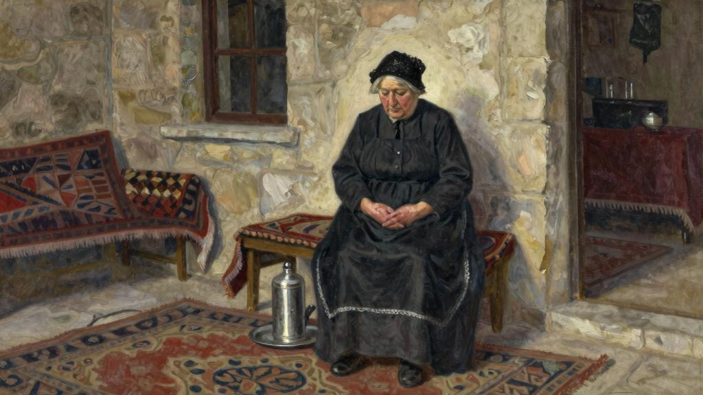
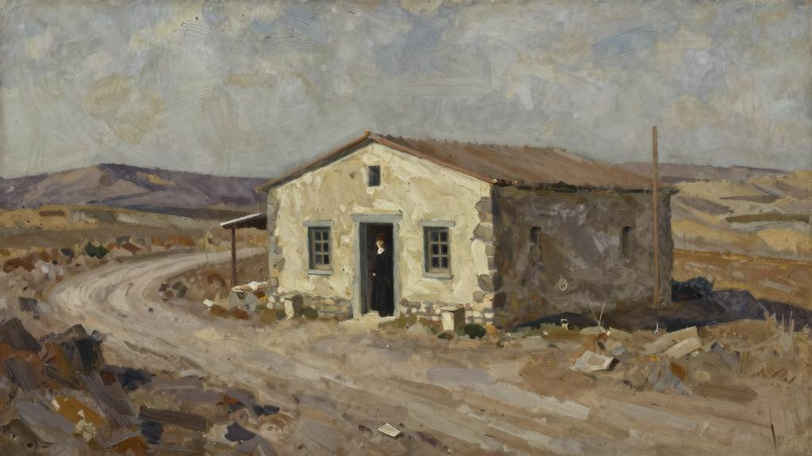
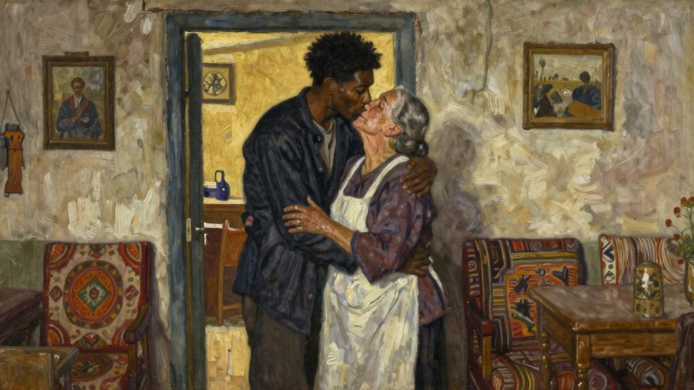

我是一个喜欢由着性子云游四方的人，不过，旅游并不是为了去看那些气势宏伟的纪念碑，那些东西实在让觉得没多大意思，也不是为了欣赏什么美丽的风景，因为很快就会玩累了。出去旅游是为了看人。不过，对于那些大人物，是能避则避的，即便某个总统或国王就在马路对面，也不会横穿马路前去觐见他们；如果能够通过阅读书籍来了解作者，通过欣赏画作来认识画家，会感到心满意足的；然而，在旅游的时候，会不辞劳苦地走上一百里格[55]的路前去看望一位传教士，就因为之前听到过有关他的一段传奇经历，也可以在某个条件极差的旅馆里住上两个星期，目的只是为了增进与某个台球计分员的交情。不妨这样说吧，这世上有一类人，不仅经常偶然碰到，而且每次都会令在深感惊讶的同时，还能体会到一点儿别样的乐趣，若不是因为这样，无论遇见什么样的人，都不会感到诧异的。那些上了年纪的英国女人就属于这类人，她们通常都拥有充足的财富，人们却发现她们独自生活在天南地北，生活在这世上令人意想不到的地方。如果你听说她住在意大利某个小镇外的某幢山顶别墅里，是附近这一带唯独仅有的英国妇女，你会觉得，这并不足为奇，在安达卢西亚[56]，倘若有人把一座孤零零的大庄园[57]指给你看，告诉你说，有一位英国贵妇已经在那里居住多年了，你对此差不多也早有思想准备了。但是，如果你听到有人说，在中国的某个城市里，唯独仅有的一个白人是一位英国女士，而她既不是一名传教士，也没人知道她为什么住在那里，这就不免让人有些惊奇了；同样令人惊奇的是，在南太平洋的某个岛屿上也生活着这样一个英国女人，在爪哇岛[58]腹地的某个大村子的村头，也有一位英国女人独居在一幢孟加拉式的平房里。这些女人啊，她们过着遁世隐居的生活，既没有朋友，也不欢迎陌生人来访。虽然她们或许已经长年累月没看见过她们自己这个种族的人了，路上遇到你时，照样会扬长而去，好像压根儿就没看见你似的。要是你滥用自己的国籍，冒昧地前去拜访她们，那她们很可能会让你吃闭门羹；但是，如果她们让你进门了，就会从银质茶壶里给你倒一杯茶，用老伍斯特郡产的瓷盘给你端上些具有苏格兰风味的司康饼。她们会彬彬有礼地和你交谈，仿佛她们是在肯特郡教区牧师的住

宅里招待你一样，不过，等你告辞的时候，她们绝不会流露出任何具体的还想和你继续交往下去的愿望。人们不禁会白费力气地瞎猜疑，到底是什么莫名其妙的冲动促使她们要与自己的亲朋好友相分离，要舍弃她们天生就喜欢的一切兴趣爱好，就这样隐居在一片异国他乡的？她们究竟是为了追寻浪漫，还是为了追寻自由呢？但是，在遇见过的，或者仅仅听说过的所有这些英国妇人当中（因为前面已经说过，这些人很难接近），有一位在的记忆里至今依然栩栩如生，那是一位上了年纪的老妇人，居住在小亚细亚[59]。那时，经过一段冗长乏味的旅途之后，来到了一个小镇上，打算再从那里出发，去攀登一座闻名遐迩的高山，于是，他们便带去了坐落在山脚下的一家布局杂乱无章的旅馆。那天夜里，很晚才到，在旅客登记簿上签上了的名字。上楼来到自己的房间。屋里很冷，换衣服的时候被冻得浑身瑟瑟发抖，不过，没过一会儿，就听到门口有人在敲门，那个导游兼翻译走进屋来。

“这是尼克里尼夫人[60]吩咐给你送过来的。”他说。

让大为惊讶的是，他递给的是一个热水瓶。感激不尽地伸出双手接了过来。

“尼克里尼夫人是谁？”问道。

“她是这家旅馆的老板。”他答道。

让导游向她表示感谢，他随后便转身退了出去。怎么也想不到，在小亚细亚的一家很不起眼的小旅馆里，而且还是由一个年迈的意大利女人所经营的，竟然有这样一个精美的热水瓶。现在最想要的东西莫过于热水瓶了（要不是因为他们都对这场战争嫌恶得要死，倒可以跟大家讲一个故事，这个故事说的是，在佛兰德斯[61]正在遭受狂轰滥炸的时候，有六个男人是如何冒着生命危险从一个庄园里去拿热水瓶的）；于是，第二天一早，就问导游是否可以见一见尼克里尼夫人，这样可以当面向她表示感谢。在等着见她的时候，绞尽脑汁地思索着“热水瓶”这个词用意大利语该怎么说。

过了一会儿，她进来了。她是个身段矮矮胖胖的妇女，举止不无庄重，身上系着一条镶

着蕾丝花边的黑围裙，头戴一顶小小的黑色蕾丝帽。她交叉着双手站在那儿。这副模样让大为惊讶，因为她看上去确实很像是英国某个豪门望族家里的女管家。

“先生，您有话要跟说？”

她是一个英国女人，因为单凭这几个词，就确切无疑地听出了她话音里带有一丝伦敦东区的口音。

“想感谢你给送来了这只热水瓶。”有点儿不知所措地说。

“先生，从访客登记簿里看到，您是英国人，向来都会给英国来的绅士他们送一个热水瓶过来。”

“说真的，这个做法很让人受用的。”

“先生，为已经故去的奥姆斯葛克勋爵服务了很多年。他以前出去旅游的时候，每次都会带着热水瓶。还有什么别的事儿吗？”

“眼下没有了，谢谢你。”

她彬彬有礼地朝微微点了点头，随即便转身退了出去。有点纳闷，不知像这样一个滑稽可笑的英国老妇人怎么会摇身一变，就成了小亚细亚一家旅馆的老板娘。要想跟她套近乎可不容易，因为她很清楚自己的身份，她本人大概也经常会摆出这副老板娘的派头，所以才始终与保持着一定距离。她在一户英国贵族家庭里当用人也不是一无所图地白干的。但是，一再坚持，终于说动了她，这才邀请在她自己的小客厅里喝了一杯茶。因此而得知，她曾经是某位奥姆斯葛克夫人的贴身侍女，而尼克里尼先生[62]则是勋爵老爷的厨师（提起她那位已经作古的丈夫时，她只用这个称谓）。尼克里尼先生是一位相貌英俊的男人，多年来，他们俩一直“情投意合”。等到俩人都积攒下了数额客观的一笔钱时，他们就结了婚，并辞去了这份伺候人的差事，想寻觅一家旅馆自己来经营。他们在一则广告上看到了这家旅馆，便把它买了下来，因为尼克里尼先生觉得，他也该在这世上闯荡一下，长长见识才对。那都是将近三十年前的事了，尼克里

尼先生去世也有十五年了。从那之后，他的遗孀一次都没有回过英国。问她是否从来都不怀念家乡。

“这样说，并不等于不想回去看上一眼，尽管也能估计到，那边恐怕已经有了翻天覆地的变化。但是，家人当年不喜欢决意要跟一个外国人结婚的念头，打那以后，就没跟他们说过话。当然，这边有很多事情跟家乡那边大不一样，不过，让人惊奇的是，你渐渐对什么都习以为常了。见过不少大世面。现在也说不清，他们在伦敦那种地方过的那种单调乏味的生活，是不是还过得惯。”

笑了笑。因为她说出来的话与她的仪态很不协调，真让人不可思议。她不啻为遵从上流社会礼仪习俗的典范。她居然能够在这片荒无人烟、简直尚未开化的乡野里生活了三十年之久而丝毫未受其影响，这太令人匪夷所思了。尽管不懂土耳其语，而她能流畅地说这门语言，但坚信，她说出的土耳其语绝大部分都不正确，而且还带着浓重的伦敦东区的乡土音。估计，虽然她经历了这么多的枯荣沉浮，但她依然还是原来那个一丝不苟、拘谨古板、侍奉英国贵妇的女仆，时刻知道自己的身份，因为她早已对什么都见惯不怪、荣辱不惊了。她把一切事物的来临都当作理所当然的事。但凡不是从英国来的人，她一律都视其为外国人，因而才会把某某人当作近乎于弱智的愚蠢之人，因而才认为，必须对此人的所作所为予以体谅。她以暴虐的手段统治着自己的员工——难不成连她都不懂一个大户人家的上级仆人该怎样行使自己的权威向下级仆人发号施令吗？——因此，旅馆里处处都收拾得干干净净、井井有条。

“只是尽所能罢了。”就这一点向她表示祝贺时，她说，依旧站着，如同她每次和说话时那样，双手也恭恭敬敬地交叉着。“当然，他们不能指望外国人的思想观念跟他们的思想观念一模一样，但是，就像老爷以前经常对说的，们务必要做的事情，帕克啊，他对说，他们这辈子务必要做的事情是，一定要充分利用好他们现有的原材料。”但是，她把自己最令人惊奇的一大秘密一直保留到临走的前夕才说出来。

“先生，趁您还没走，很想请您见见的两个儿子。”

“还不知道你有孩子呢。”

“他们一直在外出差嘛，不过，他们刚刚回来了。您见到他们保准会大吃一惊的。

可以这样说，他们是亲手调教出来的，所以，等哪天去世后，他们弟兄俩会继续经营这家旅馆的。”

过了一会儿，两个身材高挑、肤色黝黑、体格健硕的年轻小伙子走进了大厅。她顿时两眼放光，露出了喜色。他们迎面朝她走来，拥抱了她，啧啧有声地亲吻了她。

“先生，他们不会说英语，但是，他们能听得懂一点儿英语，当然，他们会说土耳其语，说得和当地人一样流利，还会说希腊语和意大利语呢。”和这对兄弟握了握手，随后，尼克里尼夫人朝他们吩咐了几句，他们就走开了。

“太太，他们很英俊，”说，“你一定为他们感到很自豪吧。”

“是啊，先生，他们是好孩子，两个都是。他们从来没有给惹过一丁点儿麻烦，从出生那天起就没有，而且他们长得也活像尼克里尼先生。”

“敢说，没有人会想到他们的母亲是一个英国人。”

“先生，确切地说，并不是他们的生母；刚才就是吩咐他们去向她问好的。”

想，当时大概显得有点儿困惑不解了。

“他们是尼克里尼先生跟一个希腊姑娘生的儿子，那姑娘以前一直是这个旅馆的员工，由于自己没生孩子，就收养了他们。”

搜肠刮肚地想找出一句话来说。

“但愿您别认为尼克里尼先生有什么该受指责的地方，”她说着，稍微挺直了腰板，“先生，可不愿让您这么想。”她又把两只手重叠起来，带着自尊、拘谨、满足都

兼而有之的神情，补上了最后一句：“尼克里尼先生是一个精力旺盛、非常好色的男人。”